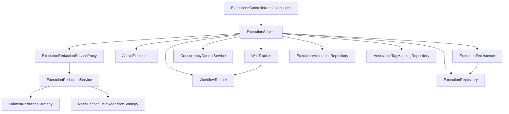
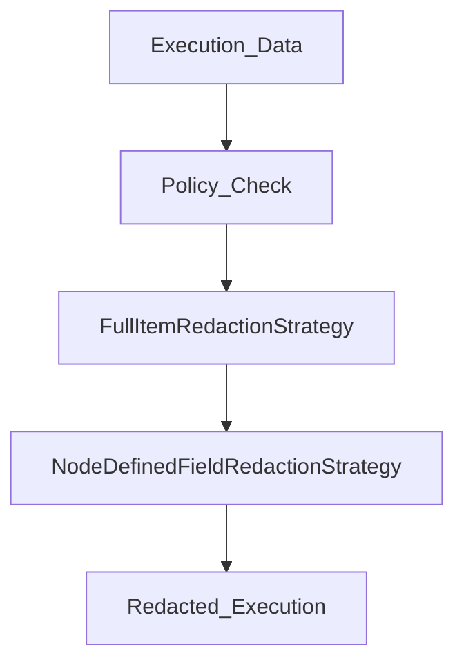

# Execution Management API

Relevant source files

-   [packages/@n8n/db/src/entities/types-db.ts](https://github.com/n8n-io/n8n/blob/88f170b9/packages/@n8n/db/src/entities/types-db.ts)
-   [packages/cli/src/errors/aborted-execution-retry.error.ts](https://github.com/n8n-io/n8n/blob/88f170b9/packages/cli/src/errors/aborted-execution-retry.error.ts)
-   [packages/cli/src/errors/missing-execution-stop.error.ts](https://github.com/n8n-io/n8n/blob/88f170b9/packages/cli/src/errors/missing-execution-stop.error.ts)
-   [packages/cli/src/errors/response-errors/scope-forbidden.error.ts](https://github.com/n8n-io/n8n/blob/88f170b9/packages/cli/src/errors/response-errors/scope-forbidden.error.ts)
-   [packages/cli/src/executions/\_\_tests\_\_/execution.service.test.ts](https://github.com/n8n-io/n8n/blob/88f170b9/packages/cli/src/executions/__tests__/execution.service.test.ts)
-   [packages/cli/src/executions/\_\_tests\_\_/executions.controller.test.ts](https://github.com/n8n-io/n8n/blob/88f170b9/packages/cli/src/executions/__tests__/executions.controller.test.ts)
-   [packages/cli/src/executions/execution-redaction.ts](https://github.com/n8n-io/n8n/blob/88f170b9/packages/cli/src/executions/execution-redaction.ts)
-   [packages/cli/src/executions/execution.service.ts](https://github.com/n8n-io/n8n/blob/88f170b9/packages/cli/src/executions/execution.service.ts)
-   [packages/cli/src/executions/execution.types.ts](https://github.com/n8n-io/n8n/blob/88f170b9/packages/cli/src/executions/execution.types.ts)
-   [packages/cli/src/executions/executions.controller.ts](https://github.com/n8n-io/n8n/blob/88f170b9/packages/cli/src/executions/executions.controller.ts)
-   [packages/cli/src/modules/redaction/executions/\_\_tests\_\_/execution-redaction.service.test.ts](https://github.com/n8n-io/n8n/blob/88f170b9/packages/cli/src/modules/redaction/executions/__tests__/execution-redaction.service.test.ts)
-   [packages/cli/src/modules/redaction/executions/execution-redaction.interfaces.ts](https://github.com/n8n-io/n8n/blob/88f170b9/packages/cli/src/modules/redaction/executions/execution-redaction.interfaces.ts)
-   [packages/cli/src/modules/redaction/executions/execution-redaction.service.ts](https://github.com/n8n-io/n8n/blob/88f170b9/packages/cli/src/modules/redaction/executions/execution-redaction.service.ts)
-   [packages/cli/src/modules/redaction/executions/strategies/\_\_tests\_\_/full-item-redaction.strategy.test.ts](https://github.com/n8n-io/n8n/blob/88f170b9/packages/cli/src/modules/redaction/executions/strategies/__tests__/full-item-redaction.strategy.test.ts)
-   [packages/cli/src/modules/redaction/executions/strategies/\_\_tests\_\_/node-defined-field-redaction.strategy.test.ts](https://github.com/n8n-io/n8n/blob/88f170b9/packages/cli/src/modules/redaction/executions/strategies/__tests__/node-defined-field-redaction.strategy.test.ts)
-   [packages/cli/src/modules/redaction/executions/strategies/full-item-redaction.strategy.ts](https://github.com/n8n-io/n8n/blob/88f170b9/packages/cli/src/modules/redaction/executions/strategies/full-item-redaction.strategy.ts)
-   [packages/cli/src/modules/redaction/executions/strategies/node-defined-field-redaction.strategy.ts](https://github.com/n8n-io/n8n/blob/88f170b9/packages/cli/src/modules/redaction/executions/strategies/node-defined-field-redaction.strategy.ts)
-   [packages/cli/src/services/naming.service.ts](https://github.com/n8n-io/n8n/blob/88f170b9/packages/cli/src/services/naming.service.ts)
-   [packages/cli/test/integration/database/repositories/execution.repository.test.ts](https://github.com/n8n-io/n8n/blob/88f170b9/packages/cli/test/integration/database/repositories/execution.repository.test.ts)
-   [packages/cli/test/integration/execution-redaction.test.ts](https://github.com/n8n-io/n8n/blob/88f170b9/packages/cli/test/integration/execution-redaction.test.ts)
-   [packages/cli/test/integration/execution.service.integration.test.ts](https://github.com/n8n-io/n8n/blob/88f170b9/packages/cli/test/integration/execution.service.integration.test.ts)
-   [packages/frontend/editor-ui/src/features/ai/chatHub/components/CredentialSelectorModal.vue](https://github.com/n8n-io/n8n/blob/88f170b9/packages/frontend/editor-ui/src/features/ai/chatHub/components/CredentialSelectorModal.vue)
-   [packages/frontend/editor-ui/src/features/ai/chatHub/module.descriptor.ts](https://github.com/n8n-io/n8n/blob/88f170b9/packages/frontend/editor-ui/src/features/ai/chatHub/module.descriptor.ts)
-   [packages/frontend/editor-ui/src/features/execution/executions/components/ExecutionsFilter.test.ts](https://github.com/n8n-io/n8n/blob/88f170b9/packages/frontend/editor-ui/src/features/execution/executions/components/ExecutionsFilter.test.ts)
-   [packages/frontend/editor-ui/src/features/execution/executions/components/ExecutionsFilter.vue](https://github.com/n8n-io/n8n/blob/88f170b9/packages/frontend/editor-ui/src/features/execution/executions/components/ExecutionsFilter.vue)
-   [packages/frontend/editor-ui/src/features/execution/executions/components/workflow/WorkflowExecutionsSidebar.vue](https://github.com/n8n-io/n8n/blob/88f170b9/packages/frontend/editor-ui/src/features/execution/executions/components/workflow/WorkflowExecutionsSidebar.vue)
-   [packages/frontend/editor-ui/src/features/execution/executions/executions.types.ts](https://github.com/n8n-io/n8n/blob/88f170b9/packages/frontend/editor-ui/src/features/execution/executions/executions.types.ts)
-   [packages/frontend/editor-ui/src/features/execution/executions/executions.utils.test.ts](https://github.com/n8n-io/n8n/blob/88f170b9/packages/frontend/editor-ui/src/features/execution/executions/executions.utils.test.ts)
-   [packages/frontend/editor-ui/src/features/execution/executions/executions.utils.ts](https://github.com/n8n-io/n8n/blob/88f170b9/packages/frontend/editor-ui/src/features/execution/executions/executions.utils.ts)
-   [packages/workflow/src/constants.ts](https://github.com/n8n-io/n8n/blob/88f170b9/packages/workflow/src/constants.ts)
-   [packages/workflow/src/interfaces.ts](https://github.com/n8n-io/n8n/blob/88f170b9/packages/workflow/src/interfaces.ts)
-   [packages/workflow/src/telemetry-helpers.ts](https://github.com/n8n-io/n8n/blob/88f170b9/packages/workflow/src/telemetry-helpers.ts)
-   [packages/workflow/test/telemetry-helpers.test.ts](https://github.com/n8n-io/n8n/blob/88f170b9/packages/workflow/test/telemetry-helpers.test.ts)

This page covers the API and service layer responsible for querying, stopping, retrying, deleting, and annotating workflow executions after they have been created. It also covers the persistence model for execution data, automatic resumption of paused executions via `WaitTracker`, and the execution data redaction system.

For the mechanics of *starting* an execution and how it runs through nodes, see page [2.1](https://github.com/n8n-io/n8n/blob/88f170b9/2.1) For distributed queue-mode execution, see page [2.2](https://github.com/n8n-io/n8n/blob/88f170b9/2.2) For the Workflows API that creates and saves workflow definitions, see page [3.1](https://github.com/n8n-io/n8n/blob/88f170b9/3.1)

---

## Component Overview

The execution management stack sits between the HTTP layer and the database. The principal classes involved are:

| Class | Location | Role |
| --- | --- | --- |
| `ExecutionsController` | `packages/cli/src/executions/executions.controller.ts` | REST endpoint handler (`/rest/executions`) |
| `ExecutionService` | `packages/cli/src/executions/execution.service.ts` | Business logic: find, retry, stop, delete, annotate |
| `ExecutionRepository` | `packages/cli/src/executions/execution.repository.ts` | TypeORM repository for all execution persistence |
| `ExecutionPersistence` | `packages/cli/src/executions/execution-persistence.ts` | Wraps bulk delete and pruning |
| `ExecutionRedactionServiceProxy` | `packages/cli/src/executions/execution-redaction-proxy.service.ts` | Routes redaction to real or no-op service based on feature flag |
| `ExecutionRedactionService` | `packages/cli/src/modules/redaction/executions/execution-redaction.service.ts` | Orchestrates execution data redaction based on workflow policy |
| `ActiveExecutions` | `packages/cli/src/active-executions.ts` | In-memory map of currently-running executions |
| `WaitTracker` | `packages/cli/src/wait-tracker.ts` | Resumes executions paused at a Wait node |

**Component Dependency Diagram**


Sources: [packages/cli/src/executions/execution.service.ts106-125](https://github.com/n8n-io/n8n/blob/88f170b9/packages/cli/src/executions/execution.service.ts#L106-L125) [packages/cli/src/modules/redaction/executions/execution-redaction.service.ts37-44](https://github.com/n8n-io/n8n/blob/88f170b9/packages/cli/src/modules/redaction/executions/execution-redaction.service.ts#L37-L44)

---

## Execution Status State Machine

Executions move through a defined set of statuses tracked in `ExecutionEntity.status`.

**Execution Status Lifecycle**

> **[Mermaid stateDiagram]**
> *(图表结构无法解析)*

Sources: [packages/cli/src/executions/execution.service.ts30-39](https://github.com/n8n-io/n8n/blob/88f170b9/packages/cli/src/executions/execution.service.ts#L30-L39) [packages/@n8n/db/src/entities/types-db.ts60-63](https://github.com/n8n-io/n8n/blob/88f170b9/packages/@n8n/db/src/entities/types-db.ts#L60-L63)

---

## ExecutionService Operations

`ExecutionService` is the single entry point for all execution management actions. It enforces access control by accepting `sharedWorkflowIds` (the set of workflow IDs the requesting user can access) for every query.

### Finding Executions

```
async findOne(req: ExecutionRequest.GetOne | ExecutionRequest.Update, sharedWorkflowIds: string[])async getLastSuccessfulExecution(workflowId: string, user: User, redactExecutionData?: boolean)
```
`findOne` calls `ExecutionRepository.findIfSharedUnflatten`, which enforces project-level access. After retrieval, the execution data is processed through the redaction pipeline via `ExecutionRedactionServiceProxy.processExecution`.

**Redaction Query Parameter**

The `redactExecutionData` query parameter controls whether execution data should be redacted or revealed:

| Value | Behavior |
| --- | --- |
| `undefined` (default) | Apply redaction according to workflow's `redactionPolicy` setting |
| `true` | Force redaction regardless of policy |
| `false` | Attempt to reveal data (requires `execution:reveal` scope on the workflow) |

When `redactExecutionData=false` is passed, `ExecutionRedactionService` validates that the user has the `execution:reveal` scope. If permission is denied, it emits an `execution-data-reveal-failure` event and throws `ScopeForbiddenError`.

The list query (`GET /rest/executions`) uses `schemaGetExecutionsQueryFilter` to validate and whitelist the allowed filter fields.

**Allowed filter fields** (from `allowedExecutionsQueryFilterFields`):

-   `id`, `finished`, `mode`, `retryOf`, `retrySuccessId`, `status`, `waitTill`, `workflowId`, `metadata`, `startedAfter`, `startedBefore`, `annotationTags`, `vote`, `projectId`, `workflowVersionId`.

Sources: [packages/cli/src/executions/execution.service.ts60-103](https://github.com/n8n-io/n8n/blob/88f170b9/packages/cli/src/executions/execution.service.ts#L60-L103) [packages/cli/src/executions/execution.service.ts127-167](https://github.com/n8n-io/n8n/blob/88f170b9/packages/cli/src/executions/execution.service.ts#L127-L167) [packages/cli/src/modules/redaction/executions/execution-redaction.service.ts95-122](https://github.com/n8n-io/n8n/blob/88f170b9/packages/cli/src/modules/redaction/executions/execution-redaction.service.ts#L95-L122)

---

### Retrying an Execution

`retry(req, sharedWorkflowIds)` re-runs a previously failed execution from the point of failure.

**Retry Flow**

> **[Mermaid sequence]**
> *(图表结构无法解析)*

Key validations before retry:

-   Status `new` → throws `QueuedExecutionRetryError` [packages/cli/src/executions/execution.service.ts221](https://github.com/n8n-io/n8n/blob/88f170b9/packages/cli/src/executions/execution.service.ts#L221-L221)
-   Missing `executionData` → throws `AbortedExecutionRetryError` [packages/cli/src/executions/execution.service.ts223](https://github.com/n8n-io/n8n/blob/88f170b9/packages/cli/src/executions/execution.service.ts#L223-L223)
-   `finished == true` → throws `UnexpectedError` [packages/cli/src/executions/execution.service.ts225](https://github.com/n8n-io/n8n/blob/88f170b9/packages/cli/src/executions/execution.service.ts#L225-L225)

Sources: [packages/cli/src/executions/execution.service.ts200-328](https://github.com/n8n-io/n8n/blob/88f170b9/packages/cli/src/executions/execution.service.ts#L200-L328)

---

### Stopping an Execution

`stop(executionId, sharedWorkflowIds)` terminates a running or waiting execution.

**Stop Logic**

-   If the execution is in the concurrency queue, it is removed via `ConcurrencyControlService.remove()`.
-   If active, `ActiveExecutions.stopExecution()` is called with a `ManualExecutionCancelledError`.
-   If waiting, `WaitTracker.stopExecution()` is called.

Sources: [packages/cli/src/executions/execution.service.ts542-639](https://github.com/n8n-io/n8n/blob/88f170b9/packages/cli/src/executions/execution.service.ts#L542-L639)

---

## Execution Redaction System

The `ExecutionRedactionService` orchestrates the pipeline that hides sensitive data from API responses based on workflow settings.

### Redaction Strategies

1.  **FullItemRedactionStrategy**: Clears all items (JSON and Binary) if the policy matches the execution mode (e.g., policy `non-manual` on a `trigger` execution).
2.  **NodeDefinedFieldRedactionStrategy**: Redacts specific fields declared as sensitive by the node type (e.g., password fields in an HTTP Request node).

**Redaction Pipeline Flow**


### Dynamic Credentials

Executions that used dynamic credentials (e.g., resolving credentials via expressions at runtime) can **never** be revealed, even if the user has the `execution:reveal` scope. This is a hard security boundary enforced in `ExecutionRedactionService.processExecutions`.

Sources: [packages/cli/src/modules/redaction/executions/execution-redaction.service.ts37-177](https://github.com/n8n-io/n8n/blob/88f170b9/packages/cli/src/modules/redaction/executions/execution-redaction.service.ts#L37-L177) [packages/cli/src/modules/redaction/executions/execution-redaction.service.ts95-101](https://github.com/n8n-io/n8n/blob/88f170b9/packages/cli/src/modules/redaction/executions/execution-redaction.service.ts#L95-L101)

---

## Data Persistence

### ExecutionRepository

`ExecutionRepository` manages the lifecycle of `ExecutionEntity` and its associated data.

**Key Database Operations**

-   `findIfSharedUnflatten`: Retrieves execution data only if it belongs to a workflow shared with the user.
-   `findWithUnflattenedData`: Retrieves execution data and converts the `flatted` string back into an `IRunExecutionData` object.
-   `findByStopExecutionsFilter`: Used to find multiple executions for batch stop operations based on status and time ranges.

Sources: [packages/cli/src/executions/execution.service.ts134-137](https://github.com/n8n-io/n8n/blob/88f170b9/packages/cli/src/executions/execution.service.ts#L134-L137) [packages/cli/test/integration/database/repositories/execution.repository.test.ts64-186](https://github.com/n8n-io/n8n/blob/88f170b9/packages/cli/test/integration/database/repositories/execution.repository.test.ts#L64-L186)

### Execution Data Format

Execution data is stored as a stringified JSON using the `flatted` library to handle circular references in the execution graph. Versioning is used to handle migrations (e.g., migrating `IRunExecutionDataV0` to `V1`).

Sources: [packages/cli/test/integration/database/repositories/execution.repository.test.ts21-62](https://github.com/n8n-io/n8n/blob/88f170b9/packages/cli/test/integration/database/repositories/execution.repository.test.ts#L21-L62) [packages/@n8n/db/src/entities/types-db.ts170-175](https://github.com/n8n-io/n8n/blob/88f170b9/packages/@n8n/db/src/entities/types-db.ts#L170-L175)

---

## WaitTracker and ActiveExecutions

### WaitTracker

Monitors executions with status `waiting`. It handles the resumption of workflows that are paused at a `Wait` node. It uses a `stopExecution` method to clean up waiting executions when they are manually cancelled.

Sources: [packages/cli/src/executions/execution.service.ts52](https://github.com/n8n-io/n8n/blob/88f170b9/packages/cli/src/executions/execution.service.ts#L52-L52) [packages/cli/src/executions/execution.service.ts614](https://github.com/n8n-io/n8n/blob/88f170b9/packages/cli/src/executions/execution.service.ts#L614-L614)

### ActiveExecutions

An in-memory tracker for executions currently running on the local instance.

-   `getPostExecutePromise(id)`: Allows other services to await the completion of a background execution.
-   `stopExecution(id, error)`: Signals the workflow runner to terminate the execution.

Sources: [packages/cli/src/executions/execution.service.ts41](https://github.com/n8n-io/n8n/blob/88f170b9/packages/cli/src/executions/execution.service.ts#L41-L41) [packages/cli/src/executions/execution.service.ts258-261](https://github.com/n8n-io/n8n/blob/88f170b9/packages/cli/src/executions/execution.service.ts#L258-L261)
