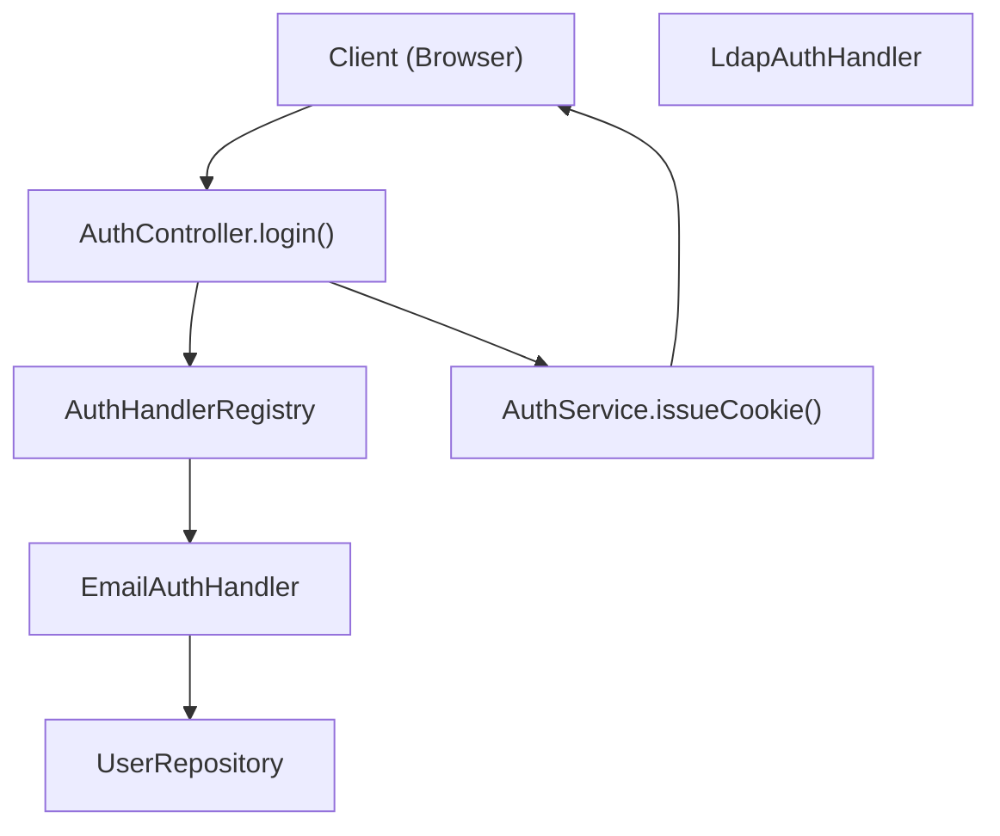
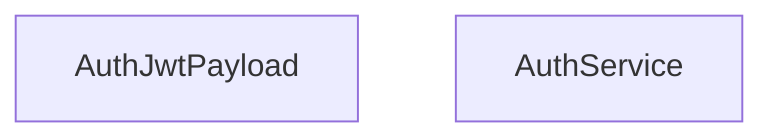

# User Management and Authentication

Relevant source files

-   [packages/@n8n/api-types/src/dto/auth/\_\_tests\_\_/resolve-signup-token-query.dto.test.ts](https://github.com/n8n-io/n8n/blob/88f170b9/packages/@n8n/api-types/src/dto/auth/__tests__/resolve-signup-token-query.dto.test.ts)
-   [packages/@n8n/api-types/src/dto/auth/resolve-signup-token-query.dto.ts](https://github.com/n8n-io/n8n/blob/88f170b9/packages/@n8n/api-types/src/dto/auth/resolve-signup-token-query.dto.ts)
-   [packages/@n8n/api-types/src/dto/invitation/\_\_tests\_\_/accept-invitation-request.dto.test.ts](https://github.com/n8n-io/n8n/blob/88f170b9/packages/@n8n/api-types/src/dto/invitation/__tests__/accept-invitation-request.dto.test.ts)
-   [packages/@n8n/api-types/src/dto/invitation/accept-invitation-request.dto.ts](https://github.com/n8n-io/n8n/blob/88f170b9/packages/@n8n/api-types/src/dto/invitation/accept-invitation-request.dto.ts)
-   [packages/@n8n/api-types/src/dto/oidc/config.dto.ts](https://github.com/n8n-io/n8n/blob/88f170b9/packages/@n8n/api-types/src/dto/oidc/config.dto.ts)
-   [packages/@n8n/api-types/src/dto/provisioning/config.dto.ts](https://github.com/n8n-io/n8n/blob/88f170b9/packages/@n8n/api-types/src/dto/provisioning/config.dto.ts)
-   [packages/@n8n/api-types/src/dto/saml/\_\_tests\_\_/saml-preferences.dto.test.ts](https://github.com/n8n-io/n8n/blob/88f170b9/packages/@n8n/api-types/src/dto/saml/__tests__/saml-preferences.dto.test.ts)
-   [packages/@n8n/api-types/src/dto/saml/saml-preferences.dto.ts](https://github.com/n8n-io/n8n/blob/88f170b9/packages/@n8n/api-types/src/dto/saml/saml-preferences.dto.ts)
-   [packages/@n8n/config/src/configs/sso.config.ts](https://github.com/n8n-io/n8n/blob/88f170b9/packages/@n8n/config/src/configs/sso.config.ts)
-   [packages/cli/src/auth/\_\_tests\_\_/auth-service-browser-id-whitelist.test.ts](https://github.com/n8n-io/n8n/blob/88f170b9/packages/cli/src/auth/__tests__/auth-service-browser-id-whitelist.test.ts)
-   [packages/cli/src/auth/\_\_tests\_\_/auth.service.test.ts](https://github.com/n8n-io/n8n/blob/88f170b9/packages/cli/src/auth/__tests__/auth.service.test.ts)
-   [packages/cli/src/auth/auth.service.ts](https://github.com/n8n-io/n8n/blob/88f170b9/packages/cli/src/auth/auth.service.ts)
-   [packages/cli/src/auth/handlers/\_\_tests\_\_/email.auth-handler.test.ts](https://github.com/n8n-io/n8n/blob/88f170b9/packages/cli/src/auth/handlers/__tests__/email.auth-handler.test.ts)
-   [packages/cli/src/auth/handlers/email.auth-handler.ts](https://github.com/n8n-io/n8n/blob/88f170b9/packages/cli/src/auth/handlers/email.auth-handler.ts)
-   [packages/cli/src/auth/jwt.ts](https://github.com/n8n-io/n8n/blob/88f170b9/packages/cli/src/auth/jwt.ts)
-   [packages/cli/src/commands/user-management/reset.ts](https://github.com/n8n-io/n8n/blob/88f170b9/packages/cli/src/commands/user-management/reset.ts)
-   [packages/cli/src/controllers/\_\_tests\_\_/auth.controller.test.ts](https://github.com/n8n-io/n8n/blob/88f170b9/packages/cli/src/controllers/__tests__/auth.controller.test.ts)
-   [packages/cli/src/controllers/\_\_tests\_\_/invitation.controller.test.ts](https://github.com/n8n-io/n8n/blob/88f170b9/packages/cli/src/controllers/__tests__/invitation.controller.test.ts)
-   [packages/cli/src/controllers/\_\_tests\_\_/me.controller.test.ts](https://github.com/n8n-io/n8n/blob/88f170b9/packages/cli/src/controllers/__tests__/me.controller.test.ts)
-   [packages/cli/src/controllers/auth.controller.ts](https://github.com/n8n-io/n8n/blob/88f170b9/packages/cli/src/controllers/auth.controller.ts)
-   [packages/cli/src/controllers/invitation.controller.ts](https://github.com/n8n-io/n8n/blob/88f170b9/packages/cli/src/controllers/invitation.controller.ts)
-   [packages/cli/src/controllers/me.controller.ts](https://github.com/n8n-io/n8n/blob/88f170b9/packages/cli/src/controllers/me.controller.ts)
-   [packages/cli/src/controllers/mfa.controller.ts](https://github.com/n8n-io/n8n/blob/88f170b9/packages/cli/src/controllers/mfa.controller.ts)
-   [packages/cli/src/controllers/owner.controller.ts](https://github.com/n8n-io/n8n/blob/88f170b9/packages/cli/src/controllers/owner.controller.ts)
-   [packages/cli/src/controllers/users.controller.ts](https://github.com/n8n-io/n8n/blob/88f170b9/packages/cli/src/controllers/users.controller.ts)
-   [packages/cli/src/mfa/mfa.service.ts](https://github.com/n8n-io/n8n/blob/88f170b9/packages/cli/src/mfa/mfa.service.ts)
-   [packages/cli/src/modules/mcp/\_\_tests\_\_/mcp.settings.service.test.ts](https://github.com/n8n-io/n8n/blob/88f170b9/packages/cli/src/modules/mcp/__tests__/mcp.settings.service.test.ts)
-   [packages/cli/src/modules/mcp/mcp.settings.service.ts](https://github.com/n8n-io/n8n/blob/88f170b9/packages/cli/src/modules/mcp/mcp.settings.service.ts)
-   [packages/cli/src/modules/provisioning.ee/\_\_tests\_\_/provisioning.controller.ee.test.ts](https://github.com/n8n-io/n8n/blob/88f170b9/packages/cli/src/modules/provisioning.ee/__tests__/provisioning.controller.ee.test.ts)
-   [packages/cli/src/modules/provisioning.ee/\_\_tests\_\_/provisioning.service.ee.test.ts](https://github.com/n8n-io/n8n/blob/88f170b9/packages/cli/src/modules/provisioning.ee/__tests__/provisioning.service.ee.test.ts)
-   [packages/cli/src/modules/provisioning.ee/provisioning.controller.ee.ts](https://github.com/n8n-io/n8n/blob/88f170b9/packages/cli/src/modules/provisioning.ee/provisioning.controller.ee.ts)
-   [packages/cli/src/modules/provisioning.ee/provisioning.service.ee.ts](https://github.com/n8n-io/n8n/blob/88f170b9/packages/cli/src/modules/provisioning.ee/provisioning.service.ee.ts)
-   [packages/cli/src/modules/sso-oidc/\_\_tests\_\_/oidc.controller.ee.test.ts](https://github.com/n8n-io/n8n/blob/88f170b9/packages/cli/src/modules/sso-oidc/__tests__/oidc.controller.ee.test.ts)
-   [packages/cli/src/modules/sso-oidc/\_\_tests\_\_/oidc.service.ee.test.ts](https://github.com/n8n-io/n8n/blob/88f170b9/packages/cli/src/modules/sso-oidc/__tests__/oidc.service.ee.test.ts)
-   [packages/cli/src/modules/sso-oidc/constants.ts](https://github.com/n8n-io/n8n/blob/88f170b9/packages/cli/src/modules/sso-oidc/constants.ts)
-   [packages/cli/src/modules/sso-oidc/oidc.controller.ee.ts](https://github.com/n8n-io/n8n/blob/88f170b9/packages/cli/src/modules/sso-oidc/oidc.controller.ee.ts)
-   [packages/cli/src/modules/sso-oidc/oidc.service.ee.ts](https://github.com/n8n-io/n8n/blob/88f170b9/packages/cli/src/modules/sso-oidc/oidc.service.ee.ts)
-   [packages/cli/src/modules/sso-saml/\_\_tests\_\_/saml-signing-test-fixtures.ts](https://github.com/n8n-io/n8n/blob/88f170b9/packages/cli/src/modules/sso-saml/__tests__/saml-signing-test-fixtures.ts)
-   [packages/cli/src/modules/sso-saml/\_\_tests\_\_/saml.controller.ee.test.ts](https://github.com/n8n-io/n8n/blob/88f170b9/packages/cli/src/modules/sso-saml/__tests__/saml.controller.ee.test.ts)
-   [packages/cli/src/modules/sso-saml/\_\_tests\_\_/saml.service.ee.test.ts](https://github.com/n8n-io/n8n/blob/88f170b9/packages/cli/src/modules/sso-saml/__tests__/saml.service.ee.test.ts)
-   [packages/cli/src/modules/sso-saml/saml-validator.ts](https://github.com/n8n-io/n8n/blob/88f170b9/packages/cli/src/modules/sso-saml/saml-validator.ts)
-   [packages/cli/src/modules/sso-saml/saml.controller.ee.ts](https://github.com/n8n-io/n8n/blob/88f170b9/packages/cli/src/modules/sso-saml/saml.controller.ee.ts)
-   [packages/cli/src/modules/sso-saml/saml.service.ee.ts](https://github.com/n8n-io/n8n/blob/88f170b9/packages/cli/src/modules/sso-saml/saml.service.ee.ts)
-   [packages/cli/src/requests.ts](https://github.com/n8n-io/n8n/blob/88f170b9/packages/cli/src/requests.ts)
-   [packages/cli/src/services/\_\_tests\_\_/hooks.service.test.ts](https://github.com/n8n-io/n8n/blob/88f170b9/packages/cli/src/services/__tests__/hooks.service.test.ts)
-   [packages/cli/src/services/\_\_tests\_\_/url.service.test.ts](https://github.com/n8n-io/n8n/blob/88f170b9/packages/cli/src/services/__tests__/url.service.test.ts)
-   [packages/cli/src/services/\_\_tests\_\_/user.service.test.ts](https://github.com/n8n-io/n8n/blob/88f170b9/packages/cli/src/services/__tests__/user.service.test.ts)
-   [packages/cli/src/services/hooks.service.ts](https://github.com/n8n-io/n8n/blob/88f170b9/packages/cli/src/services/hooks.service.ts)
-   [packages/cli/src/services/jwt.service.ts](https://github.com/n8n-io/n8n/blob/88f170b9/packages/cli/src/services/jwt.service.ts)
-   [packages/cli/src/services/url.service.ts](https://github.com/n8n-io/n8n/blob/88f170b9/packages/cli/src/services/url.service.ts)
-   [packages/cli/src/services/user.service.ts](https://github.com/n8n-io/n8n/blob/88f170b9/packages/cli/src/services/user.service.ts)
-   [packages/cli/src/sso.ee/\_\_tests\_\_/sso-helpers.test.ts](https://github.com/n8n-io/n8n/blob/88f170b9/packages/cli/src/sso.ee/__tests__/sso-helpers.test.ts)
-   [packages/cli/src/sso.ee/sso-helpers.ts](https://github.com/n8n-io/n8n/blob/88f170b9/packages/cli/src/sso.ee/sso-helpers.ts)
-   [packages/cli/test/integration/auth.api.test.ts](https://github.com/n8n-io/n8n/blob/88f170b9/packages/cli/test/integration/auth.api.test.ts)
-   [packages/cli/test/integration/auth.mw.test.ts](https://github.com/n8n-io/n8n/blob/88f170b9/packages/cli/test/integration/auth.mw.test.ts)
-   [packages/cli/test/integration/commands/reset.cmd.test.ts](https://github.com/n8n-io/n8n/blob/88f170b9/packages/cli/test/integration/commands/reset.cmd.test.ts)
-   [packages/cli/test/integration/me.api.test.ts](https://github.com/n8n-io/n8n/blob/88f170b9/packages/cli/test/integration/me.api.test.ts)
-   [packages/cli/test/integration/mfa/mfa.api.test.ts](https://github.com/n8n-io/n8n/blob/88f170b9/packages/cli/test/integration/mfa/mfa.api.test.ts)
-   [packages/cli/test/integration/oidc/oidc.service.ee.test.ts](https://github.com/n8n-io/n8n/blob/88f170b9/packages/cli/test/integration/oidc/oidc.service.ee.test.ts)
-   [packages/cli/test/integration/owner.api.test.ts](https://github.com/n8n-io/n8n/blob/88f170b9/packages/cli/test/integration/owner.api.test.ts)
-   [packages/cli/test/integration/saml/saml-helpers.test.ts](https://github.com/n8n-io/n8n/blob/88f170b9/packages/cli/test/integration/saml/saml-helpers.test.ts)
-   [packages/cli/test/integration/saml/saml.api.test.ts](https://github.com/n8n-io/n8n/blob/88f170b9/packages/cli/test/integration/saml/saml.api.test.ts)
-   [packages/cli/test/integration/saml/sample-metadata.ts](https://github.com/n8n-io/n8n/blob/88f170b9/packages/cli/test/integration/saml/sample-metadata.ts)
-   [packages/cli/test/integration/shared/constants.ts](https://github.com/n8n-io/n8n/blob/88f170b9/packages/cli/test/integration/shared/constants.ts)
-   [packages/cli/test/integration/users.api.test.ts](https://github.com/n8n-io/n8n/blob/88f170b9/packages/cli/test/integration/users.api.test.ts)
-   [packages/frontend/@n8n/rest-api-client/src/api/sso.ts](https://github.com/n8n-io/n8n/blob/88f170b9/packages/frontend/@n8n/rest-api-client/src/api/sso.ts)
-   [packages/frontend/@n8n/rest-api-client/src/api/users.ts](https://github.com/n8n-io/n8n/blob/88f170b9/packages/frontend/@n8n/rest-api-client/src/api/users.ts)
-   [packages/frontend/editor-ui/src/features/core/auth/views/SignupView.test.ts](https://github.com/n8n-io/n8n/blob/88f170b9/packages/frontend/editor-ui/src/features/core/auth/views/SignupView.test.ts)
-   [packages/frontend/editor-ui/src/features/core/auth/views/SignupView.vue](https://github.com/n8n-io/n8n/blob/88f170b9/packages/frontend/editor-ui/src/features/core/auth/views/SignupView.vue)
-   [packages/frontend/editor-ui/src/features/settings/users/\_\_tests\_\_/invitation.api.test.ts](https://github.com/n8n-io/n8n/blob/88f170b9/packages/frontend/editor-ui/src/features/settings/users/__tests__/invitation.api.test.ts)
-   [packages/frontend/editor-ui/src/features/settings/users/components/InviteUsersModal.vue](https://github.com/n8n-io/n8n/blob/88f170b9/packages/frontend/editor-ui/src/features/settings/users/components/InviteUsersModal.vue)
-   [packages/frontend/editor-ui/src/features/settings/users/invitation.api.ts](https://github.com/n8n-io/n8n/blob/88f170b9/packages/frontend/editor-ui/src/features/settings/users/invitation.api.ts)
-   [packages/frontend/editor-ui/src/features/settings/users/users.store.ts](https://github.com/n8n-io/n8n/blob/88f170b9/packages/frontend/editor-ui/src/features/settings/users/users.store.ts)
-   [packages/frontend/editor-ui/src/features/settings/users/views/SettingsUsersView.test.ts](https://github.com/n8n-io/n8n/blob/88f170b9/packages/frontend/editor-ui/src/features/settings/users/views/SettingsUsersView.test.ts)
-   [packages/frontend/editor-ui/src/features/settings/users/views/SettingsUsersView.vue](https://github.com/n8n-io/n8n/blob/88f170b9/packages/frontend/editor-ui/src/features/settings/users/views/SettingsUsersView.vue)

This page documents n8n's user management and authentication system, including local email/password authentication, enterprise SSO methods (LDAP, SAML, OIDC), user roles, and session management. For information about project-based resource sharing and permissions, see [Project-Based Authorization and Sharing](/n8n-io/n8n/3.5-project-based-authorization-and-sharing).

## Overview

n8n supports multiple authentication methods configured through environment variables and managed via the `AuthService` and `UserService`. The system uses JWT tokens stored in HTTP-only cookies for session management and integrates with the license system to enable enterprise authentication features.

**Key Components:**

-   **Authentication Methods**: Local (Email/Password), LDAP, SAML, OIDC.
-   **User Roles**: Global roles (Owner, Admin, Member) and Project-specific roles.
-   **Session Management**: JWT tokens with configurable expiration and browser fingerprinting.
-   **Invitation System**: JWT-based tamper-proof invite links with optional SMTP integration.
-   **MFA**: TOTP-based two-factor authentication with encrypted recovery codes.

Sources: [packages/cli/src/auth/auth.service.ts58-71](https://github.com/n8n-io/n8n/blob/88f170b9/packages/cli/src/auth/auth.service.ts#L58-L71) [packages/cli/src/services/user.service.ts40-53](https://github.com/n8n-io/n8n/blob/88f170b9/packages/cli/src/services/user.service.ts#L40-L53) [packages/cli/src/controllers/auth.controller.ts39-50](https://github.com/n8n-io/n8n/blob/88f170b9/packages/cli/src/controllers/auth.controller.ts#L39-L50)

## Authentication Architecture

### Authentication Flow

The `AuthController` acts as the primary entry point for login requests. It utilizes the `AuthHandlerRegistry` to delegate credential verification to specific handlers (e.g., `EmailAuthHandler`).

**Diagram: Authentication and Session Issuance**

Sources: [packages/cli/src/controllers/auth.controller.ts67-107](https://github.com/n8n-io/n8n/blob/88f170b9/packages/cli/src/controllers/auth.controller.ts#L67-L107) [packages/cli/src/auth/auth.service.ts204-225](https://github.com/n8n-io/n8n/blob/88f170b9/packages/cli/src/auth/auth.service.ts#L204-L225) [packages/cli/src/auth/auth-handler.registry.ts1-20](https://github.com/n8n-io/n8n/blob/88f170b9/packages/cli/src/auth/auth-handler.registry.ts#L1-L20)

### Code-to-Entity Mapping: Auth Services

| System Name | Code Entity | Role |
| --- | --- | --- |
| **Auth Controller** | `AuthController` | Handles login, logout, and token resolution. |
| **Auth Service** | `AuthService` | Manages JWT issuance, cookie lifecycle, and auth middleware. |
| **User Service** | `UserService` | Business logic for user CRUD, invitations, and public data mapping. |
| **JWT Service** | `JwtService` | Low-level JWT signing and verification logic. |
| **MFA Service** | `MfaService` | Logic for TOTP validation and recovery code management. |

Sources: [packages/cli/src/controllers/auth.controller.ts39-50](https://github.com/n8n-io/n8n/blob/88f170b9/packages/cli/src/controllers/auth.controller.ts#L39-L50) [packages/cli/src/auth/auth.service.ts58-71](https://github.com/n8n-io/n8n/blob/88f170b9/packages/cli/src/auth/auth.service.ts#L58-L71) [packages/cli/src/services/user.service.ts40-53](https://github.com/n8n-io/n8n/blob/88f170b9/packages/cli/src/services/user.service.ts#L40-L53) [packages/cli/src/mfa/mfa.service.ts1-20](https://github.com/n8n-io/n8n/blob/88f170b9/packages/cli/src/mfa/mfa.service.ts#L1-L20)

## Authentication Methods

### Local Email/Password

Local authentication uses the `PasswordUtility` to compare provided passwords against bcrypt hashes stored in the `User` entity.

-   **Endpoint**: `POST /login` [packages/cli/src/controllers/auth.controller.ts67-107](https://github.com/n8n-io/n8n/blob/88f170b9/packages/cli/src/controllers/auth.controller.ts#L67-L107)
-   **Rate Limiting**: Implements both IP-based and email-keyed rate limiters to prevent brute-force attacks. [packages/cli/src/controllers/auth.controller.ts53-66](https://github.com/n8n-io/n8n/blob/88f170b9/packages/cli/src/controllers/auth.controller.ts#L53-L66)

### SSO (SAML & OIDC)

SSO methods are Enterprise features. When enabled, manual login for non-owner users is typically blocked unless specifically allowed in user settings.

-   **SAML**: Managed via `SamlService` and `SamlController`. It handles metadata generation and Assertion Consumer Service (ACS) callbacks. [packages/cli/test/integration/saml/saml.api.test.ts19-23](https://github.com/n8n-io/n8n/blob/88f170b9/packages/cli/test/integration/saml/saml.api.test.ts#L19-L23)
-   **OIDC**: Managed via `OidcService`. It uses `openid-client` for discovery and authorization code grants. [packages/cli/src/modules/sso-oidc/oidc.service.ee.ts25-45](https://github.com/n8n-io/n8n/blob/88f170b9/packages/cli/src/modules/sso-oidc/oidc.service.ee.ts#L25-L45)

### MFA (Multi-Factor Authentication)

MFA uses the `MfaService` to validate TOTP codes. If MFA is enforced via license or global config, users are restricted from most API endpoints until a valid code is provided. [packages/cli/src/auth/auth.service.ts112-135](https://github.com/n8n-io/n8n/blob/88f170b9/packages/cli/src/auth/auth.service.ts#L112-L135)

Sources: [packages/cli/src/controllers/auth.controller.ts116-124](https://github.com/n8n-io/n8n/blob/88f170b9/packages/cli/src/controllers/auth.controller.ts#L116-L124) [packages/cli/src/mfa/mfa.service.ts1-20](https://github.com/n8n-io/n8n/blob/88f170b9/packages/cli/src/mfa/mfa.service.ts#L1-L20) [packages/cli/test/integration/oidc/oidc.service.ee.test.ts25-36](https://github.com/n8n-io/n8n/blob/88f170b9/packages/cli/test/integration/oidc/oidc.service.ee.test.ts#L25-L36)

## User Lifecycle and Management

### User CRUD Operations

The `UsersController` and `MeController` manage user data.

-   **List Users**: `GET /users` supports filtering, sorting, and pagination via `UserRepository.buildUserQuery`. [packages/cli/src/controllers/users.controller.ts110-143](https://github.com/n8n-io/n8n/blob/88f170b9/packages/cli/src/controllers/users.controller.ts#L110-L143)
-   **Update Self**: `PATCH /me` allows users to update profile info. If the user is an SSO user, profile updates are restricted to prevent desync with the Identity Provider. [packages/cli/src/controllers/me.controller.ts44-79](https://github.com/n8n-io/n8n/blob/88f170b9/packages/cli/src/controllers/me.controller.ts#L44-L79)
-   **Delete User**: `DELETE /users/:id` allows deleting a user and optionally transferring their resources (workflows/credentials) to another user via `transferId`. [packages/cli/src/controllers/users.controller.ts216-250](https://github.com/n8n-io/n8n/blob/88f170b9/packages/cli/src/controllers/users.controller.ts#L216-L250)

### Invitation System

n8n uses a two-step invitation process:

1.  **Invite**: `POST /invitations` creates a "shell" user record and generates a JWT containing `inviterId` and `inviteeId`. [packages/cli/src/controllers/invitation.controller.ts42-90](https://github.com/n8n-io/n8n/blob/88f170b9/packages/cli/src/controllers/invitation.controller.ts#L42-L90)
2.  **Accept**: The invitee visits `/signup?token=...` and calls `POST /invitations/accept` to set their name and password, completing the account. [packages/cli/src/controllers/invitation.controller.ts158-199](https://github.com/n8n-io/n8n/blob/88f170b9/packages/cli/src/controllers/invitation.controller.ts#L158-L199)

Sources: [packages/cli/src/services/user.service.ts154-234](https://github.com/n8n-io/n8n/blob/88f170b9/packages/cli/src/services/user.service.ts#L154-L234) [packages/cli/src/controllers/invitation.controller.ts23-36](https://github.com/n8n-io/n8n/blob/88f170b9/packages/cli/src/controllers/invitation.controller.ts#L23-L36)

## Session and JWT Management

### JWT Payload and Cookies

The `AuthService` issues a JWT stored in a cookie named `n8n-auth`.

**Diagram: Auth Service JWT Structure**

-   **Hash**: A derivation of the user's email and password hash to invalidate sessions if credentials change. [packages/cli/src/auth/auth.service.ts23-24](https://github.com/n8n-io/n8n/blob/88f170b9/packages/cli/src/auth/auth.service.ts#L23-L24)
-   **Browser ID**: A client-side fingerprint used to prevent session hijacking. [packages/cli/src/auth/auth.service.ts25-26](https://github.com/n8n-io/n8n/blob/88f170b9/packages/cli/src/auth/auth.service.ts#L25-L26)
-   **Invalidation**: Logout calls `AuthService.invalidateToken()`, which stores the token in the `InvalidAuthTokenRepository` until it expires. [packages/cli/src/auth/auth.service.ts188-202](https://github.com/n8n-io/n8n/blob/88f170b9/packages/cli/src/auth/auth.service.ts#L188-L202)

Sources: [packages/cli/src/auth/auth.service.ts20-33](https://github.com/n8n-io/n8n/blob/88f170b9/packages/cli/src/auth/auth.service.ts#L20-L33) [packages/cli/src/auth/auth.service.ts96-157](https://github.com/n8n-io/n8n/blob/88f170b9/packages/cli/src/auth/auth.service.ts#L96-L157)

## Data Flow: User Retrieval

When a request is authenticated, the `AuthService` resolves the user from the database and attaches it to the request object.

> **[Mermaid sequence]**
> *(图表结构无法解析)*

**Diagram: Request Authentication Sequence**

Sources: [packages/cli/src/auth/auth.service.ts101-140](https://github.com/n8n-io/n8n/blob/88f170b9/packages/cli/src/auth/auth.service.ts#L101-L140) [packages/cli/src/auth/auth.service.ts227-260](https://github.com/n8n-io/n8n/blob/88f170b9/packages/cli/src/auth/auth.service.ts#L227-L260)

## Password Reset Flow

1.  **Generate Link**: Admin or User triggers a reset. `AuthService.generatePasswordResetUrl()` creates a signed token. [packages/cli/src/controllers/users.controller.ts145-165](https://github.com/n8n-io/n8n/blob/88f170b9/packages/cli/src/controllers/users.controller.ts#L145-L165)
2.  **Email**: `UserManagementMailer` sends the link if SMTP is configured. [packages/cli/src/services/user.service.ts45-46](https://github.com/n8n-io/n8n/blob/88f170b9/packages/cli/src/services/user.service.ts#L45-L46)
3.  **Reset**: The user submits a new password via a token-validated request. [packages/cli/src/controllers/me.controller.ts168-210](https://github.com/n8n-io/n8n/blob/88f170b9/packages/cli/src/controllers/me.controller.ts#L168-L210)

Sources: [packages/cli/src/auth/auth.service.ts279-299](https://github.com/n8n-io/n8n/blob/88f170b9/packages/cli/src/auth/auth.service.ts#L279-L299) [packages/cli/src/services/password.utility.ts1-20](https://github.com/n8n-io/n8n/blob/88f170b9/packages/cli/src/services/password.utility.ts#L1-L20)
