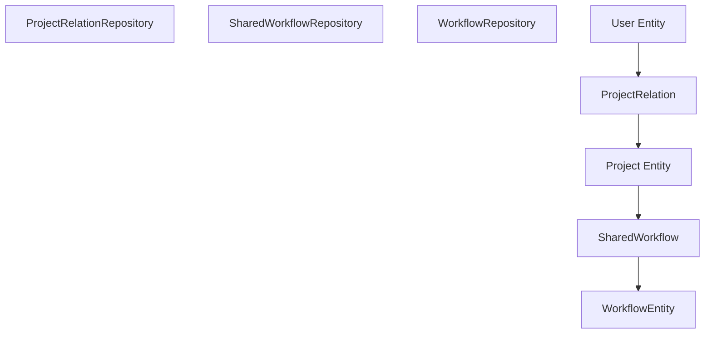

# Project-Based Authorization and Sharing

Relevant source files

-   [packages/@n8n/api-types/src/dto/folders/\_\_tests\_\_/list-folder-query.dto.test.ts](https://github.com/n8n-io/n8n/blob/88f170b9/packages/@n8n/api-types/src/dto/folders/__tests__/list-folder-query.dto.test.ts)
-   [packages/@n8n/api-types/src/dto/folders/\_\_tests\_\_/update-folder.request.dto.test.ts](https://github.com/n8n-io/n8n/blob/88f170b9/packages/@n8n/api-types/src/dto/folders/__tests__/update-folder.request.dto.test.ts)
-   [packages/@n8n/api-types/src/dto/folders/create-folder.dto.ts](https://github.com/n8n-io/n8n/blob/88f170b9/packages/@n8n/api-types/src/dto/folders/create-folder.dto.ts)
-   [packages/@n8n/api-types/src/dto/folders/delete-folder.dto.ts](https://github.com/n8n-io/n8n/blob/88f170b9/packages/@n8n/api-types/src/dto/folders/delete-folder.dto.ts)
-   [packages/@n8n/api-types/src/dto/folders/list-folder-query.dto.ts](https://github.com/n8n-io/n8n/blob/88f170b9/packages/@n8n/api-types/src/dto/folders/list-folder-query.dto.ts)
-   [packages/@n8n/api-types/src/dto/folders/update-folder.dto.ts](https://github.com/n8n-io/n8n/blob/88f170b9/packages/@n8n/api-types/src/dto/folders/update-folder.dto.ts)
-   [packages/@n8n/api-types/src/schemas/\_\_tests\_\_/folder.schema.test.ts](https://github.com/n8n-io/n8n/blob/88f170b9/packages/@n8n/api-types/src/schemas/__tests__/folder.schema.test.ts)
-   [packages/@n8n/api-types/src/schemas/folder.schema.ts](https://github.com/n8n-io/n8n/blob/88f170b9/packages/@n8n/api-types/src/schemas/folder.schema.ts)
-   [packages/@n8n/db/src/entities/execution-entity.ts](https://github.com/n8n-io/n8n/blob/88f170b9/packages/@n8n/db/src/entities/execution-entity.ts)
-   [packages/@n8n/db/src/entities/workflow-published-version.ts](https://github.com/n8n-io/n8n/blob/88f170b9/packages/@n8n/db/src/entities/workflow-published-version.ts)
-   [packages/@n8n/db/src/migrations/common/1768557000000-AddStoredAtToExecutionEntity.ts](https://github.com/n8n-io/n8n/blob/88f170b9/packages/@n8n/db/src/migrations/common/1768557000000-AddStoredAtToExecutionEntity.ts)
-   [packages/@n8n/db/src/migrations/common/1772619247762-ChangeWorkflowPublishedVersionFKsToRestrict.ts](https://github.com/n8n-io/n8n/blob/88f170b9/packages/@n8n/db/src/migrations/common/1772619247762-ChangeWorkflowPublishedVersionFKsToRestrict.ts)
-   [packages/@n8n/db/src/repositories/folder-tag-mapping.repository.ts](https://github.com/n8n-io/n8n/blob/88f170b9/packages/@n8n/db/src/repositories/folder-tag-mapping.repository.ts)
-   [packages/@n8n/db/src/repositories/folder.repository.ts](https://github.com/n8n-io/n8n/blob/88f170b9/packages/@n8n/db/src/repositories/folder.repository.ts)
-   [packages/@n8n/db/src/repositories/invalid-auth-token.repository.ts](https://github.com/n8n-io/n8n/blob/88f170b9/packages/@n8n/db/src/repositories/invalid-auth-token.repository.ts)
-   [packages/@n8n/db/src/repositories/processed-data.repository.ts](https://github.com/n8n-io/n8n/blob/88f170b9/packages/@n8n/db/src/repositories/processed-data.repository.ts)
-   [packages/@n8n/db/src/repositories/workflow-published-version.repository.ts](https://github.com/n8n-io/n8n/blob/88f170b9/packages/@n8n/db/src/repositories/workflow-published-version.repository.ts)
-   [packages/@n8n/db/src/utils/test-utils/mock-entity-manager.ts](https://github.com/n8n-io/n8n/blob/88f170b9/packages/@n8n/db/src/utils/test-utils/mock-entity-manager.ts)
-   [packages/@n8n/db/src/utils/test-utils/mock-instance.ts](https://github.com/n8n-io/n8n/blob/88f170b9/packages/@n8n/db/src/utils/test-utils/mock-instance.ts)
-   [packages/@n8n/permissions/src/\_\_tests\_\_/\_\_snapshots\_\_/scope-information.test.ts.snap](https://github.com/n8n-io/n8n/blob/88f170b9/packages/@n8n/permissions/src/__tests__/__snapshots__/scope-information.test.ts.snap)
-   [packages/@n8n/permissions/src/constants.ee.ts](https://github.com/n8n-io/n8n/blob/88f170b9/packages/@n8n/permissions/src/constants.ee.ts)
-   [packages/@n8n/permissions/src/public-api-permissions.ee.ts](https://github.com/n8n-io/n8n/blob/88f170b9/packages/@n8n/permissions/src/public-api-permissions.ee.ts)
-   [packages/@n8n/permissions/src/roles/scopes/global-scopes.ee.ts](https://github.com/n8n-io/n8n/blob/88f170b9/packages/@n8n/permissions/src/roles/scopes/global-scopes.ee.ts)
-   [packages/@n8n/permissions/src/roles/scopes/project-scopes.ee.ts](https://github.com/n8n-io/n8n/blob/88f170b9/packages/@n8n/permissions/src/roles/scopes/project-scopes.ee.ts)
-   [packages/@n8n/permissions/src/roles/scopes/workflow-sharing-scopes.ee.ts](https://github.com/n8n-io/n8n/blob/88f170b9/packages/@n8n/permissions/src/roles/scopes/workflow-sharing-scopes.ee.ts)
-   [packages/@n8n/permissions/src/scope-information.ts](https://github.com/n8n-io/n8n/blob/88f170b9/packages/@n8n/permissions/src/scope-information.ts)
-   [packages/@n8n/permissions/src/utilities/\_\_tests\_\_/get-resource-permissions.test.ts](https://github.com/n8n-io/n8n/blob/88f170b9/packages/@n8n/permissions/src/utilities/__tests__/get-resource-permissions.test.ts)
-   [packages/cli/src/\_\_tests\_\_/workflow-helpers.test.ts](https://github.com/n8n-io/n8n/blob/88f170b9/packages/cli/src/__tests__/workflow-helpers.test.ts)
-   [packages/cli/src/controllers/folder.controller.ts](https://github.com/n8n-io/n8n/blob/88f170b9/packages/cli/src/controllers/folder.controller.ts)
-   [packages/cli/src/executions/\_\_tests\_\_/execution-redaction-proxy.service.test.ts](https://github.com/n8n-io/n8n/blob/88f170b9/packages/cli/src/executions/__tests__/execution-redaction-proxy.service.test.ts)
-   [packages/cli/src/executions/execution-redaction-proxy.service.ts](https://github.com/n8n-io/n8n/blob/88f170b9/packages/cli/src/executions/execution-redaction-proxy.service.ts)
-   [packages/cli/src/public-api/types.ts](https://github.com/n8n-io/n8n/blob/88f170b9/packages/cli/src/public-api/types.ts)
-   [packages/cli/src/public-api/v1/handlers/discover/\_\_tests\_\_/discover.handler.test.ts](https://github.com/n8n-io/n8n/blob/88f170b9/packages/cli/src/public-api/v1/handlers/discover/__tests__/discover.handler.test.ts)
-   [packages/cli/src/public-api/v1/handlers/discover/\_\_tests\_\_/discover.service.test.ts](https://github.com/n8n-io/n8n/blob/88f170b9/packages/cli/src/public-api/v1/handlers/discover/__tests__/discover.service.test.ts)
-   [packages/cli/src/public-api/v1/handlers/discover/discover.handler.ts](https://github.com/n8n-io/n8n/blob/88f170b9/packages/cli/src/public-api/v1/handlers/discover/discover.handler.ts)
-   [packages/cli/src/public-api/v1/handlers/discover/discover.service.ts](https://github.com/n8n-io/n8n/blob/88f170b9/packages/cli/src/public-api/v1/handlers/discover/discover.service.ts)
-   [packages/cli/src/public-api/v1/handlers/discover/spec/paths/discover.yml](https://github.com/n8n-io/n8n/blob/88f170b9/packages/cli/src/public-api/v1/handlers/discover/spec/paths/discover.yml)
-   [packages/cli/src/public-api/v1/handlers/executions/executions.handler.ts](https://github.com/n8n-io/n8n/blob/88f170b9/packages/cli/src/public-api/v1/handlers/executions/executions.handler.ts)
-   [packages/cli/src/public-api/v1/handlers/executions/spec/paths/executions.yml](https://github.com/n8n-io/n8n/blob/88f170b9/packages/cli/src/public-api/v1/handlers/executions/spec/paths/executions.yml)
-   [packages/cli/src/public-api/v1/handlers/executions/spec/schemas/execution.yml](https://github.com/n8n-io/n8n/blob/88f170b9/packages/cli/src/public-api/v1/handlers/executions/spec/schemas/execution.yml)
-   [packages/cli/src/public-api/v1/handlers/workflows/workflows.handler.ts](https://github.com/n8n-io/n8n/blob/88f170b9/packages/cli/src/public-api/v1/handlers/workflows/workflows.handler.ts)
-   [packages/cli/src/public-api/v1/openapi.yml](https://github.com/n8n-io/n8n/blob/88f170b9/packages/cli/src/public-api/v1/openapi.yml)
-   [packages/cli/src/public-api/v1/shared/middlewares/global.middleware.ts](https://github.com/n8n-io/n8n/blob/88f170b9/packages/cli/src/public-api/v1/shared/middlewares/global.middleware.ts)
-   [packages/cli/src/public-api/v1/shared/spec/parameters/\_index.yml](https://github.com/n8n-io/n8n/blob/88f170b9/packages/cli/src/public-api/v1/shared/spec/parameters/_index.yml)
-   [packages/cli/src/services/folder.service.ts](https://github.com/n8n-io/n8n/blob/88f170b9/packages/cli/src/services/folder.service.ts)
-   [packages/cli/src/workflow-helpers.ts](https://github.com/n8n-io/n8n/blob/88f170b9/packages/cli/src/workflow-helpers.ts)
-   [packages/cli/src/workflows/\_\_tests\_\_/workflow-creation.service.test.ts](https://github.com/n8n-io/n8n/blob/88f170b9/packages/cli/src/workflows/__tests__/workflow-creation.service.test.ts)
-   [packages/cli/src/workflows/\_\_tests\_\_/workflow.service.test.ts](https://github.com/n8n-io/n8n/blob/88f170b9/packages/cli/src/workflows/__tests__/workflow.service.test.ts)
-   [packages/cli/src/workflows/\_\_tests\_\_/workflows.controller.test.ts](https://github.com/n8n-io/n8n/blob/88f170b9/packages/cli/src/workflows/__tests__/workflows.controller.test.ts)
-   [packages/cli/src/workflows/workflow-creation.service.ts](https://github.com/n8n-io/n8n/blob/88f170b9/packages/cli/src/workflows/workflow-creation.service.ts)
-   [packages/cli/src/workflows/workflow-finder.service.ts](https://github.com/n8n-io/n8n/blob/88f170b9/packages/cli/src/workflows/workflow-finder.service.ts)
-   [packages/cli/src/workflows/workflow.service.ee.ts](https://github.com/n8n-io/n8n/blob/88f170b9/packages/cli/src/workflows/workflow.service.ee.ts)
-   [packages/cli/src/workflows/workflow.service.ts](https://github.com/n8n-io/n8n/blob/88f170b9/packages/cli/src/workflows/workflow.service.ts)
-   [packages/cli/src/workflows/workflows.controller.ts](https://github.com/n8n-io/n8n/blob/88f170b9/packages/cli/src/workflows/workflows.controller.ts)
-   [packages/cli/test/integration/folder/folder.controller.test.ts](https://github.com/n8n-io/n8n/blob/88f170b9/packages/cli/test/integration/folder/folder.controller.test.ts)
-   [packages/cli/test/integration/public-api/discover.test.ts](https://github.com/n8n-io/n8n/blob/88f170b9/packages/cli/test/integration/public-api/discover.test.ts)
-   [packages/cli/test/integration/public-api/endpoints-with-scopes-enabled.test.ts](https://github.com/n8n-io/n8n/blob/88f170b9/packages/cli/test/integration/public-api/endpoints-with-scopes-enabled.test.ts)
-   [packages/cli/test/integration/public-api/executions.test.ts](https://github.com/n8n-io/n8n/blob/88f170b9/packages/cli/test/integration/public-api/executions.test.ts)
-   [packages/cli/test/integration/public-api/workflows.test.ts](https://github.com/n8n-io/n8n/blob/88f170b9/packages/cli/test/integration/public-api/workflows.test.ts)
-   [packages/cli/test/integration/shared/db/folders.ts](https://github.com/n8n-io/n8n/blob/88f170b9/packages/cli/test/integration/shared/db/folders.ts)
-   [packages/cli/test/integration/workflows/workflow.service.test.ts](https://github.com/n8n-io/n8n/blob/88f170b9/packages/cli/test/integration/workflows/workflow.service.test.ts)
-   [packages/cli/test/integration/workflows/workflows.controller.ee.test.ts](https://github.com/n8n-io/n8n/blob/88f170b9/packages/cli/test/integration/workflows/workflows.controller.ee.test.ts)
-   [packages/cli/test/integration/workflows/workflows.controller.test.ts](https://github.com/n8n-io/n8n/blob/88f170b9/packages/cli/test/integration/workflows/workflows.controller.test.ts)
-   [packages/frontend/editor-ui/src/app/api/workflows.test.ts](https://github.com/n8n-io/n8n/blob/88f170b9/packages/frontend/editor-ui/src/app/api/workflows.test.ts)
-   [packages/frontend/editor-ui/src/app/stores/rbac.store.ts](https://github.com/n8n-io/n8n/blob/88f170b9/packages/frontend/editor-ui/src/app/stores/rbac.store.ts)
-   [packages/nodes-base/nodes/N8n/n8n-api-coverage.json](https://github.com/n8n-io/n8n/blob/88f170b9/packages/nodes-base/nodes/N8n/n8n-api-coverage.json)
-   [packages/nodes-base/nodes/N8n/test/N8n.api-coverage.test.ts](https://github.com/n8n-io/n8n/blob/88f170b9/packages/nodes-base/nodes/N8n/test/N8n.api-coverage.test.ts)
-   [packages/testing/playwright/services/public-api-helper.ts](https://github.com/n8n-io/n8n/blob/88f170b9/packages/testing/playwright/services/public-api-helper.ts)
-   [packages/testing/playwright/tests/e2e/api/discovery.spec.ts](https://github.com/n8n-io/n8n/blob/88f170b9/packages/testing/playwright/tests/e2e/api/discovery.spec.ts)

## Purpose and Scope

This document explains n8n's project-based authorization system that controls access to workflows, credentials, and folders. It covers the distinction between global and project roles, resource sharing mechanisms, and the technical implementation of scope-based permissions using the `@n8n/permissions` package and the `@ProjectScope` decorator.

---

## Global Roles vs Project Roles

n8n uses a two-tier role system to balance instance-wide administration with granular resource control.

### Global Roles

Global roles determine instance-wide permissions and are assigned to users at the instance level. These are typically stored in the `User` entity.

| Role Slug | Description | Key Permissions |
| --- | --- | --- |
| `global:owner` | Instance owner | Full control over all resources and settings. |
| `global:admin` | Administrator | Elevated privileges for user management and settings. |
| `global:member` | Standard user | Access to own resources and shared team projects. |

Sources: [packages/@n8n/permissions/src/roles/scopes/global-scopes.ee.ts3-176](https://github.com/n8n-io/n8n/blob/88f170b9/packages/@n8n/permissions/src/roles/scopes/global-scopes.ee.ts#L3-L176) [packages/cli/src/workflows/workflows.controller.ts193-194](https://github.com/n8n-io/n8n/blob/88f170b9/packages/cli/src/workflows/workflows.controller.ts#L193-L194)

### Project Roles

Project roles determine permissions within a specific project and are assigned through `ProjectRelation` entities.

| Role Slug | Description | Typical Scopes |
| --- | --- | --- |
| `project:personalOwner` | Owner of a personal project | All resource operations. |
| `project:admin` | Project administrator | Manage project members and all resources. |
| `project:editor` | Resource editor | Create, update, execute, and delete resources. |
| `project:viewer` | Read-only viewer | Read and list resources only. |

Sources: [packages/@n8n/permissions/src/constants.ee.ts81-85](https://github.com/n8n-io/n8n/blob/88f170b9/packages/@n8n/permissions/src/constants.ee.ts#L81-L85) [packages/cli/src/workflows/workflow.service.ts145-150](https://github.com/n8n-io/n8n/blob/88f170b9/packages/cli/src/workflows/workflow.service.ts#L145-L150)

---

## Project System Architecture

n8n organizes resources into **Projects**. Every user has a `personal` project, and users can be members of multiple `team` projects.

### Resource Ownership and Sharing

Resources (Workflows, Credentials, Folders) are linked to projects via "Shared" bridge tables (e.g., `SharedWorkflow`). A resource has one **Home Project** (where it was created) but can be shared with multiple other projects.

**Diagram: Entity Relationship for Project Authorization**

Sources: [packages/cli/src/workflows/workflow.service.ts11-21](https://github.com/n8n-io/n8n/blob/88f170b9/packages/cli/src/workflows/workflow.service.ts#L11-L21) [packages/cli/src/workflows/workflows.controller.ts14-21](https://github.com/n8n-io/n8n/blob/88f170b9/packages/cli/src/workflows/workflows.controller.ts#L14-L21)

---

## Implementation of Scopes and Permissions

Permissions are defined as **Scopes** (e.g., `workflow:read`, `credential:share`). The `@n8n/permissions` package defines the available resources and operations.

### Resource Scopes

Resources define valid operations such as `create`, `read`, `update`, `delete`, `list`, `share`, `move`, and `execute`.

Sources: [packages/@n8n/permissions/src/constants.ee.ts3-63](https://github.com/n8n-io/n8n/blob/88f170b9/packages/@n8n/permissions/src/constants.ee.ts#L3-L63)

### The @ProjectScope Decorator

The `@ProjectScope` decorator is used in RestControllers to enforce authorization before a request reaches the handler. It verifies if the authenticated user has the required scope for the resource specified in the request parameters.

> **[Mermaid sequence]**
> *(图表结构无法解析)*

**Diagram: Authorization Flow via ProjectScope Decorator**

Sources: [packages/cli/src/workflows/workflows.controller.ts30-34](https://github.com/n8n-io/n8n/blob/88f170b9/packages/cli/src/workflows/workflows.controller.ts#L30-L34) [packages/cli/src/workflows/workflow.service.ts100-168](https://github.com/n8n-io/n8n/blob/88f170b9/packages/cli/src/workflows/workflow.service.ts#L100-L168)

---

## Workflow and Folder Management

### Workflow Sharing

Workflows can be shared with other projects. The `EnterpriseWorkflowService` handles the logic for adding `SharedWorkflow` entries.

Sources: [packages/cli/src/workflows/workflow.service.ee.ts60-91](https://github.com/n8n-io/n8n/blob/88f170b9/packages/cli/src/workflows/workflow.service.ee.ts#L60-L91)

### Folder System

Folders provide hierarchical organization within a project. Permissions for folders are checked similarly to workflows, often requiring `folder:list` or `folder:read` scopes.

**Key Operations:**

-   **Creation:** Requires `folder:create` in the target project.
-   **Moving:** Folders can be moved within a project hierarchy but not across projects without a transfer.
-   **Flattening:** When a folder is deleted, its contents can be "flattened" (moved to root) and archived.

Sources: [packages/cli/src/services/folder.service.ts39-54](https://github.com/n8n-io/n8n/blob/88f170b9/packages/cli/src/services/folder.service.ts#L39-L54) [packages/cli/src/services/folder.service.ts149-160](https://github.com/n8n-io/n8n/blob/88f170b9/packages/cli/src/services/folder.service.ts#L149-L160) [packages/cli/test/integration/folder/folder.controller.test.ts139-151](https://github.com/n8n-io/n8n/blob/88f170b9/packages/cli/test/integration/folder/folder.controller.test.ts#L139-L151)

---

## Data Flow: Fetching Resources with Permissions

When fetching workflows (e.g., in `WorkflowService.getMany`), the system uses complex subqueries to filter results based on the user's project memberships and roles.

1.  **Identify Project Context:** If a `projectId` filter is provided, the system checks if it's a personal or team project [packages/cli/src/workflows/workflow.service.ts114-123](https://github.com/n8n-io/n8n/blob/88f170b9/packages/cli/src/workflows/workflow.service.ts#L114-L123)
2.  **Resolve Roles:** The `RoleService` identifies which project roles contain the required scopes [packages/cli/src/workflows/workflow.service.ts145-146](https://github.com/n8n-io/n8n/blob/88f170b9/packages/cli/src/workflows/workflow.service.ts#L145-L146)
3.  **Subquery Filtering:** The `WorkflowRepository` executes `getManyAndCountWithSharingSubquery`, which joins workflows with their sharing records and filters by the user's accessible projects [packages/cli/src/workflows/workflow.service.ts163-168](https://github.com/n8n-io/n8n/blob/88f170b9/packages/cli/src/workflows/workflow.service.ts#L163-L168)
4.  **Scope Injection:** If requested, the system calculates and attaches the specific scopes the user has for each returned workflow [packages/cli/src/workflows/workflow.service.ts181-182](https://github.com/n8n-io/n8n/blob/88f170b9/packages/cli/src/workflows/workflow.service.ts#L181-L182)

Sources: [packages/cli/src/workflows/workflow.service.ts100-182](https://github.com/n8n-io/n8n/blob/88f170b9/packages/cli/src/workflows/workflow.service.ts#L100-L182) [packages/cli/src/services/role.service.ts1-100](https://github.com/n8n-io/n8n/blob/88f170b9/packages/cli/src/services/role.service.ts#L1-L100)

---

## Security: Tamper Prevention

The `EnterpriseWorkflowService` includes a `preventTampering` method. This ensures that when a workflow is updated, the user cannot inject credentials they do not have access to by comparing the new version against the previous database state and the user's allowed credentials.

Sources: [packages/cli/src/workflows/workflow.service.ee.ts165-187](https://github.com/n8n-io/n8n/blob/88f170b9/packages/cli/src/workflows/workflow.service.ee.ts#L165-L187) [packages/cli/src/workflows/workflow.service.ee.ts189-195](https://github.com/n8n-io/n8n/blob/88f170b9/packages/cli/src/workflows/workflow.service.ee.ts#L189-L195)
