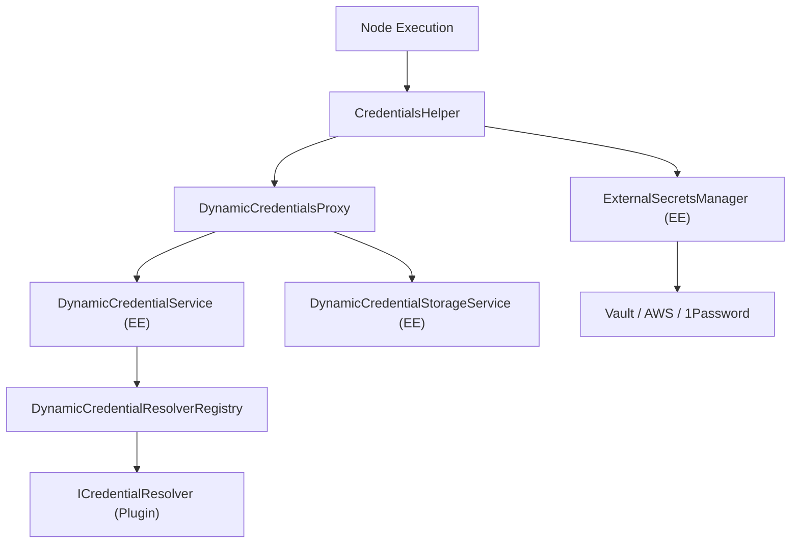
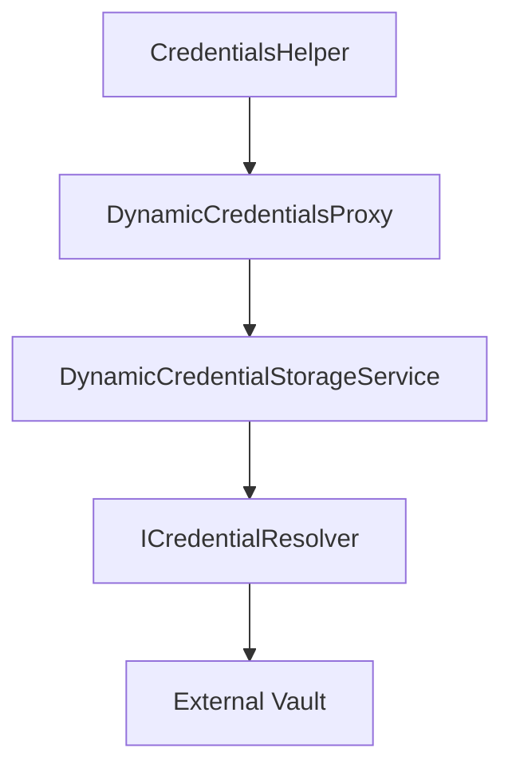

# Dynamic Credentials and External Secrets

Relevant source files

-   [packages/@n8n/api-types/src/dto/secrets-provider/update-secrets-provider-connection.dto.ts](https://github.com/n8n-io/n8n/blob/88f170b9/packages/@n8n/api-types/src/dto/secrets-provider/update-secrets-provider-connection.dto.ts)
-   [packages/@n8n/api-types/src/schemas/secrets-provider.schema.ts](https://github.com/n8n-io/n8n/blob/88f170b9/packages/@n8n/api-types/src/schemas/secrets-provider.schema.ts)
-   [packages/@n8n/db/src/repositories/secrets-provider-connection.repository.ee.ts](https://github.com/n8n-io/n8n/blob/88f170b9/packages/@n8n/db/src/repositories/secrets-provider-connection.repository.ee.ts)
-   [packages/cli/src/\_\_tests\_\_/credentials-helper.test.ts](https://github.com/n8n-io/n8n/blob/88f170b9/packages/cli/src/__tests__/credentials-helper.test.ts)
-   [packages/cli/src/credentials-helper.ts](https://github.com/n8n-io/n8n/blob/88f170b9/packages/cli/src/credentials-helper.ts)
-   [packages/cli/src/credentials/\_\_tests\_\_/dynamic-credentials-proxy.test.ts](https://github.com/n8n-io/n8n/blob/88f170b9/packages/cli/src/credentials/__tests__/dynamic-credentials-proxy.test.ts)
-   [packages/cli/src/credentials/credential-resolution-provider.interface.ts](https://github.com/n8n-io/n8n/blob/88f170b9/packages/cli/src/credentials/credential-resolution-provider.interface.ts)
-   [packages/cli/src/credentials/dynamic-credentials-proxy.ts](https://github.com/n8n-io/n8n/blob/88f170b9/packages/cli/src/credentials/dynamic-credentials-proxy.ts)
-   [packages/cli/src/modules/dynamic-credentials.ee/dynamic-credentials.module.ts](https://github.com/n8n-io/n8n/blob/88f170b9/packages/cli/src/modules/dynamic-credentials.ee/dynamic-credentials.module.ts)
-   [packages/cli/src/modules/dynamic-credentials.ee/services/\_\_tests\_\_/credential-check-proxy.service.test.ts](https://github.com/n8n-io/n8n/blob/88f170b9/packages/cli/src/modules/dynamic-credentials.ee/services/__tests__/credential-check-proxy.service.test.ts)
-   [packages/cli/src/modules/dynamic-credentials.ee/services/\_\_tests\_\_/credential-resolver-registry.service.test.ts](https://github.com/n8n-io/n8n/blob/88f170b9/packages/cli/src/modules/dynamic-credentials.ee/services/__tests__/credential-resolver-registry.service.test.ts)
-   [packages/cli/src/modules/dynamic-credentials.ee/services/\_\_tests\_\_/dynamic-credential-storage.service.test.ts](https://github.com/n8n-io/n8n/blob/88f170b9/packages/cli/src/modules/dynamic-credentials.ee/services/__tests__/dynamic-credential-storage.service.test.ts)
-   [packages/cli/src/modules/dynamic-credentials.ee/services/\_\_tests\_\_/dynamic-credential.service.test.ts](https://github.com/n8n-io/n8n/blob/88f170b9/packages/cli/src/modules/dynamic-credentials.ee/services/__tests__/dynamic-credential.service.test.ts)
-   [packages/cli/src/modules/dynamic-credentials.ee/services/credential-check-proxy.service.ts](https://github.com/n8n-io/n8n/blob/88f170b9/packages/cli/src/modules/dynamic-credentials.ee/services/credential-check-proxy.service.ts)
-   [packages/cli/src/modules/dynamic-credentials.ee/services/credential-resolver-registry.service.ts](https://github.com/n8n-io/n8n/blob/88f170b9/packages/cli/src/modules/dynamic-credentials.ee/services/credential-resolver-registry.service.ts)
-   [packages/cli/src/modules/dynamic-credentials.ee/services/dynamic-credential-storage.service.ts](https://github.com/n8n-io/n8n/blob/88f170b9/packages/cli/src/modules/dynamic-credentials.ee/services/dynamic-credential-storage.service.ts)
-   [packages/cli/src/modules/dynamic-credentials.ee/services/dynamic-credential.service.ts](https://github.com/n8n-io/n8n/blob/88f170b9/packages/cli/src/modules/dynamic-credentials.ee/services/dynamic-credential.service.ts)
-   [packages/cli/src/modules/dynamic-credentials.ee/services/index.ts](https://github.com/n8n-io/n8n/blob/88f170b9/packages/cli/src/modules/dynamic-credentials.ee/services/index.ts)
-   [packages/cli/src/modules/external-secrets.ee/\_\_tests\_\_/external-secrets-manager.ee.test.ts](https://github.com/n8n-io/n8n/blob/88f170b9/packages/cli/src/modules/external-secrets.ee/__tests__/external-secrets-manager.ee.test.ts)
-   [packages/cli/src/modules/external-secrets.ee/\_\_tests\_\_/secrets-providers-connections.service.ee.test.ts](https://github.com/n8n-io/n8n/blob/88f170b9/packages/cli/src/modules/external-secrets.ee/__tests__/secrets-providers-connections.service.ee.test.ts)
-   [packages/cli/src/modules/external-secrets.ee/external-secrets-manager.ee.ts](https://github.com/n8n-io/n8n/blob/88f170b9/packages/cli/src/modules/external-secrets.ee/external-secrets-manager.ee.ts)
-   [packages/cli/src/modules/external-secrets.ee/external-secrets.config.ts](https://github.com/n8n-io/n8n/blob/88f170b9/packages/cli/src/modules/external-secrets.ee/external-secrets.config.ts)
-   [packages/cli/src/modules/external-secrets.ee/external-secrets.controller.ee.ts](https://github.com/n8n-io/n8n/blob/88f170b9/packages/cli/src/modules/external-secrets.ee/external-secrets.controller.ee.ts)
-   [packages/cli/src/modules/external-secrets.ee/secrets-providers-completions.controller.ee.ts](https://github.com/n8n-io/n8n/blob/88f170b9/packages/cli/src/modules/external-secrets.ee/secrets-providers-completions.controller.ee.ts)
-   [packages/cli/src/modules/external-secrets.ee/secrets-providers-connections.controller.ee.ts](https://github.com/n8n-io/n8n/blob/88f170b9/packages/cli/src/modules/external-secrets.ee/secrets-providers-connections.controller.ee.ts)
-   [packages/cli/src/modules/external-secrets.ee/secrets-providers-connections.service.ee.ts](https://github.com/n8n-io/n8n/blob/88f170b9/packages/cli/src/modules/external-secrets.ee/secrets-providers-connections.service.ee.ts)
-   [packages/cli/src/modules/external-secrets.ee/secrets-providers-project.controller.ee.ts](https://github.com/n8n-io/n8n/blob/88f170b9/packages/cli/src/modules/external-secrets.ee/secrets-providers-project.controller.ee.ts)
-   [packages/cli/src/modules/external-secrets.ee/secrets-providers-types.controller.ee.ts](https://github.com/n8n-io/n8n/blob/88f170b9/packages/cli/src/modules/external-secrets.ee/secrets-providers-types.controller.ee.ts)
-   [packages/cli/src/modules/external-secrets.ee/types.ts](https://github.com/n8n-io/n8n/blob/88f170b9/packages/cli/src/modules/external-secrets.ee/types.ts)
-   [packages/cli/test/integration/database/repositories/secrets-provider-connection.repository.test.ts](https://github.com/n8n-io/n8n/blob/88f170b9/packages/cli/test/integration/database/repositories/secrets-provider-connection.repository.test.ts)
-   [packages/cli/test/integration/external-secrets/external-secrets.api.test.ts](https://github.com/n8n-io/n8n/blob/88f170b9/packages/cli/test/integration/external-secrets/external-secrets.api.test.ts)
-   [packages/cli/test/integration/external-secrets/external-secrets.events.test.ts](https://github.com/n8n-io/n8n/blob/88f170b9/packages/cli/test/integration/external-secrets/external-secrets.events.test.ts)
-   [packages/cli/test/integration/external-secrets/external-secrets.module.test.ts](https://github.com/n8n-io/n8n/blob/88f170b9/packages/cli/test/integration/external-secrets/external-secrets.module.test.ts)
-   [packages/cli/test/integration/external-secrets/secret-providers-connections.api.test.ts](https://github.com/n8n-io/n8n/blob/88f170b9/packages/cli/test/integration/external-secrets/secret-providers-connections.api.test.ts)
-   [packages/cli/test/integration/external-secrets/secret-providers-project.api.test.ts](https://github.com/n8n-io/n8n/blob/88f170b9/packages/cli/test/integration/external-secrets/secret-providers-project.api.test.ts)
-   [packages/cli/test/integration/external-secrets/secret-providers-types.api.test.ts](https://github.com/n8n-io/n8n/blob/88f170b9/packages/cli/test/integration/external-secrets/secret-providers-types.api.test.ts)
-   [packages/cli/test/integration/external-secrets/secrets-providers-completions.api.test.ts](https://github.com/n8n-io/n8n/blob/88f170b9/packages/cli/test/integration/external-secrets/secrets-providers-completions.api.test.ts)
-   [packages/cli/test/shared/external-secrets/utils.ts](https://github.com/n8n-io/n8n/blob/88f170b9/packages/cli/test/shared/external-secrets/utils.ts)
-   [packages/core/src/execution-engine/\_\_tests\_\_/routing-node.test.ts](https://github.com/n8n-io/n8n/blob/88f170b9/packages/core/src/execution-engine/__tests__/routing-node.test.ts)
-   [packages/core/src/execution-engine/index.ts](https://github.com/n8n-io/n8n/blob/88f170b9/packages/core/src/execution-engine/index.ts)
-   [packages/core/src/execution-engine/node-execution-context/\_\_tests\_\_/execute-context.test.ts](https://github.com/n8n-io/n8n/blob/88f170b9/packages/core/src/execution-engine/node-execution-context/__tests__/execute-context.test.ts)
-   [packages/core/src/execution-engine/node-execution-context/\_\_tests\_\_/execute-single-context.test.ts](https://github.com/n8n-io/n8n/blob/88f170b9/packages/core/src/execution-engine/node-execution-context/__tests__/execute-single-context.test.ts)
-   [packages/core/src/execution-engine/node-execution-context/\_\_tests\_\_/node-execution-context.test.ts](https://github.com/n8n-io/n8n/blob/88f170b9/packages/core/src/execution-engine/node-execution-context/__tests__/node-execution-context.test.ts)
-   [packages/core/src/execution-engine/node-execution-context/execute-context.ts](https://github.com/n8n-io/n8n/blob/88f170b9/packages/core/src/execution-engine/node-execution-context/execute-context.ts)
-   [packages/core/src/execution-engine/node-execution-context/node-execution-context.ts](https://github.com/n8n-io/n8n/blob/88f170b9/packages/core/src/execution-engine/node-execution-context/node-execution-context.ts)
-   [packages/core/src/execution-engine/node-execution-context/utils/\_\_tests\_\_/credential-check-helper-functions.test.ts](https://github.com/n8n-io/n8n/blob/88f170b9/packages/core/src/execution-engine/node-execution-context/utils/__tests__/credential-check-helper-functions.test.ts)
-   [packages/core/src/execution-engine/node-execution-context/utils/credential-check-helper-functions.ts](https://github.com/n8n-io/n8n/blob/88f170b9/packages/core/src/execution-engine/node-execution-context/utils/credential-check-helper-functions.ts)
-   [packages/core/src/execution-engine/routing-node.ts](https://github.com/n8n-io/n8n/blob/88f170b9/packages/core/src/execution-engine/routing-node.ts)
-   [packages/frontend/@n8n/rest-api-client/src/api/secretsProvider.ee.ts](https://github.com/n8n-io/n8n/blob/88f170b9/packages/frontend/@n8n/rest-api-client/src/api/secretsProvider.ee.ts)
-   [packages/frontend/editor-ui/src/features/collaboration/projects/components/ProjectExternalSecrets.test.ts](https://github.com/n8n-io/n8n/blob/88f170b9/packages/frontend/editor-ui/src/features/collaboration/projects/components/ProjectExternalSecrets.test.ts)
-   [packages/frontend/editor-ui/src/features/collaboration/projects/components/ProjectExternalSecrets.vue](https://github.com/n8n-io/n8n/blob/88f170b9/packages/frontend/editor-ui/src/features/collaboration/projects/components/ProjectExternalSecrets.vue)
-   [packages/frontend/editor-ui/src/features/integrations/secretsProviders.ee/components/DeleteSecretsProviderModal.ee.test.ts](https://github.com/n8n-io/n8n/blob/88f170b9/packages/frontend/editor-ui/src/features/integrations/secretsProviders.ee/components/DeleteSecretsProviderModal.ee.test.ts)
-   [packages/frontend/editor-ui/src/features/integrations/secretsProviders.ee/components/DeleteSecretsProviderModal.ee.vue](https://github.com/n8n-io/n8n/blob/88f170b9/packages/frontend/editor-ui/src/features/integrations/secretsProviders.ee/components/DeleteSecretsProviderModal.ee.vue)
-   [packages/frontend/editor-ui/src/features/integrations/secretsProviders.ee/components/SecretsProviderConnectionCard.ee.vue](https://github.com/n8n-io/n8n/blob/88f170b9/packages/frontend/editor-ui/src/features/integrations/secretsProviders.ee/components/SecretsProviderConnectionCard.ee.vue)
-   [packages/frontend/editor-ui/src/features/integrations/secretsProviders.ee/components/SecretsProviderConnectionCard.test.ts](https://github.com/n8n-io/n8n/blob/88f170b9/packages/frontend/editor-ui/src/features/integrations/secretsProviders.ee/components/SecretsProviderConnectionCard.test.ts)
-   [packages/frontend/editor-ui/src/features/integrations/secretsProviders.ee/components/SecretsProviderConnectionModal.ee.test.ts](https://github.com/n8n-io/n8n/blob/88f170b9/packages/frontend/editor-ui/src/features/integrations/secretsProviders.ee/components/SecretsProviderConnectionModal.ee.test.ts)
-   [packages/frontend/editor-ui/src/features/integrations/secretsProviders.ee/components/SecretsProviderConnectionModal.ee.vue](https://github.com/n8n-io/n8n/blob/88f170b9/packages/frontend/editor-ui/src/features/integrations/secretsProviders.ee/components/SecretsProviderConnectionModal.ee.vue)
-   [packages/frontend/editor-ui/src/features/integrations/secretsProviders.ee/composables/useConnectionModal.ee.test.ts](https://github.com/n8n-io/n8n/blob/88f170b9/packages/frontend/editor-ui/src/features/integrations/secretsProviders.ee/composables/useConnectionModal.ee.test.ts)
-   [packages/frontend/editor-ui/src/features/integrations/secretsProviders.ee/composables/useConnectionModal.ee.ts](https://github.com/n8n-io/n8n/blob/88f170b9/packages/frontend/editor-ui/src/features/integrations/secretsProviders.ee/composables/useConnectionModal.ee.ts)
-   [packages/frontend/editor-ui/src/features/integrations/secretsProviders.ee/composables/useSecretsProviderConnection.ee.ts](https://github.com/n8n-io/n8n/blob/88f170b9/packages/frontend/editor-ui/src/features/integrations/secretsProviders.ee/composables/useSecretsProviderConnection.ee.ts)
-   [packages/frontend/editor-ui/src/features/integrations/secretsProviders.ee/composables/useSecretsProvidersList.ee.test.ts](https://github.com/n8n-io/n8n/blob/88f170b9/packages/frontend/editor-ui/src/features/integrations/secretsProviders.ee/composables/useSecretsProvidersList.ee.test.ts)
-   [packages/frontend/editor-ui/src/features/integrations/secretsProviders.ee/composables/useSecretsProvidersList.ee.ts](https://github.com/n8n-io/n8n/blob/88f170b9/packages/frontend/editor-ui/src/features/integrations/secretsProviders.ee/composables/useSecretsProvidersList.ee.ts)
-   [packages/frontend/editor-ui/src/features/integrations/secretsProviders.ee/views/SettingsSecretsProviders.ee.vue](https://github.com/n8n-io/n8n/blob/88f170b9/packages/frontend/editor-ui/src/features/integrations/secretsProviders.ee/views/SettingsSecretsProviders.ee.vue)
-   [packages/frontend/editor-ui/src/features/integrations/secretsProviders.ee/views/SettingsSecretsProviders.test.ts](https://github.com/n8n-io/n8n/blob/88f170b9/packages/frontend/editor-ui/src/features/integrations/secretsProviders.ee/views/SettingsSecretsProviders.test.ts)

## Purpose and Scope

This document describes n8n's dynamic credential resolution system, which enables credentials to be fetched at runtime from external sources rather than stored statically in n8n's database. The system supports two primary use cases:

1.  **External Secrets Providers** - Integration with secrets management services (AWS Secrets Manager, Azure Key Vault, Google Cloud Secret Manager, HashiCorp Vault).
2.  **Dynamic Credential Resolvers** - Custom credential resolution logic via the `ICredentialResolver` interface (EE feature).

The architecture separates static credential storage (encrypted in the database) from dynamic credential resolution (runtime fetching), enabling hybrid deployments where sensitive credentials live in external vaults while development credentials remain in n8n's database.

---

## System Architecture Overview

The system uses a proxy pattern to bridge the core `CredentialsHelper` with specialized EE services that handle external resolution and storage.

### Core-to-EE Resolution Bridge

**Key Components:**

| Component | Role | File Path |
| --- | --- | --- |
| `CredentialsHelper` | Entry point for credential decryption and resolution. | [packages/cli/src/credentials-helper.ts83-94](https://github.com/n8n-io/n8n/blob/88f170b9/packages/cli/src/credentials-helper.ts#L83-L94) |
| `DynamicCredentialsProxy` | Routes resolution/storage requests to EE providers. | [packages/cli/src/credentials/dynamic-credentials-proxy.ts13-25](https://github.com/n8n-io/n8n/blob/88f170b9/packages/cli/src/credentials/dynamic-credentials-proxy.ts#L13-L25) |
| `ExternalSecretsManager` | Orchestrates external secrets lifecycle and cache. | [packages/cli/src/modules/external-secrets.ee/external-secrets-manager.ee.ts30-52](https://github.com/n8n-io/n8n/blob/88f170b9/packages/cli/src/modules/external-secrets.ee/external-secrets-manager.ee.ts#L30-L52) |
| `SecretsProvidersConnectionsService` | Manages database connections for external vaults. | [packages/cli/src/modules/external-secrets.ee/secrets-providers-connections.service.ee.ts38-51](https://github.com/n8n-io/n8n/blob/88f170b9/packages/cli/src/modules/external-secrets.ee/secrets-providers-connections.service.ee.ts#L38-L51) |
| `DynamicCredentialService` | Implements `ICredentialResolutionProvider`. | [packages/cli/src/modules/dynamic-credentials.ee/services/dynamic-credential.service.ts32-48](https://github.com/n8n-io/n8n/blob/88f170b9/packages/cli/src/modules/dynamic-credentials.ee/services/dynamic-credential.service.ts#L32-L48) |

**Sources:** [packages/cli/src/credentials-helper.ts83-94](https://github.com/n8n-io/n8n/blob/88f170b9/packages/cli/src/credentials-helper.ts#L83-L94) [packages/cli/src/credentials/dynamic-credentials-proxy.ts13-25](https://github.com/n8n-io/n8n/blob/88f170b9/packages/cli/src/credentials/dynamic-credentials-proxy.ts#L13-L25) [packages/cli/src/modules/external-secrets.ee/external-secrets-manager.ee.ts30-52](https://github.com/n8n-io/n8n/blob/88f170b9/packages/cli/src/modules/external-secrets.ee/external-secrets-manager.ee.ts#L30-L52) [packages/cli/src/modules/dynamic-credentials.ee/dynamic-credentials.module.ts10-36](https://github.com/n8n-io/n8n/blob/88f170b9/packages/cli/src/modules/dynamic-credentials.ee/dynamic-credentials.module.ts#L10-L36)

---

## External Secrets Management

n8n supports connecting to multiple external secrets providers (Vault, AWS, Azure, etc.). These are managed as `SecretsProviderConnection` entities.

### Data Flow: Provider Connection

> **[Mermaid sequence]**
> *(图表结构无法解析)*

**Implementation Details:**

-   **Encryption:** Connection settings are encrypted using the `Cipher` class before storage in the `SecretsProviderConnectionRepository` [packages/cli/src/modules/external-secrets.ee/secrets-providers-connections.service.ee.ts67-75](https://github.com/n8n-io/n8n/blob/88f170b9/packages/cli/src/modules/external-secrets.ee/secrets-providers-connections.service.ee.ts#L67-L75)
-   **Redaction:** When sending connection data to the frontend, sensitive settings are redacted using `RedactionService` [packages/cli/src/modules/external-secrets.ee/secrets-providers-connections.service.ee.ts47](https://github.com/n8n-io/n8n/blob/88f170b9/packages/cli/src/modules/external-secrets.ee/secrets-providers-connections.service.ee.ts#L47-L47)
-   **Syncing:** The `ExternalSecretsManager` handles the lifecycle of the actual provider instance (e.g., establishing the HTTP client for AWS) [packages/cli/src/modules/external-secrets.ee/external-secrets-manager.ee.ts139-163](https://github.com/n8n-io/n8n/blob/88f170b9/packages/cli/src/modules/external-secrets.ee/external-secrets-manager.ee.ts#L139-L163)

**Sources:** [packages/cli/src/modules/external-secrets.ee/secrets-providers-connections.service.ee.ts53-102](https://github.com/n8n-io/n8n/blob/88f170b9/packages/cli/src/modules/external-secrets.ee/secrets-providers-connections.service.ee.ts#L53-L102) [packages/cli/src/modules/external-secrets.ee/external-secrets-manager.ee.ts139-163](https://github.com/n8n-io/n8n/blob/88f170b9/packages/cli/src/modules/external-secrets.ee/external-secrets-manager.ee.ts#L139-L163)

---

## Dynamic Credential Resolution Flow

When a node executes, `CredentialsHelper` determines if a credential needs to be fetched dynamically.

### Resolution Logic

1.  **Check Resolvability:** `CredentialsHelper` checks if the credential entity has `isResolvable` set to true [packages/cli/src/credentials-helper.ts340-345](https://github.com/n8n-io/n8n/blob/88f170b9/packages/cli/src/credentials-helper.ts#L340-L345)
2.  **Proxy Call:** It calls `DynamicCredentialsProxy.resolveIfNeeded()` [packages/cli/src/credentials/dynamic-credentials-proxy.ts45-50](https://github.com/n8n-io/n8n/blob/88f170b9/packages/cli/src/credentials/dynamic-credentials-proxy.ts#L45-L50)
3.  **EE Resolution:** `DynamicCredentialService` fetches the secret from the configured `ICredentialResolver` [packages/cli/src/modules/dynamic-credentials.ee/services/dynamic-credential.service.ts125-135](https://github.com/n8n-io/n8n/blob/88f170b9/packages/cli/src/modules/dynamic-credentials.ee/services/dynamic-credential.service.ts#L125-L135)
4.  **Merging:** Dynamic data is merged with static data. Static data fields (like `clientId` in OAuth) usually take precedence if they are marked as non-resolvable [packages/cli/src/modules/dynamic-credentials.ee/services/dynamic-credential.service.ts137-143](https://github.com/n8n-io/n8n/blob/88f170b9/packages/cli/src/modules/dynamic-credentials.ee/services/dynamic-credential.service.ts#L137-L143)

### OAuth Token Storage

For dynamic credentials using OAuth2, refreshed tokens must be stored back in the external vault rather than n8n's database.

**Sources:** [packages/cli/src/credentials-helper.ts547-598](https://github.com/n8n-io/n8n/blob/88f170b9/packages/cli/src/credentials-helper.ts#L547-L598) [packages/cli/src/credentials/dynamic-credentials-proxy.ts88-128](https://github.com/n8n-io/n8n/blob/88f170b9/packages/cli/src/credentials/dynamic-credentials-proxy.ts#L88-L128) [packages/cli/src/modules/dynamic-credentials.ee/services/dynamic-credential-storage.service.ts42-80](https://github.com/n8n-io/n8n/blob/88f170b9/packages/cli/src/modules/dynamic-credentials.ee/services/dynamic-credential-storage.service.ts#L42-L80)

---

## Project-Level Secrets Access

n8n allows secrets providers to be scoped to specific projects or shared globally.

### Access Control Architecture

-   **Global Scope:** Providers with no entries in `ProjectSecretsProviderAccessRepository` are considered global and accessible by all workflows (subject to RBAC) [packages/cli/src/modules/external-secrets.ee/secrets-providers-connections.service.ee.ts135-159](https://github.com/n8n-io/n8n/blob/88f170b9/packages/cli/src/modules/external-secrets.ee/secrets-providers-connections.service.ee.ts#L135-L159)
-   **Project Scope:** Providers can be restricted to specific projects. The `ProjectSecretsProviderAccess` entity links a connection to a `ProjectId` [packages/cli/src/modules/external-secrets.ee/secrets-providers-connections.service.ee.ts77-86](https://github.com/n8n-io/n8n/blob/88f170b9/packages/cli/src/modules/external-secrets.ee/secrets-providers-connections.service.ee.ts#L77-L86)
-   **Frontend Integration:** The `useConnectionModal` composable manages the `projectIds` state and ensures that only users with `externalSecretsProvider:update` can change global sharing settings [packages/frontend/editor-ui/src/features/integrations/secretsProviders.ee/composables/useConnectionModal.ee.ts159-162](https://github.com/n8n-io/n8n/blob/88f170b9/packages/frontend/editor-ui/src/features/integrations/secretsProviders.ee/composables/useConnectionModal.ee.ts#L159-L162)

### UI Implementation

The `ProjectExternalSecrets.vue` component provides a dedicated view for project members to see which external secrets are available to their project [packages/frontend/editor-ui/src/features/collaboration/projects/components/ProjectExternalSecrets.vue1-30](https://github.com/n8n-io/n8n/blob/88f170b9/packages/frontend/editor-ui/src/features/collaboration/projects/components/ProjectExternalSecrets.vue#L1-L30)

**Sources:** [packages/frontend/editor-ui/src/features/integrations/secretsProviders.ee/components/SecretsProviderConnectionModal.ee.vue120-144](https://github.com/n8n-io/n8n/blob/88f170b9/packages/frontend/editor-ui/src/features/integrations/secretsProviders.ee/components/SecretsProviderConnectionModal.ee.vue#L120-L144) [packages/frontend/editor-ui/src/features/collaboration/projects/components/ProjectExternalSecrets.vue188-205](https://github.com/n8n-io/n8n/blob/88f170b9/packages/frontend/editor-ui/src/features/collaboration/projects/components/ProjectExternalSecrets.vue#L188-L205) [packages/cli/src/modules/external-secrets.ee/secrets-providers-connections.service.ee.ts135-159](https://github.com/n8n-io/n8n/blob/88f170b9/packages/cli/src/modules/external-secrets.ee/secrets-providers-connections.service.ee.ts#L135-L159)

---

## Frontend Modal Implementation

The `SecretsProviderConnectionModal.ee.vue` is the primary interface for managing these connections. It utilizes the `useConnectionModal` composable to encapsulate complex validation and API logic.

### Modal Logic and Composables

| Composable | Responsibility |
| --- | --- |
| `useConnectionModal` | High-level state: edit mode, validation, tab navigation, and scope management. [packages/frontend/editor-ui/src/features/integrations/secretsProviders.ee/composables/useConnectionModal.ee.ts34-58](https://github.com/n8n-io/n8n/blob/88f170b9/packages/frontend/editor-ui/src/features/integrations/secretsProviders.ee/composables/useConnectionModal.ee.ts#L34-L58) |
| `useSecretsProviderConnection` | Low-level API operations: `createConnection`, `updateConnection`, `testConnection`. [packages/frontend/editor-ui/src/features/integrations/secretsProviders.ee/composables/useSecretsProviderConnection.ee.ts17-30](https://github.com/n8n-io/n8n/blob/88f170b9/packages/frontend/editor-ui/src/features/integrations/secretsProviders.ee/composables/useSecretsProviderConnection.ee.ts#L17-L30) |

### Validation Logic

-   **Connection Name:** Validated against `/^[a-zA-Z][a-zA-Z0-9]*$/` [packages/frontend/editor-ui/src/features/integrations/secretsProviders.ee/composables/useConnectionModal.ee.ts16](https://github.com/n8n-io/n8n/blob/88f170b9/packages/frontend/editor-ui/src/features/integrations/secretsProviders.ee/composables/useConnectionModal.ee.ts#L16-L16)
-   **Required Fields:** Computed based on the `providerTypeInfo.properties` and current `connectionSettings` [packages/frontend/editor-ui/src/features/integrations/secretsProviders.ee/composables/useConnectionModal.ee.ts192-203](https://github.com/n8n-io/n8n/blob/88f170b9/packages/frontend/editor-ui/src/features/integrations/secretsProviders.ee/composables/useConnectionModal.ee.ts#L192-L203)

**Sources:** [packages/frontend/editor-ui/src/features/integrations/secretsProviders.ee/components/SecretsProviderConnectionModal.ee.vue80-85](https://github.com/n8n-io/n8n/blob/88f170b9/packages/frontend/editor-ui/src/features/integrations/secretsProviders.ee/components/SecretsProviderConnectionModal.ee.vue#L80-L85) [packages/frontend/editor-ui/src/features/integrations/secretsProviders.ee/composables/useConnectionModal.ee.ts34-58](https://github.com/n8n-io/n8n/blob/88f170b9/packages/frontend/editor-ui/src/features/integrations/secretsProviders.ee/composables/useConnectionModal.ee.ts#L34-L58) [packages/frontend/editor-ui/src/features/integrations/secretsProviders.ee/composables/useSecretsProviderConnection.ee.ts17-30](https://github.com/n8n-io/n8n/blob/88f170b9/packages/frontend/editor-ui/src/features/integrations/secretsProviders.ee/composables/useSecretsProviderConnection.ee.ts#L17-L30)
