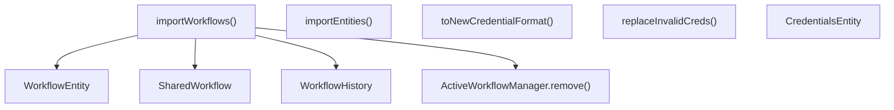
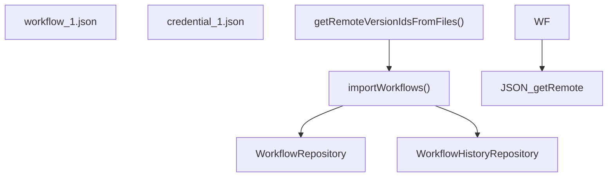

# Source Control and Environment Management

Relevant source files

-   [packages/@n8n/backend-test-utils/src/db/workflows.ts](https://github.com/n8n-io/n8n/blob/88f170b9/packages/@n8n/backend-test-utils/src/db/workflows.ts)
-   [packages/@n8n/config/src/configs/license.config.ts](https://github.com/n8n-io/n8n/blob/88f170b9/packages/@n8n/config/src/configs/license.config.ts)
-   [packages/@n8n/db/src/index.ts](https://github.com/n8n-io/n8n/blob/88f170b9/packages/@n8n/db/src/index.ts)
-   [packages/@n8n/db/src/services/\_\_tests\_\_/db-lock.service.test.ts](https://github.com/n8n-io/n8n/blob/88f170b9/packages/@n8n/db/src/services/__tests__/db-lock.service.test.ts)
-   [packages/@n8n/db/src/services/db-lock.service.ts](https://github.com/n8n-io/n8n/blob/88f170b9/packages/@n8n/db/src/services/db-lock.service.ts)
-   [packages/@n8n/db/src/services/index.ts](https://github.com/n8n-io/n8n/blob/88f170b9/packages/@n8n/db/src/services/index.ts)
-   [packages/cli/bin/n8n](https://github.com/n8n-io/n8n/blob/88f170b9/packages/cli/bin/n8n)
-   [packages/cli/src/commands/\_\_tests\_\_/start.test.ts](https://github.com/n8n-io/n8n/blob/88f170b9/packages/cli/src/commands/__tests__/start.test.ts)
-   [packages/cli/src/commands/audit.ts](https://github.com/n8n-io/n8n/blob/88f170b9/packages/cli/src/commands/audit.ts)
-   [packages/cli/src/commands/export/\_\_tests\_\_/entities.test.ts](https://github.com/n8n-io/n8n/blob/88f170b9/packages/cli/src/commands/export/__tests__/entities.test.ts)
-   [packages/cli/src/commands/export/entities.ts](https://github.com/n8n-io/n8n/blob/88f170b9/packages/cli/src/commands/export/entities.ts)
-   [packages/cli/src/commands/import/\_\_tests\_\_/entities.test.ts](https://github.com/n8n-io/n8n/blob/88f170b9/packages/cli/src/commands/import/__tests__/entities.test.ts)
-   [packages/cli/src/commands/import/credentials.ts](https://github.com/n8n-io/n8n/blob/88f170b9/packages/cli/src/commands/import/credentials.ts)
-   [packages/cli/src/commands/import/entities.ts](https://github.com/n8n-io/n8n/blob/88f170b9/packages/cli/src/commands/import/entities.ts)
-   [packages/cli/src/commands/import/workflow.ts](https://github.com/n8n-io/n8n/blob/88f170b9/packages/cli/src/commands/import/workflow.ts)
-   [packages/cli/src/commands/license/clear.ts](https://github.com/n8n-io/n8n/blob/88f170b9/packages/cli/src/commands/license/clear.ts)
-   [packages/cli/src/commands/license/info.ts](https://github.com/n8n-io/n8n/blob/88f170b9/packages/cli/src/commands/license/info.ts)
-   [packages/cli/src/public-api/v1/handlers/source-control/source-control.handler.ts](https://github.com/n8n-io/n8n/blob/88f170b9/packages/cli/src/public-api/v1/handlers/source-control/source-control.handler.ts)
-   [packages/cli/src/public-api/v1/handlers/workflows/workflows.service.ts](https://github.com/n8n-io/n8n/blob/88f170b9/packages/cli/src/public-api/v1/handlers/workflows/workflows.service.ts)
-   [packages/cli/src/services/\_\_tests\_\_/export.service.test.ts](https://github.com/n8n-io/n8n/blob/88f170b9/packages/cli/src/services/__tests__/export.service.test.ts)
-   [packages/cli/src/services/\_\_tests\_\_/import.service.test.ts](https://github.com/n8n-io/n8n/blob/88f170b9/packages/cli/src/services/__tests__/import.service.test.ts)
-   [packages/cli/src/services/cache/cache.types.ts](https://github.com/n8n-io/n8n/blob/88f170b9/packages/cli/src/services/cache/cache.types.ts)
-   [packages/cli/src/services/export.service.ts](https://github.com/n8n-io/n8n/blob/88f170b9/packages/cli/src/services/export.service.ts)
-   [packages/cli/src/services/import.service.ts](https://github.com/n8n-io/n8n/blob/88f170b9/packages/cli/src/services/import.service.ts)
-   [packages/cli/src/services/tag.service.ts](https://github.com/n8n-io/n8n/blob/88f170b9/packages/cli/src/services/tag.service.ts)
-   [packages/cli/src/utils/\_\_tests\_\_/validate-database-type.test.ts](https://github.com/n8n-io/n8n/blob/88f170b9/packages/cli/src/utils/__tests__/validate-database-type.test.ts)
-   [packages/cli/src/utils/compression.util.ts](https://github.com/n8n-io/n8n/blob/88f170b9/packages/cli/src/utils/compression.util.ts)
-   [packages/cli/src/utils/validate-database-type.ts](https://github.com/n8n-io/n8n/blob/88f170b9/packages/cli/src/utils/validate-database-type.ts)
-   [packages/cli/test/integration/commands/credentials.cmd.test.ts](https://github.com/n8n-io/n8n/blob/88f170b9/packages/cli/test/integration/commands/credentials.cmd.test.ts)
-   [packages/cli/test/integration/commands/import-workflows/combined/single.json](https://github.com/n8n-io/n8n/blob/88f170b9/packages/cli/test/integration/commands/import-workflows/combined/single.json)
-   [packages/cli/test/integration/commands/import.cmd.test.ts](https://github.com/n8n-io/n8n/blob/88f170b9/packages/cli/test/integration/commands/import.cmd.test.ts)
-   [packages/cli/test/integration/commands/ldap/reset.test.ts](https://github.com/n8n-io/n8n/blob/88f170b9/packages/cli/test/integration/commands/ldap/reset.test.ts)
-   [packages/cli/test/integration/commands/license.cmd.test.ts](https://github.com/n8n-io/n8n/blob/88f170b9/packages/cli/test/integration/commands/license.cmd.test.ts)
-   [packages/cli/test/integration/commands/update/workflow.test.ts](https://github.com/n8n-io/n8n/blob/88f170b9/packages/cli/test/integration/commands/update/workflow.test.ts)
-   [packages/cli/test/integration/database/services/db-lock.service.test.ts](https://github.com/n8n-io/n8n/blob/88f170b9/packages/cli/test/integration/database/services/db-lock.service.test.ts)
-   [packages/cli/test/integration/environments/source-control-import.service.test.ts](https://github.com/n8n-io/n8n/blob/88f170b9/packages/cli/test/integration/environments/source-control-import.service.test.ts)
-   [packages/cli/test/integration/environments/source-control.service.test.ts](https://github.com/n8n-io/n8n/blob/88f170b9/packages/cli/test/integration/environments/source-control.service.test.ts)
-   [packages/cli/test/integration/executions.controller.test.ts](https://github.com/n8n-io/n8n/blob/88f170b9/packages/cli/test/integration/executions.controller.test.ts)
-   [packages/cli/test/integration/import.service.test.ts](https://github.com/n8n-io/n8n/blob/88f170b9/packages/cli/test/integration/import.service.test.ts)
-   [packages/cli/test/integration/shared/db/tags.ts](https://github.com/n8n-io/n8n/blob/88f170b9/packages/cli/test/integration/shared/db/tags.ts)
-   [packages/cli/test/integration/workflows/workflows.controller-with-active-workflow-manager.ee.test.ts](https://github.com/n8n-io/n8n/blob/88f170b9/packages/cli/test/integration/workflows/workflows.controller-with-active-workflow-manager.ee.test.ts)
-   [packages/core/src/encryption/\_\_tests\_\_/cipher.test.ts](https://github.com/n8n-io/n8n/blob/88f170b9/packages/core/src/encryption/__tests__/cipher.test.ts)
-   [packages/core/src/encryption/cipher.ts](https://github.com/n8n-io/n8n/blob/88f170b9/packages/core/src/encryption/cipher.ts)

## Purpose and Scope

This document covers n8n's environment variable management system and its source control integration for workflows and credentials. The environment management system handles configuration through environment variables and config files, while source control features enable version control of workflows and database entities through Git integration and CLI-based import/export operations.

For general configuration schema and validation, see [Configuration System](/n8n-io/n8n/7.1-configuration-system). For deployment-specific configuration, see [Docker Deployment](/n8n-io/n8n/7.3-docker-deployment).

---

## Environment Variable Loading System

n8n loads environment variables early in the application lifecycle to ensure all configuration is available before services initialize. The loading sequence occurs in the CLI entrypoint.

### Initialization Sequence

> **[Mermaid sequence]**
> *(图表结构无法解析)*

**Sources:** [packages/cli/bin/n8n36-63](https://github.com/n8n-io/n8n/blob/88f170b9/packages/cli/bin/n8n#L36-L63)

### Early Configuration Loading

The CLI loads environment variables from `.env` files using `dotenv`. This occurs before any other initialization to ensure `process.env` is up-to-date. Configuration from `GlobalConfig` is loaded immediately after to ensure that TypeORM entities in `@n8n/db` have access to database settings (like `database.type`) which are required for entity decorators to decide on column types and timestamp syntax.

**Sources:** [packages/cli/bin/n8n36-46](https://github.com/n8n-io/n8n/blob/88f170b9/packages/cli/bin/n8n#L36-L46)

### Network and DNS Configuration

n8n supports specific environment variables to handle network compatibility issues, particularly with Node.js 20's "Happy Eyeballs" algorithm which can cause issues with services like Telegram or Airtable.

-   `NODEJS_PREFER_IPV4`: If set to `true`, n8n forces DNS resolution to prioritize IPv4 [packages/cli/bin/n8n48-50](https://github.com/n8n-io/n8n/blob/88f170b9/packages/cli/bin/n8n#L48-L50)
-   `net.setDefaultAutoSelectFamily(false)`: This is called to restore pre-v20 behavior for dual-stack IPv4/IPv6 environments [packages/cli/bin/n8n52-58](https://github.com/n8n-io/n8n/blob/88f170b9/packages/cli/bin/n8n#L52-L58)

---

## Database Entity Import and Export

n8n provides robust services for moving data between the database and the file system. These services power the CLI commands used for backups and environment synchronization.

### Import Architecture

The `ImportService` handles the complex logic of upserting workflows, credentials, and tags while maintaining relational integrity.

**Key Behaviors:**

-   **Deactivation:** All workflows are automatically deactivated (`active = false`) upon import to prevent unintended triggers from running immediately [packages/cli/src/services/import.service.ts124-125](https://github.com/n8n-io/n8n/blob/88f170b9/packages/cli/src/services/import.service.ts#L124-L125)
-   **Version History:** A new `versionId` (UUID) is generated for every imported workflow to ensure proper history ordering [packages/cli/src/services/import.service.ts116-163](https://github.com/n8n-io/n8n/blob/88f170b9/packages/cli/src/services/import.service.ts#L116-L163)
-   **Foreign Key Management:** The service includes logic to temporarily disable/enable foreign key constraints for SQLite and Postgres to allow bulk imports [packages/cli/src/services/import.service.ts35-50](https://github.com/n8n-io/n8n/blob/88f170b9/packages/cli/src/services/import.service.ts#L35-L50)

**Sources:** [packages/cli/src/services/import.service.ts110-183](https://github.com/n8n-io/n8n/blob/88f170b9/packages/cli/src/services/import.service.ts#L110-L183) [packages/cli/src/services/import.service.ts35-50](https://github.com/n8n-io/n8n/blob/88f170b9/packages/cli/src/services/import.service.ts#L35-L50)

### Export Architecture

The `ExportService` handles serializing database tables into `.jsonl` (JSON Lines) files.

-   **Encryption:** The service uses `Cipher` to encrypt exported data. It can accept a `customEncryptionKey` via a `keyFilePath` [packages/cli/src/services/export.service.ts105-117](https://github.com/n8n-io/n8n/blob/88f170b9/packages/cli/src/services/export.service.ts#L105-L117)
-   **Pagination:** To handle large datasets (like executions), the service exports in pages (default 500 entities) to avoid memory exhaustion [packages/cli/src/services/export.service.ts131-165](https://github.com/n8n-io/n8n/blob/88f170b9/packages/cli/src/services/export.service.ts#L131-L165)
-   **System Tables:** It specifically handles the `migrations` table to ensure the target database schema matches the source [packages/cli/src/services/export.service.ts37-91](https://github.com/n8n-io/n8n/blob/88f170b9/packages/cli/src/services/export.service.ts#L37-L91)

**Sources:** [packages/cli/src/services/export.service.ts13-18](https://github.com/n8n-io/n8n/blob/88f170b9/packages/cli/src/services/export.service.ts#L13-L18) [packages/cli/src/services/export.service.ts131-203](https://github.com/n8n-io/n8n/blob/88f170b9/packages/cli/src/services/export.service.ts#L131-L203)

---

## CLI Command Interface

The following commands provide the primary interface for environment management and source control operations.

### Workflow and Credential Import

| Command | Flag | Description |
| --- | --- | --- |
| `import:workflow` | `--input` | Path to JSON file or directory [packages/cli/src/commands/import/workflow.ts63-67](https://github.com/n8n-io/n8n/blob/88f170b9/packages/cli/src/commands/import/workflow.ts#L63-L67) |
|  | `--separate` | Import multiple `.json` files from a directory [packages/cli/src/commands/import/workflow.ts68-71](https://github.com/n8n-io/n8n/blob/88f170b9/packages/cli/src/commands/import/workflow.ts#L68-L71) |
|  | `--userId` | Assign imported workflows to a specific user [packages/cli/src/commands/import/workflow.ts72](https://github.com/n8n-io/n8n/blob/88f170b9/packages/cli/src/commands/import/workflow.ts#L72-L72) |
| `import:credentials` | `--input` | Path to credentials JSON [packages/cli/src/commands/import/credentials.ts26-30](https://github.com/n8n-io/n8n/blob/88f170b9/packages/cli/src/commands/import/credentials.ts#L26-L30) |

### Bulk Entity Import/Export (Under Development)

n8n is introducing a more comprehensive entity management system via `import:entities` and `export:entities`.

-   **Truncation:** The `--truncateTables` flag allows clearing the database before import [packages/cli/src/commands/import/entities.ts14](https://github.com/n8n-io/n8n/blob/88f170b9/packages/cli/src/commands/import/entities.ts#L14-L14)
-   **Constraint Toggling:** The `--skipTogglingForeignKeyConstraints` flag allows skipping the automatic disabling of DB constraints [packages/cli/src/commands/import/entities.ts23-26](https://github.com/n8n-io/n8n/blob/88f170b9/packages/cli/src/commands/import/entities.ts#L23-L26)

**Sources:** [packages/cli/src/commands/import/entities.ts9-27](https://github.com/n8n-io/n8n/blob/88f170b9/packages/cli/src/commands/import/entities.ts#L9-L27) [packages/cli/src/commands/import/workflow.ts79-91](https://github.com/n8n-io/n8n/blob/88f170b9/packages/cli/src/commands/import/workflow.ts#L79-L91)

---

## Source Control Integration (Enterprise)

n8n Enterprise features a dedicated `SourceControlImportService` (EE) that bridges the gap between a local Git repository and the n8n database.

### Git Import Logic

The `SourceControlImportService` manages the synchronization of files pulled from Git.

**Sources:** [packages/cli/test/integration/environments/source-control-import.service.test.ts40-45](https://github.com/n8n-io/n8n/blob/88f170b9/packages/cli/test/integration/environments/source-control-import.service.test.ts#L40-L45) [packages/cli/test/integration/environments/source-control-import.service.test.ts133-187](https://github.com/n8n-io/n8n/blob/88f170b9/packages/cli/test/integration/environments/source-control-import.service.test.ts#L133-L187)

### Credential Handling in Source Control

Unlike standard exports, source control exports often involve "ExportableCredentials" which contain metadata but exclude sensitive secrets unless specifically configured. The `SourceControlImportService` uses `SharedCredentialsRepository` and `SharedWorkflowRepository` to ensure that imported resources are correctly shared within the appropriate team projects [packages/cli/test/integration/environments/source-control-import.service.test.ts24-30](https://github.com/n8n-io/n8n/blob/88f170b9/packages/cli/test/integration/environments/source-control-import.service.test.ts#L24-L30)

---

## Environment Variable Patterns

n8n uses a consistent naming pattern for environment variables, often mapped via the `@Env` decorator in the configuration package.

| Prefix | Purpose |
| --- | --- |
| `N8N_` | Core application settings (e.g., `N8N_ENCRYPTION_KEY`, `N8N_PORT`) |
| `DB_` | Database connection details (e.g., `DB_TYPE`, `DB_POSTGRESDB_HOST`) |
| `E2E_` | Test environment flags (e.g., `E2E_TESTS`) [packages/cli/bin/n8n38](https://github.com/n8n-io/n8n/blob/88f170b9/packages/cli/bin/n8n#L38-L38) |
| `NODE_` | Node.js runtime overrides (e.g., `NODE_CONFIG_DIR`) [packages/cli/bin/n8n7](https://github.com/n8n-io/n8n/blob/88f170b9/packages/cli/bin/n8n#L7-L7) |

### Security: Encryption and Ciphers

All sensitive data in n8n (credentials, some workflow settings) is encrypted using the `Cipher` class. During import/export, the `Cipher` service is heavily utilized:

-   **Export:** Data is encrypted before being written to `.jsonl` files [packages/cli/src/services/export.service.ts201](https://github.com/n8n-io/n8n/blob/88f170b9/packages/cli/src/services/export.service.ts#L201-L201)
-   **Import:** Credentials found in plain text format in import files are automatically encrypted before storage [packages/cli/src/commands/import/credentials.ts223-230](https://github.com/n8n-io/n8n/blob/88f170b9/packages/cli/src/commands/import/credentials.ts#L223-L230)

**Sources:** [packages/core/src/encryption/cipher.ts1-10](https://github.com/n8n-io/n8n/blob/88f170b9/packages/core/src/encryption/cipher.ts#L1-L10) [packages/cli/src/services/export.service.ts13-18](https://github.com/n8n-io/n8n/blob/88f170b9/packages/cli/src/services/export.service.ts#L13-L18)

---

## Related Systems

-   **Configuration System \[7.1\]**: Detailed documentation of `GlobalConfig` class and `@Env` decorators.
-   **Project-Based Authorization \[3.5\]**: How `SharedWorkflow` and `SharedCredentials` relate to project ownership during import.
-   **Workflow History \[3.1\]**: The `WorkflowHistory` system that tracks changes made via source control imports.
