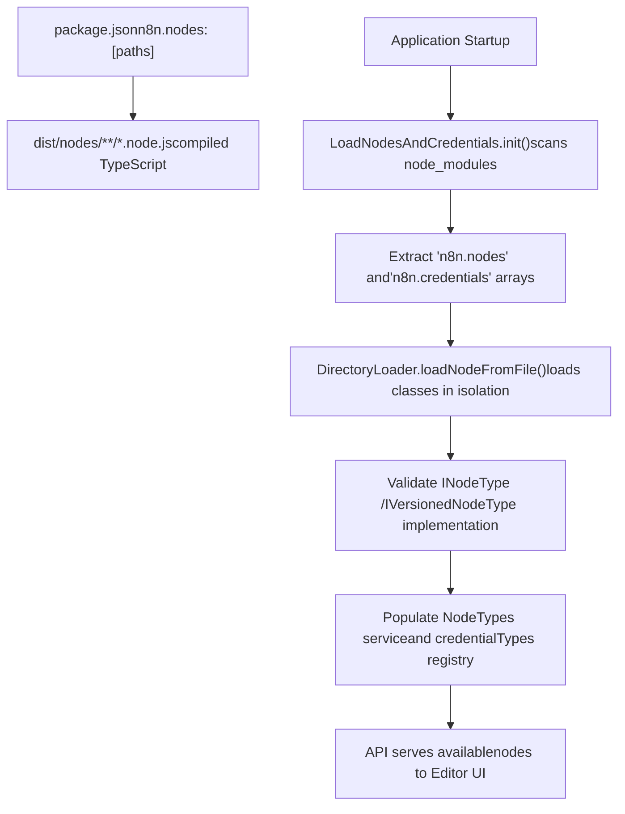
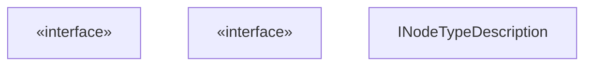

# Node System

Relevant source files

-   [docker/images/runners/n8n-task-runners.json](https://github.com/n8n-io/n8n/blob/88f170b9/docker/images/runners/n8n-task-runners.json)
-   [packages/@n8n/task-runner-python/src/\_\_init\_\_.py](https://github.com/n8n-io/n8n/blob/88f170b9/packages/@n8n/task-runner-python/src/__init__.py)
-   [packages/@n8n/task-runner-python/src/config/\_\_init\_\_.py](https://github.com/n8n-io/n8n/blob/88f170b9/packages/@n8n/task-runner-python/src/config/__init__.py)
-   [packages/@n8n/task-runner/src/js-task-runner/\_\_tests\_\_/require-resolver-global-modules.test.ts](https://github.com/n8n-io/n8n/blob/88f170b9/packages/@n8n/task-runner/src/js-task-runner/__tests__/require-resolver-global-modules.test.ts)
-   [packages/@n8n/utils/src/files/path.test.ts](https://github.com/n8n-io/n8n/blob/88f170b9/packages/@n8n/utils/src/files/path.test.ts)
-   [packages/@n8n/utils/src/files/path.ts](https://github.com/n8n-io/n8n/blob/88f170b9/packages/@n8n/utils/src/files/path.ts)
-   [packages/cli/src/\_\_tests\_\_/load-nodes-and-credentials.test.ts](https://github.com/n8n-io/n8n/blob/88f170b9/packages/cli/src/__tests__/load-nodes-and-credentials.test.ts)
-   [packages/cli/src/load-nodes-and-credentials.ts](https://github.com/n8n-io/n8n/blob/88f170b9/packages/cli/src/load-nodes-and-credentials.ts)
-   [packages/cli/src/security-audit/risk-reporters/nodes-risk-reporter.ts](https://github.com/n8n-io/n8n/blob/88f170b9/packages/cli/src/security-audit/risk-reporters/nodes-risk-reporter.ts)
-   [packages/cli/src/security-audit/security-audit.repository.ts](https://github.com/n8n-io/n8n/blob/88f170b9/packages/cli/src/security-audit/security-audit.repository.ts)
-   [packages/cli/src/security-audit/security-audit.service.ts](https://github.com/n8n-io/n8n/blob/88f170b9/packages/cli/src/security-audit/security-audit.service.ts)
-   [packages/cli/test/integration/security-audit/credentials-risk-reporter.test.ts](https://github.com/n8n-io/n8n/blob/88f170b9/packages/cli/test/integration/security-audit/credentials-risk-reporter.test.ts)
-   [packages/cli/test/integration/security-audit/database-risk-reporter.test.ts](https://github.com/n8n-io/n8n/blob/88f170b9/packages/cli/test/integration/security-audit/database-risk-reporter.test.ts)
-   [packages/cli/test/integration/security-audit/filesystem-risk-reporter.test.ts](https://github.com/n8n-io/n8n/blob/88f170b9/packages/cli/test/integration/security-audit/filesystem-risk-reporter.test.ts)
-   [packages/cli/test/integration/security-audit/instance-risk-reporter.test.ts](https://github.com/n8n-io/n8n/blob/88f170b9/packages/cli/test/integration/security-audit/instance-risk-reporter.test.ts)
-   [packages/cli/test/integration/security-audit/nodes-risk-reporter.test.ts](https://github.com/n8n-io/n8n/blob/88f170b9/packages/cli/test/integration/security-audit/nodes-risk-reporter.test.ts)
-   [packages/core/src/nodes-loader/\_\_tests\_\_/directory-loader.test.ts](https://github.com/n8n-io/n8n/blob/88f170b9/packages/core/src/nodes-loader/__tests__/directory-loader.test.ts)
-   [packages/core/src/nodes-loader/constants.ts](https://github.com/n8n-io/n8n/blob/88f170b9/packages/core/src/nodes-loader/constants.ts)
-   [packages/core/src/nodes-loader/custom-directory-loader.ts](https://github.com/n8n-io/n8n/blob/88f170b9/packages/core/src/nodes-loader/custom-directory-loader.ts)
-   [packages/core/src/nodes-loader/directory-loader.ts](https://github.com/n8n-io/n8n/blob/88f170b9/packages/core/src/nodes-loader/directory-loader.ts)
-   [packages/core/src/nodes-loader/lazy-package-directory-loader.ts](https://github.com/n8n-io/n8n/blob/88f170b9/packages/core/src/nodes-loader/lazy-package-directory-loader.ts)
-   [packages/core/src/nodes-loader/package-directory-loader.ts](https://github.com/n8n-io/n8n/blob/88f170b9/packages/core/src/nodes-loader/package-directory-loader.ts)

The Node System is the integration framework that powers n8n's workflow automation capabilities. It defines how nodes (workflow building blocks) are structured, registered, executed, and extended. This system encompasses over 500 built-in integrations, the LangChain AI node ecosystem, credential management, and the community package infrastructure.

For information about how nodes are executed within workflows, see [Workflow Execution Engine](/n8n-io/n8n/2-workflow-execution-engine). For details on developing custom nodes, see [Node Development and Community Packages](/n8n-io/n8n/4.5-node-development-and-community-packages).

---

## Overview and Architecture

Nodes are self-contained integration modules that implement the `INodeType` interface from `n8n-workflow`. Each node package declares its nodes and credentials via the `n8n` field in `package.json`, which the system uses for discovery and registration at runtime.

**Node Discovery and Registration Flow**

Sources: [packages/cli/src/load-nodes-and-credentials.ts66-111](https://github.com/n8n-io/n8n/blob/88f170b9/packages/cli/src/load-nodes-and-credentials.ts#L66-L111) [packages/core/src/nodes-loader/directory-loader.ts163-230](https://github.com/n8n-io/n8n/blob/88f170b9/packages/core/src/nodes-loader/directory-loader.ts#L163-L230) [packages/core/src/nodes-loader/package-directory-loader.ts27-55](https://github.com/n8n-io/n8n/blob/88f170b9/packages/core/src/nodes-loader/package-directory-loader.ts#L27-L55)

**Core Node Packages**

| Package | Purpose | Node Count | Key Features |
| --- | --- | --- | --- |
| `n8n-nodes-base` | Standard integrations | 500+ | HTTP, databases, cloud services, SaaS APIs |
| `@n8n/n8n-nodes-langchain` | AI/LLM capabilities | 100+ | Chat models, agents, vector stores, embeddings |
| Community packages | User-contributed | Variable | Published to npm with `n8n-nodes-` prefix |

Sources: [packages/cli/src/load-nodes-and-credentials.ts101-103](https://github.com/n8n-io/n8n/blob/88f170b9/packages/cli/src/load-nodes-and-credentials.ts#L101-L103)

---

## Node Type System and Registration

### INodeType Interface

All nodes must implement the `INodeType` or `IVersionedNodeType` interface, which defines the contract for node behavior, parameters, and execution logic.

**Core Node Type Structure**

Sources: [packages/core/src/nodes-loader/directory-loader.ts4-18](https://github.com/n8n-io/n8n/blob/88f170b9/packages/core/src/nodes-loader/directory-loader.ts#L4-L18) [packages/core/src/nodes-loader/directory-loader.ts164-210](https://github.com/n8n-io/n8n/blob/88f170b9/packages/core/src/nodes-loader/directory-loader.ts#L164-L210)

### Node Registration Process

The `LoadNodesAndCredentials` service handles node discovery. It delegates the actual loading to specialized `DirectoryLoader` implementations.

-   **`PackageDirectoryLoader`**: Loads nodes from standard npm packages like `n8n-nodes-base` [packages/core/src/nodes-loader/package-directory-loader.ts12-15](https://github.com/n8n-io/n8n/blob/88f170b9/packages/core/src/nodes-loader/package-directory-loader.ts#L12-L15)
-   **`CustomDirectoryLoader`**: Loads files from user-defined custom directories (e.g., `~/.n8n/custom`) [packages/core/src/nodes-loader/custom-directory-loader.ts10-11](https://github.com/n8n-io/n8n/blob/88f170b9/packages/core/src/nodes-loader/custom-directory-loader.ts#L10-L11)
-   **`LazyPackageDirectoryLoader`**: Optimizes startup by only loading node descriptions initially, deferring full class loading until execution [packages/cli/src/load-nodes-and-credentials.ts187-189](https://github.com/n8n-io/n8n/blob/88f170b9/packages/cli/src/load-nodes-and-credentials.ts#L187-L189)

For details, see [Node Type System and Registration](/n8n-io/n8n/4.1-node-type-system-and-registration).

---

## Standard Nodes and Integrations

Built-in nodes in `n8n-nodes-base` are organized by integration type and functional category. The `LoadNodesAndCredentials` service ensures that critical system paths are scanned first, including the core `n8n-nodes-base` and `@n8n/n8n-nodes-langchain` packages [packages/cli/src/load-nodes-and-credentials.ts92-103](https://github.com/n8n-io/n8n/blob/88f170b9/packages/cli/src/load-nodes-and-credentials.ts#L92-L103)

### Node Risk and Security

The system includes a `NodesRiskReporter` that audits workflows for "risky" nodes.

-   **Official Risky Nodes**: Nodes like `Execute Command` or `Read/Write Binary File` that have host system access [packages/cli/src/security-audit/risk-reporters/nodes-risk-reporter.ts48-58](https://github.com/n8n-io/n8n/blob/88f170b9/packages/cli/src/security-audit/risk-reporters/nodes-risk-reporter.ts#L48-L58)
-   **Community/Custom Nodes**: Nodes not vetted by the n8n team that run with the same permissions as the n8n process [packages/cli/src/security-audit/risk-reporters/nodes-risk-reporter.ts60-84](https://github.com/n8n-io/n8n/blob/88f170b9/packages/cli/src/security-audit/risk-reporters/nodes-risk-reporter.ts#L60-L84)

For details, see [Standard Nodes and Integrations](/n8n-io/n8n/4.2-standard-nodes-and-integrations).

---

## AI and LangChain Nodes

The `@n8n/n8n-nodes-langchain` package provides a comprehensive AI integration framework. These nodes are loaded alongside standard nodes but often utilize specialized sub-node connections (e.g., connecting a Model to an Agent) [packages/cli/src/load-nodes-and-credentials.ts102](https://github.com/n8n-io/n8n/blob/88f170b9/packages/cli/src/load-nodes-and-credentials.ts#L102-L102)

The system also includes specialized task runners for executing code in isolated environments, supporting both JavaScript and Python for AI-related data processing [docker/images/runners/n8n-task-runners.json1-56](https://github.com/n8n-io/n8n/blob/88f170b9/docker/images/runners/n8n-task-runners.json#L1-L56)

For details, see [AI and LangChain Nodes](/n8n-io/n8n/4.3-ai-and-langchain-nodes).

---

## Credential System for Nodes

Nodes declare their authentication requirements through the `ICredentialType` interface. The `LoadNodesAndCredentials` service manages the loading of these types from the same packages as the nodes [packages/cli/src/load-nodes-and-credentials.ts43-47](https://github.com/n8n-io/n8n/blob/88f170b9/packages/cli/src/load-nodes-and-credentials.ts#L43-L47)

**Credential Loading Logic**

-   **Discovery**: `DirectoryLoader` scans for `*.credentials.js` files [packages/core/src/nodes-loader/custom-directory-loader.ts30-37](https://github.com/n8n-io/n8n/blob/88f170b9/packages/core/src/nodes-loader/custom-directory-loader.ts#L30-L37)
-   **Association**: The system maintains a mapping of which nodes support which credentials via `nodesByCredential` [packages/core/src/nodes-loader/directory-loader.ts83](https://github.com/n8n-io/n8n/blob/88f170b9/packages/core/src/nodes-loader/directory-loader.ts#L83-L83)
-   **Validation**: Credentials can define a `test` property to verify connectivity [packages/cli/test/integration/security-audit/credentials-risk-reporter.test.ts46-88](https://github.com/n8n-io/n8n/blob/88f170b9/packages/cli/test/integration/security-audit/credentials-risk-reporter.test.ts#L46-L88)

For details, see [Credential System for Nodes](/n8n-io/n8n/4.4-credential-system-for-nodes).

---

## Node Development and Community Packages

n8n supports a "Community Package" system where users can publish nodes to npm. The `LoadNodesAndCredentials` service preserves the `NODE_PATH` environment variable during initialization to ensure that globally installed npm packages (common in Docker environments) are resolvable by the node loader and task runners [packages/cli/src/load-nodes-and-credentials.ts70-75](https://github.com/n8n-io/n8n/blob/88f170b9/packages/cli/src/load-nodes-and-credentials.ts#L70-L75)

**External Module Resolution** To support external modules in custom nodes or the Code node, n8n uses `Module._initPaths()` to refresh Node.js internal search paths after modifying `process.env.NODE_PATH` [packages/cli/src/load-nodes-and-credentials.ts79](https://github.com/n8n-io/n8n/blob/88f170b9/packages/cli/src/load-nodes-and-credentials.ts#L79-L79)

For details, see [Node Development and Community Packages](/n8n-io/n8n/4.5-node-development-and-community-packages).

Sources: [packages/cli/src/load-nodes-and-credentials.ts1-111](https://github.com/n8n-io/n8n/blob/88f170b9/packages/cli/src/load-nodes-and-credentials.ts#L1-L111) [packages/core/src/nodes-loader/directory-loader.ts61-103](https://github.com/n8n-io/n8n/blob/88f170b9/packages/core/src/nodes-loader/directory-loader.ts#L61-L103) [packages/cli/src/security-audit/risk-reporters/nodes-risk-reporter.ts21-86](https://github.com/n8n-io/n8n/blob/88f170b9/packages/cli/src/security-audit/risk-reporters/nodes-risk-reporter.ts#L21-L86)
