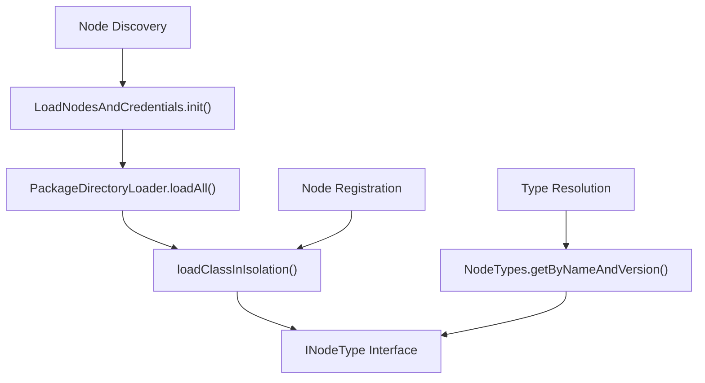
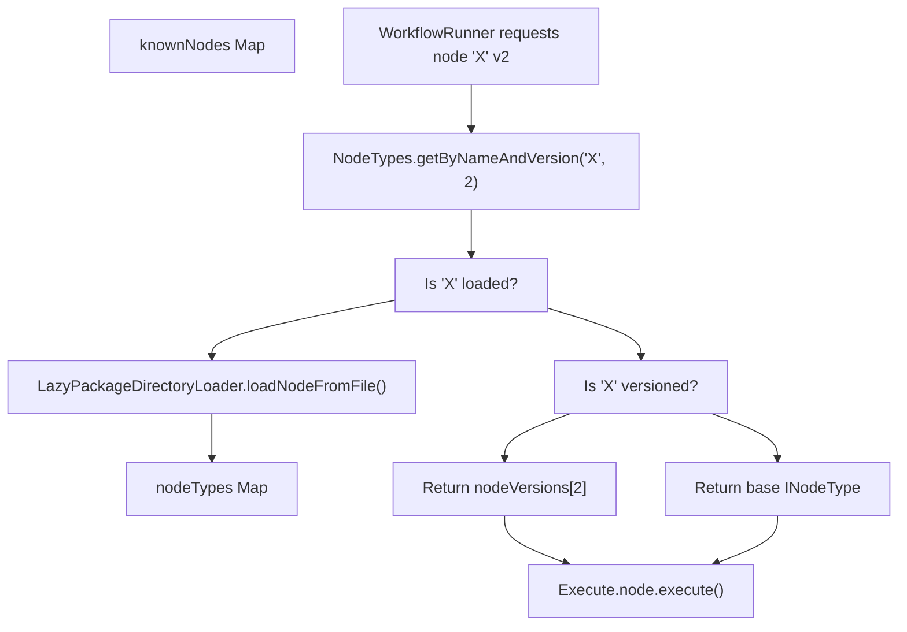

# Node Type System and Registration

Relevant source files

-   [docker/images/runners/n8n-task-runners.json](https://github.com/n8n-io/n8n/blob/88f170b9/docker/images/runners/n8n-task-runners.json)
-   [packages/@n8n/task-runner-python/src/\_\_init\_\_.py](https://github.com/n8n-io/n8n/blob/88f170b9/packages/@n8n/task-runner-python/src/__init__.py)
-   [packages/@n8n/task-runner-python/src/config/\_\_init\_\_.py](https://github.com/n8n-io/n8n/blob/88f170b9/packages/@n8n/task-runner-python/src/config/__init__.py)
-   [packages/@n8n/task-runner/src/js-task-runner/\_\_tests\_\_/require-resolver-global-modules.test.ts](https://github.com/n8n-io/n8n/blob/88f170b9/packages/@n8n/task-runner/src/js-task-runner/__tests__/require-resolver-global-modules.test.ts)
-   [packages/@n8n/utils/src/files/path.test.ts](https://github.com/n8n-io/n8n/blob/88f170b9/packages/@n8n/utils/src/files/path.test.ts)
-   [packages/@n8n/utils/src/files/path.ts](https://github.com/n8n-io/n8n/blob/88f170b9/packages/@n8n/utils/src/files/path.ts)
-   [packages/cli/src/\_\_tests\_\_/load-nodes-and-credentials.test.ts](https://github.com/n8n-io/n8n/blob/88f170b9/packages/cli/src/__tests__/load-nodes-and-credentials.test.ts)
-   [packages/cli/src/load-nodes-and-credentials.ts](https://github.com/n8n-io/n8n/blob/88f170b9/packages/cli/src/load-nodes-and-credentials.ts)
-   [packages/cli/src/security-audit/risk-reporters/nodes-risk-reporter.ts](https://github.com/n8n-io/n8n/blob/88f170b9/packages/cli/src/security-audit/risk-reporters/nodes-risk-reporter.ts)
-   [packages/cli/src/security-audit/security-audit.repository.ts](https://github.com/n8n-io/n8n/blob/88f170b9/packages/cli/src/security-audit/security-audit.repository.ts)
-   [packages/cli/src/security-audit/security-audit.service.ts](https://github.com/n8n-io/n8n/blob/88f170b9/packages/cli/src/security-audit/security-audit.service.ts)
-   [packages/cli/test/integration/security-audit/credentials-risk-reporter.test.ts](https://github.com/n8n-io/n8n/blob/88f170b9/packages/cli/test/integration/security-audit/credentials-risk-reporter.test.ts)
-   [packages/cli/test/integration/security-audit/database-risk-reporter.test.ts](https://github.com/n8n-io/n8n/blob/88f170b9/packages/cli/test/integration/security-audit/database-risk-reporter.test.ts)
-   [packages/cli/test/integration/security-audit/filesystem-risk-reporter.test.ts](https://github.com/n8n-io/n8n/blob/88f170b9/packages/cli/test/integration/security-audit/filesystem-risk-reporter.test.ts)
-   [packages/cli/test/integration/security-audit/instance-risk-reporter.test.ts](https://github.com/n8n-io/n8n/blob/88f170b9/packages/cli/test/integration/security-audit/instance-risk-reporter.test.ts)
-   [packages/cli/test/integration/security-audit/nodes-risk-reporter.test.ts](https://github.com/n8n-io/n8n/blob/88f170b9/packages/cli/test/integration/security-audit/nodes-risk-reporter.test.ts)
-   [packages/core/src/nodes-loader/\_\_tests\_\_/directory-loader.test.ts](https://github.com/n8n-io/n8n/blob/88f170b9/packages/core/src/nodes-loader/__tests__/directory-loader.test.ts)
-   [packages/core/src/nodes-loader/constants.ts](https://github.com/n8n-io/n8n/blob/88f170b9/packages/core/src/nodes-loader/constants.ts)
-   [packages/core/src/nodes-loader/custom-directory-loader.ts](https://github.com/n8n-io/n8n/blob/88f170b9/packages/core/src/nodes-loader/custom-directory-loader.ts)
-   [packages/core/src/nodes-loader/directory-loader.ts](https://github.com/n8n-io/n8n/blob/88f170b9/packages/core/src/nodes-loader/directory-loader.ts)
-   [packages/core/src/nodes-loader/lazy-package-directory-loader.ts](https://github.com/n8n-io/n8n/blob/88f170b9/packages/core/src/nodes-loader/lazy-package-directory-loader.ts)
-   [packages/core/src/nodes-loader/package-directory-loader.ts](https://github.com/n8n-io/n8n/blob/88f170b9/packages/core/src/nodes-loader/package-directory-loader.ts)

## Purpose and Scope

This page explains how n8n defines, discovers, loads, and registers node types and credential types at runtime. It covers the core interfaces that every node and credential must implement, the conventions for naming and versioning, the `DirectoryLoader` hierarchy that scans npm packages for node classes, the `LoadNodesAndCredentials` startup service, and the build-time scripts that produce static manifests consumed at both startup and in the frontend.

For how credentials are encrypted, tested, and injected at execution time, see [Credential System for Nodes](/n8n-io/n8n/4.4-credential-system-for-nodes). For the architecture of specific built-in nodes, see [Standard Nodes and Integrations](/n8n-io/n8n/4.2-standard-nodes-and-integrations). For community node packaging and installation lifecycle, see [Node Development and Community Packages](/n8n-io/n8n/4.5-node-development-and-community-packages).

---

## Core Type Interfaces

All node type contracts are declared in `packages/workflow`, the shared library imported by every other package in the monorepo.

### `INodeType`

`INodeType` is the runtime interface that every node class implements. It is defined in [packages/workflow/src/Interfaces.ts431-483](https://github.com/n8n-io/n8n/blob/88f170b9/packages/workflow/src/Interfaces.ts#L431-L483)

| Property / Method | Purpose |
| --- | --- |
| `description: INodeTypeDescription` | Static, serialisable metadata (name, parameters, inputs, outputs, credentials). |
| `execute?(this: IExecuteFunctions)` | Main execution path; called once per execution for action/transform nodes. |
| `trigger?(this: ITriggerFunctions)` | Called when a trigger node is activated; sets up listeners. |
| `poll?(this: IPollFunctions)` | Called on a schedule for polling trigger nodes. |
| `webhook?(this: IWebhookFunctions)` | Called when an inbound HTTP request matches a registered webhook. |
| `supplyData?(this: ISupplyDataFunctions, itemIndex)` | Used by AI sub-nodes to supply data objects (LLMs, tools, memory) to parent agent nodes. |
| `methods?` | Grouped runtime methods: `loadOptions`, `listSearch`, `resourceMapping`, `credentialTest`. |
| `webhookMethods?` | `checkExists`, `create`, `delete` for managing remote webhook registrations. |

### `INodeTypeDescription`

`INodeTypeDescription` is the pure-data descriptor embedded in every `INodeType.description`. It is fully serialisable and is transferred to the frontend for UI rendering.

| Field | Type | Purpose |
| --- | --- | --- |
| `name` | `string` | Unique type identifier, e.g. `n8n-nodes-base.httpRequest`. |
| `displayName` | `string` | Human-readable label. |
| `version` | `number | number[]` | Supported version(s). |
| `group` | `string[]` | Classification: `['trigger']`, `['transform']`, etc. |
| `properties` | `INodeProperties[]` | Parameter definitions rendered in the NDV panel. |
| `credentials?` | `INodeCredentialDescription[]` | Credential slots the node uses. |
| `inputs` | `string[] | INodeInputConfiguration[]` | Input connector declarations. |
| `outputs` | `string[] | INodeOutputConfiguration[]` | Output connector declarations. |
| `icon?` | `string` | SVG or FontAwesome reference, e.g. `file:httpRequest.svg`. |
| `codex?` | `CodexData` | AI-facing metadata: `categories`, `subcategories`, `alias`. |

The `codex` field is read at runtime for AI categorisation queries — see `nodeType.description.codex?.categories` at [packages/workflow/src/telemetry-helpers.ts728-730](https://github.com/n8n-io/n8n/blob/88f170b9/packages/workflow/src/telemetry-helpers.ts#L728-L730)

### `ICredentialType`

Credentials mirror the node pattern. `ICredentialType` ([packages/workflow/src/Interfaces.ts346-371](https://github.com/n8n-io/n8n/blob/88f170b9/packages/workflow/src/Interfaces.ts#L346-L371)) holds:

| Field | Purpose |
| --- | --- |
| `name` | Unique credential type name, e.g. `githubApi`. |
| `displayName` | UI label. |
| `properties: INodeProperties[]` | Fields the user fills in (tokens, URLs, keys). |
| `extends?` | Parent credential types whose properties are inherited. |
| `authenticate?` | Injects credentials into outgoing HTTP request options. |
| `test?: ICredentialTestRequest` | A request to execute for credential validation. |
| `supportedNodes?` | Which node types accept this credential. |

Sources: [packages/workflow/src/Interfaces.ts346-371](https://github.com/n8n-io/n8n/blob/88f170b9/packages/workflow/src/Interfaces.ts#L346-L371) [packages/workflow/src/Interfaces.ts431-483](https://github.com/n8n-io/n8n/blob/88f170b9/packages/workflow/src/Interfaces.ts#L431-L483) [packages/workflow/src/telemetry-helpers.ts728-730](https://github.com/n8n-io/n8n/blob/88f170b9/packages/workflow/src/telemetry-helpers.ts#L728-L730)

---

## Node Type Naming and Versioning

Node type names follow a `packageName.nodeName` convention. `packages/workflow/src/Constants.ts` exports string constants for built-in types:

-   `HTTP_REQUEST_NODE_TYPE`: `n8n-nodes-base.httpRequest`
-   `CODE_NODE_TYPE`: `n8n-nodes-base.code`
-   `AGENT_LANGCHAIN_NODE_TYPE`: `@n8n/n8n-nodes-langchain.agent`

### Versioning Mechanism

n8n allows breaking node changes via `IVersionedNodeType` ([packages/workflow/src/Interfaces.ts485-491](https://github.com/n8n-io/n8n/blob/88f170b9/packages/workflow/src/Interfaces.ts#L485-L491)).

-   **Versioned node**: A class implementing `IVersionedNodeType` holding a map of `nodeVersions: { [version: number]: INodeType }`.
-   **Resolution**: At runtime, `getByNameAndVersion(type, version)` selects the matching sub-type. If the version is not specified, it defaults to the `currentVersion` defined in the class.

Sources: [packages/workflow/src/Constants.ts25-111](https://github.com/n8n-io/n8n/blob/88f170b9/packages/workflow/src/Constants.ts#L25-L111) [packages/workflow/src/Interfaces.ts485-491](https://github.com/n8n-io/n8n/blob/88f170b9/packages/workflow/src/Interfaces.ts#L485-L491) [packages/workflow/src/Interfaces.ts939-945](https://github.com/n8n-io/n8n/blob/88f170b9/packages/workflow/src/Interfaces.ts#L939-L945)

---

## Discovery and Loading System

The discovery system is responsible for scanning directories, identifying node files, and loading them into memory.

### `DirectoryLoader` Hierarchy

`DirectoryLoader` ([packages/core/src/nodes-loader/directory-loader.ts61](https://github.com/n8n-io/n8n/blob/88f170b9/packages/core/src/nodes-loader/directory-loader.ts#L61-L61)) is the abstract base class for all loaders. It manages the `known` registry of class names and source paths.

| Class | Role | File |
| --- | --- | --- |
| `PackageDirectoryLoader` | Loads from `package.json` definitions (e.g., `nodes-base`). | [packages/core/src/nodes-loader/package-directory-loader.ts12](https://github.com/n8n-io/n8n/blob/88f170b9/packages/core/src/nodes-loader/package-directory-loader.ts#L12-L12) |
| `LazyPackageDirectoryLoader` | Loads only descriptions initially, requiring classes on demand. | [packages/core/src/nodes-loader/lazy-package-directory-loader.ts11](https://github.com/n8n-io/n8n/blob/88f170b9/packages/core/src/nodes-loader/lazy-package-directory-loader.ts#L11-L11) |
| `CustomDirectoryLoader` | Scans a directory for `**/*.node.js` files (custom nodes). | [packages/core/src/nodes-loader/custom-directory-loader.ts10](https://github.com/n8n-io/n8n/blob/88f170b9/packages/core/src/nodes-loader/custom-directory-loader.ts#L10-L10) |

### `LoadNodesAndCredentials` Service

`LoadNodesAndCredentials` ([packages/cli/src/load-nodes-and-credentials.ts39](https://github.com/n8n-io/n8n/blob/88f170b9/packages/cli/src/load-nodes-and-credentials.ts#L39-L39)) is the central coordinator. During `init()`, it:

1.  Sets up `NODE_PATH` to ensure the task runner can resolve modules [packages/cli/src/load-nodes-and-credentials.ts73-75](https://github.com/n8n-io/n8n/blob/88f170b9/packages/cli/src/load-nodes-and-credentials.ts#L73-L75)
2.  Scans `n8n-nodes-base` and `@n8n/n8n-nodes-langchain` [packages/cli/src/load-nodes-and-credentials.ts101-103](https://github.com/n8n-io/n8n/blob/88f170b9/packages/cli/src/load-nodes-and-credentials.ts#L101-L103)
3.  Loads custom nodes from directories specified in `N8N_CUSTOM_EXTENSIONS` [packages/cli/src/load-nodes-and-credentials.ts109](https://github.com/n8n-io/n8n/blob/88f170b9/packages/cli/src/load-nodes-and-credentials.ts#L109-L109)

**Startup Loading Sequence**

> **[Mermaid sequence]**
> *(图表结构无法解析)*

Sources: [packages/core/src/nodes-loader/directory-loader.ts61](https://github.com/n8n-io/n8n/blob/88f170b9/packages/core/src/nodes-loader/directory-loader.ts#L61-L61) [packages/core/src/nodes-loader/package-directory-loader.ts12](https://github.com/n8n-io/n8n/blob/88f170b9/packages/core/src/nodes-loader/package-directory-loader.ts#L12-L12) [packages/core/src/nodes-loader/custom-directory-loader.ts10](https://github.com/n8n-io/n8n/blob/88f170b9/packages/core/src/nodes-loader/custom-directory-loader.ts#L10-L10) [packages/cli/src/load-nodes-and-credentials.ts39-111](https://github.com/n8n-io/n8n/blob/88f170b9/packages/cli/src/load-nodes-and-credentials.ts#L39-L111)

---

## Runtime Registration and Data Flow

Once loaded, node types are stored in the `NodeTypes` service, which acts as the authoritative registry for the execution engine.

### Code Entity Space Mapping

This diagram maps the logical registration concepts to specific classes and functions in the codebase.

### Execution Time Lookup

When a workflow starts, `WorkflowExecute` resolves the node implementation using the `NodeTypes` service.

1.  **Input**: A node name (e.g., `n8n-nodes-base.httpRequest`) and a version.
2.  **Action**: `NodeTypes.getByNameAndVersion()` is called [packages/workflow/src/telemetry-helpers.ts286-287](https://github.com/n8n-io/n8n/blob/88f170b9/packages/workflow/src/telemetry-helpers.ts#L286-L287)
3.  **Output**: An instance of `INodeType` or a specific version from `IVersionedNodeType`.

**Node Type Resolution Flow**

Sources: [packages/workflow/src/telemetry-helpers.ts285-340](https://github.com/n8n-io/n8n/blob/88f170b9/packages/workflow/src/telemetry-helpers.ts#L285-L340) [packages/cli/src/load-nodes-and-credentials.ts148-167](https://github.com/n8n-io/n8n/blob/88f170b9/packages/cli/src/load-nodes-and-credentials.ts#L148-L167) [packages/core/src/nodes-loader/directory-loader.ts163-230](https://github.com/n8n-io/n8n/blob/88f170b9/packages/core/src/nodes-loader/directory-loader.ts#L163-L230)

---

## Security and Sandboxing

Nodes are loaded using `loadClassInIsolation` [packages/core/src/nodes-loader/load-class-in-isolation.ts](https://github.com/n8n-io/n8n/blob/88f170b9/packages/core/src/nodes-loader/load-class-in-isolation.ts) which ensures that node classes are required in a way that minimizes side effects.

### Task Runner Integration

For nodes like the `Code` node that execute user-provided scripts, n8n uses a separate Task Runner process.

-   `LoadNodesAndCredentials` preserves the `NODE_PATH` environment variable so that globally installed npm modules (e.g., in Docker) remain accessible to the task runner subprocess [packages/cli/src/load-nodes-and-credentials.ts73-75](https://github.com/n8n-io/n8n/blob/88f170b9/packages/cli/src/load-nodes-and-credentials.ts#L73-L75)
-   The `allowed-env` list in `n8n-task-runners.json` explicitly permits `NODE_PATH` to be passed to the runner [docker/images/runners/n8n-task-runners.json17](https://github.com/n8n-io/n8n/blob/88f170b9/docker/images/runners/n8n-task-runners.json#L17-L17)

Sources: [packages/cli/src/load-nodes-and-credentials.test.ts55-67](https://github.com/n8n-io/n8n/blob/88f170b9/packages/cli/src/load-nodes-and-credentials.test.ts#L55-L67) [docker/images/runners/n8n-task-runners.json1-56](https://github.com/n8n-io/n8n/blob/88f170b9/docker/images/runners/n8n-task-runners.json#L1-L56) [packages/cli/src/load-nodes-and-credentials.ts70-76](https://github.com/n8n-io/n8n/blob/88f170b9/packages/cli/src/load-nodes-and-credentials.ts#L70-L76)
