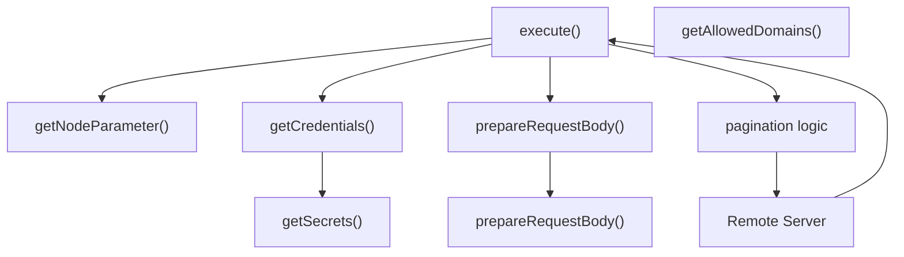
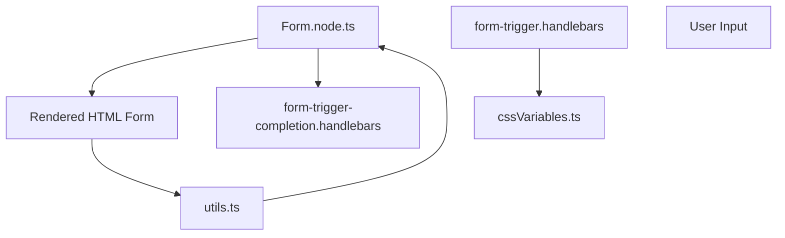
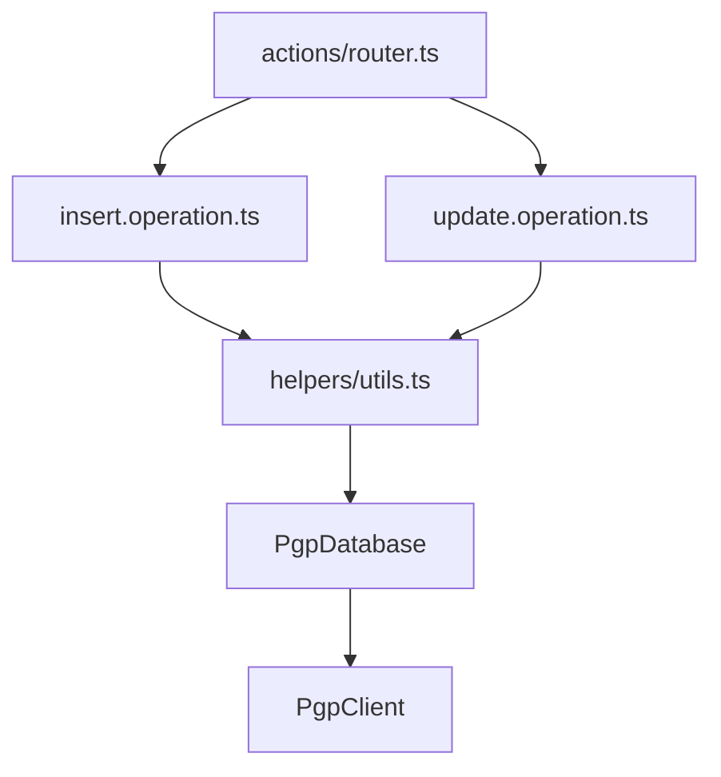

# Standard Nodes and Integrations

Relevant source files

-   [packages/cli/src/webhooks/\_\_tests\_\_/waiting-forms.test.ts](https://github.com/n8n-io/n8n/blob/88f170b9/packages/cli/src/webhooks/__tests__/waiting-forms.test.ts)
-   [packages/cli/src/webhooks/\_\_tests\_\_/waiting-webhooks.test.ts](https://github.com/n8n-io/n8n/blob/88f170b9/packages/cli/src/webhooks/__tests__/waiting-webhooks.test.ts)
-   [packages/cli/src/webhooks/waiting-forms.ts](https://github.com/n8n-io/n8n/blob/88f170b9/packages/cli/src/webhooks/waiting-forms.ts)
-   [packages/cli/src/webhooks/waiting-webhooks.ts](https://github.com/n8n-io/n8n/blob/88f170b9/packages/cli/src/webhooks/waiting-webhooks.ts)
-   [packages/cli/templates/form-trigger-completion.handlebars](https://github.com/n8n-io/n8n/blob/88f170b9/packages/cli/templates/form-trigger-completion.handlebars)
-   [packages/cli/templates/form-trigger.handlebars](https://github.com/n8n-io/n8n/blob/88f170b9/packages/cli/templates/form-trigger.handlebars)
-   [packages/frontend/editor-ui/src/features/ndv/parameters/components/ResourceLocator/ResourceLocator.test.ts](https://github.com/n8n-io/n8n/blob/88f170b9/packages/frontend/editor-ui/src/features/ndv/parameters/components/ResourceLocator/ResourceLocator.test.ts)
-   [packages/frontend/editor-ui/src/features/ndv/parameters/components/ResourceLocator/ResourceLocator.vue](https://github.com/n8n-io/n8n/blob/88f170b9/packages/frontend/editor-ui/src/features/ndv/parameters/components/ResourceLocator/ResourceLocator.vue)
-   [packages/frontend/editor-ui/src/features/ndv/parameters/components/ResourceLocator/ResourceLocatorDropdown.test.ts](https://github.com/n8n-io/n8n/blob/88f170b9/packages/frontend/editor-ui/src/features/ndv/parameters/components/ResourceLocator/ResourceLocatorDropdown.test.ts)
-   [packages/frontend/editor-ui/src/features/ndv/parameters/components/ResourceLocator/ResourceLocatorDropdown.vue](https://github.com/n8n-io/n8n/blob/88f170b9/packages/frontend/editor-ui/src/features/ndv/parameters/components/ResourceLocator/ResourceLocatorDropdown.vue)
-   [packages/frontend/editor-ui/src/features/shared/editors/components/InlineExpressionEditor/InlineExpressionTip.vue](https://github.com/n8n-io/n8n/blob/88f170b9/packages/frontend/editor-ui/src/features/shared/editors/components/InlineExpressionEditor/InlineExpressionTip.vue)
-   [packages/nodes-base/credentials/GoogleSheetsOAuth2Api.credentials.ts](https://github.com/n8n-io/n8n/blob/88f170b9/packages/nodes-base/credentials/GoogleSheetsOAuth2Api.credentials.ts)
-   [packages/nodes-base/credentials/GoogleSheetsTriggerOAuth2Api.credentials.ts](https://github.com/n8n-io/n8n/blob/88f170b9/packages/nodes-base/credentials/GoogleSheetsTriggerOAuth2Api.credentials.ts)
-   [packages/nodes-base/credentials/MicrosoftAzureMonitorOAuth2Api.credentials.ts](https://github.com/n8n-io/n8n/blob/88f170b9/packages/nodes-base/credentials/MicrosoftAzureMonitorOAuth2Api.credentials.ts)
-   [packages/nodes-base/nodes/Discord/Discord.node.json](https://github.com/n8n-io/n8n/blob/88f170b9/packages/nodes-base/nodes/Discord/Discord.node.json)
-   [packages/nodes-base/nodes/Discord/test/v2/utils.test.ts](https://github.com/n8n-io/n8n/blob/88f170b9/packages/nodes-base/nodes/Discord/test/v2/utils.test.ts)
-   [packages/nodes-base/nodes/Discord/v2/DiscordV2.node.ts](https://github.com/n8n-io/n8n/blob/88f170b9/packages/nodes-base/nodes/Discord/v2/DiscordV2.node.ts)
-   [packages/nodes-base/nodes/Discord/v2/actions/common.description.ts](https://github.com/n8n-io/n8n/blob/88f170b9/packages/nodes-base/nodes/Discord/v2/actions/common.description.ts)
-   [packages/nodes-base/nodes/Discord/v2/actions/message/index.ts](https://github.com/n8n-io/n8n/blob/88f170b9/packages/nodes-base/nodes/Discord/v2/actions/message/index.ts)
-   [packages/nodes-base/nodes/Discord/v2/actions/message/send.operation.ts](https://github.com/n8n-io/n8n/blob/88f170b9/packages/nodes-base/nodes/Discord/v2/actions/message/send.operation.ts)
-   [packages/nodes-base/nodes/Discord/v2/actions/message/sendAndWait.operation.ts](https://github.com/n8n-io/n8n/blob/88f170b9/packages/nodes-base/nodes/Discord/v2/actions/message/sendAndWait.operation.ts)
-   [packages/nodes-base/nodes/Discord/v2/actions/node.type.ts](https://github.com/n8n-io/n8n/blob/88f170b9/packages/nodes-base/nodes/Discord/v2/actions/node.type.ts)
-   [packages/nodes-base/nodes/Discord/v2/actions/router.ts](https://github.com/n8n-io/n8n/blob/88f170b9/packages/nodes-base/nodes/Discord/v2/actions/router.ts)
-   [packages/nodes-base/nodes/Discord/v2/actions/versionDescription.ts](https://github.com/n8n-io/n8n/blob/88f170b9/packages/nodes-base/nodes/Discord/v2/actions/versionDescription.ts)
-   [packages/nodes-base/nodes/Discord/v2/helpers/utils.ts](https://github.com/n8n-io/n8n/blob/88f170b9/packages/nodes-base/nodes/Discord/v2/helpers/utils.ts)
-   [packages/nodes-base/nodes/EmailSend/test/v2/sendAndWait.operation.test.ts](https://github.com/n8n-io/n8n/blob/88f170b9/packages/nodes-base/nodes/EmailSend/test/v2/sendAndWait.operation.test.ts)
-   [packages/nodes-base/nodes/EmailSend/v2/sendAndWait.operation.ts](https://github.com/n8n-io/n8n/blob/88f170b9/packages/nodes-base/nodes/EmailSend/v2/sendAndWait.operation.ts)
-   [packages/nodes-base/nodes/Evaluation/test/evaluationTriggerUtils.test.ts](https://github.com/n8n-io/n8n/blob/88f170b9/packages/nodes-base/nodes/Evaluation/test/evaluationTriggerUtils.test.ts)
-   [packages/nodes-base/nodes/Evaluation/utils/evaluationTriggerUtils.ts](https://github.com/n8n-io/n8n/blob/88f170b9/packages/nodes-base/nodes/Evaluation/utils/evaluationTriggerUtils.ts)
-   [packages/nodes-base/nodes/Form/Form.node.ts](https://github.com/n8n-io/n8n/blob/88f170b9/packages/nodes-base/nodes/Form/Form.node.ts)
-   [packages/nodes-base/nodes/Form/FormTrigger.node.ts](https://github.com/n8n-io/n8n/blob/88f170b9/packages/nodes-base/nodes/Form/FormTrigger.node.ts)
-   [packages/nodes-base/nodes/Form/common.descriptions.ts](https://github.com/n8n-io/n8n/blob/88f170b9/packages/nodes-base/nodes/Form/common.descriptions.ts)
-   [packages/nodes-base/nodes/Form/interfaces.ts](https://github.com/n8n-io/n8n/blob/88f170b9/packages/nodes-base/nodes/Form/interfaces.ts)
-   [packages/nodes-base/nodes/Form/test/Form.node.test.ts](https://github.com/n8n-io/n8n/blob/88f170b9/packages/nodes-base/nodes/Form/test/Form.node.test.ts)
-   [packages/nodes-base/nodes/Form/test/FormTriggerV2.node.test.ts](https://github.com/n8n-io/n8n/blob/88f170b9/packages/nodes-base/nodes/Form/test/FormTriggerV2.node.test.ts)
-   [packages/nodes-base/nodes/Form/test/formCompletionUtils.test.ts](https://github.com/n8n-io/n8n/blob/88f170b9/packages/nodes-base/nodes/Form/test/formCompletionUtils.test.ts)
-   [packages/nodes-base/nodes/Form/test/formNodeUtils.test.ts](https://github.com/n8n-io/n8n/blob/88f170b9/packages/nodes-base/nodes/Form/test/formNodeUtils.test.ts)
-   [packages/nodes-base/nodes/Form/test/sanitizeCustomCss.test.ts](https://github.com/n8n-io/n8n/blob/88f170b9/packages/nodes-base/nodes/Form/test/sanitizeCustomCss.test.ts)
-   [packages/nodes-base/nodes/Form/test/utils.test.ts](https://github.com/n8n-io/n8n/blob/88f170b9/packages/nodes-base/nodes/Form/test/utils.test.ts)
-   [packages/nodes-base/nodes/Form/utils/formCompletionUtils.ts](https://github.com/n8n-io/n8n/blob/88f170b9/packages/nodes-base/nodes/Form/utils/formCompletionUtils.ts)
-   [packages/nodes-base/nodes/Form/utils/formNodeUtils.ts](https://github.com/n8n-io/n8n/blob/88f170b9/packages/nodes-base/nodes/Form/utils/formNodeUtils.ts)
-   [packages/nodes-base/nodes/Form/utils/utils.ts](https://github.com/n8n-io/n8n/blob/88f170b9/packages/nodes-base/nodes/Form/utils/utils.ts)
-   [packages/nodes-base/nodes/Form/v1/FormTriggerV1.node.ts](https://github.com/n8n-io/n8n/blob/88f170b9/packages/nodes-base/nodes/Form/v1/FormTriggerV1.node.ts)
-   [packages/nodes-base/nodes/Form/v2/FormTriggerV2.node.ts](https://github.com/n8n-io/n8n/blob/88f170b9/packages/nodes-base/nodes/Form/v2/FormTriggerV2.node.ts)
-   [packages/nodes-base/nodes/Google/Chat/GenericFunctions.ts](https://github.com/n8n-io/n8n/blob/88f170b9/packages/nodes-base/nodes/Google/Chat/GenericFunctions.ts)
-   [packages/nodes-base/nodes/Google/Chat/test/node/sendAndWait.operation.test.ts](https://github.com/n8n-io/n8n/blob/88f170b9/packages/nodes-base/nodes/Google/Chat/test/node/sendAndWait.operation.test.ts)
-   [packages/nodes-base/nodes/Google/Sheet/GoogleSheets.node.ts](https://github.com/n8n-io/n8n/blob/88f170b9/packages/nodes-base/nodes/Google/Sheet/GoogleSheets.node.ts)
-   [packages/nodes-base/nodes/Google/Sheet/GoogleSheetsTrigger.node.json](https://github.com/n8n-io/n8n/blob/88f170b9/packages/nodes-base/nodes/Google/Sheet/GoogleSheetsTrigger.node.json)
-   [packages/nodes-base/nodes/Google/Sheet/GoogleSheetsTrigger.utils.ts](https://github.com/n8n-io/n8n/blob/88f170b9/packages/nodes-base/nodes/Google/Sheet/GoogleSheetsTrigger.utils.ts)
-   [packages/nodes-base/nodes/Google/Sheet/test/v2/helpers/GoogleSheet.test.ts](https://github.com/n8n-io/n8n/blob/88f170b9/packages/nodes-base/nodes/Google/Sheet/test/v2/helpers/GoogleSheet.test.ts)
-   [packages/nodes-base/nodes/Google/Sheet/test/v2/methods/resourceMapping.test.ts](https://github.com/n8n-io/n8n/blob/88f170b9/packages/nodes-base/nodes/Google/Sheet/test/v2/methods/resourceMapping.test.ts)
-   [packages/nodes-base/nodes/Google/Sheet/test/v2/node/append.test.ts](https://github.com/n8n-io/n8n/blob/88f170b9/packages/nodes-base/nodes/Google/Sheet/test/v2/node/append.test.ts)
-   [packages/nodes-base/nodes/Google/Sheet/test/v2/node/appendOrUpdate.test.ts](https://github.com/n8n-io/n8n/blob/88f170b9/packages/nodes-base/nodes/Google/Sheet/test/v2/node/appendOrUpdate.test.ts)
-   [packages/nodes-base/nodes/Google/Sheet/test/v2/node/update.test.ts](https://github.com/n8n-io/n8n/blob/88f170b9/packages/nodes-base/nodes/Google/Sheet/test/v2/node/update.test.ts)
-   [packages/nodes-base/nodes/Google/Sheet/test/v2/utils/utils.test.ts](https://github.com/n8n-io/n8n/blob/88f170b9/packages/nodes-base/nodes/Google/Sheet/test/v2/utils/utils.test.ts)
-   [packages/nodes-base/nodes/Google/Sheet/v2/actions/router.ts](https://github.com/n8n-io/n8n/blob/88f170b9/packages/nodes-base/nodes/Google/Sheet/v2/actions/router.ts)
-   [packages/nodes-base/nodes/Google/Sheet/v2/actions/sheet/append.operation.ts](https://github.com/n8n-io/n8n/blob/88f170b9/packages/nodes-base/nodes/Google/Sheet/v2/actions/sheet/append.operation.ts)
-   [packages/nodes-base/nodes/Google/Sheet/v2/actions/sheet/appendOrUpdate.operation.ts](https://github.com/n8n-io/n8n/blob/88f170b9/packages/nodes-base/nodes/Google/Sheet/v2/actions/sheet/appendOrUpdate.operation.ts)
-   [packages/nodes-base/nodes/Google/Sheet/v2/actions/sheet/commonDescription.ts](https://github.com/n8n-io/n8n/blob/88f170b9/packages/nodes-base/nodes/Google/Sheet/v2/actions/sheet/commonDescription.ts)
-   [packages/nodes-base/nodes/Google/Sheet/v2/actions/sheet/read.operation.ts](https://github.com/n8n-io/n8n/blob/88f170b9/packages/nodes-base/nodes/Google/Sheet/v2/actions/sheet/read.operation.ts)
-   [packages/nodes-base/nodes/Google/Sheet/v2/actions/sheet/update.operation.ts](https://github.com/n8n-io/n8n/blob/88f170b9/packages/nodes-base/nodes/Google/Sheet/v2/actions/sheet/update.operation.ts)
-   [packages/nodes-base/nodes/Google/Sheet/v2/actions/utils/readOperation.ts](https://github.com/n8n-io/n8n/blob/88f170b9/packages/nodes-base/nodes/Google/Sheet/v2/actions/utils/readOperation.ts)
-   [packages/nodes-base/nodes/Google/Sheet/v2/actions/versionDescription.ts](https://github.com/n8n-io/n8n/blob/88f170b9/packages/nodes-base/nodes/Google/Sheet/v2/actions/versionDescription.ts)
-   [packages/nodes-base/nodes/Google/Sheet/v2/helpers/GoogleSheet.ts](https://github.com/n8n-io/n8n/blob/88f170b9/packages/nodes-base/nodes/Google/Sheet/v2/helpers/GoogleSheet.ts)
-   [packages/nodes-base/nodes/Google/Sheet/v2/helpers/GoogleSheets.types.ts](https://github.com/n8n-io/n8n/blob/88f170b9/packages/nodes-base/nodes/Google/Sheet/v2/helpers/GoogleSheets.types.ts)
-   [packages/nodes-base/nodes/Google/Sheet/v2/helpers/GoogleSheets.utils.ts](https://github.com/n8n-io/n8n/blob/88f170b9/packages/nodes-base/nodes/Google/Sheet/v2/helpers/GoogleSheets.utils.ts)
-   [packages/nodes-base/nodes/Google/Sheet/v2/methods/listSearch.ts](https://github.com/n8n-io/n8n/blob/88f170b9/packages/nodes-base/nodes/Google/Sheet/v2/methods/listSearch.ts)
-   [packages/nodes-base/nodes/Google/Sheet/v2/methods/loadOptions.ts](https://github.com/n8n-io/n8n/blob/88f170b9/packages/nodes-base/nodes/Google/Sheet/v2/methods/loadOptions.ts)
-   [packages/nodes-base/nodes/Google/Sheet/v2/methods/resourceMapping.ts](https://github.com/n8n-io/n8n/blob/88f170b9/packages/nodes-base/nodes/Google/Sheet/v2/methods/resourceMapping.ts)
-   [packages/nodes-base/nodes/HttpRequest/GenericFunctions.ts](https://github.com/n8n-io/n8n/blob/88f170b9/packages/nodes-base/nodes/HttpRequest/GenericFunctions.ts)
-   [packages/nodes-base/nodes/HttpRequest/HttpRequest.node.ts](https://github.com/n8n-io/n8n/blob/88f170b9/packages/nodes-base/nodes/HttpRequest/HttpRequest.node.ts)
-   [packages/nodes-base/nodes/HttpRequest/V1/HttpRequestV1.node.ts](https://github.com/n8n-io/n8n/blob/88f170b9/packages/nodes-base/nodes/HttpRequest/V1/HttpRequestV1.node.ts)
-   [packages/nodes-base/nodes/HttpRequest/V2/HttpRequestV2.node.ts](https://github.com/n8n-io/n8n/blob/88f170b9/packages/nodes-base/nodes/HttpRequest/V2/HttpRequestV2.node.ts)
-   [packages/nodes-base/nodes/HttpRequest/V3/Description.ts](https://github.com/n8n-io/n8n/blob/88f170b9/packages/nodes-base/nodes/HttpRequest/V3/Description.ts)
-   [packages/nodes-base/nodes/HttpRequest/V3/HttpRequestV3.node.ts](https://github.com/n8n-io/n8n/blob/88f170b9/packages/nodes-base/nodes/HttpRequest/V3/HttpRequestV3.node.ts)
-   [packages/nodes-base/nodes/HttpRequest/httprequest.svg](https://github.com/n8n-io/n8n/blob/88f170b9/packages/nodes-base/nodes/HttpRequest/httprequest.svg)
-   [packages/nodes-base/nodes/HttpRequest/test/GenericFunctions.test.ts](https://github.com/n8n-io/n8n/blob/88f170b9/packages/nodes-base/nodes/HttpRequest/test/GenericFunctions.test.ts)
-   [packages/nodes-base/nodes/HttpRequest/test/encodingQuoted/HttpRequest.test.ts](https://github.com/n8n-io/n8n/blob/88f170b9/packages/nodes-base/nodes/HttpRequest/test/encodingQuoted/HttpRequest.test.ts)
-   [packages/nodes-base/nodes/HttpRequest/test/encodingQuoted/encodingQuoted.test.json](https://github.com/n8n-io/n8n/blob/88f170b9/packages/nodes-base/nodes/HttpRequest/test/encodingQuoted/encodingQuoted.test.json)
-   [packages/nodes-base/nodes/HttpRequest/test/node/HttpRequest.test.ts](https://github.com/n8n-io/n8n/blob/88f170b9/packages/nodes-base/nodes/HttpRequest/test/node/HttpRequest.test.ts)
-   [packages/nodes-base/nodes/HttpRequest/test/node/HttpRequestV3.test.ts](https://github.com/n8n-io/n8n/blob/88f170b9/packages/nodes-base/nodes/HttpRequest/test/node/HttpRequestV3.test.ts)
-   [packages/nodes-base/nodes/HttpRequest/test/node/workflow.delete.json](https://github.com/n8n-io/n8n/blob/88f170b9/packages/nodes-base/nodes/HttpRequest/test/node/workflow.delete.json)
-   [packages/nodes-base/nodes/HttpRequest/test/node/workflow.get.json](https://github.com/n8n-io/n8n/blob/88f170b9/packages/nodes-base/nodes/HttpRequest/test/node/workflow.get.json)
-   [packages/nodes-base/nodes/HttpRequest/test/node/workflow.pagination.json](https://github.com/n8n-io/n8n/blob/88f170b9/packages/nodes-base/nodes/HttpRequest/test/node/workflow.pagination.json)
-   [packages/nodes-base/nodes/HttpRequest/test/node/workflow.patch.json](https://github.com/n8n-io/n8n/blob/88f170b9/packages/nodes-base/nodes/HttpRequest/test/node/workflow.patch.json)
-   [packages/nodes-base/nodes/HttpRequest/test/node/workflow.post.json](https://github.com/n8n-io/n8n/blob/88f170b9/packages/nodes-base/nodes/HttpRequest/test/node/workflow.post.json)
-   [packages/nodes-base/nodes/HttpRequest/test/node/workflow.put.json](https://github.com/n8n-io/n8n/blob/88f170b9/packages/nodes-base/nodes/HttpRequest/test/node/workflow.put.json)
-   [packages/nodes-base/nodes/HttpRequest/test/node/workflow.use\_error\_output.json](https://github.com/n8n-io/n8n/blob/88f170b9/packages/nodes-base/nodes/HttpRequest/test/node/workflow.use_error_output.json)
-   [packages/nodes-base/nodes/HttpRequest/test/utils/utils.test.ts](https://github.com/n8n-io/n8n/blob/88f170b9/packages/nodes-base/nodes/HttpRequest/test/utils/utils.test.ts)
-   [packages/nodes-base/nodes/Microsoft/Outlook/test/v2/node/message/sendAndWait.test.ts](https://github.com/n8n-io/n8n/blob/88f170b9/packages/nodes-base/nodes/Microsoft/Outlook/test/v2/node/message/sendAndWait.test.ts)
-   [packages/nodes-base/nodes/Microsoft/Outlook/v2/MicrosoftOutlookV2.node.ts](https://github.com/n8n-io/n8n/blob/88f170b9/packages/nodes-base/nodes/Microsoft/Outlook/v2/MicrosoftOutlookV2.node.ts)
-   [packages/nodes-base/nodes/Microsoft/Outlook/v2/actions/message/index.ts](https://github.com/n8n-io/n8n/blob/88f170b9/packages/nodes-base/nodes/Microsoft/Outlook/v2/actions/message/index.ts)
-   [packages/nodes-base/nodes/Microsoft/Outlook/v2/actions/message/sendAndWait.operation.ts](https://github.com/n8n-io/n8n/blob/88f170b9/packages/nodes-base/nodes/Microsoft/Outlook/v2/actions/message/sendAndWait.operation.ts)
-   [packages/nodes-base/nodes/Microsoft/Outlook/v2/actions/node.description.ts](https://github.com/n8n-io/n8n/blob/88f170b9/packages/nodes-base/nodes/Microsoft/Outlook/v2/actions/node.description.ts)
-   [packages/nodes-base/nodes/Microsoft/Outlook/v2/actions/node.type.ts](https://github.com/n8n-io/n8n/blob/88f170b9/packages/nodes-base/nodes/Microsoft/Outlook/v2/actions/node.type.ts)
-   [packages/nodes-base/nodes/Microsoft/Outlook/v2/actions/router.ts](https://github.com/n8n-io/n8n/blob/88f170b9/packages/nodes-base/nodes/Microsoft/Outlook/v2/actions/router.ts)
-   [packages/nodes-base/nodes/Microsoft/Teams/v2/actions/chatMessage/sendAndWait.operation.ts](https://github.com/n8n-io/n8n/blob/88f170b9/packages/nodes-base/nodes/Microsoft/Teams/v2/actions/chatMessage/sendAndWait.operation.ts)
-   [packages/nodes-base/nodes/Postgres/PostgresTrigger.functions.ts](https://github.com/n8n-io/n8n/blob/88f170b9/packages/nodes-base/nodes/Postgres/PostgresTrigger.functions.ts)
-   [packages/nodes-base/nodes/Postgres/test/v2/operations.test.ts](https://github.com/n8n-io/n8n/blob/88f170b9/packages/nodes-base/nodes/Postgres/test/v2/operations.test.ts)
-   [packages/nodes-base/nodes/Postgres/test/v2/resourceMapping.test.ts](https://github.com/n8n-io/n8n/blob/88f170b9/packages/nodes-base/nodes/Postgres/test/v2/resourceMapping.test.ts)
-   [packages/nodes-base/nodes/Postgres/test/v2/utils.test.ts](https://github.com/n8n-io/n8n/blob/88f170b9/packages/nodes-base/nodes/Postgres/test/v2/utils.test.ts)
-   [packages/nodes-base/nodes/Postgres/v2/actions/common.descriptions.ts](https://github.com/n8n-io/n8n/blob/88f170b9/packages/nodes-base/nodes/Postgres/v2/actions/common.descriptions.ts)
-   [packages/nodes-base/nodes/Postgres/v2/actions/database/deleteTable.operation.ts](https://github.com/n8n-io/n8n/blob/88f170b9/packages/nodes-base/nodes/Postgres/v2/actions/database/deleteTable.operation.ts)
-   [packages/nodes-base/nodes/Postgres/v2/actions/database/executeQuery.operation.ts](https://github.com/n8n-io/n8n/blob/88f170b9/packages/nodes-base/nodes/Postgres/v2/actions/database/executeQuery.operation.ts)
-   [packages/nodes-base/nodes/Postgres/v2/actions/database/insert.operation.ts](https://github.com/n8n-io/n8n/blob/88f170b9/packages/nodes-base/nodes/Postgres/v2/actions/database/insert.operation.ts)
-   [packages/nodes-base/nodes/Postgres/v2/actions/database/select.operation.ts](https://github.com/n8n-io/n8n/blob/88f170b9/packages/nodes-base/nodes/Postgres/v2/actions/database/select.operation.ts)
-   [packages/nodes-base/nodes/Postgres/v2/actions/database/update.operation.ts](https://github.com/n8n-io/n8n/blob/88f170b9/packages/nodes-base/nodes/Postgres/v2/actions/database/update.operation.ts)
-   [packages/nodes-base/nodes/Postgres/v2/actions/database/upsert.operation.ts](https://github.com/n8n-io/n8n/blob/88f170b9/packages/nodes-base/nodes/Postgres/v2/actions/database/upsert.operation.ts)
-   [packages/nodes-base/nodes/Postgres/v2/actions/router.ts](https://github.com/n8n-io/n8n/blob/88f170b9/packages/nodes-base/nodes/Postgres/v2/actions/router.ts)
-   [packages/nodes-base/nodes/Postgres/v2/helpers/interfaces.ts](https://github.com/n8n-io/n8n/blob/88f170b9/packages/nodes-base/nodes/Postgres/v2/helpers/interfaces.ts)
-   [packages/nodes-base/nodes/Postgres/v2/helpers/utils.ts](https://github.com/n8n-io/n8n/blob/88f170b9/packages/nodes-base/nodes/Postgres/v2/helpers/utils.ts)
-   [packages/nodes-base/nodes/Postgres/v2/methods/credentialTest.ts](https://github.com/n8n-io/n8n/blob/88f170b9/packages/nodes-base/nodes/Postgres/v2/methods/credentialTest.ts)
-   [packages/nodes-base/nodes/Postgres/v2/methods/listSearch.ts](https://github.com/n8n-io/n8n/blob/88f170b9/packages/nodes-base/nodes/Postgres/v2/methods/listSearch.ts)
-   [packages/nodes-base/nodes/Postgres/v2/methods/loadOptions.ts](https://github.com/n8n-io/n8n/blob/88f170b9/packages/nodes-base/nodes/Postgres/v2/methods/loadOptions.ts)
-   [packages/nodes-base/nodes/Postgres/v2/methods/resourceMapping.ts](https://github.com/n8n-io/n8n/blob/88f170b9/packages/nodes-base/nodes/Postgres/v2/methods/resourceMapping.ts)
-   [packages/nodes-base/nodes/Shopify/ShopifyTrigger.node.ts](https://github.com/n8n-io/n8n/blob/88f170b9/packages/nodes-base/nodes/Shopify/ShopifyTrigger.node.ts)
-   [packages/nodes-base/nodes/Slack/Slack.node.ts](https://github.com/n8n-io/n8n/blob/88f170b9/packages/nodes-base/nodes/Slack/Slack.node.ts)
-   [packages/nodes-base/nodes/Slack/V2/ChannelDescription.ts](https://github.com/n8n-io/n8n/blob/88f170b9/packages/nodes-base/nodes/Slack/V2/ChannelDescription.ts)
-   [packages/nodes-base/nodes/Slack/V2/FileDescription.ts](https://github.com/n8n-io/n8n/blob/88f170b9/packages/nodes-base/nodes/Slack/V2/FileDescription.ts)
-   [packages/nodes-base/nodes/Slack/V2/GenericFunctions.ts](https://github.com/n8n-io/n8n/blob/88f170b9/packages/nodes-base/nodes/Slack/V2/GenericFunctions.ts)
-   [packages/nodes-base/nodes/Slack/V2/MessageDescription.ts](https://github.com/n8n-io/n8n/blob/88f170b9/packages/nodes-base/nodes/Slack/V2/MessageDescription.ts)
-   [packages/nodes-base/nodes/Slack/V2/MessageInterface.ts](https://github.com/n8n-io/n8n/blob/88f170b9/packages/nodes-base/nodes/Slack/V2/MessageInterface.ts)
-   [packages/nodes-base/nodes/Slack/V2/ReactionDescription.ts](https://github.com/n8n-io/n8n/blob/88f170b9/packages/nodes-base/nodes/Slack/V2/ReactionDescription.ts)
-   [packages/nodes-base/nodes/Slack/V2/SlackV2.node.ts](https://github.com/n8n-io/n8n/blob/88f170b9/packages/nodes-base/nodes/Slack/V2/SlackV2.node.ts)
-   [packages/nodes-base/nodes/Slack/V2/StarDescription.ts](https://github.com/n8n-io/n8n/blob/88f170b9/packages/nodes-base/nodes/Slack/V2/StarDescription.ts)
-   [packages/nodes-base/nodes/Slack/V2/UserGroupDescription.ts](https://github.com/n8n-io/n8n/blob/88f170b9/packages/nodes-base/nodes/Slack/V2/UserGroupDescription.ts)
-   [packages/nodes-base/nodes/Slack/test/v2/GenericFunctions.test.ts](https://github.com/n8n-io/n8n/blob/88f170b9/packages/nodes-base/nodes/Slack/test/v2/GenericFunctions.test.ts)
-   [packages/nodes-base/nodes/Slack/test/v2/Slack.node.test.ts](https://github.com/n8n-io/n8n/blob/88f170b9/packages/nodes-base/nodes/Slack/test/v2/Slack.node.test.ts)
-   [packages/nodes-base/nodes/Slack/test/v2/node/channel/archive.test.ts](https://github.com/n8n-io/n8n/blob/88f170b9/packages/nodes-base/nodes/Slack/test/v2/node/channel/archive.test.ts)
-   [packages/nodes-base/nodes/Slack/test/v2/node/channel/archive.workflow.json](https://github.com/n8n-io/n8n/blob/88f170b9/packages/nodes-base/nodes/Slack/test/v2/node/channel/archive.workflow.json)
-   [packages/nodes-base/nodes/Slack/test/v2/node/channel/create.test.ts](https://github.com/n8n-io/n8n/blob/88f170b9/packages/nodes-base/nodes/Slack/test/v2/node/channel/create.test.ts)
-   [packages/nodes-base/nodes/Slack/test/v2/node/channel/create.workflow.json](https://github.com/n8n-io/n8n/blob/88f170b9/packages/nodes-base/nodes/Slack/test/v2/node/channel/create.workflow.json)
-   [packages/nodes-base/nodes/Slack/test/v2/node/channel/get.test.ts](https://github.com/n8n-io/n8n/blob/88f170b9/packages/nodes-base/nodes/Slack/test/v2/node/channel/get.test.ts)
-   [packages/nodes-base/nodes/Slack/test/v2/node/channel/get.workflow.json](https://github.com/n8n-io/n8n/blob/88f170b9/packages/nodes-base/nodes/Slack/test/v2/node/channel/get.workflow.json)
-   [packages/nodes-base/nodes/Slack/test/v2/node/channel/getAll.test.ts](https://github.com/n8n-io/n8n/blob/88f170b9/packages/nodes-base/nodes/Slack/test/v2/node/channel/getAll.test.ts)
-   [packages/nodes-base/nodes/Slack/test/v2/node/channel/getAll.workflow.json](https://github.com/n8n-io/n8n/blob/88f170b9/packages/nodes-base/nodes/Slack/test/v2/node/channel/getAll.workflow.json)
-   [packages/nodes-base/nodes/Slack/test/v2/node/channel/history.test.ts](https://github.com/n8n-io/n8n/blob/88f170b9/packages/nodes-base/nodes/Slack/test/v2/node/channel/history.test.ts)
-   [packages/nodes-base/nodes/Slack/test/v2/node/channel/history.workflow.json](https://github.com/n8n-io/n8n/blob/88f170b9/packages/nodes-base/nodes/Slack/test/v2/node/channel/history.workflow.json)
-   [packages/nodes-base/nodes/Slack/test/v2/utils.test.ts](https://github.com/n8n-io/n8n/blob/88f170b9/packages/nodes-base/nodes/Slack/test/v2/utils.test.ts)
-   [packages/nodes-base/nodes/Telegram/GenericFunctions.ts](https://github.com/n8n-io/n8n/blob/88f170b9/packages/nodes-base/nodes/Telegram/GenericFunctions.ts)
-   [packages/nodes-base/nodes/Telegram/IEvent.ts](https://github.com/n8n-io/n8n/blob/88f170b9/packages/nodes-base/nodes/Telegram/IEvent.ts)
-   [packages/nodes-base/nodes/Telegram/Telegram.node.ts](https://github.com/n8n-io/n8n/blob/88f170b9/packages/nodes-base/nodes/Telegram/Telegram.node.ts)
-   [packages/nodes-base/nodes/Telegram/TelegramTrigger.node.ts](https://github.com/n8n-io/n8n/blob/88f170b9/packages/nodes-base/nodes/Telegram/TelegramTrigger.node.ts)
-   [packages/nodes-base/nodes/Telegram/tests/GenericFunctions.test.ts](https://github.com/n8n-io/n8n/blob/88f170b9/packages/nodes-base/nodes/Telegram/tests/GenericFunctions.test.ts)
-   [packages/nodes-base/nodes/Telegram/tests/Helpers.ts](https://github.com/n8n-io/n8n/blob/88f170b9/packages/nodes-base/nodes/Telegram/tests/Helpers.ts)
-   [packages/nodes-base/nodes/Telegram/tests/Telegram.node.test.ts](https://github.com/n8n-io/n8n/blob/88f170b9/packages/nodes-base/nodes/Telegram/tests/Telegram.node.test.ts)
-   [packages/nodes-base/nodes/Telegram/tests/TelegramTrigger.node.test.ts](https://github.com/n8n-io/n8n/blob/88f170b9/packages/nodes-base/nodes/Telegram/tests/TelegramTrigger.node.test.ts)
-   [packages/nodes-base/nodes/Telegram/tests/Workflow/apiResponses.ts](https://github.com/n8n-io/n8n/blob/88f170b9/packages/nodes-base/nodes/Telegram/tests/Workflow/apiResponses.ts)
-   [packages/nodes-base/nodes/Telegram/tests/Workflow/binaryData.workflow.json](https://github.com/n8n-io/n8n/blob/88f170b9/packages/nodes-base/nodes/Telegram/tests/Workflow/binaryData.workflow.json)
-   [packages/nodes-base/nodes/Telegram/tests/Workflow/workflow.json](https://github.com/n8n-io/n8n/blob/88f170b9/packages/nodes-base/nodes/Telegram/tests/Workflow/workflow.json)
-   [packages/nodes-base/nodes/Telegram/tests/Workflow/workflow.test.ts](https://github.com/n8n-io/n8n/blob/88f170b9/packages/nodes-base/nodes/Telegram/tests/Workflow/workflow.test.ts)
-   [packages/nodes-base/nodes/Telegram/tests/node/sendAndWait.operation.test.ts](https://github.com/n8n-io/n8n/blob/88f170b9/packages/nodes-base/nodes/Telegram/tests/node/sendAndWait.operation.test.ts)
-   [packages/nodes-base/nodes/Telegram/util/triggerUtils.ts](https://github.com/n8n-io/n8n/blob/88f170b9/packages/nodes-base/nodes/Telegram/util/triggerUtils.ts)
-   [packages/nodes-base/nodes/Wait/Wait.node.ts](https://github.com/n8n-io/n8n/blob/88f170b9/packages/nodes-base/nodes/Wait/Wait.node.ts)
-   [packages/nodes-base/nodes/Wait/test/Wait.node.test.ts](https://github.com/n8n-io/n8n/blob/88f170b9/packages/nodes-base/nodes/Wait/test/Wait.node.test.ts)
-   [packages/nodes-base/nodes/Wait/test/Wait.workflow.json](https://github.com/n8n-io/n8n/blob/88f170b9/packages/nodes-base/nodes/Wait/test/Wait.workflow.json)
-   [packages/nodes-base/nodes/Wait/validation.ts](https://github.com/n8n-io/n8n/blob/88f170b9/packages/nodes-base/nodes/Wait/validation.ts)
-   [packages/nodes-base/nodes/Webhook/Webhook.node.ts](https://github.com/n8n-io/n8n/blob/88f170b9/packages/nodes-base/nodes/Webhook/Webhook.node.ts)
-   [packages/nodes-base/nodes/Webhook/description.ts](https://github.com/n8n-io/n8n/blob/88f170b9/packages/nodes-base/nodes/Webhook/description.ts)
-   [packages/nodes-base/nodes/Webhook/test/Webhook.test.ts](https://github.com/n8n-io/n8n/blob/88f170b9/packages/nodes-base/nodes/Webhook/test/Webhook.test.ts)
-   [packages/nodes-base/nodes/Webhook/test/utils.test.ts](https://github.com/n8n-io/n8n/blob/88f170b9/packages/nodes-base/nodes/Webhook/test/utils.test.ts)
-   [packages/nodes-base/nodes/Webhook/utils.ts](https://github.com/n8n-io/n8n/blob/88f170b9/packages/nodes-base/nodes/Webhook/utils.ts)
-   [packages/nodes-base/utils/sendAndWait/descriptions.ts](https://github.com/n8n-io/n8n/blob/88f170b9/packages/nodes-base/utils/sendAndWait/descriptions.ts)
-   [packages/nodes-base/utils/sendAndWait/test/util.test.ts](https://github.com/n8n-io/n8n/blob/88f170b9/packages/nodes-base/utils/sendAndWait/test/util.test.ts)
-   [packages/nodes-base/utils/sendAndWait/utils.ts](https://github.com/n8n-io/n8n/blob/88f170b9/packages/nodes-base/utils/sendAndWait/utils.ts)
-   [packages/testing/playwright/tests/e2e/api/webhook-isolation.spec.ts](https://github.com/n8n-io/n8n/blob/88f170b9/packages/testing/playwright/tests/e2e/api/webhook-isolation.spec.ts)

This page catalogs the 500+ built-in nodes and integrations provided by the `nodes-base` package. These nodes form the core integration library of n8n, providing connectivity to external services (HTTP, Databases, Cloud), data manipulation, and specialized triggers like Webhooks and Forms.

**Scope**: This page covers the implementation and data flow of standard nodes in `packages/nodes-base`. For AI and LangChain nodes, see [AI and LangChain Nodes](/n8n-io/n8n/4.3-ai-and-langchain-nodes). For the underlying type system, see [Node Type System and Registration](/n8n-io/n8n/4.1-node-type-system-and-registration).

---

## HTTP and Webhook Infrastructure

The HTTP Request and Webhook nodes are the primary ingress and egress points for external API communication.

### HttpRequest Node (V3)

The `HttpRequestV3` node is a versatile client supporting complex authentication, pagination, and data encoding. It implements `INodeType` and utilizes a centralized execution block.

**Key Features**:

-   **Authentication**: Supports `httpBasicAuth`, `httpBearerAuth`, `httpDigestAuth`, `httpHeaderAuth`, `httpQueryAuth`, `oAuth1Api`, and `oAuth2Api` [packages/nodes-base/nodes/HttpRequest/V3/HttpRequestV3.node.ts172-196](https://github.com/n8n-io/n8n/blob/88f170b9/packages/nodes-base/nodes/HttpRequest/V3/HttpRequestV3.node.ts#L172-L196)
-   **Pagination**: Implements `updateAParameterInEachRequest` and `responseContainsNextURL` modes [packages/nodes-base/nodes/HttpRequest/V3/HttpRequestV3.node.ts138-156](https://github.com/n8n-io/n8n/blob/88f170b9/packages/nodes-base/nodes/HttpRequest/V3/HttpRequestV3.node.ts#L138-L156)
-   **Data Handling**: Auto-detects response formats and handles binary data via `mimeTypeFromResponse` [packages/nodes-base/nodes/HttpRequest/V3/HttpRequestV3.node.ts133-135](https://github.com/n8n-io/n8n/blob/88f170b9/packages/nodes-base/nodes/HttpRequest/V3/HttpRequestV3.node.ts#L133-L135)

**Sources**: [packages/nodes-base/nodes/HttpRequest/V3/HttpRequestV3.node.ts58-160](https://github.com/n8n-io/n8n/blob/88f170b9/packages/nodes-base/nodes/HttpRequest/V3/HttpRequestV3.node.ts#L58-L160) [packages/nodes-base/nodes/HttpRequest/GenericFunctions.ts1-100](https://github.com/n8n-io/n8n/blob/88f170b9/packages/nodes-base/nodes/HttpRequest/GenericFunctions.ts#L1-L100)

### Webhook and Form Triggers

Webhooks act as entry points for external events. The `Webhook` class handles incoming requests, validates signatures/IPs, and determines the response mode.

| Feature | Implementation Detail |
| --- | --- |
| **Response Modes** | `onReceived`, `lastNode`, `responseNode`, `streaming` [packages/nodes-base/nodes/Webhook/Webhook.node.ts213-217](https://github.com/n8n-io/n8n/blob/88f170b9/packages/nodes-base/nodes/Webhook/Webhook.node.ts#L213-L217) |
| **Authentication** | Validates via `validateWebhookAuthentication` [packages/nodes-base/nodes/Webhook/Webhook.node.ts38-39](https://github.com/n8n-io/n8n/blob/88f170b9/packages/nodes-base/nodes/Webhook/Webhook.node.ts#L38-L39) |
| **IP Filtering** | Uses `isIpAllowed` utility [packages/nodes-base/nodes/Webhook/Webhook.node.ts36](https://github.com/n8n-io/n8n/blob/88f170b9/packages/nodes-base/nodes/Webhook/Webhook.node.ts#L36-L36) |

**Sources**: [packages/nodes-base/nodes/Webhook/Webhook.node.ts41-209](https://github.com/n8n-io/n8n/blob/88f170b9/packages/nodes-base/nodes/Webhook/Webhook.node.ts#L41-L209)

---

## Form and Interaction Nodes

The `Form` node provides a public-facing UI for data collection. It leverages Handlebars templates to render HTML forms and handles multi-part form data submissions.

**Key Implementation details**:

-   **Templates**: Uses `form-trigger.handlebars` for the UI [packages/cli/templates/form-trigger.handlebars1-13](https://github.com/n8n-io/n8n/blob/88f170b9/packages/cli/templates/form-trigger.handlebars#L1-L13) and `form-trigger-completion.handlebars` for the success state.
-   **Sanitization**: Strictly sanitizes HTML in descriptions to prevent XSS via `sanitizeHtml` [packages/nodes-base/nodes/Form/test/utils.test.ts59-98](https://github.com/n8n-io/n8n/blob/88f170b9/packages/nodes-base/nodes/Form/test/utils.test.ts#L59-L98)
-   **Field Types**: Supports `checkbox`, `date`, `dropdown`, `email`, `file`, `hiddenField`, `number`, `password`, `radio`, `text`, and `textarea` [packages/nodes-base/nodes/Form/common.descriptions.ts6-55](https://github.com/n8n-io/n8n/blob/88f170b9/packages/nodes-base/nodes/Form/common.descriptions.ts#L6-L55)

**Sources**: [packages/nodes-base/nodes/Form/Form.node.ts51-138](https://github.com/n8n-io/n8n/blob/88f170b9/packages/nodes-base/nodes/Form/Form.node.ts#L51-L138) [packages/nodes-base/nodes/Form/common.descriptions.ts1-94](https://github.com/n8n-io/n8n/blob/88f170b9/packages/nodes-base/nodes/Form/common.descriptions.ts#L1-L94) [packages/cli/templates/form-trigger.handlebars1-100](https://github.com/n8n-io/n8n/blob/88f170b9/packages/cli/templates/form-trigger.handlebars#L1-L100)

---

## Database Integrations (Postgres)

The Postgres node represents the standard pattern for SQL integrations, utilizing the `pg-promise` library via `PgpDatabase` and `PgpClient` interfaces.

### Data Flow and Query Building

The node abstracts complex SQL operations into UI-driven actions like `insert`, `update`, `upsert`, and `executeQuery`.

**Key Functions**:

-   `addWhereClauses`: Programmatically builds `WHERE` conditions with parameter injection to prevent SQL injection [packages/nodes-base/nodes/Postgres/v2/helpers/utils.ts130-178](https://github.com/n8n-io/n8n/blob/88f170b9/packages/nodes-base/nodes/Postgres/v2/helpers/utils.ts#L130-L178)
-   `configureQueryRunner`: Manages transaction batches and execution metadata [packages/nodes-base/nodes/Postgres/v2/helpers/utils.ts228-247](https://github.com/n8n-io/n8n/blob/88f170b9/packages/nodes-base/nodes/Postgres/v2/helpers/utils.ts#L228-L247)
-   `parsePostgresError`: Maps low-level driver errors (ECONNREFUSED, ENOTFOUND) to user-friendly `NodeOperationError` [packages/nodes-base/nodes/Postgres/v2/helpers/utils.ts70-128](https://github.com/n8n-io/n8n/blob/88f170b9/packages/nodes-base/nodes/Postgres/v2/helpers/utils.ts#L70-L128)

**Sources**: [packages/nodes-base/nodes/Postgres/v2/helpers/utils.ts1-247](https://github.com/n8n-io/n8n/blob/88f170b9/packages/nodes-base/nodes/Postgres/v2/helpers/utils.ts#L1-L247) [packages/nodes-base/nodes/Postgres/v2/helpers/interfaces.ts1-23](https://github.com/n8n-io/n8n/blob/88f170b9/packages/nodes-base/nodes/Postgres/v2/helpers/interfaces.ts#L1-L23)

---

## Cloud and Messaging Services

### Google Sheets

The Google Sheets node uses a `GoogleSheet` helper class to interface with the Google Sheets API. It supports "Resource Mapping" to align n8n input data with spreadsheet columns.

-   **Operations**: `append`, `update`, `appendOrUpdate` (upsert), and `delete` [packages/nodes-base/nodes/Google/Sheet/v2/actions/sheet/update.operation.ts15-49](https://github.com/n8n-io/n8n/blob/88f170b9/packages/nodes-base/nodes/Google/Sheet/v2/actions/sheet/update.operation.ts#L15-L49)
-   **Data Modes**: Users can choose `autoMapInputData` or `defineBelow` to manually map fields [packages/nodes-base/nodes/Google/Sheet/v2/actions/sheet/appendOrUpdate.operation.ts31-63](https://github.com/n8n-io/n8n/blob/88f170b9/packages/nodes-base/nodes/Google/Sheet/v2/actions/sheet/appendOrUpdate.operation.ts#L31-L63)

**Sources**: [packages/nodes-base/nodes/Google/Sheet/v2/actions/sheet/update.operation.ts246-284](https://github.com/n8n-io/n8n/blob/88f170b9/packages/nodes-base/nodes/Google/Sheet/v2/actions/sheet/update.operation.ts#L246-L284) [packages/nodes-base/nodes/Google/Sheet/v2/actions/sheet/appendOrUpdate.operation.ts1-259](https://github.com/n8n-io/n8n/blob/88f170b9/packages/nodes-base/nodes/Google/Sheet/v2/actions/sheet/appendOrUpdate.operation.ts#L1-L259)

### Messaging (Slack & Telegram)

Messaging nodes share a "Send and Wait" pattern, allowing workflows to pause until a user interacts with the message (e.g., clicking a button).

-   **Slack**: Implements `slackApiRequestAllItemsWithRateLimit` to handle large channel/user lists while respecting Slack's tier-based limits [packages/nodes-base/nodes/Slack/V2/SlackV2.node.ts190-208](https://github.com/n8n-io/n8n/blob/88f170b9/packages/nodes-base/nodes/Slack/V2/SlackV2.node.ts#L190-L208)
-   **Telegram**: Supports diverse resources like `chat`, `callback`, `file`, and `message` [packages/nodes-base/nodes/Telegram/Telegram.node.ts58-85](https://github.com/n8n-io/n8n/blob/88f170b9/packages/nodes-base/nodes/Telegram/Telegram.node.ts#L58-L85)
-   **Wait Pattern**: Both utilize `getSendAndWaitProperties` and `sendAndWaitWebhook` to inject temporary webhooks into messages [packages/nodes-base/nodes/Slack/V2/SlackV2.node.ts49-53](https://github.com/n8n-io/n8n/blob/88f170b9/packages/nodes-base/nodes/Slack/V2/SlackV2.node.ts#L49-L53) [packages/nodes-base/nodes/Telegram/Telegram.node.ts27-31](https://github.com/n8n-io/n8n/blob/88f170b9/packages/nodes-base/nodes/Telegram/Telegram.node.ts#L27-L31)

**Sources**: [packages/nodes-base/nodes/Slack/V2/SlackV2.node.ts55-225](https://github.com/n8n-io/n8n/blob/88f170b9/packages/nodes-base/nodes/Slack/V2/SlackV2.node.ts#L55-L225) [packages/nodes-base/nodes/Telegram/Telegram.node.ts33-285](https://github.com/n8n-io/n8n/blob/88f170b9/packages/nodes-base/nodes/Telegram/Telegram.node.ts#L33-L285)

---

## The Wait Node and Resumption Logic

The `Wait` node is a unique hybrid that can act as a simple timer or a reactive trigger (Wait for Webhook/Form).

-   **Timer Mode**: Uses `amount` and `unit` (seconds, minutes, hours, days) [packages/nodes-base/nodes/Wait/Wait.node.ts41-78](https://github.com/n8n-io/n8n/blob/88f170b9/packages/nodes-base/nodes/Wait/Wait.node.ts#L41-L78)
-   **Reactive Mode**: Extends the `Webhook` class to listen for a specific `webhookSuffix`. It generates a `resumeUrl` or `resumeFormUrl` stored in the execution metadata [packages/nodes-base/nodes/Wait/Wait.node.ts229-265](https://github.com/n8n-io/n8n/blob/88f170b9/packages/nodes-base/nodes/Wait/Wait.node.ts#L229-L265)
-   **Limit Wait Time**: Supports resuming execution after a timeout even if the external trigger was never called [packages/nodes-base/nodes/Wait/Wait.node.ts80-119](https://github.com/n8n-io/n8n/blob/88f170b9/packages/nodes-base/nodes/Wait/Wait.node.ts#L80-L119)

**Sources**: [packages/nodes-base/nodes/Wait/Wait.node.ts267-290](https://github.com/n8n-io/n8n/blob/88f170b9/packages/nodes-base/nodes/Wait/Wait.node.ts#L267-L290) [packages/nodes-base/nodes/Wait/Wait.node.ts186-225](https://github.com/n8n-io/n8n/blob/88f170b9/packages/nodes-base/nodes/Wait/Wait.node.ts#L186-L225)
