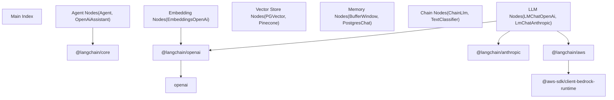
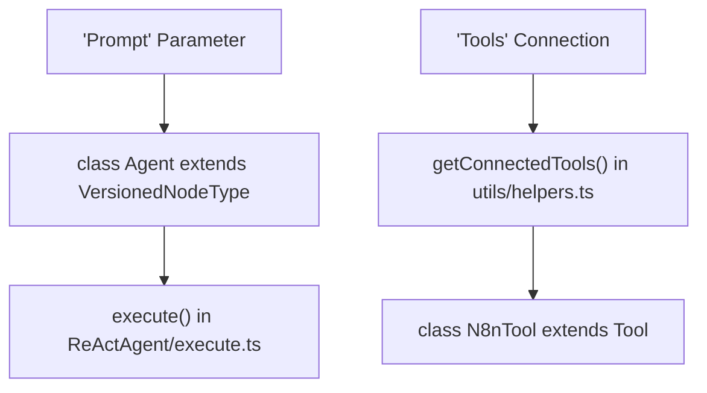
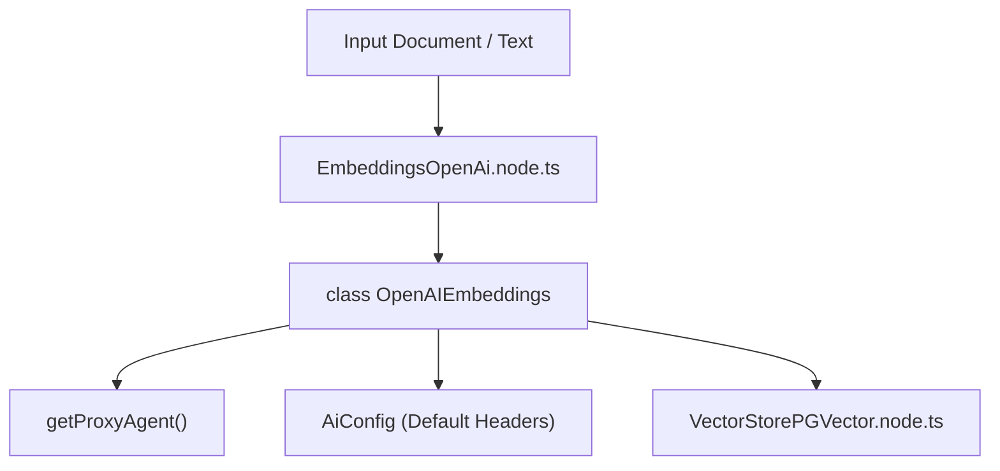

# AI and LangChain Nodes

Relevant source files

-   [packages/@n8n/config/src/configs/ai.config.ts](https://github.com/n8n-io/n8n/blob/88f170b9/packages/@n8n/config/src/configs/ai.config.ts)
-   [packages/@n8n/config/src/configs/redis.config.ts](https://github.com/n8n-io/n8n/blob/88f170b9/packages/@n8n/config/src/configs/redis.config.ts)
-   [packages/@n8n/nodes-langchain/credentials/AzureOpenAiApi.credentials.ts](https://github.com/n8n-io/n8n/blob/88f170b9/packages/@n8n/nodes-langchain/credentials/AzureOpenAiApi.credentials.ts)
-   [packages/@n8n/nodes-langchain/nodes/agents/Agent/Agent.node.ts](https://github.com/n8n-io/n8n/blob/88f170b9/packages/@n8n/nodes-langchain/nodes/agents/Agent/Agent.node.ts)
-   [packages/@n8n/nodes-langchain/nodes/agents/Agent/agents/ConversationalAgent/description.ts](https://github.com/n8n-io/n8n/blob/88f170b9/packages/@n8n/nodes-langchain/nodes/agents/Agent/agents/ConversationalAgent/description.ts)
-   [packages/@n8n/nodes-langchain/nodes/agents/Agent/agents/ConversationalAgent/execute.ts](https://github.com/n8n-io/n8n/blob/88f170b9/packages/@n8n/nodes-langchain/nodes/agents/Agent/agents/ConversationalAgent/execute.ts)
-   [packages/@n8n/nodes-langchain/nodes/agents/Agent/agents/OpenAiFunctionsAgent/description.ts](https://github.com/n8n-io/n8n/blob/88f170b9/packages/@n8n/nodes-langchain/nodes/agents/Agent/agents/OpenAiFunctionsAgent/description.ts)
-   [packages/@n8n/nodes-langchain/nodes/agents/Agent/agents/OpenAiFunctionsAgent/execute.ts](https://github.com/n8n-io/n8n/blob/88f170b9/packages/@n8n/nodes-langchain/nodes/agents/Agent/agents/OpenAiFunctionsAgent/execute.ts)
-   [packages/@n8n/nodes-langchain/nodes/agents/Agent/agents/PlanAndExecuteAgent/execute.ts](https://github.com/n8n-io/n8n/blob/88f170b9/packages/@n8n/nodes-langchain/nodes/agents/Agent/agents/PlanAndExecuteAgent/execute.ts)
-   [packages/@n8n/nodes-langchain/nodes/agents/Agent/agents/ReActAgent/description.ts](https://github.com/n8n-io/n8n/blob/88f170b9/packages/@n8n/nodes-langchain/nodes/agents/Agent/agents/ReActAgent/description.ts)
-   [packages/@n8n/nodes-langchain/nodes/agents/Agent/agents/ReActAgent/execute.ts](https://github.com/n8n-io/n8n/blob/88f170b9/packages/@n8n/nodes-langchain/nodes/agents/Agent/agents/ReActAgent/execute.ts)
-   [packages/@n8n/nodes-langchain/nodes/agents/Agent/agents/SqlAgent/execute.ts](https://github.com/n8n-io/n8n/blob/88f170b9/packages/@n8n/nodes-langchain/nodes/agents/Agent/agents/SqlAgent/execute.ts)
-   [packages/@n8n/nodes-langchain/nodes/agents/Agent/agents/SqlAgent/other/handlers/sqlite.ts](https://github.com/n8n-io/n8n/blob/88f170b9/packages/@n8n/nodes-langchain/nodes/agents/Agent/agents/SqlAgent/other/handlers/sqlite.ts)
-   [packages/@n8n/nodes-langchain/nodes/agents/Agent/agents/SqlAgent/other/prompts.ts](https://github.com/n8n-io/n8n/blob/88f170b9/packages/@n8n/nodes-langchain/nodes/agents/Agent/agents/SqlAgent/other/prompts.ts)
-   [packages/@n8n/nodes-langchain/nodes/agents/OpenAiAssistant/OpenAiAssistant.node.ts](https://github.com/n8n-io/n8n/blob/88f170b9/packages/@n8n/nodes-langchain/nodes/agents/OpenAiAssistant/OpenAiAssistant.node.ts)
-   [packages/@n8n/nodes-langchain/nodes/chains/ChainLLM/ChainLlm.node.ts](https://github.com/n8n-io/n8n/blob/88f170b9/packages/@n8n/nodes-langchain/nodes/chains/ChainLLM/ChainLlm.node.ts)
-   [packages/@n8n/nodes-langchain/nodes/chains/ChainLLM/methods/config.ts](https://github.com/n8n-io/n8n/blob/88f170b9/packages/@n8n/nodes-langchain/nodes/chains/ChainLLM/methods/config.ts)
-   [packages/@n8n/nodes-langchain/nodes/chains/ChainLLM/methods/types.ts](https://github.com/n8n-io/n8n/blob/88f170b9/packages/@n8n/nodes-langchain/nodes/chains/ChainLLM/methods/types.ts)
-   [packages/@n8n/nodes-langchain/nodes/chains/ChainLLM/test/ChainLlm.node.test.ts](https://github.com/n8n-io/n8n/blob/88f170b9/packages/@n8n/nodes-langchain/nodes/chains/ChainLLM/test/ChainLlm.node.test.ts)
-   [packages/@n8n/nodes-langchain/nodes/chains/ChainLLM/test/config.test.ts](https://github.com/n8n-io/n8n/blob/88f170b9/packages/@n8n/nodes-langchain/nodes/chains/ChainLLM/test/config.test.ts)
-   [packages/@n8n/nodes-langchain/nodes/chains/ChainRetrievalQA/ChainRetrievalQa.node.ts](https://github.com/n8n-io/n8n/blob/88f170b9/packages/@n8n/nodes-langchain/nodes/chains/ChainRetrievalQA/ChainRetrievalQa.node.ts)
-   [packages/@n8n/nodes-langchain/nodes/chains/ChainRetrievalQA/test/ChainRetrievalQa.node.test.ts](https://github.com/n8n-io/n8n/blob/88f170b9/packages/@n8n/nodes-langchain/nodes/chains/ChainRetrievalQA/test/ChainRetrievalQa.node.test.ts)
-   [packages/@n8n/nodes-langchain/nodes/chains/ChainSummarization/V2/ChainSummarizationV2.node.ts](https://github.com/n8n-io/n8n/blob/88f170b9/packages/@n8n/nodes-langchain/nodes/chains/ChainSummarization/V2/ChainSummarizationV2.node.ts)
-   [packages/@n8n/nodes-langchain/nodes/chains/InformationExtractor/InformationExtractor.node.ts](https://github.com/n8n-io/n8n/blob/88f170b9/packages/@n8n/nodes-langchain/nodes/chains/InformationExtractor/InformationExtractor.node.ts)
-   [packages/@n8n/nodes-langchain/nodes/chains/InformationExtractor/processItem.ts](https://github.com/n8n-io/n8n/blob/88f170b9/packages/@n8n/nodes-langchain/nodes/chains/InformationExtractor/processItem.ts)
-   [packages/@n8n/nodes-langchain/nodes/chains/InformationExtractor/test/InformationExtraction.node.test.ts](https://github.com/n8n-io/n8n/blob/88f170b9/packages/@n8n/nodes-langchain/nodes/chains/InformationExtractor/test/InformationExtraction.node.test.ts)
-   [packages/@n8n/nodes-langchain/nodes/chains/InformationExtractor/test/processItem.test.ts](https://github.com/n8n-io/n8n/blob/88f170b9/packages/@n8n/nodes-langchain/nodes/chains/InformationExtractor/test/processItem.test.ts)
-   [packages/@n8n/nodes-langchain/nodes/chains/SentimentAnalysis/SentimentAnalysis.node.ts](https://github.com/n8n-io/n8n/blob/88f170b9/packages/@n8n/nodes-langchain/nodes/chains/SentimentAnalysis/SentimentAnalysis.node.ts)
-   [packages/@n8n/nodes-langchain/nodes/chains/TextClassifier/TextClassifier.node.ts](https://github.com/n8n-io/n8n/blob/88f170b9/packages/@n8n/nodes-langchain/nodes/chains/TextClassifier/TextClassifier.node.ts)
-   [packages/@n8n/nodes-langchain/nodes/chains/TextClassifier/processItem.ts](https://github.com/n8n-io/n8n/blob/88f170b9/packages/@n8n/nodes-langchain/nodes/chains/TextClassifier/processItem.ts)
-   [packages/@n8n/nodes-langchain/nodes/chains/TextClassifier/test/TextClassifier.node.test.ts](https://github.com/n8n-io/n8n/blob/88f170b9/packages/@n8n/nodes-langchain/nodes/chains/TextClassifier/test/TextClassifier.node.test.ts)
-   [packages/@n8n/nodes-langchain/nodes/chains/TextClassifier/test/processItem.test.ts](https://github.com/n8n-io/n8n/blob/88f170b9/packages/@n8n/nodes-langchain/nodes/chains/TextClassifier/test/processItem.test.ts)
-   [packages/@n8n/nodes-langchain/nodes/embeddings/EmbeddingsAwsBedrock/EmbeddingsAwsBedrock.node.ts](https://github.com/n8n-io/n8n/blob/88f170b9/packages/@n8n/nodes-langchain/nodes/embeddings/EmbeddingsAwsBedrock/EmbeddingsAwsBedrock.node.ts)
-   [packages/@n8n/nodes-langchain/nodes/embeddings/EmbeddingsAzureOpenAi/EmbeddingsAzureOpenAi.node.ts](https://github.com/n8n-io/n8n/blob/88f170b9/packages/@n8n/nodes-langchain/nodes/embeddings/EmbeddingsAzureOpenAi/EmbeddingsAzureOpenAi.node.ts)
-   [packages/@n8n/nodes-langchain/nodes/embeddings/EmbeddingsAzureOpenAi/azure.svg](https://github.com/n8n-io/n8n/blob/88f170b9/packages/@n8n/nodes-langchain/nodes/embeddings/EmbeddingsAzureOpenAi/azure.svg)
-   [packages/@n8n/nodes-langchain/nodes/embeddings/EmbeddingsOpenAI/EmbeddingsOpenAi.node.ts](https://github.com/n8n-io/n8n/blob/88f170b9/packages/@n8n/nodes-langchain/nodes/embeddings/EmbeddingsOpenAI/EmbeddingsOpenAi.node.ts)
-   [packages/@n8n/nodes-langchain/nodes/embeddings/test/EmbeddingsAzureOpenAi.test.ts](https://github.com/n8n-io/n8n/blob/88f170b9/packages/@n8n/nodes-langchain/nodes/embeddings/test/EmbeddingsAzureOpenAi.test.ts)
-   [packages/@n8n/nodes-langchain/nodes/llms/LMChatAnthropic/LmChatAnthropic.node.ts](https://github.com/n8n-io/n8n/blob/88f170b9/packages/@n8n/nodes-langchain/nodes/llms/LMChatAnthropic/LmChatAnthropic.node.ts)
-   [packages/@n8n/nodes-langchain/nodes/llms/LMChatOpenAi/LmChatOpenAi.node.ts](https://github.com/n8n-io/n8n/blob/88f170b9/packages/@n8n/nodes-langchain/nodes/llms/LMChatOpenAi/LmChatOpenAi.node.ts)
-   [packages/@n8n/nodes-langchain/nodes/llms/LMChatOpenAi/methods/\_\_tests\_\_/loadModels.test.ts](https://github.com/n8n-io/n8n/blob/88f170b9/packages/@n8n/nodes-langchain/nodes/llms/LMChatOpenAi/methods/__tests__/loadModels.test.ts)
-   [packages/@n8n/nodes-langchain/nodes/llms/LMChatOpenAi/methods/loadModels.ts](https://github.com/n8n-io/n8n/blob/88f170b9/packages/@n8n/nodes-langchain/nodes/llms/LMChatOpenAi/methods/loadModels.ts)
-   [packages/@n8n/nodes-langchain/nodes/llms/LMOpenAi/LmOpenAi.node.ts](https://github.com/n8n-io/n8n/blob/88f170b9/packages/@n8n/nodes-langchain/nodes/llms/LMOpenAi/LmOpenAi.node.ts)
-   [packages/@n8n/nodes-langchain/nodes/llms/LmChatAwsBedrock/LmChatAwsBedrock.node.ts](https://github.com/n8n-io/n8n/blob/88f170b9/packages/@n8n/nodes-langchain/nodes/llms/LmChatAwsBedrock/LmChatAwsBedrock.node.ts)
-   [packages/@n8n/nodes-langchain/nodes/llms/LmChatAwsBedrock/test/LmChatAwsBedrock.test.ts](https://github.com/n8n-io/n8n/blob/88f170b9/packages/@n8n/nodes-langchain/nodes/llms/LmChatAwsBedrock/test/LmChatAwsBedrock.test.ts)
-   [packages/@n8n/nodes-langchain/nodes/llms/LmChatAzureOpenAi/LmChatAzureOpenAi.node.ts](https://github.com/n8n-io/n8n/blob/88f170b9/packages/@n8n/nodes-langchain/nodes/llms/LmChatAzureOpenAi/LmChatAzureOpenAi.node.ts)
-   [packages/@n8n/nodes-langchain/nodes/llms/LmChatAzureOpenAi/azure.svg](https://github.com/n8n-io/n8n/blob/88f170b9/packages/@n8n/nodes-langchain/nodes/llms/LmChatAzureOpenAi/azure.svg)
-   [packages/@n8n/nodes-langchain/nodes/llms/LmChatDeepSeek/LmChatDeepSeek.node.ts](https://github.com/n8n-io/n8n/blob/88f170b9/packages/@n8n/nodes-langchain/nodes/llms/LmChatDeepSeek/LmChatDeepSeek.node.ts)
-   [packages/@n8n/nodes-langchain/nodes/llms/LmChatGroq/LmChatGroq.node.ts](https://github.com/n8n-io/n8n/blob/88f170b9/packages/@n8n/nodes-langchain/nodes/llms/LmChatGroq/LmChatGroq.node.ts)
-   [packages/@n8n/nodes-langchain/nodes/llms/LmChatOpenRouter/LmChatOpenRouter.node.ts](https://github.com/n8n-io/n8n/blob/88f170b9/packages/@n8n/nodes-langchain/nodes/llms/LmChatOpenRouter/LmChatOpenRouter.node.ts)
-   [packages/@n8n/nodes-langchain/nodes/llms/LmChatXAiGrok/LmChatXAiGrok.node.ts](https://github.com/n8n-io/n8n/blob/88f170b9/packages/@n8n/nodes-langchain/nodes/llms/LmChatXAiGrok/LmChatXAiGrok.node.ts)
-   [packages/@n8n/nodes-langchain/nodes/llms/test/LmChatOpenAi.test.ts](https://github.com/n8n-io/n8n/blob/88f170b9/packages/@n8n/nodes-langchain/nodes/llms/test/LmChatOpenAi.test.ts)
-   [packages/@n8n/nodes-langchain/nodes/output\_parser/OutputParserStructured/OutputParserStructured.node.ts](https://github.com/n8n-io/n8n/blob/88f170b9/packages/@n8n/nodes-langchain/nodes/output_parser/OutputParserStructured/OutputParserStructured.node.ts)
-   [packages/@n8n/nodes-langchain/nodes/vendors/OpenAi/helpers/\_\_tests\_\_/modelFiltering.test.ts](https://github.com/n8n-io/n8n/blob/88f170b9/packages/@n8n/nodes-langchain/nodes/vendors/OpenAi/helpers/__tests__/modelFiltering.test.ts)
-   [packages/@n8n/nodes-langchain/nodes/vendors/OpenAi/helpers/binary-data.ts](https://github.com/n8n-io/n8n/blob/88f170b9/packages/@n8n/nodes-langchain/nodes/vendors/OpenAi/helpers/binary-data.ts)
-   [packages/@n8n/nodes-langchain/nodes/vendors/OpenAi/helpers/constants.ts](https://github.com/n8n-io/n8n/blob/88f170b9/packages/@n8n/nodes-langchain/nodes/vendors/OpenAi/helpers/constants.ts)
-   [packages/@n8n/nodes-langchain/nodes/vendors/OpenAi/helpers/modelFiltering.ts](https://github.com/n8n-io/n8n/blob/88f170b9/packages/@n8n/nodes-langchain/nodes/vendors/OpenAi/helpers/modelFiltering.ts)
-   [packages/@n8n/nodes-langchain/nodes/vendors/OpenAi/helpers/polling.ts](https://github.com/n8n-io/n8n/blob/88f170b9/packages/@n8n/nodes-langchain/nodes/vendors/OpenAi/helpers/polling.ts)
-   [packages/@n8n/nodes-langchain/nodes/vendors/OpenAi/methods/\_\_tests\_\_/listSearch.test.ts](https://github.com/n8n-io/n8n/blob/88f170b9/packages/@n8n/nodes-langchain/nodes/vendors/OpenAi/methods/__tests__/listSearch.test.ts)
-   [packages/@n8n/nodes-langchain/nodes/vendors/OpenAi/methods/listSearch.ts](https://github.com/n8n-io/n8n/blob/88f170b9/packages/@n8n/nodes-langchain/nodes/vendors/OpenAi/methods/listSearch.ts)
-   [packages/@n8n/nodes-langchain/nodes/vendors/OpenAi/v1/OpenAiV1.node.ts](https://github.com/n8n-io/n8n/blob/88f170b9/packages/@n8n/nodes-langchain/nodes/vendors/OpenAi/v1/OpenAiV1.node.ts)
-   [packages/@n8n/nodes-langchain/nodes/vendors/OpenAi/v1/actions/assistant/create.operation.ts](https://github.com/n8n-io/n8n/blob/88f170b9/packages/@n8n/nodes-langchain/nodes/vendors/OpenAi/v1/actions/assistant/create.operation.ts)
-   [packages/@n8n/nodes-langchain/nodes/vendors/OpenAi/v1/actions/assistant/message.operation.ts](https://github.com/n8n-io/n8n/blob/88f170b9/packages/@n8n/nodes-langchain/nodes/vendors/OpenAi/v1/actions/assistant/message.operation.ts)
-   [packages/@n8n/nodes-langchain/utils/descriptions.ts](https://github.com/n8n-io/n8n/blob/88f170b9/packages/@n8n/nodes-langchain/utils/descriptions.ts)
-   [packages/@n8n/nodes-langchain/utils/helpers.ts](https://github.com/n8n-io/n8n/blob/88f170b9/packages/@n8n/nodes-langchain/utils/helpers.ts)
-   [packages/@n8n/nodes-langchain/utils/schemaParsing.ts](https://github.com/n8n-io/n8n/blob/88f170b9/packages/@n8n/nodes-langchain/utils/schemaParsing.ts)
-   [packages/@n8n/nodes-langchain/utils/tests/helpers.test.ts](https://github.com/n8n-io/n8n/blob/88f170b9/packages/@n8n/nodes-langchain/utils/tests/helpers.test.ts)

This page documents the `@n8n/nodes-langchain` package, which provides LangChain-based nodes for AI and language model workflows. These nodes enable integration with large language models (LLMs), vector databases, embeddings, agents, and memory systems through the LangChain framework.

**Scope**: This page covers the node implementations, their architecture, and integration patterns. For the Chat Hub system that uses these nodes, see [Chat Hub Backend System](/n8n-io/n8n/5.2-chat-hub-backend-system). For AI-assisted workflow creation, see [AI Workflow Builder](/n8n-io/n8n/5.1-ai-workflow-builder). For credential management, see [Credential System for Nodes](/n8n-io/n8n/4.4-credential-system-for-nodes).

---

## Package Architecture

The `@n8n/nodes-langchain` package is a standalone node collection within the n8n monorepo that wraps LangChain functionality into n8n-compatible nodes. It provides specialized nodes organized into functional categories such as LLMs, Agents, Chains, and Vector Stores.

**Package Structure Diagram**

**Sources**: [packages/@n8n/nodes-langchain/nodes/llms/LMChatOpenAi/LmChatOpenAi.node.ts1](https://github.com/n8n-io/n8n/blob/88f170b9/packages/@n8n/nodes-langchain/nodes/llms/LMChatOpenAi/LmChatOpenAi.node.ts#L1-L1) | [packages/@n8n/nodes-langchain/nodes/llms/LMChatAnthropic/LmChatAnthropic.node.ts1](https://github.com/n8n-io/n8n/blob/88f170b9/packages/@n8n/nodes-langchain/nodes/llms/LMChatAnthropic/LmChatAnthropic.node.ts#L1-L1) | [packages/@n8n/nodes-langchain/nodes/llms/LmChatAwsBedrock/LmChatAwsBedrock.node.ts1-3](https://github.com/n8n-io/n8n/blob/88f170b9/packages/@n8n/nodes-langchain/nodes/llms/LmChatAwsBedrock/LmChatAwsBedrock.node.ts#L1-L3)

---

## LLM and Chat Model Nodes

LLM nodes wrap various language model providers. They typically implement the `INodeType` interface and use a `supplyData` method to provide a LangChain model instance to downstream nodes (like Chains or Agents).

### OpenAI Chat Model (`LmChatOpenAi`)

The OpenAI node supports standard GPT models and newer "o1/o3" series [packages/@n8n/nodes-langchain/nodes/llms/LMChatOpenAi/LmChatOpenAi.node.ts163-165](https://github.com/n8n-io/n8n/blob/88f170b9/packages/@n8n/nodes-langchain/nodes/llms/LMChatOpenAi/LmChatOpenAi.node.ts#L163-L165) It features a dynamic model loader `searchModels` that filters for chat-compatible models [packages/@n8n/nodes-langchain/nodes/llms/LMChatOpenAi/methods/loadModels.ts10-51](https://github.com/n8n-io/n8n/blob/88f170b9/packages/@n8n/nodes-langchain/nodes/llms/LMChatOpenAi/methods/loadModels.ts#L10-L51)

**Key Features**:

-   **JSON Mode**: Requires the word "json" in the prompt and specific model versions [packages/@n8n/nodes-langchain/nodes/llms/LMChatOpenAi/LmChatOpenAi.node.ts29-35](https://github.com/n8n-io/n8n/blob/88f170b9/packages/@n8n/nodes-langchain/nodes/llms/LMChatOpenAi/LmChatOpenAi.node.ts#L29-L35)
-   **Responses API**: Enabled by default for supported models [packages/@n8n/nodes-langchain/nodes/llms/LMChatOpenAi/LmChatOpenAi.node.ts246-250](https://github.com/n8n-io/n8n/blob/88f170b9/packages/@n8n/nodes-langchain/nodes/llms/LMChatOpenAi/LmChatOpenAi.node.ts#L246-L250)
-   **Error Handling**: Uses `openAiFailedAttemptHandler` for specialized error mapping [packages/@n8n/nodes-langchain/nodes/llms/LMChatOpenAi/LmChatOpenAi.node.ts16](https://github.com/n8n-io/n8n/blob/88f170b9/packages/@n8n/nodes-langchain/nodes/llms/LMChatOpenAi/LmChatOpenAi.node.ts#L16-L16)

### Anthropic Chat Model (`LmChatAnthropic`)

Supports the Claude family (3.5 Sonnet, Opus, Haiku). It includes a "Thinking" mode with a configurable token budget (minimum 1024 tokens) [packages/@n8n/nodes-langchain/nodes/llms/LMChatAnthropic/LmChatAnthropic.node.ts74-75](https://github.com/n8n-io/n8n/blob/88f170b9/packages/@n8n/nodes-langchain/nodes/llms/LMChatAnthropic/LmChatAnthropic.node.ts#L74-L75)

### AWS Bedrock Chat Model (`LmChatAwsBedrock`)

Uses `ChatBedrockConverse` from `@langchain/aws` [packages/@n8n/nodes-langchain/nodes/llms/LmChatAwsBedrock/LmChatAwsBedrock.node.ts3](https://github.com/n8n-io/n8n/blob/88f170b9/packages/@n8n/nodes-langchain/nodes/llms/LmChatAwsBedrock/LmChatAwsBedrock.node.ts#L3-L3) It allows selecting between "On-Demand Models" and "Inference Profiles" (required for cross-region models like Claude 3.5 Sonnet) [packages/@n8n/nodes-langchain/nodes/llms/LmChatAwsBedrock/LmChatAwsBedrock.node.ts64-87](https://github.com/n8n-io/n8n/blob/88f170b9/packages/@n8n/nodes-langchain/nodes/llms/LmChatAwsBedrock/LmChatAwsBedrock.node.ts#L64-L87)

**Sources**: [packages/@n8n/nodes-langchain/nodes/llms/LMChatOpenAi/LmChatOpenAi.node.ts68-116](https://github.com/n8n-io/n8n/blob/88f170b9/packages/@n8n/nodes-langchain/nodes/llms/LMChatOpenAi/LmChatOpenAi.node.ts#L68-L116) | [packages/@n8n/nodes-langchain/nodes/llms/LMChatAnthropic/LmChatAnthropic.node.ts76-121](https://github.com/n8n-io/n8n/blob/88f170b9/packages/@n8n/nodes-langchain/nodes/llms/LMChatAnthropic/LmChatAnthropic.node.ts#L76-L121) | [packages/@n8n/nodes-langchain/nodes/llms/LmChatAwsBedrock/LmChatAwsBedrock.node.ts20-60](https://github.com/n8n-io/n8n/blob/88f170b9/packages/@n8n/nodes-langchain/nodes/llms/LmChatAwsBedrock/LmChatAwsBedrock.node.ts#L20-L60)

---

## Agent Nodes and Tool Execution

Agent nodes are "Root Nodes" that generate and execute action plans. The primary `Agent` node is versioned, with Version 3 being the latest [packages/@n8n/nodes-langchain/nodes/agents/Agent/Agent.node.ts8-78](https://github.com/n8n-io/n8n/blob/88f170b9/packages/@n8n/nodes-langchain/nodes/agents/Agent/Agent.node.ts#L8-L78)

**Agent Implementation Mapping**

**Tool Integration**: Tools are connected via the `AiTool` connection type [packages/@n8n/nodes-langchain/utils/helpers.ts161-163](https://github.com/n8n-io/n8n/blob/88f170b9/packages/@n8n/nodes-langchain/utils/helpers.ts#L161-L163) The helper `getConnectedTools` resolves these connections, handling both individual tools and `StructuredToolkit` objects [packages/@n8n/nodes-langchain/utils/helpers.ts174-187](https://github.com/n8n-io/n8n/blob/88f170b9/packages/@n8n/nodes-langchain/utils/helpers.ts#L174-L187)

**Sources**: [packages/@n8n/nodes-langchain/nodes/agents/Agent/Agent.node.ts8-31](https://github.com/n8n-io/n8n/blob/88f170b9/packages/@n8n/nodes-langchain/nodes/agents/Agent/Agent.node.ts#L8-L31) | [packages/@n8n/nodes-langchain/utils/helpers.ts154-198](https://github.com/n8n-io/n8n/blob/88f170b9/packages/@n8n/nodes-langchain/utils/helpers.ts#L154-L198)

---

## Chain Nodes

Chains represent predefined logic flows.

### Basic LLM Chain (`ChainLlm`)

A simple node to prompt an LLM. It supports:

-   **Batching**: Processing multiple items with configurable `batchSize` and `delayBetweenBatches` [packages/@n8n/nodes-langchain/nodes/chains/ChainLLM/ChainLlm.node.ts77-82](https://github.com/n8n-io/n8n/blob/88f170b9/packages/@n8n/nodes-langchain/nodes/chains/ChainLLM/ChainLlm.node.ts#L77-L82)
-   **Output Parsing**: Can unwrap objects directly into JSON if an output parser is attached or if using specific model versions [packages/@n8n/nodes-langchain/nodes/chains/ChainLLM/ChainLlm.node.ts72-75](https://github.com/n8n-io/n8n/blob/88f170b9/packages/@n8n/nodes-langchain/nodes/chains/ChainLLM/ChainLlm.node.ts#L72-L75)

### Text Classifier (`TextClassifier`)

Classifies text into categories defined in a `fixedCollection` [packages/@n8n/nodes-langchain/nodes/chains/TextClassifier/TextClassifier.node.ts86-117](https://github.com/n8n-io/n8n/blob/88f170b9/packages/@n8n/nodes-langchain/nodes/chains/TextClassifier/TextClassifier.node.ts#L86-L117)

-   **Logic**: It dynamically generates a Zod schema based on the categories [packages/@n8n/nodes-langchain/nodes/chains/TextClassifier/TextClassifier.node.ts210-223](https://github.com/n8n-io/n8n/blob/88f170b9/packages/@n8n/nodes-langchain/nodes/chains/TextClassifier/TextClassifier.node.ts#L210-L223)
-   **Auto-Fixing**: Can use `OutputFixingParser` to retry LLM calls if the initial output fails validation [packages/@n8n/nodes-langchain/nodes/chains/TextClassifier/TextClassifier.node.ts227-229](https://github.com/n8n-io/n8n/blob/88f170b9/packages/@n8n/nodes-langchain/nodes/chains/TextClassifier/TextClassifier.node.ts#L227-L229)

**Sources**: [packages/@n8n/nodes-langchain/nodes/chains/ChainLLM/ChainLlm.node.ts23-63](https://github.com/n8n-io/n8n/blob/88f170b9/packages/@n8n/nodes-langchain/nodes/chains/ChainLLM/ChainLlm.node.ts#L23-L63) | [packages/@n8n/nodes-langchain/nodes/chains/TextClassifier/TextClassifier.node.ts31-73](https://github.com/n8n-io/n8n/blob/88f170b9/packages/@n8n/nodes-langchain/nodes/chains/TextClassifier/TextClassifier.node.ts#L31-L73)

---

## Vector Store and Embeddings

Vector stores enable RAG (Retrieval-Augmented Generation). They require an "Embeddings" node to transform text into numerical vectors.

### OpenAI Embeddings (`EmbeddingsOpenAi`)

-   **Models**: Defaults to `text-embedding-3-small` [packages/@n8n/nodes-langchain/nodes/embeddings/EmbeddingsOpenAI/EmbeddingsOpenAi.node.ts74](https://github.com/n8n-io/n8n/blob/88f170b9/packages/@n8n/nodes-langchain/nodes/embeddings/EmbeddingsOpenAI/EmbeddingsOpenAi.node.ts#L74-L74)
-   **Dimensions**: Supports configurable dimensions (256, 512, 1024, 1536, 3072) for compatible models [packages/@n8n/nodes-langchain/nodes/embeddings/EmbeddingsOpenAI/EmbeddingsOpenAi.node.ts146-174](https://github.com/n8n-io/n8n/blob/88f170b9/packages/@n8n/nodes-langchain/nodes/embeddings/EmbeddingsOpenAI/EmbeddingsOpenAi.node.ts#L146-L174)
-   **Implementation**: Wraps `OpenAIEmbeddings` from `@langchain/openai` [packages/@n8n/nodes-langchain/nodes/embeddings/EmbeddingsOpenAI/EmbeddingsOpenAi.node.ts1](https://github.com/n8n-io/n8n/blob/88f170b9/packages/@n8n/nodes-langchain/nodes/embeddings/EmbeddingsOpenAI/EmbeddingsOpenAi.node.ts#L1-L1)

**Data Flow: Text to Vector Store**

**Sources**: [packages/@n8n/nodes-langchain/nodes/embeddings/EmbeddingsOpenAI/EmbeddingsOpenAi.node.ts77-117](https://github.com/n8n-io/n8n/blob/88f170b9/packages/@n8n/nodes-langchain/nodes/embeddings/EmbeddingsOpenAI/EmbeddingsOpenAi.node.ts#L77-L117) | [packages/@n8n/nodes-langchain/nodes/embeddings/EmbeddingsOpenAI/EmbeddingsOpenAi.node.ts232-269](https://github.com/n8n-io/n8n/blob/88f170b9/packages/@n8n/nodes-langchain/nodes/embeddings/EmbeddingsOpenAI/EmbeddingsOpenAi.node.ts#L232-L269)

---

## Utilities and Shared Logic

### Prompt and Session Helpers

The `utils/helpers.ts` file contains critical logic for AI nodes:

-   `getPromptInputByType`: Resolves the user message, supporting "auto" mode which looks for `chatInput` from a Chat Trigger node [packages/@n8n/nodes-langchain/utils/helpers.ts17-50](https://github.com/n8n-io/n8n/blob/88f170b9/packages/@n8n/nodes-langchain/utils/helpers.ts#L17-L50)
-   `getSessionId`: Extracts the session ID for memory nodes, attempting to pull it from the body data or a connected Chat Trigger [packages/@n8n/nodes-langchain/utils/helpers.ts52-105](https://github.com/n8n-io/n8n/blob/88f170b9/packages/@n8n/nodes-langchain/utils/helpers.ts#L52-L105)

### Common Node Properties

The `utils/descriptions.ts` file centralizes UI components:

-   `schemaTypeField`: Options for "Generate From JSON Example" vs "Manual" [packages/@n8n/nodes-langchain/utils/descriptions.ts3-22](https://github.com/n8n-io/n8n/blob/88f170b9/packages/@n8n/nodes-langchain/utils/descriptions.ts#L3-L22)
-   `promptTypeOptions`: Standardized prompt source selection [packages/@n8n/nodes-langchain/utils/descriptions.ts129-150](https://github.com/n8n-io/n8n/blob/88f170b9/packages/@n8n/nodes-langchain/utils/descriptions.ts#L129-L150)

**Sources**: [packages/@n8n/nodes-langchain/utils/helpers.ts1-119](https://github.com/n8n-io/n8n/blob/88f170b9/packages/@n8n/nodes-langchain/utils/helpers.ts#L1-L119) | [packages/@n8n/nodes-langchain/utils/descriptions.ts1-203](https://github.com/n8n-io/n8n/blob/88f170b9/packages/@n8n/nodes-langchain/utils/descriptions.ts#L1-L203)
