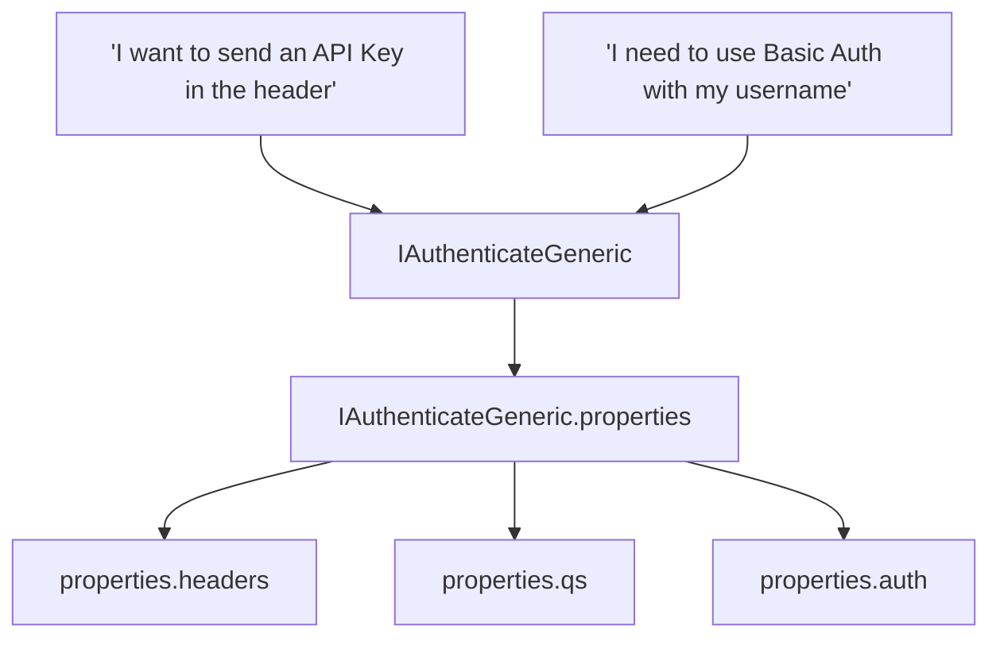

# Credential System for Nodes

Relevant source files

-   [packages/@n8n/api-types/src/dto/credentials/\_\_tests\_\_/credentials-get-many-request.dto.test.ts](https://github.com/n8n-io/n8n/blob/88f170b9/packages/@n8n/api-types/src/dto/credentials/__tests__/credentials-get-many-request.dto.test.ts)
-   [packages/@n8n/api-types/src/dto/credentials/\_\_tests\_\_/credentials-get-one-request.dto.test.ts](https://github.com/n8n-io/n8n/blob/88f170b9/packages/@n8n/api-types/src/dto/credentials/__tests__/credentials-get-one-request.dto.test.ts)
-   [packages/@n8n/api-types/src/dto/credentials/credentials-get-many-request.dto.ts](https://github.com/n8n-io/n8n/blob/88f170b9/packages/@n8n/api-types/src/dto/credentials/credentials-get-many-request.dto.ts)
-   [packages/@n8n/api-types/src/dto/credentials/credentials-get-one-request.dto.ts](https://github.com/n8n-io/n8n/blob/88f170b9/packages/@n8n/api-types/src/dto/credentials/credentials-get-one-request.dto.ts)
-   [packages/@n8n/client-oauth2/src/index.ts](https://github.com/n8n-io/n8n/blob/88f170b9/packages/@n8n/client-oauth2/src/index.ts)
-   [packages/@n8n/client-oauth2/src/types.ts](https://github.com/n8n-io/n8n/blob/88f170b9/packages/@n8n/client-oauth2/src/types.ts)
-   [packages/@n8n/client-oauth2/src/utils.ts](https://github.com/n8n-io/n8n/blob/88f170b9/packages/@n8n/client-oauth2/src/utils.ts)
-   [packages/@n8n/nodes-langchain/credentials/AzureEntraCognitiveServicesOAuth2Api.credentials.ts](https://github.com/n8n-io/n8n/blob/88f170b9/packages/@n8n/nodes-langchain/credentials/AzureEntraCognitiveServicesOAuth2Api.credentials.ts)
-   [packages/@n8n/nodes-langchain/nodes/llms/LmChatAzureOpenAi/\_\_tests\_\_/N8nOAuth2TokenCredential.test.ts](https://github.com/n8n-io/n8n/blob/88f170b9/packages/@n8n/nodes-langchain/nodes/llms/LmChatAzureOpenAi/__tests__/N8nOAuth2TokenCredential.test.ts)
-   [packages/@n8n/nodes-langchain/nodes/llms/LmChatAzureOpenAi/\_\_tests\_\_/api-key.handler.test.ts](https://github.com/n8n-io/n8n/blob/88f170b9/packages/@n8n/nodes-langchain/nodes/llms/LmChatAzureOpenAi/__tests__/api-key.handler.test.ts)
-   [packages/@n8n/nodes-langchain/nodes/llms/LmChatAzureOpenAi/\_\_tests\_\_/oauth2.handler.test.ts](https://github.com/n8n-io/n8n/blob/88f170b9/packages/@n8n/nodes-langchain/nodes/llms/LmChatAzureOpenAi/__tests__/oauth2.handler.test.ts)
-   [packages/@n8n/nodes-langchain/nodes/llms/LmChatAzureOpenAi/credentials/N8nOAuth2TokenCredential.ts](https://github.com/n8n-io/n8n/blob/88f170b9/packages/@n8n/nodes-langchain/nodes/llms/LmChatAzureOpenAi/credentials/N8nOAuth2TokenCredential.ts)
-   [packages/@n8n/nodes-langchain/nodes/llms/LmChatAzureOpenAi/credentials/api-key.ts](https://github.com/n8n-io/n8n/blob/88f170b9/packages/@n8n/nodes-langchain/nodes/llms/LmChatAzureOpenAi/credentials/api-key.ts)
-   [packages/@n8n/nodes-langchain/nodes/llms/LmChatAzureOpenAi/credentials/oauth2.ts](https://github.com/n8n-io/n8n/blob/88f170b9/packages/@n8n/nodes-langchain/nodes/llms/LmChatAzureOpenAi/credentials/oauth2.ts)
-   [packages/@n8n/nodes-langchain/nodes/llms/LmChatAzureOpenAi/properties.ts](https://github.com/n8n-io/n8n/blob/88f170b9/packages/@n8n/nodes-langchain/nodes/llms/LmChatAzureOpenAi/properties.ts)
-   [packages/cli/src/credentials/\_\_tests\_\_/credentials.controller.test.ts](https://github.com/n8n-io/n8n/blob/88f170b9/packages/cli/src/credentials/__tests__/credentials.controller.test.ts)
-   [packages/cli/src/credentials/\_\_tests\_\_/credentials.service.test.ts](https://github.com/n8n-io/n8n/blob/88f170b9/packages/cli/src/credentials/__tests__/credentials.service.test.ts)
-   [packages/cli/src/credentials/\_\_tests\_\_/credentials.test-data.ts](https://github.com/n8n-io/n8n/blob/88f170b9/packages/cli/src/credentials/__tests__/credentials.test-data.ts)
-   [packages/cli/src/credentials/\_\_tests\_\_/validation.test.ts](https://github.com/n8n-io/n8n/blob/88f170b9/packages/cli/src/credentials/__tests__/validation.test.ts)
-   [packages/cli/src/credentials/credentials.controller.ts](https://github.com/n8n-io/n8n/blob/88f170b9/packages/cli/src/credentials/credentials.controller.ts)
-   [packages/cli/src/credentials/credentials.service.ee.ts](https://github.com/n8n-io/n8n/blob/88f170b9/packages/cli/src/credentials/credentials.service.ee.ts)
-   [packages/cli/src/credentials/credentials.service.ts](https://github.com/n8n-io/n8n/blob/88f170b9/packages/cli/src/credentials/credentials.service.ts)
-   [packages/cli/src/credentials/validation.ts](https://github.com/n8n-io/n8n/blob/88f170b9/packages/cli/src/credentials/validation.ts)
-   [packages/cli/src/modules/external-secrets.ee/\_\_tests\_\_/redaction.service.ee.test.ts](https://github.com/n8n-io/n8n/blob/88f170b9/packages/cli/src/modules/external-secrets.ee/__tests__/redaction.service.ee.test.ts)
-   [packages/cli/src/modules/external-secrets.ee/redaction.service.ee.ts](https://github.com/n8n-io/n8n/blob/88f170b9/packages/cli/src/modules/external-secrets.ee/redaction.service.ee.ts)
-   [packages/cli/src/public-api/v1/handlers/credentials/\_\_tests\_\_/credentials.service.test.ts](https://github.com/n8n-io/n8n/blob/88f170b9/packages/cli/src/public-api/v1/handlers/credentials/__tests__/credentials.service.test.ts)
-   [packages/cli/src/public-api/v1/handlers/credentials/credentials.handler.ts](https://github.com/n8n-io/n8n/blob/88f170b9/packages/cli/src/public-api/v1/handlers/credentials/credentials.handler.ts)
-   [packages/cli/src/public-api/v1/handlers/credentials/credentials.service.ts](https://github.com/n8n-io/n8n/blob/88f170b9/packages/cli/src/public-api/v1/handlers/credentials/credentials.service.ts)
-   [packages/cli/templates/oauth-callback.handlebars](https://github.com/n8n-io/n8n/blob/88f170b9/packages/cli/templates/oauth-callback.handlebars)
-   [packages/cli/templates/oauth-error-callback.handlebars](https://github.com/n8n-io/n8n/blob/88f170b9/packages/cli/templates/oauth-error-callback.handlebars)
-   [packages/cli/test/integration/ai/ai.api.test.ts](https://github.com/n8n-io/n8n/blob/88f170b9/packages/cli/test/integration/ai/ai.api.test.ts)
-   [packages/cli/test/integration/credentials/credentials.api.ee.test.ts](https://github.com/n8n-io/n8n/blob/88f170b9/packages/cli/test/integration/credentials/credentials.api.ee.test.ts)
-   [packages/cli/test/integration/credentials/credentials.api.test.ts](https://github.com/n8n-io/n8n/blob/88f170b9/packages/cli/test/integration/credentials/credentials.api.test.ts)
-   [packages/cli/test/integration/public-api/credentials.test.ts](https://github.com/n8n-io/n8n/blob/88f170b9/packages/cli/test/integration/public-api/credentials.test.ts)
-   [packages/core/src/execution-engine/node-execution-context/utils/\_\_tests\_\_/request-helper-functions.test.ts](https://github.com/n8n-io/n8n/blob/88f170b9/packages/core/src/execution-engine/node-execution-context/utils/__tests__/request-helper-functions.test.ts)
-   [packages/core/src/execution-engine/node-execution-context/utils/request-helper-functions.ts](https://github.com/n8n-io/n8n/blob/88f170b9/packages/core/src/execution-engine/node-execution-context/utils/request-helper-functions.ts)
-   [packages/core/src/execution-engine/node-execution-context/utils/request-helpers/\_\_tests\_\_/axios-utils.test.ts](https://github.com/n8n-io/n8n/blob/88f170b9/packages/core/src/execution-engine/node-execution-context/utils/request-helpers/__tests__/axios-utils.test.ts)
-   [packages/core/src/execution-engine/node-execution-context/utils/request-helpers/axios-config.ts](https://github.com/n8n-io/n8n/blob/88f170b9/packages/core/src/execution-engine/node-execution-context/utils/request-helpers/axios-config.ts)
-   [packages/core/src/execution-engine/node-execution-context/utils/request-helpers/axios-utils.ts](https://github.com/n8n-io/n8n/blob/88f170b9/packages/core/src/execution-engine/node-execution-context/utils/request-helpers/axios-utils.ts)
-   [packages/core/src/execution-engine/node-execution-context/utils/request-helpers/index.ts](https://github.com/n8n-io/n8n/blob/88f170b9/packages/core/src/execution-engine/node-execution-context/utils/request-helpers/index.ts)
-   [packages/nodes-base/credentials/OAuth2Api.credentials.ts](https://github.com/n8n-io/n8n/blob/88f170b9/packages/nodes-base/credentials/OAuth2Api.credentials.ts)

This page explains how nodes in n8n declare credential requirements, the `ICredentialType` interface, authentication methods, credential validation, and the internal resolution system. It also covers the `@n8n/client-oauth2` package used for standardized OAuth2 flows.

---

## ICredentialType Interface

The `ICredentialType` interface is the blueprint for any credential in n8n. It defines the fields a user must provide and how those fields are used to authenticate requests.

**Core Structure**

```
export interface ICredentialType {	name: string;	displayName: string;	documentationUrl?: string;	properties: INodeProperties[];	extends?: string[];	icon?: Icon;	authenticate?: IAuthenticate;	test?: ICredentialTestRequest;}
```
Sources: [packages/workflow/src/interfaces.ts346-372](https://github.com/n8n-io/n8n/blob/88f170b9/packages/workflow/src/interfaces.ts#L346-L372)

### Credential Properties

Properties define the input fields in the UI. For credentials, sensitive fields like API keys or passwords should use `typeOptions: { password: true }` to ensure they are redacted when sent to the frontend.

| Feature | Description | Code Reference |
| --- | --- | --- |
| **Redaction** | Sensitive values are replaced with `CREDENTIAL_BLANKING_VALUE` or `CREDENTIAL_EMPTY_VALUE`. | [packages/cli/src/credentials/credentials.service.ts31-32](https://github.com/n8n-io/n8n/blob/88f170b9/packages/cli/src/credentials/credentials.service.ts#L31-L32) [packages/cli/src/credentials/credentials.service.ts162-171](https://github.com/n8n-io/n8n/blob/88f170b9/packages/cli/src/credentials/credentials.service.ts#L162-L171) |
| **Inheritance** | Use the `extends` array to inherit properties from other credential types (e.g., a specific service extending base `oAuth2Api`). | [packages/workflow/src/interfaces.ts351](https://github.com/n8n-io/n8n/blob/88f170b9/packages/workflow/src/interfaces.ts#L351-L351) |

Sources: [packages/cli/src/credentials/credentials.service.ts162-171](https://github.com/n8n-io/n8n/blob/88f170b9/packages/cli/src/credentials/credentials.service.ts#L162-L171) [packages/workflow/src/interfaces.ts346-372](https://github.com/n8n-io/n8n/blob/88f170b9/packages/workflow/src/interfaces.ts#L346-L372)

---

## Authentication Methods

Credentials specify how they modify an outgoing HTTP request through the `authenticate` property.

### Generic Authentication

Most credentials use declarative `generic` authentication. This allows mapping credential values directly to headers, query parameters, or basic auth fields without writing code.


Sources: [packages/workflow/src/interfaces.ts259-278](https://github.com/n8n-io/n8n/blob/88f170b9/packages/workflow/src/interfaces.ts#L259-L278) [packages/core/src/execution-engine/node-execution-context/utils/request-helper-functions.ts118-200](https://github.com/n8n-io/n8n/blob/88f170b9/packages/core/src/execution-engine/node-execution-context/utils/request-helper-functions.ts#L118-L200)

### OAuth2 and `@n8n/client-oauth2`

For OAuth2, n8n uses the `@n8n/client-oauth2` package to handle the complexities of token exchange and refreshing.

**Key Components:**

-   **`ClientOAuth2`**: The main class for managing OAuth2 flows. [packages/core/src/execution-engine/node-execution-context/utils/request-helper-functions.ts17-18](https://github.com/n8n-io/n8n/blob/88f170b9/packages/core/src/execution-engine/node-execution-context/utils/request-helper-functions.ts#L17-L18)
-   **Token Refreshing**: The system automatically attempts to refresh tokens if `oauthTokenData` is present and the current token is expired. [packages/core/src/execution-engine/node-execution-context/utils/request-helper-functions.test.ts29-32](https://github.com/n8n-io/n8n/blob/88f170b9/packages/core/src/execution-engine/node-execution-context/utils/request-helper-functions.test.ts#L29-L32)

Sources: [packages/core/src/execution-engine/node-execution-context/utils/request-helper-functions.ts10-18](https://github.com/n8n-io/n8n/blob/88f170b9/packages/core/src/execution-engine/node-execution-context/utils/request-helper-functions.ts#L10-L18) [packages/core/src/execution-engine/node-execution-context/utils/request-helper-functions.test.ts29-32](https://github.com/n8n-io/n8n/blob/88f170b9/packages/core/src/execution-engine/node-execution-context/utils/request-helper-functions.test.ts#L29-L32)

---

## Credential Resolution and Security

When a node executes, the `CredentialsService` and `CredentialsHelper` resolve the stored, encrypted credentials into a decrypted object available to the node's execution context.

### Data Flow: Resolution to Execution

> **[Mermaid sequence]**
> *(图表结构无法解析)*

Sources: [packages/cli/src/credentials/credentials.service.ts86-105](https://github.com/n8n-io/n8n/blob/88f170b9/packages/cli/src/credentials/credentials.service.ts#L86-L105) [packages/cli/src/credentials/credentials.service.ts124-136](https://github.com/n8n-io/n8n/blob/88f170b9/packages/cli/src/credentials/credentials.service.ts#L124-L136) [packages/cli/src/credentials/credentials.controller.ts112-137](https://github.com/n8n-io/n8n/blob/88f170b9/packages/cli/src/credentials/credentials.controller.ts#L112-L137)

### Credential Validation (`test`)

Credential types can define a `test` property. This is an HTTP request configuration that n8n uses to verify if the credentials are valid (e.g., calling a `/me` or `/status` endpoint).

**Validation Logic:**

1.  The frontend triggers the `/credentials/test` endpoint. [packages/cli/src/credentials/credentials.controller.ts140-141](https://github.com/n8n-io/n8n/blob/88f170b9/packages/cli/src/credentials/credentials.controller.ts#L140-L141)
2.  `CredentialsService.test()` is called. [packages/cli/src/credentials/credentials.service.ts175](https://github.com/n8n-io/n8n/blob/88f170b9/packages/cli/src/credentials/credentials.service.ts#L175-L175)
3.  The `CredentialsTester` service executes the defined request and checks the response against validation rules. [packages/cli/src/services/credentials-tester.service.ts](https://github.com/n8n-io/n8n/blob/88f170b9/packages/cli/src/services/credentials-tester.service.ts)

Sources: [packages/cli/src/credentials/credentials.controller.ts140-176](https://github.com/n8n-io/n8n/blob/88f170b9/packages/cli/src/credentials/credentials.controller.ts#L140-L176) [packages/cli/src/credentials/credentials.service.ts94](https://github.com/n8n-io/n8n/blob/88f170b9/packages/cli/src/credentials/credentials.service.ts#L94-L94)

---

## Implementation Details

### CredentialsService

The `CredentialsService` is the primary service for CRUD operations on credentials. It handles:

-   **Redaction**: Removing sensitive data before sending it to the UI. [packages/cli/src/credentials/credentials.service.ts162-171](https://github.com/n8n-io/n8n/blob/88f170b9/packages/cli/src/credentials/credentials.service.ts#L162-L171)
-   **Unredaction**: Merging partial updates from the UI with existing sensitive data in the DB. [packages/cli/src/credentials/credentials.service.ts169-172](https://github.com/n8n-io/n8n/blob/88f170b9/packages/cli/src/credentials/credentials.service.ts#L169-L172)
-   **Sharing**: Managing access for different users and projects (EE feature). [packages/cli/src/credentials/credentials.service.ee.ts22-34](https://github.com/n8n-io/n8n/blob/88f170b9/packages/cli/src/credentials/credentials.service.ee.ts#L22-L34)

Sources: [packages/cli/src/credentials/credentials.service.ts86-105](https://github.com/n8n-io/n8n/blob/88f170b9/packages/cli/src/credentials/credentials.service.ts#L86-L105) [packages/cli/src/credentials/credentials.service.ee.ts22-34](https://github.com/n8n-io/n8n/blob/88f170b9/packages/cli/src/credentials/credentials.service.ee.ts#L22-L34)

### Request Helper Functions

The `request-helper-functions.ts` file contains the logic that bridges node execution with authenticated HTTP requests.

-   **`proxyRequestToAxios`**: Wraps axios to include authentication headers derived from credentials. [packages/core/src/execution-engine/node-execution-context/utils/request-helper-functions.ts35-48](https://github.com/n8n-io/n8n/blob/88f170b9/packages/core/src/execution-engine/node-execution-context/utils/request-helper-functions.ts#L35-L48)
-   **`parseRequestObject`**: Translates n8n's internal `IRequestOptions` into `AxiosRequestConfig`. [packages/core/src/execution-engine/node-execution-context/utils/request-helper-functions.ts118-120](https://github.com/n8n-io/n8n/blob/88f170b9/packages/core/src/execution-engine/node-execution-context/utils/request-helper-functions.ts#L118-L120)

Sources: [packages/core/src/execution-engine/node-execution-context/utils/request-helper-functions.ts90-108](https://github.com/n8n-io/n8n/blob/88f170b9/packages/core/src/execution-engine/node-execution-context/utils/request-helper-functions.ts#L90-L108) [packages/core/src/execution-engine/node-execution-context/utils/request-helper-functions.ts118-120](https://github.com/n8n-io/n8n/blob/88f170b9/packages/core/src/execution-engine/node-execution-context/utils/request-helper-functions.ts#L118-L120)

---

## Public API Integration

The system is also exposed via the Public API (v1), allowing programmatic creation and management of credentials. This uses a specialized handler that interacts with the same underlying `CredentialsService`.

Sources: [packages/cli/src/public-api/v1/handlers/credentials/credentials.service.ts20-32](https://github.com/n8n-io/n8n/blob/88f170b9/packages/cli/src/public-api/v1/handlers/credentials/credentials.service.ts#L20-L32) [packages/cli/test/integration/public-api/credentials.test.ts61-102](https://github.com/n8n-io/n8n/blob/88f170b9/packages/cli/test/integration/public-api/credentials.test.ts#L61-L102)
