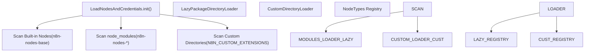
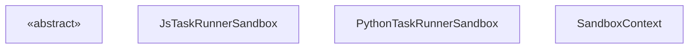

# Node Development and Community Packages

Relevant source files

-   [docker/images/runners/n8n-task-runners.json](https://github.com/n8n-io/n8n/blob/88f170b9/docker/images/runners/n8n-task-runners.json)
-   [packages/@n8n/nodes-langchain/nodes/code/Code.node.ts](https://github.com/n8n-io/n8n/blob/88f170b9/packages/@n8n/nodes-langchain/nodes/code/Code.node.ts)
-   [packages/@n8n/task-runner-python/src/\_\_init\_\_.py](https://github.com/n8n-io/n8n/blob/88f170b9/packages/@n8n/task-runner-python/src/__init__.py)
-   [packages/@n8n/task-runner-python/src/config/\_\_init\_\_.py](https://github.com/n8n-io/n8n/blob/88f170b9/packages/@n8n/task-runner-python/src/config/__init__.py)
-   [packages/@n8n/task-runner/src/js-task-runner/\_\_tests\_\_/require-resolver-global-modules.test.ts](https://github.com/n8n-io/n8n/blob/88f170b9/packages/@n8n/task-runner/src/js-task-runner/__tests__/require-resolver-global-modules.test.ts)
-   [packages/@n8n/task-runner/src/js-task-runner/obj-utils.ts](https://github.com/n8n-io/n8n/blob/88f170b9/packages/@n8n/task-runner/src/js-task-runner/obj-utils.ts)
-   [packages/@n8n/utils/src/files/path.test.ts](https://github.com/n8n-io/n8n/blob/88f170b9/packages/@n8n/utils/src/files/path.test.ts)
-   [packages/@n8n/utils/src/files/path.ts](https://github.com/n8n-io/n8n/blob/88f170b9/packages/@n8n/utils/src/files/path.ts)
-   [packages/cli/src/\_\_tests\_\_/load-nodes-and-credentials.test.ts](https://github.com/n8n-io/n8n/blob/88f170b9/packages/cli/src/__tests__/load-nodes-and-credentials.test.ts)
-   [packages/cli/src/load-nodes-and-credentials.ts](https://github.com/n8n-io/n8n/blob/88f170b9/packages/cli/src/load-nodes-and-credentials.ts)
-   [packages/cli/src/security-audit/risk-reporters/nodes-risk-reporter.ts](https://github.com/n8n-io/n8n/blob/88f170b9/packages/cli/src/security-audit/risk-reporters/nodes-risk-reporter.ts)
-   [packages/cli/src/security-audit/security-audit.repository.ts](https://github.com/n8n-io/n8n/blob/88f170b9/packages/cli/src/security-audit/security-audit.repository.ts)
-   [packages/cli/src/security-audit/security-audit.service.ts](https://github.com/n8n-io/n8n/blob/88f170b9/packages/cli/src/security-audit/security-audit.service.ts)
-   [packages/cli/test/integration/security-audit/credentials-risk-reporter.test.ts](https://github.com/n8n-io/n8n/blob/88f170b9/packages/cli/test/integration/security-audit/credentials-risk-reporter.test.ts)
-   [packages/cli/test/integration/security-audit/database-risk-reporter.test.ts](https://github.com/n8n-io/n8n/blob/88f170b9/packages/cli/test/integration/security-audit/database-risk-reporter.test.ts)
-   [packages/cli/test/integration/security-audit/filesystem-risk-reporter.test.ts](https://github.com/n8n-io/n8n/blob/88f170b9/packages/cli/test/integration/security-audit/filesystem-risk-reporter.test.ts)
-   [packages/cli/test/integration/security-audit/instance-risk-reporter.test.ts](https://github.com/n8n-io/n8n/blob/88f170b9/packages/cli/test/integration/security-audit/instance-risk-reporter.test.ts)
-   [packages/cli/test/integration/security-audit/nodes-risk-reporter.test.ts](https://github.com/n8n-io/n8n/blob/88f170b9/packages/cli/test/integration/security-audit/nodes-risk-reporter.test.ts)
-   [packages/core/src/nodes-loader/\_\_tests\_\_/directory-loader.test.ts](https://github.com/n8n-io/n8n/blob/88f170b9/packages/core/src/nodes-loader/__tests__/directory-loader.test.ts)
-   [packages/core/src/nodes-loader/constants.ts](https://github.com/n8n-io/n8n/blob/88f170b9/packages/core/src/nodes-loader/constants.ts)
-   [packages/core/src/nodes-loader/custom-directory-loader.ts](https://github.com/n8n-io/n8n/blob/88f170b9/packages/core/src/nodes-loader/custom-directory-loader.ts)
-   [packages/core/src/nodes-loader/directory-loader.ts](https://github.com/n8n-io/n8n/blob/88f170b9/packages/core/src/nodes-loader/directory-loader.ts)
-   [packages/core/src/nodes-loader/lazy-package-directory-loader.ts](https://github.com/n8n-io/n8n/blob/88f170b9/packages/core/src/nodes-loader/lazy-package-directory-loader.ts)
-   [packages/core/src/nodes-loader/package-directory-loader.ts](https://github.com/n8n-io/n8n/blob/88f170b9/packages/core/src/nodes-loader/package-directory-loader.ts)
-   [packages/frontend/editor-ui/src/app/utils/nodeIcon.test.ts](https://github.com/n8n-io/n8n/blob/88f170b9/packages/frontend/editor-ui/src/app/utils/nodeIcon.test.ts)
-   [packages/frontend/editor-ui/src/app/utils/nodeIcon.ts](https://github.com/n8n-io/n8n/blob/88f170b9/packages/frontend/editor-ui/src/app/utils/nodeIcon.ts)
-   [packages/nodes-base/nodes/Code/Code.node.ts](https://github.com/n8n-io/n8n/blob/88f170b9/packages/nodes-base/nodes/Code/Code.node.ts)
-   [packages/nodes-base/nodes/Code/JavaScriptSandbox.ts](https://github.com/n8n-io/n8n/blob/88f170b9/packages/nodes-base/nodes/Code/JavaScriptSandbox.ts)
-   [packages/nodes-base/nodes/Code/JsTaskRunnerSandbox.ts](https://github.com/n8n-io/n8n/blob/88f170b9/packages/nodes-base/nodes/Code/JsTaskRunnerSandbox.ts)
-   [packages/nodes-base/nodes/Code/Sandbox.ts](https://github.com/n8n-io/n8n/blob/88f170b9/packages/nodes-base/nodes/Code/Sandbox.ts)
-   [packages/nodes-base/nodes/Code/descriptions/PythonCodeDescription.ts](https://github.com/n8n-io/n8n/blob/88f170b9/packages/nodes-base/nodes/Code/descriptions/PythonCodeDescription.ts)
-   [packages/nodes-base/nodes/Code/reserved-key-found-error.ts](https://github.com/n8n-io/n8n/blob/88f170b9/packages/nodes-base/nodes/Code/reserved-key-found-error.ts)
-   [packages/nodes-base/nodes/Code/result-validation.ts](https://github.com/n8n-io/n8n/blob/88f170b9/packages/nodes-base/nodes/Code/result-validation.ts)
-   [packages/nodes-base/nodes/Code/test/Code.node.test.ts](https://github.com/n8n-io/n8n/blob/88f170b9/packages/nodes-base/nodes/Code/test/Code.node.test.ts)
-   [packages/nodes-base/nodes/Code/test/JsTaskRunnerSandbox.test.ts](https://github.com/n8n-io/n8n/blob/88f170b9/packages/nodes-base/nodes/Code/test/JsTaskRunnerSandbox.test.ts)
-   [packages/nodes-base/nodes/Code/test/utils.test.ts](https://github.com/n8n-io/n8n/blob/88f170b9/packages/nodes-base/nodes/Code/test/utils.test.ts)
-   [packages/nodes-base/nodes/Code/throw-execution-error.ts](https://github.com/n8n-io/n8n/blob/88f170b9/packages/nodes-base/nodes/Code/throw-execution-error.ts)
-   [packages/nodes-base/nodes/Code/utils.ts](https://github.com/n8n-io/n8n/blob/88f170b9/packages/nodes-base/nodes/Code/utils.ts)
-   [packages/nodes-base/nodes/Function/Function.node.ts](https://github.com/n8n-io/n8n/blob/88f170b9/packages/nodes-base/nodes/Function/Function.node.ts)
-   [packages/nodes-base/nodes/FunctionItem/FunctionItem.node.ts](https://github.com/n8n-io/n8n/blob/88f170b9/packages/nodes-base/nodes/FunctionItem/FunctionItem.node.ts)
-   [packages/nodes-base/types/xmlhttprequest-ssl.d.ts](https://github.com/n8n-io/n8n/blob/88f170b9/packages/nodes-base/types/xmlhttprequest-ssl.d.ts)
-   [packages/workflow/src/index.ts](https://github.com/n8n-io/n8n/blob/88f170b9/packages/workflow/src/index.ts)
-   [packages/workflow/src/node-helpers.ts](https://github.com/n8n-io/n8n/blob/88f170b9/packages/workflow/src/node-helpers.ts)
-   [packages/workflow/src/utils.ts](https://github.com/n8n-io/n8n/blob/88f170b9/packages/workflow/src/utils.ts)
-   [packages/workflow/test/node-helpers.test.ts](https://github.com/n8n-io/n8n/blob/88f170b9/packages/workflow/test/node-helpers.test.ts)
-   [packages/workflow/test/utils.test.ts](https://github.com/n8n-io/n8n/blob/88f170b9/packages/workflow/test/utils.test.ts)

This page documents the technical implementation of n8n's node development ecosystem. It covers the discovery and loading of custom nodes, the community package system, and the specialized execution environments used by nodes like the **Code** node.

---

## Node Discovery and Loading

The `LoadNodesAndCredentials` service is responsible for locating, initializing, and registering all nodes and credentials available to an n8n instance. This includes built-in nodes, custom nodes in local directories, and community packages installed via npm.

### Discovery Logic

The service initializes by scanning multiple locations for node and credential definitions. It sets up the `NODE_PATH` environment variable to ensure that dynamically loaded modules can resolve their own dependencies [packages/cli/src/load-nodes-and-credentials.ts69-79](https://github.com/n8n-io/n8n/blob/88f170b9/packages/cli/src/load-nodes-and-credentials.ts#L69-L79)

**Diagram: Node Discovery Pipeline**

**Key Loading Stages:**

1.  **Built-in Nodes:** Scans the `n8n-nodes-base` and `@n8n/n8n-nodes-langchain` packages relative to the CLI directory [packages/cli/src/load-nodes-and-credentials.ts91-103](https://github.com/n8n-io/n8n/blob/88f170b9/packages/cli/src/load-nodes-and-credentials.ts#L91-L103)
2.  **Community Packages:** Iterates through `node_modules` looking for packages matching `n8n-nodes-*` or `@*/n8n-nodes-*` [packages/cli/src/load-nodes-and-credentials.ts172-182](https://github.com/n8n-io/n8n/blob/88f170b9/packages/cli/src/load-nodes-and-credentials.ts#L172-L182)
3.  **Custom Extensions:** Loads nodes from directories specified in the `N8N_CUSTOM_EXTENSIONS` environment variable using the `CustomDirectoryLoader` [packages/cli/src/load-nodes-and-credentials.ts109-110](https://github.com/n8n-io/n8n/blob/88f170b9/packages/cli/src/load-nodes-and-credentials.ts#L109-L110)

### Directory Loaders

n8n uses specialized `DirectoryLoader` classes to handle different package structures:

-   **`PackageDirectoryLoader`**: Standard loader that reads `package.json` to find the `n8n` property containing arrays of node and credential paths [packages/core/src/nodes-loader/package-directory-loader.ts](https://github.com/n8n-io/n8n/blob/88f170b9/packages/core/src/nodes-loader/package-directory-loader.ts)
-   **`LazyPackageDirectoryLoader`**: Optimizes startup by only loading node descriptions initially, deferring the full class loading until the node is actually executed [packages/core/src/nodes-loader/lazy-package-directory-loader.ts](https://github.com/n8n-io/n8n/blob/88f170b9/packages/core/src/nodes-loader/lazy-package-directory-loader.ts)
-   **`CustomDirectoryLoader`**: Handles nodes loaded from arbitrary filesystem paths outside of standard npm locations [packages/core/src/nodes-loader/custom-directory-loader.ts](https://github.com/n8n-io/n8n/blob/88f170b9/packages/core/src/nodes-loader/custom-directory-loader.ts)

Sources: [packages/cli/src/load-nodes-and-credentials.ts38-111](https://github.com/n8n-io/n8n/blob/88f170b9/packages/cli/src/load-nodes-and-credentials.ts#L38-L111) [packages/core/src/nodes-loader/directory-loader.ts61-105](https://github.com/n8n-io/n8n/blob/88f170b9/packages/core/src/nodes-loader/directory-loader.ts#L61-L105) [packages/cli/src/\_\_tests\_\_/load-nodes-and-credentials.test.ts82-151](https://github.com/n8n-io/n8n/blob/88f170b9/packages/cli/src/__tests__/load-nodes-and-credentials.test.ts#L82-L151)

---

## The Code Node and Sandboxing

The **Code** node allows users to write custom JavaScript or Python. Because this code is untrusted, n8n executes it within a sandboxed environment to protect the host system.

### Execution Modes

The Code node supports two languages, each with its own sandbox implementation:

1.  **JavaScript**: Uses the `JsTaskRunnerSandbox` which leverages the `vm2` library (via `JavaScriptSandbox`) [packages/nodes-base/nodes/Code/Code.node.ts179-187](https://github.com/n8n-io/n8n/blob/88f170b9/packages/nodes-base/nodes/Code/Code.node.ts#L179-L187)
2.  **Python**: Uses the `PythonTaskRunnerSandbox`, which communicates with an external Python process [packages/nodes-base/nodes/Code/Code.node.ts189-201](https://github.com/n8n-io/n8n/blob/88f170b9/packages/nodes-base/nodes/Code/Code.node.ts#L189-L201)

### The Sandbox Context

The sandbox provides a restricted `SandboxContext` that mimics the standard node execution environment but limits access to sensitive globals. It injects specific n8n helpers and data proxies [packages/nodes-base/nodes/Code/Sandbox.ts24-43](https://github.com/n8n-io/n8n/blob/88f170b9/packages/nodes-base/nodes/Code/Sandbox.ts#L24-L43)

**Diagram: Code Node Sandbox Architecture**

**Context Injection Logic:**

-   **Data Access**: The context includes all variables from `getWorkflowDataProxy(index)`, providing access to `$json`, `$node`, and `$env` [packages/nodes-base/nodes/Code/Sandbox.ts41](https://github.com/n8n-io/n8n/blob/88f170b9/packages/nodes-base/nodes/Code/Sandbox.ts#L41-L41)
-   **Method Binding**: Core methods like `getNodeParameter` and `getWorkflowStaticData` are bound to the current execution context and exposed as `$getNodeParameter` and `$getWorkflowStaticData` [packages/nodes-base/nodes/Code/Sandbox.ts35-36](https://github.com/n8n-io/n8n/blob/88f170b9/packages/nodes-base/nodes/Code/Sandbox.ts#L35-L36)

Sources: [packages/nodes-base/nodes/Code/Code.node.ts31-205](https://github.com/n8n-io/n8n/blob/88f170b9/packages/nodes-base/nodes/Code/Code.node.ts#L31-L205) [packages/nodes-base/nodes/Code/Sandbox.ts1-80](https://github.com/n8n-io/n8n/blob/88f170b9/packages/nodes-base/nodes/Code/Sandbox.ts#L1-L80) [packages/nodes-base/nodes/Code/JsTaskRunnerSandbox.ts](https://github.com/n8n-io/n8n/blob/88f170b9/packages/nodes-base/nodes/Code/JsTaskRunnerSandbox.ts)

---

## AI and LangChain Node Development

AI nodes (found in `@n8n/n8n-nodes-langchain`) utilize a specialized version of the Code node that supports LangChain-specific imports and connections.

### Legacy Import Transformation

To maintain backward compatibility as LangChain evolved, n8n automatically transforms legacy `langchain/*` imports to `@langchain/classic/*` within the sandbox [packages/@n8n/nodes-langchain/nodes/code/Code.node.ts66-143](https://github.com/n8n-io/n8n/blob/88f170b9/packages/@n8n/nodes-langchain/nodes/code/Code.node.ts#L66-L143)

### Connection Supply Data

Unlike standard nodes, AI nodes often use `SupplyData` to provide LangChain components (like Tools or Embeddings) to other nodes in the chain [packages/@n8n/nodes-langchain/nodes/code/Code.node.ts56-57](https://github.com/n8n-io/n8n/blob/88f170b9/packages/@n8n/nodes-langchain/nodes/code/Code.node.ts#L56-L57)

Sources: [packages/@n8n/nodes-langchain/nodes/code/Code.node.ts1-204](https://github.com/n8n-io/n8n/blob/88f170b9/packages/@n8n/nodes-langchain/nodes/code/Code.node.ts#L1-L204)

---

## Community Package Structure

Community packages are standard npm packages that n8n identifies via a specific `n8n` block in `package.json`.

### Package Requirements

-   **Naming**: Packages should ideally follow the `n8n-nodes-<name>` convention [packages/workflow/src/utils.ts17](https://github.com/n8n-io/n8n/blob/88f170b9/packages/workflow/src/utils.ts#L17-L17)
-   **Metadata**: The `n8n` property in `package.json` must list the relative paths to the compiled `.js` files for nodes and credentials [packages/core/src/nodes-loader/package-directory-loader.ts](https://github.com/n8n-io/n8n/blob/88f170b9/packages/core/src/nodes-loader/package-directory-loader.ts)

### Resource Resolution (Icons)

Icons for custom nodes are resolved using a strategy that accounts for both relative package paths and absolute paths used during local development (via `N8N_CUSTOM_EXTENSIONS`). The `resolveIcon` method in `LoadNodesAndCredentials` handles these various path formats, including Windows drive letters [packages/cli/src/load-nodes-and-credentials.ts198-212](https://github.com/n8n-io/n8n/blob/88f170b9/packages/cli/src/load-nodes-and-credentials.ts#L198-L212)

Sources: [packages/cli/src/load-nodes-and-credentials.ts198-212](https://github.com/n8n-io/n8n/blob/88f170b9/packages/cli/src/load-nodes-and-credentials.ts#L198-L212) [packages/workflow/src/utils.ts57](https://github.com/n8n-io/n8n/blob/88f170b9/packages/workflow/src/utils.ts#L57-L57) [packages/core/src/nodes-loader/directory-loader.ts163-230](https://github.com/n8n-io/n8n/blob/88f170b9/packages/core/src/nodes-loader/directory-loader.ts#L163-L230)

---

## Node Development Utilities

The `@n8n/workflow-sdk` and `n8n-workflow` packages provide essential utilities for node developers:

| Function / Class | Purpose | Source |
| --- | --- | --- |
| `deepCopy` | Safely clones data objects, handling `toJSON` and circular refs | [packages/workflow/src/utils.ts53-89](https://github.com/n8n-io/n8n/blob/88f170b9/packages/workflow/src/utils.ts#L53-L89) |
| `jsonParse` | Robust JSON parsing with "repair" and "JS object" recovery modes | [packages/workflow/src/utils.ts152-183](https://github.com/n8n-io/n8n/blob/88f170b9/packages/workflow/src/utils.ts#L152-L183) |
| `NodeHelpers` | Utilities for checking node types (e.g., `isSubNodeType`) | [packages/workflow/src/node-helpers.ts248-258](https://github.com/n8n-io/n8n/blob/88f170b9/packages/workflow/src/node-helpers.ts#L248-L258) |
| `INodeType` | The primary interface all nodes must implement | [packages/workflow/src/interfaces.ts](https://github.com/n8n-io/n8n/blob/88f170b9/packages/workflow/src/interfaces.ts) |

Sources: [packages/workflow/src/index.ts](https://github.com/n8n-io/n8n/blob/88f170b9/packages/workflow/src/index.ts) [packages/workflow/src/utils.ts](https://github.com/n8n-io/n8n/blob/88f170b9/packages/workflow/src/utils.ts) [packages/workflow/src/node-helpers.ts](https://github.com/n8n-io/n8n/blob/88f170b9/packages/workflow/src/node-helpers.ts)
