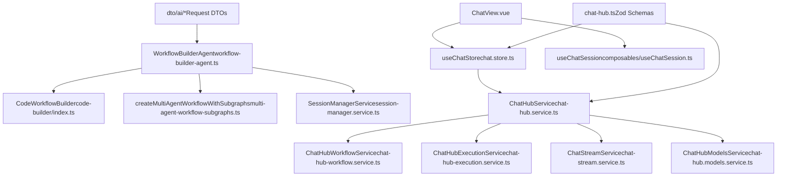

# AI Features

Relevant source files

-   [packages/@n8n/ai-workflow-builder.ee/src/ai-workflow-builder-agent.service.ts](https://github.com/n8n-io/n8n/blob/88f170b9/packages/@n8n/ai-workflow-builder.ee/src/ai-workflow-builder-agent.service.ts)
-   [packages/@n8n/ai-workflow-builder.ee/src/constants.ts](https://github.com/n8n-io/n8n/blob/88f170b9/packages/@n8n/ai-workflow-builder.ee/src/constants.ts)
-   [packages/@n8n/ai-workflow-builder.ee/src/session-manager.service.ts](https://github.com/n8n-io/n8n/blob/88f170b9/packages/@n8n/ai-workflow-builder.ee/src/session-manager.service.ts)
-   [packages/@n8n/ai-workflow-builder.ee/src/subgraphs/builder.subgraph.ts](https://github.com/n8n-io/n8n/blob/88f170b9/packages/@n8n/ai-workflow-builder.ee/src/subgraphs/builder.subgraph.ts)
-   [packages/@n8n/ai-workflow-builder.ee/src/test/ai-workflow-builder-agent.service.test.ts](https://github.com/n8n-io/n8n/blob/88f170b9/packages/@n8n/ai-workflow-builder.ee/src/test/ai-workflow-builder-agent.service.test.ts)
-   [packages/@n8n/ai-workflow-builder.ee/src/test/session-manager.service.test.ts](https://github.com/n8n-io/n8n/blob/88f170b9/packages/@n8n/ai-workflow-builder.ee/src/test/session-manager.service.test.ts)
-   [packages/@n8n/ai-workflow-builder.ee/src/test/workflow-builder-agent.test.ts](https://github.com/n8n-io/n8n/blob/88f170b9/packages/@n8n/ai-workflow-builder.ee/src/test/workflow-builder-agent.test.ts)
-   [packages/@n8n/ai-workflow-builder.ee/src/tools/builder-tools.ts](https://github.com/n8n-io/n8n/blob/88f170b9/packages/@n8n/ai-workflow-builder.ee/src/tools/builder-tools.ts)
-   [packages/@n8n/ai-workflow-builder.ee/src/tools/helpers/state.ts](https://github.com/n8n-io/n8n/blob/88f170b9/packages/@n8n/ai-workflow-builder.ee/src/tools/helpers/state.ts)
-   [packages/@n8n/ai-workflow-builder.ee/src/tools/remove-connection.tool.ts](https://github.com/n8n-io/n8n/blob/88f170b9/packages/@n8n/ai-workflow-builder.ee/src/tools/remove-connection.tool.ts)
-   [packages/@n8n/ai-workflow-builder.ee/src/tools/rename-node.tool.ts](https://github.com/n8n-io/n8n/blob/88f170b9/packages/@n8n/ai-workflow-builder.ee/src/tools/rename-node.tool.ts)
-   [packages/@n8n/ai-workflow-builder.ee/src/tools/test/builder-tools.test.ts](https://github.com/n8n-io/n8n/blob/88f170b9/packages/@n8n/ai-workflow-builder.ee/src/tools/test/builder-tools.test.ts)
-   [packages/@n8n/ai-workflow-builder.ee/src/tools/test/remove-connection.tool.test.ts](https://github.com/n8n-io/n8n/blob/88f170b9/packages/@n8n/ai-workflow-builder.ee/src/tools/test/remove-connection.tool.test.ts)
-   [packages/@n8n/ai-workflow-builder.ee/src/tools/test/rename-node.tool.test.ts](https://github.com/n8n-io/n8n/blob/88f170b9/packages/@n8n/ai-workflow-builder.ee/src/tools/test/rename-node.tool.test.ts)
-   [packages/@n8n/ai-workflow-builder.ee/src/types/tools.ts](https://github.com/n8n-io/n8n/blob/88f170b9/packages/@n8n/ai-workflow-builder.ee/src/types/tools.ts)
-   [packages/@n8n/ai-workflow-builder.ee/src/types/workflow.ts](https://github.com/n8n-io/n8n/blob/88f170b9/packages/@n8n/ai-workflow-builder.ee/src/types/workflow.ts)
-   [packages/@n8n/ai-workflow-builder.ee/src/utils/error-sanitizer.ts](https://github.com/n8n-io/n8n/blob/88f170b9/packages/@n8n/ai-workflow-builder.ee/src/utils/error-sanitizer.ts)
-   [packages/@n8n/ai-workflow-builder.ee/src/utils/operations-processor.ts](https://github.com/n8n-io/n8n/blob/88f170b9/packages/@n8n/ai-workflow-builder.ee/src/utils/operations-processor.ts)
-   [packages/@n8n/ai-workflow-builder.ee/src/utils/stream-processor.ts](https://github.com/n8n-io/n8n/blob/88f170b9/packages/@n8n/ai-workflow-builder.ee/src/utils/stream-processor.ts)
-   [packages/@n8n/ai-workflow-builder.ee/src/utils/test/error-sanitizer.test.ts](https://github.com/n8n-io/n8n/blob/88f170b9/packages/@n8n/ai-workflow-builder.ee/src/utils/test/error-sanitizer.test.ts)
-   [packages/@n8n/ai-workflow-builder.ee/src/utils/test/operations-processor.test.ts](https://github.com/n8n-io/n8n/blob/88f170b9/packages/@n8n/ai-workflow-builder.ee/src/utils/test/operations-processor.test.ts)
-   [packages/@n8n/ai-workflow-builder.ee/src/utils/test/stream-processor.test.ts](https://github.com/n8n-io/n8n/blob/88f170b9/packages/@n8n/ai-workflow-builder.ee/src/utils/test/stream-processor.test.ts)
-   [packages/@n8n/ai-workflow-builder.ee/src/utils/test/tool-executor.test.ts](https://github.com/n8n-io/n8n/blob/88f170b9/packages/@n8n/ai-workflow-builder.ee/src/utils/test/tool-executor.test.ts)
-   [packages/@n8n/ai-workflow-builder.ee/src/utils/token-usage.ts](https://github.com/n8n-io/n8n/blob/88f170b9/packages/@n8n/ai-workflow-builder.ee/src/utils/token-usage.ts)
-   [packages/@n8n/ai-workflow-builder.ee/src/workflow-builder-agent.ts](https://github.com/n8n-io/n8n/blob/88f170b9/packages/@n8n/ai-workflow-builder.ee/src/workflow-builder-agent.ts)
-   [packages/@n8n/ai-workflow-builder.ee/src/workflow-state.ts](https://github.com/n8n-io/n8n/blob/88f170b9/packages/@n8n/ai-workflow-builder.ee/src/workflow-state.ts)
-   [packages/@n8n/api-types/src/chat-hub.ts](https://github.com/n8n-io/n8n/blob/88f170b9/packages/@n8n/api-types/src/chat-hub.ts)
-   [packages/@n8n/api-types/src/dto/ai/\_\_tests\_\_/ai-build-request.dto.test.ts](https://github.com/n8n-io/n8n/blob/88f170b9/packages/@n8n/api-types/src/dto/ai/__tests__/ai-build-request.dto.test.ts)
-   [packages/@n8n/api-types/src/dto/ai/ai-build-request.dto.ts](https://github.com/n8n-io/n8n/blob/88f170b9/packages/@n8n/api-types/src/dto/ai/ai-build-request.dto.ts)
-   [packages/@n8n/api-types/src/dto/index.ts](https://github.com/n8n-io/n8n/blob/88f170b9/packages/@n8n/api-types/src/dto/index.ts)
-   [packages/@n8n/api-types/src/index.ts](https://github.com/n8n-io/n8n/blob/88f170b9/packages/@n8n/api-types/src/index.ts)
-   [packages/cli/src/controllers/\_\_tests\_\_/ai.controller.test.ts](https://github.com/n8n-io/n8n/blob/88f170b9/packages/cli/src/controllers/__tests__/ai.controller.test.ts)
-   [packages/cli/src/controllers/ai.controller.ts](https://github.com/n8n-io/n8n/blob/88f170b9/packages/cli/src/controllers/ai.controller.ts)
-   [packages/cli/src/modules/chat-hub/\_\_tests\_\_/chat-hub.service.integration.test.ts](https://github.com/n8n-io/n8n/blob/88f170b9/packages/cli/src/modules/chat-hub/__tests__/chat-hub.service.integration.test.ts)
-   [packages/cli/src/modules/chat-hub/chat-hub-agent.repository.ts](https://github.com/n8n-io/n8n/blob/88f170b9/packages/cli/src/modules/chat-hub/chat-hub-agent.repository.ts)
-   [packages/cli/src/modules/chat-hub/chat-hub-message.entity.ts](https://github.com/n8n-io/n8n/blob/88f170b9/packages/cli/src/modules/chat-hub/chat-hub-message.entity.ts)
-   [packages/cli/src/modules/chat-hub/chat-hub-session.entity.ts](https://github.com/n8n-io/n8n/blob/88f170b9/packages/cli/src/modules/chat-hub/chat-hub-session.entity.ts)
-   [packages/cli/src/modules/chat-hub/chat-hub-workflow.service.ts](https://github.com/n8n-io/n8n/blob/88f170b9/packages/cli/src/modules/chat-hub/chat-hub-workflow.service.ts)
-   [packages/cli/src/modules/chat-hub/chat-hub.constants.ts](https://github.com/n8n-io/n8n/blob/88f170b9/packages/cli/src/modules/chat-hub/chat-hub.constants.ts)
-   [packages/cli/src/modules/chat-hub/chat-hub.controller.ts](https://github.com/n8n-io/n8n/blob/88f170b9/packages/cli/src/modules/chat-hub/chat-hub.controller.ts)
-   [packages/cli/src/modules/chat-hub/chat-hub.service.ts](https://github.com/n8n-io/n8n/blob/88f170b9/packages/cli/src/modules/chat-hub/chat-hub.service.ts)
-   [packages/cli/src/modules/chat-hub/chat-hub.types.ts](https://github.com/n8n-io/n8n/blob/88f170b9/packages/cli/src/modules/chat-hub/chat-hub.types.ts)
-   [packages/cli/src/modules/chat-hub/chat-message.repository.ts](https://github.com/n8n-io/n8n/blob/88f170b9/packages/cli/src/modules/chat-hub/chat-message.repository.ts)
-   [packages/cli/src/modules/chat-hub/chat-session.repository.ts](https://github.com/n8n-io/n8n/blob/88f170b9/packages/cli/src/modules/chat-hub/chat-session.repository.ts)
-   [packages/cli/src/modules/chat-hub/context-limits.ts](https://github.com/n8n-io/n8n/blob/88f170b9/packages/cli/src/modules/chat-hub/context-limits.ts)
-   [packages/cli/src/services/\_\_tests\_\_/ai-workflow-builder.service.test.ts](https://github.com/n8n-io/n8n/blob/88f170b9/packages/cli/src/services/__tests__/ai-workflow-builder.service.test.ts)
-   [packages/cli/src/services/\_\_tests\_\_/ai.service.test.ts](https://github.com/n8n-io/n8n/blob/88f170b9/packages/cli/src/services/__tests__/ai.service.test.ts)
-   [packages/cli/src/services/ai-workflow-builder.service.ts](https://github.com/n8n-io/n8n/blob/88f170b9/packages/cli/src/services/ai-workflow-builder.service.ts)
-   [packages/cli/src/services/ai.service.ts](https://github.com/n8n-io/n8n/blob/88f170b9/packages/cli/src/services/ai.service.ts)
-   [packages/frontend/@n8n/design-system/src/components/AskAssistantChat/messages/MessageWrapper.vue](https://github.com/n8n-io/n8n/blob/88f170b9/packages/frontend/@n8n/design-system/src/components/AskAssistantChat/messages/MessageWrapper.vue)
-   [packages/frontend/@n8n/design-system/src/components/AskAssistantChat/messages/TextMessage.test.ts](https://github.com/n8n-io/n8n/blob/88f170b9/packages/frontend/@n8n/design-system/src/components/AskAssistantChat/messages/TextMessage.test.ts)
-   [packages/frontend/editor-ui/src/app/constants/workflowSuggestions.ts](https://github.com/n8n-io/n8n/blob/88f170b9/packages/frontend/editor-ui/src/app/constants/workflowSuggestions.ts)
-   [packages/frontend/editor-ui/src/features/ai/assistant/assistant.api.test.ts](https://github.com/n8n-io/n8n/blob/88f170b9/packages/frontend/editor-ui/src/features/ai/assistant/assistant.api.test.ts)
-   [packages/frontend/editor-ui/src/features/ai/assistant/assistant.api.ts](https://github.com/n8n-io/n8n/blob/88f170b9/packages/frontend/editor-ui/src/features/ai/assistant/assistant.api.ts)
-   [packages/frontend/editor-ui/src/features/ai/chatHub/ChatView.vue](https://github.com/n8n-io/n8n/blob/88f170b9/packages/frontend/editor-ui/src/features/ai/chatHub/ChatView.vue)
-   [packages/frontend/editor-ui/src/features/ai/chatHub/chat.api.ts](https://github.com/n8n-io/n8n/blob/88f170b9/packages/frontend/editor-ui/src/features/ai/chatHub/chat.api.ts)
-   [packages/frontend/editor-ui/src/features/ai/chatHub/chat.store.ts](https://github.com/n8n-io/n8n/blob/88f170b9/packages/frontend/editor-ui/src/features/ai/chatHub/chat.store.ts)
-   [packages/frontend/editor-ui/src/features/ai/chatHub/chat.types.ts](https://github.com/n8n-io/n8n/blob/88f170b9/packages/frontend/editor-ui/src/features/ai/chatHub/chat.types.ts)
-   [packages/frontend/editor-ui/src/features/ai/chatHub/chat.utils.ts](https://github.com/n8n-io/n8n/blob/88f170b9/packages/frontend/editor-ui/src/features/ai/chatHub/chat.utils.ts)
-   [packages/frontend/editor-ui/src/features/ai/chatHub/components/AgentEditorModal.vue](https://github.com/n8n-io/n8n/blob/88f170b9/packages/frontend/editor-ui/src/features/ai/chatHub/components/AgentEditorModal.vue)
-   [packages/frontend/editor-ui/src/features/ai/chatHub/components/ChatAgentCard.vue](https://github.com/n8n-io/n8n/blob/88f170b9/packages/frontend/editor-ui/src/features/ai/chatHub/components/ChatAgentCard.vue)
-   [packages/frontend/editor-ui/src/features/ai/chatHub/components/ChatConversationHeader.vue](https://github.com/n8n-io/n8n/blob/88f170b9/packages/frontend/editor-ui/src/features/ai/chatHub/components/ChatConversationHeader.vue)
-   [packages/frontend/editor-ui/src/features/ai/chatHub/components/ChatMessage.vue](https://github.com/n8n-io/n8n/blob/88f170b9/packages/frontend/editor-ui/src/features/ai/chatHub/components/ChatMessage.vue)
-   [packages/frontend/editor-ui/src/features/ai/chatHub/components/ChatPrompt.vue](https://github.com/n8n-io/n8n/blob/88f170b9/packages/frontend/editor-ui/src/features/ai/chatHub/components/ChatPrompt.vue)
-   [packages/frontend/editor-ui/src/features/ai/chatHub/components/ChatSessionMenuItem.vue](https://github.com/n8n-io/n8n/blob/88f170b9/packages/frontend/editor-ui/src/features/ai/chatHub/components/ChatSessionMenuItem.vue)
-   [packages/frontend/editor-ui/src/features/ai/chatHub/components/ChatSidebarContent.vue](https://github.com/n8n-io/n8n/blob/88f170b9/packages/frontend/editor-ui/src/features/ai/chatHub/components/ChatSidebarContent.vue)
-   [packages/frontend/editor-ui/src/features/ai/chatHub/components/ModelSelector.vue](https://github.com/n8n-io/n8n/blob/88f170b9/packages/frontend/editor-ui/src/features/ai/chatHub/components/ModelSelector.vue)
-   [packages/frontend/editor-ui/src/features/ai/chatHub/constants.ts](https://github.com/n8n-io/n8n/blob/88f170b9/packages/frontend/editor-ui/src/features/ai/chatHub/constants.ts)
-   [packages/frontend/editor-ui/src/features/ndv/parameters/components/ButtonParameter/ButtonParameter.test.ts](https://github.com/n8n-io/n8n/blob/88f170b9/packages/frontend/editor-ui/src/features/ndv/parameters/components/ButtonParameter/ButtonParameter.test.ts)
-   [packages/frontend/editor-ui/src/features/ndv/parameters/utils/buttonParameter.utils.test.ts](https://github.com/n8n-io/n8n/blob/88f170b9/packages/frontend/editor-ui/src/features/ndv/parameters/utils/buttonParameter.utils.test.ts)
-   [packages/frontend/editor-ui/src/features/ndv/parameters/utils/buttonParameter.utils.ts](https://github.com/n8n-io/n8n/blob/88f170b9/packages/frontend/editor-ui/src/features/ndv/parameters/utils/buttonParameter.utils.ts)
-   [packages/frontend/editor-ui/src/features/shared/editors/components/CodeNodeEditor/AskAI/AskAI.vue](https://github.com/n8n-io/n8n/blob/88f170b9/packages/frontend/editor-ui/src/features/shared/editors/components/CodeNodeEditor/AskAI/AskAI.vue)

n8n provides three distinct AI subsystems that work together to enable AI-powered workflow automation:

1.  **AI Workflow Builder** — AI assistant that helps users create workflows on the canvas through natural language.
2.  **Chat Hub** — Standalone conversational UI that can invoke LLM providers or execute n8n workflows as agents.
3.  **AI Agent Execution** — Tool-calling agent nodes (from `@n8n/nodes-langchain`) that execute inside workflows with ReAct or function-calling loops.

This page provides a high-level overview of how these systems are organized and how they relate to each other. For detailed implementation documentation, see the child pages:

-   [AI Workflow Builder](/n8n-io/n8n/5.1-ai-workflow-builder) — LangGraph-based workflow generation system.
-   [Chat Hub Backend System](/n8n-io/n8n/5.2-chat-hub-backend-system) — Session management, model orchestration, and streaming.
-   [Chat Hub Frontend and User Interface](/n8n-io/n8n/5.3-chat-hub-frontend-and-user-interface) — Vue 3 components and state management.
-   [AI Agent and Tool Execution](/n8n-io/n8n/5.4-ai-agent-and-tool-execution) — Tool-calling protocol and MCP integration.

For LangChain node definitions used in workflows, see [AI and LangChain Nodes](/n8n-io/n8n/4.3-ai-and-langchain-nodes).

---

## Package Layout

The AI features are organized across multiple packages:

| Package | Key Components | Role |
| --- | --- | --- |
| `@n8n/ai-workflow-builder.ee` | `WorkflowBuilderAgent`, `CodeWorkflowBuilder`, `SessionManagerService` | LangGraph-based multi-agent workflow generator and session management [packages/@n8n/ai-workflow-builder.ee/src/workflow-builder-agent.ts152-167](https://github.com/n8n-io/n8n/blob/88f170b9/packages/@n8n/ai-workflow-builder.ee/src/workflow-builder-agent.ts#L152-L167) |
| `@n8n/ai-utilities` | Token counting, text splitting, chunking utilities | Shared AI utilities used by workflow builder and Chat Hub. |
| `packages/cli/src/modules/chat-hub/` | `ChatHubService`, `ChatHubWorkflowService`, `ChatHubExecutionService`, `ChatStreamService` | Chat Hub backend orchestration, model management, streaming [packages/cli/src/modules/chat-hub/chat-hub.service.ts54-71](https://github.com/n8n-io/n8n/blob/88f170b9/packages/cli/src/modules/chat-hub/chat-hub.service.ts#L54-L71) |
| `packages/frontend/editor-ui/src/features/ai/chatHub/` | `ChatView.vue`, `useChatStore`, `useChatSession` | Chat Hub frontend SPA with Vue 3 components and Pinia store [packages/frontend/editor-ui/src/features/ai/chatHub/ChatView.vue64-75](https://github.com/n8n-io/n8n/blob/88f170b9/packages/frontend/editor-ui/src/features/ai/chatHub/ChatView.vue#L64-L75) |
| `@n8n/api-types/src/chat-hub.ts` | Zod schemas and TypeScript types | Shared DTOs for Chat Hub and workflow builder [packages/@n8n/api-types/src/chat-hub.ts1-206](https://github.com/n8n-io/n8n/blob/88f170b9/packages/@n8n/api-types/src/chat-hub.ts#L1-L206) |

Sources: [packages/@n8n/ai-workflow-builder.ee/src/workflow-builder-agent.ts152-167](https://github.com/n8n-io/n8n/blob/88f170b9/packages/@n8n/ai-workflow-builder.ee/src/workflow-builder-agent.ts#L152-L167) [packages/cli/src/modules/chat-hub/chat-hub.service.ts54-71](https://github.com/n8n-io/n8n/blob/88f170b9/packages/cli/src/modules/chat-hub/chat-hub.service.ts#L54-L71) [packages/frontend/editor-ui/src/features/ai/chatHub/ChatView.vue64-75](https://github.com/n8n-io/n8n/blob/88f170b9/packages/frontend/editor-ui/src/features/ai/chatHub/ChatView.vue#L64-L75) [packages/@n8n/api-types/src/chat-hub.ts1-206](https://github.com/n8n-io/n8n/blob/88f170b9/packages/@n8n/api-types/src/chat-hub.ts#L1-L206)

---

## High-Level System Map

The following diagram maps each AI subsystem to the concrete code entities that implement it.

**AI subsystems and their code entities**

Sources: [packages/@n8n/ai-workflow-builder.ee/src/workflow-builder-agent.ts152-167](https://github.com/n8n-io/n8n/blob/88f170b9/packages/@n8n/ai-workflow-builder.ee/src/workflow-builder-agent.ts#L152-L167) [packages/cli/src/modules/chat-hub/chat-hub.service.ts54-71](https://github.com/n8n-io/n8n/blob/88f170b9/packages/cli/src/modules/chat-hub/chat-hub.service.ts#L54-L71) [packages/frontend/editor-ui/src/features/ai/chatHub/ChatView.vue64-75](https://github.com/n8n-io/n8n/blob/88f170b9/packages/frontend/editor-ui/src/features/ai/chatHub/ChatView.vue#L64-L75) [packages/@n8n/api-types/src/chat-hub.ts12-85](https://github.com/n8n-io/n8n/blob/88f170b9/packages/@n8n/api-types/src/chat-hub.ts#L12-L85) [packages/@n8n/api-types/src/dto/index.ts3-11](https://github.com/n8n-io/n8n/blob/88f170b9/packages/@n8n/api-types/src/dto/index.ts#L3-L11)

---

## System Relationships

The three AI subsystems operate independently but share common infrastructure:

| Component | AI Workflow Builder | Chat Hub | AI Agent Execution |
| --- | --- | --- | --- |
| **Entry point** | Canvas Assistant UI | Chat Hub UI | Workflow nodes |
| **Execution model** | LangGraph agent system | Standard workflow execution | LangChain agent loop |
| **LLM integration** | Direct SDK calls | Via LangChain nodes in generated workflows | Via LangChain chat model nodes |
| **Credential usage** | Global AI assistant credentials | User-selected model credentials [packages/cli/src/modules/chat-hub/chat-hub.service.ts75-84](https://github.com/n8n-io/n8n/blob/88f170b9/packages/cli/src/modules/chat-hub/chat-hub.service.ts#L75-L84) | Workflow credential nodes |
| **Session persistence** | LangGraph thread state | Database (`ChatHubSession`, `ChatHubMessage`) [packages/cli/src/modules/chat-hub/chat-hub.service.ts60-61](https://github.com/n8n-io/n8n/blob/88f170b9/packages/cli/src/modules/chat-hub/chat-hub.service.ts#L60-L61) | Memory nodes in workflow |
| **Streaming** | SSE to canvas | Push events to chat UI | Workflow execution streaming |

**AI Workflow Builder** operates at the canvas level, generating workflow JSON through a multi-agent LangGraph system. It does not execute workflows during generation—it produces the workflow definition as output [packages/@n8n/ai-workflow-builder.ee/src/workflow-builder-agent.ts120-150](https://github.com/n8n-io/n8n/blob/88f170b9/packages/@n8n/ai-workflow-builder.ee/src/workflow-builder-agent.ts#L120-L150)

**Chat Hub** executes workflows at runtime. When a user sends a message with an LLM provider selected, Chat Hub dynamically constructs a workflow containing `ChatTrigger` → `Agent` → `ChatModel` nodes and executes it [packages/cli/src/modules/chat-hub/chat-hub-workflow.service.ts104-124](https://github.com/n8n-io/n8n/blob/88f170b9/packages/cli/src/modules/chat-hub/chat-hub-workflow.service.ts#L104-L124)

**AI Agent Execution** happens inside workflow runs when an `Agent` node is reached. The agent uses LangChain's tool-calling loop to iteratively invoke sub-nodes as tools until it produces a final response.

Sources: [packages/@n8n/ai-workflow-builder.ee/src/workflow-builder-agent.ts120-150](https://github.com/n8n-io/n8n/blob/88f170b9/packages/@n8n/ai-workflow-builder.ee/src/workflow-builder-agent.ts#L120-L150) [packages/cli/src/modules/chat-hub/chat-hub-workflow.service.ts104-124](https://github.com/n8n-io/n8n/blob/88f170b9/packages/cli/src/modules/chat-hub/chat-hub-workflow.service.ts#L104-L124) [packages/cli/src/modules/chat-hub/chat-hub.service.ts54-71](https://github.com/n8n-io/n8n/blob/88f170b9/packages/cli/src/modules/chat-hub/chat-hub.service.ts#L54-L71)

---

## AI Workflow Builder Overview

The AI Workflow Builder is a canvas assistant that helps users create workflows through natural language. It utilizes a LangGraph-based architecture to plan and build nodes.

**Request flow**: Assistant UI → `AiController` → `WorkflowBuilderService` → `WorkflowBuilderAgent.chat()`.

The system uses specialized agents for different stages (supervisor, responder, discovery, builder, parameterUpdater, planner), each with configurable LLM models via `StageLLMs` [packages/@n8n/ai-workflow-builder.ee/src/workflow-builder-agent.ts66-73](https://github.com/n8n-io/n8n/blob/88f170b9/packages/@n8n/ai-workflow-builder.ee/src/workflow-builder-agent.ts#L66-L73) Session continuity is maintained through the `SessionManagerService` [packages/@n8n/ai-workflow-builder.ee/src/workflow-builder-agent.ts36](https://github.com/n8n-io/n8n/blob/88f170b9/packages/@n8n/ai-workflow-builder.ee/src/workflow-builder-agent.ts#L36-L36)

For full implementation details including prompt engineering and agent coordination, see [AI Workflow Builder](/n8n-io/n8n/5.1-ai-workflow-builder).

Sources: [packages/@n8n/ai-workflow-builder.ee/src/workflow-builder-agent.ts66-73](https://github.com/n8n-io/n8n/blob/88f170b9/packages/@n8n/ai-workflow-builder.ee/src/workflow-builder-agent.ts#L66-L73) [packages/@n8n/ai-workflow-builder.ee/src/workflow-builder-agent.ts152-167](https://github.com/n8n-io/n8n/blob/88f170b9/packages/@n8n/ai-workflow-builder.ee/src/workflow-builder-agent.ts#L152-L167)

---

## Chat Hub Overview

Chat Hub is a standalone conversational UI that can connect to 15+ LLM providers or invoke n8n workflows as agents [packages/@n8n/api-types/src/chat-hub.ts17-32](https://github.com/n8n-io/n8n/blob/88f170b9/packages/@n8n/api-types/src/chat-hub.ts#L17-L32)

**Provider types**:

-   **Direct LLM providers** (`openai`, `anthropic`, `google`, etc.) — Chat Hub constructs a workflow at runtime containing `ChatTrigger` → `Agent` → `ChatModel` nodes [packages/cli/src/modules/chat-hub/chat-hub.constants.ts39-96](https://github.com/n8n-io/n8n/blob/88f170b9/packages/cli/src/modules/chat-hub/chat-hub.constants.ts#L39-L96)
-   **n8n workflow agents** (`provider: 'n8n'`) — Executes user's pre-built workflow that has a `ChatTrigger` node [packages/cli/src/modules/chat-hub/chat-hub-workflow.service.ts1-47](https://github.com/n8n-io/n8n/blob/88f170b9/packages/cli/src/modules/chat-hub/chat-hub-workflow.service.ts#L1-L47)
-   **Custom agents** (`provider: 'custom-agent'`) — Saved agent configurations with system prompts, tools, and knowledge base.

**Data model**:

-   **Session** (`ChatHubSession`) — Represents a conversation, stores selected model and settings [packages/cli/src/modules/chat-hub/chat-hub-session.entity.ts1-36](https://github.com/n8n-io/n8n/blob/88f170b9/packages/cli/src/modules/chat-hub/chat-hub-session.entity.ts#L1-L36)
-   **Message** (`ChatHubMessage`) — Linked via `previousMessageId`, forming a tree structure for branching [packages/cli/src/modules/chat-hub/chat-hub-message.entity.ts1-35](https://github.com/n8n-io/n8n/blob/88f170b9/packages/cli/src/modules/chat-hub/chat-hub-message.entity.ts#L1-L35)
-   **Status flow** — `running` → `success`/`error`/`cancelled`/`waiting` [packages/cli/src/modules/chat-hub/chat-hub.constants.ts28-35](https://github.com/n8n-io/n8n/blob/88f170b9/packages/cli/src/modules/chat-hub/chat-hub.constants.ts#L28-L35)

For detailed backend architecture, see [Chat Hub Backend System](/n8n-io/n8n/5.2-chat-hub-backend-system). For frontend implementation, see [Chat Hub Frontend and User Interface](/n8n-io/n8n/5.3-chat-hub-frontend-and-user-interface).

Sources: [packages/@n8n/api-types/src/chat-hub.ts17-32](https://github.com/n8n-io/n8n/blob/88f170b9/packages/@n8n/api-types/src/chat-hub.ts#L17-L32) [packages/cli/src/modules/chat-hub/chat-hub.constants.ts39-96](https://github.com/n8n-io/n8n/blob/88f170b9/packages/cli/src/modules/chat-hub/chat-hub.constants.ts#L39-L96) [packages/cli/src/modules/chat-hub/chat-hub.service.ts54-71](https://github.com/n8n-io/n8n/blob/88f170b9/packages/cli/src/modules/chat-hub/chat-hub.service.ts#L54-L71)

### Chat Hub Architecture Summary

**Message send flow**: User message → `ChatHubController` → `ChatHubService.sendHumanMessage()` → `ChatHubWorkflowService.createChatWorkflow()` → `ChatHubExecutionService` execution.

The frontend utilizes Pinia via `useChatStore` to manage conversations, streaming state, and agent configurations [packages/frontend/editor-ui/src/features/ai/chatHub/chat.store.ts102-129](https://github.com/n8n-io/n8n/blob/88f170b9/packages/frontend/editor-ui/src/features/ai/chatHub/chat.store.ts#L102-L129) Real-time updates are delivered via Push events (e.g., `ChatHubStreamChunk`) [packages/@n8n/api-types/src/index.ts87-101](https://github.com/n8n-io/n8n/blob/88f170b9/packages/@n8n/api-types/src/index.ts#L87-L101)

For detailed backend implementation including workflow construction and session management, see [Chat Hub Backend System](/n8n-io/n8n/5.2-chat-hub-backend-system). For frontend architecture and component hierarchy, see [Chat Hub Frontend and User Interface](/n8n-io/n8n/5.3-chat-hub-frontend-and-user-interface).

Sources: [packages/cli/src/modules/chat-hub/chat-hub-workflow.service.ts104-177](https://github.com/n8n-io/n8n/blob/88f170b9/packages/cli/src/modules/chat-hub/chat-hub-workflow.service.ts#L104-L177) [packages/frontend/editor-ui/src/features/ai/chatHub/chat.store.ts102-129](https://github.com/n8n-io/n8n/blob/88f170b9/packages/frontend/editor-ui/src/features/ai/chatHub/chat.store.ts#L102-L129) [packages/@n8n/api-types/src/index.ts87-101](https://github.com/n8n-io/n8n/blob/88f170b9/packages/@n8n/api-types/src/index.ts#L87-L101)

---

## AI Agent Execution Overview

AI Agent nodes (from `@n8n/nodes-langchain`) execute tool-calling loops inside workflow runs. Agent execution happens **during** a workflow run when an `Agent` node is encountered.

**Key Components**:

-   **Tools Agent**: Orchestrates multiple tools via ReAct or OpenAI function-calling [packages/cli/src/modules/chat-hub/chat-hub.constants.ts36](https://github.com/n8n-io/n8n/blob/88f170b9/packages/cli/src/modules/chat-hub/chat-hub.constants.ts#L36-L36)
-   **Model Context Protocol (MCP)**: Integration allows agents to dynamically discover and invoke tools from external MCP servers.
-   **Memory**: Integrated via memory nodes to maintain context across execution turns [packages/cli/src/modules/chat-hub/chat-hub.constants.ts106-108](https://github.com/n8n-io/n8n/blob/88f170b9/packages/cli/src/modules/chat-hub/chat-hub.constants.ts#L106-L108)

For full implementation details including the tool calling protocol and MCP integration, see [AI Agent and Tool Execution](/n8n-io/n8n/5.4-ai-agent-and-tool-execution).

Sources: [packages/cli/src/modules/chat-hub/chat-hub.constants.ts36-38](https://github.com/n8n-io/n8n/blob/88f170b9/packages/cli/src/modules/chat-hub/chat-hub.constants.ts#L36-L38) [packages/cli/src/modules/chat-hub/chat-hub.constants.ts106-108](https://github.com/n8n-io/n8n/blob/88f170b9/packages/cli/src/modules/chat-hub/chat-hub.constants.ts#L106-L108)

---

## Key Type Contracts

The shared Zod schemas in `packages/@n8n/api-types/src/chat-hub.ts` define the wire format for AI interactions:

| Schema / Class | Role | Contents |
| --- | --- | --- |
| `chatHubLLMProviderSchema` | Enum | Supported providers: `openai`, `anthropic`, `google`, `ollama`, etc [packages/@n8n/api-types/src/chat-hub.ts17-32](https://github.com/n8n-io/n8n/blob/88f170b9/packages/@n8n/api-types/src/chat-hub.ts#L17-L32) |
| `chatHubConversationModelSchema` | Union | Discriminated union of model configurations per provider [packages/@n8n/api-types/src/chat-hub.ts189-206](https://github.com/n8n-io/n8n/blob/88f170b9/packages/@n8n/api-types/src/chat-hub.ts#L189-L206) |
| `ChatHubSendMessageRequest` | DTO | Request payload for sending messages [packages/@n8n/api-types/src/index.ts39](https://github.com/n8n-io/n8n/blob/88f170b9/packages/@n8n/api-types/src/index.ts#L39-L39) |
| `ChatModelMetadataDto` | DTO | Model capabilities like `allowFileUploads` and `functionCalling` [packages/@n8n/api-types/src/chat-hub.ts252-260](https://github.com/n8n-io/n8n/blob/88f170b9/packages/@n8n/api-types/src/chat-hub.ts#L252-L260) |

Sources: [packages/@n8n/api-types/src/chat-hub.ts17-32](https://github.com/n8n-io/n8n/blob/88f170b9/packages/@n8n/api-types/src/chat-hub.ts#L17-L32) [packages/@n8n/api-types/src/chat-hub.ts189-206](https://github.com/n8n-io/n8n/blob/88f170b9/packages/@n8n/api-types/src/chat-hub.ts#L189-L206) [packages/@n8n/api-types/src/chat-hub.ts252-260](https://github.com/n8n-io/n8n/blob/88f170b9/packages/@n8n/api-types/src/chat-hub.ts#L252-L260)
