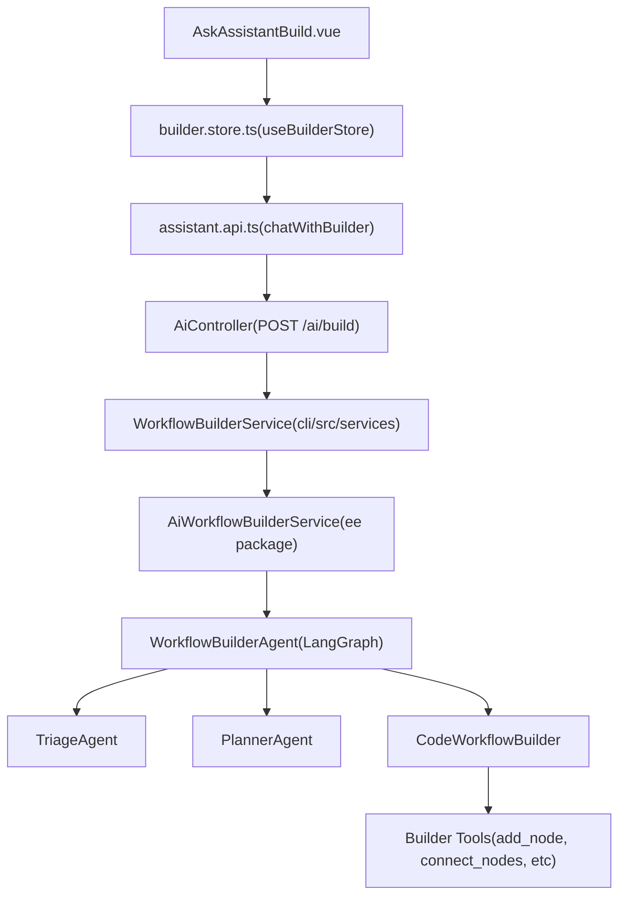

# AI Workflow Builder

Relevant source files

-   [packages/@n8n/ai-workflow-builder.ee/src/ai-workflow-builder-agent.service.ts](https://github.com/n8n-io/n8n/blob/88f170b9/packages/@n8n/ai-workflow-builder.ee/src/ai-workflow-builder-agent.service.ts)
-   [packages/@n8n/ai-workflow-builder.ee/src/assistant/assistant-handler.ts](https://github.com/n8n-io/n8n/blob/88f170b9/packages/@n8n/ai-workflow-builder.ee/src/assistant/assistant-handler.ts)
-   [packages/@n8n/ai-workflow-builder.ee/src/assistant/test/assistant-handler.test.ts](https://github.com/n8n-io/n8n/blob/88f170b9/packages/@n8n/ai-workflow-builder.ee/src/assistant/test/assistant-handler.test.ts)
-   [packages/@n8n/ai-workflow-builder.ee/src/code-builder/triage.agent.ts](https://github.com/n8n-io/n8n/blob/88f170b9/packages/@n8n/ai-workflow-builder.ee/src/code-builder/triage.agent.ts)
-   [packages/@n8n/ai-workflow-builder.ee/src/constants.ts](https://github.com/n8n-io/n8n/blob/88f170b9/packages/@n8n/ai-workflow-builder.ee/src/constants.ts)
-   [packages/@n8n/ai-workflow-builder.ee/src/session-manager.service.ts](https://github.com/n8n-io/n8n/blob/88f170b9/packages/@n8n/ai-workflow-builder.ee/src/session-manager.service.ts)
-   [packages/@n8n/ai-workflow-builder.ee/src/subgraphs/builder.subgraph.ts](https://github.com/n8n-io/n8n/blob/88f170b9/packages/@n8n/ai-workflow-builder.ee/src/subgraphs/builder.subgraph.ts)
-   [packages/@n8n/ai-workflow-builder.ee/src/test/ai-workflow-builder-agent.service.test.ts](https://github.com/n8n-io/n8n/blob/88f170b9/packages/@n8n/ai-workflow-builder.ee/src/test/ai-workflow-builder-agent.service.test.ts)
-   [packages/@n8n/ai-workflow-builder.ee/src/test/session-manager.service.test.ts](https://github.com/n8n-io/n8n/blob/88f170b9/packages/@n8n/ai-workflow-builder.ee/src/test/session-manager.service.test.ts)
-   [packages/@n8n/ai-workflow-builder.ee/src/test/workflow-builder-agent.test.ts](https://github.com/n8n-io/n8n/blob/88f170b9/packages/@n8n/ai-workflow-builder.ee/src/test/workflow-builder-agent.test.ts)
-   [packages/@n8n/ai-workflow-builder.ee/src/tools/builder-tools.ts](https://github.com/n8n-io/n8n/blob/88f170b9/packages/@n8n/ai-workflow-builder.ee/src/tools/builder-tools.ts)
-   [packages/@n8n/ai-workflow-builder.ee/src/tools/helpers/state.ts](https://github.com/n8n-io/n8n/blob/88f170b9/packages/@n8n/ai-workflow-builder.ee/src/tools/helpers/state.ts)
-   [packages/@n8n/ai-workflow-builder.ee/src/tools/remove-connection.tool.ts](https://github.com/n8n-io/n8n/blob/88f170b9/packages/@n8n/ai-workflow-builder.ee/src/tools/remove-connection.tool.ts)
-   [packages/@n8n/ai-workflow-builder.ee/src/tools/rename-node.tool.ts](https://github.com/n8n-io/n8n/blob/88f170b9/packages/@n8n/ai-workflow-builder.ee/src/tools/rename-node.tool.ts)
-   [packages/@n8n/ai-workflow-builder.ee/src/tools/test/builder-tools.test.ts](https://github.com/n8n-io/n8n/blob/88f170b9/packages/@n8n/ai-workflow-builder.ee/src/tools/test/builder-tools.test.ts)
-   [packages/@n8n/ai-workflow-builder.ee/src/tools/test/remove-connection.tool.test.ts](https://github.com/n8n-io/n8n/blob/88f170b9/packages/@n8n/ai-workflow-builder.ee/src/tools/test/remove-connection.tool.test.ts)
-   [packages/@n8n/ai-workflow-builder.ee/src/tools/test/rename-node.tool.test.ts](https://github.com/n8n-io/n8n/blob/88f170b9/packages/@n8n/ai-workflow-builder.ee/src/tools/test/rename-node.tool.test.ts)
-   [packages/@n8n/ai-workflow-builder.ee/src/types/streaming.ts](https://github.com/n8n-io/n8n/blob/88f170b9/packages/@n8n/ai-workflow-builder.ee/src/types/streaming.ts)
-   [packages/@n8n/ai-workflow-builder.ee/src/types/tools.ts](https://github.com/n8n-io/n8n/blob/88f170b9/packages/@n8n/ai-workflow-builder.ee/src/types/tools.ts)
-   [packages/@n8n/ai-workflow-builder.ee/src/types/workflow.ts](https://github.com/n8n-io/n8n/blob/88f170b9/packages/@n8n/ai-workflow-builder.ee/src/types/workflow.ts)
-   [packages/@n8n/ai-workflow-builder.ee/src/utils/error-sanitizer.ts](https://github.com/n8n-io/n8n/blob/88f170b9/packages/@n8n/ai-workflow-builder.ee/src/utils/error-sanitizer.ts)
-   [packages/@n8n/ai-workflow-builder.ee/src/utils/operations-processor.ts](https://github.com/n8n-io/n8n/blob/88f170b9/packages/@n8n/ai-workflow-builder.ee/src/utils/operations-processor.ts)
-   [packages/@n8n/ai-workflow-builder.ee/src/utils/stream-processor.ts](https://github.com/n8n-io/n8n/blob/88f170b9/packages/@n8n/ai-workflow-builder.ee/src/utils/stream-processor.ts)
-   [packages/@n8n/ai-workflow-builder.ee/src/utils/test/error-sanitizer.test.ts](https://github.com/n8n-io/n8n/blob/88f170b9/packages/@n8n/ai-workflow-builder.ee/src/utils/test/error-sanitizer.test.ts)
-   [packages/@n8n/ai-workflow-builder.ee/src/utils/test/operations-processor.test.ts](https://github.com/n8n-io/n8n/blob/88f170b9/packages/@n8n/ai-workflow-builder.ee/src/utils/test/operations-processor.test.ts)
-   [packages/@n8n/ai-workflow-builder.ee/src/utils/test/stream-processor.test.ts](https://github.com/n8n-io/n8n/blob/88f170b9/packages/@n8n/ai-workflow-builder.ee/src/utils/test/stream-processor.test.ts)
-   [packages/@n8n/ai-workflow-builder.ee/src/utils/test/tool-executor.test.ts](https://github.com/n8n-io/n8n/blob/88f170b9/packages/@n8n/ai-workflow-builder.ee/src/utils/test/tool-executor.test.ts)
-   [packages/@n8n/ai-workflow-builder.ee/src/utils/token-usage.ts](https://github.com/n8n-io/n8n/blob/88f170b9/packages/@n8n/ai-workflow-builder.ee/src/utils/token-usage.ts)
-   [packages/@n8n/ai-workflow-builder.ee/src/workflow-builder-agent.ts](https://github.com/n8n-io/n8n/blob/88f170b9/packages/@n8n/ai-workflow-builder.ee/src/workflow-builder-agent.ts)
-   [packages/@n8n/ai-workflow-builder.ee/src/workflow-state.ts](https://github.com/n8n-io/n8n/blob/88f170b9/packages/@n8n/ai-workflow-builder.ee/src/workflow-state.ts)
-   [packages/@n8n/api-types/src/dto/ai/\_\_tests\_\_/ai-build-request.dto.test.ts](https://github.com/n8n-io/n8n/blob/88f170b9/packages/@n8n/api-types/src/dto/ai/__tests__/ai-build-request.dto.test.ts)
-   [packages/@n8n/api-types/src/dto/ai/ai-build-request.dto.ts](https://github.com/n8n-io/n8n/blob/88f170b9/packages/@n8n/api-types/src/dto/ai/ai-build-request.dto.ts)
-   [packages/@n8n/api-types/src/dto/index.ts](https://github.com/n8n-io/n8n/blob/88f170b9/packages/@n8n/api-types/src/dto/index.ts)
-   [packages/cli/src/controllers/\_\_tests\_\_/ai.controller.test.ts](https://github.com/n8n-io/n8n/blob/88f170b9/packages/cli/src/controllers/__tests__/ai.controller.test.ts)
-   [packages/cli/src/controllers/ai.controller.ts](https://github.com/n8n-io/n8n/blob/88f170b9/packages/cli/src/controllers/ai.controller.ts)
-   [packages/cli/src/services/\_\_tests\_\_/ai-workflow-builder.service.test.ts](https://github.com/n8n-io/n8n/blob/88f170b9/packages/cli/src/services/__tests__/ai-workflow-builder.service.test.ts)
-   [packages/cli/src/services/\_\_tests\_\_/ai.service.test.ts](https://github.com/n8n-io/n8n/blob/88f170b9/packages/cli/src/services/__tests__/ai.service.test.ts)
-   [packages/cli/src/services/ai-workflow-builder.service.ts](https://github.com/n8n-io/n8n/blob/88f170b9/packages/cli/src/services/ai-workflow-builder.service.ts)
-   [packages/cli/src/services/ai.service.ts](https://github.com/n8n-io/n8n/blob/88f170b9/packages/cli/src/services/ai.service.ts)
-   [packages/frontend/@n8n/design-system/src/components/AskAssistantChat/messages/MessageWrapper.vue](https://github.com/n8n-io/n8n/blob/88f170b9/packages/frontend/@n8n/design-system/src/components/AskAssistantChat/messages/MessageWrapper.vue)
-   [packages/frontend/@n8n/design-system/src/components/AskAssistantChat/messages/TextMessage.test.ts](https://github.com/n8n-io/n8n/blob/88f170b9/packages/frontend/@n8n/design-system/src/components/AskAssistantChat/messages/TextMessage.test.ts)
-   [packages/frontend/@n8n/design-system/src/components/CodeDiff/CodeDiff.vue](https://github.com/n8n-io/n8n/blob/88f170b9/packages/frontend/@n8n/design-system/src/components/CodeDiff/CodeDiff.vue)
-   [packages/frontend/@n8n/design-system/src/components/CodeDiff/\_\_snapshots\_\_/CodeDiff.test.ts.snap](https://github.com/n8n-io/n8n/blob/88f170b9/packages/frontend/@n8n/design-system/src/components/CodeDiff/__snapshots__/CodeDiff.test.ts.snap)
-   [packages/frontend/@n8n/design-system/src/types/assistant.ts](https://github.com/n8n-io/n8n/blob/88f170b9/packages/frontend/@n8n/design-system/src/types/assistant.ts)
-   [packages/frontend/editor-ui/src/app/constants/workflowSuggestions.ts](https://github.com/n8n-io/n8n/blob/88f170b9/packages/frontend/editor-ui/src/app/constants/workflowSuggestions.ts)
-   [packages/frontend/editor-ui/src/features/ai/assistant/assistant.api.test.ts](https://github.com/n8n-io/n8n/blob/88f170b9/packages/frontend/editor-ui/src/features/ai/assistant/assistant.api.test.ts)
-   [packages/frontend/editor-ui/src/features/ai/assistant/assistant.api.ts](https://github.com/n8n-io/n8n/blob/88f170b9/packages/frontend/editor-ui/src/features/ai/assistant/assistant.api.ts)
-   [packages/frontend/editor-ui/src/features/ai/assistant/assistant.store.test.ts](https://github.com/n8n-io/n8n/blob/88f170b9/packages/frontend/editor-ui/src/features/ai/assistant/assistant.store.test.ts)
-   [packages/frontend/editor-ui/src/features/ai/assistant/assistant.store.ts](https://github.com/n8n-io/n8n/blob/88f170b9/packages/frontend/editor-ui/src/features/ai/assistant/assistant.store.ts)
-   [packages/frontend/editor-ui/src/features/ai/assistant/assistant.types.ts](https://github.com/n8n-io/n8n/blob/88f170b9/packages/frontend/editor-ui/src/features/ai/assistant/assistant.types.ts)
-   [packages/frontend/editor-ui/src/features/ai/assistant/builder.store.test.ts](https://github.com/n8n-io/n8n/blob/88f170b9/packages/frontend/editor-ui/src/features/ai/assistant/builder.store.test.ts)
-   [packages/frontend/editor-ui/src/features/ai/assistant/builder.store.ts](https://github.com/n8n-io/n8n/blob/88f170b9/packages/frontend/editor-ui/src/features/ai/assistant/builder.store.ts)
-   [packages/frontend/editor-ui/src/features/ai/assistant/builder.utils.test.ts](https://github.com/n8n-io/n8n/blob/88f170b9/packages/frontend/editor-ui/src/features/ai/assistant/builder.utils.test.ts)
-   [packages/frontend/editor-ui/src/features/ai/assistant/builder.utils.ts](https://github.com/n8n-io/n8n/blob/88f170b9/packages/frontend/editor-ui/src/features/ai/assistant/builder.utils.ts)
-   [packages/frontend/editor-ui/src/features/ai/assistant/chatPanel.store.test.ts](https://github.com/n8n-io/n8n/blob/88f170b9/packages/frontend/editor-ui/src/features/ai/assistant/chatPanel.store.test.ts)
-   [packages/frontend/editor-ui/src/features/ai/assistant/chatPanel.store.ts](https://github.com/n8n-io/n8n/blob/88f170b9/packages/frontend/editor-ui/src/features/ai/assistant/chatPanel.store.ts)
-   [packages/frontend/editor-ui/src/features/ai/assistant/components/Agent/AskAssistantBuild.test.ts](https://github.com/n8n-io/n8n/blob/88f170b9/packages/frontend/editor-ui/src/features/ai/assistant/components/Agent/AskAssistantBuild.test.ts)
-   [packages/frontend/editor-ui/src/features/ai/assistant/components/Agent/AskAssistantBuild.vue](https://github.com/n8n-io/n8n/blob/88f170b9/packages/frontend/editor-ui/src/features/ai/assistant/components/Agent/AskAssistantBuild.vue)
-   [packages/frontend/editor-ui/src/features/ai/assistant/components/Agent/BuildModeEmptyState.vue](https://github.com/n8n-io/n8n/blob/88f170b9/packages/frontend/editor-ui/src/features/ai/assistant/components/Agent/BuildModeEmptyState.vue)
-   [packages/frontend/editor-ui/src/features/ai/assistant/components/Chat/AskAssistantChat.vue](https://github.com/n8n-io/n8n/blob/88f170b9/packages/frontend/editor-ui/src/features/ai/assistant/components/Chat/AskAssistantChat.vue)
-   [packages/frontend/editor-ui/src/features/ai/assistant/components/FocusedNodes/ChatInputWithMention.vue](https://github.com/n8n-io/n8n/blob/88f170b9/packages/frontend/editor-ui/src/features/ai/assistant/components/FocusedNodes/ChatInputWithMention.vue)
-   [packages/frontend/editor-ui/src/features/ai/assistant/components/FocusedNodes/FocusedNodeChip.vue](https://github.com/n8n-io/n8n/blob/88f170b9/packages/frontend/editor-ui/src/features/ai/assistant/components/FocusedNodes/FocusedNodeChip.vue)
-   [packages/frontend/editor-ui/src/features/ai/assistant/composables/useAIAssistantHelpers.ts](https://github.com/n8n-io/n8n/blob/88f170b9/packages/frontend/editor-ui/src/features/ai/assistant/composables/useAIAssistantHelpers.ts)
-   [packages/frontend/editor-ui/src/features/ai/assistant/composables/useAskModeCoachmark.ts](https://github.com/n8n-io/n8n/blob/88f170b9/packages/frontend/editor-ui/src/features/ai/assistant/composables/useAskModeCoachmark.ts)
-   [packages/frontend/editor-ui/src/features/ai/assistant/composables/useBuilderMessages.ts](https://github.com/n8n-io/n8n/blob/88f170b9/packages/frontend/editor-ui/src/features/ai/assistant/composables/useBuilderMessages.ts)
-   [packages/frontend/editor-ui/src/features/ai/assistant/composables/useBuilderTodos.test.ts](https://github.com/n8n-io/n8n/blob/88f170b9/packages/frontend/editor-ui/src/features/ai/assistant/composables/useBuilderTodos.test.ts)
-   [packages/frontend/editor-ui/src/features/ai/assistant/composables/useBuilderTodos.ts](https://github.com/n8n-io/n8n/blob/88f170b9/packages/frontend/editor-ui/src/features/ai/assistant/composables/useBuilderTodos.ts)
-   [packages/frontend/editor-ui/src/features/ai/assistant/composables/useCodeDiff.ts](https://github.com/n8n-io/n8n/blob/88f170b9/packages/frontend/editor-ui/src/features/ai/assistant/composables/useCodeDiff.ts)
-   [packages/frontend/editor-ui/src/features/ai/assistant/composables/useFocusedNodesChipUI.ts](https://github.com/n8n-io/n8n/blob/88f170b9/packages/frontend/editor-ui/src/features/ai/assistant/composables/useFocusedNodesChipUI.ts)
-   [packages/frontend/editor-ui/src/features/ai/assistant/composables/useNodeMention.test.ts](https://github.com/n8n-io/n8n/blob/88f170b9/packages/frontend/editor-ui/src/features/ai/assistant/composables/useNodeMention.test.ts)
-   [packages/frontend/editor-ui/src/features/ai/assistant/composables/useNodeMention.ts](https://github.com/n8n-io/n8n/blob/88f170b9/packages/frontend/editor-ui/src/features/ai/assistant/composables/useNodeMention.ts)
-   [packages/frontend/editor-ui/src/features/ai/assistant/focusedNodes.store.ts](https://github.com/n8n-io/n8n/blob/88f170b9/packages/frontend/editor-ui/src/features/ai/assistant/focusedNodes.store.ts)
-   [packages/frontend/editor-ui/src/features/ndv/parameters/components/ButtonParameter/ButtonParameter.test.ts](https://github.com/n8n-io/n8n/blob/88f170b9/packages/frontend/editor-ui/src/features/ndv/parameters/components/ButtonParameter/ButtonParameter.test.ts)
-   [packages/frontend/editor-ui/src/features/ndv/parameters/utils/buttonParameter.utils.test.ts](https://github.com/n8n-io/n8n/blob/88f170b9/packages/frontend/editor-ui/src/features/ndv/parameters/utils/buttonParameter.utils.test.ts)
-   [packages/frontend/editor-ui/src/features/ndv/parameters/utils/buttonParameter.utils.ts](https://github.com/n8n-io/n8n/blob/88f170b9/packages/frontend/editor-ui/src/features/ndv/parameters/utils/buttonParameter.utils.ts)
-   [packages/frontend/editor-ui/src/features/shared/editors/components/CodeNodeEditor/AskAI/AskAI.vue](https://github.com/n8n-io/n8n/blob/88f170b9/packages/frontend/editor-ui/src/features/shared/editors/components/CodeNodeEditor/AskAI/AskAI.vue)

The AI Workflow Builder is an AI-assisted system that allows users to create and modify workflows using natural language. It is implemented as a multi-agent system in the `@n8n/ai-workflow-builder.ee` package, which integrates with the n8n backend to provide a conversational interface for workflow construction.

---

## System Architecture

The system follows a layered architecture where the frontend Pinia store communicates with a dedicated AI controller in the CLI package. This controller delegates to a service that manages the multi-agent LangGraph workflow.

### Multi-Agent Architecture

The core of the generation logic resides in `WorkflowBuilderAgent`. It uses a multi-agent graph (via LangGraph) to triage requests, plan changes, and execute node operations.

**Diagram: AI Builder System Components and Code Entities**

Sources: [packages/cli/src/controllers/ai.controller.ts34-53](https://github.com/n8n-io/n8n/blob/88f170b9/packages/cli/src/controllers/ai.controller.ts#L34-L53) [packages/cli/src/services/ai-workflow-builder.service.ts34-51](https://github.com/n8n-io/n8n/blob/88f170b9/packages/cli/src/services/ai-workflow-builder.service.ts#L34-L51) [packages/@n8n/ai-workflow-builder.ee/src/workflow-builder-agent.ts152-167](https://github.com/n8n-io/n8n/blob/88f170b9/packages/@n8n/ai-workflow-builder.ee/src/workflow-builder-agent.ts#L152-L167) [packages/frontend/editor-ui/src/features/ai/assistant/builder.store.ts154-169](https://github.com/n8n-io/n8n/blob/88f170b9/packages/frontend/editor-ui/src/features/ai/assistant/builder.store.ts#L154-L169)

---

## WorkflowBuilderAgent

The `WorkflowBuilderAgent` is the central coordinator for AI-driven workflow edits. It supports two primary modes: a legacy multi-agent system and the newer `CodeWorkflowBuilder`.

### Core Configuration

The agent is configured with `StageLLMs`, which maps specific LLM instances to roles like `supervisor`, `planner`, and `builder`.

| Stage | Role |
| --- | --- |
| `supervisor` | Orchestrates transitions between agent nodes in the graph. |
| `planner` | Generates a structured plan before any edits are made (Plan Mode). |
| `builder` | Responsible for generating the final workflow JSON or code snippets. |
| `parameterUpdater` | Specialized in refining node parameters based on context. |

Sources: [packages/@n8n/ai-workflow-builder.ee/src/workflow-builder-agent.ts66-73](https://github.com/n8n-io/n8n/blob/88f170b9/packages/@n8n/ai-workflow-builder.ee/src/workflow-builder-agent.ts#L66-L73) [packages/@n8n/ai-workflow-builder.ee/src/workflow-builder-agent.ts168-180](https://github.com/n8n-io/n8n/blob/88f170b9/packages/@n8n/ai-workflow-builder.ee/src/workflow-builder-agent.ts#L168-L180)

### Chat Execution Flow

The `chat()` method is an async generator that streams `StreamEvent` objects (containing messages or workflow updates) back to the client.

1.  **Validation**: Ensures the prompt length does not exceed `MAX_AI_BUILDER_PROMPT_LENGTH`.
2.  **Session Loading**: Retrieves or initializes the `CodeBuilderSession` using `loadCodeBuilderSession`.
3.  **Triage**: If `mergeAskBuild` is enabled, the `TriageAgent` determines if the request is a "build" request or a general "ask" query.
4.  **Execution**: Depending on the `mode` ('build' or 'plan') and feature flags, it either executes the multi-agent graph or the `CodeWorkflowBuilder`.

Sources: [packages/@n8n/ai-workflow-builder.ee/src/workflow-builder-agent.ts208-250](https://github.com/n8n-io/n8n/blob/88f170b9/packages/@n8n/ai-workflow-builder.ee/src/workflow-builder-agent.ts#L208-L250) [packages/@n8n/ai-workflow-builder.ee/src/workflow-builder-agent.ts255-290](https://github.com/n8n-io/n8n/blob/88f170b9/packages/@n8n/ai-workflow-builder.ee/src/workflow-builder-agent.ts#L255-L290)

---

## Frontend Implementation

The frontend is built around the `builder.store.ts` and the `AskAssistantBuild.vue` component.

### builder.store.ts

This Pinia store manages the conversational state, credits, and the streaming lifecycle.

-   **State Management**: Tracks `chatMessages`, `streaming` status, and `creditsQuota`.
-   **Telemetry**: Emits `WorkflowBuilderJourney` events for user interactions like clicking "Implement Plan" or reverting versions.
-   **Context Preparation**: `createBuilderPayload` gathers the current workflow JSON, execution schema, and focused node context to send to the backend.

Sources: [packages/frontend/editor-ui/src/features/ai/assistant/builder.store.ts154-192](https://github.com/n8n-io/n8n/blob/88f170b9/packages/frontend/editor-ui/src/features/ai/assistant/builder.store.ts#L154-L192) [packages/frontend/editor-ui/src/features/ai/assistant/builder.store.ts68-93](https://github.com/n8n-io/n8n/blob/88f170b9/packages/frontend/editor-ui/src/features/ai/assistant/builder.store.ts#L68-L93)

### AskAssistantBuild.vue

The UI component that renders the AI chat sidebar. It handles:

-   **Workflow Updates**: Watches for messages of type `workflow-updated` and applies them to the canvas via `useWorkflowUpdate`.
-   **Plan Display**: Renders `PlanDisplayMessage.vue` when the AI provides a proposed plan.
-   **HITL (Human-In-The-Loop)**: Renders questions from the AI using `PlanQuestionsMessage.vue` and sends user answers back.

Sources: [packages/frontend/editor-ui/src/features/ai/assistant/components/Agent/AskAssistantBuild.vue99-118](https://github.com/n8n-io/n8n/blob/88f170b9/packages/frontend/editor-ui/src/features/ai/assistant/components/Agent/AskAssistantBuild.vue#L99-L118) [packages/frontend/editor-ui/src/features/ai/assistant/components/Agent/AskAssistantBuild.vue152-164](https://github.com/n8n-io/n8n/blob/88f170b9/packages/frontend/editor-ui/src/features/ai/assistant/components/Agent/AskAssistantBuild.vue#L152-L164)

---

## Data Flow: Prompt to Canvas

The following diagram bridges the natural language space (user input) to the code entity space (node updates).

**Diagram: Natural Language to Node Entity Mapping**

> **[Mermaid sequence]**
> *(图表结构无法解析)*

Sources: [packages/cli/src/controllers/ai.controller.ts62-83](https://github.com/n8n-io/n8n/blob/88f170b9/packages/cli/src/controllers/ai.controller.ts#L62-L83) [packages/frontend/editor-ui/src/features/ai/assistant/builder.store.ts550-570](https://github.com/n8n-io/n8n/blob/88f170b9/packages/frontend/editor-ui/src/features/ai/assistant/builder.store.ts#L550-L570) [packages/@n8n/ai-workflow-builder.ee/src/workflow-builder-agent.ts120-150](https://github.com/n8n-io/n8n/blob/88f170b9/packages/@n8n/ai-workflow-builder.ee/src/workflow-builder-agent.ts#L120-L150)

---

## Tooling and Node Operations

The AI builder interacts with the workflow through a set of specialized tools defined in the EE package. These tools allow the LLM to perform structural and parametric changes.

| Tool Name | Implementation Function | Purpose |
| --- | --- | --- |
| `add_node` | `createAddNodeTool` | Inserts a new node of a specific type into the workflow. |
| `connect_nodes` | `createConnectNodesTool` | Creates a connection between two existing nodes. |
| `update_node_parameters` | `createUpdateNodeParametersTool` | Modifies the parameters (e.g., URL, JSON body) of a node. |
| `remove_node` | `createRemoveNodeTool` | Deletes a node from the workflow. |
| `node_search` | `createNodeSearchTool` | Allows the AI to search for available node types and their descriptions. |

Sources: [packages/@n8n/ai-workflow-builder.ee/src/test/workflow-builder-agent.test.ts10-32](https://github.com/n8n-io/n8n/blob/88f170b9/packages/@n8n/ai-workflow-builder.ee/src/test/workflow-builder-agent.test.ts#L10-L32) [packages/@n8n/ai-workflow-builder.ee/src/workflow-builder-agent.ts75-78](https://github.com/n8n-io/n8n/blob/88f170b9/packages/@n8n/ai-workflow-builder.ee/src/workflow-builder-agent.ts#L75-L78)

---

## Session and Credit Management

### Session Persistence

Sessions can be persisted to the database if the `ai.persistBuilderSessions` configuration is enabled. The `WorkflowBuilderSessionRepository` handles the storage of LangGraph thread states and code builder sessions.

Sources: [packages/cli/src/services/ai-workflow-builder.service.ts152-154](https://github.com/n8n-io/n8n/blob/88f170b9/packages/cli/src/services/ai-workflow-builder.service.ts#L152-L154) [packages/@n8n/ai-workflow-builder.ee/src/code-builder/utils/code-builder-session.ts28-33](https://github.com/n8n-io/n8n/blob/88f170b9/packages/@n8n/ai-workflow-builder.ee/src/code-builder/utils/code-builder-session.ts#L28-L33)

### Credits and Quotas

n8n tracks AI usage through a credit system.

1.  The `AiUsageService` on the backend monitors consumption.
2.  The `AiWorkflowBuilderService` receives updates via `onCreditsUpdated`.
3.  The `Push` service sends `updateBuilderCredits` events to the frontend.
4.  The frontend displays a `CreditWarningBanner` when credits are low.

Sources: [packages/cli/src/services/ai-workflow-builder.service.ts101-112](https://github.com/n8n-io/n8n/blob/88f170b9/packages/cli/src/services/ai-workflow-builder.service.ts#L101-L112) [packages/frontend/editor-ui/src/features/ai/assistant/builder.store.ts164-169](https://github.com/n8n-io/n8n/blob/88f170b9/packages/frontend/editor-ui/src/features/ai/assistant/builder.store.ts#L164-L169)
