# Chat Hub Backend System

Relevant source files

-   [packages/@n8n/api-types/src/chat-hub.ts](https://github.com/n8n-io/n8n/blob/88f170b9/packages/@n8n/api-types/src/chat-hub.ts)
-   [packages/@n8n/api-types/src/index.ts](https://github.com/n8n-io/n8n/blob/88f170b9/packages/@n8n/api-types/src/index.ts)
-   [packages/cli/src/modules/chat-hub/\_\_tests\_\_/chat-hub.service.integration.test.ts](https://github.com/n8n-io/n8n/blob/88f170b9/packages/cli/src/modules/chat-hub/__tests__/chat-hub.service.integration.test.ts)
-   [packages/cli/src/modules/chat-hub/chat-hub-agent.repository.ts](https://github.com/n8n-io/n8n/blob/88f170b9/packages/cli/src/modules/chat-hub/chat-hub-agent.repository.ts)
-   [packages/cli/src/modules/chat-hub/chat-hub-message.entity.ts](https://github.com/n8n-io/n8n/blob/88f170b9/packages/cli/src/modules/chat-hub/chat-hub-message.entity.ts)
-   [packages/cli/src/modules/chat-hub/chat-hub-session.entity.ts](https://github.com/n8n-io/n8n/blob/88f170b9/packages/cli/src/modules/chat-hub/chat-hub-session.entity.ts)
-   [packages/cli/src/modules/chat-hub/chat-hub-workflow.service.ts](https://github.com/n8n-io/n8n/blob/88f170b9/packages/cli/src/modules/chat-hub/chat-hub-workflow.service.ts)
-   [packages/cli/src/modules/chat-hub/chat-hub.constants.ts](https://github.com/n8n-io/n8n/blob/88f170b9/packages/cli/src/modules/chat-hub/chat-hub.constants.ts)
-   [packages/cli/src/modules/chat-hub/chat-hub.controller.ts](https://github.com/n8n-io/n8n/blob/88f170b9/packages/cli/src/modules/chat-hub/chat-hub.controller.ts)
-   [packages/cli/src/modules/chat-hub/chat-hub.service.ts](https://github.com/n8n-io/n8n/blob/88f170b9/packages/cli/src/modules/chat-hub/chat-hub.service.ts)
-   [packages/cli/src/modules/chat-hub/chat-hub.types.ts](https://github.com/n8n-io/n8n/blob/88f170b9/packages/cli/src/modules/chat-hub/chat-hub.types.ts)
-   [packages/cli/src/modules/chat-hub/chat-message.repository.ts](https://github.com/n8n-io/n8n/blob/88f170b9/packages/cli/src/modules/chat-hub/chat-message.repository.ts)
-   [packages/cli/src/modules/chat-hub/chat-session.repository.ts](https://github.com/n8n-io/n8n/blob/88f170b9/packages/cli/src/modules/chat-hub/chat-session.repository.ts)
-   [packages/cli/src/modules/chat-hub/context-limits.ts](https://github.com/n8n-io/n8n/blob/88f170b9/packages/cli/src/modules/chat-hub/context-limits.ts)
-   [packages/frontend/editor-ui/src/features/ai/chatHub/ChatView.vue](https://github.com/n8n-io/n8n/blob/88f170b9/packages/frontend/editor-ui/src/features/ai/chatHub/ChatView.vue)
-   [packages/frontend/editor-ui/src/features/ai/chatHub/chat.api.ts](https://github.com/n8n-io/n8n/blob/88f170b9/packages/frontend/editor-ui/src/features/ai/chatHub/chat.api.ts)
-   [packages/frontend/editor-ui/src/features/ai/chatHub/chat.store.ts](https://github.com/n8n-io/n8n/blob/88f170b9/packages/frontend/editor-ui/src/features/ai/chatHub/chat.store.ts)
-   [packages/frontend/editor-ui/src/features/ai/chatHub/chat.types.ts](https://github.com/n8n-io/n8n/blob/88f170b9/packages/frontend/editor-ui/src/features/ai/chatHub/chat.types.ts)
-   [packages/frontend/editor-ui/src/features/ai/chatHub/chat.utils.ts](https://github.com/n8n-io/n8n/blob/88f170b9/packages/frontend/editor-ui/src/features/ai/chatHub/chat.utils.ts)
-   [packages/frontend/editor-ui/src/features/ai/chatHub/components/AgentEditorModal.vue](https://github.com/n8n-io/n8n/blob/88f170b9/packages/frontend/editor-ui/src/features/ai/chatHub/components/AgentEditorModal.vue)
-   [packages/frontend/editor-ui/src/features/ai/chatHub/components/ChatAgentCard.vue](https://github.com/n8n-io/n8n/blob/88f170b9/packages/frontend/editor-ui/src/features/ai/chatHub/components/ChatAgentCard.vue)
-   [packages/frontend/editor-ui/src/features/ai/chatHub/components/ChatConversationHeader.vue](https://github.com/n8n-io/n8n/blob/88f170b9/packages/frontend/editor-ui/src/features/ai/chatHub/components/ChatConversationHeader.vue)
-   [packages/frontend/editor-ui/src/features/ai/chatHub/components/ChatMessage.vue](https://github.com/n8n-io/n8n/blob/88f170b9/packages/frontend/editor-ui/src/features/ai/chatHub/components/ChatMessage.vue)
-   [packages/frontend/editor-ui/src/features/ai/chatHub/components/ChatPrompt.vue](https://github.com/n8n-io/n8n/blob/88f170b9/packages/frontend/editor-ui/src/features/ai/chatHub/components/ChatPrompt.vue)
-   [packages/frontend/editor-ui/src/features/ai/chatHub/components/ChatSessionMenuItem.vue](https://github.com/n8n-io/n8n/blob/88f170b9/packages/frontend/editor-ui/src/features/ai/chatHub/components/ChatSessionMenuItem.vue)
-   [packages/frontend/editor-ui/src/features/ai/chatHub/components/ChatSidebarContent.vue](https://github.com/n8n-io/n8n/blob/88f170b9/packages/frontend/editor-ui/src/features/ai/chatHub/components/ChatSidebarContent.vue)
-   [packages/frontend/editor-ui/src/features/ai/chatHub/components/ModelSelector.vue](https://github.com/n8n-io/n8n/blob/88f170b9/packages/frontend/editor-ui/src/features/ai/chatHub/components/ModelSelector.vue)
-   [packages/frontend/editor-ui/src/features/ai/chatHub/constants.ts](https://github.com/n8n-io/n8n/blob/88f170b9/packages/frontend/editor-ui/src/features/ai/chatHub/constants.ts)

This document covers the backend system for n8n's Chat Hub feature, which provides conversational AI capabilities through dynamic workflow generation and execution. The backend is responsible for managing chat sessions, orchestrating LLM interactions, building temporary workflows, and streaming responses via WebSocket.

For information about the Chat Hub frontend interface, see [Chat Hub Frontend and User Interface](https://github.com/n8n-io/n8n/blob/88f170b9/Chat Hub Frontend and User Interface) For details on AI agent execution and tool calling, see [AI Agent and Tool Execution](https://github.com/n8n-io/n8n/blob/88f170b9/AI Agent and Tool Execution)

---

## System Overview

The Chat Hub backend enables conversational AI by dynamically generating and executing n8n workflows for each chat interaction. Rather than requiring users to manually build workflows, the system automatically constructs workflow graphs that include chat triggers, LLM nodes, memory management, and tool integrations based on the conversation context.

**Key Responsibilities:**

-   **Session Management**: Create and track chat sessions with message history via `ChatHubSessionRepository`.
-   **Workflow Generation**: Build temporary workflows for each chat interaction using `ChatHubWorkflowService`.
-   **Execution Orchestration**: Run workflows and manage their lifecycle via `ChatHubExecutionService`.
-   **Streaming**: Stream LLM responses via `ChatStreamService` using WebSocket push events.
-   **Model Management**: Fetch available models from multiple LLM providers using `ChatHubModelsService`.
-   **Agent & Tool Support**: Manage custom agents and configurable tools via `ChatHubAgentService` and `ChatHubToolService`.

Sources: [packages/cli/src/modules/chat-hub/chat-hub.service.ts54-73](https://github.com/n8n-io/n8n/blob/88f170b9/packages/cli/src/modules/chat-hub/chat-hub.service.ts#L54-L73) [packages/cli/src/modules/chat-hub/chat-hub-workflow.service.ts82-96](https://github.com/n8n-io/n8n/blob/88f170b9/packages/cli/src/modules/chat-hub/chat-hub-workflow.service.ts#L82-L96)

---

## Core Architecture

### Component Diagram

```mermaid
flowchart TD
    Controller["ChatHubControllerpackages/cli/src/modules/chat-hub/chat-hub.controller.ts"]
    Service["ChatHubServicepackages/cli/src/modules/chat-hub/chat-hub.service.ts"]
    WorkflowSvc["ChatHubWorkflowServicepackages/cli/src/modules/chat-hub/chat-hub-workflow.service.ts"]
    ExecSvc["ChatHubExecutionServicepackages/cli/src/modules/chat-hub/chat-hub-execution.service.ts"]
    StreamSvc["ChatStreamServicepackages/cli/src/modules/chat-hub/chat-stream.service.ts"]
    ModelsSvc["ChatHubModelsServicepackages/cli/src/modules/chat-hub/chat-hub.models.service.ts"]
    AgentSvc["ChatHubAgentServicepackages/cli/src/modules/chat-hub/chat-hub-agent.service.ts"]
    ToolSvc["ChatHubToolServicepackages/cli/src/modules/chat-hub/chat-hub-tool.service.ts"]
    TitleSvc["ChatHubTitleServicepackages/cli/src/modules/chat-hub/chat-hub-title.service.ts"]
    AttachSvc["ChatHubAttachmentServicepackages/cli/src/modules/chat-hub/chat-hub.attachment.service.ts"]
    SessionRepo["ChatHubSessionRepositorypackages/cli/src/modules/chat-hub/chat-session.repository.ts"]
    MessageRepo["ChatHubMessageRepositorypackages/cli/src/modules/chat-hub/chat-message.repository.ts"]
    WorkflowRepo["WorkflowRepository"]

    Controller --> Service
    Service --> WorkflowSvc
    Service --> ExecSvc
    Service --> StreamSvc
    Service --> ModelsSvc
    Service --> AgentSvc
    Service --> ToolSvc
    WorkflowSvc --> ToolSvc
    WorkflowSvc --> WorkflowRepo
    ExecSvc --> StreamSvc
    Service --> SessionRepo
    Service --> MessageRepo
```

Sources: [packages/cli/src/modules/chat-hub/chat-hub.service.ts54-73](https://github.com/n8n-io/n8n/blob/88f170b9/packages/cli/src/modules/chat-hub/chat-hub.service.ts#L54-L73) [packages/cli/src/modules/chat-hub/chat-hub-workflow.service.ts82-96](https://github.com/n8n-io/n8n/blob/88f170b9/packages/cli/src/modules/chat-hub/chat-hub-workflow.service.ts#L82-L96) [packages/cli/src/modules/chat-hub/chat-hub.controller.ts58-65](https://github.com/n8n-io/n8n/blob/88f170b9/packages/cli/src/modules/chat-hub/chat-hub.controller.ts#L58-L65)

### Primary Components

| Component | Responsibility | Key Methods |
| --- | --- | --- |
| `ChatHubService` | Main orchestrator for chat operations | `sendHumanMessage()`, `stopGeneration()`, `getConversations()` |
| `ChatHubWorkflowService` | Builds dynamic workflows for chat | `createChatWorkflow()`, `buildChatWorkflow()`, `deleteChatWorkflow()` |
| `ChatHubExecutionService` | Manages workflow execution lifecycle | `executeChatWorkflowWithCleanup()`, `resumeChatExecution()`, `stop()` |
| `ChatStreamService` | Handles real-time streaming via WebSocket | `sendHumanMessage()`, `streamChunk()`, `sendEnd()` |
| `ChatHubModelsService` | Manages available LLM models | `getModels()`, `fetchModelsForProvider()` |

Sources: [packages/cli/src/modules/chat-hub/chat-hub.service.ts435](https://github.com/n8n-io/n8n/blob/88f170b9/packages/cli/src/modules/chat-hub/chat-hub.service.ts#L435-L435) [packages/cli/src/modules/chat-hub/chat-hub-workflow.service.ts104](https://github.com/n8n-io/n8n/blob/88f170b9/packages/cli/src/modules/chat-hub/chat-hub-workflow.service.ts#L104-L104) [packages/cli/src/modules/chat-hub/chat-hub.controller.ts58-65](https://github.com/n8n-io/n8n/blob/88f170b9/packages/cli/src/modules/chat-hub/chat-hub.controller.ts#L58-L65)

---

## Message Flow and Execution Pipeline

### End-to-End Message Flow

1.  **Request**: The `ChatHubController` receives a message via `POST /chat/conversations/send`.
2.  **Persistence**: `ChatHubService` creates or retrieves a `ChatHubSession` and saves the user's message in `ChatHubMessageRepository`.
3.  **Workflow Preparation**: `ChatHubWorkflowService` generates a temporary workflow containing a `CHAT_TRIGGER_NODE_TYPE` and an `AGENT_LANGCHAIN_NODE_TYPE`.
4.  **Execution**: `ChatHubExecutionService` triggers the workflow execution.
5.  **Streaming**: As the LLM generates tokens, `ChatStreamService` broadcasts `chatHubStreamChunk` events via the Push service.
6.  **Completion**: Upon completion, the AI message status is updated to `success`, and the temporary workflow is deleted.

Sources: [packages/cli/src/modules/chat-hub/chat-hub.service.ts435-580](https://github.com/n8n-io/n8n/blob/88f170b9/packages/cli/src/modules/chat-hub/chat-hub.service.ts#L435-L580) [packages/cli/src/modules/chat-hub/chat-hub-workflow.service.ts125-177](https://github.com/n8n-io/n8n/blob/88f170b9/packages/cli/src/modules/chat-hub/chat-hub-workflow.service.ts#L125-L177) [packages/cli/src/modules/chat-hub/chat-hub.controller.ts150-168](https://github.com/n8n-io/n8n/blob/88f170b9/packages/cli/src/modules/chat-hub/chat-hub.controller.ts#L150-L168)

### Execution Modes

The system supports two primary session types:

-   **Production**: Uses published workflows and is intended for end-user chat interactions.
-   **Manual**: Triggered from the workflow canvas (e.g., via `sendMessageManual`). This mode allows developers to test chat interactions with unpublished workflow versions.

Sources: [packages/cli/src/modules/chat-hub/chat-hub.service.ts208-217](https://github.com/n8n-io/n8n/blob/88f170b9/packages/cli/src/modules/chat-hub/chat-hub.service.ts#L208-L217) [packages/cli/src/modules/chat-hub/chat-hub.controller.ts175-203](https://github.com/n8n-io/n8n/blob/88f170b9/packages/cli/src/modules/chat-hub/chat-hub.controller.ts#L175-L203)

---

## Dynamic Workflow Generation

The Chat Hub generates temporary workflows on-the-fly to handle chat logic. This allows n8n to leverage its existing node-based execution engine for AI interactions.

### Workflow Structure

A typical generated chat workflow includes:

-   **Chat Trigger**: `When chat message received` ([packages/cli/src/modules/chat-hub/chat-hub.constants.ts99](https://github.com/n8n-io/n8n/blob/88f170b9/packages/cli/src/modules/chat-hub/chat-hub.constants.ts#L99-L99))
-   **AI Agent**: `AI Agent` node using `AGENT_LANGCHAIN_NODE_TYPE` ([packages/cli/src/modules/chat-hub/chat-hub-workflow.service.ts30](https://github.com/n8n-io/n8n/blob/88f170b9/packages/cli/src/modules/chat-hub/chat-hub-workflow.service.ts#L30-L30))
-   **Model**: A provider-specific chat model node (e.g., `lmChatOpenAi`).
-   **Memory**: `Memory Manager` using `MEMORY_MANAGER_NODE_TYPE` ([packages/cli/src/modules/chat-hub/chat-hub-workflow.service.ts41](https://github.com/n8n-io/n8n/blob/88f170b9/packages/cli/src/modules/chat-hub/chat-hub-workflow.service.ts#L41-L41))
-   **Tools**: Dynamic tool nodes based on the agent or session configuration.

### Model Mapping

The system maps `ChatHubLLMProvider` types to specific n8n node types:

| Provider | Node Type | Version |
| --- | --- | --- |
| `openai` | `@n8n/n8n-nodes-langchain.lmChatOpenAi` | 1.3 |
| `anthropic` | `@n8n/n8n-nodes-langchain.lmChatAnthropic` | 1.3 |
| `google` | `@n8n/n8n-nodes-langchain.lmChatGoogleGemini` | 1.2 |
| `ollama` | `@n8n/n8n-nodes-langchain.lmChatOllama` | 1.0 |

Sources: [packages/cli/src/modules/chat-hub/chat-hub.constants.ts39-96](https://github.com/n8n-io/n8n/blob/88f170b9/packages/cli/src/modules/chat-hub/chat-hub.constants.ts#L39-L96)

---

## Session and Message Persistence

### Database Entities

-   **ChatHubSession**: Represents a conversation thread. It stores the owner, title, and the model configuration (provider, model ID, or custom agent ID).
-   **ChatHubMessage**: Represents an individual message in a session.
    -   `type`: `human` or `ai`.
    -   `status`: `running`, `success`, `error`, `cancelled`, or `waiting`.
    -   `executionId`: Links the message to a specific n8n workflow execution.

Sources: [packages/cli/src/modules/chat-hub/chat-hub-session.entity.ts1-100](https://github.com/n8n-io/n8n/blob/88f170b9/packages/cli/src/modules/chat-hub/chat-hub-session.entity.ts#L1-L100) [packages/cli/src/modules/chat-hub/chat-hub-message.entity.ts1-120](https://github.com/n8n-io/n8n/blob/88f170b9/packages/cli/src/modules/chat-hub/chat-hub-message.entity.ts#L1-L120)

### HITL and Waiting States

If a workflow execution hits a node that requires user interaction (e.g., a Chat node in "Response" mode), the message status is set to `waiting`. The `ChatHubService.tryResumeWaitingExecution` function handles resuming these executions when the user provides subsequent input.

Sources: [packages/cli/src/modules/chat-hub/chat-hub.service.ts112-160](https://github.com/n8n-io/n8n/blob/88f170b9/packages/cli/src/modules/chat-hub/chat-hub.service.ts#L112-L160)

---

## Context and Model Limits

The system manages context window limits to ensure LLM stability. `getMaxContextWindowTokens` retrieves the maximum allowed tokens for a specific model. If a model is unknown, it defaults to `DEFAULT_CONTEXT_WINDOW_LENGTH` (typically 4096).

Sources: [packages/cli/src/modules/chat-hub/context-limits.ts1-50](https://github.com/n8n-io/n8n/blob/88f170b9/packages/cli/src/modules/chat-hub/context-limits.ts#L1-L50) [packages/cli/src/modules/chat-hub/chat-hub-workflow.service.ts11-15](https://github.com/n8n-io/n8n/blob/88f170b9/packages/cli/src/modules/chat-hub/chat-hub-workflow.service.ts#L11-L15)

---

## API Endpoints

The `ChatHubController` exposes several key endpoints for the frontend:

-   `POST /chat/models`: Returns available LLM models and custom agents.
-   `GET /chat/conversations`: Retrieves a list of chat sessions for the authenticated user.
-   `POST /chat/conversations/send`: Sends a new message in production mode.
-   `POST /chat/conversations/manual/:workflowId/send`: Sends a message in manual (canvas) mode.
-   `GET /chat/conversations/:sessionId/messages/:messageId/attachments/:index`: Downloads files associated with a message.

Sources: [packages/cli/src/modules/chat-hub/chat-hub.controller.ts67-203](https://github.com/n8n-io/n8n/blob/88f170b9/packages/cli/src/modules/chat-hub/chat-hub.controller.ts#L67-L203)

---

## Title Generation

When a new session starts, `ChatHubTitleService` generates a title based on the initial message. It creates a lightweight workflow with a specific prompt (e.g., "Generate a concise title...") and executes it asynchronously.

Sources: [packages/cli/src/modules/chat-hub/chat-hub-title.service.ts1-100](https://github.com/n8n-io/n8n/blob/88f170b9/packages/cli/src/modules/chat-hub/chat-hub-title.service.ts#L1-L100) [packages/cli/src/modules/chat-hub/chat-hub-workflow.service.ts179-224](https://github.com/n8n-io/n8n/blob/88f170b9/packages/cli/src/modules/chat-hub/chat-hub-workflow.service.ts#L179-L224)
