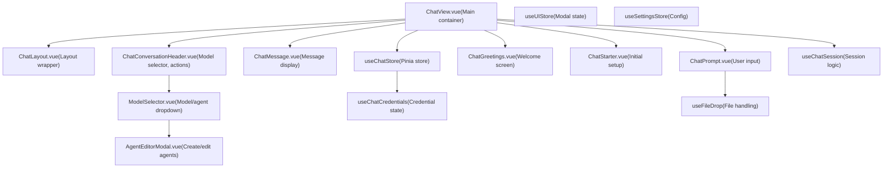
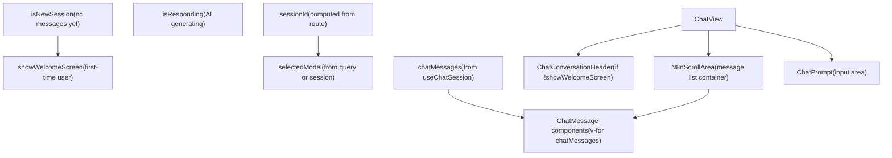
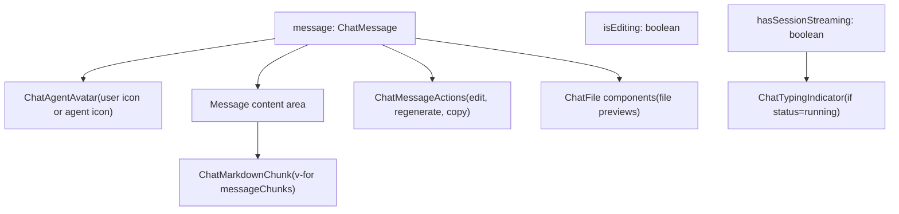

# Chat Hub Frontend and User Interface

Relevant source files

-   [packages/@n8n/api-types/src/chat-hub.ts](https://github.com/n8n-io/n8n/blob/88f170b9/packages/@n8n/api-types/src/chat-hub.ts)
-   [packages/@n8n/api-types/src/index.ts](https://github.com/n8n-io/n8n/blob/88f170b9/packages/@n8n/api-types/src/index.ts)
-   [packages/cli/src/modules/chat-hub/\_\_tests\_\_/chat-hub.service.integration.test.ts](https://github.com/n8n-io/n8n/blob/88f170b9/packages/cli/src/modules/chat-hub/__tests__/chat-hub.service.integration.test.ts)
-   [packages/cli/src/modules/chat-hub/chat-hub-agent.repository.ts](https://github.com/n8n-io/n8n/blob/88f170b9/packages/cli/src/modules/chat-hub/chat-hub-agent.repository.ts)
-   [packages/cli/src/modules/chat-hub/chat-hub-message.entity.ts](https://github.com/n8n-io/n8n/blob/88f170b9/packages/cli/src/modules/chat-hub/chat-hub-message.entity.ts)
-   [packages/cli/src/modules/chat-hub/chat-hub-session.entity.ts](https://github.com/n8n-io/n8n/blob/88f170b9/packages/cli/src/modules/chat-hub/chat-hub-session.entity.ts)
-   [packages/cli/src/modules/chat-hub/chat-hub-workflow.service.ts](https://github.com/n8n-io/n8n/blob/88f170b9/packages/cli/src/modules/chat-hub/chat-hub-workflow.service.ts)
-   [packages/cli/src/modules/chat-hub/chat-hub.constants.ts](https://github.com/n8n-io/n8n/blob/88f170b9/packages/cli/src/modules/chat-hub/chat-hub.constants.ts)
-   [packages/cli/src/modules/chat-hub/chat-hub.controller.ts](https://github.com/n8n-io/n8n/blob/88f170b9/packages/cli/src/modules/chat-hub/chat-hub.controller.ts)
-   [packages/cli/src/modules/chat-hub/chat-hub.service.ts](https://github.com/n8n-io/n8n/blob/88f170b9/packages/cli/src/modules/chat-hub/chat-hub.service.ts)
-   [packages/cli/src/modules/chat-hub/chat-hub.types.ts](https://github.com/n8n-io/n8n/blob/88f170b9/packages/cli/src/modules/chat-hub/chat-hub.types.ts)
-   [packages/cli/src/modules/chat-hub/chat-message.repository.ts](https://github.com/n8n-io/n8n/blob/88f170b9/packages/cli/src/modules/chat-hub/chat-message.repository.ts)
-   [packages/cli/src/modules/chat-hub/chat-session.repository.ts](https://github.com/n8n-io/n8n/blob/88f170b9/packages/cli/src/modules/chat-hub/chat-session.repository.ts)
-   [packages/cli/src/modules/chat-hub/context-limits.ts](https://github.com/n8n-io/n8n/blob/88f170b9/packages/cli/src/modules/chat-hub/context-limits.ts)
-   [packages/frontend/@n8n/design-system/src/components/AskAssistantChat/AskAssistantChat.test.ts](https://github.com/n8n-io/n8n/blob/88f170b9/packages/frontend/@n8n/design-system/src/components/AskAssistantChat/AskAssistantChat.test.ts)
-   [packages/frontend/@n8n/design-system/src/components/AskAssistantChat/AskAssistantChat.vue](https://github.com/n8n-io/n8n/blob/88f170b9/packages/frontend/@n8n/design-system/src/components/AskAssistantChat/AskAssistantChat.vue)
-   [packages/frontend/@n8n/design-system/src/components/AskAssistantChat/\_\_snapshots\_\_/AskAssistantChat.test.ts.snap](https://github.com/n8n-io/n8n/blob/88f170b9/packages/frontend/@n8n/design-system/src/components/AskAssistantChat/__snapshots__/AskAssistantChat.test.ts.snap)
-   [packages/frontend/@n8n/design-system/src/components/AskAssistantChat/messages/BaseMessage.vue](https://github.com/n8n-io/n8n/blob/88f170b9/packages/frontend/@n8n/design-system/src/components/AskAssistantChat/messages/BaseMessage.vue)
-   [packages/frontend/@n8n/design-system/src/components/AskAssistantChat/messages/ErrorMessage.vue](https://github.com/n8n-io/n8n/blob/88f170b9/packages/frontend/@n8n/design-system/src/components/AskAssistantChat/messages/ErrorMessage.vue)
-   [packages/frontend/@n8n/design-system/src/components/AskAssistantChat/messages/MessageRating.test.ts](https://github.com/n8n-io/n8n/blob/88f170b9/packages/frontend/@n8n/design-system/src/components/AskAssistantChat/messages/MessageRating.test.ts)
-   [packages/frontend/@n8n/design-system/src/components/AskAssistantChat/messages/MessageRating.vue](https://github.com/n8n-io/n8n/blob/88f170b9/packages/frontend/@n8n/design-system/src/components/AskAssistantChat/messages/MessageRating.vue)
-   [packages/frontend/@n8n/design-system/src/components/AskAssistantChat/messages/ThinkingMessage.vue](https://github.com/n8n-io/n8n/blob/88f170b9/packages/frontend/@n8n/design-system/src/components/AskAssistantChat/messages/ThinkingMessage.vue)
-   [packages/frontend/@n8n/design-system/src/components/AskAssistantChat/messages/\_\_snapshots\_\_/MessageRating.test.ts.snap](https://github.com/n8n-io/n8n/blob/88f170b9/packages/frontend/@n8n/design-system/src/components/AskAssistantChat/messages/__snapshots__/MessageRating.test.ts.snap)
-   [packages/frontend/@n8n/design-system/src/components/AskAssistantChat/messages/helpers.ts](https://github.com/n8n-io/n8n/blob/88f170b9/packages/frontend/@n8n/design-system/src/components/AskAssistantChat/messages/helpers.ts)
-   [packages/frontend/@n8n/design-system/src/components/N8nPromptInput/N8nPromptInput.test.ts](https://github.com/n8n-io/n8n/blob/88f170b9/packages/frontend/@n8n/design-system/src/components/N8nPromptInput/N8nPromptInput.test.ts)
-   [packages/frontend/@n8n/design-system/src/components/N8nPromptInput/N8nPromptInput.vue](https://github.com/n8n-io/n8n/blob/88f170b9/packages/frontend/@n8n/design-system/src/components/N8nPromptInput/N8nPromptInput.vue)
-   [packages/frontend/@n8n/design-system/src/components/N8nPromptInput/\_\_snapshots\_\_/N8nPromptInput.test.ts.snap](https://github.com/n8n-io/n8n/blob/88f170b9/packages/frontend/@n8n/design-system/src/components/N8nPromptInput/__snapshots__/N8nPromptInput.test.ts.snap)
-   [packages/frontend/@n8n/design-system/src/components/N8nSticky/Sticky.test.ts](https://github.com/n8n-io/n8n/blob/88f170b9/packages/frontend/@n8n/design-system/src/components/N8nSticky/Sticky.test.ts)
-   [packages/frontend/@n8n/design-system/src/components/N8nSticky/Sticky.vue](https://github.com/n8n-io/n8n/blob/88f170b9/packages/frontend/@n8n/design-system/src/components/N8nSticky/Sticky.vue)
-   [packages/frontend/@n8n/design-system/src/utils/colorUtils.test.ts](https://github.com/n8n-io/n8n/blob/88f170b9/packages/frontend/@n8n/design-system/src/utils/colorUtils.test.ts)
-   [packages/frontend/@n8n/design-system/src/utils/colorUtils.ts](https://github.com/n8n-io/n8n/blob/88f170b9/packages/frontend/@n8n/design-system/src/utils/colorUtils.ts)
-   [packages/frontend/@n8n/design-system/src/utils/index.ts](https://github.com/n8n-io/n8n/blob/88f170b9/packages/frontend/@n8n/design-system/src/utils/index.ts)
-   [packages/frontend/editor-ui/src/features/ai/assistant/components/Agent/CreditWarningBanner.vue](https://github.com/n8n-io/n8n/blob/88f170b9/packages/frontend/editor-ui/src/features/ai/assistant/components/Agent/CreditWarningBanner.vue)
-   [packages/frontend/editor-ui/src/features/ai/assistant/components/Agent/CreditsSettingsDropdown.vue](https://github.com/n8n-io/n8n/blob/88f170b9/packages/frontend/editor-ui/src/features/ai/assistant/components/Agent/CreditsSettingsDropdown.vue)
-   [packages/frontend/editor-ui/src/features/ai/assistant/composables/useBuilderMessages.test.ts](https://github.com/n8n-io/n8n/blob/88f170b9/packages/frontend/editor-ui/src/features/ai/assistant/composables/useBuilderMessages.test.ts)
-   [packages/frontend/editor-ui/src/features/ai/chatHub/ChatView.vue](https://github.com/n8n-io/n8n/blob/88f170b9/packages/frontend/editor-ui/src/features/ai/chatHub/ChatView.vue)
-   [packages/frontend/editor-ui/src/features/ai/chatHub/chat.api.ts](https://github.com/n8n-io/n8n/blob/88f170b9/packages/frontend/editor-ui/src/features/ai/chatHub/chat.api.ts)
-   [packages/frontend/editor-ui/src/features/ai/chatHub/chat.store.ts](https://github.com/n8n-io/n8n/blob/88f170b9/packages/frontend/editor-ui/src/features/ai/chatHub/chat.store.ts)
-   [packages/frontend/editor-ui/src/features/ai/chatHub/chat.types.ts](https://github.com/n8n-io/n8n/blob/88f170b9/packages/frontend/editor-ui/src/features/ai/chatHub/chat.types.ts)
-   [packages/frontend/editor-ui/src/features/ai/chatHub/chat.utils.ts](https://github.com/n8n-io/n8n/blob/88f170b9/packages/frontend/editor-ui/src/features/ai/chatHub/chat.utils.ts)
-   [packages/frontend/editor-ui/src/features/ai/chatHub/components/AgentEditorModal.vue](https://github.com/n8n-io/n8n/blob/88f170b9/packages/frontend/editor-ui/src/features/ai/chatHub/components/AgentEditorModal.vue)
-   [packages/frontend/editor-ui/src/features/ai/chatHub/components/ChatAgentCard.vue](https://github.com/n8n-io/n8n/blob/88f170b9/packages/frontend/editor-ui/src/features/ai/chatHub/components/ChatAgentCard.vue)
-   [packages/frontend/editor-ui/src/features/ai/chatHub/components/ChatConversationHeader.vue](https://github.com/n8n-io/n8n/blob/88f170b9/packages/frontend/editor-ui/src/features/ai/chatHub/components/ChatConversationHeader.vue)
-   [packages/frontend/editor-ui/src/features/ai/chatHub/components/ChatMessage.vue](https://github.com/n8n-io/n8n/blob/88f170b9/packages/frontend/editor-ui/src/features/ai/chatHub/components/ChatMessage.vue)
-   [packages/frontend/editor-ui/src/features/ai/chatHub/components/ChatPrompt.vue](https://github.com/n8n-io/n8n/blob/88f170b9/packages/frontend/editor-ui/src/features/ai/chatHub/components/ChatPrompt.vue)
-   [packages/frontend/editor-ui/src/features/ai/chatHub/components/ChatSessionMenuItem.vue](https://github.com/n8n-io/n8n/blob/88f170b9/packages/frontend/editor-ui/src/features/ai/chatHub/components/ChatSessionMenuItem.vue)
-   [packages/frontend/editor-ui/src/features/ai/chatHub/components/ChatSidebarContent.vue](https://github.com/n8n-io/n8n/blob/88f170b9/packages/frontend/editor-ui/src/features/ai/chatHub/components/ChatSidebarContent.vue)
-   [packages/frontend/editor-ui/src/features/ai/chatHub/components/ModelSelector.vue](https://github.com/n8n-io/n8n/blob/88f170b9/packages/frontend/editor-ui/src/features/ai/chatHub/components/ModelSelector.vue)
-   [packages/frontend/editor-ui/src/features/ai/chatHub/constants.ts](https://github.com/n8n-io/n8n/blob/88f170b9/packages/frontend/editor-ui/src/features/ai/chatHub/constants.ts)
-   [packages/frontend/editor-ui/src/features/workflows/canvas/components/elements/nodes/toolbar/CanvasNodeStickyColorSelector.test.ts](https://github.com/n8n-io/n8n/blob/88f170b9/packages/frontend/editor-ui/src/features/workflows/canvas/components/elements/nodes/toolbar/CanvasNodeStickyColorSelector.test.ts)
-   [packages/frontend/editor-ui/src/features/workflows/canvas/components/elements/nodes/toolbar/CanvasNodeStickyColorSelector.vue](https://github.com/n8n-io/n8n/blob/88f170b9/packages/frontend/editor-ui/src/features/workflows/canvas/components/elements/nodes/toolbar/CanvasNodeStickyColorSelector.vue)

## Purpose and Scope

This document describes the Chat Hub frontend architecture, including UI components, state management, real-time message streaming, and user interactions. The Chat Hub provides a conversational AI interface built with Vue 3, leveraging Pinia for state management and WebSocket push events for real-time updates.

For information about the Chat Hub backend and session management, see [Chat Hub Backend System](/n8n-io/n8n/5.2-chat-hub-backend-system). For details on AI workflow generation and execution, see the backend workflow integration documentation.

---

## Frontend Architecture Overview

The Chat Hub frontend is built using Vue 3 with the Composition API, organized into a set of composable components that manage conversation display, message input, model selection, and agent configuration.

**Frontend Component Architecture**


Sources: [packages/frontend/editor-ui/src/features/ai/chatHub/ChatView.vue1-62](https://github.com/n8n-io/n8n/blob/88f170b9/packages/frontend/editor-ui/src/features/ai/chatHub/ChatView.vue#L1-L62) [packages/frontend/editor-ui/src/features/ai/chatHub/chat.store.ts102-130](https://github.com/n8n-io/n8n/blob/88f170b9/packages/frontend/editor-ui/src/features/ai/chatHub/chat.store.ts#L102-L130)

---

## Main Chat View Component

The `ChatView.vue` component serves as the primary container for the chat interface, managing conversation state, model selection, and message flow.

**ChatView Component Structure**


Sources: [packages/frontend/editor-ui/src/features/ai/chatHub/ChatView.vue91-212](https://github.com/n8n-io/n8n/blob/88f170b9/packages/frontend/editor-ui/src/features/ai/chatHub/ChatView.vue#L91-L212)

### Session Initialization

The session ID is derived from the route parameter or generated as a new UUID:

```
const sessionId = computed<string>(() =>	typeof route.params.id === 'string' ? route.params.id : uuidv4(),);const isNewSessionOverride = computed(() => sessionId.value !== route.params.id);
```
Sources: [packages/frontend/editor-ui/src/features/ai/chatHub/ChatView.vue91-94](https://github.com/n8n-io/n8n/blob/88f170b9/packages/frontend/editor-ui/src/features/ai/chatHub/ChatView.vue#L91-L94)

### Model Selection

The selected model is determined by a hierarchy of sources:

1.  **Existing session**: Uses the model from `currentConversation` [packages/frontend/editor-ui/src/features/ai/chatHub/ChatView.vue184-193](https://github.com/n8n-io/n8n/blob/88f170b9/packages/frontend/editor-ui/src/features/ai/chatHub/ChatView.vue#L184-L193)
2.  **Query parameters**: Detects `agentId`, `workflowId`, or `provider`/`model` pairs [packages/frontend/editor-ui/src/features/ai/chatHub/ChatView.vue150-180](https://github.com/n8n-io/n8n/blob/88f170b9/packages/frontend/editor-ui/src/features/ai/chatHub/ChatView.vue#L150-L180)
3.  **Default model**: Falls back to the user's last selected model stored in `localStorage` [packages/frontend/editor-ui/src/features/ai/chatHub/ChatView.vue127-144](https://github.com/n8n-io/n8n/blob/88f170b9/packages/frontend/editor-ui/src/features/ai/chatHub/ChatView.vue#L127-L144)

### Message Submission Flow

When a user submits a message, the `ChatView` coordinates with the `ChatStore`:

> **[Mermaid sequence]**
> *(图表结构无法解析)*

Sources: [packages/frontend/editor-ui/src/features/ai/chatHub/ChatView.vue483-511](https://github.com/n8n-io/n8n/blob/88f170b9/packages/frontend/editor-ui/src/features/ai/chatHub/ChatView.vue#L483-L511) [packages/frontend/editor-ui/src/features/ai/chatHub/chat.store.ts579-649](https://github.com/n8n-io/n8n/blob/88f170b9/packages/frontend/editor-ui/src/features/ai/chatHub/chat.store.ts#L579-L649)

---

## Message Display Component

The `ChatMessage.vue` component renders individual messages with support for text, attachments, and code blocks.

**ChatMessage Component Structure**


Sources: [packages/frontend/editor-ui/src/features/ai/chatHub/components/ChatMessage.vue54-66](https://github.com/n8n-io/n8n/blob/88f170b9/packages/frontend/editor-ui/src/features/ai/chatHub/components/ChatMessage.vue#L54-L66)

### Message Content Parsing

Messages are parsed into chunks to handle markdown and special content types like buttons or artifacts:

```
const messageChunks = computed(() =>	message.content.flatMap<ChatMessageContentChunk>((chunk, index, arr) => {		if (chunk.type === 'hidden') return [];		if (chunk.type === 'with-buttons') return [chunk];		if (chunk.type === 'artifact-create' || chunk.type === 'artifact-edit') {			const prev = arr[index - 1];			return prev?.type === chunk.type && prev.command.title === chunk.command.title ? [] : [chunk];		}		return splitMarkdownIntoChunks(chunk.content).flatMap((content) =>			content.trim() === '' ? [] : [{ type: 'text', content }],		);	}),);
```
Sources: [packages/frontend/editor-ui/src/features/ai/chatHub/components/ChatMessage.vue116-148](https://github.com/n8n-io/n8n/blob/88f170b9/packages/frontend/editor-ui/src/features/ai/chatHub/components/ChatMessage.vue#L116-L148)

---

## Chat Input Component

The `ChatPrompt.vue` component provides the message input interface with support for text entry, file attachments, and voice input.

### Voice Input Integration

Speech recognition is integrated using VueUse's `useSpeechRecognition`:

```
const speechInput = useSpeechRecognition({	continuous: true,	interimResults: true,	lang: navigator.language,}); watch(speechInput.result, (spoken) => {	message.value = committedSpokenMessage.value + ' ' + spoken.trimStart();});
```
Sources: [packages/frontend/editor-ui/src/features/ai/chatHub/components/ChatPrompt.vue52-161](https://github.com/n8n-io/n8n/blob/88f170b9/packages/frontend/editor-ui/src/features/ai/chatHub/components/ChatPrompt.vue#L52-L161)

### File Attachment Handling

Files can be attached via button click or drag-and-drop. The `useFileDrop` composable manages these interactions [packages/frontend/editor-ui/src/features/ai/chatHub/composables/useFileDrop.ts](https://github.com/n8n-io/n8n/blob/88f170b9/packages/frontend/editor-ui/src/features/ai/chatHub/composables/useFileDrop.ts) Files are stored as `File` objects before being converted to binary data for transmission [packages/frontend/editor-ui/src/features/ai/chatHub/components/ChatPrompt.vue121-123](https://github.com/n8n-io/n8n/blob/88f170b9/packages/frontend/editor-ui/src/features/ai/chatHub/components/ChatPrompt.vue#L121-L123)

---

## Model and Agent Selection

The `ModelSelector.vue` component provides a dropdown interface for selecting AI models and agents.

### Menu Item Generation

Menu items are generated by `buildModelSelectorMenuItems` utility, which groups models by provider and includes custom agents:

```
const menu = computed(() =>	buildModelSelectorMenuItems(agents, {		includeCustomAgents,		isLoading,		i18n,		settings: settingStore.moduleSettings?.['chat-hub']?.providers ?? {},		credentials,	}),);
```
Sources: [packages/frontend/editor-ui/src/features/ai/chatHub/components/ModelSelector.vue95-103](https://github.com/n8n-io/n8n/blob/88f170b9/packages/frontend/editor-ui/src/features/ai/chatHub/components/ModelSelector.vue#L95-L103)

### Credential Selection

When a provider requires credentials (e.g., OpenAI API key), the `ModelSelector` can trigger the credential selector modal [packages/frontend/editor-ui/src/features/ai/chatHub/components/ModelSelector.vue115-133](https://github.com/n8n-io/n8n/blob/88f170b9/packages/frontend/editor-ui/src/features/ai/chatHub/components/ModelSelector.vue#L115-L133) It uses `PROVIDER_CREDENTIAL_TYPE_MAP` to map providers to their respective n8n credential types [packages/@n8n/api-types/src/chat-hub.ts82-97](https://github.com/n8n-io/n8n/blob/88f170b9/packages/@n8n/api-types/src/chat-hub.ts#L82-L97)

---

## State Management with Pinia

The `useChatStore` manages all chat-related state, including sessions, messages, and streaming state.

### Message Graph Structure

Messages are linked into a graph with `previousMessageId` and `retryOfMessageId` [packages/frontend/editor-ui/src/features/ai/chatHub/chat.store.ts208-271](https://github.com/n8n-io/n8n/blob/88f170b9/packages/frontend/editor-ui/src/features/ai/chatHub/chat.store.ts#L208-L271) This allows for conversation branching and alternative responses.

### Active Message Chain

The active chain represents the currently visible conversation thread, computed by walking back from the latest message to the root [packages/frontend/editor-ui/src/features/ai/chatHub/chat.store.ts171-206](https://github.com/n8n-io/n8n/blob/88f170b9/packages/frontend/editor-ui/src/features/ai/chatHub/chat.store.ts#L171-L206)

---

## Real-Time Message Streaming

The frontend receives streamed AI responses via WebSocket push events. The `ChatStore` handles these events to update message content in real-time.

### Stream Chunk Appending

Chunks are appended to message content using the `appendChunkToParsedMessageItems` utility:

```
// In ChatStoremessage.content = appendChunkToParsedMessageItems(message.content, chunk);
```
Sources: [packages/frontend/editor-ui/src/features/ai/chatHub/chat.store.ts100](https://github.com/n8n-io/n8n/blob/88f170b9/packages/frontend/editor-ui/src/features/ai/chatHub/chat.store.ts#L100-L100) [packages/cli/src/modules/chat-hub/chat-hub.service.ts51](https://github.com/n8n-io/n8n/blob/88f170b9/packages/cli/src/modules/chat-hub/chat-hub.service.ts#L51-L51)

---

## Summary of Key Entities

| Code Entity | Responsibility |
| --- | --- |
| `ChatView.vue` | Main entry point for the chat UI, coordinates session and prompt. |
| `useChatStore` | Pinia store managing sessions, message graphs, and streaming state. |
| `ChatMessage.vue` | Renders individual messages, handling markdown and attachments. |
| `ChatPrompt.vue` | Handles user input, including voice and file attachments. |
| `ModelSelector.vue` | UI for switching between LLM models and custom agents. |
| `ChatHubService` | Backend service that manages sessions and message persistence. |

Sources: [packages/frontend/editor-ui/src/features/ai/chatHub/ChatView.vue1-38](https://github.com/n8n-io/n8n/blob/88f170b9/packages/frontend/editor-ui/src/features/ai/chatHub/ChatView.vue#L1-L38) [packages/frontend/editor-ui/src/features/ai/chatHub/chat.store.ts102-130](https://github.com/n8n-io/n8n/blob/88f170b9/packages/frontend/editor-ui/src/features/ai/chatHub/chat.store.ts#L102-L130) [packages/cli/src/modules/chat-hub/chat-hub.service.ts54-71](https://github.com/n8n-io/n8n/blob/88f170b9/packages/cli/src/modules/chat-hub/chat-hub.service.ts#L54-L71)
