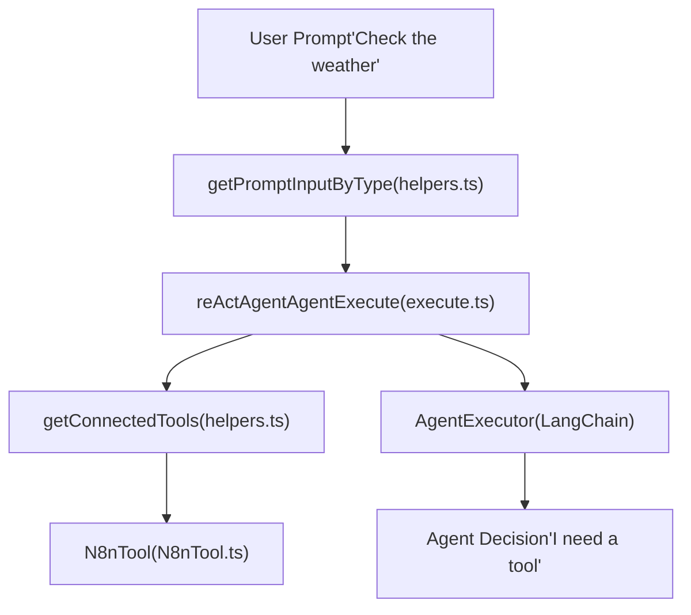

# AI Agent and Tool Execution

Relevant source files

-   [packages/@n8n/nodes-langchain/nodes/agents/Agent/Agent.node.ts](https://github.com/n8n-io/n8n/blob/88f170b9/packages/@n8n/nodes-langchain/nodes/agents/Agent/Agent.node.ts)
-   [packages/@n8n/nodes-langchain/nodes/agents/Agent/agents/ConversationalAgent/description.ts](https://github.com/n8n-io/n8n/blob/88f170b9/packages/@n8n/nodes-langchain/nodes/agents/Agent/agents/ConversationalAgent/description.ts)
-   [packages/@n8n/nodes-langchain/nodes/agents/Agent/agents/ConversationalAgent/execute.ts](https://github.com/n8n-io/n8n/blob/88f170b9/packages/@n8n/nodes-langchain/nodes/agents/Agent/agents/ConversationalAgent/execute.ts)
-   [packages/@n8n/nodes-langchain/nodes/agents/Agent/agents/OpenAiFunctionsAgent/description.ts](https://github.com/n8n-io/n8n/blob/88f170b9/packages/@n8n/nodes-langchain/nodes/agents/Agent/agents/OpenAiFunctionsAgent/description.ts)
-   [packages/@n8n/nodes-langchain/nodes/agents/Agent/agents/OpenAiFunctionsAgent/execute.ts](https://github.com/n8n-io/n8n/blob/88f170b9/packages/@n8n/nodes-langchain/nodes/agents/Agent/agents/OpenAiFunctionsAgent/execute.ts)
-   [packages/@n8n/nodes-langchain/nodes/agents/Agent/agents/PlanAndExecuteAgent/execute.ts](https://github.com/n8n-io/n8n/blob/88f170b9/packages/@n8n/nodes-langchain/nodes/agents/Agent/agents/PlanAndExecuteAgent/execute.ts)
-   [packages/@n8n/nodes-langchain/nodes/agents/Agent/agents/ReActAgent/description.ts](https://github.com/n8n-io/n8n/blob/88f170b9/packages/@n8n/nodes-langchain/nodes/agents/Agent/agents/ReActAgent/description.ts)
-   [packages/@n8n/nodes-langchain/nodes/agents/Agent/agents/ReActAgent/execute.ts](https://github.com/n8n-io/n8n/blob/88f170b9/packages/@n8n/nodes-langchain/nodes/agents/Agent/agents/ReActAgent/execute.ts)
-   [packages/@n8n/nodes-langchain/nodes/agents/Agent/agents/SqlAgent/execute.ts](https://github.com/n8n-io/n8n/blob/88f170b9/packages/@n8n/nodes-langchain/nodes/agents/Agent/agents/SqlAgent/execute.ts)
-   [packages/@n8n/nodes-langchain/nodes/agents/OpenAiAssistant/OpenAiAssistant.node.ts](https://github.com/n8n-io/n8n/blob/88f170b9/packages/@n8n/nodes-langchain/nodes/agents/OpenAiAssistant/OpenAiAssistant.node.ts)
-   [packages/@n8n/nodes-langchain/nodes/chains/ChainLLM/ChainLlm.node.ts](https://github.com/n8n-io/n8n/blob/88f170b9/packages/@n8n/nodes-langchain/nodes/chains/ChainLLM/ChainLlm.node.ts)
-   [packages/@n8n/nodes-langchain/nodes/chains/ChainLLM/methods/config.ts](https://github.com/n8n-io/n8n/blob/88f170b9/packages/@n8n/nodes-langchain/nodes/chains/ChainLLM/methods/config.ts)
-   [packages/@n8n/nodes-langchain/nodes/chains/ChainLLM/methods/types.ts](https://github.com/n8n-io/n8n/blob/88f170b9/packages/@n8n/nodes-langchain/nodes/chains/ChainLLM/methods/types.ts)
-   [packages/@n8n/nodes-langchain/nodes/chains/ChainLLM/test/ChainLlm.node.test.ts](https://github.com/n8n-io/n8n/blob/88f170b9/packages/@n8n/nodes-langchain/nodes/chains/ChainLLM/test/ChainLlm.node.test.ts)
-   [packages/@n8n/nodes-langchain/nodes/chains/ChainLLM/test/config.test.ts](https://github.com/n8n-io/n8n/blob/88f170b9/packages/@n8n/nodes-langchain/nodes/chains/ChainLLM/test/config.test.ts)
-   [packages/@n8n/nodes-langchain/nodes/chains/ChainRetrievalQA/ChainRetrievalQa.node.ts](https://github.com/n8n-io/n8n/blob/88f170b9/packages/@n8n/nodes-langchain/nodes/chains/ChainRetrievalQA/ChainRetrievalQa.node.ts)
-   [packages/@n8n/nodes-langchain/nodes/chains/ChainRetrievalQA/test/ChainRetrievalQa.node.test.ts](https://github.com/n8n-io/n8n/blob/88f170b9/packages/@n8n/nodes-langchain/nodes/chains/ChainRetrievalQA/test/ChainRetrievalQa.node.test.ts)
-   [packages/@n8n/nodes-langchain/nodes/chains/ChainSummarization/V2/ChainSummarizationV2.node.ts](https://github.com/n8n-io/n8n/blob/88f170b9/packages/@n8n/nodes-langchain/nodes/chains/ChainSummarization/V2/ChainSummarizationV2.node.ts)
-   [packages/@n8n/nodes-langchain/nodes/chains/InformationExtractor/InformationExtractor.node.ts](https://github.com/n8n-io/n8n/blob/88f170b9/packages/@n8n/nodes-langchain/nodes/chains/InformationExtractor/InformationExtractor.node.ts)
-   [packages/@n8n/nodes-langchain/nodes/chains/InformationExtractor/processItem.ts](https://github.com/n8n-io/n8n/blob/88f170b9/packages/@n8n/nodes-langchain/nodes/chains/InformationExtractor/processItem.ts)
-   [packages/@n8n/nodes-langchain/nodes/chains/InformationExtractor/test/InformationExtraction.node.test.ts](https://github.com/n8n-io/n8n/blob/88f170b9/packages/@n8n/nodes-langchain/nodes/chains/InformationExtractor/test/InformationExtraction.node.test.ts)
-   [packages/@n8n/nodes-langchain/nodes/chains/InformationExtractor/test/processItem.test.ts](https://github.com/n8n-io/n8n/blob/88f170b9/packages/@n8n/nodes-langchain/nodes/chains/InformationExtractor/test/processItem.test.ts)
-   [packages/@n8n/nodes-langchain/nodes/chains/SentimentAnalysis/SentimentAnalysis.node.ts](https://github.com/n8n-io/n8n/blob/88f170b9/packages/@n8n/nodes-langchain/nodes/chains/SentimentAnalysis/SentimentAnalysis.node.ts)
-   [packages/@n8n/nodes-langchain/nodes/chains/TextClassifier/TextClassifier.node.ts](https://github.com/n8n-io/n8n/blob/88f170b9/packages/@n8n/nodes-langchain/nodes/chains/TextClassifier/TextClassifier.node.ts)
-   [packages/@n8n/nodes-langchain/nodes/chains/TextClassifier/processItem.ts](https://github.com/n8n-io/n8n/blob/88f170b9/packages/@n8n/nodes-langchain/nodes/chains/TextClassifier/processItem.ts)
-   [packages/@n8n/nodes-langchain/nodes/chains/TextClassifier/test/TextClassifier.node.test.ts](https://github.com/n8n-io/n8n/blob/88f170b9/packages/@n8n/nodes-langchain/nodes/chains/TextClassifier/test/TextClassifier.node.test.ts)
-   [packages/@n8n/nodes-langchain/nodes/chains/TextClassifier/test/processItem.test.ts](https://github.com/n8n-io/n8n/blob/88f170b9/packages/@n8n/nodes-langchain/nodes/chains/TextClassifier/test/processItem.test.ts)
-   [packages/@n8n/nodes-langchain/nodes/output\_parser/OutputParserStructured/OutputParserStructured.node.ts](https://github.com/n8n-io/n8n/blob/88f170b9/packages/@n8n/nodes-langchain/nodes/output_parser/OutputParserStructured/OutputParserStructured.node.ts)
-   [packages/@n8n/nodes-langchain/utils/descriptions.ts](https://github.com/n8n-io/n8n/blob/88f170b9/packages/@n8n/nodes-langchain/utils/descriptions.ts)
-   [packages/@n8n/nodes-langchain/utils/helpers.ts](https://github.com/n8n-io/n8n/blob/88f170b9/packages/@n8n/nodes-langchain/utils/helpers.ts)
-   [packages/@n8n/nodes-langchain/utils/schemaParsing.ts](https://github.com/n8n-io/n8n/blob/88f170b9/packages/@n8n/nodes-langchain/utils/schemaParsing.ts)
-   [packages/@n8n/nodes-langchain/utils/tests/helpers.test.ts](https://github.com/n8n-io/n8n/blob/88f170b9/packages/@n8n/nodes-langchain/utils/tests/helpers.test.ts)

This document explains how n8n's AI Agent nodes execute, including tool calling, memory integration, structured output parsing, and the runtime execution flow. It covers the implementation of various agent types (ReAct, Conversational, SQL) and how they bridge natural language prompts to code-level tool execution.

---

## Overview

The AI Agent system in n8n is built on top of LangChain and custom n8n logic. Agent nodes (primarily `Agent.node.ts`) act as "Root Nodes" that orchestrate multiple sub-nodes:

-   **Language Models**: Connected via `AiLanguageModel` to provide reasoning.
-   **Tools**: Connected via `AiTool` to provide external capabilities.
-   **Memory**: Connected via `AiMemory` to maintain conversation state.
-   **Output Parsers**: Connected via `AiOutputParser` to structure responses.

**Sources:** [\`packages/@n8n/nodes-langchain/nodes/agents/Agent/Agent.node.ts8-78](https://github.com/n8n-io/n8n/blob/88f170b9/`packages/@n8n/nodes-langchain/nodes/agents/Agent/Agent.node.ts#L8-L78) [\`packages/@n8n/nodes-langchain/utils/helpers.ts154-198](https://github.com/n8n-io/n8n/blob/88f170b9/`packages/@n8n/nodes-langchain/utils/helpers.ts#L154-L198)

---

## Agent Execution Architecture

### Node Implementation and Versions

The AI Agent node is a versioned node. As of version 3.1, it supports multiple agent types including Tools Agent, ReAct, and Conversational.

| Class / Function | File Path | Role |
| --- | --- | --- |
| `Agent` | `Agent.node.ts` | Main entry point for the versioned AI Agent node. |
| `reActAgentAgentExecute` | `ReActAgent/execute.ts` | Implements the ReAct (Reasoning and Acting) logic. |
| `conversationalAgentExecute` | `ConversationalAgent/execute.ts` | Implements memory-aware conversational agents. |
| `sqlAgentAgentExecute` | `SqlAgent/execute.ts` | Specialized agent for SQL database interactions. |

**Sources:** [\`packages/@n8n/nodes-langchain/nodes/agents/Agent/Agent.node.ts56-74](https://github.com/n8n-io/n8n/blob/88f170b9/`packages/@n8n/nodes-langchain/nodes/agents/Agent/Agent.node.ts#L56-L74) [\`packages/@n8n/nodes-langchain/nodes/agents/Agent/agents/ReActAgent/execute.ts20-130](https://github.com/n8n-io/n8n/blob/88f170b9/`packages/@n8n/nodes-langchain/nodes/agents/Agent/agents/ReActAgent/execute.ts#L20-L130)

### Natural Language to Code Entity Mapping

The following diagram shows how high-level agent concepts map to specific classes and functions in the codebase.

**Sources:** [\`packages/@n8n/nodes-langchain/nodes/agents/Agent/agents/ReActAgent/execute.ts30-111](https://github.com/n8n-io/n8n/blob/88f170b9/`packages/@n8n/nodes-langchain/nodes/agents/Agent/agents/ReActAgent/execute.ts#L30-L111) [\`packages/@n8n/nodes-langchain/utils/helpers.ts17-50](https://github.com/n8n-io/n8n/blob/88f170b9/`packages/@n8n/nodes-langchain/utils/helpers.ts#L17-L50)

---

## Tool Execution and Integration

### Tool Discovery and Wrapping

Tools in n8n are either dedicated tool nodes or regular nodes exposed as tools. The `getConnectedTools` helper retrieves these from the `AiTool` connection.

1.  **Input Retrieval**: Uses `ctx.getInputConnectionData(NodeConnectionTypes.AiTool, 0)`.
2.  **Metadata Injection**: Tools are tagged with `isFromToolkit` and `sourceNodeName`.
3.  **Normalization**: `normalizeToolSchema` converts JSON schemas to Zod schemas using `convertJsonSchemaToZod` to ensure compatibility with LangChain.

**Sources:** [\`packages/@n8n/nodes-langchain/utils/helpers.ts142-198](https://github.com/n8n-io/n8n/blob/88f170b9/`packages/@n8n/nodes-langchain/utils/helpers.ts#L142-L198) [\`packages/@n8n/nodes-langchain/utils/schemaParsing.ts1-50](https://github.com/n8n-io/n8n/blob/88f170b9/`packages/@n8n/nodes-langchain/utils/schemaParsing.ts#L1-L50)

### SQL Agent Execution Flow

The SQL Agent is a specialized implementation that bridges natural language to database queries while enforcing security.

> **[Mermaid sequence]**
> *(图表结构无法解析)*

**Sources:** [\`packages/@n8n/nodes-langchain/nodes/agents/Agent/agents/SqlAgent/execute.ts55-208](https://github.com/n8n-io/n8n/blob/88f170b9/`packages/@n8n/nodes-langchain/nodes/agents/Agent/agents/SqlAgent/execute.ts#L55-L208) [\`packages/@n8n/nodes-langchain/nodes/agents/Agent/agents/SqlAgent/execute.ts31-53](https://github.com/n8n-io/n8n/blob/88f170b9/`packages/@n8n/nodes-langchain/nodes/agents/Agent/agents/SqlAgent/execute.ts#L31-L53)

---

## Memory and Context Management

### Session ID Resolution

Agents use a `sessionId` to retrieve chat history from memory nodes. The `getSessionId` helper handles resolution:

-   **Auto Mode**: Tries to extract `sessionId` from `chatInput` (Chat Trigger) or `bodyData` (Webhooks).
-   **Manual Mode**: Uses a user-defined expression or static key.

**Sources:** [\`packages/@n8n/nodes-langchain/utils/helpers.ts52-105](https://github.com/n8n-io/n8n/blob/88f170b9/`packages/@n8n/nodes-langchain/utils/helpers.ts#L52-L105)

### Chat History Serialization

Before sending history to the LLM, the `serializeChatHistory` function converts LangChain `BaseMessage` objects into a string format:

-   `HumanMessage` → `Human: ...`
-   `AIMessage` → `Assistant: ...`

**Sources:** [\`packages/@n8n/nodes-langchain/utils/helpers.ts107-119](https://github.com/n8n-io/n8n/blob/88f170b9/`packages/@n8n/nodes-langchain/utils/helpers.ts#L107-L119)

---

## Structured Output and Data Extraction

### Structured Output Parser

The `OutputParserStructured` node allows agents or chains to return data in a specific JSON format. It supports:

-   **Schema Generation**: `generateSchemaFromExample` creates a Zod schema from a JSON snippet.
-   **Auto-Fixing**: If the LLM returns invalid JSON, `N8nOutputFixingParser` triggers a second LLM call to fix the formatting.

**Sources:** [\`packages/@n8n/nodes-langchain/nodes/output\_parser/OutputParserStructured/OutputParserStructured.node.ts196-255](https://github.com/n8n-io/n8n/blob/88f170b9/`packages/@n8n/nodes-langchain/nodes/output_parser/OutputParserStructured/OutputParserStructured.node.ts#L196-L255) [\`packages/@n8n/nodes-langchain/utils/output\_parsers/N8nOutputParser.ts1-100](https://github.com/n8n-io/n8n/blob/88f170b9/`packages/@n8n/nodes-langchain/utils/output_parsers/N8nOutputParser.ts#L1-L100)

### Chain Execution Patterns

Aside from agents, n8n provides specialized chains that follow fixed execution patterns:

| Chain Type | Node Class | Primary Purpose |
| --- | --- | --- |
| **Basic LLM** | `ChainLlm` | Simple prompt-response with batching support. |
| **Retrieval QA** | `ChainRetrievalQa` | Answers questions using retrieved document context. |
| **Text Classifier** | `TextClassifier` | Categorizes text into user-defined branches. |
| **Summarization** | `ChainSummarizationV2` | Implements Map-Reduce, Refine, or Stuff methods. |

**Sources:** [\`packages/@n8n/nodes-langchain/nodes/chains/ChainLLM/ChainLlm.node.ts23-168](https://github.com/n8n-io/n8n/blob/88f170b9/`packages/@n8n/nodes-langchain/nodes/chains/ChainLLM/ChainLlm.node.ts#L23-L168) [\`packages/@n8n/nodes-langchain/nodes/chains/ChainRetrievalQA/ChainRetrievalQa.node.ts20-250](https://github.com/n8n-io/n8n/blob/88f170b9/`packages/@n8n/nodes-langchain/nodes/chains/ChainRetrievalQA/ChainRetrievalQa.node.ts#L20-L250) [\`packages/@n8n/nodes-langchain/nodes/chains/TextClassifier/TextClassifier.node.ts31-236](https://github.com/n8n-io/n8n/blob/88f170b9/`packages/@n8n/nodes-langchain/nodes/chains/TextClassifier/TextClassifier.node.ts#L31-L236)

---

## Summary of Key Utilities

| Function | Purpose |
| --- | --- |
| `getPromptInputByType` | Standardizes how nodes fetch the "User Message" (Auto vs. Define). |
| `getConnectedTools` | Handles the complexity of fetching and naming tools from the `AiTool` port. |
| `convertJsonSchemaToZod` | Bridges standard JSON Schema definitions to Zod for LangChain compatibility. |
| `escapeSingleCurlyBrackets` | Prevents n8n's expression engine from evaluating brackets intended for the LLM. |

**Sources:** [\`packages/@n8n/nodes-langchain/utils/helpers.ts17-50](https://github.com/n8n-io/n8n/blob/88f170b9/`packages/@n8n/nodes-langchain/utils/helpers.ts#L17-L50) [\`packages/@n8n/nodes-langchain/utils/helpers.ts121-137](https://github.com/n8n-io/n8n/blob/88f170b9/`packages/@n8n/nodes-langchain/utils/helpers.ts#L121-L137) [\`packages/@n8n/nodes-langchain/utils/schemaParsing.ts1-50](https://github.com/n8n-io/n8n/blob/88f170b9/`packages/@n8n/nodes-langchain/utils/schemaParsing.ts#L1-L50)
