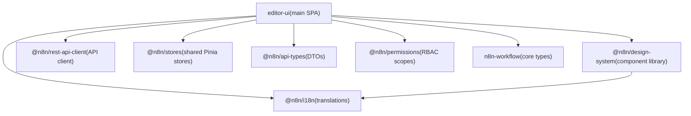
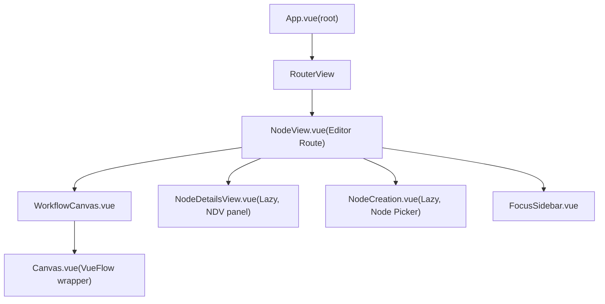
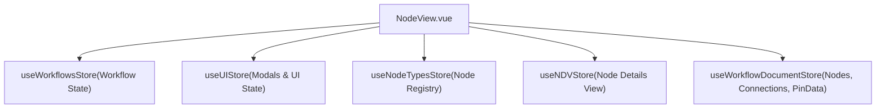

# User Interface

Relevant source files

-   [packages/frontend/@n8n/design-system/src/components/N8nActionToggle/ActionToggle.vue](https://github.com/n8n-io/n8n/blob/88f170b9/packages/frontend/@n8n/design-system/src/components/N8nActionToggle/ActionToggle.vue)
-   [packages/frontend/@n8n/design-system/src/components/N8nBreadcrumbs/Breadcrumbs.vue](https://github.com/n8n-io/n8n/blob/88f170b9/packages/frontend/@n8n/design-system/src/components/N8nBreadcrumbs/Breadcrumbs.vue)
-   [packages/frontend/@n8n/design-system/src/components/N8nBreadcrumbs/\_\_snapshots\_\_/BreadCrumbs.test.ts.snap](https://github.com/n8n-io/n8n/blob/88f170b9/packages/frontend/@n8n/design-system/src/components/N8nBreadcrumbs/__snapshots__/BreadCrumbs.test.ts.snap)
-   [packages/frontend/@n8n/design-system/src/components/N8nIcon/icons.ts](https://github.com/n8n-io/n8n/blob/88f170b9/packages/frontend/@n8n/design-system/src/components/N8nIcon/icons.ts)
-   [packages/frontend/@n8n/design-system/src/components/N8nUserStack/UserStack.vue](https://github.com/n8n-io/n8n/blob/88f170b9/packages/frontend/@n8n/design-system/src/components/N8nUserStack/UserStack.vue)
-   [packages/frontend/@n8n/design-system/src/composables/useParentScroll.ts](https://github.com/n8n-io/n8n/blob/88f170b9/packages/frontend/@n8n/design-system/src/composables/useParentScroll.ts)
-   [packages/frontend/@n8n/i18n/src/locales/en.json](https://github.com/n8n-io/n8n/blob/88f170b9/packages/frontend/@n8n/i18n/src/locales/en.json)
-   [packages/frontend/@n8n/rest-api-client/src/api/index.ts](https://github.com/n8n-io/n8n/blob/88f170b9/packages/frontend/@n8n/rest-api-client/src/api/index.ts)
-   [packages/frontend/editor-ui/MIGRATION\_RECIPE.md](https://github.com/n8n-io/n8n/blob/88f170b9/packages/frontend/editor-ui/MIGRATION_RECIPE.md?plain=1)
-   [packages/frontend/editor-ui/eslint.config.mjs](https://github.com/n8n-io/n8n/blob/88f170b9/packages/frontend/editor-ui/eslint.config.mjs)
-   [packages/frontend/editor-ui/src/Interface.ts](https://github.com/n8n-io/n8n/blob/88f170b9/packages/frontend/editor-ui/src/Interface.ts)
-   [packages/frontend/editor-ui/src/app/components/MainHeader/MainHeader.vue](https://github.com/n8n-io/n8n/blob/88f170b9/packages/frontend/editor-ui/src/app/components/MainHeader/MainHeader.vue)
-   [packages/frontend/editor-ui/src/app/components/MainHeader/WorkflowDetails.vue](https://github.com/n8n-io/n8n/blob/88f170b9/packages/frontend/editor-ui/src/app/components/MainHeader/WorkflowDetails.vue)
-   [packages/frontend/editor-ui/src/app/composables/\_\_snapshots\_\_/useCanvasOperations.test.ts.snap](https://github.com/n8n-io/n8n/blob/88f170b9/packages/frontend/editor-ui/src/app/composables/__snapshots__/useCanvasOperations.test.ts.snap)
-   [packages/frontend/editor-ui/src/app/composables/useCanvasOperations.test.ts](https://github.com/n8n-io/n8n/blob/88f170b9/packages/frontend/editor-ui/src/app/composables/useCanvasOperations.test.ts)
-   [packages/frontend/editor-ui/src/app/composables/useCanvasOperations.ts](https://github.com/n8n-io/n8n/blob/88f170b9/packages/frontend/editor-ui/src/app/composables/useCanvasOperations.ts)
-   [packages/frontend/editor-ui/src/app/composables/useWorkflowActivate.ts](https://github.com/n8n-io/n8n/blob/88f170b9/packages/frontend/editor-ui/src/app/composables/useWorkflowActivate.ts)
-   [packages/frontend/editor-ui/src/app/composables/useWorkflowExtraction.ts](https://github.com/n8n-io/n8n/blob/88f170b9/packages/frontend/editor-ui/src/app/composables/useWorkflowExtraction.ts)
-   [packages/frontend/editor-ui/src/app/composables/useWorkflowHelpers.test.ts](https://github.com/n8n-io/n8n/blob/88f170b9/packages/frontend/editor-ui/src/app/composables/useWorkflowHelpers.test.ts)
-   [packages/frontend/editor-ui/src/app/composables/useWorkflowHelpers.ts](https://github.com/n8n-io/n8n/blob/88f170b9/packages/frontend/editor-ui/src/app/composables/useWorkflowHelpers.ts)
-   [packages/frontend/editor-ui/src/app/composables/useWorkflowSaving.test.ts](https://github.com/n8n-io/n8n/blob/88f170b9/packages/frontend/editor-ui/src/app/composables/useWorkflowSaving.test.ts)
-   [packages/frontend/editor-ui/src/app/composables/useWorkflowSaving.ts](https://github.com/n8n-io/n8n/blob/88f170b9/packages/frontend/editor-ui/src/app/composables/useWorkflowSaving.ts)
-   [packages/frontend/editor-ui/src/app/composables/useWorkflowState.ts](https://github.com/n8n-io/n8n/blob/88f170b9/packages/frontend/editor-ui/src/app/composables/useWorkflowState.ts)
-   [packages/frontend/editor-ui/src/app/composables/useWorkflowUpdate.test.ts](https://github.com/n8n-io/n8n/blob/88f170b9/packages/frontend/editor-ui/src/app/composables/useWorkflowUpdate.test.ts)
-   [packages/frontend/editor-ui/src/app/composables/useWorkflowUpdate.ts](https://github.com/n8n-io/n8n/blob/88f170b9/packages/frontend/editor-ui/src/app/composables/useWorkflowUpdate.ts)
-   [packages/frontend/editor-ui/src/app/layouts/WorkflowLayout.vue](https://github.com/n8n-io/n8n/blob/88f170b9/packages/frontend/editor-ui/src/app/layouts/WorkflowLayout.vue)
-   [packages/frontend/editor-ui/src/app/stores/npsSurvey.store.ts](https://github.com/n8n-io/n8n/blob/88f170b9/packages/frontend/editor-ui/src/app/stores/npsSurvey.store.ts)
-   [packages/frontend/editor-ui/src/app/stores/workflowDocument.store.test.ts](https://github.com/n8n-io/n8n/blob/88f170b9/packages/frontend/editor-ui/src/app/stores/workflowDocument.store.test.ts)
-   [packages/frontend/editor-ui/src/app/stores/workflowDocument.store.ts](https://github.com/n8n-io/n8n/blob/88f170b9/packages/frontend/editor-ui/src/app/stores/workflowDocument.store.ts)
-   [packages/frontend/editor-ui/src/app/stores/workflowDocument/useWorkflowDocumentConnections.test.ts](https://github.com/n8n-io/n8n/blob/88f170b9/packages/frontend/editor-ui/src/app/stores/workflowDocument/useWorkflowDocumentConnections.test.ts)
-   [packages/frontend/editor-ui/src/app/stores/workflowDocument/useWorkflowDocumentConnections.ts](https://github.com/n8n-io/n8n/blob/88f170b9/packages/frontend/editor-ui/src/app/stores/workflowDocument/useWorkflowDocumentConnections.ts)
-   [packages/frontend/editor-ui/src/app/stores/workflowDocument/useWorkflowDocumentNodes.test.ts](https://github.com/n8n-io/n8n/blob/88f170b9/packages/frontend/editor-ui/src/app/stores/workflowDocument/useWorkflowDocumentNodes.test.ts)
-   [packages/frontend/editor-ui/src/app/stores/workflowDocument/useWorkflowDocumentNodes.ts](https://github.com/n8n-io/n8n/blob/88f170b9/packages/frontend/editor-ui/src/app/stores/workflowDocument/useWorkflowDocumentNodes.ts)
-   [packages/frontend/editor-ui/src/app/stores/workflowSave.store.ts](https://github.com/n8n-io/n8n/blob/88f170b9/packages/frontend/editor-ui/src/app/stores/workflowSave.store.ts)
-   [packages/frontend/editor-ui/src/app/stores/workflows.store.test.ts](https://github.com/n8n-io/n8n/blob/88f170b9/packages/frontend/editor-ui/src/app/stores/workflows.store.test.ts)
-   [packages/frontend/editor-ui/src/app/stores/workflows.store.ts](https://github.com/n8n-io/n8n/blob/88f170b9/packages/frontend/editor-ui/src/app/stores/workflows.store.ts)
-   [packages/frontend/editor-ui/src/app/utils/nodeViewUtils.test.ts](https://github.com/n8n-io/n8n/blob/88f170b9/packages/frontend/editor-ui/src/app/utils/nodeViewUtils.test.ts)
-   [packages/frontend/editor-ui/src/app/utils/nodeViewUtils.ts](https://github.com/n8n-io/n8n/blob/88f170b9/packages/frontend/editor-ui/src/app/utils/nodeViewUtils.ts)
-   [packages/frontend/editor-ui/src/app/views/NodeView.vue](https://github.com/n8n-io/n8n/blob/88f170b9/packages/frontend/editor-ui/src/app/views/NodeView.vue)
-   [packages/frontend/editor-ui/src/features/core/folders/components/FolderCard.vue](https://github.com/n8n-io/n8n/blob/88f170b9/packages/frontend/editor-ui/src/features/core/folders/components/FolderCard.vue)
-   [packages/frontend/editor-ui/src/features/execution/executions/components/workflow/WorkflowExecutionsInfoAccordion.vue](https://github.com/n8n-io/n8n/blob/88f170b9/packages/frontend/editor-ui/src/features/execution/executions/components/workflow/WorkflowExecutionsInfoAccordion.vue)
-   [packages/frontend/editor-ui/src/features/workflows/canvas/canvas.types.ts](https://github.com/n8n-io/n8n/blob/88f170b9/packages/frontend/editor-ui/src/features/workflows/canvas/canvas.types.ts)
-   [packages/frontend/editor-ui/src/features/workflows/canvas/components/Canvas.vue](https://github.com/n8n-io/n8n/blob/88f170b9/packages/frontend/editor-ui/src/features/workflows/canvas/components/Canvas.vue)
-   [packages/frontend/editor-ui/src/features/workflows/canvas/components/elements/nodes/CanvasNode.vue](https://github.com/n8n-io/n8n/blob/88f170b9/packages/frontend/editor-ui/src/features/workflows/canvas/components/elements/nodes/CanvasNode.vue)
-   [packages/frontend/editor-ui/src/features/workflows/canvas/components/elements/nodes/CanvasNodeToolbar.vue](https://github.com/n8n-io/n8n/blob/88f170b9/packages/frontend/editor-ui/src/features/workflows/canvas/components/elements/nodes/CanvasNodeToolbar.vue)
-   [packages/frontend/editor-ui/src/features/workflows/canvas/components/elements/nodes/render-types/CanvasNodeDefault.vue](https://github.com/n8n-io/n8n/blob/88f170b9/packages/frontend/editor-ui/src/features/workflows/canvas/components/elements/nodes/render-types/CanvasNodeDefault.vue)
-   [packages/frontend/editor-ui/src/features/workflows/canvas/composables/useCanvasMapping.test.ts](https://github.com/n8n-io/n8n/blob/88f170b9/packages/frontend/editor-ui/src/features/workflows/canvas/composables/useCanvasMapping.test.ts)
-   [packages/frontend/editor-ui/src/features/workflows/canvas/composables/useCanvasMapping.ts](https://github.com/n8n-io/n8n/blob/88f170b9/packages/frontend/editor-ui/src/features/workflows/canvas/composables/useCanvasMapping.ts)
-   [packages/frontend/editor-ui/src/features/workflows/workflowHistory/components/WorkflowHistoryButton.test.ts](https://github.com/n8n-io/n8n/blob/88f170b9/packages/frontend/editor-ui/src/features/workflows/workflowHistory/components/WorkflowHistoryButton.test.ts)
-   [packages/frontend/editor-ui/src/features/workflows/workflowHistory/components/WorkflowHistoryButton.vue](https://github.com/n8n-io/n8n/blob/88f170b9/packages/frontend/editor-ui/src/features/workflows/workflowHistory/components/WorkflowHistoryButton.vue)
-   [packages/nodes-base/credentials/SalesforceJwtApi.credentials.ts](https://github.com/n8n-io/n8n/blob/88f170b9/packages/nodes-base/credentials/SalesforceJwtApi.credentials.ts)
-   [packages/testing/playwright/services/role-api-helper.ts](https://github.com/n8n-io/n8n/blob/88f170b9/packages/testing/playwright/services/role-api-helper.ts)
-   [packages/testing/playwright/tests/e2e/regression/PAY-4367-node-shifting-cyclic.spec.ts](https://github.com/n8n-io/n8n/blob/88f170b9/packages/testing/playwright/tests/e2e/regression/PAY-4367-node-shifting-cyclic.spec.ts)
-   [packages/testing/playwright/tests/e2e/workflows/editor/canvas/actions.spec.ts](https://github.com/n8n-io/n8n/blob/88f170b9/packages/testing/playwright/tests/e2e/workflows/editor/canvas/actions.spec.ts)
-   [packages/testing/playwright/workflows/Bug\_node\_insertions\_between\_stickies.json](https://github.com/n8n-io/n8n/blob/88f170b9/packages/testing/playwright/workflows/Bug_node_insertions_between_stickies.json)
-   [packages/testing/playwright/workflows/Bug\_node\_insertions\_sticky.json](https://github.com/n8n-io/n8n/blob/88f170b9/packages/testing/playwright/workflows/Bug_node_insertions_sticky.json)
-   [packages/testing/playwright/workflows/Cyclic\_workflow\_for\_insertion\_test.json](https://github.com/n8n-io/n8n/blob/88f170b9/packages/testing/playwright/workflows/Cyclic_workflow_for_insertion_test.json)

This page provides an architectural overview of the n8n frontend application. It covers the package layout, plugin registration, component hierarchy, state management, and the major UI subsystems. Detailed treatment of individual subsystems is in the child pages:

-   For routing, Pinia store architecture, and the push connection, see [Frontend Architecture and State Management](/n8n-io/n8n/6.1-frontend-architecture-and-state-management).
-   For the workflow canvas and node interactions, see [Workflow Canvas and Node Management](/n8n-io/n8n/6.2-workflow-canvas-and-node-management).
-   For parameter editors and the expression editor, see [Parameter Input and Expression Editor](/n8n-io/n8n/6.3-parameter-input-and-expression-editor).
-   For the design system component library, see [Design System and Reusable Components](/n8n-io/n8n/6.4-design-system-and-reusable-components).
-   For the i18n package and translation keys, see [Internationalization and Localization](/n8n-io/n8n/6.5-internationalization-and-localization).
-   For the AI Builder and Chat Hub UIs, see [AI Workflow Builder](/n8n-io/n8n/5.1-ai-workflow-builder), [Chat Hub Frontend and User Interface](/n8n-io/n8n/5.3-chat-hub-frontend-and-user-interface).

---

## Technology Stack

The frontend is a Vue 3 Single-Page Application (SPA) served as a static bundle by the n8n backend.

| Technology | Role |
| --- | --- |
| Vue 3 (Composition API) | Component framework [packages/frontend/editor-ui/src/app/views/NodeView.vue1-13](https://github.com/n8n-io/n8n/blob/88f170b9/packages/frontend/editor-ui/src/app/views/NodeView.vue#L1-L13) |
| Pinia | State management [packages/frontend/editor-ui/src/app/stores/workflows.store.ts27](https://github.com/n8n-io/n8n/blob/88f170b9/packages/frontend/editor-ui/src/app/stores/workflows.store.ts#L27-L27) |
| Vue Router | Client-side routing [packages/frontend/editor-ui/src/app/views/NodeView.vue14](https://github.com/n8n-io/n8n/blob/88f170b9/packages/frontend/editor-ui/src/app/views/NodeView.vue#L14-L14) |
| Vue Flow (`@vue-flow/core`) | Directed-graph canvas [packages/frontend/editor-ui/src/app/views/NodeView.vue37-41](https://github.com/n8n-io/n8n/blob/88f170b9/packages/frontend/editor-ui/src/app/views/NodeView.vue#L37-L41) |
| Element Plus | Base UI primitives [packages/frontend/editor-ui/src/Interface.ts1](https://github.com/n8n-io/n8n/blob/88f170b9/packages/frontend/editor-ui/src/Interface.ts#L1-L1) |
| CodeMirror 6 | Code and expression editors [packages/frontend/@n8n/i18n/src/locales/en.json4-14](https://github.com/n8n-io/n8n/blob/88f170b9/packages/frontend/@n8n/i18n/src/locales/en.json#L4-L14) |

---

## Package Layout

**Diagram: Frontend Package Dependencies**

Sources: [packages/frontend/editor-ui/src/Interface.ts2-67](https://github.com/n8n-io/n8n/blob/88f170b9/packages/frontend/editor-ui/src/Interface.ts#L2-L67) [packages/frontend/editor-ui/src/app/stores/workflows.store.ts1-55](https://github.com/n8n-io/n8n/blob/88f170b9/packages/frontend/editor-ui/src/app/stores/workflows.store.ts#L1-L55)

---

## High-Level Component Hierarchy

The primary entry point for the workflow editor is `NodeView.vue`, which coordinates the canvas, sidebars, and lazy-loaded detail views.

**Diagram: Core Component Tree**

Sources: [packages/frontend/editor-ui/src/app/views/NodeView.vue15-16](https://github.com/n8n-io/n8n/blob/88f170b9/packages/frontend/editor-ui/src/app/views/NodeView.vue#L15-L16) [packages/frontend/editor-ui/src/app/views/NodeView.vue146-155](https://github.com/n8n-io/n8n/blob/88f170b9/packages/frontend/editor-ui/src/app/views/NodeView.vue#L146-L155)

---

## Key UI Subsystems

### 1\. Workflow Canvas and Operations

The canvas integration utilizes `@vue-flow/core` for graph rendering. Operations like adding, moving, and connecting nodes are abstracted into composables to maintain a clean view layer.

-   **`useCanvasOperations.ts`**: Centralizes logic for `AddNodeCommand`, `MoveNodeCommand`, and `AddConnectionCommand` [packages/frontend/editor-ui/src/app/composables/useCanvasOperations.ts39-46](https://github.com/n8n-io/n8n/blob/88f170b9/packages/frontend/editor-ui/src/app/composables/useCanvasOperations.ts#L39-L46)
-   **`CanvasNodeRenderType`**: Defines how different node types (Default, Sticky, AI) appear on the canvas [packages/frontend/editor-ui/src/app/views/NodeView.vue50-51](https://github.com/n8n-io/n8n/blob/88f170b9/packages/frontend/editor-ui/src/app/views/NodeView.vue#L50-L51)

Sources: [packages/frontend/editor-ui/src/app/composables/useCanvasOperations.ts173-195](https://github.com/n8n-io/n8n/blob/88f170b9/packages/frontend/editor-ui/src/app/composables/useCanvasOperations.ts#L173-L195) [packages/frontend/editor-ui/src/app/views/NodeView.vue113-117](https://github.com/n8n-io/n8n/blob/88f170b9/packages/frontend/editor-ui/src/app/views/NodeView.vue#L113-L117)

### 2\. State Management (Pinia)

The application state is highly modularized into Pinia stores. `useWorkflowsStore` manages the active workflow's nodes, connections, and execution results [packages/frontend/editor-ui/src/app/stores/workflows.store.ts118-150](https://github.com/n8n-io/n8n/blob/88f170b9/packages/frontend/editor-ui/src/app/stores/workflows.store.ts#L118-L150)

**Diagram: NodeView Store Dependencies**

Sources: [packages/frontend/editor-ui/src/app/views/NodeView.vue17-22](https://github.com/n8n-io/n8n/blob/88f170b9/packages/frontend/editor-ui/src/app/views/NodeView.vue#L17-L22) [packages/frontend/editor-ui/src/app/stores/workflowDocument.store.ts59-122](https://github.com/n8n-io/n8n/blob/88f170b9/packages/frontend/editor-ui/src/app/stores/workflowDocument.store.ts#L59-L122)

### 3\. Workflow Saving and Persistence

Saving logic is handled by `useWorkflowSaving.ts`, which manages auto-save states, conflict detection, and unsaved change prompts [packages/frontend/editor-ui/src/app/composables/useWorkflowSaving.ts43-70](https://github.com/n8n-io/n8n/blob/88f170b9/packages/frontend/editor-ui/src/app/composables/useWorkflowSaving.ts#L43-L70) It interacts with `workflowsListStore` to determine if a workflow is new or an update [packages/frontend/editor-ui/src/app/composables/useWorkflowSaving.ts187-196](https://github.com/n8n-io/n8n/blob/88f170b9/packages/frontend/editor-ui/src/app/composables/useWorkflowSaving.ts#L187-L196)

Sources: [packages/frontend/editor-ui/src/app/composables/useWorkflowSaving.ts108-120](https://github.com/n8n-io/n8n/blob/88f170b9/packages/frontend/editor-ui/src/app/composables/useWorkflowSaving.ts#L108-L120) [packages/frontend/editor-ui/src/app/stores/workflows.store.ts159-166](https://github.com/n8n-io/n8n/blob/88f170b9/packages/frontend/editor-ui/src/app/stores/workflows.store.ts#L159-L166)

### 4\. Internationalization (i18n)

n8n uses a centralized translation system. The `en.json` file contains over 400,000 characters of translation keys covering generic UI text, node-specific labels, and error messages [packages/frontend/@n8n/i18n/src/locales/en.json1-100](https://github.com/n8n-io/n8n/blob/88f170b9/packages/frontend/@n8n/i18n/src/locales/en.json#L1-L100)

Sources: [packages/frontend/@n8n/i18n/src/locales/en.json1-165](https://github.com/n8n-io/n8n/blob/88f170b9/packages/frontend/@n8n/i18n/src/locales/en.json#L1-L165)

### 5\. Design System and Icons

The UI is built on a custom design system that wraps Element Plus and provides n8n-specific components. Icons are managed via a central registry in `icons.ts`, combining custom SVGs (like `node-play`, `node-dirty`) with the Lucide icon set [packages/frontend/@n8n/design-system/src/components/N8nIcon/icons.ts1-100](https://github.com/n8n-io/n8n/blob/88f170b9/packages/frontend/@n8n/design-system/src/components/N8nIcon/icons.ts#L1-L100)

Sources: [packages/frontend/@n8n/design-system/src/components/N8nIcon/icons.ts1-37](https://github.com/n8n-io/n8n/blob/88f170b9/packages/frontend/@n8n/design-system/src/components/N8nIcon/icons.ts#L1-L37) [packages/frontend/editor-ui/src/app/views/NodeView.vue140](https://github.com/n8n-io/n8n/blob/88f170b9/packages/frontend/editor-ui/src/app/views/NodeView.vue#L140-L140)

---

## Child Pages

| Page | Content |
| --- | --- |
| [Frontend Architecture and State Management](/n8n-io/n8n/6.1-frontend-architecture-and-state-management) | Vue 3 + Vite setup, Pinia store architecture, API client layer, and initialization sequence. |
| [Workflow Canvas and Node Management](/n8n-io/n8n/6.2-workflow-canvas-and-node-management) | Vue Flow integration, canvas operations, node creation, and CRDT collaboration. |
| [Parameter Input and Expression Editor](/n8n-io/n8n/6.3-parameter-input-and-expression-editor) | Parameter input components, CodeMirror expression editor, and NDV panel. |
| [Design System and Reusable Components](/n8n-io/n8n/6.4-design-system-and-reusable-components) | `@n8n/design-system`, Element Plus integration, and CSS tokens. |
| [Internationalization and Localization](/n8n-io/n8n/6.5-internationalization-and-localization) | `vue-i18n` integration, translation file structure, and pluralization patterns. |
