# Frontend Architecture and State Management

Relevant source files

-   [packages/@n8n/api-types/src/dto/user/\_\_tests\_\_/users-list-filter.dto.test.ts](https://github.com/n8n-io/n8n/blob/88f170b9/packages/@n8n/api-types/src/dto/user/__tests__/users-list-filter.dto.test.ts)
-   [packages/@n8n/api-types/src/dto/user/users-list-filter.dto.ts](https://github.com/n8n-io/n8n/blob/88f170b9/packages/@n8n/api-types/src/dto/user/users-list-filter.dto.ts)
-   [packages/@n8n/api-types/src/push/heartbeat.ts](https://github.com/n8n-io/n8n/blob/88f170b9/packages/@n8n/api-types/src/push/heartbeat.ts)
-   [packages/@n8n/api-types/src/schemas/\_\_tests\_\_/user.schema.test.ts](https://github.com/n8n-io/n8n/blob/88f170b9/packages/@n8n/api-types/src/schemas/__tests__/user.schema.test.ts)
-   [packages/@n8n/api-types/src/schemas/user.schema.ts](https://github.com/n8n-io/n8n/blob/88f170b9/packages/@n8n/api-types/src/schemas/user.schema.ts)
-   [packages/@n8n/db/src/repositories/user.repository.ts](https://github.com/n8n-io/n8n/blob/88f170b9/packages/@n8n/db/src/repositories/user.repository.ts)
-   [packages/cli/src/collaboration/\_\_tests\_\_/collaboration.state.test.ts](https://github.com/n8n-io/n8n/blob/88f170b9/packages/cli/src/collaboration/__tests__/collaboration.state.test.ts)
-   [packages/cli/src/collaboration/collaboration.message.ts](https://github.com/n8n-io/n8n/blob/88f170b9/packages/cli/src/collaboration/collaboration.message.ts)
-   [packages/cli/src/collaboration/collaboration.service.ts](https://github.com/n8n-io/n8n/blob/88f170b9/packages/cli/src/collaboration/collaboration.service.ts)
-   [packages/cli/src/collaboration/collaboration.state.ts](https://github.com/n8n-io/n8n/blob/88f170b9/packages/cli/src/collaboration/collaboration.state.ts)
-   [packages/cli/src/push/\_\_tests\_\_/index.test.ts](https://github.com/n8n-io/n8n/blob/88f170b9/packages/cli/src/push/__tests__/index.test.ts)
-   [packages/cli/src/push/\_\_tests\_\_/origin-validator.test.ts](https://github.com/n8n-io/n8n/blob/88f170b9/packages/cli/src/push/__tests__/origin-validator.test.ts)
-   [packages/cli/src/push/\_\_tests\_\_/sse.push.test.ts](https://github.com/n8n-io/n8n/blob/88f170b9/packages/cli/src/push/__tests__/sse.push.test.ts)
-   [packages/cli/src/push/\_\_tests\_\_/websocket.push.test.ts](https://github.com/n8n-io/n8n/blob/88f170b9/packages/cli/src/push/__tests__/websocket.push.test.ts)
-   [packages/cli/src/push/abstract.push.ts](https://github.com/n8n-io/n8n/blob/88f170b9/packages/cli/src/push/abstract.push.ts)
-   [packages/cli/src/push/index.ts](https://github.com/n8n-io/n8n/blob/88f170b9/packages/cli/src/push/index.ts)
-   [packages/cli/src/push/origin-validator.ts](https://github.com/n8n-io/n8n/blob/88f170b9/packages/cli/src/push/origin-validator.ts)
-   [packages/cli/src/push/push.config.ts](https://github.com/n8n-io/n8n/blob/88f170b9/packages/cli/src/push/push.config.ts)
-   [packages/cli/src/push/sse.push.ts](https://github.com/n8n-io/n8n/blob/88f170b9/packages/cli/src/push/sse.push.ts)
-   [packages/cli/src/push/types.ts](https://github.com/n8n-io/n8n/blob/88f170b9/packages/cli/src/push/types.ts)
-   [packages/cli/src/push/websocket.push.ts](https://github.com/n8n-io/n8n/blob/88f170b9/packages/cli/src/push/websocket.push.ts)
-   [packages/cli/test/integration/collaboration/collaboration.service.test.ts](https://github.com/n8n-io/n8n/blob/88f170b9/packages/cli/test/integration/collaboration/collaboration.service.test.ts)
-   [packages/cli/test/integration/user.repository.test.ts](https://github.com/n8n-io/n8n/blob/88f170b9/packages/cli/test/integration/user.repository.test.ts)
-   [packages/frontend/@n8n/design-system/src/components/N8nIcon/custom/resolver.svg](https://github.com/n8n-io/n8n/blob/88f170b9/packages/frontend/@n8n/design-system/src/components/N8nIcon/custom/resolver.svg)
-   [packages/frontend/@n8n/design-system/src/components/N8nUserSelect/UserSelect.test.ts](https://github.com/n8n-io/n8n/blob/88f170b9/packages/frontend/@n8n/design-system/src/components/N8nUserSelect/UserSelect.test.ts)
-   [packages/frontend/@n8n/design-system/src/components/N8nUserSelect/UserSelect.vue](https://github.com/n8n-io/n8n/blob/88f170b9/packages/frontend/@n8n/design-system/src/components/N8nUserSelect/UserSelect.vue)
-   [packages/frontend/@n8n/design-system/src/types/action-dropdown.ts](https://github.com/n8n-io/n8n/blob/88f170b9/packages/frontend/@n8n/design-system/src/types/action-dropdown.ts)
-   [packages/frontend/@n8n/rest-api-client/src/api/provisioning.ts](https://github.com/n8n-io/n8n/blob/88f170b9/packages/frontend/@n8n/rest-api-client/src/api/provisioning.ts)
-   [packages/frontend/@n8n/stores/src/constants.ts](https://github.com/n8n-io/n8n/blob/88f170b9/packages/frontend/@n8n/stores/src/constants.ts)
-   [packages/frontend/editor-ui/src/app/components/MainHeader/ActionsDropdownMenu.vue](https://github.com/n8n-io/n8n/blob/88f170b9/packages/frontend/editor-ui/src/app/components/MainHeader/ActionsDropdownMenu.vue)
-   [packages/frontend/editor-ui/src/app/components/MainHeader/WorkflowDetails.test.ts](https://github.com/n8n-io/n8n/blob/88f170b9/packages/frontend/editor-ui/src/app/components/MainHeader/WorkflowDetails.test.ts)
-   [packages/frontend/editor-ui/src/app/components/MainSidebar.test.ts](https://github.com/n8n-io/n8n/blob/88f170b9/packages/frontend/editor-ui/src/app/components/MainSidebar.test.ts)
-   [packages/frontend/editor-ui/src/app/components/Modals.vue](https://github.com/n8n-io/n8n/blob/88f170b9/packages/frontend/editor-ui/src/app/components/Modals.vue)
-   [packages/frontend/editor-ui/src/app/components/SettingsSidebar.vue](https://github.com/n8n-io/n8n/blob/88f170b9/packages/frontend/editor-ui/src/app/components/SettingsSidebar.vue)
-   [packages/frontend/editor-ui/src/app/components/WorkflowCard.test.ts](https://github.com/n8n-io/n8n/blob/88f170b9/packages/frontend/editor-ui/src/app/components/WorkflowCard.test.ts)
-   [packages/frontend/editor-ui/src/app/components/WorkflowCard.vue](https://github.com/n8n-io/n8n/blob/88f170b9/packages/frontend/editor-ui/src/app/components/WorkflowCard.vue)
-   [packages/frontend/editor-ui/src/app/components/layouts/EmptyStateLayout.test.ts](https://github.com/n8n-io/n8n/blob/88f170b9/packages/frontend/editor-ui/src/app/components/layouts/EmptyStateLayout.test.ts)
-   [packages/frontend/editor-ui/src/app/components/layouts/EmptyStateLayout.vue](https://github.com/n8n-io/n8n/blob/88f170b9/packages/frontend/editor-ui/src/app/components/layouts/EmptyStateLayout.vue)
-   [packages/frontend/editor-ui/src/app/constants/experiments.ts](https://github.com/n8n-io/n8n/blob/88f170b9/packages/frontend/editor-ui/src/app/constants/experiments.ts)
-   [packages/frontend/editor-ui/src/app/constants/modals.ts](https://github.com/n8n-io/n8n/blob/88f170b9/packages/frontend/editor-ui/src/app/constants/modals.ts)
-   [packages/frontend/editor-ui/src/app/constants/navigation.ts](https://github.com/n8n-io/n8n/blob/88f170b9/packages/frontend/editor-ui/src/app/constants/navigation.ts)
-   [packages/frontend/editor-ui/src/app/router.test.ts](https://github.com/n8n-io/n8n/blob/88f170b9/packages/frontend/editor-ui/src/app/router.test.ts)
-   [packages/frontend/editor-ui/src/app/router.ts](https://github.com/n8n-io/n8n/blob/88f170b9/packages/frontend/editor-ui/src/app/router.ts)
-   [packages/frontend/editor-ui/src/app/stores/ui.store.ts](https://github.com/n8n-io/n8n/blob/88f170b9/packages/frontend/editor-ui/src/app/stores/ui.store.ts)
-   [packages/frontend/editor-ui/src/app/views/WorkflowsView.test.ts](https://github.com/n8n-io/n8n/blob/88f170b9/packages/frontend/editor-ui/src/app/views/WorkflowsView.test.ts)
-   [packages/frontend/editor-ui/src/app/views/WorkflowsView.vue](https://github.com/n8n-io/n8n/blob/88f170b9/packages/frontend/editor-ui/src/app/views/WorkflowsView.vue)
-   [packages/frontend/editor-ui/src/experiments/emptyStateBuilderPrompt/stores/emptyStateBuilderPrompt.store.ts](https://github.com/n8n-io/n8n/blob/88f170b9/packages/frontend/editor-ui/src/experiments/emptyStateBuilderPrompt/stores/emptyStateBuilderPrompt.store.ts)
-   [packages/frontend/editor-ui/src/experiments/personalizedTemplatesV3/components/NodeRecommendationModal.vue](https://github.com/n8n-io/n8n/blob/88f170b9/packages/frontend/editor-ui/src/experiments/personalizedTemplatesV3/components/NodeRecommendationModal.vue)
-   [packages/frontend/editor-ui/src/features/collaboration/projects/components/ProjectMoveResourceModal.vue](https://github.com/n8n-io/n8n/blob/88f170b9/packages/frontend/editor-ui/src/features/collaboration/projects/components/ProjectMoveResourceModal.vue)
-   [packages/frontend/editor-ui/src/features/collaboration/projects/components/ProjectMoveSuccessToastMessage.vue](https://github.com/n8n-io/n8n/blob/88f170b9/packages/frontend/editor-ui/src/features/collaboration/projects/components/ProjectMoveSuccessToastMessage.vue)
-   [packages/frontend/editor-ui/src/features/collaboration/projects/composables/useMoveResourceToProjectToast.ts](https://github.com/n8n-io/n8n/blob/88f170b9/packages/frontend/editor-ui/src/features/collaboration/projects/composables/useMoveResourceToProjectToast.ts)
-   [packages/frontend/editor-ui/src/features/core/folders/components/DeleteFolderModal.vue](https://github.com/n8n-io/n8n/blob/88f170b9/packages/frontend/editor-ui/src/features/core/folders/components/DeleteFolderModal.vue)
-   [packages/frontend/editor-ui/src/features/core/folders/components/MoveToFolderModal.test.ts](https://github.com/n8n-io/n8n/blob/88f170b9/packages/frontend/editor-ui/src/features/core/folders/components/MoveToFolderModal.test.ts)
-   [packages/frontend/editor-ui/src/features/core/folders/components/MoveToFolderModal.vue](https://github.com/n8n-io/n8n/blob/88f170b9/packages/frontend/editor-ui/src/features/core/folders/components/MoveToFolderModal.vue)
-   [packages/frontend/editor-ui/src/features/core/folders/folders.store.ts](https://github.com/n8n-io/n8n/blob/88f170b9/packages/frontend/editor-ui/src/features/core/folders/folders.store.ts)
-   [packages/frontend/editor-ui/src/features/resolvers/ResolversView.vue](https://github.com/n8n-io/n8n/blob/88f170b9/packages/frontend/editor-ui/src/features/resolvers/ResolversView.vue)
-   [packages/frontend/editor-ui/src/features/workflows/canvas/components/elements/nodes/render-types/CanvasNodeAddNodes.test.ts](https://github.com/n8n-io/n8n/blob/88f170b9/packages/frontend/editor-ui/src/features/workflows/canvas/components/elements/nodes/render-types/CanvasNodeAddNodes.test.ts)
-   [packages/frontend/editor-ui/src/features/workflows/composables/useWorkflowsEmptyState.ts](https://github.com/n8n-io/n8n/blob/88f170b9/packages/frontend/editor-ui/src/features/workflows/composables/useWorkflowsEmptyState.ts)
-   [packages/frontend/editor-ui/src/features/workflows/readyToRun/components/ReadyToRunButton.test.ts](https://github.com/n8n-io/n8n/blob/88f170b9/packages/frontend/editor-ui/src/features/workflows/readyToRun/components/ReadyToRunButton.test.ts)
-   [packages/frontend/editor-ui/src/features/workflows/readyToRun/components/ReadyToRunButton.vue](https://github.com/n8n-io/n8n/blob/88f170b9/packages/frontend/editor-ui/src/features/workflows/readyToRun/components/ReadyToRunButton.vue)
-   [packages/frontend/editor-ui/src/features/workflows/readyToRun/composables/useEmptyStateDetection.test.ts](https://github.com/n8n-io/n8n/blob/88f170b9/packages/frontend/editor-ui/src/features/workflows/readyToRun/composables/useEmptyStateDetection.test.ts)
-   [packages/frontend/editor-ui/src/features/workflows/readyToRun/composables/useEmptyStateDetection.ts](https://github.com/n8n-io/n8n/blob/88f170b9/packages/frontend/editor-ui/src/features/workflows/readyToRun/composables/useEmptyStateDetection.ts)
-   [packages/frontend/editor-ui/src/features/workflows/templates/recommendations/recommendedTemplates.store.test.ts](https://github.com/n8n-io/n8n/blob/88f170b9/packages/frontend/editor-ui/src/features/workflows/templates/recommendations/recommendedTemplates.store.test.ts)
-   [packages/frontend/editor-ui/src/features/workflows/templates/recommendations/recommendedTemplates.store.ts](https://github.com/n8n-io/n8n/blob/88f170b9/packages/frontend/editor-ui/src/features/workflows/templates/recommendations/recommendedTemplates.store.ts)

This page describes the structure of the Vue 3 single-page application in `packages/frontend/editor-ui`, covering application initialization, how backend settings reach the UI, the Pinia store architecture, and how real-time push connections are managed.

For the workflow canvas and node interaction layer, see [6.2](https://github.com/n8n-io/n8n/blob/88f170b9/6.2) For parameter input components and the expression editor, see [6.3](https://github.com/n8n-io/n8n/blob/88f170b9/6.3) For the design system component library, see [6.4](https://github.com/n8n-io/n8n/blob/88f170b9/6.4) For the AI Builder assistant frontend, see [5.1](https://github.com/n8n-io/n8n/blob/88f170b9/5.1)

---

## Application Overview

The editor UI is a Vue 3 SPA built with Vite and compiled to `packages/frontend/editor-ui/dist`. The backend (`packages/cli`) serves this directory statically. Before serving, the `Start` command pre-processes the assets to inject instance-specific configuration and meta tags.

**Static asset compilation** at startup replaces several placeholders in the `index.html` and JS files:

| Placeholder | Replaced With |
| --- | --- |
| `%CONFIG_TAGS%` | Base64-encoded meta tags containing the REST endpoint path and Sentry DSN |
| `/{{BASE_PATH}}/` | The configured `N8N_PATH` value |
| `{{REST_ENDPOINT}}` | The REST endpoint path (default: `rest`) |
| `</title>` | `</title>` + `<script>` tags for external frontend hook URLs |

This is performed in `generateStaticAssets()` and `generateConfigTags()` inside the `Start` command.

Sources: [packages/cli/src/commands/start.ts123-187](https://github.com/n8n-io/n8n/blob/88f170b9/packages/cli/src/commands/start.ts#L123-L187)

---

## Frontend Settings Loading

The frontend requires server-side configuration (license state, SSO config, feature flags, etc.) before it can render the authenticated workspace. This is delivered through the `FrontendSettings` type via a two-phase load.

### Backend: FrontendService

`FrontendService` in `packages/cli/src/services/frontend.service.ts` is the backend service that assembles the `FrontendSettings` object. It is decorated with `@Service()` and injected into the DI container.

Key methods:

| Method | Returns | Notes |
| --- | --- | --- |
| `initSettings()` | `void` | Builds the initial `this.settings` object from `GlobalConfig`, license, and SSO state. |
| `getSettings()` | `FrontendSettings` | Refreshes dynamic values (enterprise flags, license, SSO) before returning to the client. |
| `getPublicSettings(includeMfaSettings)` | `PublicFrontendSettings` | Returns a smaller subset for unauthenticated pages like login or setup. |
| `generateTypes()` | `void` | Writes `types/nodes.json`, `types/credentials.json`, and `types/node-versions.json` to the static cache directory. |

`getSettings()` refreshes dynamic fields on every call, including enterprise flags from `License`, SSO settings from `LicenseState`, and environment feature flags scanned from `N8N_ENV_FEAT_*` variables.

Sources: [packages/cli/src/services/frontend.service.ts1-664](https://github.com/n8n-io/n8n/blob/88f170b9/packages/cli/src/services/frontend.service.ts#L1-L664) [packages/cli/src/services/frontend.service.ts402-549](https://github.com/n8n-io/n8n/blob/88f170b9/packages/cli/src/services/frontend.service.ts#L402-L549)

### Settings Loading Sequence

**Settings loading pipeline — from GlobalConfig to the frontend store**

> **[Mermaid sequence]**
> *(图表结构无法解析)*

Sources: [packages/cli/src/services/frontend.service.ts402-549](https://github.com/n8n-io/n8n/blob/88f170b9/packages/cli/src/services/frontend.service.ts#L402-L549) [packages/cli/src/commands/start.ts144-187](https://github.com/n8n-io/n8n/blob/88f170b9/packages/cli/src/commands/start.ts#L144-L187) [packages/frontend/editor-ui/src/app/router.ts19-20](https://github.com/n8n-io/n8n/blob/88f170b9/packages/frontend/editor-ui/src/app/router.ts#L19-L20)

---

## Pinia Store Architecture

The editor UI uses [Pinia](https://pinia.vuejs.org/) for all shared state management. Stores are defined with `defineStore()` using string IDs from the `STORES` enum.

**Pinia store dependency map (Workflow Management context)**

```mermaid
flowchart TD
    WorkflowsView["WorkflowsView.vue"]
    settings["useSettingsStoreSTORES.SETTINGS"]
    ui["useUIStoreSTORES.UI"]
    workflows["useWorkflowsStoreSTORES.WORKFLOWS"]
    workflowsList["useWorkflowsListStoreSTORES.WORKFLOWS_LIST"]
    pushConn["usePushConnectionStoreSTORES.PUSH"]
    projects["useProjectsStoreSTORES.PROJECTS"]
    users["useUsersStoreSTORES.USERS"]
    tags["useTagsStoreSTORES.TAGS"]
    folders["useFoldersStoreSTORES.FOLDERS"]
    sourceControl["useSourceControlStoreSTORES.COLLABORATION"]
    insights["useInsightsStoreSTORES.MODULES"]

    WorkflowsView --> settings
    WorkflowsView --> ui
    WorkflowsView --> workflows
    WorkflowsView --> workflowsList
    WorkflowsView --> projects
    WorkflowsView --> users
    WorkflowsView --> tags
    WorkflowsView --> folders
    WorkflowsView --> sourceControl
    WorkflowsView --> insights
    workflowsList --> workflows
    ui --> settings
    ui --> workflows
```

Sources: [packages/frontend/editor-ui/src/app/views/WorkflowsView.vue134-151](https://github.com/n8n-io/n8n/blob/88f170b9/packages/frontend/editor-ui/src/app/views/WorkflowsView.vue#L134-L151) [packages/frontend/@n8n/stores/src/constants.ts1-55](https://github.com/n8n-io/n8n/blob/88f170b9/packages/frontend/@n8n/stores/src/constants.ts#L1-L55) [packages/frontend/editor-ui/src/app/stores/ui.store.ts118-174](https://github.com/n8n-io/n8n/blob/88f170b9/packages/frontend/editor-ui/src/app/stores/ui.store.ts#L118-L174)

### Store Reference Table

| Store Hook | Store ID | Primary Responsibility |
| --- | --- | --- |
| `useUIStore` | `STORES.UI` | Manages active modals (e.g., `DUPLICATE_MODAL_KEY`), themes, and global UI state. |
| `useWorkflowsStore` | `STORES.WORKFLOWS` | Manages the currently active workflow, including node data and execution state. |
| `useWorkflowsListStore` | `STORES.WORKFLOWS_LIST` | Handles pagination, filtering, and caching for the workflow list view. |
| `useFoldersStore` | `STORES.FOLDERS` | Manages folder hierarchies and folder-based resource organization. |
| `useProjectsStore` | `STORES.PROJECTS` | Handles project-based collaboration, personal vs. team projects, and project roles. |
| `useUsersStore` | `STORES.USERS` | Manages the current authenticated user profile and global permissions. |
| `usePushConnectionStore` | `STORES.PUSH` | Manages the real-time SSE or WebSocket connection lifecycle. |

Sources: [packages/frontend/editor-ui/src/app/stores/ui.store.ts118-207](https://github.com/n8n-io/n8n/blob/88f170b9/packages/frontend/editor-ui/src/app/stores/ui.store.ts#L118-L207) [packages/frontend/@n8n/stores/src/constants.ts1-55](https://github.com/n8n-io/n8n/blob/88f170b9/packages/frontend/@n8n/stores/src/constants.ts#L1-L55) [packages/frontend/editor-ui/src/app/views/WorkflowsView.vue134-151](https://github.com/n8n-io/n8n/blob/88f170b9/packages/frontend/editor-ui/src/app/views/WorkflowsView.vue#L134-L151)

---

## API Client Layer and Zod Schemas

The frontend communicates with the backend via the `@n8n/rest-api-client`. This layer uses Zod schemas for runtime type safety and validation of API responses.

The `UserRepository` and associated DTOs define the structure for user management, while the `Push` service defines the message types for real-time updates.

Sources: [packages/@n8n/db/src/repositories/user.repository.ts10-25](https://github.com/n8n-io/n8n/blob/88f170b9/packages/@n8n/db/src/repositories/user.repository.ts#L10-L25) [packages/@n8n/api-types/src/schemas/user.schema.ts1-10](https://github.com/n8n-io/n8n/blob/88f170b9/packages/@n8n/api-types/src/schemas/user.schema.ts#L1-L10)

---

## WebSocket and SSE Push Connections

The backend `Push` service (decorated with `@Service()`) facilitates uni- or bi-directional communication with frontend clients. Depending on the configuration, it uses either **Server-Sent Events (SSE)** via `SSEPush` or **WebSockets** via `WebSocketPush`.

### Backend Implementation

The `Push` service manages user sessions and allows broadcasting messages to all connected clients or sending targeted messages to specific `pushRef` identifiers.

**Push message flow**

> **[Mermaid sequence]**
> *(图表结构无法解析)*

Sources: [packages/cli/src/push/index.ts43-62](https://github.com/n8n-io/n8n/blob/88f170b9/packages/cli/src/push/index.ts#L43-L62) [packages/cli/src/push/abstract.push.ts21-43](https://github.com/n8n-io/n8n/blob/88f170b9/packages/cli/src/push/abstract.push.ts#L21-L43) [packages/cli/src/push/index.ts158-180](https://github.com/n8n-io/n8n/blob/88f170b9/packages/cli/src/push/index.ts#L158-L180)

### Connection Lifecycle

1.  **Initialization**: The frontend establishes a connection using a unique `pushRef`.
2.  **Authentication**: The `AuthService` provides middleware to validate the connection request.
3.  **Registration**: The `Push` service registers the `pushRef` and associates it with a `userId`.
4.  **Broadcasting**: The backend can call `broadcast(pushMsg)` to notify all active UI sessions of events like execution progress.

Sources: [packages/cli/src/push/index.ts93-110](https://github.com/n8n-io/n8n/blob/88f170b9/packages/cli/src/push/index.ts#L93-L110) [packages/cli/src/push/abstract.push.ts44-57](https://github.com/n8n-io/n8n/blob/88f170b9/packages/cli/src/push/abstract.push.ts#L44-L57)

---

## Router Configuration and Initialization

The frontend initialization sequence is managed in `packages/frontend/editor-ui/src/app/router.ts`. The router uses navigation guards to ensure the application state is initialized before rendering views.

### Initialization Sequence

1.  **Core Initialization**: `initializeCore()` is called to load basic settings.
2.  **Authentication Check**: The `authenticated` middleware verifies the user session.
3.  **Feature Initialization**: `initializeAuthenticatedFeatures()` loads user-specific data like projects, tags, and folders.
4.  **Navigation**: Once initialized, the router directs the user to the requested path (e.g., `VIEWS.PROJECTS_WORKFLOWS`).

Sources: [packages/frontend/editor-ui/src/app/router.ts17-21](https://github.com/n8n-io/n8n/blob/88f170b9/packages/frontend/editor-ui/src/app/router.ts#L17-L21) [packages/frontend/editor-ui/src/app/router.ts128-140](https://github.com/n8n-io/n8n/blob/88f170b9/packages/frontend/editor-ui/src/app/router.ts#L128-L140)

### View Mapping

The router maps URL paths to Vue components, often using lazy-loading for feature modules:

| View Name | Component | Path |
| --- | --- | --- |
| `VIEWS.PROJECTS_WORKFLOWS` | `WorkflowsView.vue` | `/home/workflows` |
| `VIEWS.NODE_VIEW` | `NodeView.vue` | `/workflow/:id` |
| `VIEWS.WORKFLOW_EXECUTIONS` | `WorkflowExecutionsView.vue` | `/workflow/:id/executions` |

Sources: [packages/frontend/editor-ui/src/app/router.ts37-52](https://github.com/n8n-io/n8n/blob/88f170b9/packages/frontend/editor-ui/src/app/router.ts#L37-L52) [packages/frontend/editor-ui/src/app/router.ts128-150](https://github.com/n8n-io/n8n/blob/88f170b9/packages/frontend/editor-ui/src/app/router.ts#L128-L150)
