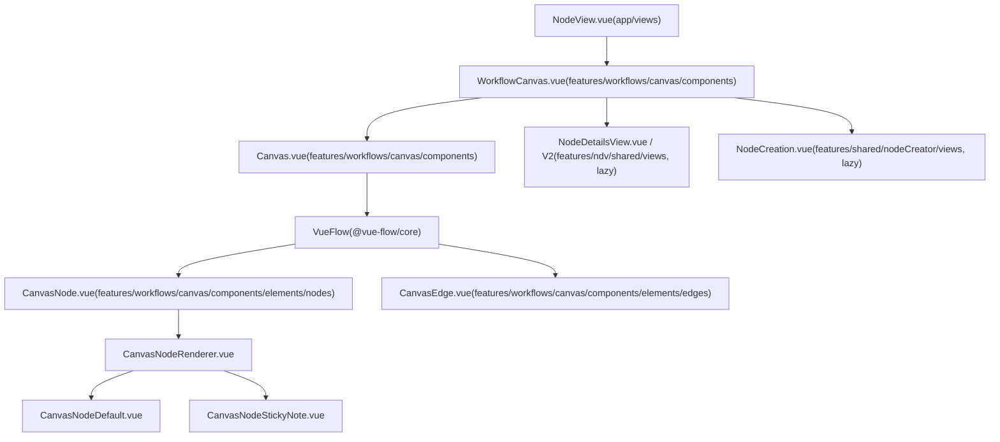

# Workflow Canvas and Node Management

Relevant source files

-   [packages/frontend/@n8n/stores/src/\_\_tests\_\_/setup.ts](https://github.com/n8n-io/n8n/blob/88f170b9/packages/frontend/@n8n/stores/src/__tests__/setup.ts)
-   [packages/frontend/@n8n/stores/src/useAgentRequestStore.test.ts](https://github.com/n8n-io/n8n/blob/88f170b9/packages/frontend/@n8n/stores/src/useAgentRequestStore.test.ts)
-   [packages/frontend/@n8n/stores/src/useAgentRequestStore.ts](https://github.com/n8n-io/n8n/blob/88f170b9/packages/frontend/@n8n/stores/src/useAgentRequestStore.ts)
-   [packages/frontend/editor-ui/MIGRATION\_RECIPE.md](https://github.com/n8n-io/n8n/blob/88f170b9/packages/frontend/editor-ui/MIGRATION_RECIPE.md?plain=1)
-   [packages/frontend/editor-ui/eslint.config.mjs](https://github.com/n8n-io/n8n/blob/88f170b9/packages/frontend/editor-ui/eslint.config.mjs)
-   [packages/frontend/editor-ui/src/\_\_tests\_\_/mocks.ts](https://github.com/n8n-io/n8n/blob/88f170b9/packages/frontend/editor-ui/src/__tests__/mocks.ts)
-   [packages/frontend/editor-ui/src/app/components/MainHeader/MainHeader.vue](https://github.com/n8n-io/n8n/blob/88f170b9/packages/frontend/editor-ui/src/app/components/MainHeader/MainHeader.vue)
-   [packages/frontend/editor-ui/src/app/components/MainHeader/WorkflowDetails.vue](https://github.com/n8n-io/n8n/blob/88f170b9/packages/frontend/editor-ui/src/app/components/MainHeader/WorkflowDetails.vue)
-   [packages/frontend/editor-ui/src/app/composables/\_\_snapshots\_\_/useCanvasOperations.test.ts.snap](https://github.com/n8n-io/n8n/blob/88f170b9/packages/frontend/editor-ui/src/app/composables/__snapshots__/useCanvasOperations.test.ts.snap)
-   [packages/frontend/editor-ui/src/app/composables/useCanvasOperations.test.ts](https://github.com/n8n-io/n8n/blob/88f170b9/packages/frontend/editor-ui/src/app/composables/useCanvasOperations.test.ts)
-   [packages/frontend/editor-ui/src/app/composables/useCanvasOperations.ts](https://github.com/n8n-io/n8n/blob/88f170b9/packages/frontend/editor-ui/src/app/composables/useCanvasOperations.ts)
-   [packages/frontend/editor-ui/src/app/composables/useWorkflowActivate.ts](https://github.com/n8n-io/n8n/blob/88f170b9/packages/frontend/editor-ui/src/app/composables/useWorkflowActivate.ts)
-   [packages/frontend/editor-ui/src/app/composables/useWorkflowExtraction.ts](https://github.com/n8n-io/n8n/blob/88f170b9/packages/frontend/editor-ui/src/app/composables/useWorkflowExtraction.ts)
-   [packages/frontend/editor-ui/src/app/composables/useWorkflowHelpers.test.ts](https://github.com/n8n-io/n8n/blob/88f170b9/packages/frontend/editor-ui/src/app/composables/useWorkflowHelpers.test.ts)
-   [packages/frontend/editor-ui/src/app/composables/useWorkflowHelpers.ts](https://github.com/n8n-io/n8n/blob/88f170b9/packages/frontend/editor-ui/src/app/composables/useWorkflowHelpers.ts)
-   [packages/frontend/editor-ui/src/app/composables/useWorkflowSaving.test.ts](https://github.com/n8n-io/n8n/blob/88f170b9/packages/frontend/editor-ui/src/app/composables/useWorkflowSaving.test.ts)
-   [packages/frontend/editor-ui/src/app/composables/useWorkflowSaving.ts](https://github.com/n8n-io/n8n/blob/88f170b9/packages/frontend/editor-ui/src/app/composables/useWorkflowSaving.ts)
-   [packages/frontend/editor-ui/src/app/composables/useWorkflowState.ts](https://github.com/n8n-io/n8n/blob/88f170b9/packages/frontend/editor-ui/src/app/composables/useWorkflowState.ts)
-   [packages/frontend/editor-ui/src/app/composables/useWorkflowUpdate.test.ts](https://github.com/n8n-io/n8n/blob/88f170b9/packages/frontend/editor-ui/src/app/composables/useWorkflowUpdate.test.ts)
-   [packages/frontend/editor-ui/src/app/composables/useWorkflowUpdate.ts](https://github.com/n8n-io/n8n/blob/88f170b9/packages/frontend/editor-ui/src/app/composables/useWorkflowUpdate.ts)
-   [packages/frontend/editor-ui/src/app/layouts/WorkflowLayout.vue](https://github.com/n8n-io/n8n/blob/88f170b9/packages/frontend/editor-ui/src/app/layouts/WorkflowLayout.vue)
-   [packages/frontend/editor-ui/src/app/stores/workflowDocument.store.test.ts](https://github.com/n8n-io/n8n/blob/88f170b9/packages/frontend/editor-ui/src/app/stores/workflowDocument.store.test.ts)
-   [packages/frontend/editor-ui/src/app/stores/workflowDocument.store.ts](https://github.com/n8n-io/n8n/blob/88f170b9/packages/frontend/editor-ui/src/app/stores/workflowDocument.store.ts)
-   [packages/frontend/editor-ui/src/app/stores/workflowDocument/useWorkflowDocumentConnections.test.ts](https://github.com/n8n-io/n8n/blob/88f170b9/packages/frontend/editor-ui/src/app/stores/workflowDocument/useWorkflowDocumentConnections.test.ts)
-   [packages/frontend/editor-ui/src/app/stores/workflowDocument/useWorkflowDocumentConnections.ts](https://github.com/n8n-io/n8n/blob/88f170b9/packages/frontend/editor-ui/src/app/stores/workflowDocument/useWorkflowDocumentConnections.ts)
-   [packages/frontend/editor-ui/src/app/stores/workflowDocument/useWorkflowDocumentNodes.test.ts](https://github.com/n8n-io/n8n/blob/88f170b9/packages/frontend/editor-ui/src/app/stores/workflowDocument/useWorkflowDocumentNodes.test.ts)
-   [packages/frontend/editor-ui/src/app/stores/workflowDocument/useWorkflowDocumentNodes.ts](https://github.com/n8n-io/n8n/blob/88f170b9/packages/frontend/editor-ui/src/app/stores/workflowDocument/useWorkflowDocumentNodes.ts)
-   [packages/frontend/editor-ui/src/app/stores/workflowSave.store.ts](https://github.com/n8n-io/n8n/blob/88f170b9/packages/frontend/editor-ui/src/app/stores/workflowSave.store.ts)
-   [packages/frontend/editor-ui/src/app/stores/workflows.store.test.ts](https://github.com/n8n-io/n8n/blob/88f170b9/packages/frontend/editor-ui/src/app/stores/workflows.store.test.ts)
-   [packages/frontend/editor-ui/src/app/stores/workflows.store.ts](https://github.com/n8n-io/n8n/blob/88f170b9/packages/frontend/editor-ui/src/app/stores/workflows.store.ts)
-   [packages/frontend/editor-ui/src/app/utils/nodeViewUtils.test.ts](https://github.com/n8n-io/n8n/blob/88f170b9/packages/frontend/editor-ui/src/app/utils/nodeViewUtils.test.ts)
-   [packages/frontend/editor-ui/src/app/utils/nodeViewUtils.ts](https://github.com/n8n-io/n8n/blob/88f170b9/packages/frontend/editor-ui/src/app/utils/nodeViewUtils.ts)
-   [packages/frontend/editor-ui/src/app/views/NodeView.vue](https://github.com/n8n-io/n8n/blob/88f170b9/packages/frontend/editor-ui/src/app/views/NodeView.vue)
-   [packages/frontend/editor-ui/src/features/execution/executions/components/workflow/WorkflowExecutionsInfoAccordion.vue](https://github.com/n8n-io/n8n/blob/88f170b9/packages/frontend/editor-ui/src/features/execution/executions/components/workflow/WorkflowExecutionsInfoAccordion.vue)
-   [packages/frontend/editor-ui/src/features/workflows/canvas/canvas.types.ts](https://github.com/n8n-io/n8n/blob/88f170b9/packages/frontend/editor-ui/src/features/workflows/canvas/canvas.types.ts)
-   [packages/frontend/editor-ui/src/features/workflows/canvas/components/Canvas.vue](https://github.com/n8n-io/n8n/blob/88f170b9/packages/frontend/editor-ui/src/features/workflows/canvas/components/Canvas.vue)
-   [packages/frontend/editor-ui/src/features/workflows/canvas/components/elements/nodes/CanvasNode.vue](https://github.com/n8n-io/n8n/blob/88f170b9/packages/frontend/editor-ui/src/features/workflows/canvas/components/elements/nodes/CanvasNode.vue)
-   [packages/frontend/editor-ui/src/features/workflows/canvas/components/elements/nodes/CanvasNodeToolbar.vue](https://github.com/n8n-io/n8n/blob/88f170b9/packages/frontend/editor-ui/src/features/workflows/canvas/components/elements/nodes/CanvasNodeToolbar.vue)
-   [packages/frontend/editor-ui/src/features/workflows/canvas/components/elements/nodes/render-types/CanvasNodeDefault.vue](https://github.com/n8n-io/n8n/blob/88f170b9/packages/frontend/editor-ui/src/features/workflows/canvas/components/elements/nodes/render-types/CanvasNodeDefault.vue)
-   [packages/frontend/editor-ui/src/features/workflows/canvas/composables/useCanvasMapping.test.ts](https://github.com/n8n-io/n8n/blob/88f170b9/packages/frontend/editor-ui/src/features/workflows/canvas/composables/useCanvasMapping.test.ts)
-   [packages/frontend/editor-ui/src/features/workflows/canvas/composables/useCanvasMapping.ts](https://github.com/n8n-io/n8n/blob/88f170b9/packages/frontend/editor-ui/src/features/workflows/canvas/composables/useCanvasMapping.ts)
-   [packages/frontend/editor-ui/src/features/workflows/workflowHistory/components/WorkflowHistoryButton.test.ts](https://github.com/n8n-io/n8n/blob/88f170b9/packages/frontend/editor-ui/src/features/workflows/workflowHistory/components/WorkflowHistoryButton.test.ts)
-   [packages/frontend/editor-ui/src/features/workflows/workflowHistory/components/WorkflowHistoryButton.vue](https://github.com/n8n-io/n8n/blob/88f170b9/packages/frontend/editor-ui/src/features/workflows/workflowHistory/components/WorkflowHistoryButton.vue)
-   [packages/testing/playwright/services/role-api-helper.ts](https://github.com/n8n-io/n8n/blob/88f170b9/packages/testing/playwright/services/role-api-helper.ts)
-   [packages/testing/playwright/tests/e2e/regression/PAY-4367-node-shifting-cyclic.spec.ts](https://github.com/n8n-io/n8n/blob/88f170b9/packages/testing/playwright/tests/e2e/regression/PAY-4367-node-shifting-cyclic.spec.ts)
-   [packages/testing/playwright/tests/e2e/workflows/editor/canvas/actions.spec.ts](https://github.com/n8n-io/n8n/blob/88f170b9/packages/testing/playwright/tests/e2e/workflows/editor/canvas/actions.spec.ts)
-   [packages/testing/playwright/workflows/Bug\_node\_insertions\_between\_stickies.json](https://github.com/n8n-io/n8n/blob/88f170b9/packages/testing/playwright/workflows/Bug_node_insertions_between_stickies.json)
-   [packages/testing/playwright/workflows/Bug\_node\_insertions\_sticky.json](https://github.com/n8n-io/n8n/blob/88f170b9/packages/testing/playwright/workflows/Bug_node_insertions_sticky.json)
-   [packages/testing/playwright/workflows/Cyclic\_workflow\_for\_insertion\_test.json](https://github.com/n8n-io/n8n/blob/88f170b9/packages/testing/playwright/workflows/Cyclic_workflow_for_insertion_test.json)

## Purpose and Scope

This page covers the frontend workflow editor canvas: how the visual canvas is structured, how nodes are rendered, and how user interactions (add, move, connect, delete, duplicate, run) are processed. It details the integration of **Vue Flow**, the `NodeView` orchestrator, the CRDT-based collaborative editing model, and the mapping logic that transforms n8n's workflow data into a visual graph.

---

## Component Hierarchy

The canvas is hosted inside `NodeView`, which acts as the page-level orchestrator. `WorkflowCanvas` sits between `NodeView` and `Canvas`; it invokes `useCanvasMapping` to produce the typed `CanvasNode[]` / `CanvasConnection[]` arrays consumed by Vue Flow.

**Canvas Component Tree**

Sources: [packages/frontend/editor-ui/src/app/views/NodeView.vue15-155](https://github.com/n8n-io/n8n/blob/88f170b9/packages/frontend/editor-ui/src/app/views/NodeView.vue#L15-L155) [packages/frontend/editor-ui/src/features/workflows/canvas/components/Canvas.vue1-70](https://github.com/n8n-io/n8n/blob/88f170b9/packages/frontend/editor-ui/src/features/workflows/canvas/components/Canvas.vue#L1-L70) [packages/frontend/editor-ui/src/features/workflows/canvas/components/elements/nodes/CanvasNode.vue1-40](https://github.com/n8n-io/n8n/blob/88f170b9/packages/frontend/editor-ui/src/features/workflows/canvas/components/elements/nodes/CanvasNode.vue#L1-L40)

---

## NodeView.vue — Page-Level Orchestrator

`NodeView` ([packages/frontend/editor-ui/src/app/views/NodeView.vue](https://github.com/n8n-io/n8n/blob/88f170b9/packages/frontend/editor-ui/src/app/views/NodeView.vue)) is the entry point for the workflow editor. It manages the lifecycle of the workflow document and coordinates between the canvas and the sidebar panels (NDV, Node Creator).

### Workspace Lifecycle and Data Flow

When a workflow is loaded, `NodeView` initializes the `workflowDocumentStore`. This store is a specialized Pinia store instance created per workflow ID, providing a scoped context for nodes, connections, and metadata.

> **[Mermaid sequence]**
> *(图表结构无法解析)*

Sources: [packages/frontend/editor-ui/src/app/views/NodeView.vue1-157](https://github.com/n8n-io/n8n/blob/88f170b9/packages/frontend/editor-ui/src/app/views/NodeView.vue#L1-L157) [packages/frontend/editor-ui/src/app/stores/workflowDocument.store.ts35-122](https://github.com/n8n-io/n8n/blob/88f170b9/packages/frontend/editor-ui/src/app/stores/workflowDocument.store.ts#L35-L122)

### Read-Only and Collaborative State

`NodeView` tracks if the canvas should be interactive. `isCanvasReadOnly` is computed based on:

-   **Source Control**: `sourceControlStore.preferences.branchReadOnly`.
-   **RBAC**: `getResourcePermissions(scopes).workflow.update`.
-   **Collaboration**: `collaborationStore.shouldBeReadOnly` (when another user has a lock).
-   **Archival**: `workflowDocumentStore.isArchived`.

Sources: [packages/frontend/editor-ui/src/app/views/NodeView.vue288-302](https://github.com/n8n-io/n8n/blob/88f170b9/packages/frontend/editor-ui/src/app/views/NodeView.vue#L288-L302) [packages/frontend/editor-ui/src/app/composables/useWorkflowSaving.ts86-93](https://github.com/n8n-io/n8n/blob/88f170b9/packages/frontend/editor-ui/src/app/composables/useWorkflowSaving.ts#L86-L93)

---

## Workflow Document Store and CRDTs

n8n uses a decentralized store architecture where workflow data is managed by `useWorkflowDocumentStore` ([packages/frontend/editor-ui/src/app/stores/workflowDocument.store.ts](https://github.com/n8n-io/n8n/blob/88f170b9/packages/frontend/editor-ui/src/app/stores/workflowDocument.store.ts)). This store is composed of multiple functional units:

-   `useWorkflowDocumentNodes`: Manages the `INodeUi[]` array.
-   `useWorkflowDocumentConnections`: Manages the `IConnections` object.
-   `useWorkflowDocumentPinData`: Handles node-level data pinning.

### State Dirty Tracking

The store exposes an `onStateDirty` hook. When nodes or connections are modified, `useUIStore().markStateDirty()` is called, which triggers the "Unsaved Changes" UI and enables the Save button.

Sources: [packages/frontend/editor-ui/src/app/stores/workflowDocument.store.ts60-121](https://github.com/n8n-io/n8n/blob/88f170b9/packages/frontend/editor-ui/src/app/stores/workflowDocument.store.ts#L60-L121) [packages/frontend/editor-ui/src/app/stores/workflowDocument/useWorkflowDocumentNodes.ts1-50](https://github.com/n8n-io/n8n/blob/88f170b9/packages/frontend/editor-ui/src/app/stores/workflowDocument/useWorkflowDocumentNodes.ts#L1-L50)

---

## useCanvasMapping — Data Transformation

`useCanvasMapping` ([packages/frontend/editor-ui/src/features/workflows/canvas/composables/useCanvasMapping.ts](https://github.com/n8n-io/n8n/blob/88f170b9/packages/frontend/editor-ui/src/features/workflows/canvas/composables/useCanvasMapping.ts)) is the bridge between n8n's `INodeUi` objects and Vue Flow's `Node` objects. It reactively computes the visual representation of nodes based on their state.

### Mapping Logic

| n8n Entity | Canvas Property | Logic Source |
| --- | --- | --- |
| `INodeUi.position` | `position` | Snapped to `GRID_SIZE` (10px) |
| `INodeUi.type` | `type` | Mapped via `CanvasNodeRenderType` |
| `NodeIssues` | `data.issues` | Resolved via `useNodeHelpers` |
| `ExecutionSummary` | `data.execution` | Pulled from `workflowDocumentStore` |
| `IPinData` | `data.pinnedData` | Checked against `workflowDocumentStore.pinData` |

Sources: [packages/frontend/editor-ui/src/features/workflows/canvas/composables/useCanvasMapping.ts71-167](https://github.com/n8n-io/n8n/blob/88f170b9/packages/frontend/editor-ui/src/features/workflows/canvas/composables/useCanvasMapping.ts#L71-L167) [packages/frontend/editor-ui/src/app/utils/nodeViewUtils.ts77-86](https://github.com/n8n-io/n8n/blob/88f170b9/packages/frontend/editor-ui/src/app/utils/nodeViewUtils.ts#L77-L86)

---

## Canvas Operations

`useCanvasOperations` ([packages/frontend/editor-ui/src/app/composables/useCanvasOperations.ts](https://github.com/n8n-io/n8n/blob/88f170b9/packages/frontend/editor-ui/src/app/composables/useCanvasOperations.ts)) provides the mutation API for the workflow. Most operations are wrapped in **History Commands** to support Undo/Redo.

### Core Functions

-   `addNodes(nodes, options)`: Injects new nodes into the document.
-   `createConnection(connection, options)`: Validates and creates a link between ports.
-   `deleteNodes(ids)`: Removes nodes and their associated connections.
-   `updateNodesPosition(events)`: Updates coordinates in the store after a drag.

### Node Insertion Logic

When a node is dropped onto an existing connection, n8n performs an "Auto-Insert":

1.  The existing connection is removed.
2.  Two new connections are created: `Source -> New Node` and `New Node -> Target`.
3.  Upstream/Downstream nodes are shifted using `PUSH_NODES_OFFSET` to make room.

Sources: [packages/frontend/editor-ui/src/app/composables/useCanvasOperations.ts39-46](https://github.com/n8n-io/n8n/blob/88f170b9/packages/frontend/editor-ui/src/app/composables/useCanvasOperations.ts#L39-L46) [packages/frontend/editor-ui/src/app/composables/useCanvasOperations.ts300-450](https://github.com/n8n-io/n8n/blob/88f170b9/packages/frontend/editor-ui/src/app/composables/useCanvasOperations.ts#L300-L450)

---

## Node Management Lifecycle

### Creation

Nodes are created via the `NodeCreation.vue` component. When a node is selected:

1.  `nodeTypesStore.getNodeType` retrieves the metadata.
2.  `useUniqueNodeName.getUniqueNodeName` ensures no name collisions.
3.  `AddNodeCommand` is pushed to the `historyStore`.

### Execution and Status

Node status is reflected on the canvas via `CanvasNodeStatusIcons.vue`.

-   **Success**: Node executed successfully in the current session.
-   **Error**: Execution failed at this node.
-   **Waiting**: Node is a `Wait` or `Webhook` node awaiting external input.
-   **Dirty**: Parameters have changed since the last execution (`CanvasNodeDirtiness`).

Sources: [packages/frontend/editor-ui/src/app/stores/workflows.store.ts179-196](https://github.com/n8n-io/n8n/blob/88f170b9/packages/frontend/editor-ui/src/app/stores/workflows.store.ts#L179-L196) [packages/frontend/editor-ui/src/app/composables/useRunWorkflow.ts1-100](https://github.com/n8n-io/n8n/blob/88f170b9/packages/frontend/editor-ui/src/app/composables/useRunWorkflow.ts#L1-L100)

---

## Collaborative Editing

Collaboration is handled via the `collaborationStore`. When multiple users edit the same workflow:

1.  A **Presence Pill** (`N8nCanvasCollaborationPill`) appears on the canvas.
2.  **Locks**: When a user starts editing a node (opening NDV), they acquire a lock. Other users see the node as "Being edited by \[User\]".
3.  **Real-time Updates**: Changes are pushed via WebSockets and applied to the local `workflowDocumentStore`.

Sources: [packages/frontend/editor-ui/src/app/views/NodeView.vue136-140](https://github.com/n8n-io/n8n/blob/88f170b9/packages/frontend/editor-ui/src/app/views/NodeView.vue#L136-L140) [packages/frontend/editor-ui/src/app/composables/useWorkflowSaving.ts161-175](https://github.com/n8n-io/n8n/blob/88f170b9/packages/frontend/editor-ui/src/app/composables/useWorkflowSaving.ts#L161-L175)

---

## Summary of Key Files

| File Path | Role |
| --- | --- |
| `app/views/NodeView.vue` | Main editor page orchestrator. |
| `app/composables/useCanvasOperations.ts` | Mutation API for nodes/connections. |
| `app/stores/workflowDocument.store.ts` | Scoped store for workflow data. |
| `features/workflows/canvas/composables/useCanvasMapping.ts` | Vue Flow data transformation. |
| `app/utils/nodeViewUtils.ts` | Grid snapping and layout constants. |

Sources: [packages/frontend/editor-ui/src/app/views/NodeView.vue1-157](https://github.com/n8n-io/n8n/blob/88f170b9/packages/frontend/editor-ui/src/app/views/NodeView.vue#L1-L157) [packages/frontend/editor-ui/src/app/composables/useCanvasOperations.ts1-193](https://github.com/n8n-io/n8n/blob/88f170b9/packages/frontend/editor-ui/src/app/composables/useCanvasOperations.ts#L1-L193) [packages/frontend/editor-ui/src/app/stores/workflowDocument.store.ts1-158](https://github.com/n8n-io/n8n/blob/88f170b9/packages/frontend/editor-ui/src/app/stores/workflowDocument.store.ts#L1-L158)
