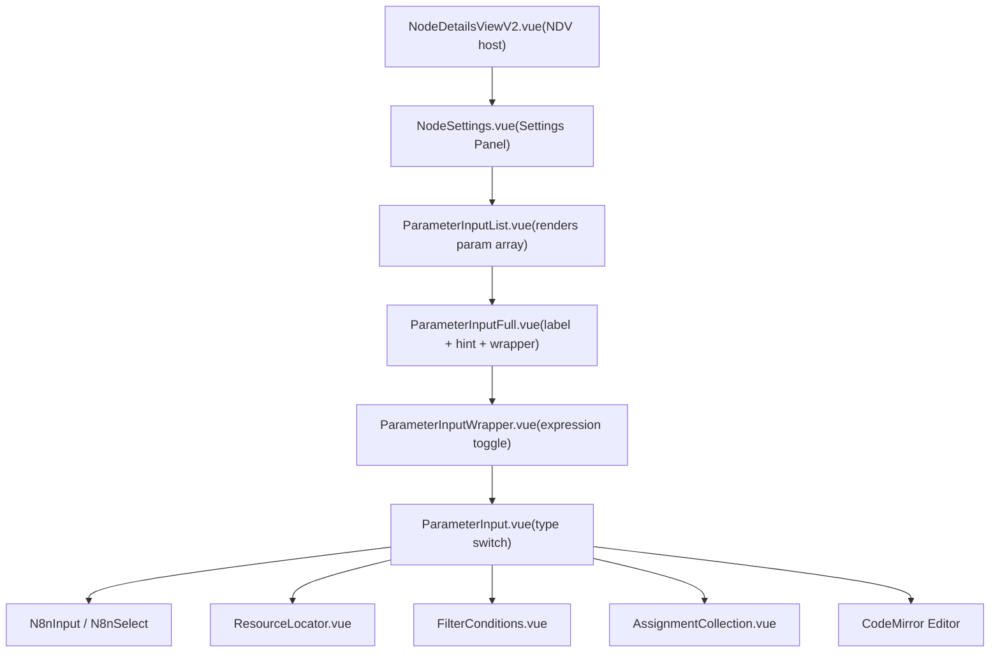

# Parameter Input and Expression Editor

Relevant source files

-   [packages/frontend/editor-ui/src/app/components/Draggable.test.ts](https://github.com/n8n-io/n8n/blob/88f170b9/packages/frontend/editor-ui/src/app/components/Draggable.test.ts)
-   [packages/frontend/editor-ui/src/app/components/Draggable.vue](https://github.com/n8n-io/n8n/blob/88f170b9/packages/frontend/editor-ui/src/app/components/Draggable.vue)
-   [packages/frontend/editor-ui/src/app/components/NodeTitle.vue](https://github.com/n8n-io/n8n/blob/88f170b9/packages/frontend/editor-ui/src/app/components/NodeTitle.vue)
-   [packages/frontend/editor-ui/src/app/composables/useDataSchema.test.ts](https://github.com/n8n-io/n8n/blob/88f170b9/packages/frontend/editor-ui/src/app/composables/useDataSchema.test.ts)
-   [packages/frontend/editor-ui/src/app/composables/useDataSchema.ts](https://github.com/n8n-io/n8n/blob/88f170b9/packages/frontend/editor-ui/src/app/composables/useDataSchema.ts)
-   [packages/frontend/editor-ui/src/app/composables/usePinnedData.test.ts](https://github.com/n8n-io/n8n/blob/88f170b9/packages/frontend/editor-ui/src/app/composables/usePinnedData.test.ts)
-   [packages/frontend/editor-ui/src/app/composables/usePinnedData.ts](https://github.com/n8n-io/n8n/blob/88f170b9/packages/frontend/editor-ui/src/app/composables/usePinnedData.ts)
-   [packages/frontend/editor-ui/src/features/execution/logs/components/LogsViewRunData.vue](https://github.com/n8n-io/n8n/blob/88f170b9/packages/frontend/editor-ui/src/features/execution/logs/components/LogsViewRunData.vue)
-   [packages/frontend/editor-ui/src/features/ndv/panel/components/InputNodeSelect.vue](https://github.com/n8n-io/n8n/blob/88f170b9/packages/frontend/editor-ui/src/features/ndv/panel/components/InputNodeSelect.vue)
-   [packages/frontend/editor-ui/src/features/ndv/panel/components/InputPanel.test.ts](https://github.com/n8n-io/n8n/blob/88f170b9/packages/frontend/editor-ui/src/features/ndv/panel/components/InputPanel.test.ts)
-   [packages/frontend/editor-ui/src/features/ndv/panel/components/InputPanel.vue](https://github.com/n8n-io/n8n/blob/88f170b9/packages/frontend/editor-ui/src/features/ndv/panel/components/InputPanel.vue)
-   [packages/frontend/editor-ui/src/features/ndv/panel/components/NDVEmptyState.vue](https://github.com/n8n-io/n8n/blob/88f170b9/packages/frontend/editor-ui/src/features/ndv/panel/components/NDVEmptyState.vue)
-   [packages/frontend/editor-ui/src/features/ndv/panel/components/NDVFloatingNodes.vue](https://github.com/n8n-io/n8n/blob/88f170b9/packages/frontend/editor-ui/src/features/ndv/panel/components/NDVFloatingNodes.vue)
-   [packages/frontend/editor-ui/src/features/ndv/panel/components/NDVHeader.vue](https://github.com/n8n-io/n8n/blob/88f170b9/packages/frontend/editor-ui/src/features/ndv/panel/components/NDVHeader.vue)
-   [packages/frontend/editor-ui/src/features/ndv/panel/components/NDVSubConnections.vue](https://github.com/n8n-io/n8n/blob/88f170b9/packages/frontend/editor-ui/src/features/ndv/panel/components/NDVSubConnections.vue)
-   [packages/frontend/editor-ui/src/features/ndv/panel/components/OutputPanel.vue](https://github.com/n8n-io/n8n/blob/88f170b9/packages/frontend/editor-ui/src/features/ndv/panel/components/OutputPanel.vue)
-   [packages/frontend/editor-ui/src/features/ndv/panel/components/TriggerPanel.test.ts](https://github.com/n8n-io/n8n/blob/88f170b9/packages/frontend/editor-ui/src/features/ndv/panel/components/TriggerPanel.test.ts)
-   [packages/frontend/editor-ui/src/features/ndv/panel/components/TriggerPanel.vue](https://github.com/n8n-io/n8n/blob/88f170b9/packages/frontend/editor-ui/src/features/ndv/panel/components/TriggerPanel.vue)
-   [packages/frontend/editor-ui/src/features/ndv/panel/components/\_\_snapshots\_\_/InputPanel.test.ts.snap](https://github.com/n8n-io/n8n/blob/88f170b9/packages/frontend/editor-ui/src/features/ndv/panel/components/__snapshots__/InputPanel.test.ts.snap)
-   [packages/frontend/editor-ui/src/features/ndv/parameters/components/ParameterInputList.test.ts](https://github.com/n8n-io/n8n/blob/88f170b9/packages/frontend/editor-ui/src/features/ndv/parameters/components/ParameterInputList.test.ts)
-   [packages/frontend/editor-ui/src/features/ndv/parameters/components/ParameterInputList.vue](https://github.com/n8n-io/n8n/blob/88f170b9/packages/frontend/editor-ui/src/features/ndv/parameters/components/ParameterInputList.vue)
-   [packages/frontend/editor-ui/src/features/ndv/runData/components/RunData.test.ts](https://github.com/n8n-io/n8n/blob/88f170b9/packages/frontend/editor-ui/src/features/ndv/runData/components/RunData.test.ts)
-   [packages/frontend/editor-ui/src/features/ndv/runData/components/RunData.vue](https://github.com/n8n-io/n8n/blob/88f170b9/packages/frontend/editor-ui/src/features/ndv/runData/components/RunData.vue)
-   [packages/frontend/editor-ui/src/features/ndv/runData/components/RunDataJson.vue](https://github.com/n8n-io/n8n/blob/88f170b9/packages/frontend/editor-ui/src/features/ndv/runData/components/RunDataJson.vue)
-   [packages/frontend/editor-ui/src/features/ndv/runData/components/RunDataJsonActions.vue](https://github.com/n8n-io/n8n/blob/88f170b9/packages/frontend/editor-ui/src/features/ndv/runData/components/RunDataJsonActions.vue)
-   [packages/frontend/editor-ui/src/features/ndv/runData/components/VirtualSchema.test.ts](https://github.com/n8n-io/n8n/blob/88f170b9/packages/frontend/editor-ui/src/features/ndv/runData/components/VirtualSchema.test.ts)
-   [packages/frontend/editor-ui/src/features/ndv/runData/components/VirtualSchema.vue](https://github.com/n8n-io/n8n/blob/88f170b9/packages/frontend/editor-ui/src/features/ndv/runData/components/VirtualSchema.vue)
-   [packages/frontend/editor-ui/src/features/ndv/runData/schemaPreview.store.test.ts](https://github.com/n8n-io/n8n/blob/88f170b9/packages/frontend/editor-ui/src/features/ndv/runData/schemaPreview.store.test.ts)
-   [packages/frontend/editor-ui/src/features/ndv/runData/schemaPreview.store.ts](https://github.com/n8n-io/n8n/blob/88f170b9/packages/frontend/editor-ui/src/features/ndv/runData/schemaPreview.store.ts)
-   [packages/frontend/editor-ui/src/features/ndv/settings/components/NodeSettings.vue](https://github.com/n8n-io/n8n/blob/88f170b9/packages/frontend/editor-ui/src/features/ndv/settings/components/NodeSettings.vue)
-   [packages/frontend/editor-ui/src/features/ndv/settings/composables/useNodeSettingsParameters.test.ts](https://github.com/n8n-io/n8n/blob/88f170b9/packages/frontend/editor-ui/src/features/ndv/settings/composables/useNodeSettingsParameters.test.ts)
-   [packages/frontend/editor-ui/src/features/ndv/settings/composables/useNodeSettingsParameters.ts](https://github.com/n8n-io/n8n/blob/88f170b9/packages/frontend/editor-ui/src/features/ndv/settings/composables/useNodeSettingsParameters.ts)
-   [packages/frontend/editor-ui/src/features/ndv/shared/ndv.store.ts](https://github.com/n8n-io/n8n/blob/88f170b9/packages/frontend/editor-ui/src/features/ndv/shared/ndv.store.ts)
-   [packages/frontend/editor-ui/src/features/ndv/shared/ndv.utils.ts](https://github.com/n8n-io/n8n/blob/88f170b9/packages/frontend/editor-ui/src/features/ndv/shared/ndv.utils.ts)
-   [packages/frontend/editor-ui/src/features/ndv/shared/views/NodeDetailsView.vue](https://github.com/n8n-io/n8n/blob/88f170b9/packages/frontend/editor-ui/src/features/ndv/shared/views/NodeDetailsView.vue)
-   [packages/frontend/editor-ui/src/features/ndv/shared/views/NodeDetailsViewV2.vue](https://github.com/n8n-io/n8n/blob/88f170b9/packages/frontend/editor-ui/src/features/ndv/shared/views/NodeDetailsViewV2.vue)
-   [packages/frontend/editor-ui/src/features/shared/editors/components/SqlEditor/SQLEditor.test.ts](https://github.com/n8n-io/n8n/blob/88f170b9/packages/frontend/editor-ui/src/features/shared/editors/components/SqlEditor/SQLEditor.test.ts)
-   [packages/nodes-base/nodes/Switch/V3/test/switch.expression.workflow.json](https://github.com/n8n-io/n8n/blob/88f170b9/packages/nodes-base/nodes/Switch/V3/test/switch.expression.workflow.json)
-   [packages/nodes-base/nodes/Switch/V3/test/switch.rules.workflow.json](https://github.com/n8n-io/n8n/blob/88f170b9/packages/nodes-base/nodes/Switch/V3/test/switch.rules.workflow.json)
-   [packages/nodes-base/scripts/validate-schema-versions.js](https://github.com/n8n-io/n8n/blob/88f170b9/packages/nodes-base/scripts/validate-schema-versions.js)
-   [packages/testing/playwright/pages/components/FocusPanel.ts](https://github.com/n8n-io/n8n/blob/88f170b9/packages/testing/playwright/pages/components/FocusPanel.ts)
-   [packages/testing/playwright/tests/e2e/workflows/editor/ndv/resource-mapper.spec.ts](https://github.com/n8n-io/n8n/blob/88f170b9/packages/testing/playwright/tests/e2e/workflows/editor/ndv/resource-mapper.spec.ts)
-   [packages/testing/playwright/workflows/Test\_workflow\_filter.json](https://github.com/n8n-io/n8n/blob/88f170b9/packages/testing/playwright/workflows/Test_workflow_filter.json)
-   [packages/workflow/src/run-execution-data-factory.ts](https://github.com/n8n-io/n8n/blob/88f170b9/packages/workflow/src/run-execution-data-factory.ts)
-   [packages/workflow/src/run-execution-data/run-execution-data.ts](https://github.com/n8n-io/n8n/blob/88f170b9/packages/workflow/src/run-execution-data/run-execution-data.ts)
-   [packages/workflow/src/run-execution-data/run-execution-data.v0.ts](https://github.com/n8n-io/n8n/blob/88f170b9/packages/workflow/src/run-execution-data/run-execution-data.v0.ts)
-   [packages/workflow/src/run-execution-data/run-execution-data.v1.ts](https://github.com/n8n-io/n8n/blob/88f170b9/packages/workflow/src/run-execution-data/run-execution-data.v1.ts)

This page documents the parameter input component tree used inside the Node Details View (NDV), the CodeMirror-based expression editor, and the specialized sub-components that handle complex parameter types such as filter conditions, assignment collections, resource locators, and code editors.

---

## Overview

When a user opens a node in the canvas, the NDV renders each parameter declared in the node's `INodeTypeDescription` through a layered component tree. The tree determines which input widget to display based on the parameter's `type` field and whether the parameter currently holds a raw value or a dynamic expression.

The NDV architecture is primarily split between the **Settings** (parameters/credentials) and **Run Data** (input/output/schema) panels.

**Component tree summary:**

Sources: [packages/frontend/editor-ui/src/features/ndv/shared/views/NodeDetailsViewV2.vue10](https://github.com/n8n-io/n8n/blob/88f170b9/packages/frontend/editor-ui/src/features/ndv/shared/views/NodeDetailsViewV2.vue#L10-L10) [packages/frontend/editor-ui/src/features/ndv/settings/components/NodeSettings.vue24](https://github.com/n8n-io/n8n/blob/88f170b9/packages/frontend/editor-ui/src/features/ndv/settings/components/NodeSettings.vue#L24-L24) [packages/frontend/editor-ui/src/features/ndv/parameters/components/ParameterInputList.vue33-39](https://github.com/n8n-io/n8n/blob/88f170b9/packages/frontend/editor-ui/src/features/ndv/parameters/components/ParameterInputList.vue#L33-L39)

---

## Parameter Input Component Tree

### `ParameterInputList.vue`

`ParameterInputList` iterates over an array of `INodeProperties` and delegates each entry to `ParameterInputFull`. It manages:

-   **Visibility Logic**: Uses `shouldDisplayNodeParameter` from `useNodeSettingsParameters` to evaluate `displayOptions` and `disabledOptions` [packages/frontend/editor-ui/src/features/ndv/parameters/components/ParameterInputList.vue175-192](https://github.com/n8n-io/n8n/blob/88f170b9/packages/frontend/editor-ui/src/features/ndv/parameters/components/ParameterInputList.vue#L175-L192)
-   **Special Node Handling**: Applies transformations for specific node types like `Form Trigger`, `Form`, and `Wait` nodes [packages/frontend/editor-ui/src/features/ndv/parameters/components/ParameterInputList.vue196-205](https://github.com/n8n-io/n8n/blob/88f170b9/packages/frontend/editor-ui/src/features/ndv/parameters/components/ParameterInputList.vue#L196-L205)
-   **Performance**: Uses `throttledWatch` to react to parameter or node value changes without excessive re-renders [packages/frontend/editor-ui/src/features/ndv/parameters/components/ParameterInputList.vue170-172](https://github.com/n8n-io/n8n/blob/88f170b9/packages/frontend/editor-ui/src/features/ndv/parameters/components/ParameterInputList.vue#L170-L172)

Sources: [packages/frontend/editor-ui/src/features/ndv/parameters/components/ParameterInputList.vue170-213](https://github.com/n8n-io/n8n/blob/88f170b9/packages/frontend/editor-ui/src/features/ndv/parameters/components/ParameterInputList.vue#L170-L213) [packages/frontend/editor-ui/src/features/ndv/settings/composables/useNodeSettingsParameters.ts175-181](https://github.com/n8n-io/n8n/blob/88f170b9/packages/frontend/editor-ui/src/features/ndv/settings/composables/useNodeSettingsParameters.ts#L175-L181)

### `NodeSettings.vue`

The central container for a node's configuration within the NDV. It coordinates:

-   **Tabs**: Manages switching between `params`, `credentials`, and `settings` (retry, error handling) [packages/frontend/editor-ui/src/features/ndv/settings/components/NodeSettings.vue151](https://github.com/n8n-io/n8n/blob/88f170b9/packages/frontend/editor-ui/src/features/ndv/settings/components/NodeSettings.vue#L151-L151)
-   **Initial Values**: Populates `nodeValues` using `getNodeSettingsInitialValues` [packages/frontend/editor-ui/src/features/ndv/settings/components/NodeSettings.vue122](https://github.com/n8n-io/n8n/blob/88f170b9/packages/frontend/editor-ui/src/features/ndv/settings/components/NodeSettings.vue#L122-L122)
-   **Parameter Updates**: Delegates value changes to `updateNodeParameter` in `useNodeSettingsParameters` [packages/frontend/editor-ui/src/features/ndv/settings/composables/useNodeSettingsParameters.ts55-61](https://github.com/n8n-io/n8n/blob/88f170b9/packages/frontend/editor-ui/src/features/ndv/settings/composables/useNodeSettingsParameters.ts#L55-L61)

Sources: [packages/frontend/editor-ui/src/features/ndv/settings/components/NodeSettings.vue122-151](https://github.com/n8n-io/n8n/blob/88f170b9/packages/frontend/editor-ui/src/features/ndv/settings/components/NodeSettings.vue#L122-L151) [packages/frontend/editor-ui/src/features/ndv/settings/composables/useNodeSettingsParameters.ts55-155](https://github.com/n8n-io/n8n/blob/88f170b9/packages/frontend/editor-ui/src/features/ndv/settings/composables/useNodeSettingsParameters.ts#L55-L155)

---

## Run Data and Schema Preview

The NDV provides a specialized view for inspecting data flowing through the node.

### `RunData.vue`

This component displays the actual execution results. It supports multiple display modes:

-   **Table**: Standard grid view for JSON data.
-   **JSON**: Raw object tree view.
-   **Binary**: File preview for images, PDFs, and generic downloads [packages/frontend/editor-ui/src/features/ndv/runData/components/RunData.vue78](https://github.com/n8n-io/n8n/blob/88f170b9/packages/frontend/editor-ui/src/features/ndv/runData/components/RunData.vue#L78-L78)
-   **Schema**: A structural view of the data [packages/frontend/editor-ui/src/features/ndv/runData/components/RunData.vue102](https://github.com/n8n-io/n8n/blob/88f170b9/packages/frontend/editor-ui/src/features/ndv/runData/components/RunData.vue#L102-L102)

Sources: [packages/frontend/editor-ui/src/features/ndv/runData/components/RunData.vue99-107](https://github.com/n8n-io/n8n/blob/88f170b9/packages/frontend/editor-ui/src/features/ndv/runData/components/RunData.vue#L99-L107)

### `VirtualSchema.vue`

The Schema view allows users to map data into parameters via drag-and-drop.

-   **Schema Generation**: Uses `useDataSchema` to derive structural information from execution data or JSON schemas [packages/frontend/editor-ui/src/features/ndv/runData/components/VirtualSchema.vue96-97](https://github.com/n8n-io/n8n/blob/88f170b9/packages/frontend/editor-ui/src/features/ndv/runData/components/VirtualSchema.vue#L96-L97)
-   **Virtual Scrolling**: Employs `vue-virtual-scroller` to handle large datasets efficiently [packages/frontend/editor-ui/src/features/ndv/runData/components/VirtualSchema.vue35-39](https://github.com/n8n-io/n8n/blob/88f170b9/packages/frontend/editor-ui/src/features/ndv/runData/components/VirtualSchema.vue#L35-L39)
-   **Mapping**: Integrates with `MappingPill` and `Draggable` components to facilitate expression building [packages/frontend/editor-ui/src/features/ndv/runData/components/VirtualSchema.vue4-6](https://github.com/n8n-io/n8n/blob/88f170b9/packages/frontend/editor-ui/src/features/ndv/runData/components/VirtualSchema.vue#L4-L6)

Sources: [packages/frontend/editor-ui/src/features/ndv/runData/components/VirtualSchema.vue96-124](https://github.com/n8n-io/n8n/blob/88f170b9/packages/frontend/editor-ui/src/features/ndv/runData/components/VirtualSchema.vue#L96-L124) [packages/frontend/editor-ui/src/features/ndv/runData/components/VirtualSchema.vue35-40](https://github.com/n8n-io/n8n/blob/88f170b9/packages/frontend/editor-ui/src/features/ndv/runData/components/VirtualSchema.vue#L35-L40)

---

## Expression Editor and Autocomplete

n8n expressions use the `={{ ... }}` syntax. The editor is built on **CodeMirror 6**.

### Data Flow: Expression Resolution

> **[Mermaid sequence]**
> *(图表结构无法解析)*

Sources: [packages/frontend/editor-ui/src/features/ndv/settings/composables/useNodeSettingsParameters.ts41-46](https://github.com/n8n-io/n8n/blob/88f170b9/packages/frontend/editor-ui/src/features/ndv/settings/composables/useNodeSettingsParameters.ts#L41-L46) [packages/frontend/editor-ui/src/features/ndv/runData/components/VirtualSchema.vue99-100](https://github.com/n8n-io/n8n/blob/88f170b9/packages/frontend/editor-ui/src/features/ndv/runData/components/VirtualSchema.vue#L99-L100)

---

## Specialized Input Components

### Filter Conditions

Used in nodes like **Filter** or **If**.

-   Implemented in `FilterConditions.vue`.
-   Manages an array of conditions consisting of a `leftValue`, an `operator`, and a `rightValue` [packages/frontend/editor-ui/src/features/ndv/parameters/components/FilterConditions/FilterConditions.vue35](https://github.com/n8n-io/n8n/blob/88f170b9/packages/frontend/editor-ui/src/features/ndv/parameters/components/FilterConditions/FilterConditions.vue#L35-L35)

Sources: [packages/frontend/editor-ui/src/features/ndv/parameters/components/ParameterInputList.vue35](https://github.com/n8n-io/n8n/blob/88f170b9/packages/frontend/editor-ui/src/features/ndv/parameters/components/ParameterInputList.vue#L35-L35)

### Assignment Collection

Used in the **Set** node to define new fields.

-   Implemented in `AssignmentCollection.vue`.
-   Allows users to define multiple field assignments with specific types (String, Number, Boolean, etc.) [packages/frontend/editor-ui/src/features/ndv/parameters/components/AssignmentCollection/AssignmentCollection.vue33](https://github.com/n8n-io/n8n/blob/88f170b9/packages/frontend/editor-ui/src/features/ndv/parameters/components/AssignmentCollection/AssignmentCollection.vue#L33-L33)

Sources: [packages/frontend/editor-ui/src/features/ndv/parameters/components/ParameterInputList.vue33](https://github.com/n8n-io/n8n/blob/88f170b9/packages/frontend/editor-ui/src/features/ndv/parameters/components/ParameterInputList.vue#L33-L33)

### Resource Locator

Used for parameters that require selecting a remote resource (e.g., a specific Trello Board or Google Sheet).

-   **Modes**: Supports `list` (dropdown), `id` (manual entry), and `url` (parsing from link) [packages/frontend/editor-ui/src/features/ndv/parameters/components/ResourceMapper/ResourceMapper.vue39](https://github.com/n8n-io/n8n/blob/88f170b9/packages/frontend/editor-ui/src/features/ndv/parameters/components/ResourceMapper/ResourceMapper.vue#L39-L39)
-   **Dynamic Loading**: Uses `loadOptions` to fetch data from the integration API via the backend.

Sources: [packages/frontend/editor-ui/src/features/ndv/parameters/components/ParameterInputList.vue39](https://github.com/n8n-io/n8n/blob/88f170b9/packages/frontend/editor-ui/src/features/ndv/parameters/components/ParameterInputList.vue#L39-L39)

---

## Trigger Panel

Specialized for trigger nodes (e.g., Webhook, Chat Trigger) to provide runtime status.

-   **Status Indicators**: Shows if a node is "Listening" for events [packages/frontend/editor-ui/src/features/ndv/panel/components/TriggerPanel.vue172-188](https://github.com/n8n-io/n8n/blob/88f170b9/packages/frontend/editor-ui/src/features/ndv/panel/components/TriggerPanel.vue#L172-L188)
-   **URLs**: Displays Test and Production URLs for Webhook-based nodes [packages/frontend/editor-ui/src/features/ndv/panel/components/TriggerPanel.vue156-162](https://github.com/n8n-io/n8n/blob/88f170b9/packages/frontend/editor-ui/src/features/ndv/panel/components/TriggerPanel.vue#L156-L162)
-   **Polling**: Provides manual fetch buttons for polling-based triggers [packages/frontend/editor-ui/src/features/ndv/panel/components/TriggerPanel.vue168-170](https://github.com/n8n-io/n8n/blob/88f170b9/packages/frontend/editor-ui/src/features/ndv/panel/components/TriggerPanel.vue#L168-L170)

Sources: [packages/frontend/editor-ui/src/features/ndv/panel/components/TriggerPanel.vue172-205](https://github.com/n8n-io/n8n/blob/88f170b9/packages/frontend/editor-ui/src/features/ndv/panel/components/TriggerPanel.vue#L172-L205)

---

## State Management and Data Access

The NDV heavily relies on Pinia stores for its state:

-   `useNDVStore`: Tracks the active node, panel states, and pinned data status [packages/frontend/editor-ui/src/features/ndv/shared/ndv.store.ts1](https://github.com/n8n-io/n8n/blob/88f170b9/packages/frontend/editor-ui/src/features/ndv/shared/ndv.store.ts#L1-L1)
-   `useWorkflowDocumentStore`: Provides access to the workflow's nodes, connections, and pinned data [packages/frontend/editor-ui/src/app/stores/workflowDocument.store.ts1](https://github.com/n8n-io/n8n/blob/88f170b9/packages/frontend/editor-ui/src/app/stores/workflowDocument.store.ts#L1-L1)
-   `useNodeTypesStore`: Stores the metadata and property definitions for all registered node types [packages/frontend/editor-ui/src/app/stores/nodeTypes.store.ts1](https://github.com/n8n-io/n8n/blob/88f170b9/packages/frontend/editor-ui/src/app/stores/nodeTypes.store.ts#L1-L1)

Sources: [packages/frontend/editor-ui/src/features/ndv/settings/components/NodeSettings.vue125-130](https://github.com/n8n-io/n8n/blob/88f170b9/packages/frontend/editor-ui/src/features/ndv/settings/components/NodeSettings.vue#L125-L130)
