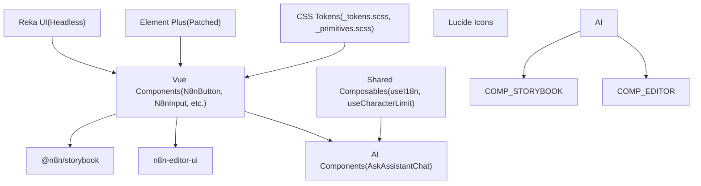
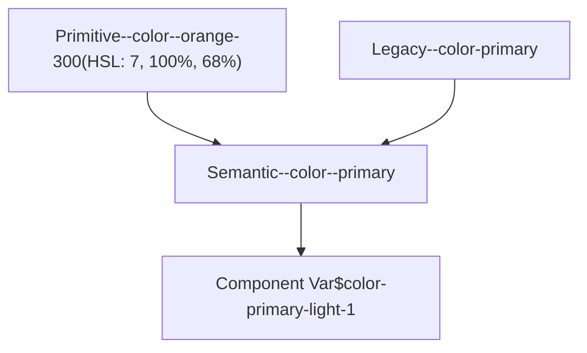
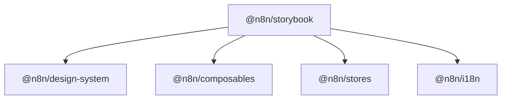

# Design System and Reusable Components

Relevant source files

-   [packages/@n8n/stylelint-config/README.md](https://github.com/n8n-io/n8n/blob/88f170b9/packages/@n8n/stylelint-config/README.md?plain=1)
-   [packages/@n8n/stylelint-config/jest.config.cjs](https://github.com/n8n-io/n8n/blob/88f170b9/packages/@n8n/stylelint-config/jest.config.cjs)
-   [packages/@n8n/stylelint-config/package.json](https://github.com/n8n-io/n8n/blob/88f170b9/packages/@n8n/stylelint-config/package.json)
-   [packages/@n8n/stylelint-config/src/configs/base.ts](https://github.com/n8n-io/n8n/blob/88f170b9/packages/@n8n/stylelint-config/src/configs/base.ts)
-   [packages/@n8n/stylelint-config/src/rules/css-var-naming.test.ts](https://github.com/n8n-io/n8n/blob/88f170b9/packages/@n8n/stylelint-config/src/rules/css-var-naming.test.ts)
-   [packages/@n8n/stylelint-config/src/rules/css-var-naming.ts](https://github.com/n8n-io/n8n/blob/88f170b9/packages/@n8n/stylelint-config/src/rules/css-var-naming.ts)
-   [packages/@n8n/stylelint-config/src/rules/index.ts](https://github.com/n8n-io/n8n/blob/88f170b9/packages/@n8n/stylelint-config/src/rules/index.ts)
-   [packages/frontend/@n8n/chat/stylelint.config.mjs](https://github.com/n8n-io/n8n/blob/88f170b9/packages/frontend/@n8n/chat/stylelint.config.mjs)
-   [packages/frontend/@n8n/design-system/src/components/AskAssistantButton/AskAssistantButton.vue](https://github.com/n8n-io/n8n/blob/88f170b9/packages/frontend/@n8n/design-system/src/components/AskAssistantButton/AskAssistantButton.vue)
-   [packages/frontend/@n8n/design-system/src/components/AskAssistantChat/AskAssistantChat.test.ts](https://github.com/n8n-io/n8n/blob/88f170b9/packages/frontend/@n8n/design-system/src/components/AskAssistantChat/AskAssistantChat.test.ts)
-   [packages/frontend/@n8n/design-system/src/components/AskAssistantChat/AskAssistantChat.vue](https://github.com/n8n-io/n8n/blob/88f170b9/packages/frontend/@n8n/design-system/src/components/AskAssistantChat/AskAssistantChat.vue)
-   [packages/frontend/@n8n/design-system/src/components/AskAssistantChat/\_\_snapshots\_\_/AskAssistantChat.test.ts.snap](https://github.com/n8n-io/n8n/blob/88f170b9/packages/frontend/@n8n/design-system/src/components/AskAssistantChat/__snapshots__/AskAssistantChat.test.ts.snap)
-   [packages/frontend/@n8n/design-system/src/components/AskAssistantChat/messages/BaseMessage.vue](https://github.com/n8n-io/n8n/blob/88f170b9/packages/frontend/@n8n/design-system/src/components/AskAssistantChat/messages/BaseMessage.vue)
-   [packages/frontend/@n8n/design-system/src/components/AskAssistantChat/messages/ErrorMessage.vue](https://github.com/n8n-io/n8n/blob/88f170b9/packages/frontend/@n8n/design-system/src/components/AskAssistantChat/messages/ErrorMessage.vue)
-   [packages/frontend/@n8n/design-system/src/components/AskAssistantChat/messages/MessageRating.test.ts](https://github.com/n8n-io/n8n/blob/88f170b9/packages/frontend/@n8n/design-system/src/components/AskAssistantChat/messages/MessageRating.test.ts)
-   [packages/frontend/@n8n/design-system/src/components/AskAssistantChat/messages/MessageRating.vue](https://github.com/n8n-io/n8n/blob/88f170b9/packages/frontend/@n8n/design-system/src/components/AskAssistantChat/messages/MessageRating.vue)
-   [packages/frontend/@n8n/design-system/src/components/AskAssistantChat/messages/ThinkingMessage.vue](https://github.com/n8n-io/n8n/blob/88f170b9/packages/frontend/@n8n/design-system/src/components/AskAssistantChat/messages/ThinkingMessage.vue)
-   [packages/frontend/@n8n/design-system/src/components/AskAssistantChat/messages/\_\_snapshots\_\_/MessageRating.test.ts.snap](https://github.com/n8n-io/n8n/blob/88f170b9/packages/frontend/@n8n/design-system/src/components/AskAssistantChat/messages/__snapshots__/MessageRating.test.ts.snap)
-   [packages/frontend/@n8n/design-system/src/components/AskAssistantChat/messages/helpers.ts](https://github.com/n8n-io/n8n/blob/88f170b9/packages/frontend/@n8n/design-system/src/components/AskAssistantChat/messages/helpers.ts)
-   [packages/frontend/@n8n/design-system/src/components/N8nPromptInput/N8nPromptInput.test.ts](https://github.com/n8n-io/n8n/blob/88f170b9/packages/frontend/@n8n/design-system/src/components/N8nPromptInput/N8nPromptInput.test.ts)
-   [packages/frontend/@n8n/design-system/src/components/N8nPromptInput/N8nPromptInput.vue](https://github.com/n8n-io/n8n/blob/88f170b9/packages/frontend/@n8n/design-system/src/components/N8nPromptInput/N8nPromptInput.vue)
-   [packages/frontend/@n8n/design-system/src/components/N8nPromptInput/\_\_snapshots\_\_/N8nPromptInput.test.ts.snap](https://github.com/n8n-io/n8n/blob/88f170b9/packages/frontend/@n8n/design-system/src/components/N8nPromptInput/__snapshots__/N8nPromptInput.test.ts.snap)
-   [packages/frontend/@n8n/design-system/src/components/N8nSticky/Sticky.test.ts](https://github.com/n8n-io/n8n/blob/88f170b9/packages/frontend/@n8n/design-system/src/components/N8nSticky/Sticky.test.ts)
-   [packages/frontend/@n8n/design-system/src/components/N8nSticky/Sticky.vue](https://github.com/n8n-io/n8n/blob/88f170b9/packages/frontend/@n8n/design-system/src/components/N8nSticky/Sticky.vue)
-   [packages/frontend/@n8n/design-system/src/css/\_primitives.scss](https://github.com/n8n-io/n8n/blob/88f170b9/packages/frontend/@n8n/design-system/src/css/_primitives.scss)
-   [packages/frontend/@n8n/design-system/src/css/\_tokens.scss](https://github.com/n8n-io/n8n/blob/88f170b9/packages/frontend/@n8n/design-system/src/css/_tokens.scss)
-   [packages/frontend/@n8n/design-system/src/css/common/var.scss](https://github.com/n8n-io/n8n/blob/88f170b9/packages/frontend/@n8n/design-system/src/css/common/var.scss)
-   [packages/frontend/@n8n/design-system/src/css/date-picker.scss](https://github.com/n8n-io/n8n/blob/88f170b9/packages/frontend/@n8n/design-system/src/css/date-picker.scss)
-   [packages/frontend/@n8n/design-system/src/css/index.scss](https://github.com/n8n-io/n8n/blob/88f170b9/packages/frontend/@n8n/design-system/src/css/index.scss)
-   [packages/frontend/@n8n/design-system/src/css/mixins/\_focus.scss](https://github.com/n8n-io/n8n/blob/88f170b9/packages/frontend/@n8n/design-system/src/css/mixins/_focus.scss)
-   [packages/frontend/@n8n/design-system/src/css/mixins/index.scss](https://github.com/n8n-io/n8n/blob/88f170b9/packages/frontend/@n8n/design-system/src/css/mixins/index.scss)
-   [packages/frontend/@n8n/design-system/src/styleguide/colors.stories.ts](https://github.com/n8n-io/n8n/blob/88f170b9/packages/frontend/@n8n/design-system/src/styleguide/colors.stories.ts)
-   [packages/frontend/@n8n/design-system/src/styleguide/colorsprimitives.stories.ts](https://github.com/n8n-io/n8n/blob/88f170b9/packages/frontend/@n8n/design-system/src/styleguide/colorsprimitives.stories.ts)
-   [packages/frontend/@n8n/design-system/src/utils/cn.ts](https://github.com/n8n-io/n8n/blob/88f170b9/packages/frontend/@n8n/design-system/src/utils/cn.ts)
-   [packages/frontend/@n8n/design-system/src/utils/colorUtils.test.ts](https://github.com/n8n-io/n8n/blob/88f170b9/packages/frontend/@n8n/design-system/src/utils/colorUtils.test.ts)
-   [packages/frontend/@n8n/design-system/src/utils/colorUtils.ts](https://github.com/n8n-io/n8n/blob/88f170b9/packages/frontend/@n8n/design-system/src/utils/colorUtils.ts)
-   [packages/frontend/@n8n/design-system/src/utils/index.ts](https://github.com/n8n-io/n8n/blob/88f170b9/packages/frontend/@n8n/design-system/src/utils/index.ts)
-   [packages/frontend/@n8n/storybook/.storybook/main.ts](https://github.com/n8n-io/n8n/blob/88f170b9/packages/frontend/@n8n/storybook/.storybook/main.ts)
-   [packages/frontend/@n8n/storybook/.storybook/preview.ts](https://github.com/n8n-io/n8n/blob/88f170b9/packages/frontend/@n8n/storybook/.storybook/preview.ts)
-   [packages/frontend/@n8n/storybook/.storybook/storybook.scss](https://github.com/n8n-io/n8n/blob/88f170b9/packages/frontend/@n8n/storybook/.storybook/storybook.scss)
-   [packages/frontend/@n8n/storybook/package.json](https://github.com/n8n-io/n8n/blob/88f170b9/packages/frontend/@n8n/storybook/package.json)
-   [packages/frontend/@n8n/storybook/tsconfig.app.json](https://github.com/n8n-io/n8n/blob/88f170b9/packages/frontend/@n8n/storybook/tsconfig.app.json)
-   [packages/frontend/@n8n/storybook/vite.config.ts](https://github.com/n8n-io/n8n/blob/88f170b9/packages/frontend/@n8n/storybook/vite.config.ts)
-   [packages/frontend/editor-ui/src/features/ai/assistant/components/Agent/CreditWarningBanner.vue](https://github.com/n8n-io/n8n/blob/88f170b9/packages/frontend/editor-ui/src/features/ai/assistant/components/Agent/CreditWarningBanner.vue)
-   [packages/frontend/editor-ui/src/features/ai/assistant/components/Agent/CreditsSettingsDropdown.vue](https://github.com/n8n-io/n8n/blob/88f170b9/packages/frontend/editor-ui/src/features/ai/assistant/components/Agent/CreditsSettingsDropdown.vue)
-   [packages/frontend/editor-ui/src/features/ai/assistant/composables/useBuilderMessages.test.ts](https://github.com/n8n-io/n8n/blob/88f170b9/packages/frontend/editor-ui/src/features/ai/assistant/composables/useBuilderMessages.test.ts)
-   [packages/frontend/editor-ui/src/features/workflows/canvas/components/elements/nodes/toolbar/CanvasNodeStickyColorSelector.test.ts](https://github.com/n8n-io/n8n/blob/88f170b9/packages/frontend/editor-ui/src/features/workflows/canvas/components/elements/nodes/toolbar/CanvasNodeStickyColorSelector.test.ts)
-   [packages/frontend/editor-ui/src/features/workflows/canvas/components/elements/nodes/toolbar/CanvasNodeStickyColorSelector.vue](https://github.com/n8n-io/n8n/blob/88f170b9/packages/frontend/editor-ui/src/features/workflows/canvas/components/elements/nodes/toolbar/CanvasNodeStickyColorSelector.vue)

This page documents the `@n8n/design-system` package — the shared Vue 3 component library used by the n8n editor UI — along with its theming architecture, specialized AI components like `AskAssistantChat`, and the Storybook development environment.

The design system provides a unified set of UI primitives that ensure visual consistency across the n8n platform, from the workflow canvas to the node configuration panels.

---

## Package Overview

The design system lives at `packages/frontend/@n8n/design-system/` and is published as the workspace package `@n8n/design-system`. It is consumed primarily by `n8n-editor-ui`.

**Key Technologies:**

-   **Vue 3**: Core component framework.
-   **Element Plus (2.4.3)**: Base UI library, heavily customized via SCSS and [patches/element-plus@2.4.3.patch](https://github.com/n8n-io/n8n/blob/88f170b9/patches/element-plus@2.4.3.patch)
-   **Reka UI**: Headless primitives for accessible, high-performance components like `N8nScrollArea`.
-   **Sass (SCSS)**: Used for the tokenized theming system and component styling.
-   **Storybook**: Component documentation and isolated development environment.

**Design System Architecture**

Sources: [packages/frontend/@n8n/design-system/package.json1-75](https://github.com/n8n-io/n8n/blob/88f170b9/packages/frontend/@n8n/design-system/package.json#L1-L75) [packages/frontend/@n8n/design-system/src/css/index.scss1-35](https://github.com/n8n-io/n8n/blob/88f170b9/packages/frontend/@n8n/design-system/src/css/index.scss#L1-L35)

---

## Theming and CSS Tokens

n8n uses a tiered CSS variable system to manage colors, spacing, and typography. This system is designed for maintainability and supports external embedding (e.g., n8n in an iframe) where customers might override styles.

### Token Layers

1.  **Primitives**: Raw HSL values for the base color palette (e.g., `--color--orange-500`). Defined in [packages/frontend/@n8n/design-system/src/css/\_primitives.scss1-156](https://github.com/n8n-io/n8n/blob/88f170b9/packages/frontend/@n8n/design-system/src/css/_primitives.scss#L1-L156)
2.  **Semantic Tokens**: Variables mapped to UI roles (e.g., `--color--primary`, `--color--text--shade-1`). These reference primitives or other semantic tokens. Defined in [packages/frontend/@n8n/design-system/src/css/\_tokens.scss21-130](https://github.com/n8n-io/n8n/blob/88f170b9/packages/frontend/@n8n/design-system/src/css/_tokens.scss#L21-L130)
3.  **Component Variables**: Specific overrides for third-party libraries like Element Plus, mapping semantic tokens to library-specific variables. Defined in [packages/frontend/@n8n/design-system/src/css/common/var.scss21-101](https://github.com/n8n-io/n8n/blob/88f170b9/packages/frontend/@n8n/design-system/src/css/common/var.scss#L21-L101)

### Variable Migration & Compatibility

The system is currently migrating from single-dash format (legacy) to a double-dash format (modern) to align with design system guidelines. Backwards compatibility is maintained using CSS `var()` fallbacks: `--color--primary: var(--color-primary, var(--color--orange-300))` [packages/frontend/@n8n/design-system/src/css/\_tokens.scss35](https://github.com/n8n-io/n8n/blob/88f170b9/packages/frontend/@n8n/design-system/src/css/_tokens.scss#L35-L35)

**Token Mapping Flow**

Sources: [packages/frontend/@n8n/design-system/src/css/\_tokens.scss1-42](https://github.com/n8n-io/n8n/blob/88f170b9/packages/frontend/@n8n/design-system/src/css/_tokens.scss#L1-L42) [packages/frontend/@n8n/design-system/src/css/\_primitives.scss44-55](https://github.com/n8n-io/n8n/blob/88f170b9/packages/frontend/@n8n/design-system/src/css/_primitives.scss#L44-L55)

---

## AskAssistantChat Component

`AskAssistantChat` is a complex, high-level component used for the n8n AI Assistant. It manages a conversational interface, including message streaming, tool execution visualization ("Thinking" states), and user feedback.

### Key Features

-   **Message Normalization**: Ensures every message has a unique ID and read status [packages/frontend/@n8n/design-system/src/components/AskAssistantChat/AskAssistantChat.vue82-88](https://github.com/n8n-io/n8n/blob/88f170b9/packages/frontend/@n8n/design-system/src/components/AskAssistantChat/AskAssistantChat.vue#L82-L88)
-   **Tool Grouping**: Consecutive tool execution messages are collapsed into a single `ThinkingGroup` to reduce UI clutter. This logic tracks which tool groups resulted in a workflow update [packages/frontend/@n8n/design-system/src/components/AskAssistantChat/AskAssistantChat.vue138-200](https://github.com/n8n-io/n8n/blob/88f170b9/packages/frontend/@n8n/design-system/src/components/AskAssistantChat/AskAssistantChat.vue#L138-L200)
-   **Streaming Support**: Handles real-time updates of assistant responses, showing a "Thinking" state while tools are running or the LLM is generating text [packages/frontend/@n8n/design-system/src/components/AskAssistantChat/AskAssistantChat.vue200-240](https://github.com/n8n-io/n8n/blob/88f170b9/packages/frontend/@n8n/design-system/src/components/AskAssistantChat/AskAssistantChat.vue#L200-L240)

### Sub-Components

-   `MessageWrapper`: Controls the layout and role-based styling (User vs. Assistant) [packages/frontend/@n8n/design-system/src/components/AskAssistantChat/messages/MessageWrapper.vue1-10](https://github.com/n8n-io/n8n/blob/88f170b9/packages/frontend/@n8n/design-system/src/components/AskAssistantChat/messages/MessageWrapper.vue#L1-L10)
-   `ThinkingMessage`: Displays the status of background tool calls (e.g., "Finding nodes", "Updating workflow") [packages/frontend/@n8n/design-system/src/components/AskAssistantChat/messages/ThinkingMessage.vue1-15](https://github.com/n8n-io/n8n/blob/88f170b9/packages/frontend/@n8n/design-system/src/components/AskAssistantChat/messages/ThinkingMessage.vue#L1-L15)
-   `MessageRating`: Collects thumbs up/down feedback for AI responses [packages/frontend/@n8n/design-system/src/components/AskAssistantChat/messages/MessageRating.vue1-10](https://github.com/n8n-io/n8n/blob/88f170b9/packages/frontend/@n8n/design-system/src/components/AskAssistantChat/messages/MessageRating.vue#L1-L10)

Sources: [packages/frontend/@n8n/design-system/src/components/AskAssistantChat/AskAssistantChat.vue1-51](https://github.com/n8n-io/n8n/blob/88f170b9/packages/frontend/@n8n/design-system/src/components/AskAssistantChat/AskAssistantChat.vue#L1-L51) [packages/frontend/@n8n/design-system/src/components/AskAssistantChat/messages/helpers.ts1-20](https://github.com/n8n-io/n8n/blob/88f170b9/packages/frontend/@n8n/design-system/src/components/AskAssistantChat/messages/helpers.ts#L1-L20)

---

## N8nPromptInput Component

`N8nPromptInput` is the primary multi-line text input used in chat interfaces. It extends standard textarea behavior with auto-resizing, character limits, and AI-specific controls.

### Implementation Details

-   **Auto-Resize**: Dynamically adjusts the height based on `scrollHeight` while respecting `minLines` and `maxLinesBeforeScroll` [packages/frontend/@n8n/design-system/src/components/N8nPromptInput/N8nPromptInput.vue111-187](https://github.com/n8n-io/n8n/blob/88f170b9/packages/frontend/@n8n/design-system/src/components/N8nPromptInput/N8nPromptInput.vue#L111-L187)
-   **Character Limit**: Uses the `useCharacterLimit` composable to track length and show a warning banner when the limit is approached or exceeded [packages/frontend/@n8n/design-system/src/components/N8nPromptInput/N8nPromptInput.vue78-91](https://github.com/n8n-io/n8n/blob/88f170b9/packages/frontend/@n8n/design-system/src/components/N8nPromptInput/N8nPromptInput.vue#L78-L91)
-   **Streaming State**: Swaps the "Send" button for a "Stop" button when `streaming: true` is passed, allowing users to interrupt AI generation [packages/frontend/@n8n/design-system/src/components/N8nPromptInput/N8nPromptInput.vue221-226](https://github.com/n8n-io/n8n/blob/88f170b9/packages/frontend/@n8n/design-system/src/components/N8nPromptInput/N8nPromptInput.vue#L221-L226)
-   **Keyboard Handling**: Submits on `Enter` and inserts a newline on `Shift+Enter` [packages/frontend/@n8n/design-system/src/components/N8nPromptInput/N8nPromptInput.vue228-250](https://github.com/n8n-io/n8n/blob/88f170b9/packages/frontend/@n8n/design-system/src/components/N8nPromptInput/N8nPromptInput.vue#L228-L250)

Sources: [packages/frontend/@n8n/design-system/src/components/N8nPromptInput/N8nPromptInput.vue15-49](https://github.com/n8n-io/n8n/blob/88f170b9/packages/frontend/@n8n/design-system/src/components/N8nPromptInput/N8nPromptInput.vue#L15-L49) [packages/frontend/@n8n/design-system/src/components/N8nPromptInput/N8nPromptInput.test.ts78-132](https://github.com/n8n-io/n8n/blob/88f170b9/packages/frontend/@n8n/design-system/src/components/N8nPromptInput/N8nPromptInput.test.ts#L78-L132)

---

## Storybook Setup

The `@n8n/storybook` package provides an isolated environment for developing and testing components without running the full n8n server.

-   **Package**: `packages/frontend/@n8n/storybook/` [packages/frontend/@n8n/storybook/package.json1-5](https://github.com/n8n-io/n8n/blob/88f170b9/packages/frontend/@n8n/storybook/package.json#L1-L5)
-   **Vite Integration**: Uses `@storybook/vue3-vite` for fast HMR during component development [packages/frontend/@n8n/storybook/package.json30](https://github.com/n8n-io/n8n/blob/88f170b9/packages/frontend/@n8n/storybook/package.json#L30-L30)
-   **Addons**:
    -   `@storybook/addon-themes`: Allows switching between Light and Dark modes to test CSS tokens.
    -   `@storybook/addon-a11y`: Runs automated accessibility checks on stories.
    -   `@storybook/addon-vitest`: Enables running stories as unit tests [packages/frontend/@n8n/storybook/package.json26-30](https://github.com/n8n-io/n8n/blob/88f170b9/packages/frontend/@n8n/storybook/package.json#L26-L30)

**Storybook Workspace Relationships**

Sources: [packages/frontend/@n8n/storybook/package.json11-22](https://github.com/n8n-io/n8n/blob/88f170b9/packages/frontend/@n8n/storybook/package.json#L11-L22) [packages/frontend/@n8n/storybook/.storybook/main.ts1-20](https://github.com/n8n-io/n8n/blob/88f170b9/packages/frontend/@n8n/storybook/.storybook/main.ts#L1-L20)

---

## Utility Components

### N8nIcon

A registry-based icon component that supports both Lucide icons and custom n8n SVGs. Icons are resolved by a string name, allowing dynamic icon rendering based on node types or status [packages/frontend/@n8n/design-system/src/components/N8nIcon/icons.ts1-194](https://github.com/n8n-io/n8n/blob/88f170b9/packages/frontend/@n8n/design-system/src/components/N8nIcon/icons.ts#L1-L194)

### N8nSticky

Used for the "Sticky Note" element on the workflow canvas. It handles color selection and text editing for canvas annotations. Sources: [packages/frontend/@n8n/design-system/src/components/N8nSticky/Sticky.vue1-20](https://github.com/n8n-io/n8n/blob/88f170b9/packages/frontend/@n8n/design-system/src/components/N8nSticky/Sticky.vue#L1-L20) [packages/frontend/editor-ui/src/features/workflows/canvas/components/elements/nodes/toolbar/CanvasNodeStickyColorSelector.vue1-15](https://github.com/n8n-io/n8n/blob/88f170b9/packages/frontend/editor-ui/src/features/workflows/canvas/components/elements/nodes/toolbar/CanvasNodeStickyColorSelector.vue#L1-L15)

### Credits and Quotas

Components like `CreditsSettingsDropdown` and `CreditWarningBanner` are used in the AI Assistant to manage and display user credit usage for LLM calls. Sources: [packages/frontend/editor-ui/src/features/ai/assistant/components/Agent/CreditsSettingsDropdown.vue7-15](https://github.com/n8n-io/n8n/blob/88f170b9/packages/frontend/editor-ui/src/features/ai/assistant/components/Agent/CreditsSettingsDropdown.vue#L7-L15) [packages/frontend/editor-ui/src/features/ai/assistant/components/Agent/CreditWarningBanner.vue1-10](https://github.com/n8n-io/n8n/blob/88f170b9/packages/frontend/editor-ui/src/features/ai/assistant/components/Agent/CreditWarningBanner.vue#L1-L10)
