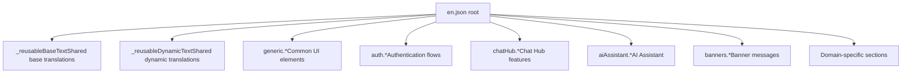
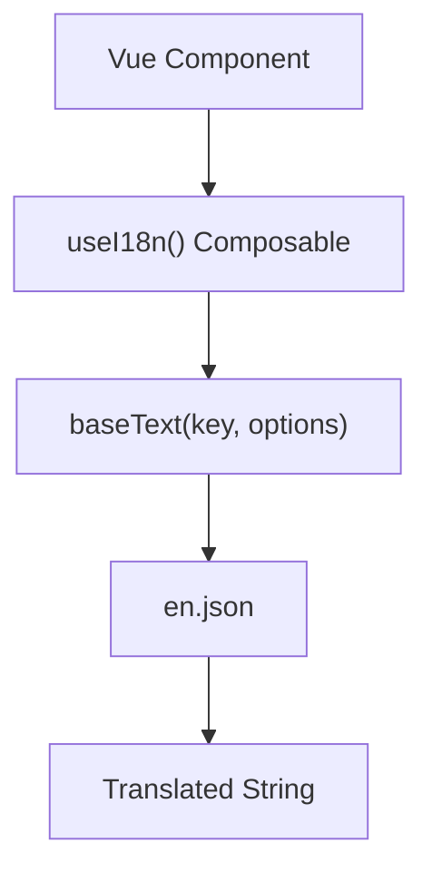
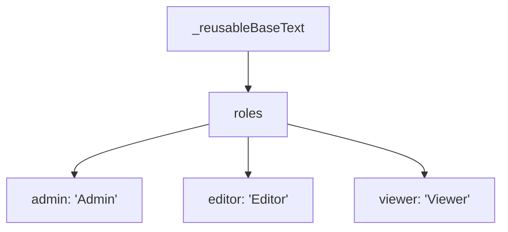

# Internationalization and Localization

Relevant source files

-   [packages/frontend/@n8n/design-system/src/components/N8nActionToggle/ActionToggle.vue](https://github.com/n8n-io/n8n/blob/88f170b9/packages/frontend/@n8n/design-system/src/components/N8nActionToggle/ActionToggle.vue)
-   [packages/frontend/@n8n/design-system/src/components/N8nBreadcrumbs/Breadcrumbs.vue](https://github.com/n8n-io/n8n/blob/88f170b9/packages/frontend/@n8n/design-system/src/components/N8nBreadcrumbs/Breadcrumbs.vue)
-   [packages/frontend/@n8n/design-system/src/components/N8nBreadcrumbs/\_\_snapshots\_\_/BreadCrumbs.test.ts.snap](https://github.com/n8n-io/n8n/blob/88f170b9/packages/frontend/@n8n/design-system/src/components/N8nBreadcrumbs/__snapshots__/BreadCrumbs.test.ts.snap)
-   [packages/frontend/@n8n/design-system/src/components/N8nIcon/icons.ts](https://github.com/n8n-io/n8n/blob/88f170b9/packages/frontend/@n8n/design-system/src/components/N8nIcon/icons.ts)
-   [packages/frontend/@n8n/design-system/src/components/N8nUserStack/UserStack.vue](https://github.com/n8n-io/n8n/blob/88f170b9/packages/frontend/@n8n/design-system/src/components/N8nUserStack/UserStack.vue)
-   [packages/frontend/@n8n/design-system/src/composables/useParentScroll.ts](https://github.com/n8n-io/n8n/blob/88f170b9/packages/frontend/@n8n/design-system/src/composables/useParentScroll.ts)
-   [packages/frontend/@n8n/i18n/src/locales/en.json](https://github.com/n8n-io/n8n/blob/88f170b9/packages/frontend/@n8n/i18n/src/locales/en.json)
-   [packages/frontend/@n8n/rest-api-client/src/api/index.ts](https://github.com/n8n-io/n8n/blob/88f170b9/packages/frontend/@n8n/rest-api-client/src/api/index.ts)
-   [packages/frontend/editor-ui/src/Interface.ts](https://github.com/n8n-io/n8n/blob/88f170b9/packages/frontend/editor-ui/src/Interface.ts)
-   [packages/frontend/editor-ui/src/app/stores/npsSurvey.store.ts](https://github.com/n8n-io/n8n/blob/88f170b9/packages/frontend/editor-ui/src/app/stores/npsSurvey.store.ts)
-   [packages/frontend/editor-ui/src/features/core/folders/components/FolderCard.vue](https://github.com/n8n-io/n8n/blob/88f170b9/packages/frontend/editor-ui/src/features/core/folders/components/FolderCard.vue)
-   [packages/nodes-base/credentials/SalesforceJwtApi.credentials.ts](https://github.com/n8n-io/n8n/blob/88f170b9/packages/nodes-base/credentials/SalesforceJwtApi.credentials.ts)

This document describes n8n's internationalization (i18n) and localization (l10n) system, which provides multi-language support throughout the application. The system is built around the `@n8n/i18n` package and integrates with the Vue 3 frontend to deliver translated user interface strings.

For information about the overall frontend architecture, see [6.1 Frontend Architecture and State Management](https://github.com/n8n-io/n8n/blob/88f170b9/6.1 Frontend Architecture and State Management) For details about the design system components that use these translations, see [6.4 Design System and Reusable Components](https://github.com/n8n-io/n8n/blob/88f170b9/6.4 Design System and Reusable Components)

---

## Package Structure

n8n's i18n system is organized as a standalone package within the monorepo at `packages/frontend/@n8n/i18n/`.

```
packages/frontend/@n8n/i18n/
├── src/
│   ├── locales/
│   │   └── en.json          # English translations (primary locale)
│   ├── index.ts             # Package exports
│   └── composables/         # Vue composables for i18n
```
The package exports translation files for each supported locale, Vue composables for accessing translations in components, and type definitions for translation keys.

**Sources:** [packages/frontend/@n8n/i18n/src/locales/en.json1-30](https://github.com/n8n-io/n8n/blob/88f170b9/packages/frontend/@n8n/i18n/src/locales/en.json#L1-L30)

---

## Translation File Format

Translations are stored in JSON files with a hierarchical key structure using dot notation. The primary translation file is `en.json`, which serves as the source of truth for all translation keys.

### Key Structure


**Key Naming Convention:**

| Pattern | Example | Purpose |
| --- | --- | --- |
| `generic.*` | `generic.cancel`, `generic.save` | Common UI strings used across features |
| `_reusableBaseText.*` | `_reusableBaseText.roles.admin` | Reusable base translations |
| `_reusableDynamicText.*` | `_reusableDynamicText.learnMore` | Reusable dynamic text |
| `[feature].*` | `chatHub.agents.delete.confirm.message` | Feature-specific translations |
| `[component].*` | `nodeCreator.shortcutCoachmark.title` | Component-specific translations |

**Sources:** [packages/frontend/@n8n/i18n/src/locales/en.json1-100](https://github.com/n8n-io/n8n/blob/88f170b9/packages/frontend/@n8n/i18n/src/locales/en.json#L1-L100)

---

## Translation Features

### Interpolation

Variables are embedded in translations using curly braces `{variableName}`. These are replaced at runtime by the `i18n.baseText` function.

```
{  "generic.openResource": "Open {resource}",  "generic.communityNode.tooltip": "This is a node from our community. It's part of the {packageName} package. <a href=\"{docURL}\" target=\"_blank\" title=\"Read the n8n docs\">Learn more</a>"}
```
**Sources:** [packages/frontend/@n8n/i18n/src/locales/en.json52](https://github.com/n8n-io/n8n/blob/88f170b9/packages/frontend/@n8n/i18n/src/locales/en.json#L52-L52) [packages/frontend/@n8n/i18n/src/locales/en.json74](https://github.com/n8n-io/n8n/blob/88f170b9/packages/frontend/@n8n/i18n/src/locales/en.json#L74-L74)

### Pluralization

n8n uses a pipe (`|`) separator to define pluralization rules. The system typically supports three forms: zero/singular, one, and multiple.

```
{  "generic.workflow": "Workflow | {count} Workflow | {count} Workflows",  "generic.folderCount": "Folder | {count} Folder | {count} Folders",  "generic.trial.message.days": "1 day left | {count} days left"}
```
**Sources:** [packages/frontend/@n8n/i18n/src/locales/en.json128](https://github.com/n8n-io/n8n/blob/88f170b9/packages/frontend/@n8n/i18n/src/locales/en.json#L128-L128) [packages/frontend/@n8n/i18n/src/locales/en.json66](https://github.com/n8n-io/n8n/blob/88f170b9/packages/frontend/@n8n/i18n/src/locales/en.json#L66-L66) [packages/frontend/@n8n/i18n/src/locales/en.json116](https://github.com/n8n-io/n8n/blob/88f170b9/packages/frontend/@n8n/i18n/src/locales/en.json#L116-L116)

### Cross-References

Translations can reference other keys within the same file using the `@:` prefix to avoid duplication.

```
{  "_reusableBaseText": {    "roles": {      "admin": "Admin"    }  },  "auth": {    "roles": {      "admin": "@:_reusableBaseText.roles.admin"    }  }}
```
**Sources:** [packages/frontend/@n8n/i18n/src/locales/en.json25-29](https://github.com/n8n-io/n8n/blob/88f170b9/packages/frontend/@n8n/i18n/src/locales/en.json#L25-L29)

---

## Frontend Integration

### useI18n Composable

Components access the translation system via the `useI18n()` composable. This provides the `baseText` method which handles key lookup, interpolation, and pluralization.


**Usage in Components:**

```
// FolderCard.vue exampleimport { useI18n } from '@n8n/i18n'; const i18n = useI18n(); // Simple translationconst resourceTypeLabel = computed(() => i18n.baseText('generic.folder').toLowerCase()); // Interpolation and Pluralizationconst workflowCountText = i18n.baseText('generic.workflow', {   interpolate: { count: data.workflowCount } });
```
**Sources:** [packages/frontend/editor-ui/src/features/core/folders/components/FolderCard.vue5](https://github.com/n8n-io/n8n/blob/88f170b9/packages/frontend/editor-ui/src/features/core/folders/components/FolderCard.vue#L5-L5) [packages/frontend/editor-ui/src/features/core/folders/components/FolderCard.vue40](https://github.com/n8n-io/n8n/blob/88f170b9/packages/frontend/editor-ui/src/features/core/folders/components/FolderCard.vue#L40-L40) [packages/frontend/editor-ui/src/features/core/folders/components/FolderCard.vue54](https://github.com/n8n-io/n8n/blob/88f170b9/packages/frontend/editor-ui/src/features/core/folders/components/FolderCard.vue#L54-L54) [packages/frontend/editor-ui/src/features/core/folders/components/FolderCard.vue168](https://github.com/n8n-io/n8n/blob/88f170b9/packages/frontend/editor-ui/src/features/core/folders/components/FolderCard.vue#L168-L168)

---

## Key Organization

### Common Translation Sections

| Section | Purpose |
| --- | --- |
| `_reusableBaseText` | Foundation strings like "Save", "Cancel", and user roles. |
| `_reusableDynamicText` | Links and common dynamic UI elements like "Learn more". |
| `generic.*` | Shared UI labels for workflows, credentials, and folders. |
| `about.*` | Version information and license details. |

**Sources:** [packages/frontend/@n8n/i18n/src/locales/en.json2-39](https://github.com/n8n-io/n8n/blob/88f170b9/packages/frontend/@n8n/i18n/src/locales/en.json#L2-L39) [packages/frontend/@n8n/i18n/src/locales/en.json40-164](https://github.com/n8n-io/n8n/blob/88f170b9/packages/frontend/@n8n/i18n/src/locales/en.json#L40-L164) [packages/frontend/@n8n/i18n/src/locales/en.json165-178](https://github.com/n8n-io/n8n/blob/88f170b9/packages/frontend/@n8n/i18n/src/locales/en.json#L165-L178)

### Reusable Text Mapping

The `_reusableBaseText` section is designed for maximum reuse across the application to ensure consistency in terminology (e.g., using "Admin" vs "Administrator").


**Sources:** [packages/frontend/@n8n/i18n/src/locales/en.json25-29](https://github.com/n8n-io/n8n/blob/88f170b9/packages/frontend/@n8n/i18n/src/locales/en.json#L25-L29)

---

## Design System Integration

Components in `@n8n/design-system` do not typically contain hardcoded strings. Instead, they accept translated labels as props.

### N8nBreadcrumbs Example

The `N8nBreadcrumbs` component accepts `PathItem` objects which contain a `label` property. This label is translated by the parent component before being passed to the design system.

```
export type PathItem = {	id: string;	label: string;	href?: string;};
```
In `FolderCard.vue`, the breadcrumbs are generated using the `i18n` instance:

```
const cardBreadcrumbs = computed<PathItem[]>(() => {    // ... logic to get parent folder name    return [{        id: folder.id,        label: folder.name, // Pre-translated or dynamic data        href: url    }];});
```
**Sources:** [packages/frontend/@n8n/design-system/src/components/N8nBreadcrumbs/Breadcrumbs.vue11-15](https://github.com/n8n-io/n8n/blob/88f170b9/packages/frontend/@n8n/design-system/src/components/N8nBreadcrumbs/Breadcrumbs.vue#L11-L15) [packages/frontend/editor-ui/src/features/core/folders/components/FolderCard.vue67-85](https://github.com/n8n-io/n8n/blob/88f170b9/packages/frontend/editor-ui/src/features/core/folders/components/FolderCard.vue#L67-L85)

---

## Localization of Dynamic Content

While the i18n system handles static UI strings, n8n also localizes dynamic metadata:

1.  **Node/Credential Display Names:** Defined in the backend classes (e.g., `SalesforceJwtApi.displayName = 'Salesforce JWT API'`).
2.  **Time Formatting:** Handled by the `TimeAgo.vue` component and `moment-timezone` library.
3.  **Icons:** Managed via the `N8nIcon` component which maps icon names to SVG assets.

**Sources:** [packages/nodes-base/credentials/SalesforceJwtApi.credentials.ts17](https://github.com/n8n-io/n8n/blob/88f170b9/packages/nodes-base/credentials/SalesforceJwtApi.credentials.ts#L17-L17) [packages/frontend/editor-ui/src/features/core/folders/components/FolderCard.vue13](https://github.com/n8n-io/n8n/blob/88f170b9/packages/frontend/editor-ui/src/features/core/folders/components/FolderCard.vue#L13-L13) [packages/frontend/@n8n/design-system/src/components/N8nIcon/icons.ts1-37](https://github.com/n8n-io/n8n/blob/88f170b9/packages/frontend/@n8n/design-system/src/components/N8nIcon/icons.ts#L1-L37)

---

## Implementation Patterns

### Modal Confirmation Patterns

Translations for confirmations often use a `headline` and `message` pattern:

```
{  "generic.unsavedWork.confirmMessage.headline": "Save changes before leaving?",  "generic.unsavedWork.confirmMessage.message": "If you don't save, you might lose your changes.",  "generic.unsavedWork.confirmMessage.confirmButtonText": "Save",  "generic.unsavedWork.confirmMessage.cancelButtonText": "Leave without saving"}
```
**Sources:** [packages/frontend/@n8n/i18n/src/locales/en.json112-115](https://github.com/n8n-io/n8n/blob/88f170b9/packages/frontend/@n8n/i18n/src/locales/en.json#L112-L115)

### Error Handling

Errors are translated using specific keys to provide user-friendly messages rather than raw backend errors:

```
{  "generic.error": "Something went wrong",  "generic.error.subworkflowCreationFailed": "Error creating sub-workflow",  "generic.unknownError": "An unknown error occurred"}
```
**Sources:** [packages/frontend/@n8n/i18n/src/locales/en.json100-101](https://github.com/n8n-io/n8n/blob/88f170b9/packages/frontend/@n8n/i18n/src/locales/en.json#L100-L101) [packages/frontend/@n8n/i18n/src/locales/en.json148](https://github.com/n8n-io/n8n/blob/88f170b9/packages/frontend/@n8n/i18n/src/locales/en.json#L148-L148)
