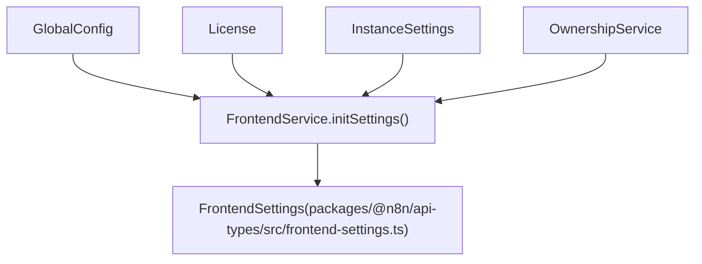
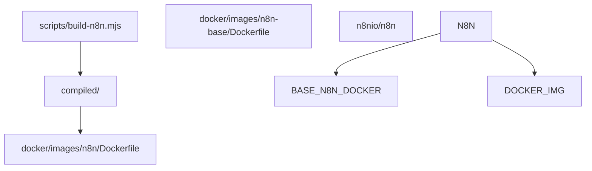

# Configuration and Deployment

Relevant source files

-   [.dockerignore](https://github.com/n8n-io/n8n/blob/88f170b9/.dockerignore)
-   [.github/scripts/docker/docker-config.mjs](https://github.com/n8n-io/n8n/blob/88f170b9/.github/scripts/docker/docker-config.mjs)
-   [.github/scripts/docker/docker-tags.mjs](https://github.com/n8n-io/n8n/blob/88f170b9/.github/scripts/docker/docker-tags.mjs)
-   [.github/workflows/docker-build-push.yml](https://github.com/n8n-io/n8n/blob/88f170b9/.github/workflows/docker-build-push.yml)
-   [docker/images/n8n-base/Dockerfile](https://github.com/n8n-io/n8n/blob/88f170b9/docker/images/n8n-base/Dockerfile)
-   [docker/images/n8n/Dockerfile](https://github.com/n8n-io/n8n/blob/88f170b9/docker/images/n8n/Dockerfile)
-   [docker/images/runners/Dockerfile](https://github.com/n8n-io/n8n/blob/88f170b9/docker/images/runners/Dockerfile)
-   [docker/images/runners/Dockerfile.distroless](https://github.com/n8n-io/n8n/blob/88f170b9/docker/images/runners/Dockerfile.distroless)
-   [docker/images/runners/README.md](https://github.com/n8n-io/n8n/blob/88f170b9/docker/images/runners/README.md?plain=1)
-   [packages/@n8n/api-types/src/frontend-settings.ts](https://github.com/n8n-io/n8n/blob/88f170b9/packages/@n8n/api-types/src/frontend-settings.ts)
-   [packages/@n8n/api-types/src/push/collaboration.ts](https://github.com/n8n-io/n8n/blob/88f170b9/packages/@n8n/api-types/src/push/collaboration.ts)
-   [packages/@n8n/backend-common/src/license-state.ts](https://github.com/n8n-io/n8n/blob/88f170b9/packages/@n8n/backend-common/src/license-state.ts)
-   [packages/@n8n/benchmark/Dockerfile](https://github.com/n8n-io/n8n/blob/88f170b9/packages/@n8n/benchmark/Dockerfile)
-   [packages/@n8n/config/src/decorators.ts](https://github.com/n8n-io/n8n/blob/88f170b9/packages/@n8n/config/src/decorators.ts)
-   [packages/@n8n/config/src/index.ts](https://github.com/n8n-io/n8n/blob/88f170b9/packages/@n8n/config/src/index.ts)
-   [packages/@n8n/config/test/config.test.ts](https://github.com/n8n-io/n8n/blob/88f170b9/packages/@n8n/config/test/config.test.ts)
-   [packages/@n8n/config/test/decorators.test.ts](https://github.com/n8n-io/n8n/blob/88f170b9/packages/@n8n/config/test/decorators.test.ts)
-   [packages/@n8n/config/test/string-normalization.test.ts](https://github.com/n8n-io/n8n/blob/88f170b9/packages/@n8n/config/test/string-normalization.test.ts)
-   [packages/@n8n/constants/src/index.ts](https://github.com/n8n-io/n8n/blob/88f170b9/packages/@n8n/constants/src/index.ts)
-   [packages/cli/src/\_\_tests\_\_/license.test.ts](https://github.com/n8n-io/n8n/blob/88f170b9/packages/cli/src/__tests__/license.test.ts)
-   [packages/cli/src/commands/base-command.ts](https://github.com/n8n-io/n8n/blob/88f170b9/packages/cli/src/commands/base-command.ts)
-   [packages/cli/src/commands/start.ts](https://github.com/n8n-io/n8n/blob/88f170b9/packages/cli/src/commands/start.ts)
-   [packages/cli/src/commands/webhook.ts](https://github.com/n8n-io/n8n/blob/88f170b9/packages/cli/src/commands/webhook.ts)
-   [packages/cli/src/commands/worker.ts](https://github.com/n8n-io/n8n/blob/88f170b9/packages/cli/src/commands/worker.ts)
-   [packages/cli/src/config/index.ts](https://github.com/n8n-io/n8n/blob/88f170b9/packages/cli/src/config/index.ts)
-   [packages/cli/src/config/schema.ts](https://github.com/n8n-io/n8n/blob/88f170b9/packages/cli/src/config/schema.ts)
-   [packages/cli/src/constants.ts](https://github.com/n8n-io/n8n/blob/88f170b9/packages/cli/src/constants.ts)
-   [packages/cli/src/controllers/e2e.controller.ts](https://github.com/n8n-io/n8n/blob/88f170b9/packages/cli/src/controllers/e2e.controller.ts)
-   [packages/cli/src/errors/response-errors/locked.error.ts](https://github.com/n8n-io/n8n/blob/88f170b9/packages/cli/src/errors/response-errors/locked.error.ts)
-   [packages/cli/src/license.ts](https://github.com/n8n-io/n8n/blob/88f170b9/packages/cli/src/license.ts)
-   [packages/cli/src/services/\_\_tests\_\_/frontend.service.test.ts](https://github.com/n8n-io/n8n/blob/88f170b9/packages/cli/src/services/__tests__/frontend.service.test.ts)
-   [packages/cli/src/services/frontend.service.ts](https://github.com/n8n-io/n8n/blob/88f170b9/packages/cli/src/services/frontend.service.ts)
-   [packages/cli/test/integration/commands/worker.cmd.test.ts](https://github.com/n8n-io/n8n/blob/88f170b9/packages/cli/test/integration/commands/worker.cmd.test.ts)
-   [packages/frontend/@n8n/design-system/src/components/CanvasCollaborationPill/CanvasCollaborationPill.vue](https://github.com/n8n-io/n8n/blob/88f170b9/packages/frontend/@n8n/design-system/src/components/CanvasCollaborationPill/CanvasCollaborationPill.vue)
-   [packages/frontend/@n8n/design-system/src/components/N8nLogo/Logo.vue](https://github.com/n8n-io/n8n/blob/88f170b9/packages/frontend/@n8n/design-system/src/components/N8nLogo/Logo.vue)
-   [packages/frontend/@n8n/stores/src/useRootStore.ts](https://github.com/n8n-io/n8n/blob/88f170b9/packages/frontend/@n8n/stores/src/useRootStore.ts)
-   [packages/frontend/editor-ui/src/\_\_tests\_\_/defaults.ts](https://github.com/n8n-io/n8n/blob/88f170b9/packages/frontend/editor-ui/src/__tests__/defaults.ts)
-   [packages/frontend/editor-ui/src/app/components/MainHeader/TabBar.vue](https://github.com/n8n-io/n8n/blob/88f170b9/packages/frontend/editor-ui/src/app/components/MainHeader/TabBar.vue)
-   [packages/frontend/editor-ui/src/app/stores/settings.store.test.ts](https://github.com/n8n-io/n8n/blob/88f170b9/packages/frontend/editor-ui/src/app/stores/settings.store.test.ts)
-   [packages/frontend/editor-ui/src/app/stores/settings.store.ts](https://github.com/n8n-io/n8n/blob/88f170b9/packages/frontend/editor-ui/src/app/stores/settings.store.ts)
-   [scripts/build-n8n.mjs](https://github.com/n8n-io/n8n/blob/88f170b9/scripts/build-n8n.mjs)

This page is an overview of how n8n is configured and deployed across its supported runtime modes and infrastructure environments. It covers the configuration system, CLI commands, Docker packaging, task runner deployment, license management, and observability.

For detailed coverage of each topic, see the child pages:

-   **[Configuration System](/n8n-io/n8n/7.1-configuration-system)** — `GlobalConfig`, env var mappings, `FrontendSettings`
-   **[CLI Commands and Execution Modes](/n8n-io/n8n/7.2-cli-commands-and-execution-modes)** — `start`, `worker`, `webhook` commands and boot lifecycle
-   **[Docker Deployment](/n8n-io/n8n/7.3-docker-deployment)** — main image, runners sidecar, build pipeline
-   **[Task Runners and Sandboxed Execution](/n8n-io/n8n/7.4-task-runners-and-sandboxed-execution)** — JS/Python sandboxes, `TaskBrokerService`
-   **[License Management and Feature Flags](/n8n-io/n8n/7.5-license-management-and-feature-flags)** — `License` class, feature flags, auto-renewal
-   **[Observability and Telemetry](/n8n-io/n8n/7.6-observability-and-telemetry)** — `EventService`, telemetry relays, Sentry
-   **[Data Store and Insights Modules](/n8n-io/n8n/7.7-data-store-and-insights-modules)** — `DataTable` and `Insights` backend modules

---

## Configuration Architecture

All runtime configuration is centralized in the `@n8n/config` package. The root class is `GlobalConfig`, declared in [packages/@n8n/config/src/index.ts75-230](https://github.com/n8n-io/n8n/blob/88f170b9/packages/@n8n/config/src/index.ts#L75-L230) which composes approximately 40 nested configuration sub-classes. These classes map environment variables to typed properties using decorators defined in [packages/@n8n/config/src/decorators.ts](https://github.com/n8n-io/n8n/blob/88f170b9/packages/@n8n/config/src/decorators.ts):

| Decorator | Role |
| --- | --- |
| `@Config` | Marks a class as a DI-managed configuration node [packages/@n8n/config/src/decorators.ts10](https://github.com/n8n-io/n8n/blob/88f170b9/packages/@n8n/config/src/decorators.ts#L10-L10) |
| `@Env('NAME')` | Binds a property to an environment variable with optional Zod validation [packages/@n8n/config/src/decorators.ts25](https://github.com/n8n-io/n8n/blob/88f170b9/packages/@n8n/config/src/decorators.ts#L25-L25) |
| `@Nested` | Composes a sub-config class into the parent hierarchy [packages/@n8n/config/src/decorators.ts38](https://github.com/n8n-io/n8n/blob/88f170b9/packages/@n8n/config/src/decorators.ts#L38-L38) |

`GlobalConfig` is registered with `@n8n/di`, allowing any service to receive the full configuration tree via constructor injection.

**GlobalConfig composition — selected nested classes:**

| Property | Class | Key environment variables |
| --- | --- | --- |
| `database` | `DatabaseConfig` | `DB_TYPE`, `DB_POSTGRESDB_HOST` [packages/@n8n/config/src/index.ts80](https://github.com/n8n-io/n8n/blob/88f170b9/packages/@n8n/config/src/index.ts#L80-L80) |
| `executions` | `ExecutionsConfig` | `EXECUTIONS_MODE`, `EXECUTIONS_TIMEOUT` [packages/@n8n/config/src/index.ts163](https://github.com/n8n-io/n8n/blob/88f170b9/packages/@n8n/config/src/index.ts#L163-L163) |
| `taskRunners` | `TaskRunnersConfig` | `N8N_RUNNERS_MODE`, `N8N_RUNNERS_ENABLED` [packages/@n8n/config/src/index.ts148](https://github.com/n8n-io/n8n/blob/88f170b9/packages/@n8n/config/src/index.ts#L148-L148) |
| `license` | `LicenseConfig` | `N8N_LICENSE_SERVER_URL` [packages/@n8n/config/src/index.ts157](https://github.com/n8n-io/n8n/blob/88f170b9/packages/@n8n/config/src/index.ts#L157-L157) |
| `security` | `SecurityConfig` | `N8N_BLOCK_FILE_ACCESS_TO_N8N_FILES` [packages/@n8n/config/src/index.ts160](https://github.com/n8n-io/n8n/blob/88f170b9/packages/@n8n/config/src/index.ts#L160-L160) |
| `queue` | `ScalingModeConfig` | `QUEUE_BULL_REDIS_HOST` [packages/@n8n/config/src/index.ts142](https://github.com/n8n-io/n8n/blob/88f170b9/packages/@n8n/config/src/index.ts#L142-L142) |
| `ai` | `AiConfig` | `N8N_AI_ENABLED` [packages/cli/src/config/schema.ts44-54](https://github.com/n8n-io/n8n/blob/88f170b9/packages/cli/src/config/schema.ts#L44-L54) |

`_FILE` variants are supported for secrets. If `DB_POSTGRESDB_PASSWORD_FILE` is set, the system reads the file contents, trims whitespace, and warns if trailing spaces are found [packages/cli/src/config/index.ts38-63](https://github.com/n8n-io/n8n/blob/88f170b9/packages/cli/src/config/index.ts#L38-L63)

**GlobalConfig class hierarchy:**

```mermaid
flowchart TD
    GC["GlobalConfig(@n8n/config)"]
    DB["database: DatabaseConfig"]
    EX["executions: ExecutionsConfig"]
    EP["endpoints: EndpointsConfig"]
    QU["queue: ScalingModeConfig"]
    TR["taskRunners: TaskRunnersConfig"]
    LC["license: LicenseConfig"]
    SC["security: SecurityConfig"]
    LG["logging: LoggingConfig"]
    SS["sso: SsoConfig"]
    DG["diagnostics: DiagnosticsConfig"]
    SR["sentry: SentryConfig"]
    MM["multiMainSetup: MultiMainSetupConfig"]
    CA["cache: CacheConfig"]
    UM["userManagement: UserManagementConfig"]

    GC --> DB
    GC --> EX
    GC --> EP
    GC --> QU
    GC --> TR
    GC --> LC
    GC --> SC
    GC --> LG
    GC --> SS
    GC --> DG
    GC --> SR
    GC --> MM
    GC --> CA
    GC --> UM
```

Sources: [packages/@n8n/config/src/index.ts75-230](https://github.com/n8n-io/n8n/blob/88f170b9/packages/@n8n/config/src/index.ts#L75-L230) [packages/cli/src/config/index.ts1-74](https://github.com/n8n-io/n8n/blob/88f170b9/packages/cli/src/config/index.ts#L1-L74) [packages/@n8n/config/src/decorators.ts1-40](https://github.com/n8n-io/n8n/blob/88f170b9/packages/@n8n/config/src/decorators.ts#L1-L40)

---

## Process Modes and CLI Commands

n8n runs as one of three primary process types, each launched via a CLI command extending `BaseCommand` [packages/cli/src/commands/base-command.ts43](https://github.com/n8n-io/n8n/blob/88f170b9/packages/cli/src/commands/base-command.ts#L43-L43):

| Command class | CLI invocation | Process role |
| --- | --- | --- |
| `Start` | `n8n start` | Main process: HTTP server, workflow activation, UI serving [packages/cli/src/commands/start.ts55](https://github.com/n8n-io/n8n/blob/88f170b9/packages/cli/src/commands/start.ts#L55-L55) |
| `Worker` | `n8n worker` | Queue worker: Consumes BullMQ jobs from Redis [packages/cli/src/commands/worker.ts32](https://github.com/n8n-io/n8n/blob/88f170b9/packages/cli/src/commands/worker.ts#L32-L32) |
| `Webhook` | `n8n webhook` | Specialized production webhook handler (Queue mode only) [packages/cli/src/commands/webhook.ts1-10](https://github.com/n8n-io/n8n/blob/88f170b9/packages/cli/src/commands/webhook.ts#L1-L10) |

`BaseCommand.init()` handles the shared initialization sequence:

1.  Initialize `ErrorReporter` (Sentry) [packages/cli/src/commands/base-command.ts96-116](https://github.com/n8n-io/n8n/blob/88f170b9/packages/cli/src/commands/base-command.ts#L96-L116)
2.  Initialize `DbConnection` and run migrations [packages/cli/src/commands/base-command.ts125-145](https://github.com/n8n-io/n8n/blob/88f170b9/packages/cli/src/commands/base-command.ts#L125-L145)
3.  Load Node types and Credentials [packages/cli/src/commands/base-command.ts123](https://github.com/n8n-io/n8n/blob/88f170b9/packages/cli/src/commands/base-command.ts#L123-L123)
4.  Start the `TaskRunnerModule` if required [packages/cli/src/commands/base-command.ts170-178](https://github.com/n8n-io/n8n/blob/88f170b9/packages/cli/src/commands/base-command.ts#L170-L178)

**Process startup flow:**

> **[Mermaid sequence]**
> *(图表结构无法解析)*

Sources: [packages/cli/src/commands/base-command.ts84-186](https://github.com/n8n-io/n8n/blob/88f170b9/packages/cli/src/commands/base-command.ts#L84-L186) [packages/cli/src/commands/start.ts189-210](https://github.com/n8n-io/n8n/blob/88f170b9/packages/cli/src/commands/start.ts#L189-L210) [packages/cli/src/commands/worker.ts74-126](https://github.com/n8n-io/n8n/blob/88f170b9/packages/cli/src/commands/worker.ts#L74-L126)

---

## Frontend Settings Flow

`FrontendService` assembles the `FrontendSettings` object served to the Vue SPA. It determines UI behavior based on licensing and environment variables [packages/cli/src/services/frontend.service.ts105-139](https://github.com/n8n-io/n8n/blob/88f170b9/packages/cli/src/services/frontend.service.ts#L105-L139)

The `FrontendSettings` type includes:

-   **Endpoints**: Paths for forms, webhooks, and health checks [packages/@n8n/api-types/src/frontend-settings.ts74-82](https://github.com/n8n-io/n8n/blob/88f170b9/packages/@n8n/api-types/src/frontend-settings.ts#L74-L82)
-   **Enterprise Features**: Boolean flags for SSO, LDAP, and log streaming [packages/@n8n/api-types/src/frontend-settings.ts40-67](https://github.com/n8n-io/n8n/blob/88f170b9/packages/@n8n/api-types/src/frontend-settings.ts#L40-L67)
-   **Environment**: Node version, n8n version, and release channel [packages/@n8n/api-types/src/frontend-settings.ts97-105](https://github.com/n8n-io/n8n/blob/88f170b9/packages/@n8n/api-types/src/frontend-settings.ts#L97-L105)

**Settings derivation:**

Sources: [packages/cli/src/services/frontend.service.ts160-237](https://github.com/n8n-io/n8n/blob/88f170b9/packages/cli/src/services/frontend.service.ts#L160-L237) [packages/@n8n/api-types/src/frontend-settings.ts69-237](https://github.com/n8n-io/n8n/blob/88f170b9/packages/@n8n/api-types/src/frontend-settings.ts#L69-L237)

---

## Docker Deployment Overview

The n8n Docker image is built using a multi-stage `Dockerfile` [docker/images/n8n/Dockerfile1-39](https://github.com/n8n-io/n8n/blob/88f170b9/docker/images/n8n/Dockerfile#L1-L39)

| Image | Base | Purpose |
| --- | --- | --- |
| `n8nio/n8n` | `n8nio/base` | Main application image [docker/images/n8n/Dockerfile12](https://github.com/n8n-io/n8n/blob/88f170b9/docker/images/n8n/Dockerfile#L12-L12) |
| `n8nio/runners` | `node:alpine` | Task runner sidecar for sandboxed execution [docker/images/runners/Dockerfile1-10](https://github.com/n8n-io/n8n/blob/88f170b9/docker/images/runners/Dockerfile#L1-L10) |

The main image uses `tini` as an init process and executes `/docker-entrypoint.sh` [docker/images/n8n/Dockerfile32](https://github.com/n8n-io/n8n/blob/88f170b9/docker/images/n8n/Dockerfile#L32-L32) It exposes port `5678` [docker/images/n8n/Dockerfile30](https://github.com/n8n-io/n8n/blob/88f170b9/docker/images/n8n/Dockerfile#L30-L30)

**Docker build pipeline:**

Sources: [docker/images/n8n/Dockerfile1-39](https://github.com/n8n-io/n8n/blob/88f170b9/docker/images/n8n/Dockerfile#L1-L39) [scripts/build-n8n.mjs1-50](https://github.com/n8n-io/n8n/blob/88f170b9/scripts/build-n8n.mjs#L1-L50)

---

## License Management Overview

The `License` service manages the activation and feature gating of enterprise capabilities [packages/cli/src/license.ts36-51](https://github.com/n8n-io/n8n/blob/88f170b9/packages/cli/src/license.ts#L36-L51) It wraps the `LicenseManager` from `@n8n_io/license-sdk`.

-   **Activation**: Performed via `activate(activationKey)` [packages/cli/src/license.ts203-210](https://github.com/n8n-io/n8n/blob/88f170b9/packages/cli/src/license.ts#L203-L210)
-   **Storage**: The license certificate is stored in `SettingsRepository` under the key `license.cert` [packages/cli/src/license.ts168](https://github.com/n8n-io/n8n/blob/88f170b9/packages/cli/src/license.ts#L168-L168)
-   **Quotas**: Managed via constants like `LICENSE_QUOTAS` and `UNLIMITED_LICENSE_QUOTA` [packages/cli/src/license.ts7-9](https://github.com/n8n-io/n8n/blob/88f170b9/packages/cli/src/license.ts#L7-L9)

License changes trigger a `reload-license` command across the cluster via the PubSub `Publisher` [packages/cli/src/license.ts156-161](https://github.com/n8n-io/n8n/blob/88f170b9/packages/cli/src/license.ts#L156-L161)

Sources: [packages/cli/src/license.ts53-129](https://github.com/n8n-io/n8n/blob/88f170b9/packages/cli/src/license.ts#L53-L129) [packages/@n8n/constants/src/index.ts82](https://github.com/n8n-io/n8n/blob/88f170b9/packages/@n8n/constants/src/index.ts#L82-L82)

---

## Observability Overview

Observability is handled through a combination of telemetry, logging, and error reporting.

-   **Sentry**: Configured in `BaseCommand.init()` using `GlobalConfig.sentry` [packages/cli/src/commands/base-command.ts96-116](https://github.com/n8n-io/n8n/blob/88f170b9/packages/cli/src/commands/base-command.ts#L96-L116)
-   **Telemetry**: `TelemetryEventRelay` forwards events to PostHog/RudderStack [packages/cli/src/commands/base-command.ts184](https://github.com/n8n-io/n8n/blob/88f170b9/packages/cli/src/commands/base-command.ts#L184-L184)
-   **Logging**: The `LoggingConfig` determines log levels and scopes [packages/@n8n/config/src/index.ts145](https://github.com/n8n-io/n8n/blob/88f170b9/packages/@n8n/config/src/index.ts#L145-L145)

The `Start` command also generates configuration meta tags for the frontend, including Sentry DSN and REST endpoint paths, which are injected into the `index.html` at runtime [packages/cli/src/commands/start.ts123-142](https://github.com/n8n-io/n8n/blob/88f170b9/packages/cli/src/commands/start.ts#L123-L142)

Sources: [packages/cli/src/commands/base-command.ts84-186](https://github.com/n8n-io/n8n/blob/88f170b9/packages/cli/src/commands/base-command.ts#L84-L186) [packages/cli/src/commands/start.ts123-142](https://github.com/n8n-io/n8n/blob/88f170b9/packages/cli/src/commands/start.ts#L123-L142)
