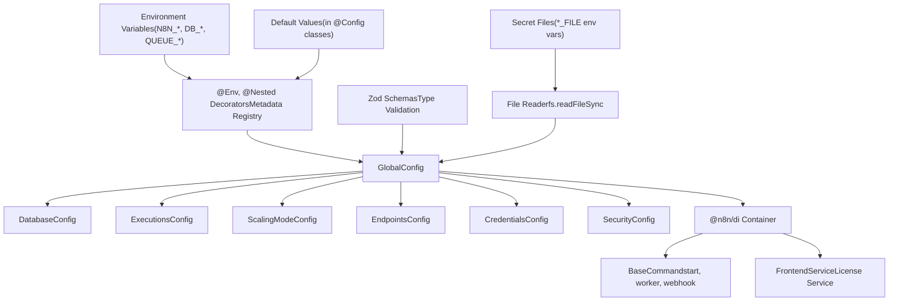
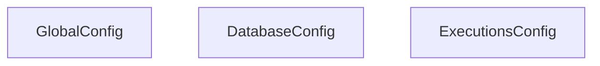
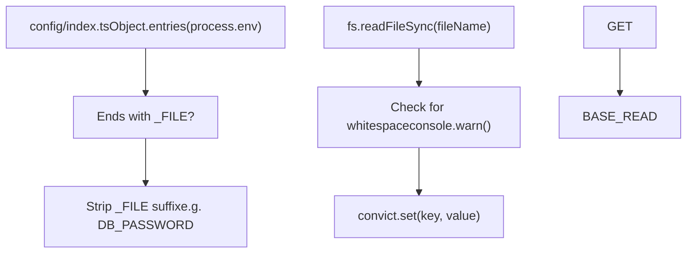
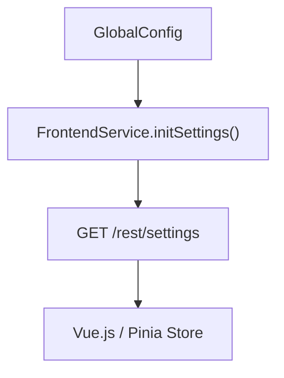

# Configuration System

Relevant source files

-   [packages/@n8n/api-types/src/frontend-settings.ts](https://github.com/n8n-io/n8n/blob/88f170b9/packages/@n8n/api-types/src/frontend-settings.ts)
-   [packages/@n8n/api-types/src/push/collaboration.ts](https://github.com/n8n-io/n8n/blob/88f170b9/packages/@n8n/api-types/src/push/collaboration.ts)
-   [packages/@n8n/backend-common/src/license-state.ts](https://github.com/n8n-io/n8n/blob/88f170b9/packages/@n8n/backend-common/src/license-state.ts)
-   [packages/@n8n/config/src/configs/cache.config.ts](https://github.com/n8n-io/n8n/blob/88f170b9/packages/@n8n/config/src/configs/cache.config.ts)
-   [packages/@n8n/config/src/configs/credentials.config.ts](https://github.com/n8n-io/n8n/blob/88f170b9/packages/@n8n/config/src/configs/credentials.config.ts)
-   [packages/@n8n/config/src/configs/database.config.ts](https://github.com/n8n-io/n8n/blob/88f170b9/packages/@n8n/config/src/configs/database.config.ts)
-   [packages/@n8n/config/src/configs/event-bus.config.ts](https://github.com/n8n-io/n8n/blob/88f170b9/packages/@n8n/config/src/configs/event-bus.config.ts)
-   [packages/@n8n/config/src/configs/nodes.config.ts](https://github.com/n8n-io/n8n/blob/88f170b9/packages/@n8n/config/src/configs/nodes.config.ts)
-   [packages/@n8n/config/src/configs/public-api.config.ts](https://github.com/n8n-io/n8n/blob/88f170b9/packages/@n8n/config/src/configs/public-api.config.ts)
-   [packages/@n8n/config/src/configs/templates.config.ts](https://github.com/n8n-io/n8n/blob/88f170b9/packages/@n8n/config/src/configs/templates.config.ts)
-   [packages/@n8n/config/src/configs/user-management.config.ts](https://github.com/n8n-io/n8n/blob/88f170b9/packages/@n8n/config/src/configs/user-management.config.ts)
-   [packages/@n8n/config/src/configs/version-notifications.config.ts](https://github.com/n8n-io/n8n/blob/88f170b9/packages/@n8n/config/src/configs/version-notifications.config.ts)
-   [packages/@n8n/config/src/configs/workflows.config.ts](https://github.com/n8n-io/n8n/blob/88f170b9/packages/@n8n/config/src/configs/workflows.config.ts)
-   [packages/@n8n/config/src/decorators.ts](https://github.com/n8n-io/n8n/blob/88f170b9/packages/@n8n/config/src/decorators.ts)
-   [packages/@n8n/config/src/index.ts](https://github.com/n8n-io/n8n/blob/88f170b9/packages/@n8n/config/src/index.ts)
-   [packages/@n8n/config/test/config.test.ts](https://github.com/n8n-io/n8n/blob/88f170b9/packages/@n8n/config/test/config.test.ts)
-   [packages/@n8n/config/test/decorators.test.ts](https://github.com/n8n-io/n8n/blob/88f170b9/packages/@n8n/config/test/decorators.test.ts)
-   [packages/@n8n/config/test/string-normalization.test.ts](https://github.com/n8n-io/n8n/blob/88f170b9/packages/@n8n/config/test/string-normalization.test.ts)
-   [packages/@n8n/constants/src/index.ts](https://github.com/n8n-io/n8n/blob/88f170b9/packages/@n8n/constants/src/index.ts)
-   [packages/@n8n/db/src/connection/\_\_tests\_\_/db-connection-options.test.ts](https://github.com/n8n-io/n8n/blob/88f170b9/packages/@n8n/db/src/connection/__tests__/db-connection-options.test.ts)
-   [packages/@n8n/db/src/connection/db-connection-options.ts](https://github.com/n8n-io/n8n/blob/88f170b9/packages/@n8n/db/src/connection/db-connection-options.ts)
-   [packages/@n8n/db/src/entities/workflow-dependency-entity.ts](https://github.com/n8n-io/n8n/blob/88f170b9/packages/@n8n/db/src/entities/workflow-dependency-entity.ts)
-   [packages/@n8n/db/src/repositories/workflow-dependency.repository.ts](https://github.com/n8n-io/n8n/blob/88f170b9/packages/@n8n/db/src/repositories/workflow-dependency.repository.ts)
-   [packages/cli/src/\_\_tests\_\_/credentials-overwrites.test.ts](https://github.com/n8n-io/n8n/blob/88f170b9/packages/cli/src/__tests__/credentials-overwrites.test.ts)
-   [packages/cli/src/\_\_tests\_\_/license.test.ts](https://github.com/n8n-io/n8n/blob/88f170b9/packages/cli/src/__tests__/license.test.ts)
-   [packages/cli/src/\_\_tests\_\_/node-types.test.ts](https://github.com/n8n-io/n8n/blob/88f170b9/packages/cli/src/__tests__/node-types.test.ts)
-   [packages/cli/src/commands/base-command.ts](https://github.com/n8n-io/n8n/blob/88f170b9/packages/cli/src/commands/base-command.ts)
-   [packages/cli/src/commands/start.ts](https://github.com/n8n-io/n8n/blob/88f170b9/packages/cli/src/commands/start.ts)
-   [packages/cli/src/commands/webhook.ts](https://github.com/n8n-io/n8n/blob/88f170b9/packages/cli/src/commands/webhook.ts)
-   [packages/cli/src/commands/worker.ts](https://github.com/n8n-io/n8n/blob/88f170b9/packages/cli/src/commands/worker.ts)
-   [packages/cli/src/config/index.ts](https://github.com/n8n-io/n8n/blob/88f170b9/packages/cli/src/config/index.ts)
-   [packages/cli/src/config/schema.ts](https://github.com/n8n-io/n8n/blob/88f170b9/packages/cli/src/config/schema.ts)
-   [packages/cli/src/constants.ts](https://github.com/n8n-io/n8n/blob/88f170b9/packages/cli/src/constants.ts)
-   [packages/cli/src/controllers/e2e.controller.ts](https://github.com/n8n-io/n8n/blob/88f170b9/packages/cli/src/controllers/e2e.controller.ts)
-   [packages/cli/src/credentials-overwrites.ts](https://github.com/n8n-io/n8n/blob/88f170b9/packages/cli/src/credentials-overwrites.ts)
-   [packages/cli/src/errors/response-errors/locked.error.ts](https://github.com/n8n-io/n8n/blob/88f170b9/packages/cli/src/errors/response-errors/locked.error.ts)
-   [packages/cli/src/license.ts](https://github.com/n8n-io/n8n/blob/88f170b9/packages/cli/src/license.ts)
-   [packages/cli/src/modules/workflow-index/\_\_tests\_\_/workflow-index.service.test.ts](https://github.com/n8n-io/n8n/blob/88f170b9/packages/cli/src/modules/workflow-index/__tests__/workflow-index.service.test.ts)
-   [packages/cli/src/modules/workflow-index/workflow-index.service.ts](https://github.com/n8n-io/n8n/blob/88f170b9/packages/cli/src/modules/workflow-index/workflow-index.service.ts)
-   [packages/cli/src/node-types.ts](https://github.com/n8n-io/n8n/blob/88f170b9/packages/cli/src/node-types.ts)
-   [packages/cli/src/services/\_\_tests\_\_/frontend.service.test.ts](https://github.com/n8n-io/n8n/blob/88f170b9/packages/cli/src/services/__tests__/frontend.service.test.ts)
-   [packages/cli/src/services/frontend.service.ts](https://github.com/n8n-io/n8n/blob/88f170b9/packages/cli/src/services/frontend.service.ts)
-   [packages/cli/test/integration/commands/worker.cmd.test.ts](https://github.com/n8n-io/n8n/blob/88f170b9/packages/cli/test/integration/commands/worker.cmd.test.ts)
-   [packages/cli/test/integration/credentials/credentials-overwrites.integration.test.ts](https://github.com/n8n-io/n8n/blob/88f170b9/packages/cli/test/integration/credentials/credentials-overwrites.integration.test.ts)
-   [packages/cli/test/integration/database/repositories/workflow-dependency.repository.test.ts](https://github.com/n8n-io/n8n/blob/88f170b9/packages/cli/test/integration/database/repositories/workflow-dependency.repository.test.ts)
-   [packages/cli/test/integration/workflows/workflow-index.test.ts](https://github.com/n8n-io/n8n/blob/88f170b9/packages/cli/test/integration/workflows/workflow-index.test.ts)
-   [packages/frontend/@n8n/design-system/src/components/CanvasCollaborationPill/CanvasCollaborationPill.vue](https://github.com/n8n-io/n8n/blob/88f170b9/packages/frontend/@n8n/design-system/src/components/CanvasCollaborationPill/CanvasCollaborationPill.vue)
-   [packages/frontend/@n8n/design-system/src/components/N8nLogo/Logo.vue](https://github.com/n8n-io/n8n/blob/88f170b9/packages/frontend/@n8n/design-system/src/components/N8nLogo/Logo.vue)
-   [packages/frontend/@n8n/stores/src/useRootStore.ts](https://github.com/n8n-io/n8n/blob/88f170b9/packages/frontend/@n8n/stores/src/useRootStore.ts)
-   [packages/frontend/editor-ui/src/\_\_tests\_\_/defaults.ts](https://github.com/n8n-io/n8n/blob/88f170b9/packages/frontend/editor-ui/src/__tests__/defaults.ts)
-   [packages/frontend/editor-ui/src/app/components/MainHeader/TabBar.vue](https://github.com/n8n-io/n8n/blob/88f170b9/packages/frontend/editor-ui/src/app/components/MainHeader/TabBar.vue)
-   [packages/frontend/editor-ui/src/app/stores/settings.store.test.ts](https://github.com/n8n-io/n8n/blob/88f170b9/packages/frontend/editor-ui/src/app/stores/settings.store.test.ts)
-   [packages/frontend/editor-ui/src/app/stores/settings.store.ts](https://github.com/n8n-io/n8n/blob/88f170b9/packages/frontend/editor-ui/src/app/stores/settings.store.ts)
-   [packages/frontend/editor-ui/src/features/credentials/\_\_tests\_\_/credentials.store.test.ts](https://github.com/n8n-io/n8n/blob/88f170b9/packages/frontend/editor-ui/src/features/credentials/__tests__/credentials.store.test.ts)
-   [packages/frontend/editor-ui/src/features/credentials/composables/\_\_tests\_\_/useCredentialOAuth.test.ts](https://github.com/n8n-io/n8n/blob/88f170b9/packages/frontend/editor-ui/src/features/credentials/composables/__tests__/useCredentialOAuth.test.ts)
-   [packages/frontend/editor-ui/src/features/credentials/composables/useCredentialOAuth.ts](https://github.com/n8n-io/n8n/blob/88f170b9/packages/frontend/editor-ui/src/features/credentials/composables/useCredentialOAuth.ts)
-   [packages/frontend/editor-ui/src/features/credentials/credentials.api.ts](https://github.com/n8n-io/n8n/blob/88f170b9/packages/frontend/editor-ui/src/features/credentials/credentials.api.ts)

## Purpose and Scope

The Configuration System manages all runtime settings for n8n, providing a unified, type-safe interface for accessing configuration values loaded from environment variables, files, and defaults. This system uses decorators and Zod schemas to validate configuration at startup and ensure type safety throughout the application.

The core of the system is the `GlobalConfig` class provided by the `@n8n/config` package, which serves as the single source of truth for the application state.

Sources: [packages/@n8n/config/src/index.ts74-75](https://github.com/n8n-io/n8n/blob/88f170b9/packages/@n8n/config/src/index.ts#L74-L75) [packages/cli/src/config/index.ts1-11](https://github.com/n8n-io/n8n/blob/88f170b9/packages/cli/src/config/index.ts#L1-L11)

---

## Configuration Architecture

The architecture transitions from raw environment variables and file system secrets into a structured, hierarchical object graph.

Title: Configuration Data Flow


Sources: [packages/@n8n/config/src/index.ts1-197](https://github.com/n8n-io/n8n/blob/88f170b9/packages/@n8n/config/src/index.ts#L1-L197) [packages/cli/src/config/index.ts11-74](https://github.com/n8n-io/n8n/blob/88f170b9/packages/cli/src/config/index.ts#L11-L74) [packages/cli/src/commands/base-command.ts64-76](https://github.com/n8n-io/n8n/blob/88f170b9/packages/cli/src/commands/base-command.ts#L64-L76)

---

## GlobalConfig Class Structure

The `GlobalConfig` class is the root configuration object, composed of over 40 nested configuration classes. Each nested class represents a logical domain of settings.

Title: Config Entity Space Association


**Key Top-Level Properties:**

| Property | Type | Env Var | Default | Description |
| --- | --- | --- | --- | --- |
| `path` | string | `N8N_PATH` | `/` | URL path n8n is deployed to |
| `host` | string | `N8N_HOST` | `localhost` | Hostname n8n can be reached at |
| `port` | number | `N8N_PORT` | `5678` | HTTP port |
| `protocol` | `http|https` | `N8N_PROTOCOL` | `http` | HTTP protocol |
| `listen_address` | string | `N8N_LISTEN_ADDRESS` | `::` | IP address to bind to |

Sources: [packages/@n8n/config/src/index.ts115-225](https://github.com/n8n-io/n8n/blob/88f170b9/packages/@n8n/config/src/index.ts#L115-L225) [packages/@n8n/config/test/config.test.ts42-113](https://github.com/n8n-io/n8n/blob/88f170b9/packages/@n8n/config/test/config.test.ts#L42-L113)

---

## Configuration Decorators

The `@n8n/config` package utilizes TypeScript decorators to define metadata for property resolution.

### @Config Decorator

Marks a class as a configuration container. It is applied to the root `GlobalConfig` and all nested domain classes.

### @Env Decorator

Maps a specific environment variable to a class property. It accepts an optional Zod schema for runtime validation.

```
@Env('N8N_PORT')port: number = 5678; @Env('N8N_PROTOCOL', protocolSchema)protocol: Protocol = 'http';
```
### @Nested Decorator

Used to instantiate and map a nested configuration class within the hierarchy.

```
@Nesteddatabase: DatabaseConfig;
```
Sources: [packages/@n8n/config/src/index.ts74-112](https://github.com/n8n-io/n8n/blob/88f170b9/packages/@n8n/config/src/index.ts#L74-L112) [packages/@n8n/config/src/decorators.ts1-42](https://github.com/n8n-io/n8n/blob/88f170b9/packages/@n8n/config/src/decorators.ts#L1-L42)

---

## File-Based Secret Loading (\_FILE)

To support secure deployments (like Docker Secrets or Kubernetes Secrets), n8n supports a `_FILE` suffix convention. If an environment variable ends in `_FILE`, the system reads the content of the file specified by the value and assigns it to the base variable name.

Title: Secret File Resolution Logic


This logic is implemented in the CLI's config entrypoint. It ensures that sensitive data like `DB_POSTGRESDB_PASSWORD` or `N8N_ENCRYPTION_KEY` can be injected via file mounts rather than raw environment variables.

Sources: [packages/cli/src/config/index.ts36-64](https://github.com/n8n-io/n8n/blob/88f170b9/packages/cli/src/config/index.ts#L36-L64)

---

## Configuration Precedence and Validation

### Precedence

1.  **File-based secrets**: Values from `*_FILE` environment variables.
2.  **Environment variables**: Values set directly via `N8N_*`, `DB_*`, etc.
3.  **Defaults**: Values defined in the configuration classes.

### Validation

The system performs two types of validation:

1.  **Type Coercion**: Automatically converts string environment variables to numbers or booleans based on property types.
2.  **Zod Validation**: If a schema is provided to `@Env`, the value is validated against it. If validation fails, a warning is logged and the system falls back to the default value.

Sources: [packages/@n8n/config/test/config.test.ts565-611](https://github.com/n8n-io/n8n/blob/88f170b9/packages/@n8n/config/test/config.test.ts#L565-L611) [packages/cli/src/config/index.ts36-64](https://github.com/n8n-io/n8n/blob/88f170b9/packages/cli/src/config/index.ts#L36-L64)

---

## Consumption in CLI Commands

All CLI commands inherit from `BaseCommand`, which automatically injects the `GlobalConfig` via the DI container.

```
export abstract class BaseCommand<F = never> {    protected readonly globalConfig = Container.get(GlobalConfig);        protected gracefulShutdownTimeoutInS =         Container.get(GlobalConfig).generic.gracefulShutdownTimeout;}
```
### Execution Mode Overrides

Commands like `Worker` or `Webhook` may override configuration at runtime. For example, the `Worker` command ensures `executions.mode` is set to `queue` regardless of the environment variable.

Sources: [packages/cli/src/commands/base-command.ts64-76](https://github.com/n8n-io/n8n/blob/88f170b9/packages/cli/src/commands/base-command.ts#L64-L76) [packages/cli/src/commands/worker.ts67-69](https://github.com/n8n-io/n8n/blob/88f170b9/packages/cli/src/commands/worker.ts#L67-L69) [packages/cli/src/commands/webhook.ts45-59](https://github.com/n8n-io/n8n/blob/88f170b9/packages/cli/src/commands/webhook.ts#L45-L59)

---

## Frontend Settings Exposure

The `FrontendService` acts as a bridge, selectively exposing backend configuration to the Vue.js frontend via the `FrontendSettings` interface.

Title: Frontend Settings Mapping


Key mappings include:

-   `databaseType`: Derived from `globalConfig.database.type`.
-   `executionMode`: Derived from `globalConfig.executions.mode`.
-   `isMultiMain`: Derived from `instanceSettings.isMultiMain`.

Sources: [packages/cli/src/services/frontend.service.ts160-237](https://github.com/n8n-io/n8n/blob/88f170b9/packages/cli/src/services/frontend.service.ts#L160-L237) [packages/@n8n/api-types/src/frontend-settings.ts69-237](https://github.com/n8n-io/n8n/blob/88f170b9/packages/@n8n/api-types/src/frontend-settings.ts#L69-L237)
