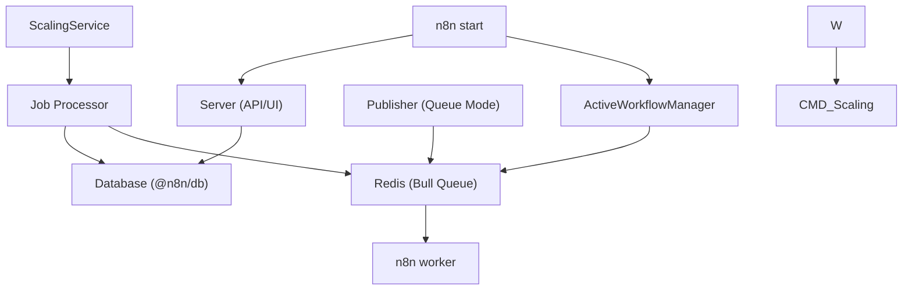

# CLI Commands and Execution Modes

Relevant source files

-   [packages/@n8n/api-types/src/frontend-settings.ts](https://github.com/n8n-io/n8n/blob/88f170b9/packages/@n8n/api-types/src/frontend-settings.ts)
-   [packages/@n8n/api-types/src/push/collaboration.ts](https://github.com/n8n-io/n8n/blob/88f170b9/packages/@n8n/api-types/src/push/collaboration.ts)
-   [packages/@n8n/backend-common/src/license-state.ts](https://github.com/n8n-io/n8n/blob/88f170b9/packages/@n8n/backend-common/src/license-state.ts)
-   [packages/@n8n/config/src/decorators.ts](https://github.com/n8n-io/n8n/blob/88f170b9/packages/@n8n/config/src/decorators.ts)
-   [packages/@n8n/config/src/index.ts](https://github.com/n8n-io/n8n/blob/88f170b9/packages/@n8n/config/src/index.ts)
-   [packages/@n8n/config/test/config.test.ts](https://github.com/n8n-io/n8n/blob/88f170b9/packages/@n8n/config/test/config.test.ts)
-   [packages/@n8n/config/test/decorators.test.ts](https://github.com/n8n-io/n8n/blob/88f170b9/packages/@n8n/config/test/decorators.test.ts)
-   [packages/@n8n/config/test/string-normalization.test.ts](https://github.com/n8n-io/n8n/blob/88f170b9/packages/@n8n/config/test/string-normalization.test.ts)
-   [packages/@n8n/constants/src/index.ts](https://github.com/n8n-io/n8n/blob/88f170b9/packages/@n8n/constants/src/index.ts)
-   [packages/cli/src/\_\_tests\_\_/license.test.ts](https://github.com/n8n-io/n8n/blob/88f170b9/packages/cli/src/__tests__/license.test.ts)
-   [packages/cli/src/commands/base-command.ts](https://github.com/n8n-io/n8n/blob/88f170b9/packages/cli/src/commands/base-command.ts)
-   [packages/cli/src/commands/start.ts](https://github.com/n8n-io/n8n/blob/88f170b9/packages/cli/src/commands/start.ts)
-   [packages/cli/src/commands/webhook.ts](https://github.com/n8n-io/n8n/blob/88f170b9/packages/cli/src/commands/webhook.ts)
-   [packages/cli/src/commands/worker.ts](https://github.com/n8n-io/n8n/blob/88f170b9/packages/cli/src/commands/worker.ts)
-   [packages/cli/src/config/index.ts](https://github.com/n8n-io/n8n/blob/88f170b9/packages/cli/src/config/index.ts)
-   [packages/cli/src/config/schema.ts](https://github.com/n8n-io/n8n/blob/88f170b9/packages/cli/src/config/schema.ts)
-   [packages/cli/src/constants.ts](https://github.com/n8n-io/n8n/blob/88f170b9/packages/cli/src/constants.ts)
-   [packages/cli/src/controllers/e2e.controller.ts](https://github.com/n8n-io/n8n/blob/88f170b9/packages/cli/src/controllers/e2e.controller.ts)
-   [packages/cli/src/deprecation/\_\_tests\_\_/deprecation.service.test.ts](https://github.com/n8n-io/n8n/blob/88f170b9/packages/cli/src/deprecation/__tests__/deprecation.service.test.ts)
-   [packages/cli/src/deprecation/deprecation.service.ts](https://github.com/n8n-io/n8n/blob/88f170b9/packages/cli/src/deprecation/deprecation.service.ts)
-   [packages/cli/src/errors/response-errors/locked.error.ts](https://github.com/n8n-io/n8n/blob/88f170b9/packages/cli/src/errors/response-errors/locked.error.ts)
-   [packages/cli/src/license.ts](https://github.com/n8n-io/n8n/blob/88f170b9/packages/cli/src/license.ts)
-   [packages/cli/src/modules/breaking-changes/rules/v2/\_\_tests\_\_/binary-data-storage.rule.test.ts](https://github.com/n8n-io/n8n/blob/88f170b9/packages/cli/src/modules/breaking-changes/rules/v2/__tests__/binary-data-storage.rule.test.ts)
-   [packages/cli/src/modules/breaking-changes/rules/v2/\_\_tests\_\_/cli-replace-update-workflow-command.rule.test.ts](https://github.com/n8n-io/n8n/blob/88f170b9/packages/cli/src/modules/breaking-changes/rules/v2/__tests__/cli-replace-update-workflow-command.rule.test.ts)
-   [packages/cli/src/modules/breaking-changes/rules/v2/\_\_tests\_\_/disabled-nodes.rule.test.ts](https://github.com/n8n-io/n8n/blob/88f170b9/packages/cli/src/modules/breaking-changes/rules/v2/__tests__/disabled-nodes.rule.test.ts)
-   [packages/cli/src/modules/breaking-changes/rules/v2/\_\_tests\_\_/dotenv-upgrade.rule.test.ts](https://github.com/n8n-io/n8n/blob/88f170b9/packages/cli/src/modules/breaking-changes/rules/v2/__tests__/dotenv-upgrade.rule.test.ts)
-   [packages/cli/src/modules/breaking-changes/rules/v2/\_\_tests\_\_/oauth-callback-auth.rule.test.ts](https://github.com/n8n-io/n8n/blob/88f170b9/packages/cli/src/modules/breaking-changes/rules/v2/__tests__/oauth-callback-auth.rule.test.ts)
-   [packages/cli/src/modules/breaking-changes/rules/v2/\_\_tests\_\_/pyodide-removed.rule.test.ts](https://github.com/n8n-io/n8n/blob/88f170b9/packages/cli/src/modules/breaking-changes/rules/v2/__tests__/pyodide-removed.rule.test.ts)
-   [packages/cli/src/modules/breaking-changes/rules/v2/\_\_tests\_\_/queue-worker-max-stalled-count.rule.test.ts](https://github.com/n8n-io/n8n/blob/88f170b9/packages/cli/src/modules/breaking-changes/rules/v2/__tests__/queue-worker-max-stalled-count.rule.test.ts)
-   [packages/cli/src/modules/breaking-changes/rules/v2/\_\_tests\_\_/start-node-removed.rule.test.ts](https://github.com/n8n-io/n8n/blob/88f170b9/packages/cli/src/modules/breaking-changes/rules/v2/__tests__/start-node-removed.rule.test.ts)
-   [packages/cli/src/modules/breaking-changes/rules/v2/\_\_tests\_\_/workflow-hooks-deprecated.rule.test.ts](https://github.com/n8n-io/n8n/blob/88f170b9/packages/cli/src/modules/breaking-changes/rules/v2/__tests__/workflow-hooks-deprecated.rule.test.ts)
-   [packages/cli/src/modules/breaking-changes/rules/v2/binary-data-storage.rule.ts](https://github.com/n8n-io/n8n/blob/88f170b9/packages/cli/src/modules/breaking-changes/rules/v2/binary-data-storage.rule.ts)
-   [packages/cli/src/modules/breaking-changes/rules/v2/cli-replace-update-workflow-command.rule.ts](https://github.com/n8n-io/n8n/blob/88f170b9/packages/cli/src/modules/breaking-changes/rules/v2/cli-replace-update-workflow-command.rule.ts)
-   [packages/cli/src/modules/breaking-changes/rules/v2/disabled-nodes.rule.ts](https://github.com/n8n-io/n8n/blob/88f170b9/packages/cli/src/modules/breaking-changes/rules/v2/disabled-nodes.rule.ts)
-   [packages/cli/src/modules/breaking-changes/rules/v2/dotenv-upgrade.rule.ts](https://github.com/n8n-io/n8n/blob/88f170b9/packages/cli/src/modules/breaking-changes/rules/v2/dotenv-upgrade.rule.ts)
-   [packages/cli/src/modules/breaking-changes/rules/v2/oauth-callback-auth.rule.ts](https://github.com/n8n-io/n8n/blob/88f170b9/packages/cli/src/modules/breaking-changes/rules/v2/oauth-callback-auth.rule.ts)
-   [packages/cli/src/modules/breaking-changes/rules/v2/pyodide-removed.rule.ts](https://github.com/n8n-io/n8n/blob/88f170b9/packages/cli/src/modules/breaking-changes/rules/v2/pyodide-removed.rule.ts)
-   [packages/cli/src/modules/breaking-changes/rules/v2/queue-worker-max-stalled-count.rule.ts](https://github.com/n8n-io/n8n/blob/88f170b9/packages/cli/src/modules/breaking-changes/rules/v2/queue-worker-max-stalled-count.rule.ts)
-   [packages/cli/src/modules/breaking-changes/rules/v2/start-node-removed.rule.ts](https://github.com/n8n-io/n8n/blob/88f170b9/packages/cli/src/modules/breaking-changes/rules/v2/start-node-removed.rule.ts)
-   [packages/cli/src/modules/breaking-changes/rules/v2/workflow-hooks-deprecated.rule.ts](https://github.com/n8n-io/n8n/blob/88f170b9/packages/cli/src/modules/breaking-changes/rules/v2/workflow-hooks-deprecated.rule.ts)
-   [packages/cli/src/services/\_\_tests\_\_/frontend.service.test.ts](https://github.com/n8n-io/n8n/blob/88f170b9/packages/cli/src/services/__tests__/frontend.service.test.ts)
-   [packages/cli/src/services/frontend.service.ts](https://github.com/n8n-io/n8n/blob/88f170b9/packages/cli/src/services/frontend.service.ts)
-   [packages/cli/test/integration/commands/worker.cmd.test.ts](https://github.com/n8n-io/n8n/blob/88f170b9/packages/cli/test/integration/commands/worker.cmd.test.ts)
-   [packages/core/jest.config.js](https://github.com/n8n-io/n8n/blob/88f170b9/packages/core/jest.config.js)
-   [packages/core/test/setup-mocks.ts](https://github.com/n8n-io/n8n/blob/88f170b9/packages/core/test/setup-mocks.ts)
-   [packages/core/test/setup.ts](https://github.com/n8n-io/n8n/blob/88f170b9/packages/core/test/setup.ts)
-   [packages/frontend/@n8n/design-system/src/components/CanvasCollaborationPill/CanvasCollaborationPill.vue](https://github.com/n8n-io/n8n/blob/88f170b9/packages/frontend/@n8n/design-system/src/components/CanvasCollaborationPill/CanvasCollaborationPill.vue)
-   [packages/frontend/@n8n/design-system/src/components/N8nLogo/Logo.vue](https://github.com/n8n-io/n8n/blob/88f170b9/packages/frontend/@n8n/design-system/src/components/N8nLogo/Logo.vue)
-   [packages/frontend/@n8n/stores/src/useRootStore.ts](https://github.com/n8n-io/n8n/blob/88f170b9/packages/frontend/@n8n/stores/src/useRootStore.ts)
-   [packages/frontend/editor-ui/src/\_\_tests\_\_/defaults.ts](https://github.com/n8n-io/n8n/blob/88f170b9/packages/frontend/editor-ui/src/__tests__/defaults.ts)
-   [packages/frontend/editor-ui/src/app/components/MainHeader/TabBar.vue](https://github.com/n8n-io/n8n/blob/88f170b9/packages/frontend/editor-ui/src/app/components/MainHeader/TabBar.vue)
-   [packages/frontend/editor-ui/src/app/stores/settings.store.test.ts](https://github.com/n8n-io/n8n/blob/88f170b9/packages/frontend/editor-ui/src/app/stores/settings.store.test.ts)
-   [packages/frontend/editor-ui/src/app/stores/settings.store.ts](https://github.com/n8n-io/n8n/blob/88f170b9/packages/frontend/editor-ui/src/app/stores/settings.store.ts)
-   [packages/nodes-base/test/setup.ts](https://github.com/n8n-io/n8n/blob/88f170b9/packages/nodes-base/test/setup.ts)

This document describes the command-line interface (CLI) commands available in n8n and the execution modes that determine how workflow executions are processed. It covers the binary boot sequence, `BaseCommand` lifecycle, the `start`/`worker`/`webhook` commands, and the configuration system that drives process behavior.

## Overview

n8n provides three primary CLI commands (`start`, `worker`, `webhook`) that launch different process types, each with specific responsibilities. The system supports two execution modes: **regular mode** (in-process execution) and **queue mode** (distributed execution via Redis/Bull), which fundamentally change how workflow executions are orchestrated across processes.

The `n8n` binary (`packages/cli/bin/n8n`) bootstraps the process, initializes environment configuration, and delegates to `CommandRegistry`. `CommandRegistry` identifies the target command from `process.argv[2]`, instantiates the matching class via the `@n8n/di` container, and drives the command lifecycle: flag parsing → `init()` → `run()`. Each command class extends `BaseCommand` and is annotated with the `@Command` decorator.

## n8n Binary Boot Sequence

The entry point for the n8n process is `packages/cli/bin/n8n`. It performs several ordered steps before any application code runs.

**Boot steps (in order):**

| Step | Code / Mechanism | Notes |
| --- | --- | --- |
| 1\. Version flags | `process.argv.slice(-1)[0]` check | `-v`, `-V`, `--version` print version and exit [packages/cli/bin/n8n11-15](https://github.com/n8n-io/n8n/blob/88f170b9/packages/cli/bin/n8n#L11-L15) |
| 2\. Node.js version check | `semver.satisfies` | Exits with error if unsatisfied [packages/cli/bin/n8n17-23](https://github.com/n8n-io/n8n/blob/88f170b9/packages/cli/bin/n8n#L17-L23) |
| 3\. Source maps | `require('source-map-support').install()` | Readable TypeScript stack traces [packages/cli/bin/n8n32](https://github.com/n8n-io/n8n/blob/88f170b9/packages/cli/bin/n8n#L32-L32) |
| 4\. Reflect metadata | `require('reflect-metadata')` | Required for decorator-based DI [packages/cli/bin/n8n34](https://github.com/n8n-io/n8n/blob/88f170b9/packages/cli/bin/n8n#L34-L34) |
| 5\. dotenv | `require('dotenv').config()` | Skipped when `E2E_TESTS=true` [packages/cli/bin/n8n36-38](https://github.com/n8n-io/n8n/blob/88f170b9/packages/cli/bin/n8n#L36-L38) |
| 6\. Config bootstrap | `require('../dist/config')` | Triggers `GlobalConfig` and legacy convict initialization [packages/cli/bin/n8n40](https://github.com/n8n-io/n8n/blob/88f170b9/packages/cli/bin/n8n#L40-L40) |
| 7\. Command execution | `Container.get(CommandRegistry).execute()` | Resolves and runs the matched command [packages/cli/bin/n8n63](https://github.com/n8n-io/n8n/blob/88f170b9/packages/cli/bin/n8n#L63-L63) |

The config bootstrap step is critical: `packages/cli/src/config/index.ts` initializes `GlobalConfig` from `@n8n/config` before database entities are loaded, ensuring correct database driver selection.

**Boot sequence: `bin/n8n` through `CommandRegistry`**

> **[Mermaid sequence]**
> *(图表结构无法解析)*

Sources: [packages/cli/bin/n8n1-65](https://github.com/n8n-io/n8n/blob/88f170b9/packages/cli/bin/n8n#L1-L65) [packages/cli/src/config/index.ts1-73](https://github.com/n8n-io/n8n/blob/88f170b9/packages/cli/src/config/index.ts#L1-L73) [packages/cli/src/config/schema.ts1-55](https://github.com/n8n-io/n8n/blob/88f170b9/packages/cli/src/config/schema.ts#L1-L55) [packages/@n8n/config/src/index.ts74-232](https://github.com/n8n-io/n8n/blob/88f170b9/packages/@n8n/config/src/index.ts#L74-L232)

## CLI Command Architecture

### BaseCommand Initialization Sequence

`BaseCommand` is the abstract foundation for all n8n CLI commands. It handles the core initialization of the database, error reporting, and common services.

**Common Initialization Steps in `BaseCommand.init()`:**

1.  **Error Reporting**: Initializes `ErrorReporter` with Sentry configuration [packages/cli/src/commands/base-command.ts86-116](https://github.com/n8n-io/n8n/blob/88f170b9/packages/cli/src/commands/base-command.ts#L86-L116)
2.  **Database**: Initializes `DbConnection` and runs migrations [packages/cli/src/commands/base-command.ts125-145](https://github.com/n8n-io/n8n/blob/88f170b9/packages/cli/src/commands/base-command.ts#L125-L145)
3.  **Nodes & Credentials**: Triggers `LoadNodesAndCredentials.init()` to discover available integrations [packages/cli/src/commands/base-command.ts123](https://github.com/n8n-io/n8n/blob/88f170b9/packages/cli/src/commands/base-command.ts#L123-L123)
4.  **Task Runners**: If `needsTaskRunner` is true, starts the `TaskRunnerModule` for sandboxed code execution [packages/cli/src/commands/base-command.ts169-178](https://github.com/n8n-io/n8n/blob/88f170b9/packages/cli/src/commands/base-command.ts#L169-L178)
5.  **Telemetry**: Initializes `PostHogClient` and `TelemetryEventRelay` [packages/cli/src/commands/base-command.ts183-185](https://github.com/n8n-io/n8n/blob/88f170b9/packages/cli/src/commands/base-command.ts#L183-L185)

Sources: [packages/cli/src/commands/base-command.ts84-186](https://github.com/n8n-io/n8n/blob/88f170b9/packages/cli/src/commands/base-command.ts#L84-L186)

### Start Command

The `Start` command launches the main application server. It is responsible for the Web UI, API, and (in regular mode) workflow execution.

**Key Responsibilities:**

-   **Static Assets**: Generates `index.html` with injected configuration tags like `rest-endpoint` and `sentry` DSN [packages/cli/src/commands/start.ts123-142](https://github.com/n8n-io/n8n/blob/88f170b9/packages/cli/src/commands/start.ts#L123-L142)
-   **Server**: Starts the `Server` instance which listens on `N8N_PORT` [packages/cli/src/commands/start.ts302](https://github.com/n8n-io/n8n/blob/88f170b9/packages/cli/src/commands/start.ts#L302-L302)
-   **Workflow Management**: Initializes `ActiveWorkflowManager` to start triggers and pollers [packages/cli/src/commands/start.ts311](https://github.com/n8n-io/n8n/blob/88f170b9/packages/cli/src/commands/start.ts#L311-L311)
-   **Graceful Stop**: Removes queued activations and shuts down the `WaitTracker` and `ActiveExecutions` [packages/cli/src/commands/start.ts84-111](https://github.com/n8n-io/n8n/blob/88f170b9/packages/cli/src/commands/start.ts#L84-L111)

Sources: [packages/cli/src/commands/start.ts49-188](https://github.com/n8n-io/n8n/blob/88f170b9/packages/cli/src/commands/start.ts#L49-L188) [packages/cli/src/commands/start.ts302-368](https://github.com/n8n-io/n8n/blob/88f170b9/packages/cli/src/commands/start.ts#L302-L368)

### Worker Command

The `Worker` command starts a process that consumes jobs from a Redis queue. It forces the execution mode to `queue` [packages/cli/src/commands/worker.ts67-69](https://github.com/n8n-io/n8n/blob/88f170b9/packages/cli/src/commands/worker.ts#L67-L69)

**Key Responsibilities:**

-   **Concurrency**: Sets the number of parallel jobs based on `N8N_CONCURRENCY_PRODUCTION_LIMIT` or the `--concurrency` flag [packages/cli/src/commands/worker.ts151-163](https://github.com/n8n-io/n8n/blob/88f170b9/packages/cli/src/commands/worker.ts#L151-L163)
-   **Scaling Service**: Initializes `ScalingService` to setup the Bull queue and worker [packages/cli/src/commands/worker.ts165-172](https://github.com/n8n-io/n8n/blob/88f170b9/packages/cli/src/commands/worker.ts#L165-L172)
-   **Orchestration**: Connects to Redis via `Publisher` and `Subscriber` for command/event distribution [packages/cli/src/scaling/pubsub/publisher.service.ts](https://github.com/n8n-io/n8n/blob/88f170b9/packages/cli/src/scaling/pubsub/publisher.service.ts) [packages/cli/src/commands/worker.ts141-149](https://github.com/n8n-io/n8n/blob/88f170b9/packages/cli/src/commands/worker.ts#L141-L149)
-   **Worker Server**: Optionally starts an internal server for health checks and metrics [packages/cli/src/commands/worker.ts175-186](https://github.com/n8n-io/n8n/blob/88f170b9/packages/cli/src/commands/worker.ts#L175-L186)

Sources: [packages/cli/src/commands/worker.ts26-212](https://github.com/n8n-io/n8n/blob/88f170b9/packages/cli/src/commands/worker.ts#L26-L212)

### Webhook Command

The `Webhook` command starts a process that only handles production webhook requests. It requires `queue` mode to operate [packages/cli/src/commands/webhook.ts45-59](https://github.com/n8n-io/n8n/blob/88f170b9/packages/cli/src/commands/webhook.ts#L45-L59)

**Key Responsibilities:**

-   **Webhook Server**: Starts `WebhookServer` to listen for incoming HTTP requests [packages/cli/src/commands/webhook.ts92](https://github.com/n8n-io/n8n/blob/88f170b9/packages/cli/src/commands/webhook.ts#L92-L92)
-   **Orchestration**: Subscribes to the command channel to handle global events like license reloads [packages/cli/src/commands/webhook.ts106-113](https://github.com/n8n-io/n8n/blob/88f170b9/packages/cli/src/commands/webhook.ts#L106-L113)

Sources: [packages/cli/src/commands/webhook.ts16-114](https://github.com/n8n-io/n8n/blob/88f170b9/packages/cli/src/commands/webhook.ts#L16-L114)

## Execution Modes

n8n operates in two primary modes defined by the `executions.mode` configuration.

### Mode Comparison

| Feature | Regular Mode | Queue Mode |
| --- | --- | --- |
| **Process Model** | Single process (Main) | Distributed (Main + Workers) |
| **Scaling** | Vertical only | Horizontal (add more Workers) |
| **Redis Required** | No | Yes (for Bull/Redis queue) |
| **Reliability** | Execution dies with server | Jobs persist in Redis if worker dies |

### Execution Mode Logic

Sources: [packages/cli/src/commands/start.ts101-104](https://github.com/n8n-io/n8n/blob/88f170b9/packages/cli/src/commands/start.ts#L101-L104) [packages/cli/src/commands/worker.ts165-172](https://github.com/n8n-io/n8n/blob/88f170b9/packages/cli/src/commands/worker.ts#L165-L172) [packages/cli/src/scaling/scaling.service.ts](https://github.com/n8n-io/n8n/blob/88f170b9/packages/cli/src/scaling/scaling.service.ts)

## Deprecation and Breaking Changes

n8n includes a `DeprecationService` that runs during command initialization to warn users about outdated configuration or environment variables.

**Functionality:**

-   **Warnings**: Checks for deprecated variables like `QUEUE_WORKER_TIMEOUT` and suggests the new `N8N_GRACEFUL_SHUTDOWN_TIMEOUT` [packages/cli/src/commands/worker.ts75-82](https://github.com/n8n-io/n8n/blob/88f170b9/packages/cli/src/commands/worker.ts#L75-L82)
-   **Breaking Change Rules**: The system includes a module for evaluating breaking changes (e.g., v2 changes like Pyodide removal or binary data storage changes) [packages/cli/src/modules/breaking-changes/rules/v2/pyodide-removed.rule.ts](https://github.com/n8n-io/n8n/blob/88f170b9/packages/cli/src/modules/breaking-changes/rules/v2/pyodide-removed.rule.ts)

Sources: [packages/cli/src/deprecation/deprecation.service.ts](https://github.com/n8n-io/n8n/blob/88f170b9/packages/cli/src/deprecation/deprecation.service.ts) [packages/cli/src/commands/worker.ts91](https://github.com/n8n-io/n8n/blob/88f170b9/packages/cli/src/commands/worker.ts#L91-L91)

## Configuration System

The CLI relies on the `@n8n/config` package for type-safe, decorator-based configuration.

**Key Configuration Classes:**

-   `GlobalConfig`: The root configuration class containing all sub-configs [packages/@n8n/config/src/index.ts75-232](https://github.com/n8n-io/n8n/blob/88f170b9/packages/@n8n/config/src/index.ts#L75-L232)
-   `ExecutionsConfig`: Controls the execution mode and data saving behavior [packages/@n8n/config/src/configs/executions.config.ts](https://github.com/n8n-io/n8n/blob/88f170b9/packages/@n8n/config/src/configs/executions.config.ts)
-   `ScalingModeConfig`: Configures Bull and Redis settings for queue mode [packages/@n8n/config/src/configs/scaling-mode.config.ts](https://github.com/n8n-io/n8n/blob/88f170b9/packages/@n8n/config/src/configs/scaling-mode.config.ts)

**File-based Overwrites:** n8n supports the `_FILE` convention. If an environment variable like `DB_POSTGRESDB_PASSWORD_FILE` is set, n8n reads the password from the specified file path [packages/cli/src/config/index.ts38-64](https://github.com/n8n-io/n8n/blob/88f170b9/packages/cli/src/config/index.ts#L38-L64)

Sources: [packages/@n8n/config/src/index.ts1-232](https://github.com/n8n-io/n8n/blob/88f170b9/packages/@n8n/config/src/index.ts#L1-L232) [packages/cli/src/config/index.ts36-64](https://github.com/n8n-io/n8n/blob/88f170b9/packages/cli/src/config/index.ts#L36-L64)
