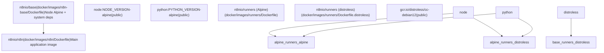
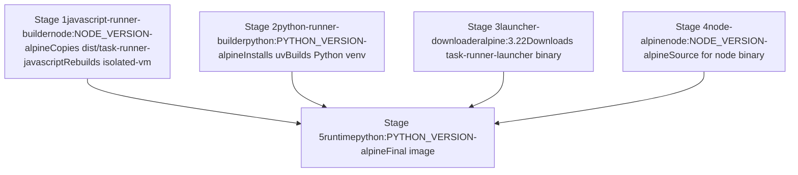
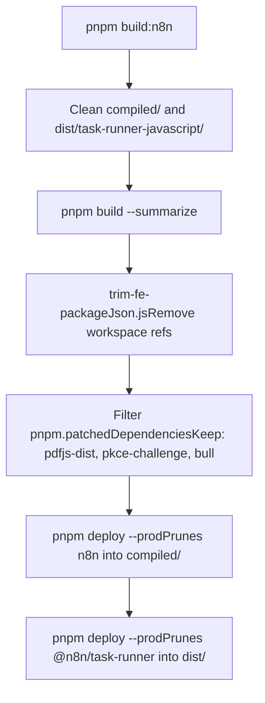

# Docker Deployment

Relevant source files

-   [.dockerignore](https://github.com/n8n-io/n8n/blob/88f170b9/.dockerignore)
-   [.github/scripts/docker/docker-config.mjs](https://github.com/n8n-io/n8n/blob/88f170b9/.github/scripts/docker/docker-config.mjs)
-   [.github/scripts/docker/docker-tags.mjs](https://github.com/n8n-io/n8n/blob/88f170b9/.github/scripts/docker/docker-tags.mjs)
-   [.github/workflows/docker-build-push.yml](https://github.com/n8n-io/n8n/blob/88f170b9/.github/workflows/docker-build-push.yml)
-   [docker/images/n8n-base/Dockerfile](https://github.com/n8n-io/n8n/blob/88f170b9/docker/images/n8n-base/Dockerfile)
-   [docker/images/n8n/Dockerfile](https://github.com/n8n-io/n8n/blob/88f170b9/docker/images/n8n/Dockerfile)
-   [docker/images/runners/Dockerfile](https://github.com/n8n-io/n8n/blob/88f170b9/docker/images/runners/Dockerfile)
-   [docker/images/runners/Dockerfile.distroless](https://github.com/n8n-io/n8n/blob/88f170b9/docker/images/runners/Dockerfile.distroless)
-   [docker/images/runners/README.md](https://github.com/n8n-io/n8n/blob/88f170b9/docker/images/runners/README.md?plain=1)
-   [packages/@n8n/benchmark/Dockerfile](https://github.com/n8n-io/n8n/blob/88f170b9/packages/@n8n/benchmark/Dockerfile)
-   [scripts/build-n8n.mjs](https://github.com/n8n-io/n8n/blob/88f170b9/scripts/build-n8n.mjs)

This page covers the Docker images produced by the n8n repository, the build scripts that assemble them, and the CI workflow that publishes them. It describes the `n8n` main image, the `n8n-base` base image, and the `runners` sidecar images (Alpine and distroless variants).

For details on the Task Broker/Runner runtime architecture and the code that runs inside the runner containers, see [7.4](https://github.com/n8n-io/n8n/blob/88f170b9/7.4) For the CI pipeline that triggers Docker builds as part of a release, see [9.4](https://github.com/n8n-io/n8n/blob/88f170b9/9.4) For the CLI commands that start n8n processes inside the container, see [7.2](https://github.com/n8n-io/n8n/blob/88f170b9/7.2)

---

## Image Hierarchy

Three distinct image families are produced from this repository:

| Image | Dockerfile | Registry Names |
| --- | --- | --- |
| `n8n` | `docker/images/n8n/Dockerfile` | `n8nio/n8n`, `ghcr.io/n8n-io/n8n` |
| `runners` (Alpine) | `docker/images/runners/Dockerfile` | `n8nio/runners`, `ghcr.io/n8n-io/runners` |
| `runners` (distroless) | `docker/images/runners/Dockerfile.distroless` | `ghcr.io/n8n-io/runners:<version>-distroless` |

The `n8n-base` image (`docker/images/n8n-base/Dockerfile`) is the upstream Alpine-based foundation for the `n8n` image and is maintained as `n8nio/base`.

**Image hierarchy:**

Sources: [docker/images/n8n/Dockerfile1-33](https://github.com/n8n-io/n8n/blob/88f170b9/docker/images/n8n/Dockerfile#L1-L33) [docker/images/n8n-base/Dockerfile1-36](https://github.com/n8n-io/n8n/blob/88f170b9/docker/images/n8n-base/Dockerfile#L1-L36) [docker/images/runners/Dockerfile1-154](https://github.com/n8n-io/n8n/blob/88f170b9/docker/images/runners/Dockerfile#L1-L154) [docker/images/runners/Dockerfile.distroless1-198](https://github.com/n8n-io/n8n/blob/88f170b9/docker/images/runners/Dockerfile.distroless#L1-L198)

---

## n8n-base Image

**File:** `docker/images/n8n-base/Dockerfile`

`n8nio/base` is an Alpine 3.22 image built on top of a hardened Node distribution from `dhi.io/node`. It installs the following OS-level dependencies in a single layer to minimize image size:

| Package | Purpose |
| --- | --- |
| `git`, `openssh` | Source control integration (EE feature) |
| `graphicsmagick` | Image manipulation (pinned to `1.3.45-r0` to avoid AGPL Ghostscript fonts) |
| `tini` | PID 1 init process |
| `tzdata` | Timezone data for `GENERIC_TIMEZONE` env var |
| `ca-certificates` | TLS root certificates |
| `libc6-compat` | glibc compatibility shims |
| `msttcorefonts` | Microsoft core fonts for PDF/report generation |

`NODE_PATH` is set to `/opt/nodejs/node-v${NODE_VERSION}/lib/node_modules` to ensure that globally installed packages are discoverable by `require()`.

Sources: [docker/images/n8n-base/Dockerfile1-36](https://github.com/n8n-io/n8n/blob/88f170b9/docker/images/n8n-base/Dockerfile#L1-L36)

---

## n8n Main Image

**File:** `docker/images/n8n/Dockerfile`

The `n8n` image uses a multi-stage build where a `builder` stage compiles native addons before they are moved to the final `n8nio/base` layer.

**Build ARGs:**

| ARG | Default | Purpose |
| --- | --- | --- |
| `NODE_VERSION` | `24.13.1` | Must match the base image Node version |
| `N8N_VERSION` | `snapshot` | Set as `org.opencontainers.image.version` label |
| `N8N_RELEASE_TYPE` | `dev` | Set as `N8N_RELEASE_TYPE` env var inside container |

**Build Stages:**

1.  **builder**: Copies `./compiled` artifacts and runs `npm rebuild sqlite3 isolated-vm` using `python3`, `make`, and `g++` [docker/images/n8n/Dockerfile6-10](https://github.com/n8n-io/n8n/blob/88f170b9/docker/images/n8n/Dockerfile#L6-L10)
2.  **final**: Copies the rebuilt modules from the builder [docker/images/n8n/Dockerfile22](https://github.com/n8n-io/n8n/blob/88f170b9/docker/images/n8n/Dockerfile#L22-L22)

**Key runtime properties:**

| Property | Value |
| --- | --- |
| `WORKDIR` | `/home/node` |
| `USER` | `node` (non-root) |
| `EXPOSE` | `5678/tcp` |
| `ENTRYPOINT` | `["tini", "--", "/docker-entrypoint.sh"]` |
| `NODE_ENV` | `production` |

The build requires a `compiled/` directory to exist, which is generated by the `scripts/build-n8n.mjs` script [scripts/build-n8n.mjs196-200](https://github.com/n8n-io/n8n/blob/88f170b9/scripts/build-n8n.mjs#L196-L200)

Sources: [docker/images/n8n/Dockerfile1-38](https://github.com/n8n-io/n8n/blob/88f170b9/docker/images/n8n/Dockerfile#L1-L38) [scripts/build-n8n.mjs77-134](https://github.com/n8n-io/n8n/blob/88f170b9/scripts/build-n8n.mjs#L77-L134)

---

## Runners Sidecar Images

The runners image provides isolated environments for executing user-provided code (JavaScript/Python) via the `Code Node`.

### Alpine Variant

**File:** `docker/images/runners/Dockerfile`

This is a five-stage build combining the JavaScript runner, Python runner, and a Go-based launcher.

**Multi-stage build flow:**

The final stage includes `uv`, `node`, `corepack`, and `pnpm` to allow users to extend the image with additional dependencies [docker/images/runners/Dockerfile125-140](https://github.com/n8n-io/n8n/blob/88f170b9/docker/images/runners/Dockerfile#L125-L140)

### Distroless Variant

**File:** `docker/images/runners/Dockerfile.distroless`

Targeted at cloud environments, this variant uses `gcr.io/distroless/cc-debian12`. It lacks a shell and package manager. A `runtime-prep` stage (Stage 5) is used to organize the filesystem and architecture-specific Python libraries before copying them into the final distroless layer [docker/images/runners/Dockerfile.distroless140-154](https://github.com/n8n-io/n8n/blob/88f170b9/docker/images/runners/Dockerfile.distroless#L140-L154)

Sources: [docker/images/runners/Dockerfile1-162](https://github.com/n8n-io/n8n/blob/88f170b9/docker/images/runners/Dockerfile#L1-L162) [docker/images/runners/Dockerfile.distroless1-160](https://github.com/n8n-io/n8n/blob/88f170b9/docker/images/runners/Dockerfile.distroless#L1-L160)

---

## Production Build Pipeline

**File:** `scripts/build-n8n.mjs`

The `build-n8n.mjs` script orchestrates the preparation of artifacts for Docker.

**Artifact Preparation Flow:**

The script ensures that only necessary backend patches are retained [scripts/build-n8n.mjs38-40](https://github.com/n8n-io/n8n/blob/88f170b9/scripts/build-n8n.mjs#L38-L40) and that the frontend code is trimmed to avoid including development-only dependencies in the production image [scripts/build-n8n.mjs157](https://github.com/n8n-io/n8n/blob/88f170b9/scripts/build-n8n.mjs#L157-L157)

Sources: [scripts/build-n8n.mjs1-210](https://github.com/n8n-io/n8n/blob/88f170b9/scripts/build-n8n.mjs#L1-L210)

---

## CI Build and Push Workflow

**File:** `.github/workflows/docker-build-push.yml`

The CI workflow uses `docker-config.mjs` to determine the build context and `docker-tags.mjs` to generate tags based on the trigger (e.g., `schedule`, `push`, `release`).

**CI Execution Logic:**

> **[Mermaid sequence]**
> *(图表结构无法解析)*

**Key CI Steps:**

-   **Determine Build Context**: Evaluates the GitHub event to set `version` (e.g., `nightly`, `dev`, or a semver) [.github/scripts/docker/docker-config.mjs11-66](https://github.com/n8n-io/n8n/blob/88f170b9/ .github/scripts/docker/docker-config.mjs#L11-L66)
-   **Multi-Arch Support**: Generates a matrix for `linux/amd64` and `linux/arm64` using Blacksmith runners [.github/scripts/docker/docker-config.mjs89-110](https://github.com/n8n-io/n8n/blob/88f170b9/ .github/scripts/docker/docker-config.mjs#L89-L110)
-   **Attestation**: Generates SLSA L3 provenance and VEX attestations for security transparency [.github/workflows/docker-build-push.yml131-132](https://github.com/n8n-io/n8n/blob/88f170b9/.github/workflows/docker-build-push.yml#L131-L132)

Sources: [.github/workflows/docker-build-push.yml46-167](https://github.com/n8n-io/n8n/blob/88f170b9/.github/workflows/docker-build-push.yml#L46-L167) [.github/scripts/docker/docker-config.mjs1-178](https://github.com/n8n-io/n8n/blob/88f170b9/.github/scripts/docker/docker-config.mjs#L1-L178) [.github/scripts/docker/docker-tags.mjs1-114](https://github.com/n8n-io/n8n/blob/88f170b9/.github/scripts/docker/docker-tags.mjs#L1-L114)

---

## Docker Build Context

**File:** `.dockerignore`

To keep the build context small, n8n uses a strict whitelist in `.dockerignore`. Only the following are sent to the Docker daemon:

-   `compiled/` (for the main n8n image) [.dockerignore8-9](https://github.com/n8n-io/n8n/blob/88f170b9/.dockerignore#L8-L9)
-   `dist/task-runner-javascript/` (for runners) [.dockerignore13-15](https://github.com/n8n-io/n8n/blob/88f170b9/.dockerignore#L13-L15)
-   `packages/@n8n/task-runner-python/` [.dockerignore18-19](https://github.com/n8n-io/n8n/blob/88f170b9/.dockerignore#L18-L19)
-   `docker/images/` (entrypoints and configs) [.dockerignore22-27](https://github.com/n8n-io/n8n/blob/88f170b9/.dockerignore#L22-L27)

Sources: [.dockerignore1-41](https://github.com/n8n-io/n8n/blob/88f170b9/.dockerignore#L1-L41)
