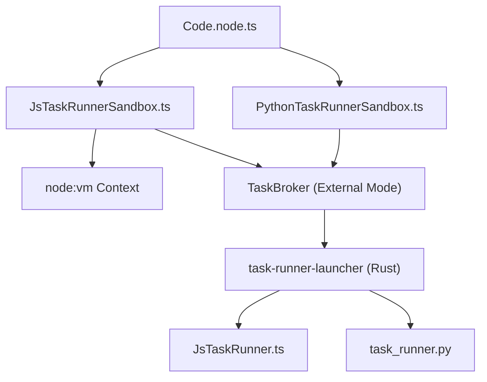
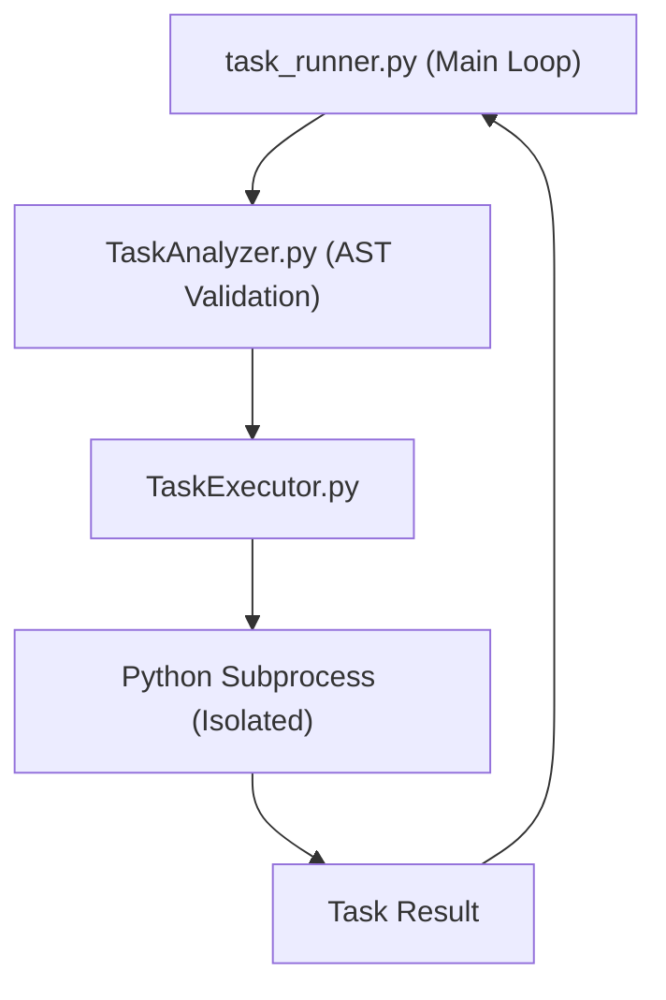

# Task Runners and Sandboxed Execution

Relevant source files

-   [.github/workflows/ci-python.yml](https://github.com/n8n-io/n8n/blob/88f170b9/.github/workflows/ci-python.yml)
-   [packages/@n8n/config/src/configs/runners.config.ts](https://github.com/n8n-io/n8n/blob/88f170b9/packages/@n8n/config/src/configs/runners.config.ts)
-   [packages/@n8n/nodes-langchain/nodes/code/Code.node.ts](https://github.com/n8n-io/n8n/blob/88f170b9/packages/@n8n/nodes-langchain/nodes/code/Code.node.ts)
-   [packages/@n8n/task-runner-python/.python-version](https://github.com/n8n-io/n8n/blob/88f170b9/packages/@n8n/task-runner-python/.python-version)
-   [packages/@n8n/task-runner-python/README.md](https://github.com/n8n-io/n8n/blob/88f170b9/packages/@n8n/task-runner-python/README.md?plain=1)
-   [packages/@n8n/task-runner-python/justfile](https://github.com/n8n-io/n8n/blob/88f170b9/packages/@n8n/task-runner-python/justfile)
-   [packages/@n8n/task-runner-python/pyproject.toml](https://github.com/n8n-io/n8n/blob/88f170b9/packages/@n8n/task-runner-python/pyproject.toml)
-   [packages/@n8n/task-runner-python/src/config/health\_check\_config.py](https://github.com/n8n-io/n8n/blob/88f170b9/packages/@n8n/task-runner-python/src/config/health_check_config.py)
-   [packages/@n8n/task-runner-python/src/config/security\_config.py](https://github.com/n8n-io/n8n/blob/88f170b9/packages/@n8n/task-runner-python/src/config/security_config.py)
-   [packages/@n8n/task-runner-python/src/config/sentry\_config.py](https://github.com/n8n-io/n8n/blob/88f170b9/packages/@n8n/task-runner-python/src/config/sentry_config.py)
-   [packages/@n8n/task-runner-python/src/config/task\_runner\_config.py](https://github.com/n8n-io/n8n/blob/88f170b9/packages/@n8n/task-runner-python/src/config/task_runner_config.py)
-   [packages/@n8n/task-runner-python/src/constants.py](https://github.com/n8n-io/n8n/blob/88f170b9/packages/@n8n/task-runner-python/src/constants.py)
-   [packages/@n8n/task-runner-python/src/env.py](https://github.com/n8n-io/n8n/blob/88f170b9/packages/@n8n/task-runner-python/src/env.py)
-   [packages/@n8n/task-runner-python/src/errors/\_\_init\_\_.py](https://github.com/n8n-io/n8n/blob/88f170b9/packages/@n8n/task-runner-python/src/errors/__init__.py)
-   [packages/@n8n/task-runner-python/src/errors/configuration\_error.py](https://github.com/n8n-io/n8n/blob/88f170b9/packages/@n8n/task-runner-python/src/errors/configuration_error.py)
-   [packages/@n8n/task-runner-python/src/errors/invalid\_pipe\_msg\_content\_error.py](https://github.com/n8n-io/n8n/blob/88f170b9/packages/@n8n/task-runner-python/src/errors/invalid_pipe_msg_content_error.py)
-   [packages/@n8n/task-runner-python/src/errors/invalid\_pipe\_msg\_length\_error.py](https://github.com/n8n-io/n8n/blob/88f170b9/packages/@n8n/task-runner-python/src/errors/invalid_pipe_msg_length_error.py)
-   [packages/@n8n/task-runner-python/src/errors/security\_violation\_error.py](https://github.com/n8n-io/n8n/blob/88f170b9/packages/@n8n/task-runner-python/src/errors/security_violation_error.py)
-   [packages/@n8n/task-runner-python/src/errors/task\_result\_read\_error.py](https://github.com/n8n-io/n8n/blob/88f170b9/packages/@n8n/task-runner-python/src/errors/task_result_read_error.py)
-   [packages/@n8n/task-runner-python/src/errors/task\_runtime\_error.py](https://github.com/n8n-io/n8n/blob/88f170b9/packages/@n8n/task-runner-python/src/errors/task_runtime_error.py)
-   [packages/@n8n/task-runner-python/src/errors/task\_subprocess\_failed\_error.py](https://github.com/n8n-io/n8n/blob/88f170b9/packages/@n8n/task-runner-python/src/errors/task_subprocess_failed_error.py)
-   [packages/@n8n/task-runner-python/src/health\_check\_server.py](https://github.com/n8n-io/n8n/blob/88f170b9/packages/@n8n/task-runner-python/src/health_check_server.py)
-   [packages/@n8n/task-runner-python/src/import\_validation.py](https://github.com/n8n-io/n8n/blob/88f170b9/packages/@n8n/task-runner-python/src/import_validation.py)
-   [packages/@n8n/task-runner-python/src/logs.py](https://github.com/n8n-io/n8n/blob/88f170b9/packages/@n8n/task-runner-python/src/logs.py)
-   [packages/@n8n/task-runner-python/src/main.py](https://github.com/n8n-io/n8n/blob/88f170b9/packages/@n8n/task-runner-python/src/main.py)
-   [packages/@n8n/task-runner-python/src/message\_serde.py](https://github.com/n8n-io/n8n/blob/88f170b9/packages/@n8n/task-runner-python/src/message_serde.py)
-   [packages/@n8n/task-runner-python/src/message\_types/\_\_init\_\_.py](https://github.com/n8n-io/n8n/blob/88f170b9/packages/@n8n/task-runner-python/src/message_types/__init__.py)
-   [packages/@n8n/task-runner-python/src/message\_types/broker.py](https://github.com/n8n-io/n8n/blob/88f170b9/packages/@n8n/task-runner-python/src/message_types/broker.py)
-   [packages/@n8n/task-runner-python/src/message\_types/pipe.py](https://github.com/n8n-io/n8n/blob/88f170b9/packages/@n8n/task-runner-python/src/message_types/pipe.py)
-   [packages/@n8n/task-runner-python/src/message\_types/runner.py](https://github.com/n8n-io/n8n/blob/88f170b9/packages/@n8n/task-runner-python/src/message_types/runner.py)
-   [packages/@n8n/task-runner-python/src/nanoid.py](https://github.com/n8n-io/n8n/blob/88f170b9/packages/@n8n/task-runner-python/src/nanoid.py)
-   [packages/@n8n/task-runner-python/src/pipe\_reader.py](https://github.com/n8n-io/n8n/blob/88f170b9/packages/@n8n/task-runner-python/src/pipe_reader.py)
-   [packages/@n8n/task-runner-python/src/sentry.py](https://github.com/n8n-io/n8n/blob/88f170b9/packages/@n8n/task-runner-python/src/sentry.py)
-   [packages/@n8n/task-runner-python/src/task\_analyzer.py](https://github.com/n8n-io/n8n/blob/88f170b9/packages/@n8n/task-runner-python/src/task_analyzer.py)
-   [packages/@n8n/task-runner-python/src/task\_executor.py](https://github.com/n8n-io/n8n/blob/88f170b9/packages/@n8n/task-runner-python/src/task_executor.py)
-   [packages/@n8n/task-runner-python/src/task\_runner.py](https://github.com/n8n-io/n8n/blob/88f170b9/packages/@n8n/task-runner-python/src/task_runner.py)
-   [packages/@n8n/task-runner-python/src/task\_state.py](https://github.com/n8n-io/n8n/blob/88f170b9/packages/@n8n/task-runner-python/src/task_state.py)
-   [packages/@n8n/task-runner-python/tests/fixtures/local\_task\_broker.py](https://github.com/n8n-io/n8n/blob/88f170b9/packages/@n8n/task-runner-python/tests/fixtures/local_task_broker.py)
-   [packages/@n8n/task-runner-python/tests/fixtures/task\_runner\_manager.py](https://github.com/n8n-io/n8n/blob/88f170b9/packages/@n8n/task-runner-python/tests/fixtures/task_runner_manager.py)
-   [packages/@n8n/task-runner-python/tests/fixtures/test\_constants.py](https://github.com/n8n-io/n8n/blob/88f170b9/packages/@n8n/task-runner-python/tests/fixtures/test_constants.py)
-   [packages/@n8n/task-runner-python/tests/integration/conftest.py](https://github.com/n8n-io/n8n/blob/88f170b9/packages/@n8n/task-runner-python/tests/integration/conftest.py)
-   [packages/@n8n/task-runner-python/tests/integration/test\_execution.py](https://github.com/n8n-io/n8n/blob/88f170b9/packages/@n8n/task-runner-python/tests/integration/test_execution.py)
-   [packages/@n8n/task-runner-python/tests/integration/test\_health\_check.py](https://github.com/n8n-io/n8n/blob/88f170b9/packages/@n8n/task-runner-python/tests/integration/test_health_check.py)
-   [packages/@n8n/task-runner-python/tests/integration/test\_rpc.py](https://github.com/n8n-io/n8n/blob/88f170b9/packages/@n8n/task-runner-python/tests/integration/test_rpc.py)
-   [packages/@n8n/task-runner-python/tests/unit/test\_env.py](https://github.com/n8n-io/n8n/blob/88f170b9/packages/@n8n/task-runner-python/tests/unit/test_env.py)
-   [packages/@n8n/task-runner-python/tests/unit/test\_sentry.py](https://github.com/n8n-io/n8n/blob/88f170b9/packages/@n8n/task-runner-python/tests/unit/test_sentry.py)
-   [packages/@n8n/task-runner-python/tests/unit/test\_task\_analyzer.py](https://github.com/n8n-io/n8n/blob/88f170b9/packages/@n8n/task-runner-python/tests/unit/test_task_analyzer.py)
-   [packages/@n8n/task-runner-python/tests/unit/test\_task\_executor.py](https://github.com/n8n-io/n8n/blob/88f170b9/packages/@n8n/task-runner-python/tests/unit/test_task_executor.py)
-   [packages/@n8n/task-runner-python/uv.lock](https://github.com/n8n-io/n8n/blob/88f170b9/packages/@n8n/task-runner-python/uv.lock)
-   [packages/@n8n/task-runner/src/config/base-runner-config.ts](https://github.com/n8n-io/n8n/blob/88f170b9/packages/@n8n/task-runner/src/config/base-runner-config.ts)
-   [packages/@n8n/task-runner/src/js-task-runner/\_\_tests\_\_/js-task-runner.test.ts](https://github.com/n8n-io/n8n/blob/88f170b9/packages/@n8n/task-runner/src/js-task-runner/__tests__/js-task-runner.test.ts)
-   [packages/@n8n/task-runner/src/js-task-runner/\_\_tests\_\_/test-data.ts](https://github.com/n8n-io/n8n/blob/88f170b9/packages/@n8n/task-runner/src/js-task-runner/__tests__/test-data.ts)
-   [packages/@n8n/task-runner/src/js-task-runner/errors/task-cancelled-error.ts](https://github.com/n8n-io/n8n/blob/88f170b9/packages/@n8n/task-runner/src/js-task-runner/errors/task-cancelled-error.ts)
-   [packages/@n8n/task-runner/src/js-task-runner/errors/timeout-error.ts](https://github.com/n8n-io/n8n/blob/88f170b9/packages/@n8n/task-runner/src/js-task-runner/errors/timeout-error.ts)
-   [packages/@n8n/task-runner/src/js-task-runner/js-task-runner.ts](https://github.com/n8n-io/n8n/blob/88f170b9/packages/@n8n/task-runner/src/js-task-runner/js-task-runner.ts)
-   [packages/@n8n/task-runner/src/js-task-runner/obj-utils.ts](https://github.com/n8n-io/n8n/blob/88f170b9/packages/@n8n/task-runner/src/js-task-runner/obj-utils.ts)
-   [packages/@n8n/task-runner/src/message-types.ts](https://github.com/n8n-io/n8n/blob/88f170b9/packages/@n8n/task-runner/src/message-types.ts)
-   [packages/@n8n/task-runner/src/runner-types.ts](https://github.com/n8n-io/n8n/blob/88f170b9/packages/@n8n/task-runner/src/runner-types.ts)
-   [packages/@n8n/task-runner/src/start.ts](https://github.com/n8n-io/n8n/blob/88f170b9/packages/@n8n/task-runner/src/start.ts)
-   [packages/@n8n/task-runner/src/task-runner.ts](https://github.com/n8n-io/n8n/blob/88f170b9/packages/@n8n/task-runner/src/task-runner.ts)
-   [packages/cli/src/task-runners/\_\_tests\_\_/task-runner-process-restart-loop-detector.test.ts](https://github.com/n8n-io/n8n/blob/88f170b9/packages/cli/src/task-runners/__tests__/task-runner-process-restart-loop-detector.test.ts)
-   [packages/cli/src/task-runners/\_\_tests\_\_/task-runner-process.test.ts](https://github.com/n8n-io/n8n/blob/88f170b9/packages/cli/src/task-runners/__tests__/task-runner-process.test.ts)
-   [packages/cli/src/task-runners/errors/missing-requirements.error.ts](https://github.com/n8n-io/n8n/blob/88f170b9/packages/cli/src/task-runners/errors/missing-requirements.error.ts)
-   [packages/cli/src/task-runners/internal-task-runner-disconnect-analyzer.ts](https://github.com/n8n-io/n8n/blob/88f170b9/packages/cli/src/task-runners/internal-task-runner-disconnect-analyzer.ts)
-   [packages/cli/src/task-runners/task-managers/\_\_tests\_\_/data-request-response-builder.test.ts](https://github.com/n8n-io/n8n/blob/88f170b9/packages/cli/src/task-runners/task-managers/__tests__/data-request-response-builder.test.ts)
-   [packages/cli/src/task-runners/task-managers/\_\_tests\_\_/data-request-response-stripper.test.ts](https://github.com/n8n-io/n8n/blob/88f170b9/packages/cli/src/task-runners/task-managers/__tests__/data-request-response-stripper.test.ts)
-   [packages/cli/src/task-runners/task-managers/data-request-response-builder.ts](https://github.com/n8n-io/n8n/blob/88f170b9/packages/cli/src/task-runners/task-managers/data-request-response-builder.ts)
-   [packages/cli/src/task-runners/task-managers/data-request-response-stripper.ts](https://github.com/n8n-io/n8n/blob/88f170b9/packages/cli/src/task-runners/task-managers/data-request-response-stripper.ts)
-   [packages/cli/src/task-runners/task-runner-module.ts](https://github.com/n8n-io/n8n/blob/88f170b9/packages/cli/src/task-runners/task-runner-module.ts)
-   [packages/cli/src/task-runners/task-runner-process-base.ts](https://github.com/n8n-io/n8n/blob/88f170b9/packages/cli/src/task-runners/task-runner-process-base.ts)
-   [packages/cli/src/task-runners/task-runner-process-js.ts](https://github.com/n8n-io/n8n/blob/88f170b9/packages/cli/src/task-runners/task-runner-process-js.ts)
-   [packages/cli/src/task-runners/task-runner-process-py.ts](https://github.com/n8n-io/n8n/blob/88f170b9/packages/cli/src/task-runners/task-runner-process-py.ts)
-   [packages/cli/src/task-runners/task-runner-process-restart-loop-detector.ts](https://github.com/n8n-io/n8n/blob/88f170b9/packages/cli/src/task-runners/task-runner-process-restart-loop-detector.ts)
-   [packages/cli/test/integration/task-runners/js-task-runner-execution.integration.test.ts](https://github.com/n8n-io/n8n/blob/88f170b9/packages/cli/test/integration/task-runners/js-task-runner-execution.integration.test.ts)
-   [packages/cli/test/integration/task-runners/task-runner-module.external.test.ts](https://github.com/n8n-io/n8n/blob/88f170b9/packages/cli/test/integration/task-runners/task-runner-module.external.test.ts)
-   [packages/cli/test/integration/task-runners/task-runner-module.internal.test.ts](https://github.com/n8n-io/n8n/blob/88f170b9/packages/cli/test/integration/task-runners/task-runner-module.internal.test.ts)
-   [packages/cli/test/integration/task-runners/task-runner-process.test.ts](https://github.com/n8n-io/n8n/blob/88f170b9/packages/cli/test/integration/task-runners/task-runner-process.test.ts)
-   [packages/frontend/editor-ui/src/app/utils/nodeIcon.test.ts](https://github.com/n8n-io/n8n/blob/88f170b9/packages/frontend/editor-ui/src/app/utils/nodeIcon.test.ts)
-   [packages/frontend/editor-ui/src/app/utils/nodeIcon.ts](https://github.com/n8n-io/n8n/blob/88f170b9/packages/frontend/editor-ui/src/app/utils/nodeIcon.ts)
-   [packages/nodes-base/nodes/Code/Code.node.ts](https://github.com/n8n-io/n8n/blob/88f170b9/packages/nodes-base/nodes/Code/Code.node.ts)
-   [packages/nodes-base/nodes/Code/JavaScriptSandbox.ts](https://github.com/n8n-io/n8n/blob/88f170b9/packages/nodes-base/nodes/Code/JavaScriptSandbox.ts)
-   [packages/nodes-base/nodes/Code/JsTaskRunnerSandbox.ts](https://github.com/n8n-io/n8n/blob/88f170b9/packages/nodes-base/nodes/Code/JsTaskRunnerSandbox.ts)
-   [packages/nodes-base/nodes/Code/PythonTaskRunnerSandbox.ts](https://github.com/n8n-io/n8n/blob/88f170b9/packages/nodes-base/nodes/Code/PythonTaskRunnerSandbox.ts)
-   [packages/nodes-base/nodes/Code/Sandbox.ts](https://github.com/n8n-io/n8n/blob/88f170b9/packages/nodes-base/nodes/Code/Sandbox.ts)
-   [packages/nodes-base/nodes/Code/descriptions/PythonCodeDescription.ts](https://github.com/n8n-io/n8n/blob/88f170b9/packages/nodes-base/nodes/Code/descriptions/PythonCodeDescription.ts)
-   [packages/nodes-base/nodes/Code/python-runner-unavailable.error.ts](https://github.com/n8n-io/n8n/blob/88f170b9/packages/nodes-base/nodes/Code/python-runner-unavailable.error.ts)
-   [packages/nodes-base/nodes/Code/reserved-key-found-error.ts](https://github.com/n8n-io/n8n/blob/88f170b9/packages/nodes-base/nodes/Code/reserved-key-found-error.ts)
-   [packages/nodes-base/nodes/Code/result-validation.ts](https://github.com/n8n-io/n8n/blob/88f170b9/packages/nodes-base/nodes/Code/result-validation.ts)
-   [packages/nodes-base/nodes/Code/test/Code.node.test.ts](https://github.com/n8n-io/n8n/blob/88f170b9/packages/nodes-base/nodes/Code/test/Code.node.test.ts)
-   [packages/nodes-base/nodes/Code/test/JsTaskRunnerSandbox.test.ts](https://github.com/n8n-io/n8n/blob/88f170b9/packages/nodes-base/nodes/Code/test/JsTaskRunnerSandbox.test.ts)
-   [packages/nodes-base/nodes/Code/test/PythonTaskRunnerSandbox.test.ts](https://github.com/n8n-io/n8n/blob/88f170b9/packages/nodes-base/nodes/Code/test/PythonTaskRunnerSandbox.test.ts)
-   [packages/nodes-base/nodes/Code/test/utils.test.ts](https://github.com/n8n-io/n8n/blob/88f170b9/packages/nodes-base/nodes/Code/test/utils.test.ts)
-   [packages/nodes-base/nodes/Code/throw-execution-error.ts](https://github.com/n8n-io/n8n/blob/88f170b9/packages/nodes-base/nodes/Code/throw-execution-error.ts)
-   [packages/nodes-base/nodes/Code/utils.ts](https://github.com/n8n-io/n8n/blob/88f170b9/packages/nodes-base/nodes/Code/utils.ts)
-   [packages/nodes-base/nodes/Function/Function.node.ts](https://github.com/n8n-io/n8n/blob/88f170b9/packages/nodes-base/nodes/Function/Function.node.ts)
-   [packages/nodes-base/nodes/FunctionItem/FunctionItem.node.ts](https://github.com/n8n-io/n8n/blob/88f170b9/packages/nodes-base/nodes/FunctionItem/FunctionItem.node.ts)
-   [packages/nodes-base/types/xmlhttprequest-ssl.d.ts](https://github.com/n8n-io/n8n/blob/88f170b9/packages/nodes-base/types/xmlhttprequest-ssl.d.ts)
-   [packages/workflow/src/index.ts](https://github.com/n8n-io/n8n/blob/88f170b9/packages/workflow/src/index.ts)
-   [packages/workflow/src/node-helpers.ts](https://github.com/n8n-io/n8n/blob/88f170b9/packages/workflow/src/node-helpers.ts)
-   [packages/workflow/src/utils.ts](https://github.com/n8n-io/n8n/blob/88f170b9/packages/workflow/src/utils.ts)
-   [packages/workflow/test/node-helpers.test.ts](https://github.com/n8n-io/n8n/blob/88f170b9/packages/workflow/test/node-helpers.test.ts)
-   [packages/workflow/test/run-execution-data-factory.test.ts](https://github.com/n8n-io/n8n/blob/88f170b9/packages/workflow/test/run-execution-data-factory.test.ts)
-   [packages/workflow/test/utils.test.ts](https://github.com/n8n-io/n8n/blob/88f170b9/packages/workflow/test/utils.test.ts)

## Purpose and Scope

This document explains n8n's task runner architecture for executing user-provided code in isolated sandboxed environments. Task runners are separate processes that execute JavaScript and Python code from the `Code` node, isolated from the main n8n instance for security. This page covers the task runner components, the communication protocol via the Task Broker, JavaScript/Python sandboxing implementations, and deployment patterns.

## Architecture Overview

Task runners execute user code in environments separate from the main n8n process. The system supports two execution modes:

| Mode | Description | Use Case |
| --- | --- | --- |
| `internal` | Task runners run within the main n8n process using `node:vm` or `isolated-vm`. | Default mode, single-server deployments. |
| `external` | Task runners run in separate processes/containers, communicate via a WebSocket Task Broker. | Production deployments, Kubernetes, enhanced isolation. |

The mode is configured via the `N8N_RUNNERS_MODE` environment variable [packages/@n8n/config/src/configs/runners.config.ts14-15](https://github.com/n8n-io/n8n/blob/88f170b9/packages/@n8n/config/src/configs/runners.config.ts#L14-L15)

### System Component Diagram

This diagram bridges the natural language concepts to the specific classes and files responsible for execution.

**Sources:** [packages/nodes-base/nodes/Code/Code.node.ts162-201](https://github.com/n8n-io/n8n/blob/88f170b9/packages/nodes-base/nodes/Code/Code.node.ts#L162-L201) [packages/@n8n/config/src/configs/runners.config.ts25-27](https://github.com/n8n-io/n8n/blob/88f170b9/packages/@n8n/config/src/configs/runners.config.ts#L25-L27) [packages/@n8n/task-runner/src/task-runner.ts106-114](https://github.com/n8n-io/n8n/blob/88f170b9/packages/@n8n/task-runner/src/task-runner.ts#L106-L114)

## JavaScript Task Runner (`@n8n/task-runner`)

The JavaScript task runner executes code using the Node.js `node:vm` module, but with significant security enhancements to prevent prototype pollution and unauthorized access.

### Execution Flow and Sandboxing

When a task is received, `JsTaskRunner.executeTask` initializes a fresh context [packages/@n8n/task-runner/src/js-task-runner/js-task-runner.ts217-220](https://github.com/n8n-io/n8n/blob/88f170b9/packages/@n8n/task-runner/src/js-task-runner/js-task-runner.ts#L217-L220)

1.  **Context Initialization**: A new `vm.Context` is created using `createContext()` [packages/@n8n/task-runner/src/js-task-runner/js-task-runner.ts29](https://github.com/n8n-io/n8n/blob/88f170b9/packages/@n8n/task-runner/src/js-task-runner/js-task-runner.ts#L29-L29)
2.  **Prototype Hardening**: In secure mode (default), the runner freezes the prototypes of global objects like `Object`, `Array`, and internal n8n classes like `Workflow` and `Expression` [packages/@n8n/task-runner/src/js-task-runner/js-task-runner.ts199-215](https://github.com/n8n-io/n8n/blob/88f170b9/packages/@n8n/task-runner/src/js-task-runner/js-task-runner.ts#L199-L215)
3.  **Buffer Security**: Unsafe Buffer methods (`Buffer.allocUnsafe`) are redirected to `Buffer.alloc` to prevent memory leakage [packages/@n8n/task-runner/src/js-task-runner/js-task-runner.ts193-196](https://github.com/n8n-io/n8n/blob/88f170b9/packages/@n8n/task-runner/src/js-task-runner/js-task-runner.ts#L193-L196)
4.  **Module Resolution**: The `RequireResolver` controls which built-in and external modules can be `require()`'d based on `allowedBuiltInModules` and `allowedExternalModules` configs [packages/@n8n/task-runner/src/js-task-runner/js-task-runner.ts163-166](https://github.com/n8n-io/n8n/blob/88f170b9/packages/@n8n/task-runner/src/js-task-runner/js-task-runner.ts#L163-L166)

**Sources:** [packages/@n8n/task-runner/src/js-task-runner/js-task-runner.ts1-215](https://github.com/n8n-io/n8n/blob/88f170b9/packages/@n8n/task-runner/src/js-task-runner/js-task-runner.ts#L1-L215) [packages/@n8n/task-runner/src/js-task-runner/\_\_tests\_\_/js-task-runner.test.ts136-153](https://github.com/n8n-io/n8n/blob/88f170b9/packages/@n8n/task-runner/src/js-task-runner/__tests__/js-task-runner.test.ts#L136-L153)

## Python Task Runner (`@n8n/task-runner-python`)

The Python task runner is a multi-process system designed to execute Python code with strict AST-based validation and subprocess isolation.

### The Execution Model

The Python runner uses a "Fork Server" model via `multiprocessing` to spawn execution isolates [packages/@n8n/task-runner-python/src/task\_executor.py42-47](https://github.com/n8n-io/n8n/blob/88f170b9/packages/@n8n/task-runner-python/src/task_executor.py#L42-L47)

### Security and Validation

The `SecurityValidator` (an `ast.NodeVisitor`) inspects the user's code before execution [packages/@n8n/task-runner-python/src/task\_analyzer.py29-35](https://github.com/n8n-io/n8n/blob/88f170b9/packages/@n8n/task-runner-python/src/task_analyzer.py#L29-L35)

-   **Blocked Attributes**: Access to dangerous attributes like `__subclasses__`, `__globals__`, and `__builtins__` is strictly prohibited [packages/@n8n/task-runner-python/src/constants.py126-173](https://github.com/n8n-io/n8n/blob/88f170b9/packages/@n8n/task-runner-python/src/constants.py#L126-L173)
-   **Import Whitelisting**: Imports are checked against `stdlib_allow` and `external_allow` lists [packages/@n8n/task-runner-python/src/task\_analyzer.py182-195](https://github.com/n8n-io/n8n/blob/88f170b9/packages/@n8n/task-runner-python/src/task_analyzer.py#L182-L195)
-   **Mangled Name Protection**: Access to name-mangled attributes (e.g., `_Class__attr`) is blocked to prevent private member access [packages/@n8n/task-runner-python/src/task\_analyzer.py71-74](https://github.com/n8n-io/n8n/blob/88f170b9/packages/@n8n/task-runner-python/src/task_analyzer.py#L71-L74)
-   **Format String Inspection**: The runner inspects f-strings and `.format()` calls to ensure they aren't used to bypass attribute access restrictions [packages/@n8n/task-runner-python/src/task\_analyzer.py155-179](https://github.com/n8n-io/n8n/blob/88f170b9/packages/@n8n/task-runner-python/src/task_analyzer.py#L155-L179)

**Sources:** [packages/@n8n/task-runner-python/src/task\_executor.py53-86](https://github.com/n8n-io/n8n/blob/88f170b9/packages/@n8n/task-runner-python/src/task_executor.py#L53-L86) [packages/@n8n/task-runner-python/src/task\_analyzer.py1-180](https://github.com/n8n-io/n8n/blob/88f170b9/packages/@n8n/task-runner-python/src/task_analyzer.py#L1-L180) [packages/@n8n/task-runner-python/src/constants.py118-182](https://github.com/n8n-io/n8n/blob/88f170b9/packages/@n8n/task-runner-python/src/constants.py#L118-L182)

## Task Broker and External Mode

In external mode, communication between n8n and the runners happens via a WebSocket protocol.

### Protocol Messages

The `TaskRunner` class manages the lifecycle of these connections [packages/@n8n/task-runner/src/task-runner.ts60-61](https://github.com/n8n-io/n8n/blob/88f170b9/packages/@n8n/task-runner/src/task-runner.ts#L60-L61)

| Message Type | Direction | Purpose |
| --- | --- | --- |
| `runner:taskoffer` | Runner -> Broker | Runner announces it has free slots (concurrency) [packages/@n8n/task-runner/src/task-runner.ts209-214](https://github.com/n8n-io/n8n/blob/88f170b9/packages/@n8n/task-runner/src/task-runner.ts#L209-L214) |
| `broker:taskofferaccept` | Broker -> Runner | Broker assigns a `taskId` to an accepted offer [packages/@n8n/task-runner/src/task-runner.ts233-235](https://github.com/n8n-io/n8n/blob/88f170b9/packages/@n8n/task-runner/src/task-runner.ts#L233-L235) |
| `broker:tasksettings` | Broker -> Runner | Broker sends the actual code and data for execution [packages/@n8n/task-runner/src/task-runner.ts239-241](https://github.com/n8n-io/n8n/blob/88f170b9/packages/@n8n/task-runner/src/task-runner.ts#L239-L241) |
| `runner:rpc` | Runner -> Broker | Runner requests external data (e.g., `$node["Name"].json`) [packages/@n8n/task-runner/src/task-runner.ts55](https://github.com/n8n-io/n8n/blob/88f170b9/packages/@n8n/task-runner/src/task-runner.ts#L55-L55) |
| `runner:taskdone` | Runner -> Broker | Final result data is returned to n8n [packages/@n8n/task-runner/src/task-runner.ts53](https://github.com/n8n-io/n8n/blob/88f170b9/packages/@n8n/task-runner/src/task-runner.ts#L53-L53) |

### Task Runner Launcher

The `task-runner-launcher` (a Rust binary) serves as the entry point in Docker images. It:

1.  Starts the JS and Python runner processes.
2.  Handles signals (SIGTERM/SIGINT) for graceful shutdown.
3.  Exposes a health check server [packages/@n8n/task-runner/src/start.ts83-89](https://github.com/n8n-io/n8n/blob/88f170b9/packages/@n8n/task-runner/src/start.ts#L83-L89)

**Sources:** [packages/@n8n/task-runner/src/task-runner.ts150-246](https://github.com/n8n-io/n8n/blob/88f170b9/packages/@n8n/task-runner/src/task-runner.ts#L150-L246) [packages/@n8n/task-runner-python/src/task\_runner.py116-148](https://github.com/n8n-io/n8n/blob/88f170b9/packages/@n8n/task-runner-python/src/task_runner.py#L116-L148) [packages/@n8n/task-runner-python/src/constants.py11-24](https://github.com/n8n-io/n8n/blob/88f170b9/packages/@n8n/task-runner-python/src/constants.py#L11-L24)

## Code Node Execution Model

The `Code` node acts as the bridge between the workflow engine and the task runners.

1.  **Language Selection**: Supports `javaScript` and `pythonNative` [packages/nodes-base/nodes/Code/Code.node.ts164-167](https://github.com/n8n-io/n8n/blob/88f170b9/packages/nodes-base/nodes/Code/Code.node.ts#L164-L167)
2.  **Mode Handling**:
    -   `runOnceForAllItems`: Sends the entire input array to the runner once [packages/nodes-base/nodes/Code/Code.node.ts184-185](https://github.com/n8n-io/n8n/blob/88f170b9/packages/nodes-base/nodes/Code/Code.node.ts#L184-L185)
    -   `runOnceForEachItem`: Iterates and executes for each item [packages/nodes-base/nodes/Code/Code.node.ts186](https://github.com/n8n-io/n8n/blob/88f170b9/packages/nodes-base/nodes/Code/Code.node.ts#L186-L186)
3.  **Data Reconstruct**: Since task runners are isolated, n8n uses a `DataRequestResponseReconstruct` utility to rebuild the complex `INodeExecutionData` structures from the serialized JSON received over the wire [packages/@n8n/task-runner/src/js-task-runner/js-task-runner.ts135](https://github.com/n8n-io/n8n/blob/88f170b9/packages/@n8n/task-runner/src/js-task-runner/js-task-runner.ts#L135-L135)

**Sources:** [packages/nodes-base/nodes/Code/Code.node.ts162-205](https://github.com/n8n-io/n8n/blob/88f170b9/packages/nodes-base/nodes/Code/Code.node.ts#L162-L205) [packages/@n8n/task-runner/src/js-task-runner/js-task-runner.ts51-95](https://github.com/n8n-io/n8n/blob/88f170b9/packages/@n8n/task-runner/src/js-task-runner/js-task-runner.ts#L51-L95)

## Configuration Summary

| Env Var | Default | Description |
| --- | --- | --- |
| `N8N_RUNNERS_MODE` | `internal` | `internal` or `external`. |
| `N8N_RUNNERS_MAX_CONCURRENCY` | `10` | Max tasks per runner process. |
| `N8N_RUNNERS_TASK_TIMEOUT` | `300` | Max execution time in seconds. |
| `N8N_RUNNERS_MAX_PAYLOAD` | `1GB` | Max size of data sent to/from runner. |
| `N8N_RUNNERS_INSECURE_MODE` | `false` | If true, disables prototype freezing and module restrictions. |

**Sources:** [packages/@n8n/config/src/configs/runners.config.ts10-73](https://github.com/n8n-io/n8n/blob/88f170b9/packages/@n8n/config/src/configs/runners.config.ts#L10-L73)
