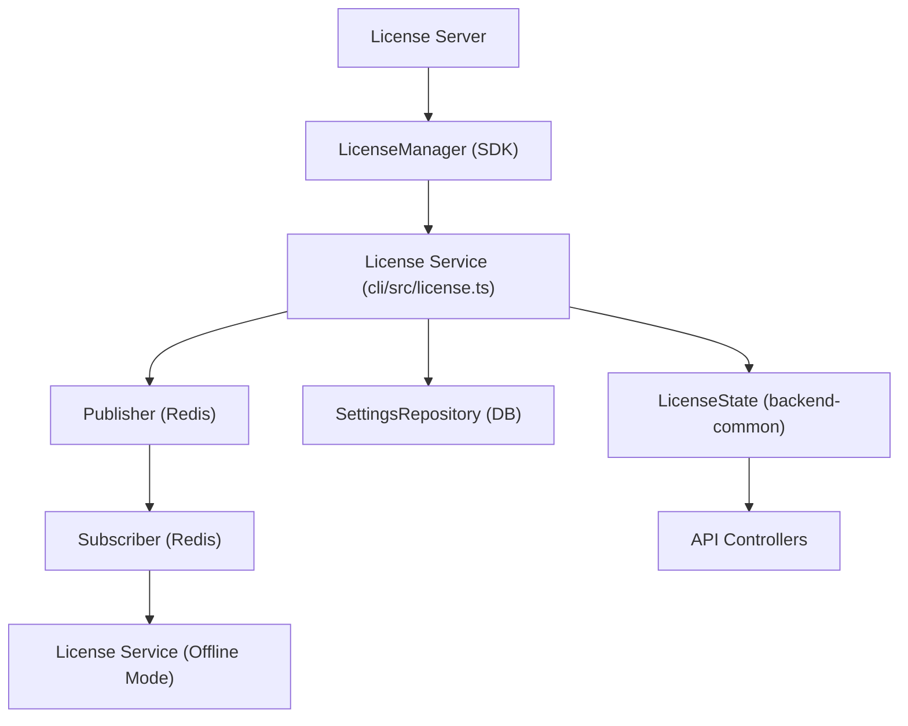
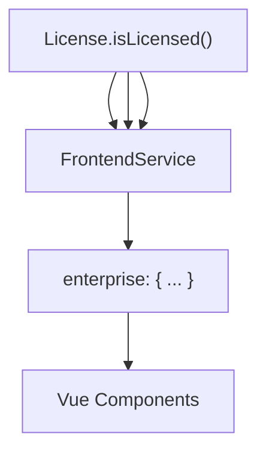

# License Management and Feature Flags

Relevant source files

-   [packages/@n8n/api-types/src/frontend-settings.ts](https://github.com/n8n-io/n8n/blob/88f170b9/packages/@n8n/api-types/src/frontend-settings.ts)
-   [packages/@n8n/api-types/src/push/collaboration.ts](https://github.com/n8n-io/n8n/blob/88f170b9/packages/@n8n/api-types/src/push/collaboration.ts)
-   [packages/@n8n/backend-common/src/license-state.ts](https://github.com/n8n-io/n8n/blob/88f170b9/packages/@n8n/backend-common/src/license-state.ts)
-   [packages/@n8n/config/src/configs/cache.config.ts](https://github.com/n8n-io/n8n/blob/88f170b9/packages/@n8n/config/src/configs/cache.config.ts)
-   [packages/@n8n/config/src/configs/credentials.config.ts](https://github.com/n8n-io/n8n/blob/88f170b9/packages/@n8n/config/src/configs/credentials.config.ts)
-   [packages/@n8n/config/src/configs/database.config.ts](https://github.com/n8n-io/n8n/blob/88f170b9/packages/@n8n/config/src/configs/database.config.ts)
-   [packages/@n8n/config/src/configs/event-bus.config.ts](https://github.com/n8n-io/n8n/blob/88f170b9/packages/@n8n/config/src/configs/event-bus.config.ts)
-   [packages/@n8n/config/src/configs/nodes.config.ts](https://github.com/n8n-io/n8n/blob/88f170b9/packages/@n8n/config/src/configs/nodes.config.ts)
-   [packages/@n8n/config/src/configs/public-api.config.ts](https://github.com/n8n-io/n8n/blob/88f170b9/packages/@n8n/config/src/configs/public-api.config.ts)
-   [packages/@n8n/config/src/configs/templates.config.ts](https://github.com/n8n-io/n8n/blob/88f170b9/packages/@n8n/config/src/configs/templates.config.ts)
-   [packages/@n8n/config/src/configs/user-management.config.ts](https://github.com/n8n-io/n8n/blob/88f170b9/packages/@n8n/config/src/configs/user-management.config.ts)
-   [packages/@n8n/config/src/configs/version-notifications.config.ts](https://github.com/n8n-io/n8n/blob/88f170b9/packages/@n8n/config/src/configs/version-notifications.config.ts)
-   [packages/@n8n/config/src/configs/workflows.config.ts](https://github.com/n8n-io/n8n/blob/88f170b9/packages/@n8n/config/src/configs/workflows.config.ts)
-   [packages/@n8n/config/src/decorators.ts](https://github.com/n8n-io/n8n/blob/88f170b9/packages/@n8n/config/src/decorators.ts)
-   [packages/@n8n/config/src/index.ts](https://github.com/n8n-io/n8n/blob/88f170b9/packages/@n8n/config/src/index.ts)
-   [packages/@n8n/config/test/config.test.ts](https://github.com/n8n-io/n8n/blob/88f170b9/packages/@n8n/config/test/config.test.ts)
-   [packages/@n8n/config/test/decorators.test.ts](https://github.com/n8n-io/n8n/blob/88f170b9/packages/@n8n/config/test/decorators.test.ts)
-   [packages/@n8n/config/test/string-normalization.test.ts](https://github.com/n8n-io/n8n/blob/88f170b9/packages/@n8n/config/test/string-normalization.test.ts)
-   [packages/@n8n/constants/src/index.ts](https://github.com/n8n-io/n8n/blob/88f170b9/packages/@n8n/constants/src/index.ts)
-   [packages/@n8n/db/src/connection/\_\_tests\_\_/db-connection-options.test.ts](https://github.com/n8n-io/n8n/blob/88f170b9/packages/@n8n/db/src/connection/__tests__/db-connection-options.test.ts)
-   [packages/@n8n/db/src/connection/db-connection-options.ts](https://github.com/n8n-io/n8n/blob/88f170b9/packages/@n8n/db/src/connection/db-connection-options.ts)
-   [packages/@n8n/db/src/entities/workflow-dependency-entity.ts](https://github.com/n8n-io/n8n/blob/88f170b9/packages/@n8n/db/src/entities/workflow-dependency-entity.ts)
-   [packages/@n8n/db/src/repositories/workflow-dependency.repository.ts](https://github.com/n8n-io/n8n/blob/88f170b9/packages/@n8n/db/src/repositories/workflow-dependency.repository.ts)
-   [packages/cli/src/\_\_tests\_\_/credentials-overwrites.test.ts](https://github.com/n8n-io/n8n/blob/88f170b9/packages/cli/src/__tests__/credentials-overwrites.test.ts)
-   [packages/cli/src/\_\_tests\_\_/license.test.ts](https://github.com/n8n-io/n8n/blob/88f170b9/packages/cli/src/__tests__/license.test.ts)
-   [packages/cli/src/\_\_tests\_\_/node-types.test.ts](https://github.com/n8n-io/n8n/blob/88f170b9/packages/cli/src/__tests__/node-types.test.ts)
-   [packages/cli/src/commands/base-command.ts](https://github.com/n8n-io/n8n/blob/88f170b9/packages/cli/src/commands/base-command.ts)
-   [packages/cli/src/commands/start.ts](https://github.com/n8n-io/n8n/blob/88f170b9/packages/cli/src/commands/start.ts)
-   [packages/cli/src/commands/webhook.ts](https://github.com/n8n-io/n8n/blob/88f170b9/packages/cli/src/commands/webhook.ts)
-   [packages/cli/src/commands/worker.ts](https://github.com/n8n-io/n8n/blob/88f170b9/packages/cli/src/commands/worker.ts)
-   [packages/cli/src/config/index.ts](https://github.com/n8n-io/n8n/blob/88f170b9/packages/cli/src/config/index.ts)
-   [packages/cli/src/config/schema.ts](https://github.com/n8n-io/n8n/blob/88f170b9/packages/cli/src/config/schema.ts)
-   [packages/cli/src/constants.ts](https://github.com/n8n-io/n8n/blob/88f170b9/packages/cli/src/constants.ts)
-   [packages/cli/src/controllers/e2e.controller.ts](https://github.com/n8n-io/n8n/blob/88f170b9/packages/cli/src/controllers/e2e.controller.ts)
-   [packages/cli/src/credentials-overwrites.ts](https://github.com/n8n-io/n8n/blob/88f170b9/packages/cli/src/credentials-overwrites.ts)
-   [packages/cli/src/errors/response-errors/locked.error.ts](https://github.com/n8n-io/n8n/blob/88f170b9/packages/cli/src/errors/response-errors/locked.error.ts)
-   [packages/cli/src/license.ts](https://github.com/n8n-io/n8n/blob/88f170b9/packages/cli/src/license.ts)
-   [packages/cli/src/modules/workflow-index/\_\_tests\_\_/workflow-index.service.test.ts](https://github.com/n8n-io/n8n/blob/88f170b9/packages/cli/src/modules/workflow-index/__tests__/workflow-index.service.test.ts)
-   [packages/cli/src/modules/workflow-index/workflow-index.service.ts](https://github.com/n8n-io/n8n/blob/88f170b9/packages/cli/src/modules/workflow-index/workflow-index.service.ts)
-   [packages/cli/src/node-types.ts](https://github.com/n8n-io/n8n/blob/88f170b9/packages/cli/src/node-types.ts)
-   [packages/cli/src/services/\_\_tests\_\_/frontend.service.test.ts](https://github.com/n8n-io/n8n/blob/88f170b9/packages/cli/src/services/__tests__/frontend.service.test.ts)
-   [packages/cli/src/services/frontend.service.ts](https://github.com/n8n-io/n8n/blob/88f170b9/packages/cli/src/services/frontend.service.ts)
-   [packages/cli/test/integration/commands/worker.cmd.test.ts](https://github.com/n8n-io/n8n/blob/88f170b9/packages/cli/test/integration/commands/worker.cmd.test.ts)
-   [packages/cli/test/integration/credentials/credentials-overwrites.integration.test.ts](https://github.com/n8n-io/n8n/blob/88f170b9/packages/cli/test/integration/credentials/credentials-overwrites.integration.test.ts)
-   [packages/cli/test/integration/database/repositories/workflow-dependency.repository.test.ts](https://github.com/n8n-io/n8n/blob/88f170b9/packages/cli/test/integration/database/repositories/workflow-dependency.repository.test.ts)
-   [packages/cli/test/integration/workflows/workflow-index.test.ts](https://github.com/n8n-io/n8n/blob/88f170b9/packages/cli/test/integration/workflows/workflow-index.test.ts)
-   [packages/frontend/@n8n/design-system/src/components/CanvasCollaborationPill/CanvasCollaborationPill.vue](https://github.com/n8n-io/n8n/blob/88f170b9/packages/frontend/@n8n/design-system/src/components/CanvasCollaborationPill/CanvasCollaborationPill.vue)
-   [packages/frontend/@n8n/design-system/src/components/N8nLogo/Logo.vue](https://github.com/n8n-io/n8n/blob/88f170b9/packages/frontend/@n8n/design-system/src/components/N8nLogo/Logo.vue)
-   [packages/frontend/@n8n/stores/src/useRootStore.ts](https://github.com/n8n-io/n8n/blob/88f170b9/packages/frontend/@n8n/stores/src/useRootStore.ts)
-   [packages/frontend/editor-ui/src/\_\_tests\_\_/defaults.ts](https://github.com/n8n-io/n8n/blob/88f170b9/packages/frontend/editor-ui/src/__tests__/defaults.ts)
-   [packages/frontend/editor-ui/src/app/components/MainHeader/TabBar.vue](https://github.com/n8n-io/n8n/blob/88f170b9/packages/frontend/editor-ui/src/app/components/MainHeader/TabBar.vue)
-   [packages/frontend/editor-ui/src/app/stores/settings.store.test.ts](https://github.com/n8n-io/n8n/blob/88f170b9/packages/frontend/editor-ui/src/app/stores/settings.store.test.ts)
-   [packages/frontend/editor-ui/src/app/stores/settings.store.ts](https://github.com/n8n-io/n8n/blob/88f170b9/packages/frontend/editor-ui/src/app/stores/settings.store.ts)
-   [packages/frontend/editor-ui/src/features/credentials/\_\_tests\_\_/credentials.store.test.ts](https://github.com/n8n-io/n8n/blob/88f170b9/packages/frontend/editor-ui/src/features/credentials/__tests__/credentials.store.test.ts)
-   [packages/frontend/editor-ui/src/features/credentials/composables/\_\_tests\_\_/useCredentialOAuth.test.ts](https://github.com/n8n-io/n8n/blob/88f170b9/packages/frontend/editor-ui/src/features/credentials/composables/__tests__/useCredentialOAuth.test.ts)
-   [packages/frontend/editor-ui/src/features/credentials/composables/useCredentialOAuth.ts](https://github.com/n8n-io/n8n/blob/88f170b9/packages/frontend/editor-ui/src/features/credentials/composables/useCredentialOAuth.ts)
-   [packages/frontend/editor-ui/src/features/credentials/credentials.api.ts](https://github.com/n8n-io/n8n/blob/88f170b9/packages/frontend/editor-ui/src/features/credentials/credentials.api.ts)

This page documents the n8n license lifecycle, including the `License` service, the `LicenseState` facade, enterprise feature gates, and the feature flag system. It details how entitlements control both backend behavior and UI visibility through configuration, activation, and renewal flows.

---

## Overview

n8n implements a tiered feature system using a proprietary license SDK (`@n8n_io/license-sdk`). The architecture consists of a core manager wrapped by n8n-specific services that handle persistence and state distribution across distributed processes (Main, Worker, Webhook).

-   **`License` Service**: The primary interface for the `@n8n_io/license-sdk`. It manages the `LicenseManager` instance, handles activation/renewal, and persists license certificates to the database [packages/cli/src/license.ts36-51](https://github.com/n8n-io/n8n/blob/88f170b9/packages/cli/src/license.ts#L36-L51)
-   **`LicenseState` Facade**: A high-level, named-method utility that provides a clean API for checking features without needing to know internal SDK string identifiers [packages/@n8n/backend-common/src/license-state.ts18-25](https://github.com/n8n-io/n8n/blob/88f170b9/packages/@n8n/backend-common/src/license-state.ts#L18-L25)
-   **Feature Flags (`N8N_ENV_FEAT_*`)**: Environment-based overrides used for experimental features or environment-specific toggles, separate from the commercial license system [packages/cli/src/services/frontend.service.ts141-151](https://github.com/n8n-io/n8n/blob/88f170b9/packages/cli/src/services/frontend.service.ts#L141-L151)

---

## System Architecture and Data Flow

The license system bridges the gap between the remote license server and the n8n execution environment.

**Diagram: License Entity Relationship and Data Flow**

Sources: [packages/cli/src/license.ts100-129](https://github.com/n8n-io/n8n/blob/88f170b9/packages/cli/src/license.ts#L100-L129) [packages/cli/src/license.ts156-161](https://github.com/n8n-io/n8n/blob/88f170b9/packages/cli/src/license.ts#L156-L161) [packages/cli/src/license.ts163-174](https://github.com/n8n-io/n8n/blob/88f170b9/packages/cli/src/license.ts#L163-L174)

---

## Configuration and Feature Identifiers

### License Configuration

License behavior is governed by `LicenseConfig`, nested under `GlobalConfig`. Key parameters include:

-   `serverUrl`: The endpoint for license operations (Default: `https://license.n8n.io/v1`).
-   `autoRenewalEnabled`: Whether the instance should automatically attempt to renew the certificate [packages/cli/src/license.ts90-93](https://github.com/n8n-io/n8n/blob/88f170b9/packages/cli/src/license.ts#L90-L93)
-   `cert`: An ephemeral certificate string that, if provided via environment variable, overrides database-stored licenses [packages/cli/src/license.ts133-136](https://github.com/n8n-io/n8n/blob/88f170b9/packages/cli/src/license.ts#L133-L136)

### Entitlements (Features and Quotas)

Features are defined in `@n8n/constants` and categorized into boolean features and numeric quotas.

| Type | Examples | SDK Identifier Prefix |
| --- | --- | --- |
| **Boolean Features** | `SHARING`, `LDAP`, `SAML`, `OIDC`, `VARIABLES`, `SOURCE_CONTROL` | `feat:` |
| **Numeric Quotas** | `USERS_LIMIT`, `VARIABLES_LIMIT`, `TRIGGER_LIMIT`, `AI_CREDITS` | `quota:` |

Sources: [packages/@n8n/constants/src/index.ts3-12](https://github.com/n8n-io/n8n/blob/88f170b9/packages/@n8n/constants/src/index.ts#L3-L12) [packages/cli/src/license.ts5-12](https://github.com/n8n-io/n8n/blob/88f170b9/packages/cli/src/license.ts#L5-L12)

---

## License Lifecycle

### 1\. Initialization

During startup, `License.init()` configures the SDK. In a multi-instance setup, only the **Leader** main process is responsible for active renewals. Workers and Webhook processes initialize in `offlineMode`, relying on the database and PubSub signals from the Main process [packages/cli/src/license.ts67-73](https://github.com/n8n-io/n8n/blob/88f170b9/packages/cli/src/license.ts#L67-L73)

### 2\. Activation and Persistence

When a user provides an activation key, `License.activate()` is called. The resulting certificate block is saved to the `SettingsRepository` using the key `license.cert` [packages/cli/src/license.ts163-174](https://github.com/n8n-io/n8n/blob/88f170b9/packages/cli/src/license.ts#L163-L174) [packages/cli/src/constants.ts82](https://github.com/n8n-io/n8n/blob/88f170b9/packages/cli/src/constants.ts#L82-L82)

### 3\. Renewal and Synchronization

The SDK handles background renewal. When a license is renewed:

1.  `onLicenseRenewed` is triggered on the Leader [packages/cli/src/license.ts151-154](https://github.com/n8n-io/n8n/blob/88f170b9/packages/cli/src/license.ts#L151-L154)
2.  The new certificate is saved to the DB [packages/cli/src/license.ts163-174](https://github.com/n8n-io/n8n/blob/88f170b9/packages/cli/src/license.ts#L163-L174)
3.  A `reload-license` command is broadcast via Redis PubSub [packages/cli/src/license.ts156-161](https://github.com/n8n-io/n8n/blob/88f170b9/packages/cli/src/license.ts#L156-L161)
4.  Other processes receive the event and call `manager.reload()` to refresh their local state from the DB [packages/cli/src/license.ts212-218](https://github.com/n8n-io/n8n/blob/88f170b9/packages/cli/src/license.ts#L212-L218)

Sources: [packages/cli/src/license.ts53-129](https://github.com/n8n-io/n8n/blob/88f170b9/packages/cli/src/license.ts#L53-L129) [packages/cli/src/license.ts156-161](https://github.com/n8n-io/n8n/blob/88f170b9/packages/cli/src/license.ts#L156-L161)

---

## Feature Flags (`N8N_ENV_FEAT_*`)

In addition to the commercial license system, n8n supports environment-level feature flags. These are collected from environment variables starting with the prefix `N8N_ENV_FEAT_` [packages/cli/src/services/frontend.service.ts144-146](https://github.com/n8n-io/n8n/blob/88f170b9/packages/cli/src/services/frontend.service.ts#L144-L146)

-   **Collection**: `FrontendService` iterates through `process.env` to build the `N8N_ENV_FEAT_*` map [packages/cli/src/services/frontend.service.ts141-151](https://github.com/n8n-io/n8n/blob/88f170b9/packages/cli/src/services/frontend.service.ts#L141-L151)
-   **Exposure**: These flags are sent to the frontend as part of the `FrontendSettings` object [packages/cli/src/services/frontend.service.ts236](https://github.com/n8n-io/n8n/blob/88f170b9/packages/cli/src/services/frontend.service.ts#L236-L236) [packages/@n8n/api-types/src/frontend-settings.ts236](https://github.com/n8n-io/n8n/blob/88f170b9/packages/@n8n/api-types/src/frontend-settings.ts#L236-L236)

---

## Feature Gate Implementation

Feature enforcement happens at multiple levels:

### Backend Enforcement

Controllers and services query `LicenseState` to gate logic.

-   **Service Layer**: Methods like `isVariablesLicensed()` or `isSharingLicensed()` are used to validate requests [packages/@n8n/backend-common/src/license-state.ts56-100](https://github.com/n8n-io/n8n/blob/88f170b9/packages/@n8n/backend-common/src/license-state.ts#L56-L100)
-   **Error Handling**: If a check fails, the system typically throws a `FeatureNotLicensedError` [packages/cli/src/commands/start.ts21](https://github.com/n8n-io/n8n/blob/88f170b9/packages/cli/src/commands/start.ts#L21-L21)

### Frontend Visibility

The `FrontendService` maps internal license states to a clean `enterprise` settings object for the UI [packages/cli/src/services/frontend.service.ts64-73](https://github.com/n8n-io/n8n/blob/88f170b9/packages/cli/src/services/frontend.service.ts#L64-L73)

**Diagram: Mapping Entitlements to UI Settings**

Sources: [packages/cli/src/services/frontend.service.ts104-128](https://github.com/n8n-io/n8n/blob/88f170b9/packages/cli/src/services/frontend.service.ts#L104-L128) [packages/@n8n/api-types/src/frontend-settings.ts40-67](https://github.com/n8n-io/n8n/blob/88f170b9/packages/@n8n/api-types/src/frontend-settings.ts#L40-L67)

### Summary of Enterprise Settings in Frontend

The following settings are derived from the license and exposed via `FrontendSettings.enterprise`:

-   `sharing`: Boolean feature for workflow/credential sharing [packages/@n8n/api-types/src/frontend-settings.ts41](https://github.com/n8n-io/n8n/blob/88f170b9/packages/@n8n/api-types/src/frontend-settings.ts#L41-L41)
-   `ldap` / `saml` / `oidc`: SSO capabilities [packages/@n8n/api-types/src/frontend-settings.ts42-44](https://github.com/n8n-io/n8n/blob/88f170b9/packages/@n8n/api-types/src/frontend-settings.ts#L42-L44)
-   `sourceControl`: Git integration [packages/@n8n/api-types/src/frontend-settings.ts49](https://github.com/n8n-io/n8n/blob/88f170b9/packages/@n8n/api-types/src/frontend-settings.ts#L49-L49)
-   `externalSecrets`: Integration with Vault, AWS Secrets Manager, etc [packages/@n8n/api-types/src/frontend-settings.ts51](https://github.com/n8n-io/n8n/blob/88f170b9/packages/@n8n/api-types/src/frontend-settings.ts#L51-L51)
-   `variables`: Environment variable management [packages/@n8n/api-types/src/frontend-settings.ts48](https://github.com/n8n-io/n8n/blob/88f170b9/packages/@n8n/api-types/src/frontend-settings.ts#L48-L48)

Sources: [packages/cli/src/services/frontend.service.ts64-73](https://github.com/n8n-io/n8n/blob/88f170b9/packages/cli/src/services/frontend.service.ts#L64-L73) [packages/@n8n/api-types/src/frontend-settings.ts40-67](https://github.com/n8n-io/n8n/blob/88f170b9/packages/@n8n/api-types/src/frontend-settings.ts#L40-L67)
