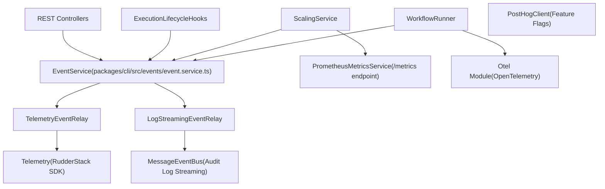
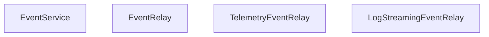

# Observability and Telemetry

Relevant source files

-   [packages/@n8n/benchmark/src/n8n-api-client/n8n-api-client.ts](https://github.com/n8n-io/n8n/blob/88f170b9/packages/@n8n/benchmark/src/n8n-api-client/n8n-api-client.ts)
-   [packages/@n8n/config/src/configs/diagnostics.config.ts](https://github.com/n8n-io/n8n/blob/88f170b9/packages/@n8n/config/src/configs/diagnostics.config.ts)
-   [packages/@n8n/config/src/configs/endpoints.config.ts](https://github.com/n8n-io/n8n/blob/88f170b9/packages/@n8n/config/src/configs/endpoints.config.ts)
-   [packages/@n8n/config/src/configs/scaling-mode.config.ts](https://github.com/n8n-io/n8n/blob/88f170b9/packages/@n8n/config/src/configs/scaling-mode.config.ts)
-   [packages/cli/BREAKING-CHANGES.md](https://github.com/n8n-io/n8n/blob/88f170b9/packages/cli/BREAKING-CHANGES.md?plain=1)
-   [packages/cli/bin/n8n](https://github.com/n8n-io/n8n/blob/88f170b9/packages/cli/bin/n8n)
-   [packages/cli/src/abstract-server.ts](https://github.com/n8n-io/n8n/blob/88f170b9/packages/cli/src/abstract-server.ts)
-   [packages/cli/src/commands/audit.ts](https://github.com/n8n-io/n8n/blob/88f170b9/packages/cli/src/commands/audit.ts)
-   [packages/cli/src/eventbus/event-message-classes/abstract-event-message.ts](https://github.com/n8n-io/n8n/blob/88f170b9/packages/cli/src/eventbus/event-message-classes/abstract-event-message.ts)
-   [packages/cli/src/eventbus/event-message-classes/event-message-ai-node.ts](https://github.com/n8n-io/n8n/blob/88f170b9/packages/cli/src/eventbus/event-message-classes/event-message-ai-node.ts)
-   [packages/cli/src/eventbus/event-message-classes/event-message-audit.ts](https://github.com/n8n-io/n8n/blob/88f170b9/packages/cli/src/eventbus/event-message-classes/event-message-audit.ts)
-   [packages/cli/src/eventbus/event-message-classes/index.ts](https://github.com/n8n-io/n8n/blob/88f170b9/packages/cli/src/eventbus/event-message-classes/index.ts)
-   [packages/cli/src/events/\_\_tests\_\_/log-streaming-event-relay.test.ts](https://github.com/n8n-io/n8n/blob/88f170b9/packages/cli/src/events/__tests__/log-streaming-event-relay.test.ts)
-   [packages/cli/src/events/\_\_tests\_\_/telemetry-event-relay.test.ts](https://github.com/n8n-io/n8n/blob/88f170b9/packages/cli/src/events/__tests__/telemetry-event-relay.test.ts)
-   [packages/cli/src/events/event.service.ts](https://github.com/n8n-io/n8n/blob/88f170b9/packages/cli/src/events/event.service.ts)
-   [packages/cli/src/events/maps/relay.event-map.ts](https://github.com/n8n-io/n8n/blob/88f170b9/packages/cli/src/events/maps/relay.event-map.ts)
-   [packages/cli/src/events/relays/log-streaming.event-relay.ts](https://github.com/n8n-io/n8n/blob/88f170b9/packages/cli/src/events/relays/log-streaming.event-relay.ts)
-   [packages/cli/src/events/relays/telemetry.event-relay.ts](https://github.com/n8n-io/n8n/blob/88f170b9/packages/cli/src/events/relays/telemetry.event-relay.ts)
-   [packages/cli/src/metrics/\_\_tests\_\_/prometheus-metrics.service.test.ts](https://github.com/n8n-io/n8n/blob/88f170b9/packages/cli/src/metrics/__tests__/prometheus-metrics.service.test.ts)
-   [packages/cli/src/metrics/\_\_tests\_\_/prometheus-metrics.service.unmocked.test.ts](https://github.com/n8n-io/n8n/blob/88f170b9/packages/cli/src/metrics/__tests__/prometheus-metrics.service.unmocked.test.ts)
-   [packages/cli/src/metrics/prometheus-metrics.service.ts](https://github.com/n8n-io/n8n/blob/88f170b9/packages/cli/src/metrics/prometheus-metrics.service.ts)
-   [packages/cli/src/metrics/types.ts](https://github.com/n8n-io/n8n/blob/88f170b9/packages/cli/src/metrics/types.ts)
-   [packages/cli/src/posthog/\_\_tests\_\_/posthog.test.ts](https://github.com/n8n-io/n8n/blob/88f170b9/packages/cli/src/posthog/__tests__/posthog.test.ts)
-   [packages/cli/src/posthog/index.ts](https://github.com/n8n-io/n8n/blob/88f170b9/packages/cli/src/posthog/index.ts)
-   [packages/cli/src/scaling/\_\_tests\_\_/worker-server.test.ts](https://github.com/n8n-io/n8n/blob/88f170b9/packages/cli/src/scaling/__tests__/worker-server.test.ts)
-   [packages/cli/src/scaling/worker-server.ts](https://github.com/n8n-io/n8n/blob/88f170b9/packages/cli/src/scaling/worker-server.ts)
-   [packages/cli/src/services/\_\_tests\_\_/redis-client.service.test.ts](https://github.com/n8n-io/n8n/blob/88f170b9/packages/cli/src/services/__tests__/redis-client.service.test.ts)
-   [packages/cli/src/services/cache/cache.types.ts](https://github.com/n8n-io/n8n/blob/88f170b9/packages/cli/src/services/cache/cache.types.ts)
-   [packages/cli/src/services/redis-client.service.ts](https://github.com/n8n-io/n8n/blob/88f170b9/packages/cli/src/services/redis-client.service.ts)
-   [packages/cli/src/telemetry/\_\_tests\_\_/telemetry.test.ts](https://github.com/n8n-io/n8n/blob/88f170b9/packages/cli/src/telemetry/__tests__/telemetry.test.ts)
-   [packages/cli/src/telemetry/index.ts](https://github.com/n8n-io/n8n/blob/88f170b9/packages/cli/src/telemetry/index.ts)
-   [packages/cli/test/integration/prometheus-metrics.test.ts](https://github.com/n8n-io/n8n/blob/88f170b9/packages/cli/test/integration/prometheus-metrics.test.ts)
-   [packages/frontend/editor-ui/src/app/composables/useBackendStatus.spec.ts](https://github.com/n8n-io/n8n/blob/88f170b9/packages/frontend/editor-ui/src/app/composables/useBackendStatus.spec.ts)
-   [packages/frontend/editor-ui/src/app/composables/useBackendStatus.ts](https://github.com/n8n-io/n8n/blob/88f170b9/packages/frontend/editor-ui/src/app/composables/useBackendStatus.ts)

This page documents the internal event system, telemetry pipeline, audit log streaming, Prometheus metrics, and OpenTelemetry integration in `packages/cli`. These systems capture structured signals about workflow executions, user actions, and system lifecycle for product analytics, operational auditing, and performance monitoring.

For environment variable configuration that controls these systems (diagnostics flags, metrics toggles), see [Configuration System](/n8n-io/n8n/7.1-configuration-system). For how workflow execution lifecycle hooks fire these events, see [Workflow Execution Lifecycle](/n8n-io/n8n/2.1-workflow-execution-lifecycle).

---

## Architecture Overview

The observability stack is built around a central in-process typed pub/sub bus (`EventService`) and a **relay pattern**. Code throughout `packages/cli` emits events. Relay services independently subscribe to those events and forward them to external sinks.

**Diagram: Observability Data Flow**

Sources: [packages/cli/src/events/relays/telemetry.event-relay.ts51-68](https://github.com/n8n-io/n8n/blob/88f170b9/packages/cli/src/events/relays/telemetry.event-relay.ts#L51-L68) [packages/cli/src/events/relays/log-streaming.event-relay.ts20-29](https://github.com/n8n-io/n8n/blob/88f170b9/packages/cli/src/events/relays/log-streaming.event-relay.ts#L20-L29) [packages/cli/src/metrics/prometheus-metrics.service.ts25-34](https://github.com/n8n-io/n8n/blob/88f170b9/packages/cli/src/metrics/prometheus-metrics.service.ts#L25-L34)

---

## EventService and TypedEmitter

`EventService` ([packages/cli/src/events/event.service.ts](https://github.com/n8n-io/n8n/blob/88f170b9/packages/cli/src/events/event.service.ts)) is a typed wrapper over Node's `EventEmitter`. It is registered as a DI `@Service()` and injected into any component that needs to emit or subscribe to events.

The type parameter is `RelayEventMap`, so `eventService.emit(name, payload)` is fully type-checked at compile time: the payload type is inferred from the event name.

**Diagram: EventService and Relay Base Class**

Sources: [packages/cli/src/events/relays/telemetry.event-relay.ts51-68](https://github.com/n8n-io/n8n/blob/88f170b9/packages/cli/src/events/relays/telemetry.event-relay.ts#L51-L68) [packages/cli/src/events/relays/log-streaming.event-relay.ts20-29](https://github.com/n8n-io/n8n/blob/88f170b9/packages/cli/src/events/relays/log-streaming.event-relay.ts#L20-L29)

---

## RelayEventMap: Event Taxonomy

[packages/cli/src/events/maps/relay.event-map.ts](https://github.com/n8n-io/n8n/blob/88f170b9/packages/cli/src/events/maps/relay.event-map.ts) defines `RelayEventMap` — the TypeScript type that maps every event name to its strongly typed payload.

| Category | Selected Event Names |
| --- | --- |
| **Lifecycle** | `server-started`, `session-started`, `instance-stopped`, `instance-owner-setup` |
| **Workflow** | `workflow-created`, `workflow-deleted`, `workflow-archived`, `workflow-saved`, `workflow-pre-execute`, `workflow-post-execute`, `workflow-executed` |
| **Node** | `node-pre-execute`, `node-post-execute` |
| **User** | `user-signed-up`, `user-deleted`, `user-invited`, `user-updated`, `user-logged-in`, `user-login-failed` |
| **Credentials** | `credentials-created`, `credentials-shared`, `credentials-updated`, `credentials-deleted` |
| **Public API** | `public-api-invoked`, `public-api-key-created`, `public-api-key-deleted` |
| **Queue / Scaling** | `job-enqueued`, `job-dequeued`, `job-stalled` |
| **AI** | `ai-llm-generated-output`, `ai-tool-called`, `ai-vector-store-searched` |

Sources: [packages/cli/src/events/maps/relay.event-map.ts33-160](https://github.com/n8n-io/n8n/blob/88f170b9/packages/cli/src/events/maps/relay.event-map.ts#L33-L160) [packages/cli/src/events/relays/log-streaming.event-relay.ts87-99](https://github.com/n8n-io/n8n/blob/88f170b9/packages/cli/src/events/relays/log-streaming.event-relay.ts#L87-L99)

---

## TelemetryEventRelay

`TelemetryEventRelay` ([packages/cli/src/events/relays/telemetry.event-relay.ts](https://github.com/n8n-io/n8n/blob/88f170b9/packages/cli/src/events/relays/telemetry.event-relay.ts)) forwards product-relevant events to RudderStack via the `Telemetry` class.

**Activation:** `init()` checks `globalConfig.diagnostics.enabled`. If `false`, it returns immediately. Otherwise, it initializes the `Telemetry` class and registers listeners for dozens of events.

[packages/cli/src/events/relays/telemetry.event-relay.ts70-143](https://github.com/n8n-io/n8n/blob/88f170b9/packages/cli/src/events/relays/telemetry.event-relay.ts#L70-L143)

**Data Flow & Size Limits:** The `workflow-post-execute` handler is the most data-rich, capturing execution results and node graph metadata. To prevent exceeding telemetry payload limits (32 KB), the `node_graph_string` is capped at 24 KB.

[packages/cli/src/events/relays/telemetry.event-relay.ts43-49](https://github.com/n8n-io/n8n/blob/88f170b9/packages/cli/src/events/relays/telemetry.event-relay.ts#L43-L49)

### Telemetry Class

The `Telemetry` class ([packages/cli/src/telemetry/index.ts](https://github.com/n8n-io/n8n/blob/88f170b9/packages/cli/src/telemetry/index.ts)) manages the RudderStack SDK and local buffers for high-frequency events.

-   **Pulse:** Every 6 hours, it flushes aggregated workflow execution counts and public API usage metrics. [packages/cli/src/telemetry/index.ts165-172](https://github.com/n8n-io/n8n/blob/88f170b9/packages/cli/src/telemetry/index.ts#L165-L172)
-   **Sanitization:** Objects are flattened into string/number pairs to satisfy downstream analytics requirements. [packages/cli/src/telemetry/index.ts88-131](https://github.com/n8n-io/n8n/blob/88f170b9/packages/cli/src/telemetry/index.ts#L88-L131)

Sources: [packages/cli/src/events/relays/telemetry.event-relay.ts70-143](https://github.com/n8n-io/n8n/blob/88f170b9/packages/cli/src/events/relays/telemetry.event-relay.ts#L70-L143) [packages/cli/src/telemetry/index.ts165-234](https://github.com/n8n-io/n8n/blob/88f170b9/packages/cli/src/telemetry/index.ts#L165-L234)

---

## LogStreamingEventRelay and Event Bus

`LogStreamingEventRelay` ([packages/cli/src/events/relays/log-streaming.event-relay.ts](https://github.com/n8n-io/n8n/blob/88f170b9/packages/cli/src/events/relays/log-streaming.event-relay.ts)) routes events to the `MessageEventBus` for operational auditing.

**Audit Event Naming:** Internal events are mapped to audit-specific names like `n8n.audit.workflow.created` or `n8n.audit.user.login.success`.

[packages/cli/src/events/relays/log-streaming.event-relay.ts113-122](https://github.com/n8n-io/n8n/blob/88f170b9/packages/cli/src/events/relays/log-streaming.event-relay.ts#L113-L122)

**MessageEventBus:** The `MessageEventBus` ([packages/cli/src/eventbus/message-event-bus/message-event-bus.ts](https://github.com/n8n-io/n8n/blob/88f170b9/packages/cli/src/eventbus/message-event-bus/message-event-bus.ts)) manages the distribution of these audit logs to configured destinations (e.g., Syslog, Webhooks). It serializes `EventMessage` objects which include timestamps and host identifiers.

Sources: [packages/cli/src/events/relays/log-streaming.event-relay.ts29-107](https://github.com/n8n-io/n8n/blob/88f170b9/packages/cli/src/events/relays/log-streaming.event-relay.ts#L29-L107) [packages/cli/src/eventbus/message-event-bus/message-event-bus.ts](https://github.com/n8n-io/n8n/blob/88f170b9/packages/cli/src/eventbus/message-event-bus/message-event-bus.ts)

---

## Prometheus Metrics

`PrometheusMetricsService` ([packages/cli/src/metrics/prometheus-metrics.service.ts](https://github.com/n8n-io/n8n/blob/88f170b9/packages/cli/src/metrics/prometheus-metrics.service.ts)) exposes a `/metrics` endpoint (usually on port 5678 for workers or the main port for single-process setups).

### Key Metrics

| Metric Name | Type | Description |
| --- | --- | --- |
| `n8n_version_info` | Gauge | Current n8n version, major, minor, and patch. |
| `n8n_process_pss_bytes` | Gauge | Proportional Set Size (Linux only), providing fair memory measurement in containers. |
| `n8n_http_request_duration_seconds` | Histogram | Duration of HTTP requests to API/Webhook endpoints. |
| `n8n_cache_hits_total` | Counter | Total number of cache hits. |
| `n8n_instance_role_leader` | Gauge | 1 if the main instance is the leader in a multi-main setup. |

[packages/cli/src/metrics/prometheus-metrics.service.ts109-144](https://github.com/n8n-io/n8n/blob/88f170b9/packages/cli/src/metrics/prometheus-metrics.service.ts#L109-L144) [packages/cli/src/metrics/prometheus-metrics.service.ts164-194](https://github.com/n8n-io/n8n/blob/88f170b9/packages/cli/src/metrics/prometheus-metrics.service.ts#L164-L194)

### Memory Measurement (PSS)

Unlike RSS (Resident Set Size), which double-counts shared pages, PSS divides shared memory proportionally. The service reads `/proc/self/smaps_rollup` to collect this on supported Linux kernels.

[packages/cli/src/metrics/prometheus-metrics.service.ts164-194](https://github.com/n8n-io/n8n/blob/88f170b9/packages/cli/src/metrics/prometheus-metrics.service.ts#L164-L194)

Sources: [packages/cli/src/metrics/prometheus-metrics.service.ts66-80](https://github.com/n8n-io/n8n/blob/88f170b9/packages/cli/src/metrics/prometheus-metrics.service.ts#L66-L80) [packages/cli/src/metrics/prometheus-metrics.service.ts109-144](https://github.com/n8n-io/n8n/blob/88f170b9/packages/cli/src/metrics/prometheus-metrics.service.ts#L109-L144)

---

## Health and Readiness Endpoints

Health checks are managed within the `AbstractServer` ([packages/cli/src/abstract-server.ts](https://github.com/n8n-io/n8n/blob/88f170b9/packages/cli/src/abstract-server.ts)) and `WorkerServer` ([packages/cli/src/scaling/worker-server.ts](https://github.com/n8n-io/n8n/blob/88f170b9/packages/cli/src/scaling/worker-server.ts)).

-   **Liveness (`/healthz`):** Returns `200 OK` as long as the HTTP server is running. [packages/cli/src/abstract-server.ts141-143](https://github.com/n8n-io/n8n/blob/88f170b9/packages/cli/src/abstract-server.ts#L141-L143)
-   **Readiness (`/healthz/readiness`):** Returns `200 OK` only if:
    1.  The database connection is established.
    2.  Database migrations are complete.
    3.  The application has finished its initialization (`fullyReady` flag). [packages/cli/src/abstract-server.ts147-154](https://github.com/n8n-io/n8n/blob/88f170b9/packages/cli/src/abstract-server.ts#L147-L154)

Sources: [packages/cli/src/abstract-server.ts136-162](https://github.com/n8n-io/n8n/blob/88f170b9/packages/cli/src/abstract-server.ts#L136-L162) [packages/@n8n/config/src/configs/scaling-mode.config.ts4-18](https://github.com/n8n-io/n8n/blob/88f170b9/packages/@n8n/config/src/configs/scaling-mode.config.ts#L4-L18)

---

## Initialization Sequence

The observability systems are initialized during the server startup phase.

**Diagram: Observability Startup Order**

> **[Mermaid sequence]**
> *(图表结构无法解析)*

Sources: [packages/cli/bin/n8n60-64](https://github.com/n8n-io/n8n/blob/88f170b9/packages/cli/bin/n8n#L60-L64) [packages/cli/src/abstract-server.ts164-220](https://github.com/n8n-io/n8n/blob/88f170b9/packages/cli/src/abstract-server.ts#L164-L220) [packages/cli/src/metrics/prometheus-metrics.service.ts66-80](https://github.com/n8n-io/n8n/blob/88f170b9/packages/cli/src/metrics/prometheus-metrics.service.ts#L66-L80)
