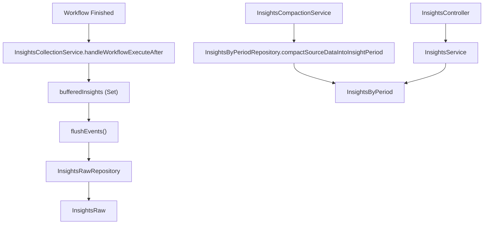
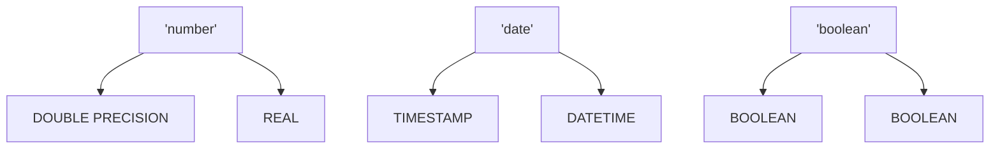

# Data Store and Insights Modules

Relevant source files

-   [packages/@n8n/api-types/src/dto/data-table/add-data-table-rows.dto.ts](https://github.com/n8n-io/n8n/blob/88f170b9/packages/@n8n/api-types/src/dto/data-table/add-data-table-rows.dto.ts)
-   [packages/@n8n/api-types/src/dto/insights/\_\_tests\_\_/date-filter.dto.test.ts](https://github.com/n8n-io/n8n/blob/88f170b9/packages/@n8n/api-types/src/dto/insights/__tests__/date-filter.dto.test.ts)
-   [packages/@n8n/api-types/src/dto/insights/\_\_tests\_\_/list-workflow-query.dto.test.ts](https://github.com/n8n-io/n8n/blob/88f170b9/packages/@n8n/api-types/src/dto/insights/__tests__/list-workflow-query.dto.test.ts)
-   [packages/@n8n/api-types/src/dto/insights/date-filter.dto.ts](https://github.com/n8n-io/n8n/blob/88f170b9/packages/@n8n/api-types/src/dto/insights/date-filter.dto.ts)
-   [packages/@n8n/api-types/src/dto/insights/list-workflow-query.dto.ts](https://github.com/n8n-io/n8n/blob/88f170b9/packages/@n8n/api-types/src/dto/insights/list-workflow-query.dto.ts)
-   [packages/@n8n/api-types/src/dto/pagination/\_\_tests\_\_/pagination.dto.test.ts](https://github.com/n8n-io/n8n/blob/88f170b9/packages/@n8n/api-types/src/dto/pagination/__tests__/pagination.dto.test.ts)
-   [packages/@n8n/api-types/src/dto/pagination/pagination.dto.ts](https://github.com/n8n-io/n8n/blob/88f170b9/packages/@n8n/api-types/src/dto/pagination/pagination.dto.ts)
-   [packages/@n8n/api-types/src/schemas/\_\_tests\_\_/insights.schema.test.ts](https://github.com/n8n-io/n8n/blob/88f170b9/packages/@n8n/api-types/src/schemas/__tests__/insights.schema.test.ts)
-   [packages/@n8n/api-types/src/schemas/insights.schema.ts](https://github.com/n8n-io/n8n/blob/88f170b9/packages/@n8n/api-types/src/schemas/insights.schema.ts)
-   [packages/@n8n/db/src/utils/transaction.ts](https://github.com/n8n-io/n8n/blob/88f170b9/packages/@n8n/db/src/utils/transaction.ts)
-   [packages/cli/src/execution-lifecycle/execute-error-workflow.ts](https://github.com/n8n-io/n8n/blob/88f170b9/packages/cli/src/execution-lifecycle/execute-error-workflow.ts)
-   [packages/cli/src/middlewares/list-query/\_\_tests\_\_/list-query.test.ts](https://github.com/n8n-io/n8n/blob/88f170b9/packages/cli/src/middlewares/list-query/__tests__/list-query.test.ts)
-   [packages/cli/src/middlewares/list-query/dtos/pagination.dto.ts](https://github.com/n8n-io/n8n/blob/88f170b9/packages/cli/src/middlewares/list-query/dtos/pagination.dto.ts)
-   [packages/cli/src/middlewares/list-query/dtos/workflow.sort-by.dto.ts](https://github.com/n8n-io/n8n/blob/88f170b9/packages/cli/src/middlewares/list-query/dtos/workflow.sort-by.dto.ts)
-   [packages/cli/src/middlewares/list-query/index.ts](https://github.com/n8n-io/n8n/blob/88f170b9/packages/cli/src/middlewares/list-query/index.ts)
-   [packages/cli/src/middlewares/list-query/sort-by.ts](https://github.com/n8n-io/n8n/blob/88f170b9/packages/cli/src/middlewares/list-query/sort-by.ts)
-   [packages/cli/src/modules/data-table/\_\_tests\_\_/test-helpers.ts](https://github.com/n8n-io/n8n/blob/88f170b9/packages/cli/src/modules/data-table/__tests__/test-helpers.ts)
-   [packages/cli/src/modules/data-table/utils/sql-utils.ts](https://github.com/n8n-io/n8n/blob/88f170b9/packages/cli/src/modules/data-table/utils/sql-utils.ts)
-   [packages/cli/src/modules/insights/\_\_tests\_\_/insights-collection.service.integration.test.ts](https://github.com/n8n-io/n8n/blob/88f170b9/packages/cli/src/modules/insights/__tests__/insights-collection.service.integration.test.ts)
-   [packages/cli/src/modules/insights/\_\_tests\_\_/insights-collection.service.test.ts](https://github.com/n8n-io/n8n/blob/88f170b9/packages/cli/src/modules/insights/__tests__/insights-collection.service.test.ts)
-   [packages/cli/src/modules/insights/\_\_tests\_\_/insights.controller.test.ts](https://github.com/n8n-io/n8n/blob/88f170b9/packages/cli/src/modules/insights/__tests__/insights.controller.test.ts)
-   [packages/cli/src/modules/insights/\_\_tests\_\_/insights.module.test.ts](https://github.com/n8n-io/n8n/blob/88f170b9/packages/cli/src/modules/insights/__tests__/insights.module.test.ts)
-   [packages/cli/src/modules/insights/\_\_tests\_\_/insights.service.integration.test.ts](https://github.com/n8n-io/n8n/blob/88f170b9/packages/cli/src/modules/insights/__tests__/insights.service.integration.test.ts)
-   [packages/cli/src/modules/insights/\_\_tests\_\_/insights.service.test.ts](https://github.com/n8n-io/n8n/blob/88f170b9/packages/cli/src/modules/insights/__tests__/insights.service.test.ts)
-   [packages/cli/src/modules/insights/\_\_tests\_\_/insights.settings.test.ts](https://github.com/n8n-io/n8n/blob/88f170b9/packages/cli/src/modules/insights/__tests__/insights.settings.test.ts)
-   [packages/cli/src/modules/insights/database/repositories/\_\_tests\_\_/insights-by-period-query.helper.test.ts](https://github.com/n8n-io/n8n/blob/88f170b9/packages/cli/src/modules/insights/database/repositories/__tests__/insights-by-period-query.helper.test.ts)
-   [packages/cli/src/modules/insights/database/repositories/\_\_tests\_\_/insights-by-period.repository.integration.test.ts](https://github.com/n8n-io/n8n/blob/88f170b9/packages/cli/src/modules/insights/database/repositories/__tests__/insights-by-period.repository.integration.test.ts)
-   [packages/cli/src/modules/insights/database/repositories/insights-by-period-query.helper.ts](https://github.com/n8n-io/n8n/blob/88f170b9/packages/cli/src/modules/insights/database/repositories/insights-by-period-query.helper.ts)
-   [packages/cli/src/modules/insights/database/repositories/insights-by-period.repository.ts](https://github.com/n8n-io/n8n/blob/88f170b9/packages/cli/src/modules/insights/database/repositories/insights-by-period.repository.ts)
-   [packages/cli/src/modules/insights/database/repositories/insights-raw.repository.ts](https://github.com/n8n-io/n8n/blob/88f170b9/packages/cli/src/modules/insights/database/repositories/insights-raw.repository.ts)
-   [packages/cli/src/modules/insights/insights-collection.service.ts](https://github.com/n8n-io/n8n/blob/88f170b9/packages/cli/src/modules/insights/insights-collection.service.ts)
-   [packages/cli/src/modules/insights/insights-compaction.service.ts](https://github.com/n8n-io/n8n/blob/88f170b9/packages/cli/src/modules/insights/insights-compaction.service.ts)
-   [packages/cli/src/modules/insights/insights.config.ts](https://github.com/n8n-io/n8n/blob/88f170b9/packages/cli/src/modules/insights/insights.config.ts)
-   [packages/cli/src/modules/insights/insights.controller.ts](https://github.com/n8n-io/n8n/blob/88f170b9/packages/cli/src/modules/insights/insights.controller.ts)
-   [packages/cli/src/modules/insights/insights.module.ts](https://github.com/n8n-io/n8n/blob/88f170b9/packages/cli/src/modules/insights/insights.module.ts)
-   [packages/cli/src/modules/insights/insights.service.ts](https://github.com/n8n-io/n8n/blob/88f170b9/packages/cli/src/modules/insights/insights.service.ts)
-   [packages/cli/src/modules/insights/insights.settings.ts](https://github.com/n8n-io/n8n/blob/88f170b9/packages/cli/src/modules/insights/insights.settings.ts)
-   [packages/cli/test/integration/insights/insights-vs-workflow-statistics.integration.test.ts](https://github.com/n8n-io/n8n/blob/88f170b9/packages/cli/test/integration/insights/insights-vs-workflow-statistics.integration.test.ts)
-   [packages/cli/test/integration/insights/insights.api.test.ts](https://github.com/n8n-io/n8n/blob/88f170b9/packages/cli/test/integration/insights/insights.api.test.ts)
-   [packages/cli/test/integration/shared/execution-context-helpers.ts](https://github.com/n8n-io/n8n/blob/88f170b9/packages/cli/test/integration/shared/execution-context-helpers.ts)
-   [packages/cli/test/integration/shared/workflow-fixtures.ts](https://github.com/n8n-io/n8n/blob/88f170b9/packages/cli/test/integration/shared/workflow-fixtures.ts)
-   [packages/frontend/@n8n/design-system/src/components/N8nDataTableServer/N8nDataTableServer.test.ts](https://github.com/n8n-io/n8n/blob/88f170b9/packages/frontend/@n8n/design-system/src/components/N8nDataTableServer/N8nDataTableServer.test.ts)
-   [packages/frontend/@n8n/design-system/src/components/N8nDataTableServer/N8nDataTableServer.vue](https://github.com/n8n-io/n8n/blob/88f170b9/packages/frontend/@n8n/design-system/src/components/N8nDataTableServer/N8nDataTableServer.vue)
-   [packages/nodes-base/nodes/DataTable/actions/row/delete.operation.ts](https://github.com/n8n-io/n8n/blob/88f170b9/packages/nodes-base/nodes/DataTable/actions/row/delete.operation.ts)
-   [packages/nodes-base/nodes/DataTable/actions/row/update.operation.ts](https://github.com/n8n-io/n8n/blob/88f170b9/packages/nodes-base/nodes/DataTable/actions/row/update.operation.ts)
-   [packages/nodes-base/nodes/DataTable/actions/row/upsert.operation.ts](https://github.com/n8n-io/n8n/blob/88f170b9/packages/nodes-base/nodes/DataTable/actions/row/upsert.operation.ts)

The **Data Store** (Data Table) and **Insights** modules provide n8n with internal structured storage and execution analytics capabilities. While the Data Table module allows workflows to persist data in a managed schema without external databases, the Insights module tracks performance metrics like success rates, execution times, and time saved.

## 1\. Insights Module

The Insights module is responsible for collecting, aggregating, and reporting workflow execution metrics. It is implemented as a `BackendModule` that only initializes on `main` and `webhook` instance types, as these are the processes informed of finished executions \[packages/cli/src/modules/insights/insights.module.ts:9-10\].

### Architecture and Data Flow

The system uses a three-tier storage strategy to balance write performance with query efficiency:

1.  **Buffer**: In-memory `Set` in `InsightsCollectionService` \[packages/cli/src/modules/insights/insights-collection.service.ts:71-71\].
2.  **Raw Storage**: `InsightsRaw` table for high-frequency event ingestion.
3.  **Aggregated Storage**: `InsightsByPeriod` table for long-term reporting.

#### Natural Language to Code Entity Space: Insights Flow

The following diagram maps the logical stages of insight processing to the specific classes and repositories in the codebase.

**Sources:** \[packages/cli/src/modules/insights/insights-collection.service.ts:137-142\], \[packages/cli/src/modules/insights/insights-compaction.service.ts:12-12\], \[packages/cli/src/modules/insights/insights.service.ts:16-26\].

### Key Components

| Component | Responsibility |
| --- | --- |
| `InsightsCollectionService` | Listens to `workflowExecuteAfter` lifecycle events, calculates `runtimeMs` and `timeSaved`, and manages an in-memory buffer \[packages/cli/src/modules/insights/insights-collection.service.ts:68-89\]. |
| `InsightsCompactionService` | A background service that periodically moves data from `InsightsRaw` to `InsightsByPeriod` by aggregating them into time buckets (hour, day, week) \[packages/cli/src/modules/insights/insights-compaction.service.ts:12-12\]. |
| `InsightsByPeriodRepository` | Contains complex SQL logic for time-series aggregation, including Common Table Expressions (CTE) for date ranges \[packages/cli/src/modules/insights/database/repositories/insights-by-period.repository.ts:76-81\]. |
| `InsightsPruningService` | Deletes old records based on the license-defined history limit \[packages/cli/src/modules/insights/insights.service.ts:20-21\]. |

### Metrics Calculation

The module tracks four primary metric types defined in `TypeUnit`: `success`, `failure`, `runtime_ms`, and `time_saved_min` \[packages/cli/src/modules/insights/insights.service.ts:105-128\].

-   **Time Saved**: Calculated either as a `fixed` value per execution or `dynamic` by summing `metadata.timeSaved` across all executed nodes in a run \[packages/cli/src/modules/insights/insights-collection.service.ts:178-187\].
-   **Averages and Deviations**: The `InsightsService` calculates deviations between the current period and the previous period to show trends in the dashboard \[packages/cli/src/modules/insights/insights.service.ts:130-160\].

**Sources:** \[packages/cli/src/modules/insights/insights.service.ts:105-163\], \[packages/cli/src/modules/insights/insights-collection.service.ts:157-187\].

---

## 2\. Data Store (Data Table) Module

The Data Table module provides a way for users to create structured tables within n8n. These tables are backed by the primary n8n database (PostgreSQL or SQLite) but are managed through a specific abstraction layer.

### Schema Management and SQL Utilities

The module uses `sql-utils.ts` to translate n8n-specific types (`string`, `number`, `boolean`, `date`) into database-specific DDL \[packages/cli/src/modules/data-table/utils/sql-utils.ts:24-41\].

**Sources:** \[packages/cli/src/modules/data-table/utils/sql-utils.ts:43-69\].

### Key Functions

-   `toDslColumns`: Converts frontend schema definitions into `DslColumn` objects for table creation \[packages/cli/src/modules/data-table/utils/sql-utils.ts:24-41\].
-   `addColumnQuery` / `renameColumnQuery`: Generates `ALTER TABLE` statements while validating column names against `dataTableColumnNameSchema` to prevent SQL injection \[packages/cli/src/modules/data-table/utils/sql-utils.ts:82-121\].
-   `normalizeRows`: Post-processes raw database results to ensure types (especially booleans and dates) match the n8n schema, handling differences between SQLite string-dates and Postgres Date objects \[packages/cli/src/modules/data-table/utils/sql-utils.ts:209-234\].

---

## 3\. Integration and Licensing

### Module Lifecycle

The `InsightsModule` implements `init` and `shutdown` hooks. During `init`, it registers the `InsightsController` and starts the collection service \[packages/cli/src/modules/insights/insights.module.ts:11-16\]. On `shutdown`, it ensures the in-memory buffer is flushed to the database before the process exits \[packages/cli/src/modules/insights/insights.module.ts:32-37\].

### Licensing and Permissions

Access to Insights is gated by both permissions and license features:

-   **Global Scopes**: Endpoints require `insights:list` scope \[packages/cli/src/modules/insights/insights.controller.ts:25-25\].
-   **License Gates**: Advanced views like the full dashboard or granular hourly data require specific license flags (`feat:insights:viewDashboard`) \[packages/cli/src/modules/insights/insights.controller.ts:42-42\].
-   **History Limits**: The `InsightsPruningService` uses `licenseState.getInsightsMaxHistory()` to determine how many days of data to retain \[packages/cli/src/modules/insights/**tests**/insights.controller.test.ts:43-43\].

**Sources:** \[packages/cli/src/modules/insights/insights.module.ts:1-38\], \[packages/cli/src/modules/insights/insights.controller.ts:20-67\].
