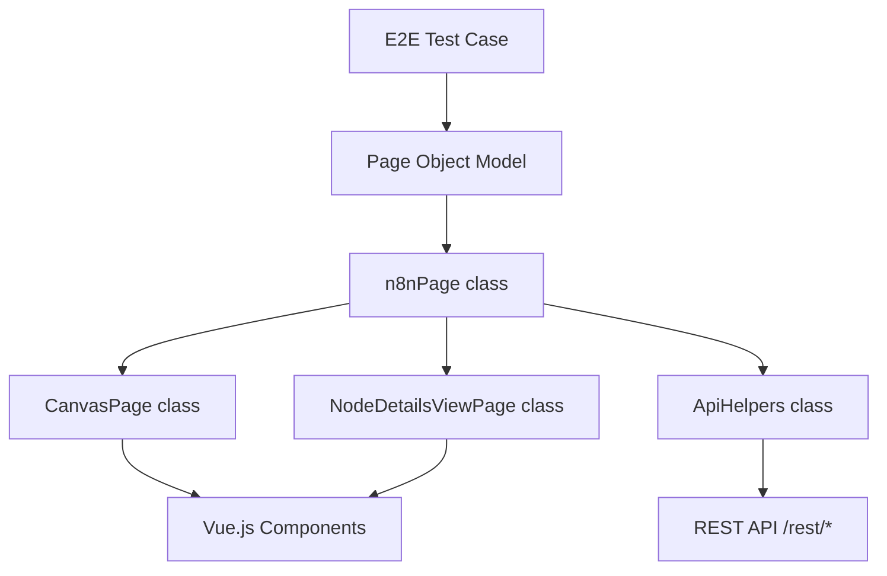
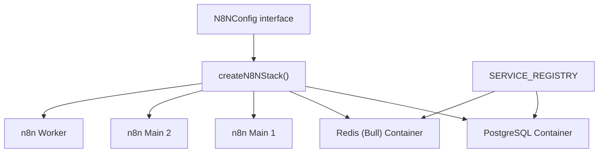

# Testing Infrastructure

Relevant source files

-   [.github/workflows/test-e2e-helm.yml](https://github.com/n8n-io/n8n/blob/88f170b9/.github/workflows/test-e2e-helm.yml)
-   [packages/@n8n/nodes-langchain/nodes/vendors/OpenAi/v2/actions/node.type.ts](https://github.com/n8n-io/n8n/blob/88f170b9/packages/@n8n/nodes-langchain/nodes/vendors/OpenAi/v2/actions/node.type.ts)
-   [packages/@n8n/nodes-langchain/nodes/vendors/OpenAi/v2/actions/text/index.ts](https://github.com/n8n-io/n8n/blob/88f170b9/packages/@n8n/nodes-langchain/nodes/vendors/OpenAi/v2/actions/text/index.ts)
-   [packages/cli/src/controllers/third-party-licenses.controller.ts](https://github.com/n8n-io/n8n/blob/88f170b9/packages/cli/src/controllers/third-party-licenses.controller.ts)
-   [packages/cli/test/integration/controllers/third-party-licenses.controller.test.ts](https://github.com/n8n-io/n8n/blob/88f170b9/packages/cli/test/integration/controllers/third-party-licenses.controller.test.ts)
-   [packages/frontend/@n8n/rest-api-client/src/api/third-party-licenses.ts](https://github.com/n8n-io/n8n/blob/88f170b9/packages/frontend/@n8n/rest-api-client/src/api/third-party-licenses.ts)
-   [packages/frontend/editor-ui/src/features/ndv/runData/components/\_\_snapshots\_\_/RunDataJson.test.ts.snap](https://github.com/n8n-io/n8n/blob/88f170b9/packages/frontend/editor-ui/src/features/ndv/runData/components/__snapshots__/RunDataJson.test.ts.snap)
-   [packages/testing/containers/HELM-TESTING.md](https://github.com/n8n-io/n8n/blob/88f170b9/packages/testing/containers/HELM-TESTING.md?plain=1)
-   [packages/testing/containers/README.md](https://github.com/n8n-io/n8n/blob/88f170b9/packages/testing/containers/README.md?plain=1)
-   [packages/testing/containers/helm-stack.ts](https://github.com/n8n-io/n8n/blob/88f170b9/packages/testing/containers/helm-stack.ts)
-   [packages/testing/containers/helm-start-stack.ts](https://github.com/n8n-io/n8n/blob/88f170b9/packages/testing/containers/helm-start-stack.ts)
-   [packages/testing/containers/index.ts](https://github.com/n8n-io/n8n/blob/88f170b9/packages/testing/containers/index.ts)
-   [packages/testing/containers/n8n-start-stack.ts](https://github.com/n8n-io/n8n/blob/88f170b9/packages/testing/containers/n8n-start-stack.ts)
-   [packages/testing/containers/package.json](https://github.com/n8n-io/n8n/blob/88f170b9/packages/testing/containers/package.json)
-   [packages/testing/containers/services/kafka.ts](https://github.com/n8n-io/n8n/blob/88f170b9/packages/testing/containers/services/kafka.ts)
-   [packages/testing/containers/services/registry.ts](https://github.com/n8n-io/n8n/blob/88f170b9/packages/testing/containers/services/registry.ts)
-   [packages/testing/containers/services/types.ts](https://github.com/n8n-io/n8n/blob/88f170b9/packages/testing/containers/services/types.ts)
-   [packages/testing/containers/test-containers.ts](https://github.com/n8n-io/n8n/blob/88f170b9/packages/testing/containers/test-containers.ts)
-   [packages/testing/playwright/CONTRIBUTING.md](https://github.com/n8n-io/n8n/blob/88f170b9/packages/testing/playwright/CONTRIBUTING.md?plain=1)
-   [packages/testing/playwright/README.md](https://github.com/n8n-io/n8n/blob/88f170b9/packages/testing/playwright/README.md?plain=1)
-   [packages/testing/playwright/Types.ts](https://github.com/n8n-io/n8n/blob/88f170b9/packages/testing/playwright/Types.ts)
-   [packages/testing/playwright/composables/ProjectComposer.ts](https://github.com/n8n-io/n8n/blob/88f170b9/packages/testing/playwright/composables/ProjectComposer.ts)
-   [packages/testing/playwright/composables/WorkflowComposer.ts](https://github.com/n8n-io/n8n/blob/88f170b9/packages/testing/playwright/composables/WorkflowComposer.ts)
-   [packages/testing/playwright/currents.config.ts](https://github.com/n8n-io/n8n/blob/88f170b9/packages/testing/playwright/currents.config.ts)
-   [packages/testing/playwright/fixtures/base.ts](https://github.com/n8n-io/n8n/blob/88f170b9/packages/testing/playwright/fixtures/base.ts)
-   [packages/testing/playwright/fixtures/capabilities.ts](https://github.com/n8n-io/n8n/blob/88f170b9/packages/testing/playwright/fixtures/capabilities.ts)
-   [packages/testing/playwright/global-setup.ts](https://github.com/n8n-io/n8n/blob/88f170b9/packages/testing/playwright/global-setup.ts)
-   [packages/testing/playwright/helpers/NavigationHelper.ts](https://github.com/n8n-io/n8n/blob/88f170b9/packages/testing/playwright/helpers/NavigationHelper.ts)
-   [packages/testing/playwright/package.json](https://github.com/n8n-io/n8n/blob/88f170b9/packages/testing/playwright/package.json)
-   [packages/testing/playwright/pages/CanvasPage.ts](https://github.com/n8n-io/n8n/blob/88f170b9/packages/testing/playwright/pages/CanvasPage.ts)
-   [packages/testing/playwright/pages/NodeDetailsViewPage.ts](https://github.com/n8n-io/n8n/blob/88f170b9/packages/testing/playwright/pages/NodeDetailsViewPage.ts)
-   [packages/testing/playwright/pages/ProjectSettingsPage.ts](https://github.com/n8n-io/n8n/blob/88f170b9/packages/testing/playwright/pages/ProjectSettingsPage.ts)
-   [packages/testing/playwright/pages/SecretsProviderSettingsPage.ts](https://github.com/n8n-io/n8n/blob/88f170b9/packages/testing/playwright/pages/SecretsProviderSettingsPage.ts)
-   [packages/testing/playwright/pages/SidebarPage.ts](https://github.com/n8n-io/n8n/blob/88f170b9/packages/testing/playwright/pages/SidebarPage.ts)
-   [packages/testing/playwright/pages/WorkflowSettingsModal.ts](https://github.com/n8n-io/n8n/blob/88f170b9/packages/testing/playwright/pages/WorkflowSettingsModal.ts)
-   [packages/testing/playwright/pages/components/DeleteSecretsProviderModal.ts](https://github.com/n8n-io/n8n/blob/88f170b9/packages/testing/playwright/pages/components/DeleteSecretsProviderModal.ts)
-   [packages/testing/playwright/pages/components/SecretsProviderConnectionModal.ts](https://github.com/n8n-io/n8n/blob/88f170b9/packages/testing/playwright/pages/components/SecretsProviderConnectionModal.ts)
-   [packages/testing/playwright/pages/n8nPage.ts](https://github.com/n8n-io/n8n/blob/88f170b9/packages/testing/playwright/pages/n8nPage.ts)
-   [packages/testing/playwright/playwright-projects.ts](https://github.com/n8n-io/n8n/blob/88f170b9/packages/testing/playwright/playwright-projects.ts)
-   [packages/testing/playwright/playwright.config.ts](https://github.com/n8n-io/n8n/blob/88f170b9/packages/testing/playwright/playwright.config.ts)
-   [packages/testing/playwright/reporters/USAGE.md](https://github.com/n8n-io/n8n/blob/88f170b9/packages/testing/playwright/reporters/USAGE.md?plain=1)
-   [packages/testing/playwright/reporters/metrics-reporter.ts](https://github.com/n8n-io/n8n/blob/88f170b9/packages/testing/playwright/reporters/metrics-reporter.ts)
-   [packages/testing/playwright/scripts/coverage-workflow.md](https://github.com/n8n-io/n8n/blob/88f170b9/packages/testing/playwright/scripts/coverage-workflow.md?plain=1)
-   [packages/testing/playwright/scripts/generate-coverage-report.js](https://github.com/n8n-io/n8n/blob/88f170b9/packages/testing/playwright/scripts/generate-coverage-report.js)
-   [packages/testing/playwright/tests/e2e/nodes/kafka-nodes.spec.ts](https://github.com/n8n-io/n8n/blob/88f170b9/packages/testing/playwright/tests/e2e/nodes/kafka-nodes.spec.ts)
-   [packages/testing/playwright/tests/e2e/settings/external-secrets/secret-providers-connections-ui.spec.ts](https://github.com/n8n-io/n8n/blob/88f170b9/packages/testing/playwright/tests/e2e/settings/external-secrets/secret-providers-connections-ui.spec.ts)
-   [packages/testing/playwright/tests/e2e/workflows/editor/canvas/canvas-zoom.spec.ts](https://github.com/n8n-io/n8n/blob/88f170b9/packages/testing/playwright/tests/e2e/workflows/editor/canvas/canvas-zoom.spec.ts)
-   [packages/testing/playwright/tests/e2e/workflows/editor/execution/execution.spec.ts](https://github.com/n8n-io/n8n/blob/88f170b9/packages/testing/playwright/tests/e2e/workflows/editor/execution/execution.spec.ts)
-   [packages/testing/playwright/tests/e2e/workflows/editor/execution/inject-previous.spec.ts](https://github.com/n8n-io/n8n/blob/88f170b9/packages/testing/playwright/tests/e2e/workflows/editor/execution/inject-previous.spec.ts)
-   [packages/testing/playwright/tests/e2e/workflows/editor/execution/logs.spec.ts](https://github.com/n8n-io/n8n/blob/88f170b9/packages/testing/playwright/tests/e2e/workflows/editor/execution/logs.spec.ts)
-   [packages/testing/playwright/tests/e2e/workflows/editor/expressions/inline.spec.ts](https://github.com/n8n-io/n8n/blob/88f170b9/packages/testing/playwright/tests/e2e/workflows/editor/expressions/inline.spec.ts)
-   [packages/testing/playwright/tests/e2e/workflows/editor/ndv/pinning.spec.ts](https://github.com/n8n-io/n8n/blob/88f170b9/packages/testing/playwright/tests/e2e/workflows/editor/ndv/pinning.spec.ts)
-   [packages/testing/playwright/tests/e2e/workflows/editor/workflow-actions/archive.spec.ts](https://github.com/n8n-io/n8n/blob/88f170b9/packages/testing/playwright/tests/e2e/workflows/editor/workflow-actions/archive.spec.ts)
-   [packages/testing/playwright/tests/performance/large-node-cloud.spec.ts](https://github.com/n8n-io/n8n/blob/88f170b9/packages/testing/playwright/tests/performance/large-node-cloud.spec.ts)
-   [packages/testing/playwright/tests/performance/memory-consumption-cloud.spec.ts](https://github.com/n8n-io/n8n/blob/88f170b9/packages/testing/playwright/tests/performance/memory-consumption-cloud.spec.ts)
-   [packages/testing/playwright/tests/performance/memory-retention.spec.ts](https://github.com/n8n-io/n8n/blob/88f170b9/packages/testing/playwright/tests/performance/memory-retention.spec.ts)
-   [packages/testing/playwright/utils/performance-helper.ts](https://github.com/n8n-io/n8n/blob/88f170b9/packages/testing/playwright/utils/performance-helper.ts)
-   [packages/testing/playwright/utils/requirements.ts](https://github.com/n8n-io/n8n/blob/88f170b9/packages/testing/playwright/utils/requirements.ts)
-   [packages/testing/playwright/workflows/Pinned\_webhook\_node.json](https://github.com/n8n-io/n8n/blob/88f170b9/packages/testing/playwright/workflows/Pinned_webhook_node.json)
-   [packages/testing/playwright/workflows/Test\_ado\_1338.json](https://github.com/n8n-io/n8n/blob/88f170b9/packages/testing/playwright/workflows/Test_ado_1338.json)
-   [packages/testing/playwright/workflows/Test\_workflow\_webhook\_with\_pin\_data.json](https://github.com/n8n-io/n8n/blob/88f170b9/packages/testing/playwright/workflows/Test_workflow_webhook_with_pin_data.json)

This page provides a high-level overview of n8n's testing strategy, the tools used to ensure code quality across the monorepo, and the infrastructure that supports automated execution. n8n employs a multi-layered approach ranging from isolated unit tests to complex distributed end-to-end (E2E) scenarios involving multiple containers.

For deep dives into specific areas, see the child pages:

-   [Testing Strategy and Tools](/n8n-io/n8n/8.1-testing-strategy-and-tools) — Detailed mocking strategies, Vitest/Jest configuration, and the `@n8n/backend-test-utils` package.
-   [E2E Testing with Playwright](/n8n-io/n8n/8.2-e2e-testing-with-playwright) — Browser automation, Page Object Model (POM) architecture, and infrastructure testing.
-   [Unit and Integration Testing](/n8n-io/n8n/8.3-unit-and-integration-testing) — Patterns for testing nodes, CLI commands, and database migrations.

## Testing Strategy Overview

The n8n testing pyramid is designed to balance execution speed with confidence. The infrastructure supports running tests against a local development server or within isolated Docker environments that mirror production configurations.

| Level | Tools | Primary Package/Location | Purpose |
| --- | --- | --- | --- |
| **Unit** | Vitest / Jest | `packages/*` | Logic verification in isolation. |
| **Integration** | Jest + Testcontainers | `packages/cli/test` | Database migrations and service interactions. |
| **E2E** | Playwright | `packages/testing/playwright` | Full user flows (Canvas, NDV, Settings). |
| **Infrastructure** | Playwright + `n8n-containers` | `packages/testing/playwright` | Validating Postgres, Queue Mode, and Multi-main. |
| **Performance** | Playwright + Autocannon | `packages/testing/playwright/tests/performance` | Memory consumption and execution benchmarks. |

Sources: [packages/testing/playwright/package.json5-23](https://github.com/n8n-io/n8n/blob/88f170b9/packages/testing/playwright/package.json#L5-L23) [packages/testing/playwright/playwright.config.ts83-109](https://github.com/n8n-io/n8n/blob/88f170b9/packages/testing/playwright/playwright.config.ts#L83-L109)

## Test Execution Architecture

The testing infrastructure bridges the gap between high-level test definitions and the underlying code entities like controllers and services.

### From Test Logic to Code Entities

The following diagram illustrates how the Playwright infrastructure interacts with the n8n application components during an E2E test.

Sources: [packages/testing/playwright/pages/n8nPage.ts69-147](https://github.com/n8n-io/n8n/blob/88f170b9/packages/testing/playwright/pages/n8nPage.ts#L69-L147) [packages/testing/playwright/pages/CanvasPage.ts15-27](https://github.com/n8n-io/n8n/blob/88f170b9/packages/testing/playwright/pages/CanvasPage.ts#L15-L27) [packages/testing/playwright/pages/NodeDetailsViewPage.ts11-23](https://github.com/n8n-io/n8n/blob/88f170b9/packages/testing/playwright/pages/NodeDetailsViewPage.ts#L11-L23)

## Containerized Testing Infrastructure

To test n8n in various deployment modes (Postgres, Queue Mode, Multi-main), the project uses a custom container orchestration layer located in `packages/testing/containers`. This allows developers to spin up a "Stack" that includes n8n and its dependencies (Redis, Postgres, Mailpit, etc.).

### Infrastructure Mapping

Sources: [packages/testing/containers/n8n-start-stack.ts138-182](https://github.com/n8n-io/n8n/blob/88f170b9/packages/testing/containers/n8n-start-stack.ts#L138-L182) [packages/testing/containers/stack.ts19-20](https://github.com/n8n-io/n8n/blob/88f170b9/packages/testing/containers/stack.ts#L19-L20) [packages/testing/playwright/playwright-projects.ts26-34](https://github.com/n8n-io/n8n/blob/88f170b9/packages/testing/playwright/playwright-projects.ts#L26-L34)

## Tooling and Utilities

### Playwright Page Objects

The E2E suite is built on a robust Page Object Model. The `n8nPage` class acts as the entry point, providing access to specialized pages:

-   **`CanvasPage`**: Manages node creation, connection, and workflow execution on the canvas. [packages/testing/playwright/pages/CanvasPage.ts15-152](https://github.com/n8n-io/n8n/blob/88f170b9/packages/testing/playwright/pages/CanvasPage.ts#L15-L152)
-   **`NodeDetailsViewPage` (NDV)**: Handles parameter configuration, expression editing, and data pinning within a node. [packages/testing/playwright/pages/NodeDetailsViewPage.ts11-156](https://github.com/n8n-io/n8n/blob/88f170b9/packages/testing/playwright/pages/NodeDetailsViewPage.ts#L11-L156)
-   **`SidebarPage`**: Manages navigation between Workflows, Credentials, and Settings. [packages/testing/playwright/pages/SidebarPage.ts3-148](https://github.com/n8n-io/n8n/blob/88f170b9/packages/testing/playwright/pages/SidebarPage.ts#L3-L148)

### Performance Benchmarking

The infrastructure includes specialized projects for performance tracking. These use `resourceQuota` settings in `N8NConfig` to simulate constrained environments (e.g., 512MB RAM) and measure memory heap stability using `getStableHeap`. Sources: [packages/testing/playwright/tests/performance/memory-consumption-cloud.spec.ts4-9](https://github.com/n8n-io/n8n/blob/88f170b9/packages/testing/playwright/tests/performance/memory-consumption-cloud.spec.ts#L4-L9) [packages/testing/playwright/playwright-projects.ts45-58](https://github.com/n8n-io/n8n/blob/88f170b9/packages/testing/playwright/playwright-projects.ts#L45-L58)

### Coverage Collection

n8n uses Istanbul for instrumentation. During E2E runs, coverage data is collected from the browser and merged into a unified report.

-   **Script**: `packages/testing/playwright/scripts/generate-coverage-report.js`
-   **Commands**: `pnpm coverage:report` and `pnpm coverage:analyse`. [packages/testing/playwright/package.json24-26](https://github.com/n8n-io/n8n/blob/88f170b9/packages/testing/playwright/package.json#L24-L26)

## Continuous Integration (CI)

Tests are orchestrated via GitHub Actions and [Currents.dev](https://currents.dev) for distributed execution. The `playwright.config.ts` dynamically calculates the number of workers based on the environment (local vs. CI) and manages the lifecycle of the backend server.

-   **Workers**: Uses `os.cpus()` to scale execution. [packages/testing/playwright/playwright.config.ts36-39](https://github.com/n8n-io/n8n/blob/88f170b9/packages/testing/playwright/playwright.config.ts#L36-L39)
-   **Web Server**: Playwright automatically starts the n8n backend using `pnpm start` if no `N8N_BASE_URL` is provided. [packages/testing/playwright/playwright.config.ts47-67](https://github.com/n8n-io/n8n/blob/88f170b9/packages/testing/playwright/playwright.config.ts#L47-L67)

Sources: [packages/testing/playwright/playwright.config.ts1-128](https://github.com/n8n-io/n8n/blob/88f170b9/packages/testing/playwright/playwright.config.ts#L1-L128) [packages/testing/playwright/package.json1-66](https://github.com/n8n-io/n8n/blob/88f170b9/packages/testing/playwright/package.json#L1-L66)
