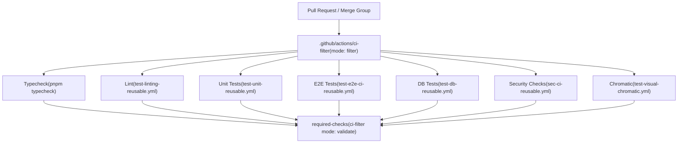
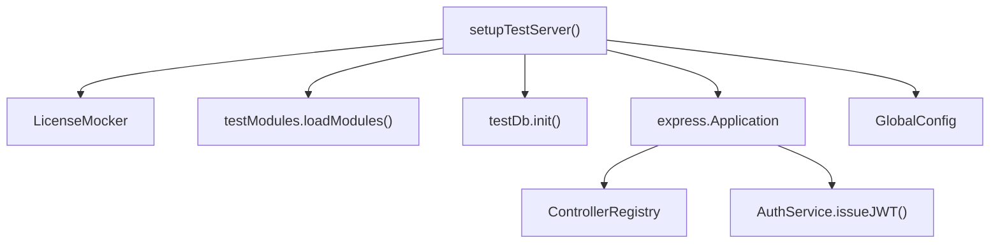

# Testing Strategy and Tools

Relevant source files

-   [packages/cli/src/generic-helpers.ts](https://github.com/n8n-io/n8n/blob/88f170b9/packages/cli/src/generic-helpers.ts)
-   [packages/cli/src/middlewares/list-query/filter.ts](https://github.com/n8n-io/n8n/blob/88f170b9/packages/cli/src/middlewares/list-query/filter.ts)
-   [packages/cli/src/middlewares/list-query/select.ts](https://github.com/n8n-io/n8n/blob/88f170b9/packages/cli/src/middlewares/list-query/select.ts)
-   [packages/cli/src/server.ts](https://github.com/n8n-io/n8n/blob/88f170b9/packages/cli/src/server.ts)
-   [packages/cli/test/integration/deduplication/deduplication-helper.test.ts](https://github.com/n8n-io/n8n/blob/88f170b9/packages/cli/test/integration/deduplication/deduplication-helper.test.ts)
-   [packages/cli/test/integration/shared/types.ts](https://github.com/n8n-io/n8n/blob/88f170b9/packages/cli/test/integration/shared/types.ts)
-   [packages/cli/test/integration/shared/utils/node-types-data.ts](https://github.com/n8n-io/n8n/blob/88f170b9/packages/cli/test/integration/shared/utils/node-types-data.ts)
-   [packages/cli/test/integration/shared/utils/test-server.ts](https://github.com/n8n-io/n8n/blob/88f170b9/packages/cli/test/integration/shared/utils/test-server.ts)

This page describes the testing stack, test suite categories, CI filter logic, shared test utilities, and the E2E infrastructure used across the n8n monorepo. It covers how different test tiers are structured, which frameworks run them, and how the CI pipeline decides what to execute on a given pull request.

For a detailed walkthrough of Playwright E2E patterns and page objects, see [8.2](https://github.com/n8n-io/n8n/blob/88f170b9/8.2) For unit and integration test patterns, database helpers, and mock conventions, see [8.3](https://github.com/n8n-io/n8n/blob/88f170b9/8.3)

---

## Testing Stack Overview

The monorepo uses three distinct test runners, each targeting a different layer of the application.

| Layer | Framework | Location | CI job |
| --- | --- | --- | --- |
| Backend unit | Jest | `packages/cli/src/**/__tests__/`, `packages/@n8n/*/test/` | `unit-test` |
| Frontend unit | Vitest | `packages/frontend/**/**.test.ts` | `unit-test` |
| Integration / DB | Jest | `packages/cli/test/integration/`, `packages/cli/test/migration/` | `db-tests` |
| E2E browser | Playwright + Currents | `packages/testing/playwright/` | `e2e-tests` |
| Visual regression | Chromatic | `packages/frontend/@n8n/design-system/` | `chromatic` |

The backend and frontend unit tests are bundled under the same `unit-test` CI job but run through different test runners. Integration tests that require a live database are separated into the `db-tests` job, which uses Testcontainers to spin up real Postgres and SQLite instances.

Sources: [packages/cli/src/server.ts120-122](https://github.com/n8n-io/n8n/blob/88f170b9/packages/cli/src/server.ts#L120-L122) [packages/cli/test/integration/shared/types.ts10-51](https://github.com/n8n-io/n8n/blob/88f170b9/packages/cli/test/integration/shared/types.ts#L10-L51)

---

## CI Filter: Selective Test Execution

Every pull request runs a `ci-filter` action before executing any test suites. The action reads the set of changed files and emits a JSON object of boolean flags that downstream jobs consume.

**CI filter pipeline:**

The `required-checks` job at the end re-runs the same `ci-filter` action in `validate` mode, which reads the results of all upstream jobs and fails if any required check is missing or failed. This is the branch protection gate.

Sources: [packages/cli/src/server.ts115-151](https://github.com/n8n-io/n8n/blob/88f170b9/packages/cli/src/server.ts#L115-L151)

---

## Backend Unit Tests (Jest)

Backend packages use Jest as the test runner with `jest-mock-extended` for typed mocking.

**Package-level Jest config locations:**

-   `packages/@n8n/config/` — tests `GlobalConfig` env var loading.
-   `packages/cli/src/**/__tests__/` — unit tests for services and controllers.
-   `packages/cli/test/integration/` — integration tests (require database).

A typical backend unit test constructs a class under test by supplying `mock<T>()` instances for its dependencies directly, bypassing the DI container.

The `@n8n/backend-test-utils` package exports several utilities used across backend tests:

-   `mockInstance(ServiceClass)` — registers a mocked instance in the DI container [packages/cli/test/integration/shared/utils/test-server.ts112-114](https://github.com/n8n-io/n8n/blob/88f170b9/packages/cli/test/integration/shared/utils/test-server.ts#L112-L114)
-   `mockLogger()` — returns a typed mock of the `Logger` class [packages/cli/test/integration/shared/utils/test-server.ts111](https://github.com/n8n-io/n8n/blob/88f170b9/packages/cli/test/integration/shared/utils/test-server.ts#L111-L111)
-   `testDb` — helper for database initialization and truncation [packages/cli/test/integration/shared/utils/test-server.ts131](https://github.com/n8n-io/n8n/blob/88f170b9/packages/cli/test/integration/shared/utils/test-server.ts#L131-L131)

Sources: [packages/cli/test/integration/shared/utils/test-server.ts1-20](https://github.com/n8n-io/n8n/blob/88f170b9/packages/cli/test/integration/shared/utils/test-server.ts#L1-L20) [packages/cli/test/integration/deduplication/deduplication-helper.test.ts1-13](https://github.com/n8n-io/n8n/blob/88f170b9/packages/cli/test/integration/deduplication/deduplication-helper.test.ts#L1-L13)

---

## Integration and DB Tests (Jest + Testcontainers)

Integration tests in `packages/cli/test/integration/` start a real HTTP server and connect to a real database. The `db-tests` CI job provisions ephemeral Postgres and SQLite instances using Testcontainers.

### Test Server Setup

The `setupTestServer` utility in `packages/cli/test/integration/shared/utils/test-server.ts` handles the orchestration of an Express application for testing. It allows selective loading of `endpointGroups` (e.g., 'workflows', 'credentials', 'publicApi') to keep tests focused and fast.

**Integration Test Architecture:**

The `TestServer` interface provides specialized agents for different authentication contexts:

-   `authAgentFor(user)`: A Supertest agent with a valid JWT cookie [packages/cli/test/integration/shared/utils/test-server.ts119](https://github.com/n8n-io/n8n/blob/88f170b9/packages/cli/test/integration/shared/utils/test-server.ts#L119-L119)
-   `publicApiAgentFor(user)`: An agent configured with the `X-N8N-API-KEY` header [packages/cli/test/integration/shared/utils/test-server.ts122](https://github.com/n8n-io/n8n/blob/88f170b9/packages/cli/test/integration/shared/utils/test-server.ts#L122-L122)
-   `authlessAgent`: A standard agent without credentials [packages/cli/test/integration/shared/utils/test-server.ts120](https://github.com/n8n-io/n8n/blob/88f170b9/packages/cli/test/integration/shared/utils/test-server.ts#L120-L120)

Sources: [packages/cli/test/integration/shared/utils/test-server.ts95-126](https://github.com/n8n-io/n8n/blob/88f170b9/packages/cli/test/integration/shared/utils/test-server.ts#L95-L126) [packages/cli/test/integration/shared/types.ts74-84](https://github.com/n8n-io/n8n/blob/88f170b9/packages/cli/test/integration/shared/types.ts#L74-L84)

---

## E2E Tests (Playwright)

E2E tests live in `packages/testing/playwright/`. They run against a fully started n8n instance.

### E2E backend reset endpoint

When `inE2ETests` is true, the backend registers an additional `e2e.controller` at `/rest/e2e` [packages/cli/src/server.ts120-122](https://github.com/n8n-io/n8n/blob/88f170b9/packages/cli/src/server.ts#L120-L122) This controller provides endpoints to reset the database state and toggle license features during test runs.

### Mocking Node Types

For integration tests that involve workflow execution or deduplication, `mockNodeTypesData` is used to create lightweight `INodeTypeData` objects, avoiding the overhead of loading the full `nodes-base` package.

> **[Mermaid sequence]**
> *(图表结构无法解析)*

Sources: [packages/cli/test/integration/deduplication/deduplication-helper.test.ts20-26](https://github.com/n8n-io/n8n/blob/88f170b9/packages/cli/test/integration/deduplication/deduplication-helper.test.ts#L20-L26) [packages/cli/test/integration/shared/utils/node-types-data.ts3-33](https://github.com/n8n-io/n8n/blob/88f170b9/packages/cli/test/integration/shared/utils/node-types-data.ts#L3-L33)

---

## Performance and Benchmarking

n8n includes a benchmark tool for performance testing, often used to measure the impact of changes on workflow execution speed and memory usage. This is supported by the `benchmark` Docker image defined in the CI pipeline.

### Deduplication Helper Testing

Performance-sensitive utilities like the `DataDeduplicationService` are tested for various modes, including `entries` (tracking specific IDs) and `latestIncrementalKey` (tracking timestamps or numeric sequences) [packages/cli/test/integration/deduplication/deduplication-helper.test.ts64-210](https://github.com/n8n-io/n8n/blob/88f170b9/packages/cli/test/integration/deduplication/deduplication-helper.test.ts#L64-L210) These tests ensure that pruning logic (e.g., `maxEntries`) works correctly to prevent unbounded database growth [packages/cli/test/integration/deduplication/deduplication-helper.test.ts158-201](https://github.com/n8n-io/n8n/blob/88f170b9/packages/cli/test/integration/deduplication/deduplication-helper.test.ts#L158-L201)

Sources: [packages/cli/test/integration/deduplication/deduplication-helper.test.ts63-232](https://github.com/n8n-io/n8n/blob/88f170b9/packages/cli/test/integration/deduplication/deduplication-helper.test.ts#L63-L232)

---

## Test Mode Configuration

The application adjusts behavior based on the environment:

| Mode | Flag | Behavior |
| --- | --- | --- |
| Development | `inDevelopment` | Enables hot reload via `loadNodesAndCredentials.setupHotReload()` [packages/cli/src/server.ts106-108](https://github.com/n8n-io/n8n/blob/88f170b9/packages/cli/src/server.ts#L106-L108) |
| E2E | `inE2ETests` | Registers `e2e.controller` for environment manipulation [packages/cli/src/server.ts120-122](https://github.com/n8n-io/n8n/blob/88f170b9/packages/cli/src/server.ts#L120-L122) |
| Multi-Main | `instanceSettings.isMultiMain` | Registers `debug.controller` in non-production environments [packages/cli/src/server.ts116-118](https://github.com/n8n-io/n8n/blob/88f170b9/packages/cli/src/server.ts#L116-L118) |

Sources: [packages/cli/src/server.ts106-122](https://github.com/n8n-io/n8n/blob/88f170b9/packages/cli/src/server.ts#L106-L122)
