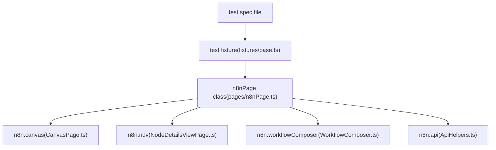
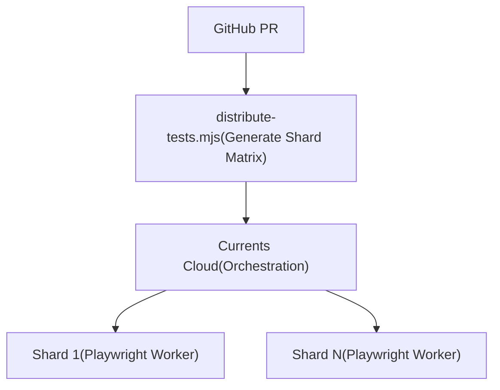

# E2E Testing with Playwright

Relevant source files

-   [.github/CI-TELEMETRY.md](https://github.com/n8n-io/n8n/blob/88f170b9/.github/CI-TELEMETRY.md?plain=1)
-   [.github/WORKFLOWS.md](https://github.com/n8n-io/n8n/blob/88f170b9/.github/WORKFLOWS.md?plain=1)
-   [.github/actions/docker-registry-login/action.yml](https://github.com/n8n-io/n8n/blob/88f170b9/.github/actions/docker-registry-login/action.yml)
-   [.github/actions/setup-nodejs/action.yml](https://github.com/n8n-io/n8n/blob/88f170b9/.github/actions/setup-nodejs/action.yml)
-   [.github/scripts/cleanup-ghcr-images.mjs](https://github.com/n8n-io/n8n/blob/88f170b9/.github/scripts/cleanup-ghcr-images.mjs)
-   [.github/scripts/retry.mjs](https://github.com/n8n-io/n8n/blob/88f170b9/.github/scripts/retry.mjs)
-   [.github/scripts/send-build-stats.mjs](https://github.com/n8n-io/n8n/blob/88f170b9/.github/scripts/send-build-stats.mjs)
-   [.github/scripts/send-docker-stats.mjs](https://github.com/n8n-io/n8n/blob/88f170b9/.github/scripts/send-docker-stats.mjs)
-   [.github/workflows/build-base-image.yml](https://github.com/n8n-io/n8n/blob/88f170b9/.github/workflows/build-base-image.yml)
-   [.github/workflows/build-benchmark-image.yml](https://github.com/n8n-io/n8n/blob/88f170b9/.github/workflows/build-benchmark-image.yml)
-   [.github/workflows/release-standalone-package.yml](https://github.com/n8n-io/n8n/blob/88f170b9/.github/workflows/release-standalone-package.yml)
-   [.github/workflows/sbom-generation-callable.yml](https://github.com/n8n-io/n8n/blob/88f170b9/.github/workflows/sbom-generation-callable.yml)
-   [.github/workflows/security-trivy-scan-callable.yml](https://github.com/n8n-io/n8n/blob/88f170b9/.github/workflows/security-trivy-scan-callable.yml)
-   [.github/workflows/test-benchmark-destroy-nightly.yml](https://github.com/n8n-io/n8n/blob/88f170b9/.github/workflows/test-benchmark-destroy-nightly.yml)
-   [.github/workflows/test-benchmark-nightly.yml](https://github.com/n8n-io/n8n/blob/88f170b9/.github/workflows/test-benchmark-nightly.yml)
-   [.github/workflows/test-e2e-ci-reusable.yml](https://github.com/n8n-io/n8n/blob/88f170b9/.github/workflows/test-e2e-ci-reusable.yml)
-   [.github/workflows/test-e2e-coverage-weekly.yml](https://github.com/n8n-io/n8n/blob/88f170b9/.github/workflows/test-e2e-coverage-weekly.yml)
-   [.github/workflows/test-e2e-helm.yml](https://github.com/n8n-io/n8n/blob/88f170b9/.github/workflows/test-e2e-helm.yml)
-   [.github/workflows/test-e2e-performance-reusable.yml](https://github.com/n8n-io/n8n/blob/88f170b9/.github/workflows/test-e2e-performance-reusable.yml)
-   [.github/workflows/test-e2e-reusable.yml](https://github.com/n8n-io/n8n/blob/88f170b9/.github/workflows/test-e2e-reusable.yml)
-   [.github/workflows/test-linting-reusable.yml](https://github.com/n8n-io/n8n/blob/88f170b9/.github/workflows/test-linting-reusable.yml)
-   [.github/workflows/test-unit-reusable.yml](https://github.com/n8n-io/n8n/blob/88f170b9/.github/workflows/test-unit-reusable.yml)
-   [.github/workflows/util-cleanup-pr-images.yml](https://github.com/n8n-io/n8n/blob/88f170b9/.github/workflows/util-cleanup-pr-images.yml)
-   [.github/workflows/util-sync-api-docs.yml](https://github.com/n8n-io/n8n/blob/88f170b9/.github/workflows/util-sync-api-docs.yml)
-   [packages/@n8n/nodes-langchain/nodes/vector\_store/VectorStoreRedis/VectorStoreRedis.node.ts](https://github.com/n8n-io/n8n/blob/88f170b9/packages/@n8n/nodes-langchain/nodes/vector_store/VectorStoreRedis/VectorStoreRedis.node.ts)
-   [packages/@n8n/nodes-langchain/nodes/vendors/OpenAi/v2/actions/node.type.ts](https://github.com/n8n-io/n8n/blob/88f170b9/packages/@n8n/nodes-langchain/nodes/vendors/OpenAi/v2/actions/node.type.ts)
-   [packages/@n8n/nodes-langchain/nodes/vendors/OpenAi/v2/actions/text/index.ts](https://github.com/n8n-io/n8n/blob/88f170b9/packages/@n8n/nodes-langchain/nodes/vendors/OpenAi/v2/actions/text/index.ts)
-   [packages/cli/src/\_\_tests\_\_/abstract-server.test.ts](https://github.com/n8n-io/n8n/blob/88f170b9/packages/cli/src/__tests__/abstract-server.test.ts)
-   [packages/cli/src/commands/\_\_tests\_\_/webhook.test.ts](https://github.com/n8n-io/n8n/blob/88f170b9/packages/cli/src/commands/__tests__/webhook.test.ts)
-   [packages/cli/src/commands/\_\_tests\_\_/worker.test.ts](https://github.com/n8n-io/n8n/blob/88f170b9/packages/cli/src/commands/__tests__/worker.test.ts)
-   [packages/cli/src/controllers/third-party-licenses.controller.ts](https://github.com/n8n-io/n8n/blob/88f170b9/packages/cli/src/controllers/third-party-licenses.controller.ts)
-   [packages/cli/test/integration/controllers/third-party-licenses.controller.test.ts](https://github.com/n8n-io/n8n/blob/88f170b9/packages/cli/test/integration/controllers/third-party-licenses.controller.test.ts)
-   [packages/frontend/@n8n/rest-api-client/src/api/third-party-licenses.ts](https://github.com/n8n-io/n8n/blob/88f170b9/packages/frontend/@n8n/rest-api-client/src/api/third-party-licenses.ts)
-   [packages/frontend/editor-ui/src/features/ndv/runData/components/\_\_snapshots\_\_/RunDataJson.test.ts.snap](https://github.com/n8n-io/n8n/blob/88f170b9/packages/frontend/editor-ui/src/features/ndv/runData/components/__snapshots__/RunDataJson.test.ts.snap)
-   [packages/testing/containers/HELM-TESTING.md](https://github.com/n8n-io/n8n/blob/88f170b9/packages/testing/containers/HELM-TESTING.md?plain=1)
-   [packages/testing/containers/README.md](https://github.com/n8n-io/n8n/blob/88f170b9/packages/testing/containers/README.md?plain=1)
-   [packages/testing/containers/helm-stack.ts](https://github.com/n8n-io/n8n/blob/88f170b9/packages/testing/containers/helm-stack.ts)
-   [packages/testing/containers/helm-start-stack.ts](https://github.com/n8n-io/n8n/blob/88f170b9/packages/testing/containers/helm-start-stack.ts)
-   [packages/testing/containers/index.ts](https://github.com/n8n-io/n8n/blob/88f170b9/packages/testing/containers/index.ts)
-   [packages/testing/containers/n8n-start-stack.ts](https://github.com/n8n-io/n8n/blob/88f170b9/packages/testing/containers/n8n-start-stack.ts)
-   [packages/testing/containers/network-stabilization.ts](https://github.com/n8n-io/n8n/blob/88f170b9/packages/testing/containers/network-stabilization.ts)
-   [packages/testing/containers/package.json](https://github.com/n8n-io/n8n/blob/88f170b9/packages/testing/containers/package.json)
-   [packages/testing/containers/pull-test-images.ts](https://github.com/n8n-io/n8n/blob/88f170b9/packages/testing/containers/pull-test-images.ts)
-   [packages/testing/containers/services/kafka.ts](https://github.com/n8n-io/n8n/blob/88f170b9/packages/testing/containers/services/kafka.ts)
-   [packages/testing/containers/services/n8n.ts](https://github.com/n8n-io/n8n/blob/88f170b9/packages/testing/containers/services/n8n.ts)
-   [packages/testing/containers/services/registry.ts](https://github.com/n8n-io/n8n/blob/88f170b9/packages/testing/containers/services/registry.ts)
-   [packages/testing/containers/services/types.ts](https://github.com/n8n-io/n8n/blob/88f170b9/packages/testing/containers/services/types.ts)
-   [packages/testing/containers/test-containers.ts](https://github.com/n8n-io/n8n/blob/88f170b9/packages/testing/containers/test-containers.ts)
-   [packages/testing/janitor/src/rules/dead-code.rule.test.ts](https://github.com/n8n-io/n8n/blob/88f170b9/packages/testing/janitor/src/rules/dead-code.rule.test.ts)
-   [packages/testing/janitor/src/rules/dead-code.rule.ts](https://github.com/n8n-io/n8n/blob/88f170b9/packages/testing/janitor/src/rules/dead-code.rule.ts)
-   [packages/testing/playwright/CONTRIBUTING.md](https://github.com/n8n-io/n8n/blob/88f170b9/packages/testing/playwright/CONTRIBUTING.md?plain=1)
-   [packages/testing/playwright/README.md](https://github.com/n8n-io/n8n/blob/88f170b9/packages/testing/playwright/README.md?plain=1)
-   [packages/testing/playwright/Types.ts](https://github.com/n8n-io/n8n/blob/88f170b9/packages/testing/playwright/Types.ts)
-   [packages/testing/playwright/composables/ProjectComposer.ts](https://github.com/n8n-io/n8n/blob/88f170b9/packages/testing/playwright/composables/ProjectComposer.ts)
-   [packages/testing/playwright/composables/WorkflowComposer.ts](https://github.com/n8n-io/n8n/blob/88f170b9/packages/testing/playwright/composables/WorkflowComposer.ts)
-   [packages/testing/playwright/currents.config.ts](https://github.com/n8n-io/n8n/blob/88f170b9/packages/testing/playwright/currents.config.ts)
-   [packages/testing/playwright/fixtures/base.ts](https://github.com/n8n-io/n8n/blob/88f170b9/packages/testing/playwright/fixtures/base.ts)
-   [packages/testing/playwright/fixtures/capabilities.ts](https://github.com/n8n-io/n8n/blob/88f170b9/packages/testing/playwright/fixtures/capabilities.ts)
-   [packages/testing/playwright/global-setup.ts](https://github.com/n8n-io/n8n/blob/88f170b9/packages/testing/playwright/global-setup.ts)
-   [packages/testing/playwright/helpers/NavigationHelper.ts](https://github.com/n8n-io/n8n/blob/88f170b9/packages/testing/playwright/helpers/NavigationHelper.ts)
-   [packages/testing/playwright/package.json](https://github.com/n8n-io/n8n/blob/88f170b9/packages/testing/playwright/package.json)
-   [packages/testing/playwright/pages/CanvasPage.ts](https://github.com/n8n-io/n8n/blob/88f170b9/packages/testing/playwright/pages/CanvasPage.ts)
-   [packages/testing/playwright/pages/NodeDetailsViewPage.ts](https://github.com/n8n-io/n8n/blob/88f170b9/packages/testing/playwright/pages/NodeDetailsViewPage.ts)
-   [packages/testing/playwright/pages/ProjectSettingsPage.ts](https://github.com/n8n-io/n8n/blob/88f170b9/packages/testing/playwright/pages/ProjectSettingsPage.ts)
-   [packages/testing/playwright/pages/SecretsProviderSettingsPage.ts](https://github.com/n8n-io/n8n/blob/88f170b9/packages/testing/playwright/pages/SecretsProviderSettingsPage.ts)
-   [packages/testing/playwright/pages/SidebarPage.ts](https://github.com/n8n-io/n8n/blob/88f170b9/packages/testing/playwright/pages/SidebarPage.ts)
-   [packages/testing/playwright/pages/WorkflowSettingsModal.ts](https://github.com/n8n-io/n8n/blob/88f170b9/packages/testing/playwright/pages/WorkflowSettingsModal.ts)
-   [packages/testing/playwright/pages/components/DeleteSecretsProviderModal.ts](https://github.com/n8n-io/n8n/blob/88f170b9/packages/testing/playwright/pages/components/DeleteSecretsProviderModal.ts)
-   [packages/testing/playwright/pages/components/RunDataPanel.ts](https://github.com/n8n-io/n8n/blob/88f170b9/packages/testing/playwright/pages/components/RunDataPanel.ts)
-   [packages/testing/playwright/pages/components/SecretsProviderConnectionModal.ts](https://github.com/n8n-io/n8n/blob/88f170b9/packages/testing/playwright/pages/components/SecretsProviderConnectionModal.ts)
-   [packages/testing/playwright/pages/n8nPage.ts](https://github.com/n8n-io/n8n/blob/88f170b9/packages/testing/playwright/pages/n8nPage.ts)
-   [packages/testing/playwright/playwright-projects.ts](https://github.com/n8n-io/n8n/blob/88f170b9/packages/testing/playwright/playwright-projects.ts)
-   [packages/testing/playwright/playwright.config.ts](https://github.com/n8n-io/n8n/blob/88f170b9/packages/testing/playwright/playwright.config.ts)
-   [packages/testing/playwright/reporters/USAGE.md](https://github.com/n8n-io/n8n/blob/88f170b9/packages/testing/playwright/reporters/USAGE.md?plain=1)
-   [packages/testing/playwright/reporters/metrics-reporter.ts](https://github.com/n8n-io/n8n/blob/88f170b9/packages/testing/playwright/reporters/metrics-reporter.ts)
-   [packages/testing/playwright/scripts/coverage-analysis.mjs](https://github.com/n8n-io/n8n/blob/88f170b9/packages/testing/playwright/scripts/coverage-analysis.mjs)
-   [packages/testing/playwright/scripts/coverage-workflow.md](https://github.com/n8n-io/n8n/blob/88f170b9/packages/testing/playwright/scripts/coverage-workflow.md?plain=1)
-   [packages/testing/playwright/scripts/distribute-tests.mjs](https://github.com/n8n-io/n8n/blob/88f170b9/packages/testing/playwright/scripts/distribute-tests.mjs)
-   [packages/testing/playwright/scripts/generate-coverage-report.js](https://github.com/n8n-io/n8n/blob/88f170b9/packages/testing/playwright/scripts/generate-coverage-report.js)
-   [packages/testing/playwright/tests/e2e/nodes/kafka-nodes.spec.ts](https://github.com/n8n-io/n8n/blob/88f170b9/packages/testing/playwright/tests/e2e/nodes/kafka-nodes.spec.ts)
-   [packages/testing/playwright/tests/e2e/settings/external-secrets/secret-providers-connections-ui.spec.ts](https://github.com/n8n-io/n8n/blob/88f170b9/packages/testing/playwright/tests/e2e/settings/external-secrets/secret-providers-connections-ui.spec.ts)
-   [packages/testing/playwright/tests/e2e/workflows/editor/canvas/canvas-zoom.spec.ts](https://github.com/n8n-io/n8n/blob/88f170b9/packages/testing/playwright/tests/e2e/workflows/editor/canvas/canvas-zoom.spec.ts)
-   [packages/testing/playwright/tests/e2e/workflows/editor/execution/execution.spec.ts](https://github.com/n8n-io/n8n/blob/88f170b9/packages/testing/playwright/tests/e2e/workflows/editor/execution/execution.spec.ts)
-   [packages/testing/playwright/tests/e2e/workflows/editor/execution/inject-previous.spec.ts](https://github.com/n8n-io/n8n/blob/88f170b9/packages/testing/playwright/tests/e2e/workflows/editor/execution/inject-previous.spec.ts)
-   [packages/testing/playwright/tests/e2e/workflows/editor/execution/logs.spec.ts](https://github.com/n8n-io/n8n/blob/88f170b9/packages/testing/playwright/tests/e2e/workflows/editor/execution/logs.spec.ts)
-   [packages/testing/playwright/tests/e2e/workflows/editor/expressions/inline.spec.ts](https://github.com/n8n-io/n8n/blob/88f170b9/packages/testing/playwright/tests/e2e/workflows/editor/expressions/inline.spec.ts)
-   [packages/testing/playwright/tests/e2e/workflows/editor/ndv/paired-item.spec.ts](https://github.com/n8n-io/n8n/blob/88f170b9/packages/testing/playwright/tests/e2e/workflows/editor/ndv/paired-item.spec.ts)
-   [packages/testing/playwright/tests/e2e/workflows/editor/ndv/pinning.spec.ts](https://github.com/n8n-io/n8n/blob/88f170b9/packages/testing/playwright/tests/e2e/workflows/editor/ndv/pinning.spec.ts)
-   [packages/testing/playwright/tests/e2e/workflows/editor/workflow-actions/archive.spec.ts](https://github.com/n8n-io/n8n/blob/88f170b9/packages/testing/playwright/tests/e2e/workflows/editor/workflow-actions/archive.spec.ts)
-   [packages/testing/playwright/tests/performance/large-node-cloud.spec.ts](https://github.com/n8n-io/n8n/blob/88f170b9/packages/testing/playwright/tests/performance/large-node-cloud.spec.ts)
-   [packages/testing/playwright/tests/performance/memory-consumption-cloud.spec.ts](https://github.com/n8n-io/n8n/blob/88f170b9/packages/testing/playwright/tests/performance/memory-consumption-cloud.spec.ts)
-   [packages/testing/playwright/tests/performance/memory-retention.spec.ts](https://github.com/n8n-io/n8n/blob/88f170b9/packages/testing/playwright/tests/performance/memory-retention.spec.ts)
-   [packages/testing/playwright/utils/performance-helper.ts](https://github.com/n8n-io/n8n/blob/88f170b9/packages/testing/playwright/utils/performance-helper.ts)
-   [packages/testing/playwright/utils/requirements.ts](https://github.com/n8n-io/n8n/blob/88f170b9/packages/testing/playwright/utils/requirements.ts)
-   [packages/testing/playwright/workflows/Pinned\_webhook\_node.json](https://github.com/n8n-io/n8n/blob/88f170b9/packages/testing/playwright/workflows/Pinned_webhook_node.json)
-   [packages/testing/playwright/workflows/Test\_ado\_1338.json](https://github.com/n8n-io/n8n/blob/88f170b9/packages/testing/playwright/workflows/Test_ado_1338.json)
-   [packages/testing/playwright/workflows/Test\_workflow\_webhook\_with\_pin\_data.json](https://github.com/n8n-io/n8n/blob/88f170b9/packages/testing/playwright/workflows/Test_workflow_webhook_with_pin_data.json)
-   [scripts/scan-n8n-image.mjs](https://github.com/n8n-io/n8n/blob/88f170b9/scripts/scan-n8n-image.mjs)
-   [security/trivy-ignore-policy.rego](https://github.com/n8n-io/n8n/blob/88f170b9/security/trivy-ignore-policy.rego)
-   [security/trivy.yaml](https://github.com/n8n-io/n8n/blob/88f170b9/security/trivy.yaml)
-   [security/vex.openvex.json](https://github.com/n8n-io/n8n/blob/88f170b9/security/vex.openvex.json)

This page documents the end-to-end (E2E) test infrastructure for n8n, which uses Playwright to drive a real browser against a running n8n instance. It covers the package layout, the page object model (POM) hierarchy, the fixture system, distributed execution, and coverage collection.

For unit and integration testing (Vitest/Jest against the backend), see [Unit and Integration Testing](/n8n-io/n8n/8.3-unit-and-integration-testing). For the overall testing strategy and tool selection, see [Testing Strategy and Tools](/n8n-io/n8n/8.1-testing-strategy-and-tools).

---

## Package Layout

All Playwright tests live in the dedicated package at `packages/testing/playwright/`, published under the name `n8n-playwright` [packages/testing/playwright/package.json1-2](https://github.com/n8n-io/n8n/blob/88f170b9/packages/testing/playwright/package.json#L1-L2) The package is separate from application packages and communicates with n8n via HTTP and browser automation.

```
packages/testing/playwright/
├── composables/          # Higher-level test actions (e.g. WorkflowComposer)
├── config/               # Environment constants and route definitions
├── fixtures/             # Playwright fixtures (base.ts, observability.ts)
├── helpers/              # Utility classes (NavigationHelper, ClipboardHelper)
├── pages/                # Page Object Models (POM)
│   ├── BasePage.ts       # Common base class for all POMs
│   ├── CanvasPage.ts     # Main workflow editor canvas
│   ├── NodeDetailsViewPage.ts # NDV / Parameter panel
│   └── components/       # Reusable UI parts (LogsPanel, NodeCreator)
├── scripts/              # Coverage and distribution utilities
├── tests/                # Test suites
│   ├── e2e/              # Standard feature tests
│   └── performance/      # Resource consumption tests
├── playwright.config.ts  # Main Playwright configuration
└── currents.config.ts    # Currents parallel-run configuration
```
Sources: [packages/testing/playwright/package.json1-66](https://github.com/n8n-io/n8n/blob/88f170b9/packages/testing/playwright/package.json#L1-L66) [packages/testing/playwright/playwright.config.ts1-127](https://github.com/n8n-io/n8n/blob/88f170b9/packages/testing/playwright/playwright.config.ts#L1-L127) [packages/testing/playwright/pages/n8nPage.ts1-153](https://github.com/n8n-io/n8n/blob/88f170b9/packages/testing/playwright/pages/n8nPage.ts#L1-L153)

---

## Fixture System

Tests import from `fixtures/base` and receive an `n8n` composite fixture object of type `n8nPage` [packages/testing/playwright/fixtures/base.ts13-20](https://github.com/n8n-io/n8n/blob/88f170b9/packages/testing/playwright/fixtures/base.ts#L13-L20) This fixture abstracts server lifecycle, authentication, and navigation.

**Fixture architecture — code entity map**


Sources: [packages/testing/playwright/fixtures/base.ts148-207](https://github.com/n8n-io/n8n/blob/88f170b9/packages/testing/playwright/fixtures/base.ts#L148-L207) [packages/testing/playwright/pages/n8nPage.ts69-153](https://github.com/n8n-io/n8n/blob/88f170b9/packages/testing/playwright/pages/n8nPage.ts#L69-L153)

### Test Entry and Authentication

The `n8n` fixture handles automatic sign-in. By default, it signs in as an 'owner' unless specific tags like `@auth:none` are present [packages/testing/playwright/fixtures/base.ts167-176](https://github.com/n8n-io/n8n/blob/88f170b9/packages/testing/playwright/fixtures/base.ts#L167-L176) It also synchronizes authentication cookies between the backend API context and the browser context [packages/testing/playwright/fixtures/base.ts178-205](https://github.com/n8n-io/n8n/blob/88f170b9/packages/testing/playwright/fixtures/base.ts#L178-L205)

---

## Page Object Models

Page Object Models (POMs) encapsulate locators and actions. All feature-specific pages extend `BasePage`.

### `CanvasPage`

Models the workflow editor canvas where nodes are placed and connected [packages/testing/playwright/pages/CanvasPage.ts15](https://github.com/n8n-io/n8n/blob/88f170b9/packages/testing/playwright/pages/CanvasPage.ts#L15-L15)

| Method | Description |
| --- | --- |
| `addNode(nodeName, options)` | Adds a node via the node creator, optionally selecting an action/trigger [packages/testing/playwright/pages/CanvasPage.ts110-152](https://github.com/n8n-io/n8n/blob/88f170b9/packages/testing/playwright/pages/CanvasPage.ts#L110-L152) |
| `nodeByName(nodeName)` | Returns a locator for a specific node on the canvas [packages/testing/playwright/pages/CanvasPage.ts42-44](https://github.com/n8n-io/n8n/blob/88f170b9/packages/testing/playwright/pages/CanvasPage.ts#L42-L44) |
| `clickExecuteWorkflowButton()` | Clicks the main execution button [packages/testing/playwright/pages/CanvasPage.ts174-179](https://github.com/n8n-io/n8n/blob/88f170b9/packages/testing/playwright/pages/CanvasPage.ts#L174-L179) |
| `openNode(nodeName)` | Double-clicks a node to open the NDV [packages/testing/playwright/pages/CanvasPage.ts181-183](https://github.com/n8n-io/n8n/blob/88f170b9/packages/testing/playwright/pages/CanvasPage.ts#L181-L183) |

### `NodeDetailsViewPage` (NDV)

Models the parameter panel and execution data view for a single node [packages/testing/playwright/pages/NodeDetailsViewPage.ts11](https://github.com/n8n-io/n8n/blob/88f170b9/packages/testing/playwright/pages/NodeDetailsViewPage.ts#L11-L11)

| Method | Description |
| --- | --- |
| `fillParameterInput(label, value)` | Locates and fills a specific parameter field [packages/testing/playwright/pages/NodeDetailsViewPage.ts65-69](https://github.com/n8n-io/n8n/blob/88f170b9/packages/testing/playwright/pages/NodeDetailsViewPage.ts#L65-L69) |
| `execute()` | Clicks the "Test Step" or "Execute Node" button [packages/testing/playwright/pages/NodeDetailsViewPage.ts93-95](https://github.com/n8n-io/n8n/blob/88f170b9/packages/testing/playwright/pages/NodeDetailsViewPage.ts#L93-L95) |
| `setPinnedData(data)` | Manually injects data into the node's output for testing [packages/testing/playwright/pages/NodeDetailsViewPage.ts146-156](https://github.com/n8n-io/n8n/blob/88f170b9/packages/testing/playwright/pages/NodeDetailsViewPage.ts#L146-L156) |
| `activateParameterExpressionEditor()` | Toggles a parameter from fixed value to expression mode [packages/testing/playwright/pages/NodeDetailsViewPage.ts121-128](https://github.com/n8n-io/n8n/blob/88f170b9/packages/testing/playwright/pages/NodeDetailsViewPage.ts#L121-L128) |

Sources: [packages/testing/playwright/pages/CanvasPage.ts15-183](https://github.com/n8n-io/n8n/blob/88f170b9/packages/testing/playwright/pages/CanvasPage.ts#L15-L183) [packages/testing/playwright/pages/NodeDetailsViewPage.ts11-240](https://github.com/n8n-io/n8n/blob/88f170b9/packages/testing/playwright/pages/NodeDetailsViewPage.ts#L11-L240)

---

## Distributed Test Execution

n8n uses a custom distribution script `distribute-tests.mjs` to split tests into shards for CI [packages/testing/playwright/scripts/distribute-tests.mjs](https://github.com/n8n-io/n8n/blob/88f170b9/packages/testing/playwright/scripts/distribute-tests.mjs)

### CI Sharding

The CI pipeline generates a shard matrix based on the number of requested shards (default 16 in CI) [.github/workflows/test-e2e-ci-reusable.yml71-76](https://github.com/n8n-io/n8n/blob/88f170b9/.github/workflows/test-e2e-ci-reusable.yml#L71-L76)

1.  **Impact Analysis**: If only Playwright files changed, it runs only impacted tests [.github/workflows/test-e2e-ci-reusable.yml72-74](https://github.com/n8n-io/n8n/blob/88f170b9/.github/workflows/test-e2e-ci-reusable.yml#L72-L74)
2.  **Orchestration**: It uses duration-based custom orchestration via Currents to ensure shards finish at similar times [.github/workflows/test-e2e-reusable.yml40-44](https://github.com/n8n-io/n8n/blob/88f170b9/.github/workflows/test-e2e-reusable.yml#L40-L44)

**Distributed CI Flow**


Sources: [.github/workflows/test-e2e-ci-reusable.yml66-77](https://github.com/n8n-io/n8n/blob/88f170b9/.github/workflows/test-e2e-ci-reusable.yml#L66-L77) [.github/workflows/test-e2e-reusable.yml106-110](https://github.com/n8n-io/n8n/blob/88f170b9/.github/workflows/test-e2e-reusable.yml#L106-L110)

---

## Architecture Enforcement (Playwright Janitor)

The `playwright-janitor` is a utility used to enforce architectural rules within the testing package [packages/testing/playwright/package.json35-36](https://github.com/n8n-io/n8n/blob/88f170b9/packages/testing/playwright/package.json#L35-L36) It ensures that:

-   Page objects follow the standard inheritance patterns.
-   Locators use `data-test-id` where possible [packages/testing/playwright/playwright.config.ts103](https://github.com/n8n-io/n8n/blob/88f170b9/packages/testing/playwright/playwright.config.ts#L103-L103)
-   Tests are properly annotated with owner metadata.

---

## Coverage Collection

n8n collects E2E code coverage by running tests against a backend/frontend instrumented with Istanbul.

1.  **Instrumentation**: The application is built with coverage enabled.
2.  **Collection**: During test execution, Playwright collects coverage data from the browser and server.
3.  **Merging**: The `generate-coverage-report.js` script merges coverage from different shards (SQLite, Postgres, Multi-main) into a single report [packages/testing/playwright/scripts/generate-coverage-report.js1-24](https://github.com/n8n-io/n8n/blob/88f170b9/packages/testing/playwright/scripts/generate-coverage-report.js#L1-L24)
4.  **Analysis**: `coverage-analysis.mjs` provides insights into which parts of the codebase are under-tested [packages/testing/playwright/package.json26](https://github.com/n8n-io/n8n/blob/88f170b9/packages/testing/playwright/package.json#L26-L26)

Sources: [packages/testing/playwright/package.json24-26](https://github.com/n8n-io/n8n/blob/88f170b9/packages/testing/playwright/package.json#L24-L26) [packages/testing/playwright/scripts/generate-coverage-report.js1-30](https://github.com/n8n-io/n8n/blob/88f170b9/packages/testing/playwright/scripts/generate-coverage-report.js#L1-L30)

---

## Performance Testing

n8n includes specific Playwright projects for performance and benchmark testing [packages/testing/playwright/package.json9-11](https://github.com/n8n-io/n8n/blob/88f170b9/packages/testing/playwright/package.json#L9-L11)

-   **Memory Consumption**: Tests like `memory-consumption-cloud.spec.ts` monitor the heap usage of n8n instances under load [packages/testing/playwright/tests/performance/memory-consumption-cloud.spec.ts](https://github.com/n8n-io/n8n/blob/88f170b9/packages/testing/playwright/tests/performance/memory-consumption-cloud.spec.ts)
-   **Large Workflows**: Tests simulate workflows with hundreds of nodes to ensure the canvas remains responsive [packages/testing/playwright/tests/performance/large-node-cloud.spec.ts](https://github.com/n8n-io/n8n/blob/88f170b9/packages/testing/playwright/tests/performance/large-node-cloud.spec.ts)

Sources: [packages/testing/playwright/playwright.config.ts9-11](https://github.com/n8n-io/n8n/blob/88f170b9/packages/testing/playwright/playwright.config.ts#L9-L11) [packages/testing/playwright/utils/performance-helper.ts](https://github.com/n8n-io/n8n/blob/88f170b9/packages/testing/playwright/utils/performance-helper.ts)
