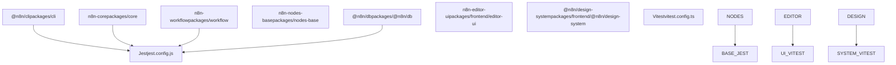
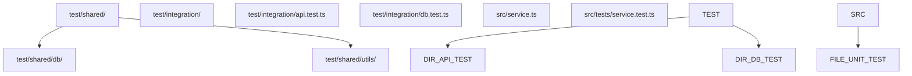
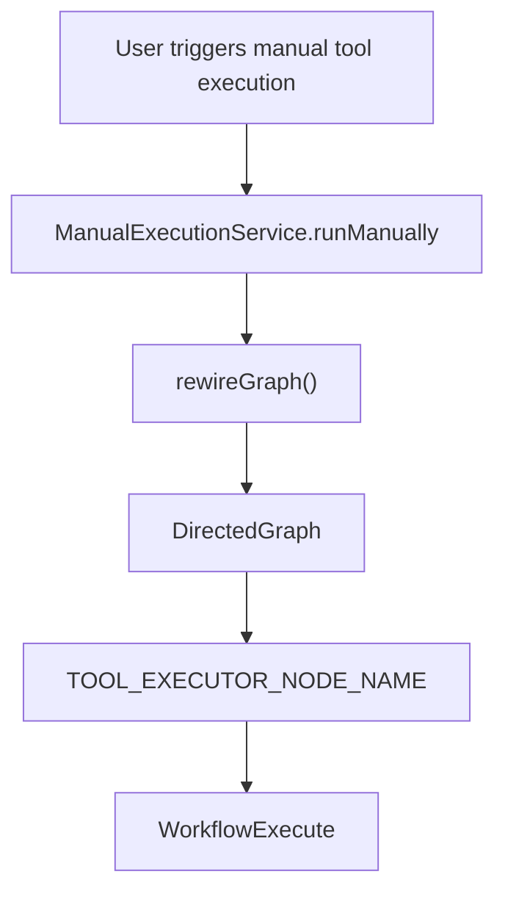
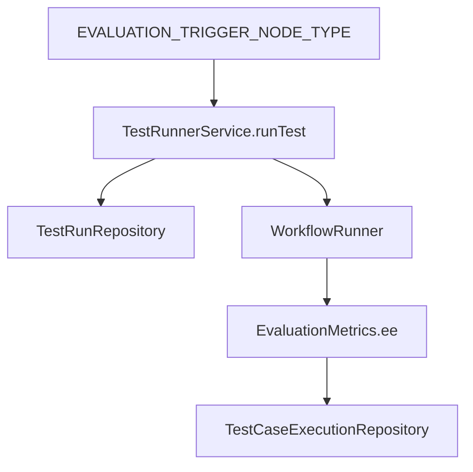

# Unit and Integration Testing

Relevant source files

-   [packages/@n8n/constants/src/execution.ts](https://github.com/n8n-io/n8n/blob/88f170b9/packages/@n8n/constants/src/execution.ts)
-   [packages/@n8n/db/src/entities/test-run.ee.ts](https://github.com/n8n-io/n8n/blob/88f170b9/packages/@n8n/db/src/entities/test-run.ee.ts)
-   [packages/@n8n/db/src/migrations/common/1771417407753-AddScalingFieldsToTestRun.ts](https://github.com/n8n-io/n8n/blob/88f170b9/packages/@n8n/db/src/migrations/common/1771417407753-AddScalingFieldsToTestRun.ts)
-   [packages/@n8n/db/src/repositories/test-case-execution.repository.ee.ts](https://github.com/n8n-io/n8n/blob/88f170b9/packages/@n8n/db/src/repositories/test-case-execution.repository.ee.ts)
-   [packages/@n8n/db/src/repositories/test-run.repository.ee.ts](https://github.com/n8n-io/n8n/blob/88f170b9/packages/@n8n/db/src/repositories/test-run.repository.ee.ts)
-   [packages/cli/src/\_\_tests\_\_/manual-execution.service.test.ts](https://github.com/n8n-io/n8n/blob/88f170b9/packages/cli/src/__tests__/manual-execution.service.test.ts)
-   [packages/cli/src/evaluation.ee/\_\_tests\_\_/test-runs.controller.ee.test.ts](https://github.com/n8n-io/n8n/blob/88f170b9/packages/cli/src/evaluation.ee/__tests__/test-runs.controller.ee.test.ts)
-   [packages/cli/src/evaluation.ee/test-runner/\_\_tests\_\_/mock-data/workflow.under-test-renamed-nodes.json](https://github.com/n8n-io/n8n/blob/88f170b9/packages/cli/src/evaluation.ee/test-runner/__tests__/mock-data/workflow.under-test-renamed-nodes.json)
-   [packages/cli/src/evaluation.ee/test-runner/\_\_tests\_\_/mock-data/workflow.under-test.json](https://github.com/n8n-io/n8n/blob/88f170b9/packages/cli/src/evaluation.ee/test-runner/__tests__/mock-data/workflow.under-test.json)
-   [packages/cli/src/evaluation.ee/test-runner/\_\_tests\_\_/test-runner.service.ee.test.ts](https://github.com/n8n-io/n8n/blob/88f170b9/packages/cli/src/evaluation.ee/test-runner/__tests__/test-runner.service.ee.test.ts)
-   [packages/cli/src/evaluation.ee/test-runner/\_\_tests\_\_/utils.ee.test.ts](https://github.com/n8n-io/n8n/blob/88f170b9/packages/cli/src/evaluation.ee/test-runner/__tests__/utils.ee.test.ts)
-   [packages/cli/src/evaluation.ee/test-runner/test-runner.service.ee.ts](https://github.com/n8n-io/n8n/blob/88f170b9/packages/cli/src/evaluation.ee/test-runner/test-runner.service.ee.ts)
-   [packages/cli/src/evaluation.ee/test-runner/utils.ee.ts](https://github.com/n8n-io/n8n/blob/88f170b9/packages/cli/src/evaluation.ee/test-runner/utils.ee.ts)
-   [packages/cli/src/evaluation.ee/test-runs.controller.ee.ts](https://github.com/n8n-io/n8n/blob/88f170b9/packages/cli/src/evaluation.ee/test-runs.controller.ee.ts)
-   [packages/cli/src/manual-execution.service.ts](https://github.com/n8n-io/n8n/blob/88f170b9/packages/cli/src/manual-execution.service.ts)
-   [packages/cli/test/integration/evaluation/test-runs.api.test.ts](https://github.com/n8n-io/n8n/blob/88f170b9/packages/cli/test/integration/evaluation/test-runs.api.test.ts)
-   [packages/core/src/execution-engine/partial-execution-utils/\_\_tests\_\_/rewire-graph.test.ts](https://github.com/n8n-io/n8n/blob/88f170b9/packages/core/src/execution-engine/partial-execution-utils/__tests__/rewire-graph.test.ts)
-   [packages/core/src/execution-engine/partial-execution-utils/index.ts](https://github.com/n8n-io/n8n/blob/88f170b9/packages/core/src/execution-engine/partial-execution-utils/index.ts)
-   [packages/core/src/execution-engine/partial-execution-utils/rewire-graph.ts](https://github.com/n8n-io/n8n/blob/88f170b9/packages/core/src/execution-engine/partial-execution-utils/rewire-graph.ts)

## Purpose and Scope

This page documents the unit and integration testing infrastructure in n8n, including test frameworks, organization patterns, mocking strategies, and execution workflows. Unit tests verify individual functions and classes in isolation, while integration tests validate interactions between components, particularly API endpoints, database operations, and complex systems like the Workflow Evaluation engine.

For end-to-end testing with Playwright, see [E2E Testing with Playwright](https://github.com/n8n-io/n8n/blob/88f170b9/E2E Testing with Playwright) For an overview of the complete testing strategy, see [Testing Strategy and Tools](https://github.com/n8n-io/n8n/blob/88f170b9/Testing Strategy and Tools)

---

## Testing Framework Architecture

n8n uses two primary testing frameworks: **Jest** for backend packages and **Vitest** for frontend packages. Both frameworks share similar APIs but are optimized for different execution contexts.

### Test Framework Selection by Package


**Test Framework Decision Flow**

| Package Type | Framework | Configuration | Reason |
| --- | --- | --- | --- |
| Backend (Node.js) | Jest | `jest.config.js` | Native Node.js module support, mature ecosystem |
| Frontend (Vue) | Vitest | `vitest.config.ts` | Vite integration, fast HMR, ESM-first |
| Integration tests | Jest | `jest.config.js` | Database access, async workflows |

---

## Test Organization and File Structure

### Directory Structure Pattern

Tests follow a consistent organization pattern across packages:


**File Naming Conventions**

-   Unit tests: `*.test.ts` (often co-located in `__tests__` folders) [packages/cli/src/evaluation.ee/test-runner/\_\_tests\_\_/test-runner.service.ee.test.ts1-22](https://github.com/n8n-io/n8n/blob/88f170b9/packages/cli/src/evaluation.ee/test-runner/__tests__/test-runner.service.ee.test.ts#L1-L22)
-   Integration tests: `test/integration/**/*.test.ts` [packages/cli/test/integration/evaluation/test-runs.api.test.ts1-13](https://github.com/n8n-io/n8n/blob/88f170b9/packages/cli/test/integration/evaluation/test-runs.api.test.ts#L1-L13)
-   Test utilities: `test/shared/**/*.ts`

**Example: CLI Package Structure**

```
packages/cli/
├── src/
│   └── evaluation.ee/
│       ├── test-runner.service.ee.ts
│       └── __tests__/
│           └── test-runner.service.ee.test.ts  # Unit test
├── test/
│   └── integration/
│       └── evaluation/
│           └── test-runs.api.test.ts           # API Integration test
```
Sources: [packages/cli/src/evaluation.ee/test-runner/\_\_tests\_\_/test-runner.service.ee.test.ts1-22](https://github.com/n8n-io/n8n/blob/88f170b9/packages/cli/src/evaluation.ee/test-runner/__tests__/test-runner.service.ee.test.ts#L1-L22) [packages/cli/test/integration/evaluation/test-runs.api.test.ts1-13](https://github.com/n8n-io/n8n/blob/88f170b9/packages/cli/test/integration/evaluation/test-runs.api.test.ts#L1-L13)

---

## Unit Testing Patterns

### Mocking and Dependency Injection

n8n utilizes the `@n8n/di` container and `jest-mock-extended` for unit test isolation. Services are typically instantiated manually in `beforeEach` hooks with mocked dependencies.

[packages/cli/src/evaluation.ee/test-runner/\_\_tests\_\_/test-runner.service.ee.test.ts35-68](https://github.com/n8n-io/n8n/blob/88f170b9/packages/cli/src/evaluation.ee/test-runner/__tests__/test-runner.service.ee.test.ts#L35-L68)

```
const workflowRunner = mock<WorkflowRunner>();const testRunRepository = mock<TestRunRepository>(); beforeEach(() => {    testRunnerService = new TestRunnerService(        logger,        telemetry,        workflowRepository,        workflowRunner,        // ... other mocked dependencies    );});
```
### Partial Execution and Graph Rewiring

A key pattern in testing complex workflow logic involves the `ManualExecutionService` and graph manipulation utilities. For example, `rewireGraph` is used to inject a `PartialExecutionToolExecutor` (defined as `TOOL_EXECUTOR_NODE_NAME`) into a workflow graph to test AI tool executions in isolation.

[packages/cli/src/manual-execution.service.ts135-160](https://github.com/n8n-io/n8n/blob/88f170b9/packages/cli/src/manual-execution.service.ts#L135-L160) [packages/core/src/execution-engine/partial-execution-utils/rewire-graph.ts7-58](https://github.com/n8n-io/n8n/blob/88f170b9/packages/core/src/execution-engine/partial-execution-utils/rewire-graph.ts#L7-L58)


Sources: [packages/cli/src/manual-execution.service.ts135-160](https://github.com/n8n-io/n8n/blob/88f170b9/packages/cli/src/manual-execution.service.ts#L135-L160) [packages/core/src/execution-engine/partial-execution-utils/rewire-graph.ts7-58](https://github.com/n8n-io/n8n/blob/88f170b9/packages/core/src/execution-engine/partial-execution-utils/rewire-graph.ts#L7-L58) [packages/core/src/execution-engine/partial-execution-utils/\_\_tests\_\_/rewire-graph.test.ts8-40](https://github.com/n8n-io/n8n/blob/88f170b9/packages/core/src/execution-engine/partial-execution-utils/__tests__/rewire-graph.test.ts#L8-L40)

---

## Integration Testing Patterns

### API Integration Tests

Integration tests for the REST API verify the full request-response cycle, including authentication, project-based permissions, and database persistence.

[packages/cli/test/integration/evaluation/test-runs.api.test.ts27-35](https://github.com/n8n-io/n8n/blob/88f170b9/packages/cli/test/integration/evaluation/test-runs.api.test.ts#L27-L35)

```
const testServer = utils.setupTestServer({    endpointGroups: ['workflows', 'evaluation'],    enabledFeatures: ['feat:sharing'],}); beforeAll(async () => {    ownerShell = await createUserShell(GLOBAL_OWNER_ROLE);    authOwnerAgent = testServer.authAgentFor(ownerShell);});
```
### Database Test Containers

Tests involving the database often use the `@n8n/backend-test-utils` to truncate tables and manage state between test cases.

[packages/cli/test/integration/evaluation/test-runs.api.test.ts37-44](https://github.com/n8n-io/n8n/blob/88f170b9/packages/cli/test/integration/evaluation/test-runs.api.test.ts#L37-L44)

```
beforeEach(async () => {    await testDb.truncate(['TestRun', 'TestCaseExecution', 'WorkflowEntity']);    workflowUnderTest = await createWorkflow({ name: 'workflow-under-test' }, ownerShell);});
```
Sources: [packages/cli/test/integration/evaluation/test-runs.api.test.ts1-44](https://github.com/n8n-io/n8n/blob/88f170b9/packages/cli/test/integration/evaluation/test-runs.api.test.ts#L1-L44) [packages/@n8n/db/src/repositories/test-run.repository.ee.ts20-34](https://github.com/n8n-io/n8n/blob/88f170b9/packages/@n8n/db/src/repositories/test-run.repository.ee.ts#L20-L34)

---

## Workflow Evaluation System

The `TestRunnerService` orchestrates automated workflow testing (Evaluations). It handles the lifecycle of a `TestRun`, which consists of multiple `TestCaseExecution` entities.

### Evaluation Data Flow


**Key Functions:**

-   `findEvaluationTriggerNode()`: Locates the dataset source in the workflow [packages/cli/src/evaluation.ee/test-runner/test-runner.service.ee.ts85-87](https://github.com/n8n-io/n8n/blob/88f170b9/packages/cli/src/evaluation.ee/test-runner/test-runner.service.ee.ts#L85-L87)
-   `validateSetMetricsNodes()`: Ensures evaluation metrics are correctly configured before running [packages/cli/src/evaluation.ee/test-runner/test-runner.service.ee.ts136-182](https://github.com/n8n-io/n8n/blob/88f170b9/packages/cli/src/evaluation.ee/test-runner/test-runner.service.ee.ts#L136-L182)
-   `runTest()`: The entry point for starting a new evaluation [packages/cli/src/evaluation.ee/test-runner/test-runner.service.ee.ts184-210](https://github.com/n8n-io/n8n/blob/88f170b9/packages/cli/src/evaluation.ee/test-runner/test-runner.service.ee.ts#L184-L210)
-   `extractTokenUsage()`: Utility to collect LLM cost data during evaluations [packages/cli/src/evaluation.ee/test-runner/utils.ee.ts35-85](https://github.com/n8n-io/n8n/blob/88f170b9/packages/cli/src/evaluation.ee/test-runner/utils.ee.ts#L35-L85)

Sources: [packages/cli/src/evaluation.ee/test-runner/test-runner.service.ee.ts62-210](https://github.com/n8n-io/n8n/blob/88f170b9/packages/cli/src/evaluation.ee/test-runner/test-runner.service.ee.ts#L62-L210) [packages/cli/src/evaluation.ee/test-runner/utils.ee.ts35-85](https://github.com/n8n-io/n8n/blob/88f170b9/packages/cli/src/evaluation.ee/test-runner/utils.ee.ts#L35-L85)

---

## Test-Definitions API

The `TestRunsController` provides REST endpoints for managing evaluations.

| Method | Endpoint | Function |
| --- | --- | --- |
| `GET` | `/workflows/:workflowId/test-runs` | List test runs for a workflow [packages/cli/src/evaluation.ee/test-runs.controller.ee.ts50-57](https://github.com/n8n-io/n8n/blob/88f170b9/packages/cli/src/evaluation.ee/test-runs.controller.ee.ts#L50-L57) |
| `POST` | `/workflows/:workflowId/test-runs/new` | Start a new evaluation run [packages/cli/src/evaluation.ee/test-runs.controller.ee.ts112-122](https://github.com/n8n-io/n8n/blob/88f170b9/packages/cli/src/evaluation.ee/test-runs.controller.ee.ts#L112-L122) |
| `POST` | `/workflows/:workflowId/test-runs/:id/cancel` | Cancel an active test run [packages/cli/src/evaluation.ee/test-runs.controller.ee.ts95-110](https://github.com/n8n-io/n8n/blob/88f170b9/packages/cli/src/evaluation.ee/test-runs.controller.ee.ts#L95-L110) |
| `GET` | `/workflows/:workflowId/test-runs/:id/test-cases` | Retrieve results for specific test cases [packages/cli/src/evaluation.ee/test-runs.controller.ee.ts72-79](https://github.com/n8n-io/n8n/blob/88f170b9/packages/cli/src/evaluation.ee/test-runs.controller.ee.ts#L72-L79) |

Sources: [packages/cli/src/evaluation.ee/test-runs.controller.ee.ts15-123](https://github.com/n8n-io/n8n/blob/88f170b9/packages/cli/src/evaluation.ee/test-runs.controller.ee.ts#L15-L123) [packages/cli/test/integration/evaluation/test-runs.api.test.ts46-137](https://github.com/n8n-io/n8n/blob/88f170b9/packages/cli/test/integration/evaluation/test-runs.api.test.ts#L46-L137)
