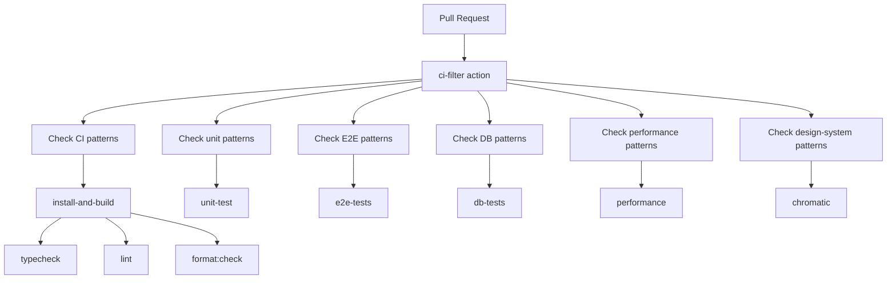
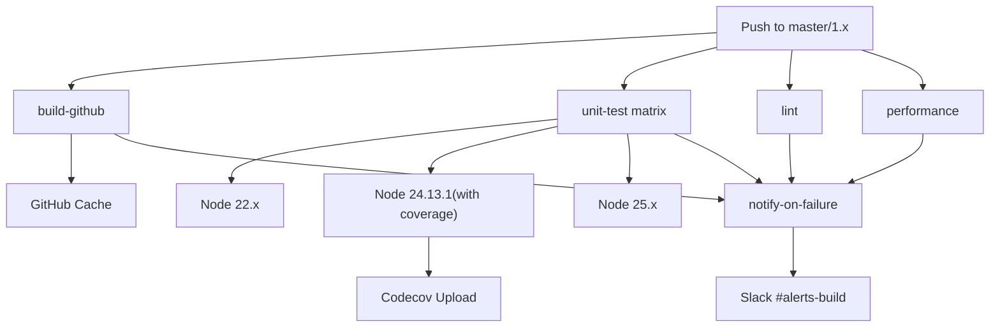
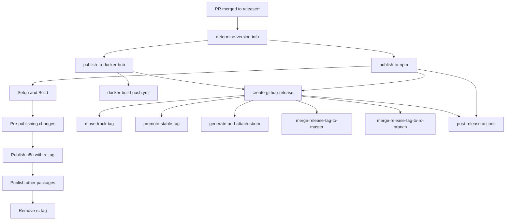
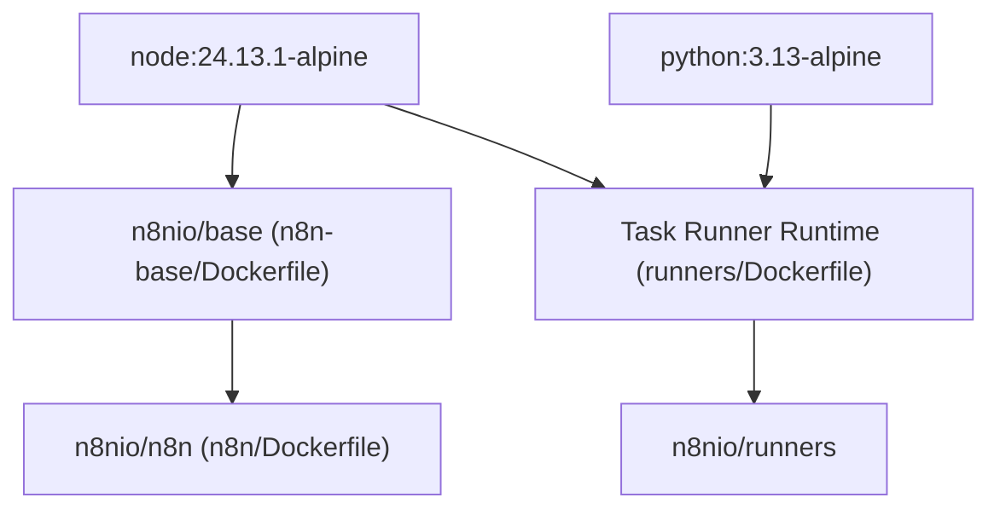

# CI/CD and Release Process

Relevant source files

-   [.dockerignore](https://github.com/n8n-io/n8n/blob/88f170b9/.dockerignore)
-   [.github/docker-compose.yml](https://github.com/n8n-io/n8n/blob/88f170b9/.github/docker-compose.yml)
-   [.github/scripts/bump-versions.mjs](https://github.com/n8n-io/n8n/blob/88f170b9/.github/scripts/bump-versions.mjs)
-   [.github/scripts/compute-backport-targets.mjs](https://github.com/n8n-io/n8n/blob/88f170b9/.github/scripts/compute-backport-targets.mjs)
-   [.github/scripts/compute-backport-targets.test.mjs](https://github.com/n8n-io/n8n/blob/88f170b9/.github/scripts/compute-backport-targets.test.mjs)
-   [.github/scripts/create-github-release.mjs](https://github.com/n8n-io/n8n/blob/88f170b9/.github/scripts/create-github-release.mjs)
-   [.github/scripts/determine-release-candidate-branch-for-track.mjs](https://github.com/n8n-io/n8n/blob/88f170b9/.github/scripts/determine-release-candidate-branch-for-track.mjs)
-   [.github/scripts/determine-release-version-changes.mjs](https://github.com/n8n-io/n8n/blob/88f170b9/.github/scripts/determine-release-version-changes.mjs)
-   [.github/scripts/determine-release-version-changes.test.mjs](https://github.com/n8n-io/n8n/blob/88f170b9/.github/scripts/determine-release-version-changes.test.mjs)
-   [.github/scripts/determine-version-info.mjs](https://github.com/n8n-io/n8n/blob/88f170b9/.github/scripts/determine-version-info.mjs)
-   [.github/scripts/determine-version-info.test.mjs](https://github.com/n8n-io/n8n/blob/88f170b9/.github/scripts/determine-version-info.test.mjs)
-   [.github/scripts/docker/docker-config.mjs](https://github.com/n8n-io/n8n/blob/88f170b9/.github/scripts/docker/docker-config.mjs)
-   [.github/scripts/docker/docker-tags.mjs](https://github.com/n8n-io/n8n/blob/88f170b9/.github/scripts/docker/docker-tags.mjs)
-   [.github/scripts/ensure-release-candidate-branches.mjs](https://github.com/n8n-io/n8n/blob/88f170b9/.github/scripts/ensure-release-candidate-branches.mjs)
-   [.github/scripts/ensure-release-candidate-branches.test.mjs](https://github.com/n8n-io/n8n/blob/88f170b9/.github/scripts/ensure-release-candidate-branches.test.mjs)
-   [.github/scripts/fixtures/mock-github-event.json](https://github.com/n8n-io/n8n/blob/88f170b9/.github/scripts/fixtures/mock-github-event.json)
-   [.github/scripts/get-release-versions.mjs](https://github.com/n8n-io/n8n/blob/88f170b9/.github/scripts/get-release-versions.mjs)
-   [.github/scripts/github-helpers.mjs](https://github.com/n8n-io/n8n/blob/88f170b9/.github/scripts/github-helpers.mjs)
-   [.github/scripts/jsconfig.json](https://github.com/n8n-io/n8n/blob/88f170b9/.github/scripts/jsconfig.json)
-   [.github/scripts/move-track-tag.mjs](https://github.com/n8n-io/n8n/blob/88f170b9/.github/scripts/move-track-tag.mjs)
-   [.github/scripts/package.json](https://github.com/n8n-io/n8n/blob/88f170b9/.github/scripts/package.json)
-   [.github/scripts/plan-release.mjs](https://github.com/n8n-io/n8n/blob/88f170b9/.github/scripts/plan-release.mjs)
-   [.github/scripts/pnpm-lock.yaml](https://github.com/n8n-io/n8n/blob/88f170b9/.github/scripts/pnpm-lock.yaml)
-   [.github/scripts/populate-cloud-databases.mjs](https://github.com/n8n-io/n8n/blob/88f170b9/.github/scripts/populate-cloud-databases.mjs)
-   [.github/scripts/promote-github-release.mjs](https://github.com/n8n-io/n8n/blob/88f170b9/.github/scripts/promote-github-release.mjs)
-   [.github/scripts/send-version-release-notification.mjs](https://github.com/n8n-io/n8n/blob/88f170b9/.github/scripts/send-version-release-notification.mjs)
-   [.github/scripts/update-changelog.mjs](https://github.com/n8n-io/n8n/blob/88f170b9/.github/scripts/update-changelog.mjs)
-   [.github/workflows/backport.yml](https://github.com/n8n-io/n8n/blob/88f170b9/.github/workflows/backport.yml)
-   [.github/workflows/ci-master.yml](https://github.com/n8n-io/n8n/blob/88f170b9/.github/workflows/ci-master.yml)
-   [.github/workflows/ci-pull-requests.yml](https://github.com/n8n-io/n8n/blob/88f170b9/.github/workflows/ci-pull-requests.yml)
-   [.github/workflows/docker-build-push.yml](https://github.com/n8n-io/n8n/blob/88f170b9/.github/workflows/docker-build-push.yml)
-   [.github/workflows/release-create-github-releases.yml](https://github.com/n8n-io/n8n/blob/88f170b9/.github/workflows/release-create-github-releases.yml)
-   [.github/workflows/release-create-patch-pr.yml](https://github.com/n8n-io/n8n/blob/88f170b9/.github/workflows/release-create-patch-pr.yml)
-   [.github/workflows/release-create-pr.yml](https://github.com/n8n-io/n8n/blob/88f170b9/.github/workflows/release-create-pr.yml)
-   [.github/workflows/release-merge-tag-to-branch.yml](https://github.com/n8n-io/n8n/blob/88f170b9/.github/workflows/release-merge-tag-to-branch.yml)
-   [.github/workflows/release-populate-cloud-with-releases.yml](https://github.com/n8n-io/n8n/blob/88f170b9/.github/workflows/release-populate-cloud-with-releases.yml)
-   [.github/workflows/release-promote-github-release.yml](https://github.com/n8n-io/n8n/blob/88f170b9/.github/workflows/release-promote-github-release.yml)
-   [.github/workflows/release-publish-post-release.yml](https://github.com/n8n-io/n8n/blob/88f170b9/.github/workflows/release-publish-post-release.yml)
-   [.github/workflows/release-publish.yml](https://github.com/n8n-io/n8n/blob/88f170b9/.github/workflows/release-publish.yml)
-   [.github/workflows/release-push-to-channel.yml](https://github.com/n8n-io/n8n/blob/88f170b9/.github/workflows/release-push-to-channel.yml)
-   [.github/workflows/release-update-pointer-tag.yml](https://github.com/n8n-io/n8n/blob/88f170b9/.github/workflows/release-update-pointer-tag.yml)
-   [.github/workflows/release-version-release-notification.yml](https://github.com/n8n-io/n8n/blob/88f170b9/.github/workflows/release-version-release-notification.yml)
-   [.github/workflows/test-workflow-scripts-reusable.yml](https://github.com/n8n-io/n8n/blob/88f170b9/.github/workflows/test-workflow-scripts-reusable.yml)
-   [.github/workflows/util-cleanup-abandoned-release-branches.yml](https://github.com/n8n-io/n8n/blob/88f170b9/.github/workflows/util-cleanup-abandoned-release-branches.yml)
-   [.github/workflows/util-determine-current-version.yml](https://github.com/n8n-io/n8n/blob/88f170b9/.github/workflows/util-determine-current-version.yml)
-   [.github/workflows/util-ensure-release-candidate-branches.yml](https://github.com/n8n-io/n8n/blob/88f170b9/.github/workflows/util-ensure-release-candidate-branches.yml)
-   [.gitignore](https://github.com/n8n-io/n8n/blob/88f170b9/.gitignore)
-   [CONTRIBUTING.md](https://github.com/n8n-io/n8n/blob/88f170b9/CONTRIBUTING.md?plain=1)
-   [docker/images/n8n-base/Dockerfile](https://github.com/n8n-io/n8n/blob/88f170b9/docker/images/n8n-base/Dockerfile)
-   [docker/images/n8n/Dockerfile](https://github.com/n8n-io/n8n/blob/88f170b9/docker/images/n8n/Dockerfile)
-   [docker/images/runners/Dockerfile](https://github.com/n8n-io/n8n/blob/88f170b9/docker/images/runners/Dockerfile)
-   [docker/images/runners/Dockerfile.distroless](https://github.com/n8n-io/n8n/blob/88f170b9/docker/images/runners/Dockerfile.distroless)
-   [docker/images/runners/README.md](https://github.com/n8n-io/n8n/blob/88f170b9/docker/images/runners/README.md?plain=1)
-   [packages/@n8n/benchmark/Dockerfile](https://github.com/n8n-io/n8n/blob/88f170b9/packages/@n8n/benchmark/Dockerfile)
-   [scripts/build-n8n.mjs](https://github.com/n8n-io/n8n/blob/88f170b9/scripts/build-n8n.mjs)

This document describes n8n's continuous integration and deployment pipeline, including pull request validation, release creation, version management, and multi-channel publishing to NPM and Docker registries. The CI/CD system orchestrates builds, tests, security scanning, and release artifacts across GitHub Actions workflows.

For information about the build system and Turbo configuration, see [Build System and Monorepo Orchestration](/n8n-io/n8n/9.1-build-system-and-monorepo-orchestration). For testing infrastructure and tools, see [Testing Infrastructure](/n8n-io/n8n/8-testing-infrastructure).

---

## Pull Request Validation Pipeline

The CI pipeline validates every pull request through a multi-stage workflow that runs tests selectively based on changed files.

### CI Filter System

The `ci-filter` action determines which test suites need to run by analyzing file changes:


**Sources:** [.github/workflows/ci-pull-requests.yml41-83](https://github.com/n8n-io/n8n/blob/88f170b9/.github/workflows/ci-pull-requests.yml#L41-L83)

### Validation Jobs

| Job | Trigger Condition | Purpose |
| --- | --- | --- |
| `install-and-build` | All PRs (except Python task runner) | Build all packages, check formatting |
| `unit-test` | Code changes excluding Playwright | Run Jest/Vitest tests with coverage |
| `typecheck` | All code changes | TypeScript compilation check |
| `lint` | All code changes | ESLint validation |
| `e2e-tests` | Playwright/container changes | Playwright E2E tests |
| `db-tests` | Database/entity/repository changes | Database integration tests |
| `performance` | Performance test or core workflow changes | Benchmark tests |
| `security-checks` | Workflow file changes | Security scanning |
| `workflow-scripts` | Script changes in `.github/scripts` | Script validation |
| `chromatic` | Design system changes | Visual regression testing |

The `required-checks` job validates that all necessary checks passed before allowing merge:

**Sources:** [.github/workflows/ci-pull-requests.yml12-212](https://github.com/n8n-io/n8n/blob/88f170b9/.github/workflows/ci-pull-requests.yml#L12-L212)

---

## Master Branch Continuous Integration

The master branch pipeline ensures ongoing code quality and maintains build cache:


The master CI runs unit tests across multiple Node.js versions (22.x, 24.13.1, 25.x) and only collects coverage on the primary version (24.13.1).

**Sources:** [.github/workflows/ci-master.yml1-67](https://github.com/n8n-io/n8n/blob/88f170b9/.github/workflows/ci-master.yml#L1-L67)

---

## Release Creation Process

Release PRs are created through a semi-automated workflow that bumps versions and generates changelogs.

### Version Bumping Workflow

> **[Mermaid sequence]**
> *(图表结构无法解析)*

**Sources:** [.github/workflows/release-create-pr.yml1-137](https://github.com/n8n-io/n8n/blob/88f170b9/.github/workflows/release-create-pr.yml#L1-L137)

### Version Calculation Logic

The `bump-versions.mjs` script implements smart version bumping by calculating the next version based on the `RELEASE_TYPE` input.

**Sources:** [.github/scripts/bump-versions.mjs10-74](https://github.com/n8n-io/n8n/blob/88f170b9/.github/scripts/bump-versions.mjs#L10-L74) [.github/workflows/release-create-pr.yml89-94](https://github.com/n8n-io/n8n/blob/88f170b9/.github/workflows/release-create-pr.yml#L89-L94)

### Changelog Generation

Changelogs are generated using `conventional-changelog` via the `update-changelog.mjs` script. It creates two files:

-   `CHANGELOG-{version}.md` - Used in PR body
-   `CHANGELOG.md` - Full changelog history

**Sources:** [.github/scripts/update-changelog.mjs1-53](https://github.com/n8n-io/n8n/blob/88f170b9/.github/scripts/update-changelog.mjs#L1-L53)

---

## Release Publishing Pipeline

When a release PR is merged to a `release/*` branch, the publishing pipeline executes.

### Publishing Workflow Overview


**Sources:** [.github/workflows/release-publish.yml1-210](https://github.com/n8n-io/n8n/blob/88f170b9/.github/workflows/release-publish.yml#L1-L210)

### NPM Publishing with Provenance

The NPM publishing job uses SLSA provenance for supply chain security:

```
publish-to-npm:  environment: npm  permissions:    id-token: write  env:    NPM_CONFIG_PROVENANCE: true    RELEASE: ${{ needs.determine-version-info.outputs.version }}
```
Pre-publishing transformations include trimming the frontend `package.json` and ensuring provenance fields. The `n8n` package is initially published with an `rc` tag before being finalized.

**Sources:** [.github/workflows/release-publish.yml39-89](https://github.com/n8n-io/n8n/blob/88f170b9/.github/workflows/release-publish.yml#L39-L89)

---

## Docker Image Pipeline

Docker images are built for both the main n8n application and the sidecar task runners.

### Docker Image Hierarchy


**Sources:** [docker/images/n8n-base/Dockerfile1-36](https://github.com/n8n-io/n8n/blob/88f170b9/docker/images/n8n-base/Dockerfile#L1-L36) [docker/images/n8n/Dockerfile1-39](https://github.com/n8n-io/n8n/blob/88f170b9/docker/images/n8n/Dockerfile#L1-L39) [docker/images/runners/Dockerfile1-163](https://github.com/n8n-io/n8n/blob/88f170b9/docker/images/runners/Dockerfile#L1-L163)

### Multi-Arch Build and Attestation

The `docker-build-push.yml` workflow manages multi-platform builds (linux/amd64, linux/arm64) and handles security attestations including SBOM and provenance.

**Sources:** [.github/workflows/docker-build-push.yml1-174](https://github.com/n8n-io/n8n/blob/88f170b9/.github/workflows/docker-build-push.yml#L1-L174)

---

## Release Track Management

n8n maintains multiple release tracks with different stability guarantees.

### Promoting Versions to Channels

Existing versions can be promoted to different channels (stable, beta) without rebuilding:

```
# release-push-to-channel.ymlinputs:  version: '1.2.3'  release-channel: 'stable' jobs:  release-to-npm:    run: |      npm dist-tag add "n8n@${{ inputs.version }}" latest      npm dist-tag add "n8n@${{ inputs.version }}" stable
```
**Sources:** [.github/workflows/release-push-to-channel.yml1-168](https://github.com/n8n-io/n8n/blob/88f170b9/.github/workflows/release-push-to-channel.yml#L1-L168)

---

## Backport Automation

Bug fixes can be automatically backported to release branches via the `backport.yml` workflow.

> **[Mermaid sequence]**
> *(图表结构无法解析)*

**Sources:** [.github/workflows/backport.yml1-84](https://github.com/n8n-io/n8n/blob/88f170b9/.github/workflows/backport.yml#L1-L84) [.github/scripts/compute-backport-targets.mjs1-49](https://github.com/n8n-io/n8n/blob/88f170b9/.github/scripts/compute-backport-targets.mjs#L1-L49)

---

## Child Pages

For detailed technical specifications, refer to the following child pages:

-   [Build System and Monorepo Orchestration](/n8n-io/n8n/9.1-build-system-and-monorepo-orchestration) — Turbo configuration, build caching, and pnpm workspace management.
-   [CI Workflows and Pull Request Validation](/n8n-io/n8n/9.2-ci-workflows-and-pull-request-validation) — Detailed PR check matrix, filter logic, and test runners.
-   [Release Pipeline and Version Management](/n8n-io/n8n/9.3-release-pipeline-and-version-management) — Automation scripts for versioning, changelogs, and track promotion.
-   [Docker Image Pipeline and Security Attestation](/n8n-io/n8n/9.4-docker-image-pipeline-and-security-attestation) — Dockerfile architecture, multi-arch builds, and SLSA security standards.
