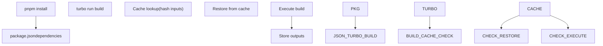
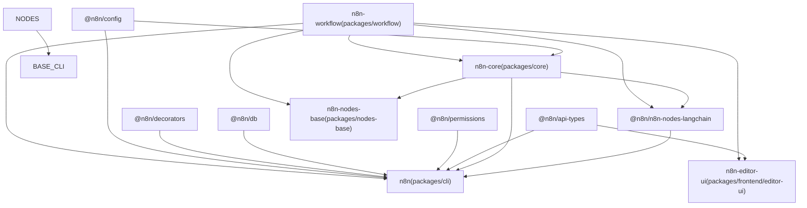
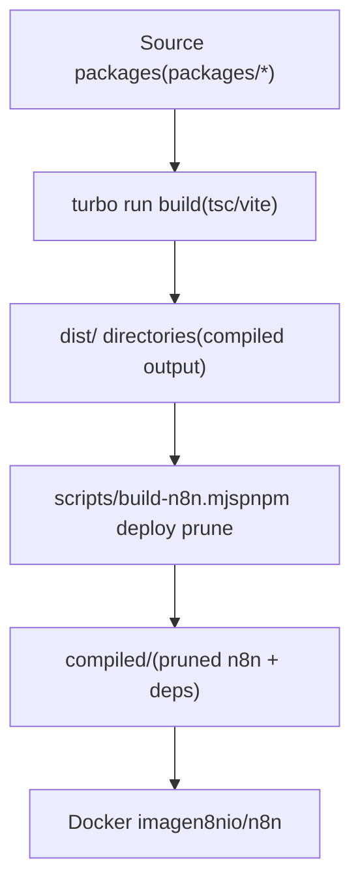
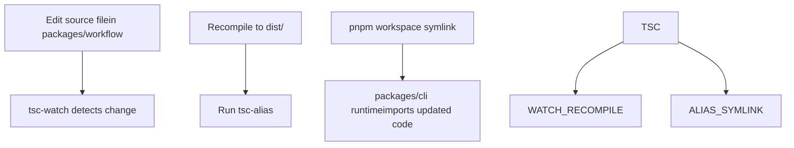

# Build System and Monorepo Orchestration

Relevant source files

-   [CHANGELOG.md](https://github.com/n8n-io/n8n/blob/88f170b9/CHANGELOG.md?plain=1)
-   [codecov.yml](https://github.com/n8n-io/n8n/blob/88f170b9/codecov.yml)
-   [jest.config.js](https://github.com/n8n-io/n8n/blob/88f170b9/jest.config.js)
-   [package.json](https://github.com/n8n-io/n8n/blob/88f170b9/package.json)
-   [packages/@n8n/api-types/package.json](https://github.com/n8n-io/n8n/blob/88f170b9/packages/@n8n/api-types/package.json)
-   [packages/@n8n/client-oauth2/tsconfig.build.json](https://github.com/n8n-io/n8n/blob/88f170b9/packages/@n8n/client-oauth2/tsconfig.build.json)
-   [packages/@n8n/config/package.json](https://github.com/n8n-io/n8n/blob/88f170b9/packages/@n8n/config/package.json)
-   [packages/@n8n/expression-runtime/tsconfig.build.cjs.json](https://github.com/n8n-io/n8n/blob/88f170b9/packages/@n8n/expression-runtime/tsconfig.build.cjs.json)
-   [packages/@n8n/expression-runtime/tsconfig.build.esm.json](https://github.com/n8n-io/n8n/blob/88f170b9/packages/@n8n/expression-runtime/tsconfig.build.esm.json)
-   [packages/@n8n/nodes-langchain/package.json](https://github.com/n8n-io/n8n/blob/88f170b9/packages/@n8n/nodes-langchain/package.json)
-   [packages/@n8n/nodes-langchain/tsconfig.build.json](https://github.com/n8n-io/n8n/blob/88f170b9/packages/@n8n/nodes-langchain/tsconfig.build.json)
-   [packages/@n8n/nodes-langchain/tsconfig.json](https://github.com/n8n-io/n8n/blob/88f170b9/packages/@n8n/nodes-langchain/tsconfig.json)
-   [packages/@n8n/task-runner/package.json](https://github.com/n8n-io/n8n/blob/88f170b9/packages/@n8n/task-runner/package.json)
-   [packages/cli/package.json](https://github.com/n8n-io/n8n/blob/88f170b9/packages/cli/package.json)
-   [packages/cli/tsconfig.build.json](https://github.com/n8n-io/n8n/blob/88f170b9/packages/cli/tsconfig.build.json)
-   [packages/cli/tsconfig.json](https://github.com/n8n-io/n8n/blob/88f170b9/packages/cli/tsconfig.json)
-   [packages/core/package.json](https://github.com/n8n-io/n8n/blob/88f170b9/packages/core/package.json)
-   [packages/core/tsconfig.build.json](https://github.com/n8n-io/n8n/blob/88f170b9/packages/core/tsconfig.build.json)
-   [packages/core/tsconfig.json](https://github.com/n8n-io/n8n/blob/88f170b9/packages/core/tsconfig.json)
-   [packages/frontend/@n8n/design-system/package.json](https://github.com/n8n-io/n8n/blob/88f170b9/packages/frontend/@n8n/design-system/package.json)
-   [packages/frontend/@n8n/stores/src/\_\_tests\_\_/metaTagConfig.test.ts](https://github.com/n8n-io/n8n/blob/88f170b9/packages/frontend/@n8n/stores/src/__tests__/metaTagConfig.test.ts)
-   [packages/frontend/@n8n/stores/src/metaTagConfig.ts](https://github.com/n8n-io/n8n/blob/88f170b9/packages/frontend/@n8n/stores/src/metaTagConfig.ts)
-   [packages/frontend/editor-ui/index.html](https://github.com/n8n-io/n8n/blob/88f170b9/packages/frontend/editor-ui/index.html)
-   [packages/frontend/editor-ui/package.json](https://github.com/n8n-io/n8n/blob/88f170b9/packages/frontend/editor-ui/package.json)
-   [packages/frontend/editor-ui/public/static/posthog.init.js](https://github.com/n8n-io/n8n/blob/88f170b9/packages/frontend/editor-ui/public/static/posthog.init.js)
-   [packages/frontend/editor-ui/public/static/prefers-color-scheme.css](https://github.com/n8n-io/n8n/blob/88f170b9/packages/frontend/editor-ui/public/static/prefers-color-scheme.css)
-   [packages/frontend/editor-ui/tsconfig.json](https://github.com/n8n-io/n8n/blob/88f170b9/packages/frontend/editor-ui/tsconfig.json)
-   [packages/frontend/editor-ui/vite.config.mts](https://github.com/n8n-io/n8n/blob/88f170b9/packages/frontend/editor-ui/vite.config.mts)
-   [packages/node-dev/package.json](https://github.com/n8n-io/n8n/blob/88f170b9/packages/node-dev/package.json)
-   [packages/node-dev/tsconfig.json](https://github.com/n8n-io/n8n/blob/88f170b9/packages/node-dev/tsconfig.json)
-   [packages/nodes-base/package.json](https://github.com/n8n-io/n8n/blob/88f170b9/packages/nodes-base/package.json)
-   [packages/nodes-base/tsconfig.json](https://github.com/n8n-io/n8n/blob/88f170b9/packages/nodes-base/tsconfig.json)
-   [packages/workflow/package.json](https://github.com/n8n-io/n8n/blob/88f170b9/packages/workflow/package.json)
-   [packages/workflow/test/expression-vm-errors.test.ts](https://github.com/n8n-io/n8n/blob/88f170b9/packages/workflow/test/expression-vm-errors.test.ts)
-   [packages/workflow/test/setup-vm-evaluator.ts](https://github.com/n8n-io/n8n/blob/88f170b9/packages/workflow/test/setup-vm-evaluator.ts)
-   [packages/workflow/tsconfig.json](https://github.com/n8n-io/n8n/blob/88f170b9/packages/workflow/tsconfig.json)
-   [pnpm-lock.yaml](https://github.com/n8n-io/n8n/blob/88f170b9/pnpm-lock.yaml)
-   [pnpm-workspace.yaml](https://github.com/n8n-io/n8n/blob/88f170b9/pnpm-workspace.yaml)
-   [tsconfig.json](https://github.com/n8n-io/n8n/blob/88f170b9/tsconfig.json)
-   [turbo.json](https://github.com/n8n-io/n8n/blob/88f170b9/turbo.json)

This page documents the tooling and scripts that compile, assemble, and package the n8n monorepo: the Turborepo pipeline, pnpm workspace configuration, per-package build strategies, dependency pinning and patching, and the production packaging logic.

---

## Workspace Layout

The monorepo is managed with **pnpm** (version `10.22.0`, enforced via `packageManager` field) and **Turborepo** (version `2.8.9`). pnpm is enforced as the sole package manager via the root `preinstall` script, which runs `scripts/block-npm-install.js` to reject `npm install` invocations. [package.json7-12](https://github.com/n8n-io/n8n/blob/88f170b9/package.json#L7-L12)

**Workspace globs** (`pnpm-workspace.yaml`):

| Glob | Contents |
| --- | --- |
| `packages/*` | Core backend packages (`cli`, `core`, `workflow`, `nodes-base`, `node-dev`) |
| `packages/@n8n/*` | Scoped internal packages (`config`, `db`, `decorators`, `task-runner`, etc.) |
| `packages/frontend/**` | Frontend packages (`editor-ui`, `design-system`, `chat`, etc.) |
| `packages/extensions/**` | Extension packages |
| `packages/testing/**` | Testing infrastructure (`playwright`, `containers`) |

Sources: [pnpm-workspace.yaml1-6](https://github.com/n8n-io/n8n/blob/88f170b9/pnpm-workspace.yaml#L1-L6) [package.json8-9](https://github.com/n8n-io/n8n/blob/88f170b9/package.json#L8-L9)

---

## Turborepo Pipeline

Turborepo orchestrates the build by resolving the topological order of packages based on `package.json` `dependencies`/`devDependencies` and runs tasks in parallel. [package.json13-51](https://github.com/n8n-io/n8n/blob/88f170b9/package.json#L13-L51)

### Build Caching and Task Dependencies

The `turbo.json` file at the repository root defines task pipelines. Each task declares `dependsOn` (e.g., `^build` ensures dependencies build first) and `outputs` (glob patterns for files to cache). [turbo.json](https://github.com/n8n-io/n8n/blob/88f170b9/turbo.json)

**Turborepo Task Coordination**


Sources: [package.json13-51](https://github.com/n8n-io/n8n/blob/88f170b9/package.json#L13-L51) [packages/cli/package.json8](https://github.com/n8n-io/n8n/blob/88f170b9/packages/cli/package.json#L8-L8)

**Build Dependency Hierarchy**


Sources: [packages/cli/package.json96-122](https://github.com/n8n-io/n8n/blob/88f170b9/packages/cli/package.json#L96-L122) [packages/core/package.json42-83](https://github.com/n8n-io/n8n/blob/88f170b9/packages/core/package.json#L42-L83) [packages/workflow/package.json53-72](https://github.com/n8n-io/n8n/blob/88f170b9/packages/workflow/package.json#L53-L72) [packages/nodes-base/package.json1-11](https://github.com/n8n-io/n8n/blob/88f170b9/packages/nodes-base/package.json#L1-L11)

---

## Per-Package Build Strategies

Each package defines its own `build` script. Turborepo calls these in dependency order.

| Build Tool | Packages | Script Pattern |
| --- | --- | --- |
| **tsc + tsc-alias** | `cli`, `core`, `task-runner` | `tsc -p tsconfig.build.json && tsc-alias -p tsconfig.build.json` |
| **tsc (Dual ESM/CJS)** | `workflow` | `tsc --build tsconfig.build.esm.json tsconfig.build.cjs.json` |
| **tsc + Node Codegen** | `nodes-base`, `nodes-langchain` | `tsc --build ... && n8n-generate-metadata && n8n-generate-node-defs` |
| **Vite** | `editor-ui`, `design-system` | `vite build` |

Sources: [packages/cli/package.json7-11](https://github.com/n8n-io/n8n/blob/88f170b9/packages/cli/package.json#L7-L11) [packages/core/package.json13-16](https://github.com/n8n-io/n8n/blob/88f170b9/packages/core/package.json#L13-L16) [packages/workflow/package.json21-26](https://github.com/n8n-io/n8n/blob/88f170b9/packages/workflow/package.json#L21-L26) [packages/nodes-base/package.json6-11](https://github.com/n8n-io/n8n/blob/88f170b9/packages/nodes-base/package.json#L6-L11) [packages/@n8n/nodes-langchain/package.json26-31](https://github.com/n8n-io/n8n/blob/88f170b9/packages/@n8n/nodes-langchain/package.json#L26-L31) [packages/frontend/editor-ui/package.json7-11](https://github.com/n8n-io/n8n/blob/88f170b9/packages/frontend/editor-ui/package.json#L7-L11) [packages/@n8n/task-runner/package.json4-10](https://github.com/n8n-io/n8n/blob/88f170b9/packages/@n8n/task-runner/package.json#L4-L10)

### Node Code-Generation Binaries

`packages/core` exposes CLI binaries used during the node package builds: [packages/core/package.json7-12](https://github.com/n8n-io/n8n/blob/88f170b9/packages/core/package.json#L7-L12)

-   `n8n-copy-static-files`: Copies non-TS assets (icons, templates) into `dist/`.
-   `n8n-generate-translations`: Generates node translation JSON files.
-   `n8n-generate-metadata`: Generates node metadata for the UI.
-   `n8n-generate-node-defs`: Generates node definition files.

---

## Dependency Management

### Catalog Pinning

`pnpm-workspace.yaml` uses catalogs to ensure all packages reference pinned versions. [pnpm-workspace.yaml8-128](https://github.com/n8n-io/n8n/blob/88f170b9/pnpm-workspace.yaml#L8-L128)

-   **`default`**: Shared backend deps like `typescript` (5.9.2), `lodash` (4.17.23), and `zod` (3.25.67).
-   **`frontend`**: Vue-specific deps like `vue` (3.5.26) and `pinia` (2.2.4).
-   **`sentry`**: Sentry SDKs (10.36.0).

### Global Version Overrides and Patches

The root `package.json` forces transitive dependency versions and applies patches. [package.json91-168](https://github.com/n8n-io/n8n/blob/88f170b9/package.json#L91-L168)

-   **Overrides**: Locks `axios` (1.13.5), `esbuild` (^0.25.0), and replaces `expr-eval` with a fork.
-   **Patches**: Local fixes in `patches/` for `bull@4.16.4`, `element-plus@2.4.3`, and `vue-tsc@2.2.8`.

---

## Production Build: `scripts/build-n8n.mjs`

The `build:n8n` script (`node scripts/build-n8n.mjs`) assembles a self-contained deployment directory for production/Docker. [package.json14](https://github.com/n8n-io/n8n/blob/88f170b9/package.json#L14-L14)

**Execution Sequence:**

1.  **Clean**: Removes previous `compiled/` and `dist/` outputs.
2.  **Build**: Runs `pnpm install` and `turbo run build`.
3.  **Prune**: Uses `pnpm deploy --filter=n8n --prod` to create a production-only dependency tree in the `compiled/` directory.
4.  **Manifest**: Generates `build-manifest.json` containing versions and build timestamps.

Sources: [scripts/build-n8n.mjs1-200](https://github.com/n8n-io/n8n/blob/88f170b9/scripts/build-n8n.mjs#L1-L200) [package.json14-19](https://github.com/n8n-io/n8n/blob/88f170b9/package.json#L14-L19)

**Production Artifact Flow**


Sources: [scripts/build-n8n.mjs1-15](https://github.com/n8n-io/n8n/blob/88f170b9/scripts/build-n8n.mjs#L1-L15) [package.json14-20](https://github.com/n8n-io/n8n/blob/88f170b9/package.json#L14-L20)

---

## Development Mode and Workspace Coordination

During development, the root `watch` script fans out to all packages via Turborepo with high concurrency. [package.json50](https://github.com/n8n-io/n8n/blob/88f170b9/package.json#L50-L50)

```
turbo run watch --concurrency=32
```
### Script/Directory Utilities

The `scripts/` directory contains utilities for workspace management:

-   `scripts/prepare.mjs`: Runs during pnpm prepare lifecycle. [package.json11](https://github.com/n8n-io/n8n/blob/88f170b9/package.json#L11-L11)
-   `scripts/block-npm-install.js`: Enforces pnpm usage. [package.json12](https://github.com/n8n-io/n8n/blob/88f170b9/package.json#L12-L12)
-   `scripts/backend-module/setup.mjs`: Scaffolds new backend modules. [package.json39](https://github.com/n8n-io/n8n/blob/88f170b9/package.json#L39-L39)
-   `scripts/os-normalize.mjs`: Normalizes paths for cross-platform binary execution. [package.json40](https://github.com/n8n-io/n8n/blob/88f170b9/package.json#L40-L40)

**Development Workflow Coordination**


Sources: [package.json21-26](https://github.com/n8n-io/n8n/blob/88f170b9/package.json#L21-L26) [packages/cli/package.json13-15](https://github.com/n8n-io/n8n/blob/88f170b9/packages/cli/package.json#L13-L15) [packages/workflow/package.json31](https://github.com/n8n-io/n8n/blob/88f170b9/packages/workflow/package.json#L31-L31) [pnpm-workspace.yaml1-6](https://github.com/n8n-io/n8n/blob/88f170b9/pnpm-workspace.yaml#L1-L6)
