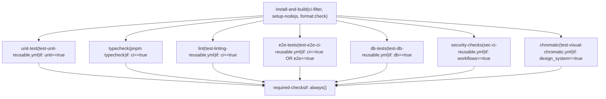
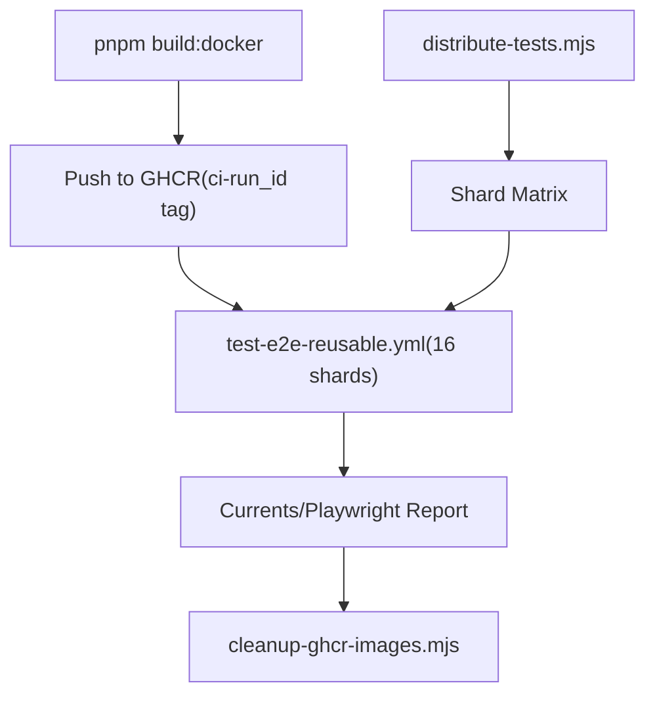

# CI Workflows and Pull Request Validation

Relevant source files

-   [.github/CI-TELEMETRY.md](https://github.com/n8n-io/n8n/blob/88f170b9/.github/CI-TELEMETRY.md?plain=1)
-   [.github/WORKFLOWS.md](https://github.com/n8n-io/n8n/blob/88f170b9/.github/WORKFLOWS.md?plain=1)
-   [.github/actions/docker-registry-login/action.yml](https://github.com/n8n-io/n8n/blob/88f170b9/.github/actions/docker-registry-login/action.yml)
-   [.github/actions/setup-nodejs/action.yml](https://github.com/n8n-io/n8n/blob/88f170b9/.github/actions/setup-nodejs/action.yml)
-   [.github/docker-compose.yml](https://github.com/n8n-io/n8n/blob/88f170b9/.github/docker-compose.yml)
-   [.github/scripts/bump-versions.mjs](https://github.com/n8n-io/n8n/blob/88f170b9/.github/scripts/bump-versions.mjs)
-   [.github/scripts/cleanup-ghcr-images.mjs](https://github.com/n8n-io/n8n/blob/88f170b9/.github/scripts/cleanup-ghcr-images.mjs)
-   [.github/scripts/compute-backport-targets.mjs](https://github.com/n8n-io/n8n/blob/88f170b9/.github/scripts/compute-backport-targets.mjs)
-   [.github/scripts/compute-backport-targets.test.mjs](https://github.com/n8n-io/n8n/blob/88f170b9/.github/scripts/compute-backport-targets.test.mjs)
-   [.github/scripts/create-github-release.mjs](https://github.com/n8n-io/n8n/blob/88f170b9/.github/scripts/create-github-release.mjs)
-   [.github/scripts/determine-release-candidate-branch-for-track.mjs](https://github.com/n8n-io/n8n/blob/88f170b9/.github/scripts/determine-release-candidate-branch-for-track.mjs)
-   [.github/scripts/determine-release-version-changes.mjs](https://github.com/n8n-io/n8n/blob/88f170b9/.github/scripts/determine-release-version-changes.mjs)
-   [.github/scripts/determine-release-version-changes.test.mjs](https://github.com/n8n-io/n8n/blob/88f170b9/.github/scripts/determine-release-version-changes.test.mjs)
-   [.github/scripts/determine-version-info.mjs](https://github.com/n8n-io/n8n/blob/88f170b9/.github/scripts/determine-version-info.mjs)
-   [.github/scripts/determine-version-info.test.mjs](https://github.com/n8n-io/n8n/blob/88f170b9/.github/scripts/determine-version-info.test.mjs)
-   [.github/scripts/ensure-release-candidate-branches.mjs](https://github.com/n8n-io/n8n/blob/88f170b9/.github/scripts/ensure-release-candidate-branches.mjs)
-   [.github/scripts/ensure-release-candidate-branches.test.mjs](https://github.com/n8n-io/n8n/blob/88f170b9/.github/scripts/ensure-release-candidate-branches.test.mjs)
-   [.github/scripts/fixtures/mock-github-event.json](https://github.com/n8n-io/n8n/blob/88f170b9/.github/scripts/fixtures/mock-github-event.json)
-   [.github/scripts/get-release-versions.mjs](https://github.com/n8n-io/n8n/blob/88f170b9/.github/scripts/get-release-versions.mjs)
-   [.github/scripts/github-helpers.mjs](https://github.com/n8n-io/n8n/blob/88f170b9/.github/scripts/github-helpers.mjs)
-   [.github/scripts/jsconfig.json](https://github.com/n8n-io/n8n/blob/88f170b9/.github/scripts/jsconfig.json)
-   [.github/scripts/move-track-tag.mjs](https://github.com/n8n-io/n8n/blob/88f170b9/.github/scripts/move-track-tag.mjs)
-   [.github/scripts/package.json](https://github.com/n8n-io/n8n/blob/88f170b9/.github/scripts/package.json)
-   [.github/scripts/plan-release.mjs](https://github.com/n8n-io/n8n/blob/88f170b9/.github/scripts/plan-release.mjs)
-   [.github/scripts/pnpm-lock.yaml](https://github.com/n8n-io/n8n/blob/88f170b9/.github/scripts/pnpm-lock.yaml)
-   [.github/scripts/populate-cloud-databases.mjs](https://github.com/n8n-io/n8n/blob/88f170b9/.github/scripts/populate-cloud-databases.mjs)
-   [.github/scripts/promote-github-release.mjs](https://github.com/n8n-io/n8n/blob/88f170b9/.github/scripts/promote-github-release.mjs)
-   [.github/scripts/retry.mjs](https://github.com/n8n-io/n8n/blob/88f170b9/.github/scripts/retry.mjs)
-   [.github/scripts/send-build-stats.mjs](https://github.com/n8n-io/n8n/blob/88f170b9/.github/scripts/send-build-stats.mjs)
-   [.github/scripts/send-docker-stats.mjs](https://github.com/n8n-io/n8n/blob/88f170b9/.github/scripts/send-docker-stats.mjs)
-   [.github/scripts/send-version-release-notification.mjs](https://github.com/n8n-io/n8n/blob/88f170b9/.github/scripts/send-version-release-notification.mjs)
-   [.github/scripts/update-changelog.mjs](https://github.com/n8n-io/n8n/blob/88f170b9/.github/scripts/update-changelog.mjs)
-   [.github/workflows/backport.yml](https://github.com/n8n-io/n8n/blob/88f170b9/.github/workflows/backport.yml)
-   [.github/workflows/build-base-image.yml](https://github.com/n8n-io/n8n/blob/88f170b9/.github/workflows/build-base-image.yml)
-   [.github/workflows/build-benchmark-image.yml](https://github.com/n8n-io/n8n/blob/88f170b9/.github/workflows/build-benchmark-image.yml)
-   [.github/workflows/ci-master.yml](https://github.com/n8n-io/n8n/blob/88f170b9/.github/workflows/ci-master.yml)
-   [.github/workflows/ci-pull-requests.yml](https://github.com/n8n-io/n8n/blob/88f170b9/.github/workflows/ci-pull-requests.yml)
-   [.github/workflows/release-create-github-releases.yml](https://github.com/n8n-io/n8n/blob/88f170b9/.github/workflows/release-create-github-releases.yml)
-   [.github/workflows/release-create-patch-pr.yml](https://github.com/n8n-io/n8n/blob/88f170b9/.github/workflows/release-create-patch-pr.yml)
-   [.github/workflows/release-create-pr.yml](https://github.com/n8n-io/n8n/blob/88f170b9/.github/workflows/release-create-pr.yml)
-   [.github/workflows/release-merge-tag-to-branch.yml](https://github.com/n8n-io/n8n/blob/88f170b9/.github/workflows/release-merge-tag-to-branch.yml)
-   [.github/workflows/release-populate-cloud-with-releases.yml](https://github.com/n8n-io/n8n/blob/88f170b9/.github/workflows/release-populate-cloud-with-releases.yml)
-   [.github/workflows/release-promote-github-release.yml](https://github.com/n8n-io/n8n/blob/88f170b9/.github/workflows/release-promote-github-release.yml)
-   [.github/workflows/release-publish-post-release.yml](https://github.com/n8n-io/n8n/blob/88f170b9/.github/workflows/release-publish-post-release.yml)
-   [.github/workflows/release-publish.yml](https://github.com/n8n-io/n8n/blob/88f170b9/.github/workflows/release-publish.yml)
-   [.github/workflows/release-push-to-channel.yml](https://github.com/n8n-io/n8n/blob/88f170b9/.github/workflows/release-push-to-channel.yml)
-   [.github/workflows/release-standalone-package.yml](https://github.com/n8n-io/n8n/blob/88f170b9/.github/workflows/release-standalone-package.yml)
-   [.github/workflows/release-update-pointer-tag.yml](https://github.com/n8n-io/n8n/blob/88f170b9/.github/workflows/release-update-pointer-tag.yml)
-   [.github/workflows/release-version-release-notification.yml](https://github.com/n8n-io/n8n/blob/88f170b9/.github/workflows/release-version-release-notification.yml)
-   [.github/workflows/sbom-generation-callable.yml](https://github.com/n8n-io/n8n/blob/88f170b9/.github/workflows/sbom-generation-callable.yml)
-   [.github/workflows/security-trivy-scan-callable.yml](https://github.com/n8n-io/n8n/blob/88f170b9/.github/workflows/security-trivy-scan-callable.yml)
-   [.github/workflows/test-benchmark-destroy-nightly.yml](https://github.com/n8n-io/n8n/blob/88f170b9/.github/workflows/test-benchmark-destroy-nightly.yml)
-   [.github/workflows/test-benchmark-nightly.yml](https://github.com/n8n-io/n8n/blob/88f170b9/.github/workflows/test-benchmark-nightly.yml)
-   [.github/workflows/test-e2e-ci-reusable.yml](https://github.com/n8n-io/n8n/blob/88f170b9/.github/workflows/test-e2e-ci-reusable.yml)
-   [.github/workflows/test-e2e-coverage-weekly.yml](https://github.com/n8n-io/n8n/blob/88f170b9/.github/workflows/test-e2e-coverage-weekly.yml)
-   [.github/workflows/test-e2e-performance-reusable.yml](https://github.com/n8n-io/n8n/blob/88f170b9/.github/workflows/test-e2e-performance-reusable.yml)
-   [.github/workflows/test-e2e-reusable.yml](https://github.com/n8n-io/n8n/blob/88f170b9/.github/workflows/test-e2e-reusable.yml)
-   [.github/workflows/test-linting-reusable.yml](https://github.com/n8n-io/n8n/blob/88f170b9/.github/workflows/test-linting-reusable.yml)
-   [.github/workflows/test-unit-reusable.yml](https://github.com/n8n-io/n8n/blob/88f170b9/.github/workflows/test-unit-reusable.yml)
-   [.github/workflows/test-workflow-scripts-reusable.yml](https://github.com/n8n-io/n8n/blob/88f170b9/.github/workflows/test-workflow-scripts-reusable.yml)
-   [.github/workflows/util-cleanup-abandoned-release-branches.yml](https://github.com/n8n-io/n8n/blob/88f170b9/.github/workflows/util-cleanup-abandoned-release-branches.yml)
-   [.github/workflows/util-cleanup-pr-images.yml](https://github.com/n8n-io/n8n/blob/88f170b9/.github/workflows/util-cleanup-pr-images.yml)
-   [.github/workflows/util-determine-current-version.yml](https://github.com/n8n-io/n8n/blob/88f170b9/.github/workflows/util-determine-current-version.yml)
-   [.github/workflows/util-ensure-release-candidate-branches.yml](https://github.com/n8n-io/n8n/blob/88f170b9/.github/workflows/util-ensure-release-candidate-branches.yml)
-   [.github/workflows/util-sync-api-docs.yml](https://github.com/n8n-io/n8n/blob/88f170b9/.github/workflows/util-sync-api-docs.yml)
-   [.gitignore](https://github.com/n8n-io/n8n/blob/88f170b9/.gitignore)
-   [CONTRIBUTING.md](https://github.com/n8n-io/n8n/blob/88f170b9/CONTRIBUTING.md?plain=1)
-   [packages/@n8n/nodes-langchain/nodes/vector\_store/VectorStoreRedis/VectorStoreRedis.node.ts](https://github.com/n8n-io/n8n/blob/88f170b9/packages/@n8n/nodes-langchain/nodes/vector_store/VectorStoreRedis/VectorStoreRedis.node.ts)
-   [packages/cli/src/\_\_tests\_\_/abstract-server.test.ts](https://github.com/n8n-io/n8n/blob/88f170b9/packages/cli/src/__tests__/abstract-server.test.ts)
-   [packages/cli/src/commands/\_\_tests\_\_/webhook.test.ts](https://github.com/n8n-io/n8n/blob/88f170b9/packages/cli/src/commands/__tests__/webhook.test.ts)
-   [packages/cli/src/commands/\_\_tests\_\_/worker.test.ts](https://github.com/n8n-io/n8n/blob/88f170b9/packages/cli/src/commands/__tests__/worker.test.ts)
-   [packages/testing/containers/network-stabilization.ts](https://github.com/n8n-io/n8n/blob/88f170b9/packages/testing/containers/network-stabilization.ts)
-   [packages/testing/containers/pull-test-images.ts](https://github.com/n8n-io/n8n/blob/88f170b9/packages/testing/containers/pull-test-images.ts)
-   [packages/testing/containers/services/n8n.ts](https://github.com/n8n-io/n8n/blob/88f170b9/packages/testing/containers/services/n8n.ts)
-   [packages/testing/janitor/src/rules/dead-code.rule.test.ts](https://github.com/n8n-io/n8n/blob/88f170b9/packages/testing/janitor/src/rules/dead-code.rule.test.ts)
-   [packages/testing/janitor/src/rules/dead-code.rule.ts](https://github.com/n8n-io/n8n/blob/88f170b9/packages/testing/janitor/src/rules/dead-code.rule.ts)
-   [packages/testing/playwright/pages/components/RunDataPanel.ts](https://github.com/n8n-io/n8n/blob/88f170b9/packages/testing/playwright/pages/components/RunDataPanel.ts)
-   [packages/testing/playwright/scripts/coverage-analysis.mjs](https://github.com/n8n-io/n8n/blob/88f170b9/packages/testing/playwright/scripts/coverage-analysis.mjs)
-   [packages/testing/playwright/scripts/distribute-tests.mjs](https://github.com/n8n-io/n8n/blob/88f170b9/packages/testing/playwright/scripts/distribute-tests.mjs)
-   [packages/testing/playwright/tests/e2e/workflows/editor/ndv/paired-item.spec.ts](https://github.com/n8n-io/n8n/blob/88f170b9/packages/testing/playwright/tests/e2e/workflows/editor/ndv/paired-item.spec.ts)
-   [scripts/scan-n8n-image.mjs](https://github.com/n8n-io/n8n/blob/88f170b9/scripts/scan-n8n-image.mjs)
-   [security/trivy-ignore-policy.rego](https://github.com/n8n-io/n8n/blob/88f170b9/security/trivy-ignore-policy.rego)
-   [security/trivy.yaml](https://github.com/n8n-io/n8n/blob/88f170b9/security/trivy.yaml)
-   [security/vex.openvex.json](https://github.com/n8n-io/n8n/blob/88f170b9/security/vex.openvex.json)

This page documents the automated CI pipelines that run on pull requests and the `master` branch: what jobs they contain, how conditional execution is determined by the `ci-filter` action, and how the `required-checks` job enforces branch protection. For the release publishing pipeline see [9.3](https://github.com/n8n-io/n8n/blob/88f170b9/9.3) and for Docker image builds see [9.4](https://github.com/n8n-io/n8n/blob/88f170b9/9.4) For an overview of the build system itself (Turborepo, `setup-nodejs` action) see [9.1](https://github.com/n8n-io/n8n/blob/88f170b9/9.1)

---

## Workflow Files at a Glance

| File | Trigger | Primary Purpose |
| --- | --- | --- |
| `.github/workflows/ci-pull-requests.yml` | `pull_request`, `merge_group` | Full CI gate for PRs |
| `.github/workflows/ci-master.yml` | push to `master`, `1.x` | Post-merge CI, multi-node matrix |
| `.github/workflows/test-unit-reusable.yml` | `workflow_call` | Reusable unit test runner |
| `.github/workflows/test-linting-reusable.yml` | `workflow_call` | Reusable lint runner |
| `.github/workflows/test-e2e-ci-reusable.yml` | `workflow_call` | Reusable E2E runner (Playwright) |
| `.github/workflows/test-db-reusable.yml` | `workflow_call` | Reusable DB/integration test runner |
| `.github/workflows/sec-ci-reusable.yml` | `workflow_call` | Reusable security checks |
| `.github/workflows/test-visual-chromatic.yml` | `workflow_call` | Reusable Chromatic visual tests |
| `.github/actions/ci-filter` | composite action | Determines which jobs run; validates results |

**Sources:** [.github/workflows/ci-pull-requests.yml1-175](https://github.com/n8n-io/n8n/blob/88f170b9/.github/workflows/ci-pull-requests.yml#L1-L175) [.github/workflows/ci-master.yml1-61](https://github.com/n8n-io/n8n/blob/88f170b9/.github/workflows/ci-master.yml#L1-L61)

---

## `ci-pull-requests.yml` — PR CI Workflow

### Overview

The PR workflow is triggered on every `pull_request` event and `merge_group` activity [.github/workflows/ci-pull-requests.yml3-5](https://github.com/n8n-io/n8n/blob/88f170b9/ .github/workflows/ci-pull-requests.yml#L3-L5) It uses a `concurrency` group based on the PR number or merge group SHA to ensure that only the latest commit is being tested, automatically cancelling redundant runs [.github/workflows/ci-pull-requests.yml7-9](https://github.com/n8n-io/n8n/blob/88f170b9/ .github/workflows/ci-pull-requests.yml#L7-L9)

### Job Graph

**PR CI Workflow Job Dependency Graph**

**Sources:** [.github/workflows/ci-pull-requests.yml11-185](https://github.com/n8n-io/n8n/blob/88f170b9/.github/workflows/ci-pull-requests.yml#L11-L185)

### `install-and-build` Job

This job serves as the entry point for the pipeline. It:

1.  **Captures the Commit SHA**: It resolves the specific HEAD SHA to ensure consistency across the matrix even if the branch moves during execution [.github/workflows/ci-pull-requests.yml37-39](https://github.com/n8n-io/n8n/blob/88f170b9/ .github/workflows/ci-pull-requests.yml#L37-L39)
2.  **Runs `ci-filter`**: A composite action that determines which parts of the monorepo have changed [.github/workflows/ci-pull-requests.yml41-83](https://github.com/n8n-io/n8n/blob/88f170b9/ .github/workflows/ci-pull-requests.yml#L41-L83)
3.  **Builds the Environment**: If the `ci` filter is triggered, it runs `setup-nodejs` and `pnpm format:check` [.github/workflows/ci-pull-requests.yml85-91](https://github.com/n8n-io/n8n/blob/88f170b9/ .github/workflows/ci-pull-requests.yml#L85-L91)

**Output Matrix Determination**

| Output | Logic Source (ci-filter) |
| --- | --- |
| `ci` | Matches all files except `.github/` and `task-runner-python/` [.github/workflows/ci-pull-requests.yml47-50](https://github.com/n8n-io/n8n/blob/88f170b9/ .github/workflows/ci-pull-requests.yml#L47-L50) |
| `unit` | Matches all files except `.github/`, `playwright/`, and `task-runner-python/` [.github/workflows/ci-pull-requests.yml51-55](https://github.com/n8n-io/n8n/blob/88f170b9/ .github/workflows/ci-pull-requests.yml#L51-L55) |
| `e2e` | Matches `playwright/`, `containers/`, and E2E workflow files [.github/workflows/ci-pull-requests.yml56-60](https://github.com/n8n-io/n8n/blob/88f170b9/ .github/workflows/ci-pull-requests.yml#L56-L60) |
| `db` | Matches `packages/cli/src/databases/`, `packages/@n8n/db/`, and DB integration tests [.github/workflows/ci-pull-requests.yml72-83](https://github.com/n8n-io/n8n/blob/88f170b9/ .github/workflows/ci-pull-requests.yml#L72-L83) |
| `design_system` | Matches `@n8n/design-system`, `@n8n/chat`, and Chromatic workflows [.github/workflows/ci-pull-requests.yml63-67](https://github.com/n8n-io/n8n/blob/88f170b9/ .github/workflows/ci-pull-requests.yml#L63-L67) |

### E2E Test Strategy (Playwright)

The E2E tests use a sophisticated sharding and impact analysis system defined in `test-e2e-ci-reusable.yml` [.github/workflows/test-e2e-ci-reusable.yml1-153](https://github.com/n8n-io/n8n/blob/88f170b9/ .github/workflows/test-e2e-ci-reusable.yml#L1-L153)

1.  **Impact Analysis**: If `playwright-only` is detected, it runs `distribute-tests.mjs` with the `--impact` flag to run only tests affected by changed files [.github/workflows/test-e2e-ci-reusable.yml59-77](https://github.com/n8n-io/n8n/blob/88f170b9/ .github/workflows/test-e2e-ci-reusable.yml#L59-L77)
2.  **Containerized Testing**: It builds a CI-specific Docker image (`pnpm build:docker`) and pushes it to GHCR for use in the test shards [.github/workflows/test-e2e-ci-reusable.yml45-57](https://github.com/n8n-io/n8n/blob/88f170b9/ .github/workflows/test-e2e-ci-reusable.yml#L45-L57)
3.  **Matrix Execution**: Tests are sharded across multiple runners (default 16 shards) [.github/workflows/test-e2e-ci-reusable.yml71-112](https://github.com/n8n-io/n8n/blob/88f170b9/ .github/workflows/test-e2e-ci-reusable.yml#L71-L112)
4.  **Community PRs**: Forks run a restricted `community-e2e` job using local SQLite and no internal secrets [.github/workflows/test-e2e-ci-reusable.yml116-128](https://github.com/n8n-io/n8n/blob/88f170b9/ .github/workflows/test-e2e-ci-reusable.yml#L116-L128)

**E2E Data Flow**

**Sources:** [.github/workflows/test-e2e-ci-reusable.yml21-153](https://github.com/n8n-io/n8n/blob/88f170b9/.github/workflows/test-e2e-ci-reusable.yml#L21-L153) [packages/testing/playwright/scripts/distribute-tests.mjs1-75](https://github.com/n8n-io/n8n/blob/88f170b9/packages/testing/playwright/scripts/distribute-tests.mjs#L1-L75)

---

## Security Scanning Workflows

The CI pipeline includes automated security validation for Docker images and monorepo dependencies.

### Trivy Image Scanning

The `security-trivy-scan-callable.yml` workflow performs deep vulnerability analysis on built Docker images [.github/workflows/security-trivy-scan-callable.yml1-163](https://github.com/n8n-io/n8n/blob/88f170b9/ .github/workflows/security-trivy-scan-callable.yml#L1-L163)

-   **VEX Integration**: Uses OpenVEX files (`security/vex.openvex.json`) to filter known false positives or non-exploitable vulnerabilities [.github/workflows/security-trivy-scan-callable.yml36](https://github.com/n8n-io/n8n/blob/88f170b9/ .github/workflows/security-trivy-scan-callable.yml#L36-L36)
-   **Severity Enforcement**: Scans for `CRITICAL,HIGH,MEDIUM,LOW` vulnerabilities [.github/workflows/security-trivy-scan-callable.yml53](https://github.com/n8n-io/n8n/blob/88f170b9/ .github/workflows/security-trivy-scan-callable.yml#L53-L53)
-   **Reporting**: Generates a GitHub Job Summary and sends alerts to the Slack `#updates-security` channel if vulnerabilities are found [.github/workflows/security-trivy-scan-callable.yml91-166](https://github.com/n8n-io/n8n/blob/88f170b9/ .github/workflows/security-trivy-scan-callable.yml#L91-L166)

### CI Security Checks

The `sec-ci-reusable.yml` workflow (triggered by the `workflows` filter) validates the integrity of the GitHub Actions themselves [.github/workflows/ci-pull-requests.yml152-160](https://github.com/n8n-io/n8n/blob/88f170b9/ .github/workflows/ci-pull-requests.yml#L152-L160)

---

## `ci-master.yml` — Master Branch CI

The master CI workflow runs on every push to the `master` or `1.x` branches [.github/workflows/ci-master.yml1-9](https://github.com/n8n-io/n8n/blob/88f170b9/ .github/workflows/ci-master.yml#L1-L9) Unlike the PR workflow, it does not use `ci-filter` and instead runs the full suite of unit tests and linting to ensure branch health.

### Node.js Version Matrix

It validates n8n against multiple Node.js versions to ensure compatibility across the supported range:

-   **Matrix**: `[22.x, 24.13.1, 25.x]` [.github/workflows/ci-master.yml31](https://github.com/n8n-io/n8n/blob/88f170b9/ .github/workflows/ci-master.yml#L31-L31)
-   **Coverage**: Code coverage is only collected on the primary version (`24.13.1`) to optimize runner usage [.github/workflows/ci-master.yml35](https://github.com/n8n-io/n8n/blob/88f170b9/ .github/workflows/ci-master.yml#L35-L35)

**Master CI Notification System** If any job in the master pipeline fails, a notification is sent to the `#alerts-build` Slack channel via the `act10ns/slack` action [.github/workflows/ci-master.yml50-63](https://github.com/n8n-io/n8n/blob/88f170b9/ .github/workflows/ci-master.yml#L50-L63)

---

## Required Checks and Merge Queue

GitHub branch protection rules are configured to require the `required-checks` job from `ci-pull-requests.yml` [.github/workflows/ci-pull-requests.yml181-185](https://github.com/n8n-io/n8n/blob/88f170b9/ .github/workflows/ci-pull-requests.yml#L181-L185)

### The `validate` Pattern

Because many jobs are conditional (skipped by `ci-filter`), GitHub's native "Required" status checks would hang waiting for skipped jobs. The `required-checks` job solves this by:

1.  Running `if: always()` [.github/workflows/ci-pull-requests.yml181](https://github.com/n8n-io/n8n/blob/88f170b9/ .github/workflows/ci-pull-requests.yml#L181-L181)
2.  Using `ci-filter` in `mode: validate` [.github/workflows/ci-pull-requests.yml45](https://github.com/n8n-io/n8n/blob/88f170b9/ .github/workflows/ci-pull-requests.yml#L45-L45)
3.  Inspecting the `needs` context [.github/workflows/ci-pull-requests.yml183-184](https://github.com/n8n-io/n8n/blob/88f170b9/ .github/workflows/ci-pull-requests.yml#L183-L184) If a job was skipped because it wasn't needed, `validate` treats it as a pass. If a job was needed but failed, `validate` fails the entire PR.

### Merge Queue Integration

The workflow supports `merge_group` events [.github/workflows/ci-pull-requests.yml5](https://github.com/n8n-io/n8n/blob/88f170b9/ .github/workflows/ci-pull-requests.yml#L5-L5) When in a merge group, it checks out the `merge_group.head_sha` instead of the PR merge ref to ensure the tests run against the temporary merge commit generated by GitHub [.github/workflows/ci-pull-requests.yml35](https://github.com/n8n-io/n8n/blob/88f170b9/ .github/workflows/ci-pull-requests.yml#L35-L35)

**Sources:** [.github/workflows/ci-pull-requests.yml1-185](https://github.com/n8n-io/n8n/blob/88f170b9/.github/workflows/ci-pull-requests.yml#L1-L185) [.github/workflows/ci-master.yml1-63](https://github.com/n8n-io/n8n/blob/88f170b9/.github/workflows/ci-master.yml#L1-L63) [.github/workflows/test-e2e-ci-reusable.yml1-153](https://github.com/n8n-io/n8n/blob/88f170b9/.github/workflows/test-e2e-ci-reusable.yml#L1-L153) [.github/workflows/security-trivy-scan-callable.yml1-163](https://github.com/n8n-io/n8n/blob/88f170b9/.github/workflows/security-trivy-scan-callable.yml#L1-L163)
