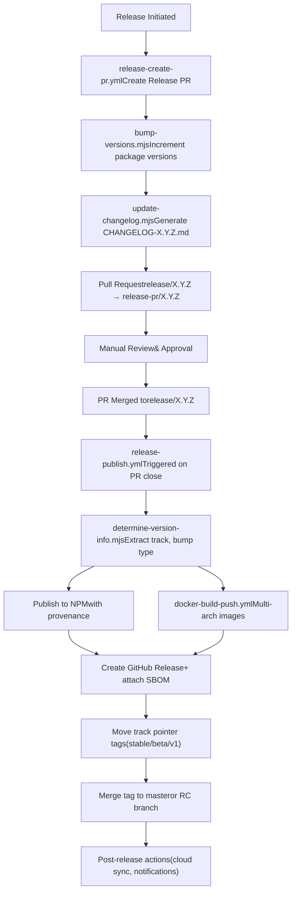
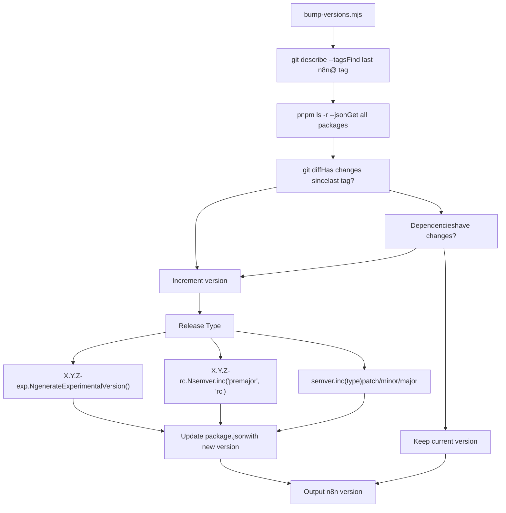
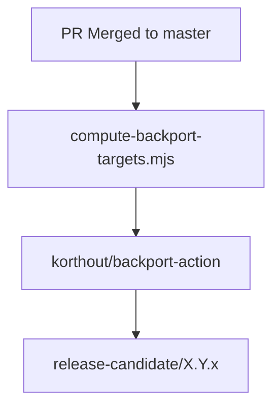

# Release Pipeline and Version Management

Relevant source files

-   [.github/docker-compose.yml](https://github.com/n8n-io/n8n/blob/88f170b9/.github/docker-compose.yml)
-   [.github/scripts/bump-versions.mjs](https://github.com/n8n-io/n8n/blob/88f170b9/.github/scripts/bump-versions.mjs)
-   [.github/scripts/compute-backport-targets.mjs](https://github.com/n8n-io/n8n/blob/88f170b9/.github/scripts/compute-backport-targets.mjs)
-   [.github/scripts/compute-backport-targets.test.mjs](https://github.com/n8n-io/n8n/blob/88f170b9/.github/scripts/compute-backport-targets.test.mjs)
-   [.github/scripts/create-github-release.mjs](https://github.com/n8n-io/n8n/blob/88f170b9/.github/scripts/create-github-release.mjs)
-   [.github/scripts/determine-release-candidate-branch-for-track.mjs](https://github.com/n8n-io/n8n/blob/88f170b9/.github/scripts/determine-release-candidate-branch-for-track.mjs)
-   [.github/scripts/determine-release-version-changes.mjs](https://github.com/n8n-io/n8n/blob/88f170b9/.github/scripts/determine-release-version-changes.mjs)
-   [.github/scripts/determine-release-version-changes.test.mjs](https://github.com/n8n-io/n8n/blob/88f170b9/.github/scripts/determine-release-version-changes.test.mjs)
-   [.github/scripts/determine-version-info.mjs](https://github.com/n8n-io/n8n/blob/88f170b9/.github/scripts/determine-version-info.mjs)
-   [.github/scripts/determine-version-info.test.mjs](https://github.com/n8n-io/n8n/blob/88f170b9/.github/scripts/determine-version-info.test.mjs)
-   [.github/scripts/ensure-release-candidate-branches.mjs](https://github.com/n8n-io/n8n/blob/88f170b9/.github/scripts/ensure-release-candidate-branches.mjs)
-   [.github/scripts/ensure-release-candidate-branches.test.mjs](https://github.com/n8n-io/n8n/blob/88f170b9/.github/scripts/ensure-release-candidate-branches.test.mjs)
-   [.github/scripts/fixtures/mock-github-event.json](https://github.com/n8n-io/n8n/blob/88f170b9/.github/scripts/fixtures/mock-github-event.json)
-   [.github/scripts/get-release-versions.mjs](https://github.com/n8n-io/n8n/blob/88f170b9/.github/scripts/get-release-versions.mjs)
-   [.github/scripts/github-helpers.mjs](https://github.com/n8n-io/n8n/blob/88f170b9/.github/scripts/github-helpers.mjs)
-   [.github/scripts/jsconfig.json](https://github.com/n8n-io/n8n/blob/88f170b9/.github/scripts/jsconfig.json)
-   [.github/scripts/move-track-tag.mjs](https://github.com/n8n-io/n8n/blob/88f170b9/.github/scripts/move-track-tag.mjs)
-   [.github/scripts/package.json](https://github.com/n8n-io/n8n/blob/88f170b9/.github/scripts/package.json)
-   [.github/scripts/plan-release.mjs](https://github.com/n8n-io/n8n/blob/88f170b9/.github/scripts/plan-release.mjs)
-   [.github/scripts/pnpm-lock.yaml](https://github.com/n8n-io/n8n/blob/88f170b9/.github/scripts/pnpm-lock.yaml)
-   [.github/scripts/populate-cloud-databases.mjs](https://github.com/n8n-io/n8n/blob/88f170b9/.github/scripts/populate-cloud-databases.mjs)
-   [.github/scripts/promote-github-release.mjs](https://github.com/n8n-io/n8n/blob/88f170b9/.github/scripts/promote-github-release.mjs)
-   [.github/scripts/send-version-release-notification.mjs](https://github.com/n8n-io/n8n/blob/88f170b9/.github/scripts/send-version-release-notification.mjs)
-   [.github/scripts/update-changelog.mjs](https://github.com/n8n-io/n8n/blob/88f170b9/.github/scripts/update-changelog.mjs)
-   [.github/workflows/backport.yml](https://github.com/n8n-io/n8n/blob/88f170b9/.github/workflows/backport.yml)
-   [.github/workflows/ci-master.yml](https://github.com/n8n-io/n8n/blob/88f170b9/.github/workflows/ci-master.yml)
-   [.github/workflows/ci-pull-requests.yml](https://github.com/n8n-io/n8n/blob/88f170b9/.github/workflows/ci-pull-requests.yml)
-   [.github/workflows/release-create-github-releases.yml](https://github.com/n8n-io/n8n/blob/88f170b9/.github/workflows/release-create-github-releases.yml)
-   [.github/workflows/release-create-patch-pr.yml](https://github.com/n8n-io/n8n/blob/88f170b9/.github/workflows/release-create-patch-pr.yml)
-   [.github/workflows/release-create-pr.yml](https://github.com/n8n-io/n8n/blob/88f170b9/.github/workflows/release-create-pr.yml)
-   [.github/workflows/release-merge-tag-to-branch.yml](https://github.com/n8n-io/n8n/blob/88f170b9/.github/workflows/release-merge-tag-to-branch.yml)
-   [.github/workflows/release-populate-cloud-with-releases.yml](https://github.com/n8n-io/n8n/blob/88f170b9/.github/workflows/release-populate-cloud-with-releases.yml)
-   [.github/workflows/release-promote-github-release.yml](https://github.com/n8n-io/n8n/blob/88f170b9/.github/workflows/release-promote-github-release.yml)
-   [.github/workflows/release-publish-post-release.yml](https://github.com/n8n-io/n8n/blob/88f170b9/.github/workflows/release-publish-post-release.yml)
-   [.github/workflows/release-publish.yml](https://github.com/n8n-io/n8n/blob/88f170b9/.github/workflows/release-publish.yml)
-   [.github/workflows/release-push-to-channel.yml](https://github.com/n8n-io/n8n/blob/88f170b9/.github/workflows/release-push-to-channel.yml)
-   [.github/workflows/release-update-pointer-tag.yml](https://github.com/n8n-io/n8n/blob/88f170b9/.github/workflows/release-update-pointer-tag.yml)
-   [.github/workflows/release-version-release-notification.yml](https://github.com/n8n-io/n8n/blob/88f170b9/.github/workflows/release-version-release-notification.yml)
-   [.github/workflows/test-workflow-scripts-reusable.yml](https://github.com/n8n-io/n8n/blob/88f170b9/.github/workflows/test-workflow-scripts-reusable.yml)
-   [.github/workflows/util-cleanup-abandoned-release-branches.yml](https://github.com/n8n-io/n8n/blob/88f170b9/.github/workflows/util-cleanup-abandoned-release-branches.yml)
-   [.github/workflows/util-determine-current-version.yml](https://github.com/n8n-io/n8n/blob/88f170b9/.github/workflows/util-determine-current-version.yml)
-   [.github/workflows/util-ensure-release-candidate-branches.yml](https://github.com/n8n-io/n8n/blob/88f170b9/.github/workflows/util-ensure-release-candidate-branches.yml)
-   [.gitignore](https://github.com/n8n-io/n8n/blob/88f170b9/.gitignore)
-   [CONTRIBUTING.md](https://github.com/n8n-io/n8n/blob/88f170b9/CONTRIBUTING.md?plain=1)

This document describes the automated release pipeline for n8n, including version management strategies, release workflows, and multi-track publishing. The pipeline orchestrates version bumping, changelog generation, NPM publishing, Docker image creation, and GitHub releases through a series of GitHub Actions workflows.

For information about Docker image building and security attestation, see [Docker Image Pipeline and Security Attestation](/n8n-io/n8n/9.4-docker-image-pipeline-and-security-attestation). For build system orchestration details, see [Build System and Monorepo Orchestration](/n8n-io/n8n/9.1-build-system-and-monorepo-orchestration).

---

## Release Tracks and Versioning Strategy

n8n supports multiple release tracks to manage different stability levels and versioning strategies:

| Track | NPM Tags | Docker Tags | Version Pattern | Use Case |
| --- | --- | --- | --- | --- |
| **stable** | `latest`, `stable` | `latest`, `stable` | `X.Y.Z` | Production releases |
| **beta** | `next`, `beta` | `next`, `beta` | `X.Y.Z-beta.N` | Pre-release testing |
| **rc** | `rc` (temporary) | N/A | `X.Y.Z-rc.N` | Release candidates |
| **experimental** | N/A | N/A | `X.Y.Z-exp.N` | Feature experiments |
| **v1** | N/A | N/A | `1.X.Y` | Legacy v1.x maintenance |

### Semantic Version Components

The version bumping system supports all standard SemVer release types:

-   **patch**: Bug fixes and minor updates (`1.2.3` → `1.2.4`)
-   **minor**: New features, backward compatible (`1.2.3` → `1.3.0`)
-   **major**: Breaking changes (`1.2.3` → `2.0.0`)
-   **premajor**: Pre-release for next major (`1.2.3` → `2.0.0-rc.0` → `2.0.0-rc.1`)
-   **experimental**: Experimental features (`1.2.3` → `1.2.3-exp.0` → `1.2.3-exp.1`)

Sources: [.github/workflows/release-publish.yml11-22](https://github.com/n8n-io/n8n/blob/88f170b9/.github/workflows/release-publish.yml#L11-L22) [.github/workflows/release-create-pr.yml23-33](https://github.com/n8n-io/n8n/blob/88f170b9/.github/workflows/release-create-pr.yml#L23-L33) [.github/scripts/bump-versions.mjs10-23](https://github.com/n8n-io/n8n/blob/88f170b9/.github/scripts/bump-versions.mjs#L10-L23) [.github/scripts/github-helpers.mjs10-15](https://github.com/n8n-io/n8n/blob/88f170b9/.github/scripts/github-helpers.mjs#L10-L15)

---

## Release Pipeline Overview


**Release Pipeline Execution Flow**

The pipeline follows a pull-request-based release process where version bumping and changelog generation occur upfront, followed by automated publishing upon PR merge.

Sources: [.github/workflows/release-create-pr.yml39-128](https://github.com/n8n-io/n8n/blob/88f170b9/.github/workflows/release-create-pr.yml#L39-L128) [.github/workflows/release-publish.yml10-184](https://github.com/n8n-io/n8n/blob/88f170b9/.github/workflows/release-publish.yml#L10-L184)

---

## Version Bumping Logic

### Dependency-Based Versioning

The `bump-versions.mjs` script implements intelligent version bumping that only increments versions for packages with actual changes or changed internal dependencies:


**Version Bumping Decision Tree**

The script determines whether to bump each package version based on Git history and dependency relationships. It propagates "dirtiness" transitively: if `design-system` changes, `editor-ui` and `cli` are also bumped.

Sources: [.github/scripts/bump-versions.mjs25-74](https://github.com/n8n-io/n8n/blob/88f170b9/.github/scripts/bump-versions.mjs#L25-L74)

### Experimental Version Generation

Experimental versions use a special `-exp.N` suffix that increments the experimental counter:

```
// Input: 1.2.3 → Output: 1.2.3-exp.0// Input: 1.2.3-exp.0 → Output: 1.2.3-exp.1
```
The `generateExperimentalVersion()` function at [.github/scripts/bump-versions.mjs10-23](https://github.com/n8n-io/n8n/blob/88f170b9/.github/scripts/bump-versions.mjs#L10-L23) parses the current version and either creates a new experimental version or increments the existing experimental counter.

### Premajor/RC Version Handling

For release candidates, the script uses semver's `premajor` increment with the `rc` identifier:

```
// Input: 1.9.5 → Output: 2.0.0-rc.0// Input: 2.0.0-rc.0 → Output: 2.0.0-rc.1 (if already in RC)
```
This logic is implemented at [.github/scripts/bump-versions.mjs92-99](https://github.com/n8n-io/n8n/blob/88f170b9/.github/scripts/bump-versions.mjs#L92-L99) where it checks if the version already contains `-rc.` and uses `prerelease` increment instead of `premajor` for subsequent RC versions.

Sources: [.github/scripts/bump-versions.mjs10-109](https://github.com/n8n-io/n8n/blob/88f170b9/.github/scripts/bump-versions.mjs#L10-L109)

---

## Changelog Generation

### Conventional Changelog System

Changelogs are generated using the `conventional-changelog` library configured with the Angular preset. The `update-changelog.mjs` script handles both the version-specific changelog (for PR descriptions) and the main `CHANGELOG.md` file.

Sources: [.github/scripts/update-changelog.mjs1-53](https://github.com/n8n-io/n8n/blob/88f170b9/.github/scripts/update-changelog.mjs#L1-L53)

### Commit Filtering Rules

The changelog generation excludes certain commits to keep the release notes clean:

1.  **No-changelog marker**: Commits with `(no-changelog)` in the header are ignored.
2.  **Benchmark scope**: Commits with `scope: benchmark` are filtered out.
3.  **Backport stripping**: The script strips `(backport to ...)` strings from subjects to keep the focus on the original fix.

This filtering logic is implemented in the `transformCommit` function at [.github/scripts/update-changelog.mjs28-51](https://github.com/n8n-io/n8n/blob/88f170b9/.github/scripts/update-changelog.mjs#L28-L51):

```
transformCommit(commit) {    const hasNoChangelogInHeader = commit.header?.includes('(no-changelog)');    const isBenchmarkScope = commit.scope === 'benchmark';     if (hasNoChangelogInHeader || isBenchmarkScope) return null;     if (commit.subject) {        let newCommit = {            ...commit,            subject: commit.subject.replace(/\s*\(backport to [^)]+\)/g, ''),        };        return newCommit;    }    return commit;}
```
Sources: [.github/scripts/update-changelog.mjs28-51](https://github.com/n8n-io/n8n/blob/88f170b9/.github/scripts/update-changelog.mjs#L28-L51)

---

## Release Creation Workflow

### Triggering a Release

Releases are initiated through workflow dispatch in `release-create-pr.yml`. This workflow:

1.  Generates a GitHub App Token using `N8N_ASSISTANT_APP_ID` [.github/workflows/release-create-pr.yml58-64](https://github.com/n8n-io/n8n/blob/88f170b9/.github/workflows/release-create-pr.yml#L58-L64)
2.  Switches to the base branch and bumps versions using `bump-versions.mjs` [.github/workflows/release-create-pr.yml89-93](https://github.com/n8n-io/n8n/blob/88f170b9/.github/workflows/release-create-pr.yml#L89-L93)
3.  Updates the changelog and creates a new branch `release/${NEXT_RELEASE}` [.github/workflows/release-create-pr.yml95-102](https://github.com/n8n-io/n8n/blob/88f170b9/.github/workflows/release-create-pr.yml#L95-L102)
4.  Creates a Pull Request with the generated changelog as the body [.github/workflows/release-create-pr.yml121-132](https://github.com/n8n-io/n8n/blob/88f170b9/.github/workflows/release-create-pr.yml#L121-L132)

### Backport Automation

The `backport.yml` workflow automates the process of bringing fixes from `master` into release candidate branches.


The `compute-backport-targets.mjs` script identifies the correct `release-candidate/` branches based on PR labels (e.g., `backport to stable`). The backport PR includes a checklist for the author to review changes and fix conflicts [.github/workflows/backport.yml51-84](https://github.com/n8n-io/n8n/blob/88f170b9/.github/workflows/backport.yml#L51-L84)

Sources: [.github/workflows/backport.yml1-84](https://github.com/n8n-io/n8n/blob/88f170b9/.github/workflows/backport.yml#L1-L84) [.github/scripts/compute-backport-targets.mjs49](https://github.com/n8n-io/n8n/blob/88f170b9/.github/scripts/compute-backport-targets.mjs#L49-L49)

---

## Publishing Pipeline

### NPM Publication

The NPM publishing job implements several security and quality measures at [.github/workflows/release-publish.yml39-88](https://github.com/n8n-io/n8n/blob/88f170b9/.github/workflows/release-publish.yml#L39-L88):

1.  **Dry Run Validation**: Validates publishability using `pnpm publish --dry-run` [.github/workflows/release-publish.yml64-67](https://github.com/n8n-io/n8n/blob/88f170b9/.github/workflows/release-publish.yml#L64-L67)
2.  **Pre-publishing Modifications**:
    -   `trim-fe-packageJson.js`: Removes development-only fields from frontend packages [.github/workflows/release-publish.yml71](https://github.com/n8n-io/n8n/blob/88f170b9/.github/workflows/release-publish.yml#L71-L71)
    -   `ensure-provenance-fields.mjs`: Adds repository and directory metadata for NPM provenance [.github/workflows/release-publish.yml72](https://github.com/n8n-io/n8n/blob/88f170b9/.github/workflows/release-publish.yml#L72-L72)
    -   `schema.js` update: Injects the release type into the CLI configuration schema [.github/workflows/release-publish.yml74](https://github.com/n8n-io/n8n/blob/88f170b9/.github/workflows/release-publish.yml#L74-L74)
3.  **NPM Provenance**: Enabled via `NPM_CONFIG_PROVENANCE: true` [.github/workflows/release-publish.yml49](https://github.com/n8n-io/n8n/blob/88f170b9/.github/workflows/release-publish.yml#L49-L49)

### Docker and GitHub Release

Publishing proceeds in parallel once the PR is merged:

-   **Docker**: Uses `docker-build-push.yml` to build multi-arch images [.github/workflows/release-publish.yml90-97](https://github.com/n8n-io/n8n/blob/88f170b9/.github/workflows/release-publish.yml#L90-L97)
-   **GitHub Release**: Uses `release-create-github-releases.yml` to create the release entry [.github/workflows/release-publish.yml99-109](https://github.com/n8n-io/n8n/blob/88f170b9/.github/workflows/release-publish.yml#L99-L109)
-   **SBOM**: Generates and attaches a Software Bill of Materials via `sbom-generation-callable.yml` [.github/workflows/release-publish.yml133-140](https://github.com/n8n-io/n8n/blob/88f170b9/.github/workflows/release-publish.yml#L133-L140)

Sources: [.github/workflows/release-publish.yml39-140](https://github.com/n8n-io/n8n/blob/88f170b9/.github/workflows/release-publish.yml#L39-L140)

---

## Tag Management and Promotion

### Pointer Tag System

Release tracks use pointer tags that are updated to reference the latest version in each track. The `github-helpers.mjs` utility provides functions to resolve these pointers.

| Function | Description | Code |
| --- | --- | --- |
| `pickHighestReleaseTag` | Sorts tags like `n8n@2.7.0` to find the latest. | [.github/scripts/github-helpers.mjs47-55](https://github.com/n8n-io/n8n/blob/88f170b9/.github/scripts/github-helpers.mjs#L47-L55) |
| `resolveReleaseTagForTrack` | Resolves a track (e.g., `stable`) to a specific version tag. | [.github/scripts/github-helpers.mjs89-101](https://github.com/n8n-io/n8n/blob/88f170b9/.github/scripts/github-helpers.mjs#L89-L101) |
| `resolveRcBranchForTrack` | Maps a track to its `release-candidate/` branch. | [.github/scripts/github-helpers.mjs112-129](https://github.com/n8n-io/n8n/blob/88f170b9/.github/scripts/github-helpers.mjs#L112-L129) |

### Channel Promotion Workflow

The `release-push-to-channel.yml` workflow allows promoting an existing version to `stable` or `beta`. It explicitly blocks promoting RC versions to these channels [.github/workflows/release-push-to-channel.yml56-66](https://github.com/n8n-io/n8n/blob/88f170b9/.github/workflows/release-push-to-channel.yml#L56-L66)

Promotion involves:

1.  **NPM Tags**: Adding `latest`/`stable` or `next`/`beta` tags using `npm dist-tag add` [.github/workflows/release-push-to-channel.yml83-93](https://github.com/n8n-io/n8n/blob/88f170b9/.github/workflows/release-push-to-channel.yml#L83-L93)
2.  **Docker Tags**: Creating new manifest tags pointing to the existing version image [.github/workflows/release-push-to-channel.yml113-127](https://github.com/n8n-io/n8n/blob/88f170b9/.github/workflows/release-push-to-channel.yml#L113-L127)

Sources: [.github/workflows/release-push-to-channel.yml1-160](https://github.com/n8n-io/n8n/blob/88f170b9/.github/workflows/release-push-to-channel.yml#L1-L160) [.github/scripts/github-helpers.mjs1-150](https://github.com/n8n-io/n8n/blob/88f170b9/.github/scripts/github-helpers.mjs#L1-L150)

---

## Release Candidate Branch Management

The n8n repository uses a specific naming convention for release candidate branches to support patch releases for different major/minor versions.

-   **v2+**: `release-candidate/X.Y.x` (e.g., `release-candidate/2.8.x`)
-   **v1**: `1.x`

The `tagVersionInfoToReleaseCandidateBranchName` function in `github-helpers.mjs` handles this mapping logic [.github/scripts/github-helpers.mjs140-148](https://github.com/n8n-io/n8n/blob/88f170b9/.github/scripts/github-helpers.mjs#L140-L148)

After a patch release is published, the release tag is merged back into the corresponding RC branch to ensure continuity [.github/workflows/release-publish.yml155-166](https://github.com/n8n-io/n8n/blob/88f170b9/.github/workflows/release-publish.yml#L155-L166)

Sources: [.github/scripts/github-helpers.mjs140-148](https://github.com/n8n-io/n8n/blob/88f170b9/.github/scripts/github-helpers.mjs#L140-L148) [.github/workflows/release-publish.yml155-166](https://github.com/n8n-io/n8n/blob/88f170b9/.github/workflows/release-publish.yml#L155-L166)
