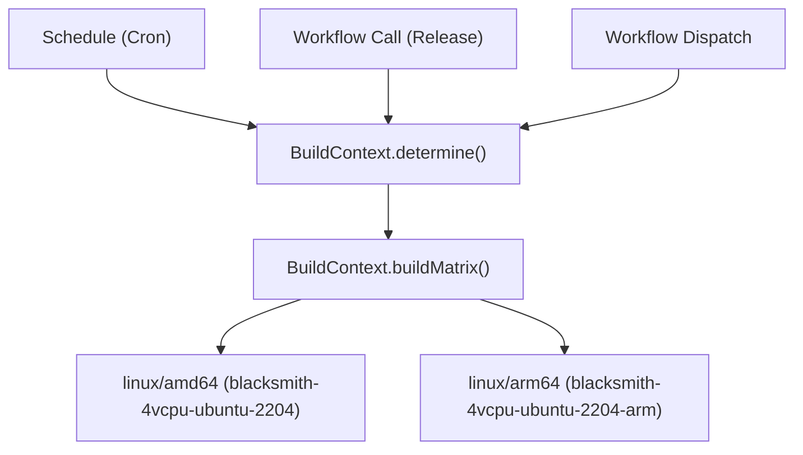
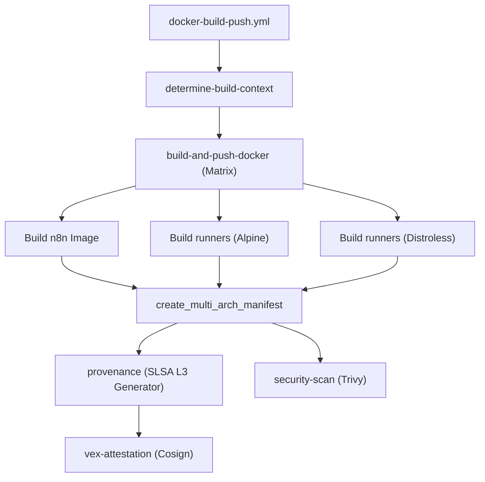
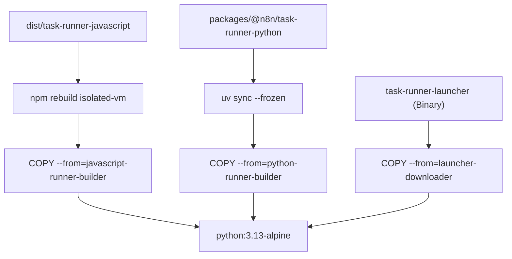

# Docker Image Pipeline and Security Attestation

Relevant source files

-   [.dockerignore](https://github.com/n8n-io/n8n/blob/88f170b9/.dockerignore)
-   [.github/docker-compose.yml](https://github.com/n8n-io/n8n/blob/88f170b9/.github/docker-compose.yml)
-   [.github/scripts/bump-versions.mjs](https://github.com/n8n-io/n8n/blob/88f170b9/.github/scripts/bump-versions.mjs)
-   [.github/scripts/compute-backport-targets.mjs](https://github.com/n8n-io/n8n/blob/88f170b9/.github/scripts/compute-backport-targets.mjs)
-   [.github/scripts/compute-backport-targets.test.mjs](https://github.com/n8n-io/n8n/blob/88f170b9/.github/scripts/compute-backport-targets.test.mjs)
-   [.github/scripts/create-github-release.mjs](https://github.com/n8n-io/n8n/blob/88f170b9/.github/scripts/create-github-release.mjs)
-   [.github/scripts/determine-release-candidate-branch-for-track.mjs](https://github.com/n8n-io/n8n/blob/88f170b9/.github/scripts/determine-release-candidate-branch-for-track.mjs)
-   [.github/scripts/determine-release-version-changes.mjs](https://github.com/n8n-io/n8n/blob/88f170b9/.github/scripts/determine-release-version-changes.mjs)
-   [.github/scripts/determine-release-version-changes.test.mjs](https://github.com/n8n-io/n8n/blob/88f170b9/.github/scripts/determine-release-version-changes.test.mjs)
-   [.github/scripts/determine-version-info.mjs](https://github.com/n8n-io/n8n/blob/88f170b9/.github/scripts/determine-version-info.mjs)
-   [.github/scripts/determine-version-info.test.mjs](https://github.com/n8n-io/n8n/blob/88f170b9/.github/scripts/determine-version-info.test.mjs)
-   [.github/scripts/docker/docker-config.mjs](https://github.com/n8n-io/n8n/blob/88f170b9/.github/scripts/docker/docker-config.mjs)
-   [.github/scripts/docker/docker-tags.mjs](https://github.com/n8n-io/n8n/blob/88f170b9/.github/scripts/docker/docker-tags.mjs)
-   [.github/scripts/ensure-release-candidate-branches.mjs](https://github.com/n8n-io/n8n/blob/88f170b9/.github/scripts/ensure-release-candidate-branches.mjs)
-   [.github/scripts/ensure-release-candidate-branches.test.mjs](https://github.com/n8n-io/n8n/blob/88f170b9/.github/scripts/ensure-release-candidate-branches.test.mjs)
-   [.github/scripts/fixtures/mock-github-event.json](https://github.com/n8n-io/n8n/blob/88f170b9/.github/scripts/fixtures/mock-github-event.json)
-   [.github/scripts/get-release-versions.mjs](https://github.com/n8n-io/n8n/blob/88f170b9/.github/scripts/get-release-versions.mjs)
-   [.github/scripts/github-helpers.mjs](https://github.com/n8n-io/n8n/blob/88f170b9/.github/scripts/github-helpers.mjs)
-   [.github/scripts/jsconfig.json](https://github.com/n8n-io/n8n/blob/88f170b9/.github/scripts/jsconfig.json)
-   [.github/scripts/move-track-tag.mjs](https://github.com/n8n-io/n8n/blob/88f170b9/.github/scripts/move-track-tag.mjs)
-   [.github/scripts/package.json](https://github.com/n8n-io/n8n/blob/88f170b9/.github/scripts/package.json)
-   [.github/scripts/plan-release.mjs](https://github.com/n8n-io/n8n/blob/88f170b9/.github/scripts/plan-release.mjs)
-   [.github/scripts/pnpm-lock.yaml](https://github.com/n8n-io/n8n/blob/88f170b9/.github/scripts/pnpm-lock.yaml)
-   [.github/scripts/populate-cloud-databases.mjs](https://github.com/n8n-io/n8n/blob/88f170b9/.github/scripts/populate-cloud-databases.mjs)
-   [.github/scripts/promote-github-release.mjs](https://github.com/n8n-io/n8n/blob/88f170b9/.github/scripts/promote-github-release.mjs)
-   [.github/scripts/send-version-release-notification.mjs](https://github.com/n8n-io/n8n/blob/88f170b9/.github/scripts/send-version-release-notification.mjs)
-   [.github/scripts/update-changelog.mjs](https://github.com/n8n-io/n8n/blob/88f170b9/.github/scripts/update-changelog.mjs)
-   [.github/workflows/backport.yml](https://github.com/n8n-io/n8n/blob/88f170b9/.github/workflows/backport.yml)
-   [.github/workflows/ci-master.yml](https://github.com/n8n-io/n8n/blob/88f170b9/.github/workflows/ci-master.yml)
-   [.github/workflows/ci-pull-requests.yml](https://github.com/n8n-io/n8n/blob/88f170b9/.github/workflows/ci-pull-requests.yml)
-   [.github/workflows/docker-build-push.yml](https://github.com/n8n-io/n8n/blob/88f170b9/.github/workflows/docker-build-push.yml)
-   [.github/workflows/release-create-github-releases.yml](https://github.com/n8n-io/n8n/blob/88f170b9/.github/workflows/release-create-github-releases.yml)
-   [.github/workflows/release-create-patch-pr.yml](https://github.com/n8n-io/n8n/blob/88f170b9/.github/workflows/release-create-patch-pr.yml)
-   [.github/workflows/release-create-pr.yml](https://github.com/n8n-io/n8n/blob/88f170b9/.github/workflows/release-create-pr.yml)
-   [.github/workflows/release-merge-tag-to-branch.yml](https://github.com/n8n-io/n8n/blob/88f170b9/.github/workflows/release-merge-tag-to-branch.yml)
-   [.github/workflows/release-populate-cloud-with-releases.yml](https://github.com/n8n-io/n8n/blob/88f170b9/.github/workflows/release-populate-cloud-with-releases.yml)
-   [.github/workflows/release-promote-github-release.yml](https://github.com/n8n-io/n8n/blob/88f170b9/.github/workflows/release-promote-github-release.yml)
-   [.github/workflows/release-publish-post-release.yml](https://github.com/n8n-io/n8n/blob/88f170b9/.github/workflows/release-publish-post-release.yml)
-   [.github/workflows/release-publish.yml](https://github.com/n8n-io/n8n/blob/88f170b9/.github/workflows/release-publish.yml)
-   [.github/workflows/release-push-to-channel.yml](https://github.com/n8n-io/n8n/blob/88f170b9/.github/workflows/release-push-to-channel.yml)
-   [.github/workflows/release-update-pointer-tag.yml](https://github.com/n8n-io/n8n/blob/88f170b9/.github/workflows/release-update-pointer-tag.yml)
-   [.github/workflows/release-version-release-notification.yml](https://github.com/n8n-io/n8n/blob/88f170b9/.github/workflows/release-version-release-notification.yml)
-   [.github/workflows/test-workflow-scripts-reusable.yml](https://github.com/n8n-io/n8n/blob/88f170b9/.github/workflows/test-workflow-scripts-reusable.yml)
-   [.github/workflows/util-cleanup-abandoned-release-branches.yml](https://github.com/n8n-io/n8n/blob/88f170b9/.github/workflows/util-cleanup-abandoned-release-branches.yml)
-   [.github/workflows/util-determine-current-version.yml](https://github.com/n8n-io/n8n/blob/88f170b9/.github/workflows/util-determine-current-version.yml)
-   [.github/workflows/util-ensure-release-candidate-branches.yml](https://github.com/n8n-io/n8n/blob/88f170b9/.github/workflows/util-ensure-release-candidate-branches.yml)
-   [.gitignore](https://github.com/n8n-io/n8n/blob/88f170b9/.gitignore)
-   [CONTRIBUTING.md](https://github.com/n8n-io/n8n/blob/88f170b9/CONTRIBUTING.md?plain=1)
-   [docker/images/n8n-base/Dockerfile](https://github.com/n8n-io/n8n/blob/88f170b9/docker/images/n8n-base/Dockerfile)
-   [docker/images/n8n/Dockerfile](https://github.com/n8n-io/n8n/blob/88f170b9/docker/images/n8n/Dockerfile)
-   [docker/images/runners/Dockerfile](https://github.com/n8n-io/n8n/blob/88f170b9/docker/images/runners/Dockerfile)
-   [docker/images/runners/Dockerfile.distroless](https://github.com/n8n-io/n8n/blob/88f170b9/docker/images/runners/Dockerfile.distroless)
-   [docker/images/runners/README.md](https://github.com/n8n-io/n8n/blob/88f170b9/docker/images/runners/README.md?plain=1)
-   [packages/@n8n/benchmark/Dockerfile](https://github.com/n8n-io/n8n/blob/88f170b9/packages/@n8n/benchmark/Dockerfile)
-   [scripts/build-n8n.mjs](https://github.com/n8n-io/n8n/blob/88f170b9/scripts/build-n8n.mjs)

## Purpose and Scope

This document details the n8n Docker image pipeline, focusing on the `docker-build-push.yml` workflow, multi-architecture build strategies, and the security infrastructure including SLSA L3 provenance, VEX attestations, and Trivy scanning. It also covers the specialized Docker configurations for task runners and the benchmark utility.

For general release orchestration, see [9.3 Release Pipeline](https://github.com/n8n-io/n8n/blob/88f170b9/9.3 Release Pipeline) For the initial artifact preparation, see [9.1 Build System](https://github.com/n8n-io/n8n/blob/88f170b9/9.1 Build System)

## Docker Image Architecture

n8n distributes several specialized Docker images to support the main application and its isolated execution environments.

| Image | Source Path | Purpose | Base Image |
| --- | --- | --- | --- |
| **n8n** | [docker/images/n8n/Dockerfile1-39](https://github.com/n8n-io/n8n/blob/88f170b9/docker/images/n8n/Dockerfile#L1-L39) | Main application (CLI, Server, Worker) | `n8nio/base` |
| **runners** | [docker/images/runners/Dockerfile1-163](https://github.com/n8n-io/n8n/blob/88f170b9/docker/images/runners/Dockerfile#L1-L163) | Sidecar for JS/Python execution (Alpine) | `python:3.13-alpine` |
| **runners-distroless** | [docker/images/runners/Dockerfile.distroless1-196](https://github.com/n8n-io/n8n/blob/88f170b9/docker/images/runners/Dockerfile.distroless#L1-L196) | Hardened sidecar (No shell/package manager) | `gcr.io/distroless/cc-debian12` |
| **base** | [docker/images/n8n-base/Dockerfile1-36](https://github.com/n8n-io/n8n/blob/88f170b9/docker/images/n8n-base/Dockerfile#L1-L36) | Shared OS dependencies and fonts | `node:alpine` |
| **benchmark** | [packages/@n8n/benchmark/Dockerfile1-15](https://github.com/n8n-io/n8n/blob/88f170b9/packages/@n8n/benchmark/Dockerfile#L1-L15) | Performance testing utility | `node:alpine` |

**Sources:** [docker/images/n8n/Dockerfile1-39](https://github.com/n8n-io/n8n/blob/88f170b9/docker/images/n8n/Dockerfile#L1-L39) [docker/images/runners/Dockerfile1-163](https://github.com/n8n-io/n8n/blob/88f170b9/docker/images/runners/Dockerfile#L1-L163) [docker/images/runners/Dockerfile.distroless1-196](https://github.com/n8n-io/n8n/blob/88f170b9/docker/images/runners/Dockerfile.distroless#L1-L196) [docker/images/n8n-base/Dockerfile1-36](https://github.com/n8n-io/n8n/blob/88f170b9/docker/images/n8n-base/Dockerfile#L1-L36) [packages/@n8n/benchmark/Dockerfile1-15](https://github.com/n8n-io/n8n/blob/88f170b9/packages/@n8n/benchmark/Dockerfile#L1-L15)

## Build Orchestration and Pipeline Flow

The primary orchestration occurs in [.github/workflows/docker-build-push.yml](https://github.com/n8n-io/n8n/blob/88f170b9/.github/workflows/docker-build-push.yml) This workflow handles the transition from source code to signed, multi-arch manifests.

### Build Context Determination

The `determine-build-context` job executes [.github/scripts/docker/docker-config.mjs](https://github.com/n8n-io/n8n/blob/88f170b9/.github/scripts/docker/docker-config.mjs) to calculate the `build_matrix` and `push_enabled` flags based on the GitHub event.

**Code Entity Mapping: Trigger to Matrix**

**Sources:** [.github/workflows/docker-build-push.yml46-69](https://github.com/n8n-io/n8n/blob/88f170b9/.github/workflows/docker-build-push.yml#L46-L69) [.github/scripts/docker/docker-config.mjs1-178](https://github.com/n8n-io/n8n/blob/88f170b9/.github/scripts/docker/docker-config.mjs#L1-L178)

### Pipeline Execution Graph

The pipeline follows a strict sequence of building, manifest creation, and post-build security attestation.

**Sources:** [.github/workflows/docker-build-push.yml70-300](https://github.com/n8n-io/n8n/blob/88f170b9/.github/workflows/docker-build-push.yml#L70-L300)

## Multi-Architecture Strategy

n8n uses native runners via Blacksmith to avoid the performance overhead of QEMU emulation.

1.  **Native Compilation**: The `build-and-push-docker` job runs on architecture-specific runners ([.github/workflows/docker-build-push.yml73](https://github.com/n8n-io/n8n/blob/88f170b9/.github/workflows/docker-build-push.yml#L73-L73)).
2.  **Platform Tagging**: Images are initially pushed with platform suffixes (e.g., `:1.2.3-amd64`, `:1.2.3-arm64`) using [.github/scripts/docker/docker-tags.mjs](https://github.com/n8n-io/n8n/blob/88f170b9/.github/scripts/docker/docker-tags.mjs)
3.  **Manifest Tooling**: The `create_multi_arch_manifest` job uses `docker buildx imagetools create` to merge these into a single multi-arch manifest ([.github/workflows/docker-build-push.yml185-200](https://github.com/n8n-io/n8n/blob/88f170b9/.github/workflows/docker-build-push.yml#L185-L200)).

**Sources:** [.github/workflows/docker-build-push.yml70-200](https://github.com/n8n-io/n8n/blob/88f170b9/.github/workflows/docker-build-push.yml#L70-L200) [.github/scripts/docker/docker-tags.mjs1-114](https://github.com/n8n-io/n8n/blob/88f170b9/.github/scripts/docker/docker-tags.mjs#L1-L114)

## Security Attestation and Provenance

n8n implements advanced supply chain security measures to ensure image integrity.

### SLSA L3 Provenance

Provenance is generated using the `slsa-framework/slsa-github-generator`. This provides a non-forgeable attestation that the image was built on GitHub Actions from a specific commit.

-   **Disabled in Docker Build**: `provenance: false` is set in the `build-push-action` ([.github/workflows/docker-build-push.yml131](https://github.com/n8n-io/n8n/blob/88f170b9/.github/workflows/docker-build-push.yml#L131-L131)) to allow the specialized SLSA generator to handle it in the `provenance` job ([.github/workflows/docker-build-push.yml302-330](https://github.com/n8n-io/n8n/blob/88f170b9/.github/workflows/docker-build-push.yml#L302-L330)).

### VEX (Vulnerability Exploitability eXchange)

After provenance is attached, the pipeline generates VEX attestations. These allow n8n to programmatically signal that certain vulnerabilities identified by scanners are not exploitable in the n8n context.

-   **Implementation**: Uses `cosign attest --type openvex` ([.github/workflows/docker-build-push.yml396-410](https://github.com/n8n-io/n8n/blob/88f170b9/.github/workflows/docker-build-push.yml#L396-L410)).

### Security Scanning (Trivy)

All production-track images (stable, rc, nightly) undergo scanning via the `security-scan` job.

-   **Target**: Multi-arch manifests are scanned to ensure all platforms are covered.
-   **Reporting**: Results are uploaded as SARIF files to GitHub Security Alerts ([.github/workflows/docker-build-push.yml257-281](https://github.com/n8n-io/n8n/blob/88f170b9/.github/workflows/docker-build-push.yml#L257-L281)).

**Sources:** [.github/workflows/docker-build-push.yml131-410](https://github.com/n8n-io/n8n/blob/88f170b9/.github/workflows/docker-build-push.yml#L131-L410)

## Specialized Image: Task Runners

The `runners` image is a complex multi-stage build that bundles both JavaScript and Python execution environments.

### Build Stages and Data Flow

### Configuration: n8n-task-runners.json

The `task-runner-launcher` is configured via [docker/images/runners/n8n-task-runners.json](https://github.com/n8n-io/n8n/blob/88f170b9/docker/images/runners/n8n-task-runners.json) It defines the command-line arguments and environment variables allowed for each runner type (e.g., `--disallow-code-generation-from-strings` for Node.js).

**Sources:** [docker/images/runners/Dockerfile1-163](https://github.com/n8n-io/n8n/blob/88f170b9/docker/images/runners/Dockerfile#L1-L163) [docker/images/runners/n8n-task-runners.json1-57](https://github.com/n8n-io/n8n/blob/88f170b9/docker/images/runners/n8n-task-runners.json#L1-L57)

## Release Channel Promotion

Promotion of images from versioned tags (e.g., `1.2.3`) to channel tags (e.g., `latest`, `stable`, `beta`) is handled by [.github/workflows/release-push-to-channel.yml](https://github.com/n8n-io/n8n/blob/88f170b9/.github/workflows/release-push-to-channel.yml)

-   **Logic**: Uses `docker buildx imagetools create` to point a channel tag at an existing versioned manifest without rebuilding the image ([.github/workflows/release-push-to-channel.yml116-128](https://github.com/n8n-io/n8n/blob/88f170b9/.github/workflows/release-push-to-channel.yml#L116-L128)).
-   **Safety**: Blocks promotion of RC versions to `stable` or `beta` channels ([.github/workflows/release-push-to-channel.yml61-64](https://github.com/n8n-io/n8n/blob/88f170b9/.github/workflows/release-push-to-channel.yml#L61-L64)).

**Sources:** [.github/workflows/release-push-to-channel.yml1-147](https://github.com/n8n-io/n8n/blob/88f170b9/.github/workflows/release-push-to-channel.yml#L1-L147)
