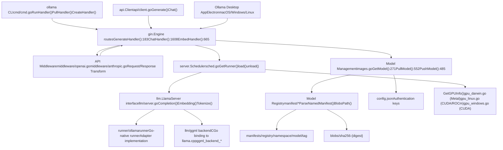
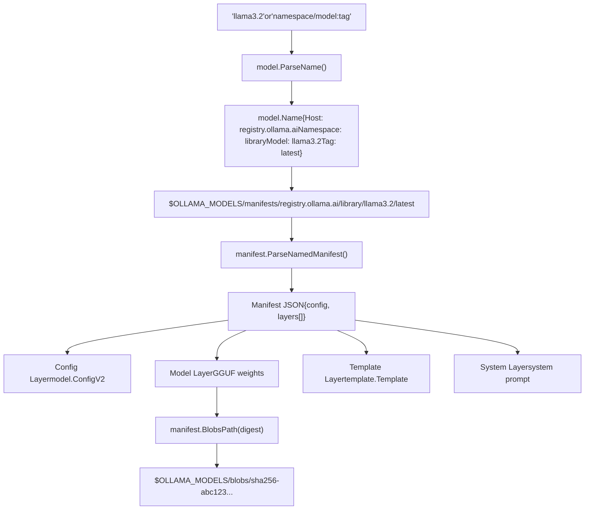

# Overview

Relevant source files

-   [README.md](https://github.com/ollama/ollama/blob/562c76d7/README.md?plain=1)
-   [api/client.go](https://github.com/ollama/ollama/blob/562c76d7/api/client.go)
-   [api/client\_test.go](https://github.com/ollama/ollama/blob/562c76d7/api/client_test.go)
-   [api/types.go](https://github.com/ollama/ollama/blob/562c76d7/api/types.go)
-   [cmd/cmd.go](https://github.com/ollama/ollama/blob/562c76d7/cmd/cmd.go)
-   [docs/README.md](https://github.com/ollama/ollama/blob/562c76d7/docs/README.md?plain=1)
-   [docs/api.md](https://github.com/ollama/ollama/blob/562c76d7/docs/api.md?plain=1)
-   [docs/development.md](https://github.com/ollama/ollama/blob/562c76d7/docs/development.md?plain=1)
-   [docs/images/ollama-keys.png](https://github.com/ollama/ollama/blob/562c76d7/docs/images/ollama-keys.png)
-   [docs/images/signup.png](https://github.com/ollama/ollama/blob/562c76d7/docs/images/signup.png)
-   [server/images.go](https://github.com/ollama/ollama/blob/562c76d7/server/images.go)
-   [server/routes.go](https://github.com/ollama/ollama/blob/562c76d7/server/routes.go)

## Purpose and Scope

This page provides a high-level overview of Ollama's architecture, core components, and how they interact. It introduces the system from user-facing interfaces down to model execution, storage, and hardware abstraction.

For detailed information about specific subsystems:

-   Command-line interface and usage patterns, see [Command Line Interface](/ollama/ollama/1.3-command-line-interface)
-   API endpoint specifications, see [API Reference](/ollama/ollama/3-api-reference)
-   Model management including Modelfiles and layer storage, see [Model Management](/ollama/ollama/4-model-management)
-   Inference execution and GPU allocation, see [Inference Engine](/ollama/ollama/5-inference-engine)
-   Hardware support and installation, see [GPU and Hardware Support](/ollama/ollama/6-gpu-and-hardware-support)
-   Building from source, see [Development Guide](/ollama/ollama/8-development-guide)

## What is Ollama?

Ollama is a system for running large language models locally on consumer hardware. The project's tagline is "Get up and running with large language models."

**Core Capabilities**:

-   **Model Management**: Pull models from registries, create custom models from Modelfiles, push models to share with others
-   **Inference Execution**: Generate text completions, maintain chat conversations, create embeddings, and generate images
-   **Hardware Acceleration**: Automatically detects and uses available GPUs (NVIDIA CUDA, AMD ROCm, Apple Metal, Vulkan)
-   **API Compatibility**: Native REST API at `/api/*` endpoints plus OpenAI-compatible API at `/v1/*` endpoints
-   **Concurrent Execution**: Run multiple models simultaneously with automatic memory management

**Architecture Pattern**: Ollama follows a client-server model where `ollama serve` runs an HTTP server and the `ollama` CLI (or other HTTP clients) communicate with it via REST API.

**Installation**: Available as native packages for macOS, Windows, and Linux, or as a Docker container. The official Docker image `ollama/ollama` supports multiple GPU backends (CPU, CUDA, ROCm, Vulkan). Installation scripts at `https://ollama.com/install.sh` (Unix) and `https://ollama.com/install.ps1` (Windows) handle automatic setup. See [Installation and Setup](/ollama/ollama/6.2-installation-and-setup) for details.

**Sources**: [README.md1-40](https://github.com/ollama/ollama/blob/562c76d7/README.md?plain=1#L1-L40) [README.md142-144](https://github.com/ollama/ollama/blob/562c76d7/README.md?plain=1#L142-L144) [docs/api.md1-20](https://github.com/ollama/ollama/blob/562c76d7/docs/api.md?plain=1#L1-L20)

## Core System Components

**System Architecture Diagram**


**Core Components by Layer**:

| Layer | Component | File Location | Key Functions |
| --- | --- | --- | --- |
| CLI | Command Handlers | [cmd/cmd.go500-716](https://github.com/ollama/ollama/blob/562c76d7/cmd/cmd.go#L500-L716) | `RunHandler()`, `CreateHandler()`, `PullHandler()`, `PushHandler()` |
| CLI | Client Library | [api/client.go38-41](https://github.com/ollama/ollama/blob/562c76d7/api/client.go#L38-L41) | `Generate()`, `Chat()`, `Pull()`, `Push()` |
| API Server | HTTP Routes | [server/routes.go183-1658](https://github.com/ollama/ollama/blob/562c76d7/server/routes.go#L183-L1658) | `GenerateHandler()`, `ChatHandler()`, `EmbedHandler()` |
| API Server | Middleware | [middleware/openai.go](https://github.com/ollama/ollama/blob/562c76d7/middleware/openai.go) [middleware/anthropic.go](https://github.com/ollama/ollama/blob/562c76d7/middleware/anthropic.go) | `FromChatRequest()`, `ToChatCompletion()` |
| Orchestration | Scheduler | [server/sched.go](https://github.com/ollama/ollama/blob/562c76d7/server/sched.go) | `GetRunner()`, `load()`, `unload()` |
| Orchestration | Model Management | [server/images.go271-368](https://github.com/ollama/ollama/blob/562c76d7/server/images.go#L271-L368) | `GetModel()`, `PullModel()`, `PushModel()` |
| Execution | LlamaServer | [llm/server.go](https://github.com/ollama/ollama/blob/562c76d7/llm/server.go) | `Completion()`, `Embedding()`, `Tokenize()` |
| Execution | Runners | [runner/ollamarunner](https://github.com/ollama/ollama/blob/562c76d7/runner/ollamarunner) | Go-native model execution |
| Storage | Manifests | [manifest/](https://github.com/ollama/ollama/blob/562c76d7/manifest/) | `ParseNamedManifest()`, `PathForName()` |
| Storage | Blobs | [manifest/](https://github.com/ollama/ollama/blob/562c76d7/manifest/) | `BlobsPath()`, content-addressed storage |
| Hardware | GPU Discovery | [discover/gpu\_darwin.go](https://github.com/ollama/ollama/blob/562c76d7/discover/gpu_darwin.go) [discover/gpu\_linux.go](https://github.com/ollama/ollama/blob/562c76d7/discover/gpu_linux.go) | `GetGPUInfo()`, VRAM calculation |

**Sources**: [server/routes.go1-60](https://github.com/ollama/ollama/blob/562c76d7/server/routes.go#L1-L60) [cmd/cmd.go1-56](https://github.com/ollama/ollama/blob/562c76d7/cmd/cmd.go#L1-L56) [api/client.go1-42](https://github.com/ollama/ollama/blob/562c76d7/api/client.go#L1-L42) [server/images.go1-47](https://github.com/ollama/ollama/blob/562c76d7/server/images.go#L1-L47)

## High-Level Architecture

### Request Flow Through System Layers

**Request Processing Flow Diagram**

> **[Mermaid sequence]**
> *(图表结构无法解析)*

**Sources**: [server/routes.go183-663](https://github.com/ollama/ollama/blob/562c76d7/server/routes.go#L183-L663) [server/routes.go133-170](https://github.com/ollama/ollama/blob/562c76d7/server/routes.go#L133-L170) [cmd/cmd.go500-716](https://github.com/ollama/ollama/blob/562c76d7/cmd/cmd.go#L500-L716) [api/client.go273-282](https://github.com/ollama/ollama/blob/562c76d7/api/client.go#L273-L282)

### Model Storage and Naming

Ollama uses a content-addressed storage system similar to container registries:

**Model Storage Structure Diagram**


**Key Functions**:

-   `model.ParseName()` at [types/model/](https://github.com/ollama/ollama/blob/562c76d7/types/model/) - Parses model name string into structured `model.Name`
-   `manifest.ParseNamedManifest()` at [manifest/](https://github.com/ollama/ollama/blob/562c76d7/manifest/) - Loads manifest JSON for a model name
-   `manifest.BlobsPath(digest)` at [manifest/](https://github.com/ollama/ollama/blob/562c76d7/manifest/) - Resolves digest to filesystem path
-   `GetModel(name)` at [server/images.go271](https://github.com/ollama/ollama/blob/562c76d7/server/images.go#L271-L271) - Constructs `Model` struct from manifest and layers

**Storage Locations** (configurable via `OLLAMA_MODELS` environment variable):

-   **Manifests**: `$OLLAMA_MODELS/manifests/registry/namespace/model/tag`
-   **Blobs**: `$OLLAMA_MODELS/blobs/sha256-{digest}`

**Sources**: [server/images.go57-72](https://github.com/ollama/ollama/blob/562c76d7/server/images.go#L57-L72) [server/images.go271-368](https://github.com/ollama/ollama/blob/562c76d7/server/images.go#L271-L368) [manifest/](https://github.com/ollama/ollama/blob/562c76d7/manifest/)

## API Surface

The HTTP server uses the Gin web framework and exposes two API families:

**Native Ollama API** (`/api/*` endpoints):

-   `/api/generate` - Single-turn text completion
-   `/api/chat` - Multi-turn conversation
-   `/api/embed` - Generate embeddings
-   `/api/pull` - Download model from registry
-   `/api/push` - Upload model to registry
-   `/api/create` - Create model from Modelfile
-   `/api/show` - Display model information
-   `/api/tags` - List local models
-   `/api/ps` - List running models

**OpenAI-Compatible API** (`/v1/*` endpoints):

-   `/v1/chat/completions` - Chat completions (middleware transforms to `/api/chat`)
-   `/v1/completions` - Text completions (middleware transforms to `/api/generate`)
-   `/v1/embeddings` - Embeddings (middleware transforms to `/api/embed`)
-   `/v1/models` - List models (maps to `/api/tags`)

**Anthropic-Compatible API** (`/v1/messages` endpoint):

-   `/v1/messages` - Claude-compatible messages endpoint (middleware transforms to `/api/chat`)

The middleware in [middleware/openai.go](https://github.com/ollama/ollama/blob/562c76d7/middleware/openai.go) and [middleware/anthropic.go](https://github.com/ollama/ollama/blob/562c76d7/middleware/anthropic.go) transforms external API requests into Ollama's native format and transforms responses back.

**Primary Request/Response Types** in [api/types.go](https://github.com/ollama/ollama/blob/562c76d7/api/types.go):

| Type | Fields | Purpose |
| --- | --- | --- |
| `GenerateRequest` | `Model`, `Prompt`, `Images`, `Options`, `Stream` | Completion request |
| `GenerateResponse` | `Response`, `Done`, `Context`, `Metrics` | Streamed completion response |
| `ChatRequest` | `Model`, `Messages`, `Tools`, `Options`, `Stream` | Chat request |
| `ChatResponse` | `Message`, `Done`, `Metrics` | Streamed chat response |
| `Message` | `Role`, `Content`, `Images`, `ToolCalls` | Chat message |

See [API Reference](/ollama/ollama/3-api-reference) for complete endpoint documentation.

**Sources**: [server/routes.go183-663](https://github.com/ollama/ollama/blob/562c76d7/server/routes.go#L183-L663) [api/types.go59-194](https://github.com/ollama/ollama/blob/562c76d7/api/types.go#L59-L194) [docs/api.md1-320](https://github.com/ollama/ollama/blob/562c76d7/docs/api.md?plain=1#L1-L320) [middleware/openai.go](https://github.com/ollama/ollama/blob/562c76d7/middleware/openai.go) [middleware/anthropic.go](https://github.com/ollama/ollama/blob/562c76d7/middleware/anthropic.go)

## Scheduler and Runner Management

The scheduler in [server/sched.go](https://github.com/ollama/ollama/blob/562c76d7/server/sched.go) manages model loading, unloading, and memory allocation. It maintains a pool of loaded models and handles concurrent requests.

**Runner Lifecycle State Machine**

> **[Mermaid stateDiagram]**
> *(图表结构无法解析)*

**Key Data Structures**:

```
// server/sched.gotype Scheduler struct {    loaded       map[string]*runnerRef    // Active runners by digest    pendingReqCh chan *runnerRequest      // Incoming requests    finishedReqCh chan *runnerRequest     // Completed requests    expiredCh    chan *runnerRef          // Expired runners} type runnerRef struct {    llama     llm.LlamaServer            // Inference interface    model     *Model                      // Model metadata    refCount  atomic.Int32                // Concurrent request count    loading   atomic.Bool                 // Loading state}
```
**Key Functions**:

-   `GetRunner(ctx, model, opts, keepAlive)` - Returns channel for allocated runner
-   `load(req)` - Loads model into memory, may evict other models
-   `unload(digest)` - Unloads model from memory
-   `findRunnerToUnload()` - Eviction policy: selects idle runner with longest session

**Sources**: [server/sched.go](https://github.com/ollama/ollama/blob/562c76d7/server/sched.go) [server/routes.go125-157](https://github.com/ollama/ollama/blob/562c76d7/server/routes.go#L125-L157)

### Memory Management

When loading a new model, the scheduler calculates required VRAM and may evict other models if necessary:

**Eviction Process**:

1.  Calculate required memory using GPU discovery system
2.  Check available VRAM across all devices
3.  If insufficient, find idle runners (`refCount == 0`)
4.  Sort candidates by `sessionDuration` (evict longest-running first)
5.  Send runner to `expiredCh` for unloading
6.  Call `runner.llama.Close()` to free VRAM
7.  Remove from `loaded` map

**Environment Configuration**:

-   `OLLAMA_MAX_LOADED_MODELS` - Maximum models to keep in memory (default: 1)
-   `OLLAMA_NUM_PARALLEL` - Maximum concurrent requests per model (default: 1)
-   `OLLAMA_KEEP_ALIVE` - Default time before unloading idle models (default: 5m)

**Sources**: [server/sched.go](https://github.com/ollama/ollama/blob/562c76d7/server/sched.go) [discover/](https://github.com/ollama/ollama/blob/562c76d7/discover/) [envconfig/](https://github.com/ollama/ollama/blob/562c76d7/envconfig/)

## Model Capabilities

Ollama detects model capabilities to validate API requests and provide appropriate functionality:

**Capability Types** (defined in [types/model/](https://github.com/ollama/ollama/blob/562c76d7/types/model/)):

| Capability | Detection Method | Purpose |
| --- | --- | --- |
| `CapabilityCompletion` | Default if not embedding | Text generation |
| `CapabilityEmbedding` | `pooling_type` in GGUF metadata | Vector embeddings |
| `CapabilityVision` | `vision.block_count` in GGUF or projector layers | Image understanding |
| `CapabilityTools` | `tools` variable in template | Function calling |
| `CapabilityInsert` | `suffix` variable in template | Fill-in-middle completion |
| `CapabilityThinking` | Thinking tags in template or config | Reasoning models |
| `CapabilityImage` | Config capabilities field | Image generation |

**Capability Detection** in [server/images.go74-141](https://github.com/ollama/ollama/blob/562c76d7/server/images.go#L74-L141):

```
func (m *Model) Capabilities() []model.Capability {    // Check GGUF metadata for pooling_type (embeddings)    // Check GGUF metadata for vision.block_count    // Check template for tools/suffix variables    // Check template for thinking tags    // Return list of detected capabilities} func (m *Model) CheckCapabilities(want ...model.Capability) error {    // Validate model has required capabilities    // Return error if any missing}
```
**Usage in Request Handlers**:

```
// server/routes.gocaps := []model.Capability{model.CapabilityCompletion}runner, model, opts, err := s.scheduleRunner(ctx, name, caps, reqOpts, keepAlive)if errors.Is(err, errCapabilityCompletion) {    c.JSON(400, gin.H{"error": "model does not support generate"})}
```
**Sources**: [server/images.go74-185](https://github.com/ollama/ollama/blob/562c76d7/server/images.go#L74-L185) [types/model/](https://github.com/ollama/ollama/blob/562c76d7/types/model/) [server/routes.go354-379](https://github.com/ollama/ollama/blob/562c76d7/server/routes.go#L354-L379)

## Template System

Ollama uses Go templates to format prompts appropriately for each model architecture. Templates control how system prompts, messages, tools, and other inputs are formatted before sending to the model.

**Template Variables**:

-   `.System` - System message/prompt
-   `.Messages` - Conversation history (`[]api.Message`)
-   `.Tools` - Available functions (`[]api.Tool`)
-   `.Prompt` - Single prompt (for `/api/generate`)
-   `.Suffix` - Text after insertion point (for FIM)
-   `.Think` - Whether thinking is enabled (for reasoning models)

**Template Resolution** (priority order):

1.  Request override (`req.Template` field)
2.  Manifest layer (template blob in model)
3.  `DefaultTemplate` fallback

**Key Functions** in [template/](https://github.com/ollama/ollama/blob/562c76d7/template/):

-   `Parse(s string) (*Template, error)` - Parse template string into AST
-   `Execute(w io.Writer, v Values) error` - Render template with variables
-   `Contains(s string) bool` - Check if template contains string (for capability detection)

Example template for chat models:

```
{{- range .Messages }}
<|start_header_id|>{{ .Role }}<|end_header_id|>
{{ .Content }}<|eot_id|>
{{- end }}
<|start_header_id|>assistant<|end_header_id|>
```
See [Template System](/ollama/ollama/7.1-template-system) for detailed documentation.

**Sources**: [template/](https://github.com/ollama/ollama/blob/562c76d7/template/) [server/routes.go406-481](https://github.com/ollama/ollama/blob/562c76d7/server/routes.go#L406-L481)

## Key Data Types

**Model Representation** in [server/images.go57-72](https://github.com/ollama/ollama/blob/562c76d7/server/images.go#L57-L72):

```
type Model struct {    Name           string              // Full model name    Config         model.ConfigV2      // Model configuration    ModelPath      string              // Path to GGUF weights file    AdapterPaths   []string            // LoRA adapter paths    ProjectorPaths []string            // Vision projector paths    System         string              // System prompt    Options        map[string]any      // Model parameters    Messages       []api.Message       // Pre-loaded conversation    Template       *template.Template  // Prompt template    Digest         string              // Manifest digest}
```
**Request Types** in [api/types.go](https://github.com/ollama/ollama/blob/562c76d7/api/types.go):

```
type GenerateRequest struct {    Model    string    Prompt   string    Images   []ImageData      // For vision models    Options  map[string]any    Think    *ThinkValue      // For reasoning models    Stream   *bool} type ChatRequest struct {    Model    string    Messages []Message    Tools    []Tool           // For function calling    Options  map[string]any    Think    *ThinkValue    Stream   *bool} type Message struct {    Role      string    Content   string    Images    []ImageData    ToolCalls []ToolCall}
```
**Response Types** in [api/types.go](https://github.com/ollama/ollama/blob/562c76d7/api/types.go):

```
type GenerateResponse struct {    Response   string        // Generated text    Thinking   string        // Reasoning (if Think enabled)    ToolCalls  []ToolCall    // Tool invocations    Done       bool    Context    []int         // Token context    Metrics    Metrics       // Performance metrics} type ChatResponse struct {    Message Message    Done    bool    Metrics Metrics}
```
**Sources**: [server/images.go57-72](https://github.com/ollama/ollama/blob/562c76d7/server/images.go#L57-L72) [api/types.go59-221](https://github.com/ollama/ollama/blob/562c76d7/api/types.go#L59-L221)

## System Initialization

**Server Startup Flow**

> **[Mermaid sequence]**
> *(图表结构无法解析)*

**Initialization Steps**:

1.  Parse `OLLAMA_HOST` environment variable (default: `127.0.0.1:11434`)
2.  Call `discover.GetGPUInfo()` to enumerate available GPUs and calculate memory
3.  Create `Scheduler` with GPU information
4.  Create HTTP `Server` with Gin engine
5.  Register API routes (`/api/*`, `/v1/*`)
6.  Start HTTP listener

**Sources**: [cmd/cmd.go](https://github.com/ollama/ollama/blob/562c76d7/cmd/cmd.go) [server/routes.go87-109](https://github.com/ollama/ollama/blob/562c76d7/server/routes.go#L87-L109) [discover/](https://github.com/ollama/ollama/blob/562c76d7/discover/) [envconfig/](https://github.com/ollama/ollama/blob/562c76d7/envconfig/)

## Configuration

Key environment variables (all defined in [envconfig/](https://github.com/ollama/ollama/blob/562c76d7/envconfig/)):

| Variable | Default | Purpose |
| --- | --- | --- |
| `OLLAMA_HOST` | `127.0.0.1:11434` | Server address (clients and server) |
| `OLLAMA_MODELS` | `~/.ollama/models` (Linux/macOS)
`%USERPROFILE%\.ollama\models` (Windows) | Model storage location |
| `OLLAMA_KEEP_ALIVE` | `5m` | How long to keep models loaded |
| `OLLAMA_NUM_PARALLEL` | `1` | Concurrent requests per model |
| `OLLAMA_MAX_LOADED_MODELS` | `1` | Maximum models in memory |
| `OLLAMA_MAX_VRAM` | (auto-detected) | VRAM limit per GPU |
| `OLLAMA_NOPRUNE` | `false` | Disable automatic blob cleanup |
| `OLLAMA_DEBUG` | `false` | Enable debug logging |
| `OLLAMA_ORIGINS` | (none) | CORS allowed origins |

**Storage Paths**:

-   **Models**: `$OLLAMA_MODELS` (manifests and blobs)
-   **Logs** (Linux): `/var/log/ollama.log`
-   **Logs** (macOS): `~/Library/Logs/Ollama/server.log`
-   **Logs** (Windows): `%LOCALAPPDATA%\Ollama\logs\server.log`

**Sources**: [envconfig/](https://github.com/ollama/ollama/blob/562c76d7/envconfig/) [README.md](https://github.com/ollama/ollama/blob/562c76d7/README.md?plain=1)

## Summary

Ollama's architecture follows a clean separation of concerns:

1.  **User Interfaces** ([cmd/cmd.go](https://github.com/ollama/ollama/blob/562c76d7/cmd/cmd.go) [api/client.go](https://github.com/ollama/ollama/blob/562c76d7/api/client.go)) - CLI and programmatic access
2.  **HTTP API Layer** ([server/routes.go](https://github.com/ollama/ollama/blob/562c76d7/server/routes.go)) - REST endpoints with Gin framework
3.  **Orchestration** ([server/sched.go](https://github.com/ollama/ollama/blob/562c76d7/server/sched.go) [server/images.go](https://github.com/ollama/ollama/blob/562c76d7/server/images.go)) - Resource management and model lifecycle
4.  **Execution** ([llm/server.go](https://github.com/ollama/ollama/blob/562c76d7/llm/server.go) [runner/](https://github.com/ollama/ollama/blob/562c76d7/runner/)) - Model inference with hardware acceleration
5.  **Storage** ([server/images.go438-728](https://github.com/ollama/ollama/blob/562c76d7/server/images.go#L438-L728)) - Content-addressed blobs and manifests

The system prioritizes:

-   **Concurrent Execution**: Multiple models with automatic memory management
-   **Hardware Flexibility**: Support for diverse GPU backends (CUDA, ROCm, Metal, Vulkan)
-   **Storage Efficiency**: Content-addressed deduplication of shared model layers
-   **API Compatibility**: Native REST API plus OpenAI-compatible endpoints

For deeper exploration of specific subsystems, see the linked sections at the beginning of this document.

**Sources**: [README.md1-262](https://github.com/ollama/ollama/blob/562c76d7/README.md?plain=1#L1-L262) [server/routes.go1-1606](https://github.com/ollama/ollama/blob/562c76d7/server/routes.go#L1-L1606) [cmd/cmd.go1-1806](https://github.com/ollama/ollama/blob/562c76d7/cmd/cmd.go#L1-L1806) [server/images.go1-1242](https://github.com/ollama/ollama/blob/562c76d7/server/images.go#L1-L1242)
