# Key Concepts

Relevant source files

-   [README.md](https://github.com/ollama/ollama/blob/562c76d7/README.md?plain=1)
-   [api/client.go](https://github.com/ollama/ollama/blob/562c76d7/api/client.go)
-   [api/client\_test.go](https://github.com/ollama/ollama/blob/562c76d7/api/client_test.go)
-   [api/types.go](https://github.com/ollama/ollama/blob/562c76d7/api/types.go)
-   [cmd/cmd.go](https://github.com/ollama/ollama/blob/562c76d7/cmd/cmd.go)
-   [docs/README.md](https://github.com/ollama/ollama/blob/562c76d7/docs/README.md?plain=1)
-   [docs/api.md](https://github.com/ollama/ollama/blob/562c76d7/docs/api.md?plain=1)
-   [docs/development.md](https://github.com/ollama/ollama/blob/562c76d7/docs/development.md?plain=1)
-   [docs/images/ollama-keys.png](https://github.com/ollama/ollama/blob/562c76d7/docs/images/ollama-keys.png)
-   [docs/images/signup.png](https://github.com/ollama/ollama/blob/562c76d7/docs/images/signup.png)
-   [envconfig/config.go](https://github.com/ollama/ollama/blob/562c76d7/envconfig/config.go)
-   [envconfig/config\_test.go](https://github.com/ollama/ollama/blob/562c76d7/envconfig/config_test.go)
-   [llm/server.go](https://github.com/ollama/ollama/blob/562c76d7/llm/server.go)
-   [server/images.go](https://github.com/ollama/ollama/blob/562c76d7/server/images.go)
-   [server/routes.go](https://github.com/ollama/ollama/blob/562c76d7/server/routes.go)
-   [server/sched.go](https://github.com/ollama/ollama/blob/562c76d7/server/sched.go)
-   [server/sched\_test.go](https://github.com/ollama/ollama/blob/562c76d7/server/sched_test.go)

This page introduces the fundamental concepts and terminology used throughout the Ollama system. Understanding these concepts is essential for working with the codebase, as they form the foundation for model management, execution, and storage.

For information about the overall system architecture, see [Architecture](/ollama/ollama/2-architecture). For API details, see [API Reference](/ollama/ollama/3-api-reference). For model file formats and conversion, see [Model Management](/ollama/ollama/4-model-management).

---

## Models and Model Names

A **model** in Ollama refers to both a logical identifier (the model name) and the collection of layers (blobs) that comprise a complete language model with all its associated components.

### Model Naming Format

Model names in Ollama follow a structured format parsed by `model.ParseName()`:

```
[scheme://][host/][namespace/]model[:tag]
```
Each component has a specific purpose and default value:

| Component | Required | Default | Max Length | Description |
| --- | --- | --- | --- | --- |
| **scheme** | No | `https` | \- | Protocol scheme for registry communication |
| **host** | No | `registry.ollama.ai` | 350 | Registry host (can include port, e.g., `localhost:5000`) |
| **namespace** | No | `library` | 80 | User or organization namespace |
| **model** | Yes | \- | 80 | Model name identifier |
| **tag** | No | `latest` | 80 | Version or variant tag |

The `model.Name` struct stores these parsed components:

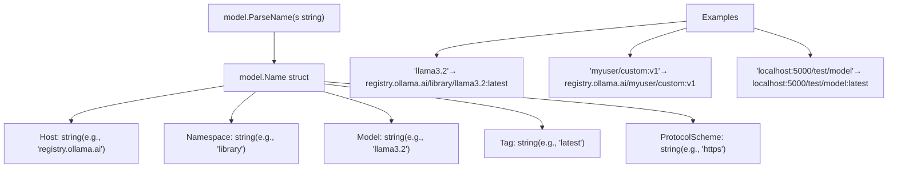
The parser uses `model.ParseNameBare()` for basic parsing, then merges with `model.DefaultName()` to fill in missing components. Names are case-insensitive and stored in a normalized form.

**Sources:** [types/model/name.go88-176](https://github.com/ollama/ollama/blob/562c76d7/types/model/name.go#L88-L176) [types/model/name.go38-59](https://github.com/ollama/ollama/blob/562c76d7/types/model/name.go#L38-L59) [types/model/name\_test.go15-141](https://github.com/ollama/ollama/blob/562c76d7/types/model/name_test.go#L15-L141)

### Tags

**Tags** identify specific versions or variants of a model. Common tag patterns include:

-   **Version tags**: `7b`, `13b`, `70b` (parameter counts)
-   **Quantization tags**: `q4_0`, `q5_K_M`, `q8_0` (quantization levels)
-   **Variant tags**: `instruct`, `chat`, `code` (fine-tuned variants)
-   **Combined tags**: `7b-instruct-q4_0` (multiple attributes)

Tags enable multiple variants of the same model to coexist. For example:

-   `llama3.2:3b` - 3 billion parameter version
-   `llama3.2:1b` - 1 billion parameter version
-   `llama3.2:latest` - default version (typically the most recent)

**Sources:** [types/model/name.go126-130](https://github.com/ollama/ollama/blob/562c76d7/types/model/name.go#L126-L130) [README.md55-83](https://github.com/ollama/ollama/blob/562c76d7/README.md?plain=1#L55-L83)

### Model Composition

A model in Ollama is composed of multiple **layers** stored as separate blobs. Each layer has a specific media type that determines its purpose. The layers are defined in the model's manifest.

#### Layer Types

| Media Type | Purpose | Storage Format |
| --- | --- | --- |
| `application/vnd.ollama.image.model` | Model weights and architecture | GGUF file |
| `application/vnd.ollama.image.adapter` | LoRA adapters (optional) | GGUF file |
| `application/vnd.ollama.image.projector` | Vision model projectors (optional) | GGUF file |
| `application/vnd.ollama.image.template` | Chat prompt template | Text template |
| `application/vnd.ollama.image.system` | System prompt | Plain text |
| `application/vnd.ollama.image.params` | Runtime parameters | JSON |
| `application/vnd.docker.container.image.v1+json` | Model metadata | ConfigV2 JSON |

#### Runtime Model Representation

When a model is loaded for inference, it is represented as a runtime structure containing references to all its components:

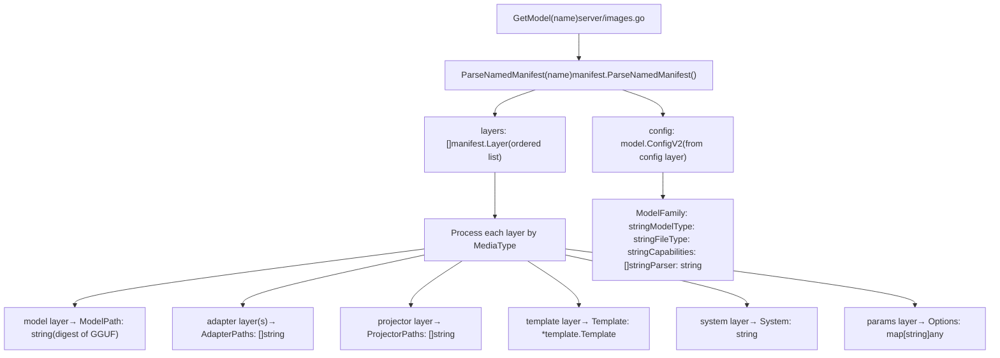
The `model.ConfigV2` struct stores model metadata:

| Field | Type | Description |
| --- | --- | --- |
| `ModelFormat` | `string` | Format identifier (e.g., "gguf") |
| `ModelFamily` | `string` | Architecture family (e.g., "llama", "gemma") |
| `ModelFamilies` | `[]string` | All compatible families |
| `ModelType` | `string` | Parameter size (e.g., "7B", "13B") |
| `FileType` | `string` | Quantization level (e.g., "Q4\_0", "F16") |
| `Capabilities` | `[]string` | Supported operations (completion, vision, etc.) |
| `Parser` | `string` | Output parser (e.g., "harmony" for thinking models) |
| `Renderer` | `string` | Custom renderer identifier |

**Sources:** [server/model.go23-77](https://github.com/ollama/ollama/blob/562c76d7/server/model.go#L23-L77) [types/model/config.go1-34](https://github.com/ollama/ollama/blob/562c76d7/types/model/config.go#L1-L34) [server/create.go46-243](https://github.com/ollama/ollama/blob/562c76d7/server/create.go#L46-L243)

---

## Manifests and Blobs

Ollama uses a **content-addressed storage** system where models are decomposed into layers called **blobs**. Each blob is identified by its SHA256 digest, ensuring data integrity and deduplication.

### Manifest Structure

A **manifest** is a JSON file that describes how to reconstruct a model from its component blobs. Manifests follow the Docker Image Manifest V2 format:

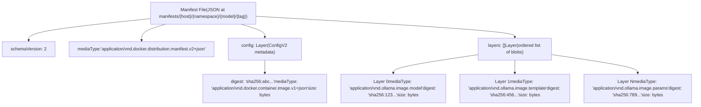
Each `Layer` entry contains:

-   `mediaType`: Identifies the layer's purpose
-   `digest`: SHA256 hash of the blob content (format: `sha256:{hex}`)
-   `size`: Size of the blob in bytes

**Sources:** [manifest package](https://github.com/ollama/ollama/blob/562c76d7/manifest package) [server/model.go28-77](https://github.com/ollama/ollama/blob/562c76d7/server/model.go#L28-L77)

### Blob Storage Format

All blobs are stored in `$OLLAMA_MODELS/blobs/` with a filename that encodes their digest:

```
blobs/sha256-{64-character-hex-digest}
```
The colon (`:`) in the digest is replaced with a hyphen (`-`) to create a valid filename. For example:

-   Digest: `sha256:a1b2c3...`
-   Filename: `blobs/sha256-a1b2c3...`

#### Content-Addressed Storage Benefits

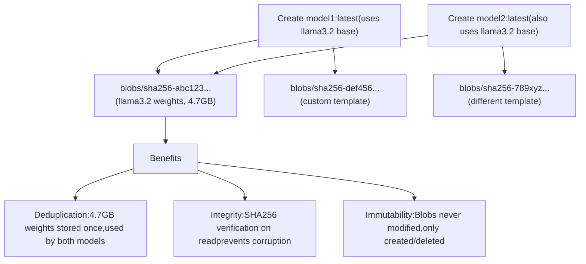
**Sources:** [manifest package](https://github.com/ollama/ollama/blob/562c76d7/manifest package) [server/routes\_test.go79-84](https://github.com/ollama/ollama/blob/562c76d7/server/routes_test.go#L79-L84)

### Manifest Storage Location

Manifests are stored in a hierarchical directory structure that mirrors the model name:

```
$OLLAMA_MODELS/manifests/{host}/{namespace}/{model}/{tag}
```
For example:

-   `registry.ollama.ai/library/llama3.2:latest` → `manifests/registry.ollama.ai/library/llama3.2/latest`
-   `localhost:5000/myuser/custom:v1` → `manifests/localhost:5000/myuser/custom/v1`

The `name.Filepath()` method converts a `model.Name` to this path format.

**Sources:** [types/model/name.go283-302](https://github.com/ollama/ollama/blob/562c76d7/types/model/name.go#L283-L302) [server/routes\_test.go35-84](https://github.com/ollama/ollama/blob/562c76d7/server/routes_test.go#L35-L84)

## Runners

A **runner** is an execution engine that loads a model into memory and performs inference operations. Runners are the bridge between high-level API requests and low-level model computation.

### The LlamaServer Interface

All runners implement the `llm.LlamaServer` interface, which defines the contract for model execution:

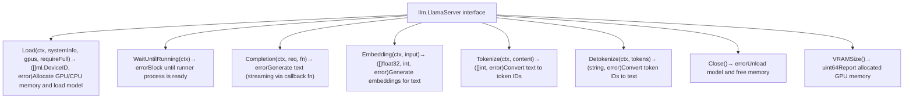
**Sources:** [llm/server.go](https://github.com/ollama/ollama/blob/562c76d7/llm/server.go)

### Runner Lifecycle

A runner's lifecycle is managed by the scheduler:

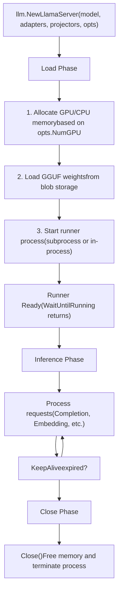
**Sources:** [llm/server.go](https://github.com/ollama/ollama/blob/562c76d7/llm/server.go) [server/sched.go](https://github.com/ollama/ollama/blob/562c76d7/server/sched.go)

### Runner Implementations

Ollama supports two runner implementations that are automatically selected based on model characteristics:

#### llamaServer (llama.cpp backend)

The traditional runner using llama.cpp bindings for CPU/GPU inference:

| Component | Purpose |
| --- | --- |
| `llm.NewLlamaServer()` | Factory function that creates a runner |
| `llm.LoadModel()` | Loads model from GGUF file |
| `llama.LoadModelFromFile()` | C bindings to llama.cpp's model loading |
| `llama.NewContext()` | Creates inference context with KV cache |

#### ollamaServer (new Ollama engine)

A newer implementation used when `envconfig.NewEngine()` is true or when the model's GGML metadata contains `OllamaEngineRequired()`:

| Component | Purpose |
| --- | --- |
| `tokenizer.Tokenizer` | Native tokenizer for text encoding/decoding |
| `model.NewTextProcessor()` | Creates tokenizer from model file |

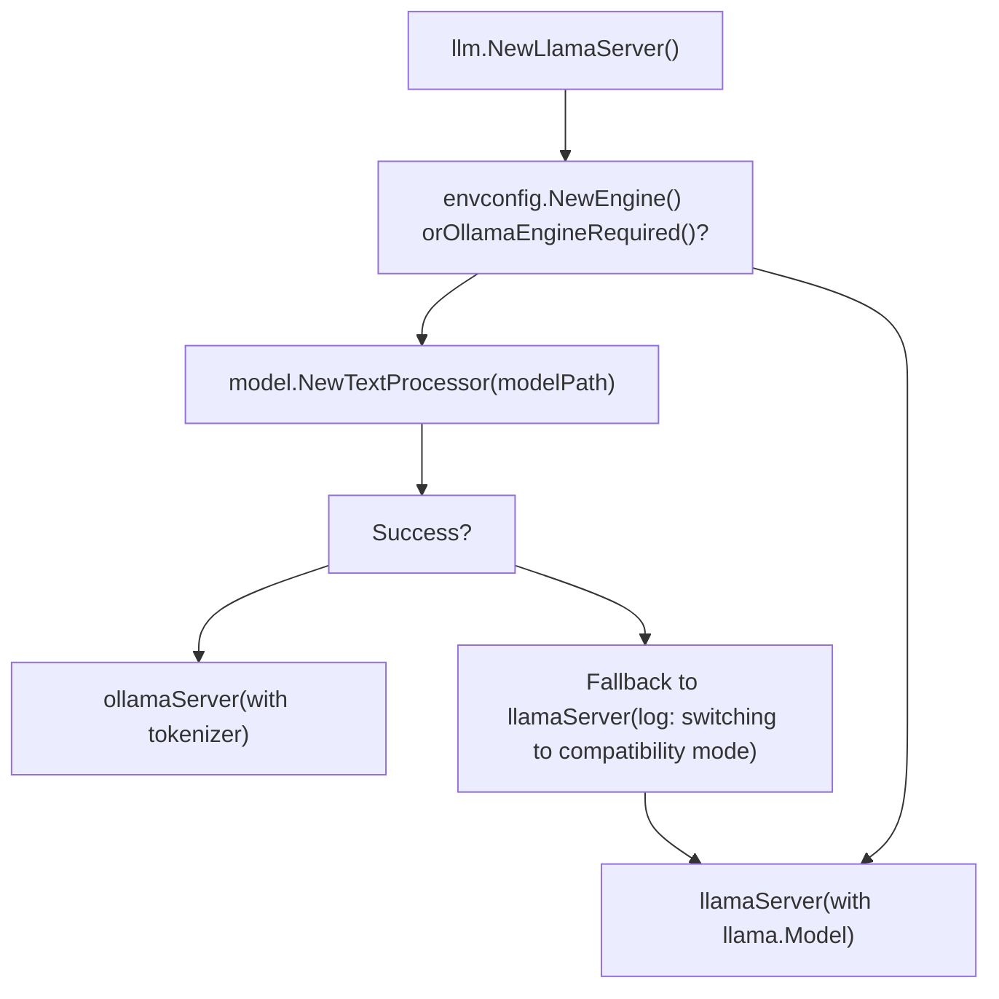
Both runners manage:

-   **Memory allocation** across multiple GPUs/CPUs
-   **Batch processing** for efficient prompt evaluation
-   **KV cache** for storing attention keys/values
-   **Token generation** with sampling parameters

**Sources:** [llm/server.go142-163](https://github.com/ollama/ollama/blob/562c76d7/llm/server.go#L142-L163) [llm/server.go110-120](https://github.com/ollama/ollama/blob/562c76d7/llm/server.go#L110-L120)

---

## Scheduler

The **scheduler** manages the lifecycle of runners and orchestrates concurrent model execution. It ensures efficient GPU memory utilization by loading and unloading models based on demand and available resources.

### Scheduler Data Structure

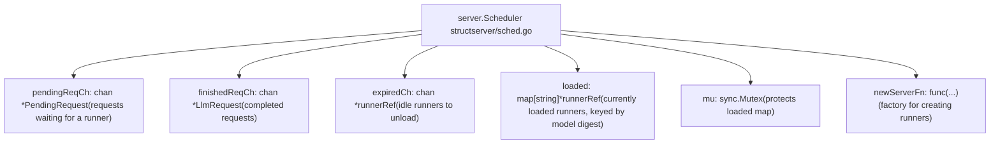
**Sources:** [server/sched.go](https://github.com/ollama/ollama/blob/562c76d7/server/sched.go)

### Request Processing Flow

When a client makes a request, it flows through the scheduler's pipeline:

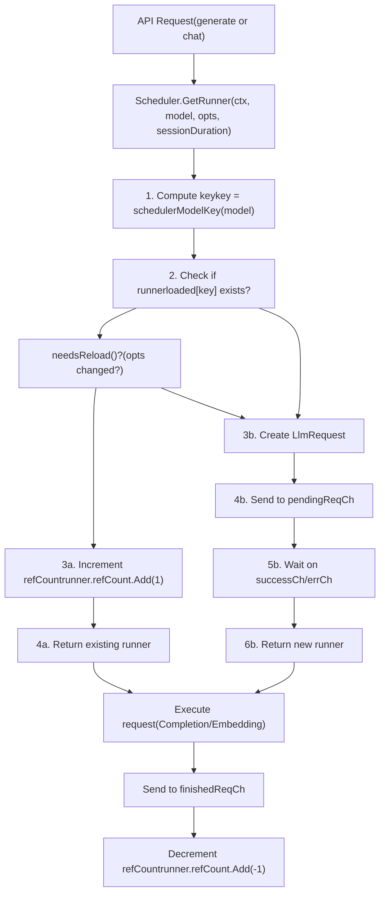
The `schedulerModelKey()` function determines how models are indexed in the scheduler:

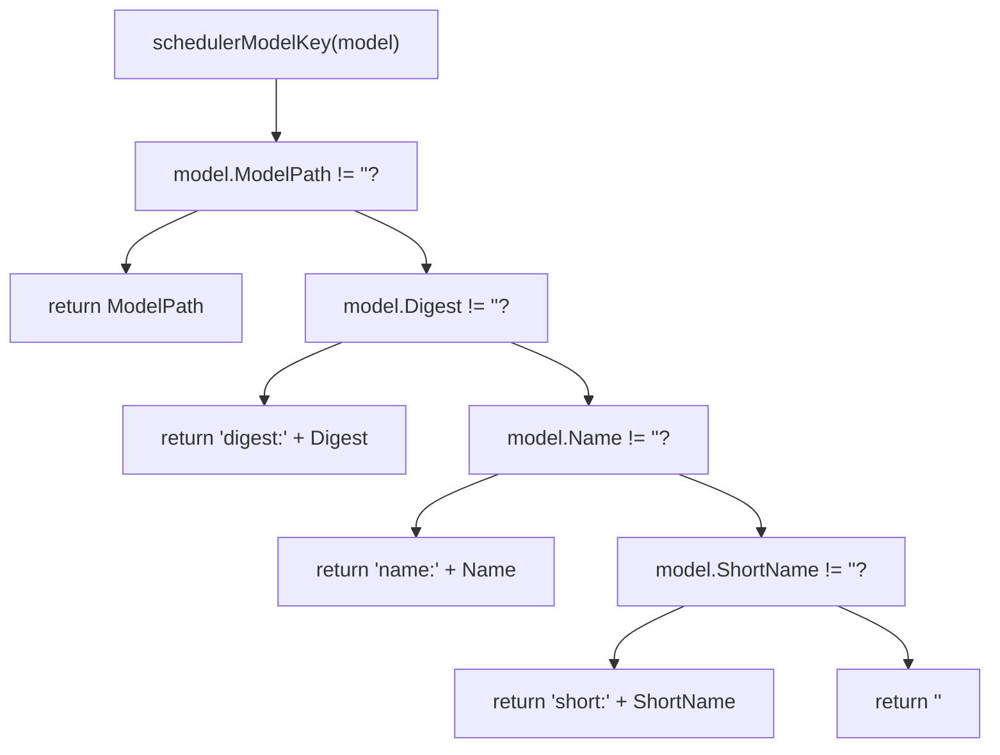
This allows GGUF-backed models (with `ModelPath`) to share runners, while safetensors/image models without a `ModelPath` use digest-based keying to prevent collisions.

**Sources:** [server/sched.go107-141](https://github.com/ollama/ollama/blob/562c76d7/server/sched.go#L107-L141) [server/sched.go85-105](https://github.com/ollama/ollama/blob/562c76d7/server/sched.go#L85-L105)

### Background Processing Loop

The scheduler runs a background goroutine (`processPending()`) that handles pending requests and runner lifecycle:

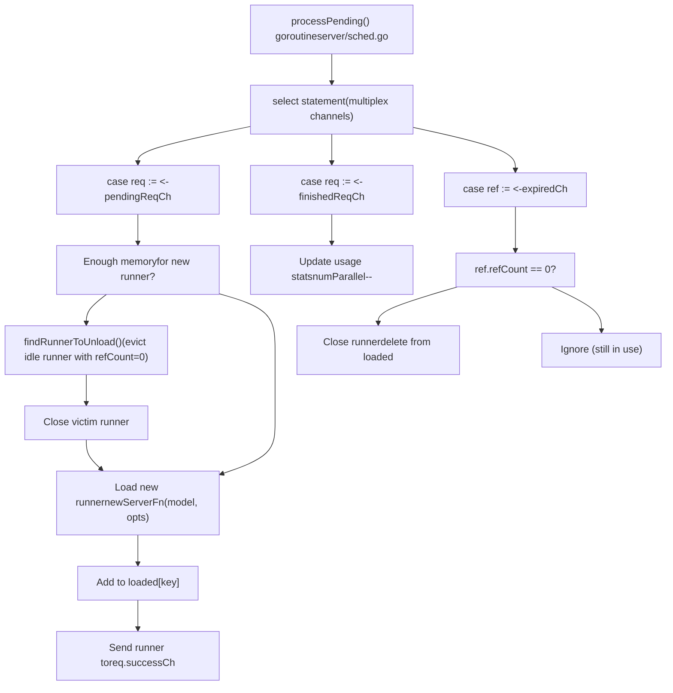
**Sources:** [server/sched.go131-271](https://github.com/ollama/ollama/blob/562c76d7/server/sched.go#L131-L271)

### Runner Reference Management

Each loaded runner is wrapped in a `runnerRef` that tracks its usage:

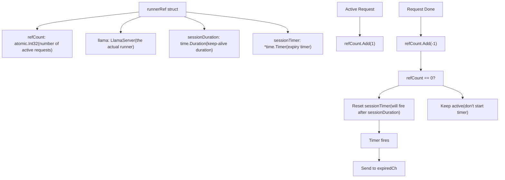
The reference counting ensures:

-   Runners are not unloaded while processing requests
-   Idle runners are eventually evicted to free memory
-   Multiple concurrent requests can share a single runner

**Sources:** [server/sched.go273-380](https://github.com/ollama/ollama/blob/562c76d7/server/sched.go#L273-L380)

---

## Capabilities

**Capabilities** describe what operations a model supports. The system automatically detects capabilities by inspecting the model file and configuration.

### Capability Detection Flow

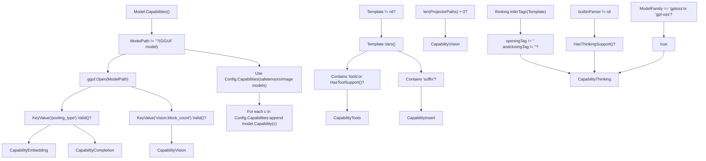
**Sources:** [server/images.go78-145](https://github.com/ollama/ollama/blob/562c76d7/server/images.go#L78-L145)

### Capability Enumeration

| Capability | Value | Description | Detection Method |
| --- | --- | --- | --- |
| `CapabilityCompletion` | `"completion"` | Text generation | Default if no pooling\_type in GGUF |
| `CapabilityEmbedding` | `"embedding"` | Vector embeddings | GGUF has pooling\_type key |
| `CapabilityVision` | `"vision"` | Image understanding | GGUF has vision.block\_count or ProjectorPaths exist |
| `CapabilityTools` | `"tools"` | Function calling | Template has 'tools' variable or parser.HasToolSupport() |
| `CapabilityInsert` | `"insert"` | Fill-in-the-middle | Template has 'suffix' variable |
| `CapabilityThinking` | `"thinking"` | Reasoning/chain-of-thought | Has thinking tags, is gpt-oss, or parser.HasThinkingSupport() |
| `CapabilityImage` | `"image"` | Image generation | In Config.Capabilities |

### Capability Validation

Models are checked for required capabilities before processing requests using `CheckCapabilities()`:

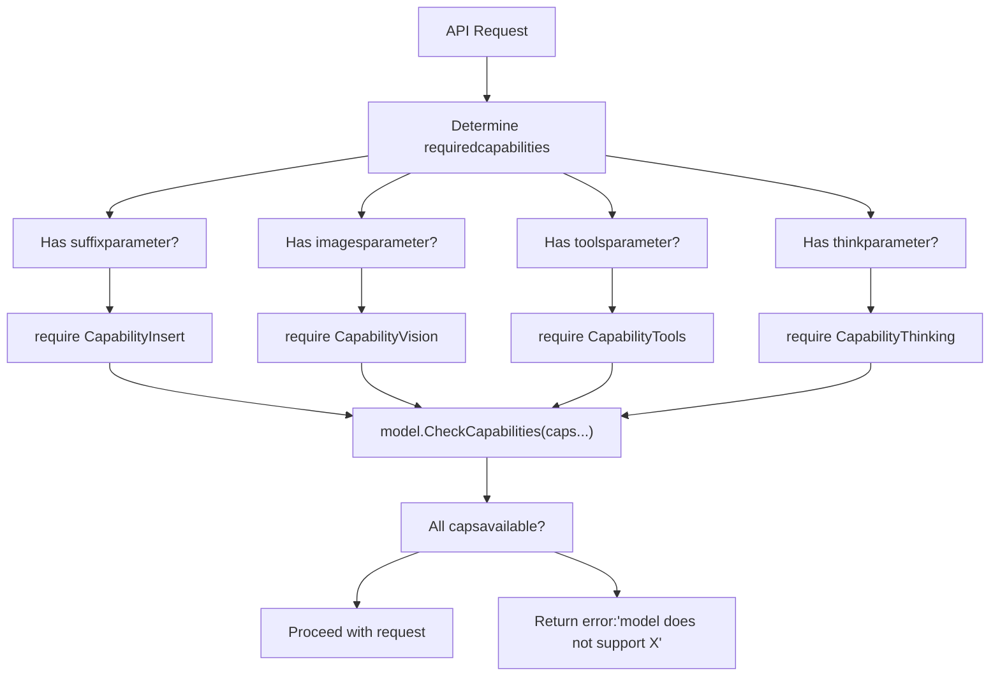
**Sources:** [server/images.go147-189](https://github.com/ollama/ollama/blob/562c76d7/server/images.go#L147-L189) [server/routes.go373-390](https://github.com/ollama/ollama/blob/562c76d7/server/routes.go#L373-L390)

---

## Context and KV Cache

The **context** represents the model's working memory, storing the key-value cache for previously processed tokens. Context size is a critical constraint affecting model behavior.

### Context Management

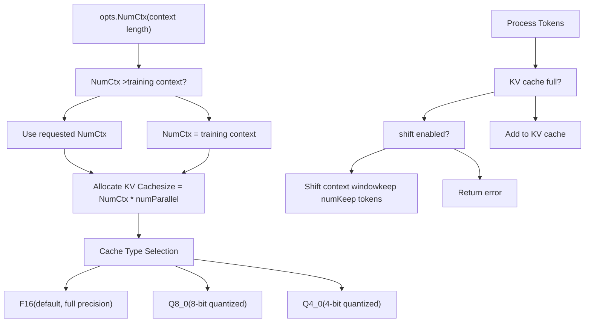
**Sources:** [llm/server.go164-169](https://github.com/ollama/ollama/blob/562c76d7/llm/server.go#L164-L169) [llm/server.go211-258](https://github.com/ollama/ollama/blob/562c76d7/llm/server.go#L211-L258) [runner/ollamarunner/runner.go146-186](https://github.com/ollama/ollama/blob/562c76d7/runner/ollamarunner/runner.go#L146-L186)

### KV Cache Operations

The KV cache supports several operations for managing memory:

| Operation | Function | Purpose |
| --- | --- | --- |
| **Add** | `KvCacheSeqAdd(seqId, p0, p1, delta)` | Shift positions forward/backward |
| **Remove** | `KvCacheSeqRm(seqId, p0, p1)` | Clear tokens in range |
| **Copy** | `KvCacheSeqCp(srcSeqId, dstSeqId, p0, p1)` | Duplicate sequence cache |
| **Clear** | `KvCacheClear()` | Reset entire cache |

**Sources:** [llama/llama.go190-204](https://github.com/ollama/ollama/blob/562c76d7/llama/llama.go#L190-L204)

---

## Options

**Options** control runtime behavior such as temperature, context size, and GPU allocation. Options are merged from multiple sources with a defined precedence.

### Option Precedence

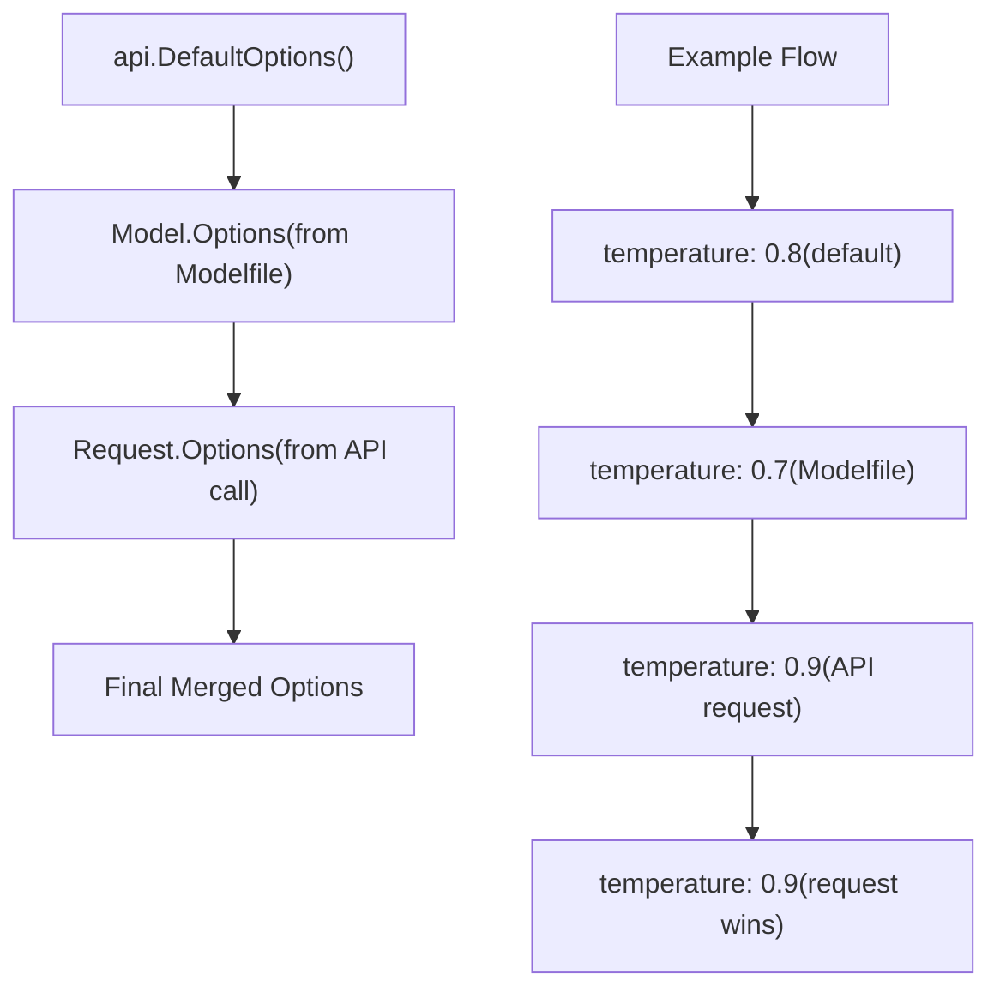
**Sources:** [server/routes.go109-120](https://github.com/ollama/ollama/blob/562c76d7/server/routes.go#L109-L120) [api/types.go1147-1234](https://github.com/ollama/ollama/blob/562c76d7/api/types.go#L1147-L1234)

### Common Options

| Option | Type | Default | Description |
| --- | --- | --- | --- |
| `num_ctx` | `int` | 2048 | Context window size |
| `num_predict` | `int` | \-1 | Max tokens to generate (-1 = infinite) |
| `temperature` | `float32` | 0.8 | Sampling temperature |
| `top_k` | `int` | 40 | Top-k sampling |
| `top_p` | `float32` | 0.9 | Nucleus sampling |
| `num_gpu` | `int` | \-1 | GPU layers (-1 = auto) |
| `num_thread` | `int` | 0 | CPU threads (0 = auto) |
| `num_batch` | `int` | 512 | Batch size for prompt processing |
| `repeat_penalty` | `float32` | 1.1 | Repetition penalty |
| `think` | `ThinkValue` | nil | Enable reasoning for thinking models (true/false/"high"/"medium"/"low") |

### Special Request Options

In addition to the model-specific options above, API requests support several special parameters:

| Parameter | Type | Default | Description |
| --- | --- | --- | --- |
| `stream` | `*bool` | true | Enable streaming responses |
| `keep_alive` | `*Duration` | 5m | Duration to keep model loaded |
| `truncate` | `*bool` | true | Truncate prompt if exceeds context |
| `shift` | `*bool` | true | Shift context window when full |
| `logprobs` | `bool` | false | Return log probabilities |
| `top_logprobs` | `int` | 0 | Number of top logprobs to return (0-20) |

**Sources:** [api/types.go1147-1234](https://github.com/ollama/ollama/blob/562c76d7/api/types.go#L1147-L1234) [api/types.go59-144](https://github.com/ollama/ollama/blob/562c76d7/api/types.go#L59-L144)

---

## Request Flow Overview

Understanding how a request flows through the system ties together all the key concepts:

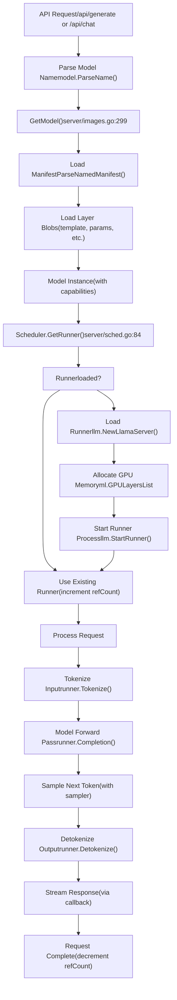
**Sources:** [server/routes.go178-646](https://github.com/ollama/ollama/blob/562c76d7/server/routes.go#L178-L646) [server/sched.go84-117](https://github.com/ollama/ollama/blob/562c76d7/server/sched.go#L84-L117) [llm/server.go142-316](https://github.com/ollama/ollama/blob/562c76d7/llm/server.go#L142-L316)

---

## Summary

The key concepts in Ollama form a layered system:

1.  **Models** are identified by names and composed of multiple layers
2.  **Manifests** index layers using content-addressed blob storage
3.  **Runners** execute models through the `LlamaServer` interface
4.  **The Scheduler** manages runner lifecycle and GPU allocation
5.  **Capabilities** determine what operations a model supports
6.  **Context/KV Cache** provides working memory for inference
7.  **Options** control runtime behavior with hierarchical merging

These concepts work together to provide efficient, concurrent model execution with automatic resource management. Understanding them is essential for working with any part of the Ollama codebase.

**Sources:** [server/images.go](https://github.com/ollama/ollama/blob/562c76d7/server/images.go) [server/routes.go](https://github.com/ollama/ollama/blob/562c76d7/server/routes.go) [server/sched.go](https://github.com/ollama/ollama/blob/562c76d7/server/sched.go) [llm/server.go](https://github.com/ollama/ollama/blob/562c76d7/llm/server.go) [api/types.go](https://github.com/ollama/ollama/blob/562c76d7/api/types.go)
