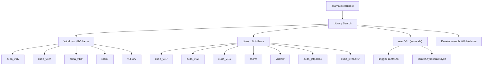

# System Requirements

Relevant source files

-   [.github/workflows/release.yaml](https://github.com/ollama/ollama/blob/562c76d7/.github/workflows/release.yaml)
-   [.github/workflows/test-install.yaml](https://github.com/ollama/ollama/blob/562c76d7/.github/workflows/test-install.yaml)
-   [.github/workflows/test.yaml](https://github.com/ollama/ollama/blob/562c76d7/.github/workflows/test.yaml)
-   [Dockerfile](https://github.com/ollama/ollama/blob/562c76d7/Dockerfile)
-   [README.md](https://github.com/ollama/ollama/blob/562c76d7/README.md?plain=1)
-   [app/ollama.iss](https://github.com/ollama/ollama/blob/562c76d7/app/ollama.iss)
-   [docs/README.md](https://github.com/ollama/ollama/blob/562c76d7/docs/README.md?plain=1)
-   [docs/api.md](https://github.com/ollama/ollama/blob/562c76d7/docs/api.md?plain=1)
-   [docs/development.md](https://github.com/ollama/ollama/blob/562c76d7/docs/development.md?plain=1)
-   [docs/images/ollama-keys.png](https://github.com/ollama/ollama/blob/562c76d7/docs/images/ollama-keys.png)
-   [docs/images/signup.png](https://github.com/ollama/ollama/blob/562c76d7/docs/images/signup.png)
-   [scripts/build\_darwin.sh](https://github.com/ollama/ollama/blob/562c76d7/scripts/build_darwin.sh)
-   [scripts/build\_linux.sh](https://github.com/ollama/ollama/blob/562c76d7/scripts/build_linux.sh)
-   [scripts/build\_windows.ps1](https://github.com/ollama/ollama/blob/562c76d7/scripts/build_windows.ps1)
-   [scripts/deduplicate\_cuda\_libs.sh](https://github.com/ollama/ollama/blob/562c76d7/scripts/deduplicate_cuda_libs.sh)
-   [scripts/install.ps1](https://github.com/ollama/ollama/blob/562c76d7/scripts/install.ps1)
-   [scripts/install.sh](https://github.com/ollama/ollama/blob/562c76d7/scripts/install.sh)

This document specifies the hardware, operating system, and software requirements for running and developing Ollama. It covers supported platforms, architectures, GPU backends, and minimum specifications needed for installation and operation.

For build and compilation requirements, see [Building from Source](/ollama/ollama/8.1-building-from-source). For GPU setup and troubleshooting, see [GPU Discovery and Backend Loading](/ollama/ollama/6.1-gpu-discovery-and-backend-loading) and [Installation and Setup](/ollama/ollama/6.2-installation-and-setup).

## Supported Platforms

Ollama runs on macOS, Windows, Linux, and Docker environments. Each platform has specific requirements and supported GPU acceleration backends.

### Platform Support Matrix

```mermaid
flowchart TD
    Linux_amd64["amd64(x86_64)"]
    Linux_CUDA["NVIDIA CUDA11/12/13"]
    Linux_ROCm["AMD ROCm 6"]
    Linux_Vulkan["Vulkan"]
    Linux_arm64["arm64(aarch64)"]
    Linux_JetPack["NVIDIA JetPack5/6"]
    Win_amd64["amd64(x86_64)"]
    Win_CUDA["NVIDIA CUDA11/12/13"]
    Win_ROCm["AMD ROCm 6"]
    Win_Vulkan["Vulkan SDK"]
    Win_arm64["arm64(ARM64)"]
    macOS_arm64["arm64(Apple Silicon)"]
    macOS_Metal["Metal GPUBuilt-in"]
    macOS_amd64["amd64(Intel)"]

    Linux --> amd64_Linux_CUDA
    Linux --> amd64_Linux_ROCm
    Linux --> amd64_Linux_Vulkan
    Linux --> arm64_Linux_CUDA
    Linux --> arm64_Linux_JetPack
    Win --> amd64_Win_CUDA
    Win --> amd64_Win_ROCm
    Win --> amd64_Win_Vulkan
    macOS --> arm64_macOS_Metal
    macOS --> amd64_macOS_Metal
```


**Sources:** [README.md13-39](https://github.com/ollama/ollama/blob/562c76d7/README.md?plain=1#L13-L39) [.github/workflows/release.yaml29-214](https://github.com/ollama/ollama/blob/562c76d7/.github/workflows/release.yaml#L29-L214) [Dockerfile13-37](https://github.com/ollama/ollama/blob/562c76d7/Dockerfile#L13-L37)

### Architecture Detection

The install scripts detect system architecture and map to normalized identifiers used throughout the build and distribution system.

| System Output | Normalized | Used In |
| --- | --- | --- |
| `x86_64` | `amd64` | Binary distribution |
| `aarch64` | `arm64` | Binary distribution |
| `arm64` | `arm64` | macOS systems |

**Sources:** [scripts/install.sh35-40](https://github.com/ollama/ollama/blob/562c76d7/scripts/install.sh#L35-L40)

## Operating System Requirements

### macOS

-   **Minimum Version:** macOS 14.0 (Sonoma)
-   **Supported Architectures:** arm64 (Apple Silicon), amd64 (Intel)
-   **GPU Backend:** Metal (built-in, no additional drivers required)
-   **Runtime Dependencies:**
    -   `curl`
    -   `unzip`

The macOS build uses `CGO_LDFLAGS="-mmacosx-version-min=14.0"` to ensure compatibility with macOS 14.0 and later.

**Sources:** [scripts/build\_darwin.sh17-19](https://github.com/ollama/ollama/blob/562c76d7/scripts/build_darwin.sh#L17-L19) [scripts/install.sh48-93](https://github.com/ollama/ollama/blob/562c76d7/scripts/install.sh#L48-L93) [.github/workflows/release.yaml42-44](https://github.com/ollama/ollama/blob/562c76d7/.github/workflows/release.yaml#L42-L44)

### Windows

-   **Minimum Version:** Windows 10 (build 10240 or later)
-   **Recommended:** Windows 10 22H2 or newer for proper Unicode rendering
-   **Supported Architectures:** amd64, arm64
-   **Runtime Dependencies:**
    -   Visual C++ Redistributables (automatically installed)
    -   Git, gzip (for arm64 systems)

Windows arm64 currently supports CPU-only inference. GPU acceleration (CUDA, ROCm, Vulkan) is available only on amd64.

**Sources:** [app/ollama.iss58-65](https://github.com/ollama/ollama/blob/562c76d7/app/ollama.iss#L58-L65) [docs/development.md41-91](https://github.com/ollama/ollama/blob/562c76d7/docs/development.md?plain=1#L41-L91) [scripts/build\_windows.ps1295-301](https://github.com/ollama/ollama/blob/562c76d7/scripts/build_windows.ps1#L295-L301) [.github/workflows/release.yaml232-244](https://github.com/ollama/ollama/blob/562c76d7/.github/workflows/release.yaml#L232-L244)

### Linux

-   **Supported Distributions:**
    -   Ubuntu/Debian
    -   RHEL/CentOS/Rocky/Fedora
    -   Arch Linux
    -   Amazon Linux
    -   Any systemd-based distribution
-   **Supported Architectures:** amd64, arm64
-   **Base Requirements:**
    -   GCC v10 or later (v10.2.1 recommended, v10.3 has regressions)
    -   `curl`, `awk`, `grep`, `sed`, `tee`, `xargs`
    -   `zstd` (for versions using `.tar.zst` format)

**Sources:** [scripts/install.sh99-127](https://github.com/ollama/ollama/blob/562c76d7/scripts/install.sh#L99-L127) [Dockerfile13-20](https://github.com/ollama/ollama/blob/562c76d7/Dockerfile#L13-L20)

### NVIDIA Jetson

Special support for NVIDIA Jetson embedded systems:

-   **JetPack 5:** Based on CUDA 11 (r35.4.1)
-   **JetPack 6:** Based on CUDA 12 (r36.4.0)
-   **Architecture:** arm64 only

Detection: System must have `/etc/nv_tegra_release` file.

**Sources:** [scripts/install.sh178-187](https://github.com/ollama/ollama/blob/562c76d7/scripts/install.sh#L178-L187) [Dockerfile104-126](https://github.com/ollama/ollama/blob/562c76d7/Dockerfile#L104-L126)

### WSL2

Windows Subsystem for Linux 2 is supported:

-   **Detection:** Kernel name contains `microsoft*WSL2` or `microsoft*wsl2`
-   **GPU Support:** Only via NVIDIA passthrough with `nvidia-smi` available
-   **WSL1 Not Supported:** Script exits with error for WSL1

**Sources:** [scripts/install.sh101-108](https://github.com/ollama/ollama/blob/562c76d7/scripts/install.sh#L101-L108) [scripts/install.sh254-262](https://github.com/ollama/ollama/blob/562c76d7/scripts/install.sh#L254-L262)

## GPU Requirements

### GPU Backend Distribution


**Sources:** [Dockerfile44-134](https://github.com/ollama/ollama/blob/562c76d7/Dockerfile#L44-L134) [.github/workflows/release.yaml55-135](https://github.com/ollama/ollama/blob/562c76d7/.github/workflows/release.yaml#L55-L135)

### NVIDIA CUDA

**Supported Versions:**

-   CUDA 11.8 (legacy, compatibility with older GPUs)
-   CUDA 12.8 (current stable)
-   CUDA 13.0 (latest)

**Component Requirements:**

-   `cudart` (CUDA Runtime)
-   `nvcc` (CUDA Compiler)
-   `cublas` (CUDA Basic Linear Algebra)
-   `cublas_dev` (cuBLAS Development)
-   For CUDA 13: `crt`, `nvvm`, `nvptxcompiler`

**Architecture Support:**

-   Compute Capability: Minimum depends on CUDA version
-   Test configurations use compute capability 80-87

**Installation Paths:**

-   Windows: `C:\Program Files\NVIDIA GPU Computing Toolkit\CUDA\v{major}`
-   Linux: `/usr/local/cuda-{major}`

**Detection Method:** The install script detects NVIDIA GPUs by:

1.  Checking `nvidia-smi` availability
2.  Using `lspci -d '10de:'` (PCI vendor ID 10de = NVIDIA)
3.  Using `lshw -c display -numeric -disable network` looking for vendor `[10DE]`

**Sources:** [.github/workflows/release.yaml80-106](https://github.com/ollama/ollama/blob/562c76d7/.github/workflows/release.yaml#L80-L106) [Dockerfile55-90](https://github.com/ollama/ollama/blob/562c76d7/Dockerfile#L55-L90) [scripts/install.sh277-353](https://github.com/ollama/ollama/blob/562c76d7/scripts/install.sh#L277-L353)

### AMD ROCm

**Supported Version:** ROCm 6.3.3

**Platform Support:**

-   Linux: amd64 only
-   Windows: amd64 only

**Component Requirements:**

-   `rocm-libs` (on Linux)
-   HIP compiler toolchain
-   ROCBLAS library

**Architecture Filtering:** The build process removes `gfx906*` architectures from the ROCBLAS library to reduce distribution size.

**Installation Paths:**

-   Windows: `C:\Program Files\AMD\ROCm\{version}`
-   Linux: `/opt/rocm`

**Environment Variables:**

-   `HIP_PLATFORM=amd`
-   `CMAKE_PREFIX_PATH` pointing to ROCm installation
-   `HIPCXX` pointing to clang++

**Detection Method:** The install script detects AMD GPUs by:

1.  Using `lspci -d '1002:'` (PCI vendor ID 1002 = AMD)
2.  Using `lshw -c display -numeric -disable network` looking for vendor `[1002]`

**Sources:** [Dockerfile93-102](https://github.com/ollama/ollama/blob/562c76d7/Dockerfile#L93-L102) [.github/workflows/release.yaml109-113](https://github.com/ollama/ollama/blob/562c76d7/.github/workflows/release.yaml#L109-L113) [scripts/install.sh305-310](https://github.com/ollama/ollama/blob/562c76d7/scripts/install.sh#L305-L310) [scripts/build\_windows.ps1184-215](https://github.com/ollama/ollama/blob/562c76d7/scripts/build_windows.ps1#L184-L215)

### Apple Metal

**Platform:** macOS only (both Apple Silicon and Intel)

**Requirements:**

-   Built-in to macOS 14.0+
-   No additional drivers or SDKs required
-   Uses Accelerate framework

**Component Flags:**

```
CGO_LDFLAGS: -lc++ -framework Metal -framework Foundation -framework Accelerate
```
**Sources:** [scripts/build\_darwin.sh17-19](https://github.com/ollama/ollama/blob/562c76d7/scripts/build_darwin.sh#L17-L19) [scripts/build\_darwin.sh62-75](https://github.com/ollama/ollama/blob/562c76d7/scripts/build_darwin.sh#L62-L75)

### Vulkan

**Supported Version:** 1.4.321.1

**Platform Support:**

-   Linux: amd64
-   Windows: amd64

**Use Cases:**

-   Fallback for AMD/Intel GPUs
-   Systems without CUDA or ROCm

**Component Requirements:**

-   Vulkan SDK headers
-   Vulkan loader library
-   Shaderc compiler

**Installation:**

-   Linux: Via package manager (`vulkan-sdk`) or LunarG SDK
-   Windows: LunarG SDK installer

**Environment Variables:**

-   `VULKAN_SDK` must point to SDK installation

**Sources:** [Dockerfile21-30](https://github.com/ollama/ollama/blob/562c76d7/Dockerfile#L21-L30) [docs/development.md52-103](https://github.com/ollama/ollama/blob/562c76d7/docs/development.md?plain=1#L52-L103) [.github/workflows/release.yaml115-119](https://github.com/ollama/ollama/blob/562c76d7/.github/workflows/release.yaml#L115-L119)

## Hardware Requirements

### CPU Requirements

**Minimum:**

-   64-bit processor (x86\_64 or ARM64)
-   No specific CPU generation requirement

**Compiler Requirements (Development):**

-   GCC 10.2.1 or later (10.3 has known regressions)
-   Clang (for macOS, ROCm builds)
-   MSVC 2022 (for Windows CUDA 12/13)
-   MSVC 2019 (for Windows CUDA 11 compatibility)

**Sources:** [Dockerfile13-20](https://github.com/ollama/ollama/blob/562c76d7/Dockerfile#L13-L20) [docs/development.md6](https://github.com/ollama/ollama/blob/562c76d7/docs/development.md?plain=1#L6-L6)

### Memory Requirements

Memory requirements depend on model size. The system uses memory-mapped file I/O (`use_mmap`) for efficient model loading.

**Model Loading:**

-   Models are loaded from content-addressed blobs at `~/.ollama/blobs`
-   KV cache requires additional memory proportional to context length
-   Multiple models can be kept loaded based on `OLLAMA_MAX_LOADED_MODELS`

**Sources:** [docs/api.md417](https://github.com/ollama/ollama/blob/562c76d7/docs/api.md?plain=1#L417-L417) [docs/development.md178-179](https://github.com/ollama/ollama/blob/562c76d7/docs/development.md?plain=1#L178-L179)

### Storage Requirements

**Minimum Installation:**

-   macOS: ~500MB (Ollama.app bundle)
-   Windows: Varies by GPU backend selection
-   Linux: ~300MB base + GPU backend libraries

**Model Storage:**

-   Models stored at `~/.ollama/` (Linux/macOS) or `%USERPROFILE%\.ollama\` (Windows)
-   Size varies by model (typically 2GB-70GB per model)
-   Content-addressed storage allows layer deduplication

**Sources:** [scripts/install.sh164-176](https://github.com/ollama/ollama/blob/562c76d7/scripts/install.sh#L164-L176) [app/ollama.iss138-148](https://github.com/ollama/ollama/blob/562c76d7/app/ollama.iss#L138-L148)

## Runtime Dependencies

### Required Tools

```mermaid
flowchart TD
    Install["install.sh/install.ps1"]
    Detect["Platform Detection"]
    macOS_Tools["macOS Tools"]
    Linux_Tools["Linux Tools"]
    Windows_Tools["Windows Tools"]
    curl["curl"]
    unzip["unzip"]
    curl2["curl"]
    awk["awk"]
    grep["grep"]
    sed["sed"]
    tee["tee"]
    xargs["xargs"]
    zstd["zstd"]
    pwsh["PowerShell 5.1+"]
    webclient["WebClient/.NET"]

    Install --> Detect
    Detect --> macOS_Tools
    Detect --> Linux_Tools
    Detect --> Windows_Tools
    macOS --> Tools_curl
    macOS --> Tools_unzip
    Linux --> Tools_curl2
    Linux --> Tools_awk
    Linux --> Tools_grep
    Linux --> Tools_sed
    Linux --> Tools_tee
    Linux --> Tools_xargs
    Linux --> Tools_zstd
    Windows --> Tools_pwsh
    Windows --> Tools_webclient
```


**Sources:** [scripts/install.sh120-127](https://github.com/ollama/ollama/blob/562c76d7/scripts/install.sh#L120-L127) [scripts/install.ps140-52](https://github.com/ollama/ollama/blob/562c76d7/scripts/install.ps1#L40-L52)

### Linux Package Dependencies

**Archive Extraction:**

-   Newer versions: `zstd` (for `.tar.zst` format)
-   Fallback: `tar` with gzip (for `.tgz` format)

**GPU Driver Installation (Linux):**

-   `lspci` or `lshw` (for GPU detection)
-   `dkms` (for NVIDIA driver compilation)
-   `kernel-devel` or `kernel-headers` (matching running kernel)

**Service Management:**

-   `systemctl` (for systemd service setup)

**Sources:** [scripts/install.sh136-157](https://github.com/ollama/ollama/blob/562c76d7/scripts/install.sh#L136-L157) [scripts/install.sh416-438](https://github.com/ollama/ollama/blob/562c76d7/scripts/install.sh#L416-L438)

### Windows Package Dependencies

**Visual C++ Redistributables:**

-   amd64: `vc_redist.x64.exe`
-   arm64: `vc_redist.arm64.exe`
-   Automatically downloaded and installed by installer

**Optional Build Tools:**

-   CMake 3.31.2+
-   Ninja build system
-   Visual Studio 2022 with Native Desktop Workload

**Sources:** [app/ollama.iss122-126](https://github.com/ollama/ollama/blob/562c76d7/app/ollama.iss#L122-L126) [scripts/build\_windows.ps1295-301](https://github.com/ollama/ollama/blob/562c76d7/scripts/build_windows.ps1#L295-L301) [docs/development.md44-78](https://github.com/ollama/ollama/blob/562c76d7/docs/development.md?plain=1#L44-L78)

## Development Requirements

For building Ollama from source, additional requirements apply beyond runtime needs.

### Required Development Tools

| Tool | Minimum Version | Purpose |
| --- | --- | --- |
| Go | Version in go.mod | Primary language |
| CMake | 3.31.2 | Build system |
| GCC (Linux) | 10.2.1 | C/C++ compilation |
| Clang (macOS) | System version | C/C++ compilation |
| MSVC (Windows) | VS 2022 | C/C++ compilation |
| Node.js | 20.x | UI development |
| TypeScript | Latest | UI type checking |

**Sources:** [docs/development.md3-6](https://github.com/ollama/ollama/blob/562c76d7/docs/development.md?plain=1#L3-L6) [Dockerfile40](https://github.com/ollama/ollama/blob/562c76d7/Dockerfile#L40-L40) [.github/workflows/test.yaml214-216](https://github.com/ollama/ollama/blob/562c76d7/.github/workflows/test.yaml#L214-L216)

### Optional Development Dependencies

**GPU Backend Development:**

-   CUDA SDK (11.8, 12.8, or 13.0)
-   ROCm SDK (6.x)
-   Vulkan SDK (1.4.321.1)

**Testing:**

-   `tscriptify` (for Go-to-TypeScript codegen)
-   `golangci-lint` (for code quality)

**Sources:** [docs/development.md47-103](https://github.com/ollama/ollama/blob/562c76d7/docs/development.md?plain=1#L47-L103) [.github/workflows/test.yaml220-236](https://github.com/ollama/ollama/blob/562c76d7/.github/workflows/test.yaml#L220-L236)

## Library Detection

At runtime, Ollama searches for acceleration libraries in specific paths relative to the `ollama` executable:


**Fallback Behavior:** If no GPU libraries are found, Ollama falls back to CPU-only inference using `ggml-cpu`.

**Sources:** [docs/development.md170-179](https://github.com/ollama/ollama/blob/562c76d7/docs/development.md?plain=1#L170-L179)

## Environment Variables

Key environment variables that affect runtime behavior:

| Variable | Purpose | Default |
| --- | --- | --- |
| `OLLAMA_HOST` | API server bind address | `127.0.0.1:11434` |
| `OLLAMA_MODELS` | Model storage location | `~/.ollama/models` |
| `OLLAMA_MAX_LOADED_MODELS` | Max concurrent models | Varies |
| `OLLAMA_NO_START` | Skip auto-start after install | Not set |
| `PATH` | Include Ollama binary location | Updated by installer |

**Docker Specific:**

-   `OLLAMA_HOST=0.0.0.0:11434` (listen on all interfaces)
-   `NVIDIA_VISIBLE_DEVICES=all` (GPU passthrough)
-   `NVIDIA_DRIVER_CAPABILITIES=compute,utility` (required capabilities)

**Sources:** [scripts/install.sh86-89](https://github.com/ollama/ollama/blob/562c76d7/scripts/install.sh#L86-L89) [Dockerfile208-213](https://github.com/ollama/ollama/blob/562c76d7/Dockerfile#L208-L213) [app/ollama.iss160-167](https://github.com/ollama/ollama/blob/562c76d7/app/ollama.iss#L160-L167)
