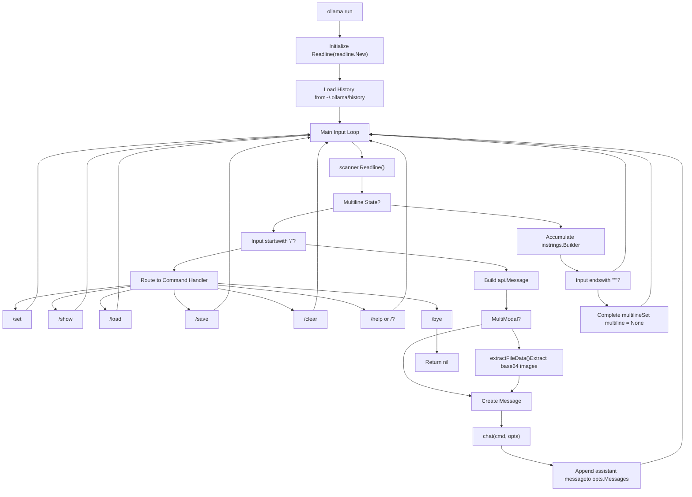
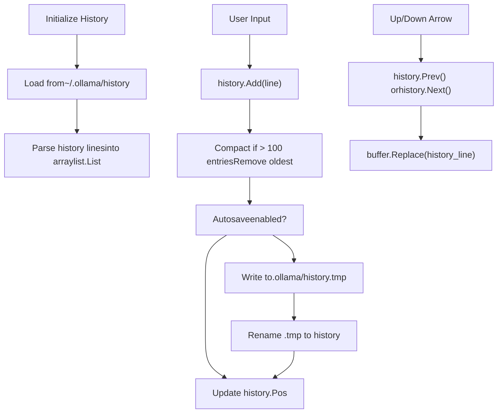
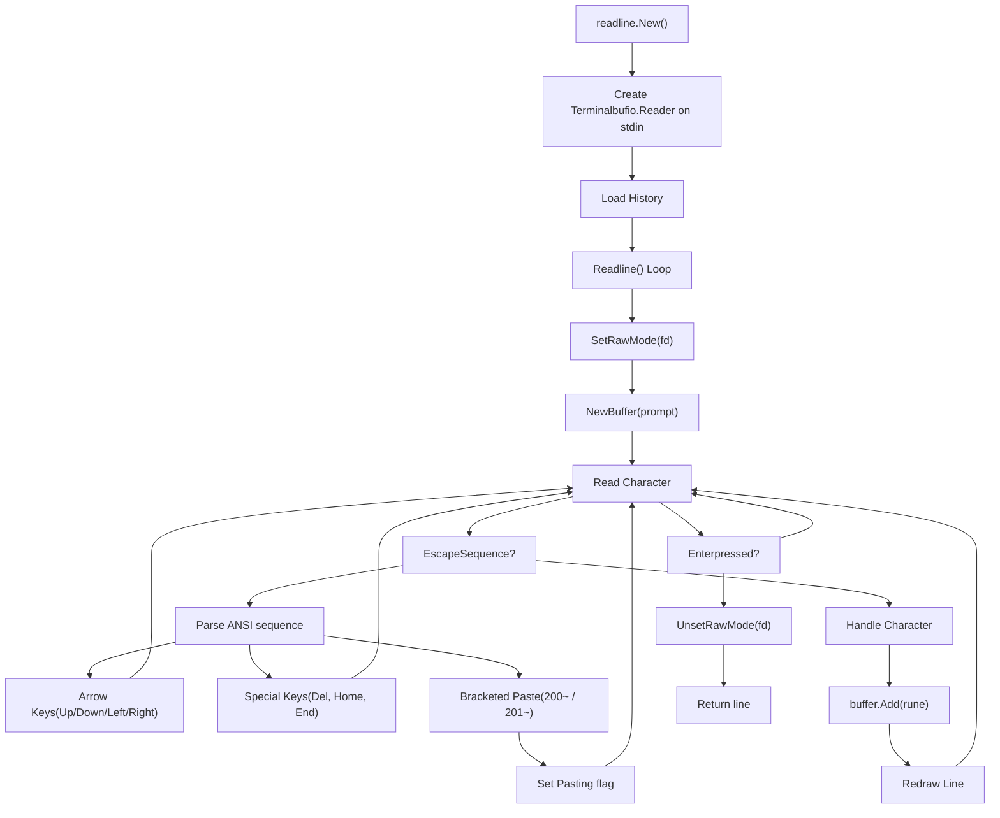
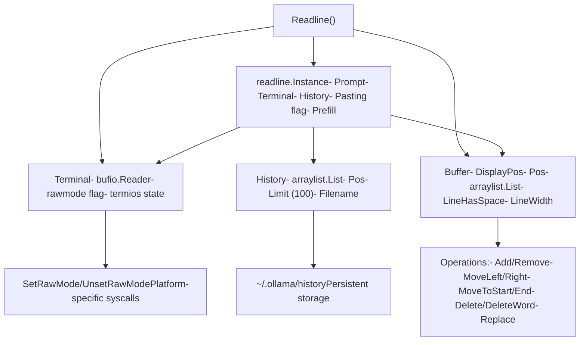

# Command Line Interface

Relevant source files

-   [README.md](https://github.com/ollama/ollama/blob/562c76d7/README.md?plain=1)
-   [cmd/editor\_unix.go](https://github.com/ollama/ollama/blob/562c76d7/cmd/editor_unix.go)
-   [cmd/editor\_windows.go](https://github.com/ollama/ollama/blob/562c76d7/cmd/editor_windows.go)
-   [cmd/interactive.go](https://github.com/ollama/ollama/blob/562c76d7/cmd/interactive.go)
-   [cmd/interactive\_test.go](https://github.com/ollama/ollama/blob/562c76d7/cmd/interactive_test.go)
-   [docs/README.md](https://github.com/ollama/ollama/blob/562c76d7/docs/README.md?plain=1)
-   [docs/api.md](https://github.com/ollama/ollama/blob/562c76d7/docs/api.md?plain=1)
-   [docs/development.md](https://github.com/ollama/ollama/blob/562c76d7/docs/development.md?plain=1)
-   [docs/images/ollama-keys.png](https://github.com/ollama/ollama/blob/562c76d7/docs/images/ollama-keys.png)
-   [docs/images/signup.png](https://github.com/ollama/ollama/blob/562c76d7/docs/images/signup.png)
-   [readline/buffer.go](https://github.com/ollama/ollama/blob/562c76d7/readline/buffer.go)
-   [readline/errors.go](https://github.com/ollama/ollama/blob/562c76d7/readline/errors.go)
-   [readline/history.go](https://github.com/ollama/ollama/blob/562c76d7/readline/history.go)
-   [readline/readline.go](https://github.com/ollama/ollama/blob/562c76d7/readline/readline.go)
-   [readline/readline\_unix.go](https://github.com/ollama/ollama/blob/562c76d7/readline/readline_unix.go)
-   [readline/readline\_windows.go](https://github.com/ollama/ollama/blob/562c76d7/readline/readline_windows.go)
-   [readline/term.go](https://github.com/ollama/ollama/blob/562c76d7/readline/term.go)
-   [readline/term\_bsd.go](https://github.com/ollama/ollama/blob/562c76d7/readline/term_bsd.go)
-   [readline/term\_linux.go](https://github.com/ollama/ollama/blob/562c76d7/readline/term_linux.go)
-   [readline/term\_windows.go](https://github.com/ollama/ollama/blob/562c76d7/readline/term_windows.go)
-   [readline/types.go](https://github.com/ollama/ollama/blob/562c76d7/readline/types.go)

This document describes Ollama's command-line interface, including standard commands, interactive mode features, keyboard shortcuts, and session management. The CLI provides the primary user interface for running models, managing conversations, and configuring runtime parameters.

For information about the HTTP API that the CLI communicates with, see [HTTP Server and API Layer](/ollama/ollama/2.1-http-server-and-api-layer). For details about model management operations, see [Model Management](/ollama/ollama/4-model-management).

## Overview

The Ollama CLI provides both single-command execution and an interactive chat mode. All CLI commands communicate with the local Ollama server via HTTP API calls to `localhost:11434`.

**Main Commands:**

-   `ollama run <model>` - Run and interact with a model
-   `ollama create <name>` - Create a model from a Modelfile
-   `ollama pull <model>` - Download a model from the registry
-   `ollama push <model>` - Upload a model to the registry
-   `ollama list` - List locally available models
-   `ollama show <model>` - Display model information
-   `ollama cp <source> <dest>` - Copy a model
-   `ollama rm <model>` - Delete a model
-   `ollama serve` - Start the Ollama server
-   `ollama launch <integration>` - Launch integrations like Claude Code, Codex, etc.

Sources: [README.md54-86](https://github.com/ollama/ollama/blob/562c76d7/README.md?plain=1#L54-L86) [cmd/interactive.go33-533](https://github.com/ollama/ollama/blob/562c76d7/cmd/interactive.go#L33-L533)

## Interactive Mode

Interactive mode is entered automatically when running `ollama run <model>` or by executing `ollama` without arguments. This mode provides a conversational interface with advanced features for multi-turn chat sessions.


**Interactive Mode Features:**

-   Multi-turn conversations with automatic context management
-   Multiline input using triple quotes (`"""`)
-   Image attachment for multimodal models
-   Command history with navigation (Up/Down arrows)
-   Session save/load functionality
-   Real-time parameter adjustment
-   External editor support (Ctrl+G)

Sources: [cmd/interactive.go33-533](https://github.com/ollama/ollama/blob/562c76d7/cmd/interactive.go#L33-L533) [readline/readline.go48-341](https://github.com/ollama/ollama/blob/562c76d7/readline/readline.go#L48-L341)

## Interactive Commands

### Session Control Commands

| Command | Description | Example |
| --- | --- | --- |
| `/set history` | Enable command history | `/set history` |
| `/set nohistory` | Disable command history | `/set nohistory` |
| `/set wordwrap` | Enable word wrapping | `/set wordwrap` |
| `/set nowordwrap` | Disable word wrapping | `/set nowordwrap` |
| `/set verbose` | Show LLM statistics | `/set verbose` |
| `/set quiet` | Hide LLM statistics | `/set quiet` |
| `/set think` | Enable thinking mode | `/set think` or `/set think deep` |
| `/set nothink` | Disable thinking mode | `/set nothink` |
| `/set format json` | Enable JSON response mode | `/set format json` |
| `/set noformat` | Disable response formatting | `/set noformat` |

Sources: [cmd/interactive.go274-393](https://github.com/ollama/ollama/blob/562c76d7/cmd/interactive.go#L274-L393)

### Model Information Commands

| Command | Description | Output |
| --- | --- | --- |
| `/show info` | Display model details | Architecture, parameters, quantization |
| `/show license` | Display model license | License text if available |
| `/show modelfile` | Display the Modelfile | Complete Modelfile specification |
| `/show parameters` | Display model parameters | All parameter values |
| `/show system` | Display system message | Current system prompt |
| `/show template` | Display prompt template | Template formatting string |

Sources: [cmd/interactive.go394-461](https://github.com/ollama/ollama/blob/562c76d7/cmd/interactive.go#L394-L461)

### Parameter Configuration

Parameters can be set during a session using `/set parameter <name> <value>`:

```
/set parameter temperature 0.8
/set parameter num_ctx 4096
/set parameter top_p 0.9
/set parameter stop "\n" "END"
```
**Common Parameters:**

-   `seed` - Random number seed for reproducibility
-   `num_predict` - Maximum tokens to generate
-   `top_k` - Top-k sampling parameter
-   `top_p` - Nucleus sampling threshold
-   `min_p` - Minimum probability threshold
-   `num_ctx` - Context window size
-   `temperature` - Sampling temperature (creativity)
-   `repeat_penalty` - Repetition penalty strength
-   `repeat_last_n` - Lookback window for repetition
-   `num_gpu` - Number of layers to offload to GPU
-   `stop` - Stop sequences (can specify multiple)

Sources: [cmd/interactive.go100-115](https://github.com/ollama/ollama/blob/562c76d7/cmd/interactive.go#L100-L115) [cmd/interactive.go337-350](https://github.com/ollama/ollama/blob/562c76d7/cmd/interactive.go#L337-L350)

### System Message Configuration

Set or modify the system message (instructions for the model):

```
/set system You are a helpful coding assistant.
```
For multiline system messages, use triple quotes:

```
/set system """
You are a helpful assistant.
You should always be polite and concise.
You specialize in Python programming.
"""
```
Sources: [cmd/interactive.go350-387](https://github.com/ollama/ollama/blob/562c76d7/cmd/interactive.go#L350-L387)

### Session Management

| Command | Description | Example |
| --- | --- | --- |
| `/load <model>` | Load a different model | `/load llama3:70b` |
| `/save <name>` | Save current session as new model | `/save my-assistant` |
| `/clear` | Clear conversation context | `/clear` |
| `/list` | List available models | `/list` |

When using `/save`, the current conversation history and system message are saved into a new model that inherits from the current model. This creates a "session snapshot" that can be loaded later.

Sources: [cmd/interactive.go208-265](https://github.com/ollama/ollama/blob/562c76d7/cmd/interactive.go#L208-L265)

## Keyboard Shortcuts

The interactive mode uses a custom readline implementation with the following keyboard shortcuts:

```mermaid
flowchart TD
    CtrlL["Ctrl+L"]
    ClearScreen["Clear screen"]
    CtrlG["Ctrl+G"]
    ExtEditor["Open external editor"]
    CtrlC["Ctrl+C"]
    Interrupt["Cancel current input"]
    CtrlD["Ctrl+D"]
    Exit["Exit interactive mode"]
    CtrlJ["Ctrl+J"]
    Multiline["New line (multiline mode)"]
    CtrlP["Ctrl+P / Up"]
    PrevHist["Previous history entry"]
    CtrlN["Ctrl+N / Down"]
    NextHist["Next history entry"]
    CtrlK["Ctrl+K"]
    KillLine["Delete to end of line"]
    CtrlU["Ctrl+U"]
    KillBefore["Delete to beginning of line"]
    CtrlW["Ctrl+W"]
    KillWord["Delete word before cursor"]
    Backspace["Backspace"]
    DelChar["Delete character before cursor"]
    Delete["Delete"]
    DelCharAfter["Delete character after cursor"]
    CtrlA["Ctrl+A"]
    BOL["Move to beginning of line"]
    CtrlE["Ctrl+E"]
    EOL["Move to end of line"]
    AltB["Alt+B"]
    WordLeft["Move back one word"]
    AltF["Alt+F"]
    WordRight["Move forward one word"]

    CtrlL --> ClearScreen
    CtrlG --> ExtEditor
    CtrlC --> Interrupt
    CtrlD --> Exit
    CtrlJ --> Multiline
    CtrlP --> PrevHist
    CtrlN --> NextHist
    CtrlK --> KillLine
    CtrlU --> KillBefore
    CtrlW --> KillWord
    Backspace --> DelChar
    Delete --> DelCharAfter
    CtrlA --> BOL
    CtrlE --> EOL
    AltB --> WordLeft
    AltF --> WordRight
```


**Full Shortcut Reference:**

| Shortcut | Action | Implementation |
| --- | --- | --- |
| Ctrl+A / Home | Move to beginning of line | [readline/readline.go231-232](https://github.com/ollama/ollama/blob/562c76d7/readline/readline.go#L231-L232) |
| Ctrl+E / End | Move to end of line | [readline/readline.go233-234](https://github.com/ollama/ollama/blob/562c76d7/readline/readline.go#L233-L234) |
| Alt+B | Move backward one word | [readline/buffer.go80-99](https://github.com/ollama/ollama/blob/562c76d7/readline/buffer.go#L80-L99) |
| Alt+F | Move forward one word | [readline/buffer.go124-138](https://github.com/ollama/ollama/blob/562c76d7/readline/buffer.go#L124-L138) |
| Ctrl+K | Delete to end of line | [readline/buffer.go421-428](https://github.com/ollama/ollama/blob/562c76d7/readline/buffer.go#L421-L428) |
| Ctrl+U | Delete to beginning of line | [readline/buffer.go413-419](https://github.com/ollama/ollama/blob/562c76d7/readline/buffer.go#L413-L419) |
| Ctrl+W | Delete word before cursor | [readline/buffer.go430-451](https://github.com/ollama/ollama/blob/562c76d7/readline/buffer.go#L430-L451) |
| Ctrl+L | Clear screen | [readline/buffer.go453-483](https://github.com/ollama/ollama/blob/562c76d7/readline/buffer.go#L453-L483) |
| Ctrl+G | Open external editor | [cmd/interactive.go153-164](https://github.com/ollama/ollama/blob/562c76d7/cmd/interactive.go#L153-L164) |
| Ctrl+C | Interrupt current input | [readline/readline.go223-226](https://github.com/ollama/ollama/blob/562c76d7/readline/readline.go#L223-L226) |
| Ctrl+D | Exit Ollama | [readline/readline.go262-267](https://github.com/ollama/ollama/blob/562c76d7/readline/readline.go#L262-L267) |
| Ctrl+P / Up Arrow | Previous history | [readline/readline.go165-168](https://github.com/ollama/ollama/blob/562c76d7/readline/readline.go#L165-L168) |
| Ctrl+N / Down Arrow | Next history | [readline/readline.go167-168](https://github.com/ollama/ollama/blob/562c76d7/readline/readline.go#L167-L168) |
| Ctrl+J | Newline (multiline mode) | [readline/readline.go302-316](https://github.com/ollama/ollama/blob/562c76d7/readline/readline.go#L302-L316) |
| Enter | Submit input | [readline/readline.go317-330](https://github.com/ollama/ollama/blob/562c76d7/readline/readline.go#L317-L330) |

Sources: [cmd/interactive.go72-86](https://github.com/ollama/ollama/blob/562c76d7/cmd/interactive.go#L72-L86) [readline/readline.go218-340](https://github.com/ollama/ollama/blob/562c76d7/readline/readline.go#L218-L340) [readline/buffer.go52-527](https://github.com/ollama/ollama/blob/562c76d7/readline/buffer.go#L52-L527)

## Multiline Input

Multiline messages can be created using triple quotes (`"""`):

```
>>> """
... This is a multiline
... message that spans
... multiple lines.
... """
```
The prompt changes to `...` while in multiline mode. Alternatively, use Ctrl+J to insert newlines without submitting.

When multiline input is detected, the state machine transitions to `MultilinePrompt` or `MultilineSystem` mode:

Sources: [cmd/interactive.go25-31](https://github.com/ollama/ollama/blob/562c76d7/cmd/interactive.go#L25-L31) [cmd/interactive.go169-199](https://github.com/ollama/ollama/blob/562c76d7/cmd/interactive.go#L169-L199)

## Multimodal Support

For models with vision capabilities, images can be included in prompts by referencing file paths:

```
>>> Describe this image: /path/to/image.jpg
```
**Supported Image Formats:**

-   `.jpg` / `.jpeg`
-   `.png`
-   `.webp`

**Image Processing:**

1.  File paths are extracted using regex pattern: [cmd/interactive.go583-590](https://github.com/ollama/ollama/blob/562c76d7/cmd/interactive.go#L583-L590)
2.  Paths are normalized to handle escaped spaces and special characters: [cmd/interactive.go563-581](https://github.com/ollama/ollama/blob/562c76d7/cmd/interactive.go#L563-L581)
3.  Images are validated for type and size (max 100MB): [cmd/interactive.go666-708](https://github.com/ollama/ollama/blob/562c76d7/cmd/interactive.go#L666-L708)
4.  Images are base64-encoded and attached to the message: [cmd/interactive.go593-613](https://github.com/ollama/ollama/blob/562c76d7/cmd/interactive.go#L593-L613)

Multiple images can be included in a single message:

```
>>> Compare these images: /path/to/first.png /path/to/second.png
```
Sources: [cmd/interactive.go48-50](https://github.com/ollama/ollama/blob/562c76d7/cmd/interactive.go#L48-L50) [cmd/interactive.go481-495](https://github.com/ollama/ollama/blob/562c76d7/cmd/interactive.go#L481-L495) [cmd/interactive.go504-512](https://github.com/ollama/ollama/blob/562c76d7/cmd/interactive.go#L504-L512) [cmd/interactive.go593-708](https://github.com/ollama/ollama/blob/562c76d7/cmd/interactive.go#L593-L708)

## Command History

Command history is automatically saved to `~/.ollama/history` and persists across sessions.


**History Management:**

| Operation | Behavior | Implementation |
| --- | --- | --- |
| Storage Location | `~/.ollama/history` | [readline/history.go40-51](https://github.com/ollama/ollama/blob/562c76d7/readline/history.go#L40-L51) |
| Entry Limit | 100 entries (configurable) | [readline/history.go27](https://github.com/ollama/ollama/blob/562c76d7/readline/history.go#L27-L27) |
| Autosave | Enabled by default | [readline/history.go28](https://github.com/ollama/ollama/blob/562c76d7/readline/history.go#L28-L28) |
| Enable/Disable | `/set history` or `/set nohistory` | [cmd/interactive.go278-281](https://github.com/ollama/ollama/blob/562c76d7/cmd/interactive.go#L278-L281) |
| Navigation | Up/Down arrows or Ctrl+P/N | [readline/readline.go165-168](https://github.com/ollama/ollama/blob/562c76d7/readline/readline.go#L165-L168) |

History can be disabled via environment variable or the `/set nohistory` command:

Sources: [readline/history.go24-151](https://github.com/ollama/ollama/blob/562c76d7/readline/history.go#L24-L151) [cmd/interactive.go127-129](https://github.com/ollama/ollama/blob/562c76d7/cmd/interactive.go#L127-L129) [cmd/interactive.go278-281](https://github.com/ollama/ollama/blob/562c76d7/cmd/interactive.go#L278-L281)

## External Editor Support

Press Ctrl+G to open the current input in an external editor. The editor is selected in this order:

1.  `OLLAMA_EDITOR` environment variable
2.  `VISUAL` environment variable
3.  `EDITOR` environment variable
4.  Platform default: `vi` (Unix) or `edit` (Windows)

**Editor Workflow:**

1.  Current input is written to temporary file: [cmd/interactive.go633-645](https://github.com/ollama/ollama/blob/562c76d7/cmd/interactive.go#L633-L645)
2.  Editor is launched with the temp file: [cmd/interactive.go647-656](https://github.com/ollama/ollama/blob/562c76d7/cmd/interactive.go#L647-L656)
3.  After editor closes, content is read back: [cmd/interactive.go658-663](https://github.com/ollama/ollama/blob/562c76d7/cmd/interactive.go#L658-L663)
4.  Content is pre-filled into the input buffer: [readline/readline.go94-112](https://github.com/ollama/ollama/blob/562c76d7/readline/readline.go#L94-L112)

Sources: [cmd/interactive.go615-664](https://github.com/ollama/ollama/blob/562c76d7/cmd/interactive.go#L615-L664) [cmd/editor\_unix.go1-6](https://github.com/ollama/ollama/blob/562c76d7/cmd/editor_unix.go#L1-L6) [cmd/editor\_windows.go1-6](https://github.com/ollama/ollama/blob/562c76d7/cmd/editor_windows.go#L1-L6)

## Terminal Implementation

The CLI uses a custom readline implementation that operates in raw mode for fine-grained control over terminal input.


**Terminal Features:**

-   Raw mode terminal control for character-by-character input
-   ANSI escape sequence handling for cursor movement
-   Bracketed paste mode support (prevents command execution on paste)
-   Wide character support (CJK, emoji) with proper width calculation
-   Dynamic line wrapping for terminal width
-   Multi-line buffer management with visual indicators

Sources: [readline/readline.go48-341](https://github.com/ollama/ollama/blob/562c76d7/readline/readline.go#L48-L341) [readline/term.go11-38](https://github.com/ollama/ollama/blob/562c76d7/readline/term.go#L11-L38) [readline/buffer.go24-527](https://github.com/ollama/ollama/blob/562c76d7/readline/buffer.go#L24-L527)

## Readline Architecture

The readline subsystem consists of several cooperating components:


**Key Data Structures:**

| Type | Purpose | File |
| --- | --- | --- |
| `Instance` | Main readline controller | [readline/readline.go39-46](https://github.com/ollama/ollama/blob/562c76d7/readline/readline.go#L39-L46) |
| `Terminal` | Raw terminal I/O | [readline/readline.go33-37](https://github.com/ollama/ollama/blob/562c76d7/readline/readline.go#L33-L37) |
| `Buffer` | Line editing buffer | [readline/buffer.go12-22](https://github.com/ollama/ollama/blob/562c76d7/readline/buffer.go#L12-L22) |
| `History` | Command history | [readline/history.go15-22](https://github.com/ollama/ollama/blob/562c76d7/readline/history.go#L15-L22) |
| `Prompt` | Prompt configuration | [readline/readline.go11-17](https://github.com/ollama/ollama/blob/562c76d7/readline/readline.go#L11-L17) |

Sources: [readline/readline.go1-393](https://github.com/ollama/ollama/blob/562c76d7/readline/readline.go#L1-L393) [readline/buffer.go1-527](https://github.com/ollama/ollama/blob/562c76d7/readline/buffer.go#L1-L527) [readline/history.go1-151](https://github.com/ollama/ollama/blob/562c76d7/readline/history.go#L1-L151)

## Bracketed Paste Mode

Bracketed paste mode prevents accidental command execution when pasting multi-line content. When enabled:

1.  Terminal sends escape sequences around pasted content: `ESC<FileRef file-url="https://github.com/ollama/ollama/blob/562c76d7/200~` (start) and `ESC[201~` (end)\\n2. Ollama detects these sequences#LNaN-LNaN" NaN file-path="200~`(start) and`ESC\[201~\` (end)\\n2. Ollama detects these sequences">Hii
2.  Sets `Pasting` flag to `true` during paste operation
3.  Forces alt prompt (`...` ) for pasted lines
4.  Accumulates lines without executing commands
5.  Clears `Pasting` flag when paste completes

This prevents commands (like `/clear`) from being executed if they appear in pasted text.

Sources: [readline/readline.go66-67](https://github.com/ollama/ollama/blob/562c76d7/readline/readline.go#L66-L67) [readline/readline.go173-187](https://github.com/ollama/ollama/blob/562c76d7/readline/readline.go#L173-L187) [readline/types.go94-98](https://github.com/ollama/ollama/blob/562c76d7/readline/types.go#L94-L98)

## Platform-Specific Terminal Handling

Terminal raw mode is implemented using platform-specific syscalls:

**Unix/Linux (BSD, Darwin, Linux, Solaris):**

-   Uses `syscall.Termios` structure: [readline/term.go9](https://github.com/ollama/ollama/blob/562c76d7/readline/term.go#L9-L9)
-   `TIOCGETA`/`TIOCSETA` (BSD) or `TCGETS`/`TCSETS` (Linux) ioctls
-   Disables canonical mode, echo, and signal generation
-   Implementation: [readline/term.go11-38](https://github.com/ollama/ollama/blob/562c76d7/readline/term.go#L11-L38) [readline/term\_bsd.go1-26](https://github.com/ollama/ollama/blob/562c76d7/readline/term_bsd.go#L1-L26) [readline/term\_linux.go1-31](https://github.com/ollama/ollama/blob/562c76d7/readline/term_linux.go#L1-L31)

**Windows:**

-   Uses `windows.GetConsoleMode`/`SetConsoleMode`: [readline/term\_windows.go18-38](https://github.com/ollama/ollama/blob/562c76d7/readline/term_windows.go#L18-L38)
-   Enables `ENABLE_VIRTUAL_TERMINAL_INPUT` for escape sequences
-   Disables echo, line input, and processed input modes

Sources: [readline/term.go1-38](https://github.com/ollama/ollama/blob/562c76d7/readline/term.go#L1-L38) [readline/term\_bsd.go1-26](https://github.com/ollama/ollama/blob/562c76d7/readline/term_bsd.go#L1-L26) [readline/term\_linux.go1-31](https://github.com/ollama/ollama/blob/562c76d7/readline/term_linux.go#L1-L31) [readline/term\_windows.go1-39](https://github.com/ollama/ollama/blob/562c76d7/readline/term_windows.go#L1-L39)

## Error Handling

The readline system uses custom errors for flow control:

| Error | Trigger | Behavior |
| --- | --- | --- |
| `ErrInterrupt` | Ctrl+C | Clear current input, return to prompt |
| `ErrEditPrompt` | Ctrl+G | Open external editor |
| `io.EOF` | Ctrl+D or terminal closed | Exit interactive mode |

These errors are handled by the main interactive loop to implement special behaviors without terminating the session.

Sources: [readline/errors.go1-17](https://github.com/ollama/ollama/blob/562c76d7/readline/errors.go#L1-L17) [readline/readline.go141-152](https://github.com/ollama/ollama/blob/562c76d7/readline/readline.go#L141-L152) [cmd/interactive.go138-167](https://github.com/ollama/ollama/blob/562c76d7/cmd/interactive.go#L138-L167)

## Implementation Summary

The command-line interface is implemented across several key files:

| Component | Files | Key Responsibilities |
| --- | --- | --- |
| Interactive Mode | [cmd/interactive.go](https://github.com/ollama/ollama/blob/562c76d7/cmd/interactive.go) | Command routing, session management, API calls |
| Readline Core | [readline/readline.go](https://github.com/ollama/ollama/blob/562c76d7/readline/readline.go) | Main input loop, escape sequence handling |
| Buffer Management | [readline/buffer.go](https://github.com/ollama/ollama/blob/562c76d7/readline/buffer.go) | Line editing, cursor movement, display updates |
| History | [readline/history.go](https://github.com/ollama/ollama/blob/562c76d7/readline/history.go) | Persistent command history |
| Terminal Control | [readline/term\*.go](https://github.com/ollama/ollama/blob/562c76d7/readline/term*.go) | Platform-specific raw mode implementation |
| Constants | [readline/types.go](https://github.com/ollama/ollama/blob/562c76d7/readline/types.go) | ANSI codes, character constants |

The interactive mode communicates with the Ollama server through standard HTTP API calls using the `api.Client` from the API package. All commands ultimately translate to API requests such as `/api/generate`, `/api/chat`, `/api/create`, etc.

Sources: [cmd/interactive.go1-709](https://github.com/ollama/ollama/blob/562c76d7/cmd/interactive.go#L1-L709) [readline/readline.go1-393](https://github.com/ollama/ollama/blob/562c76d7/readline/readline.go#L1-L393) [readline/buffer.go1-527](https://github.com/ollama/ollama/blob/562c76d7/readline/buffer.go#L1-L527) [readline/history.go1-151](https://github.com/ollama/ollama/blob/562c76d7/readline/history.go#L1-L151)
