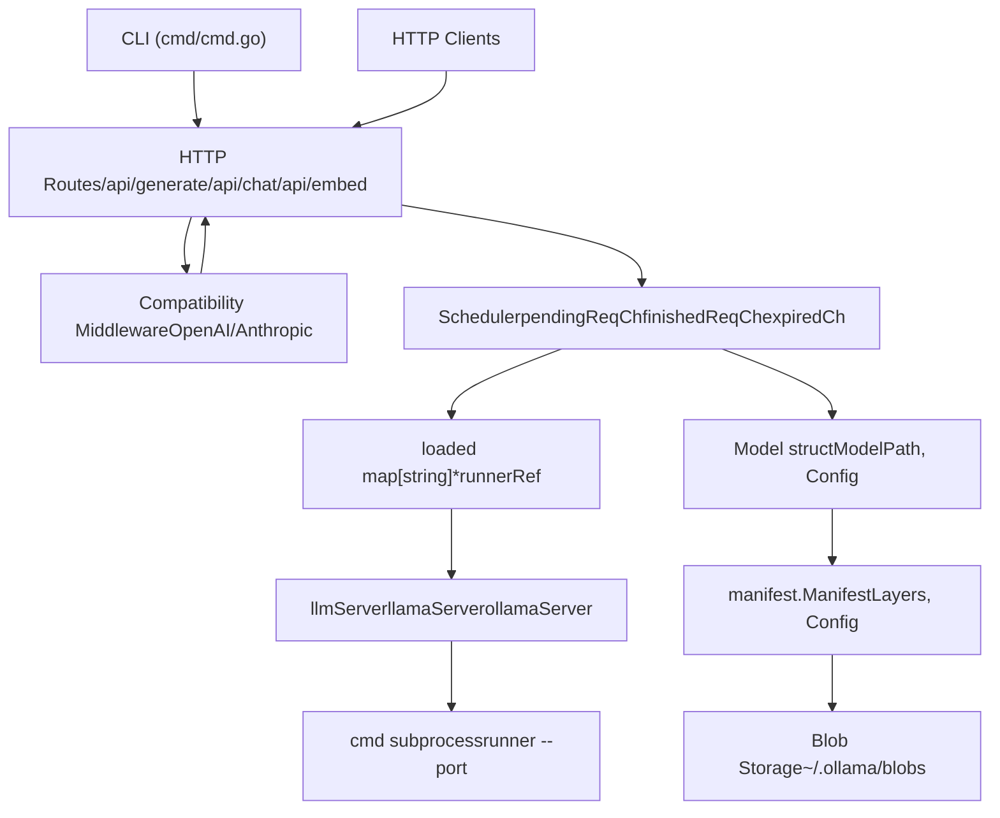
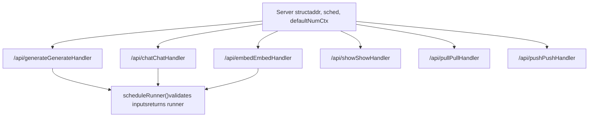
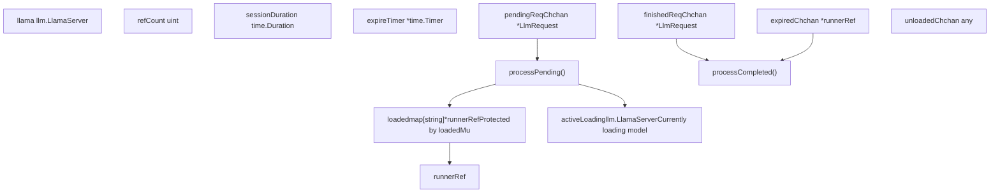
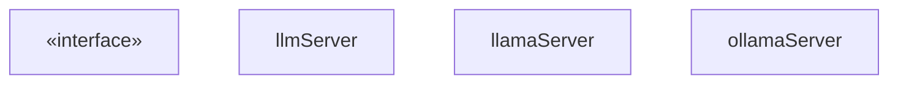
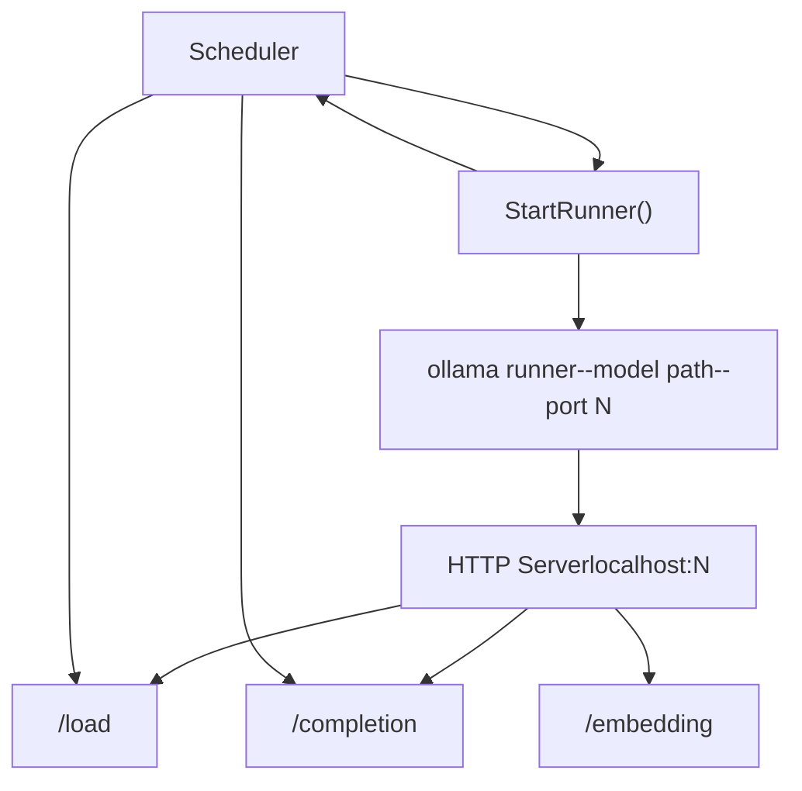
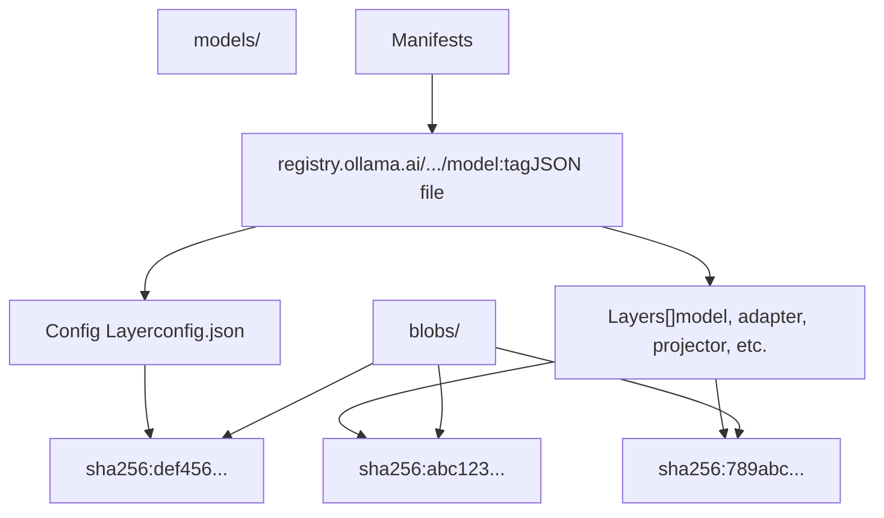
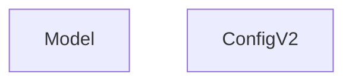

# Architecture

Relevant source files

-   [api/client.go](https://github.com/ollama/ollama/blob/562c76d7/api/client.go)
-   [api/client\_test.go](https://github.com/ollama/ollama/blob/562c76d7/api/client_test.go)
-   [api/types.go](https://github.com/ollama/ollama/blob/562c76d7/api/types.go)
-   [cmd/cmd.go](https://github.com/ollama/ollama/blob/562c76d7/cmd/cmd.go)
-   [envconfig/config.go](https://github.com/ollama/ollama/blob/562c76d7/envconfig/config.go)
-   [envconfig/config\_test.go](https://github.com/ollama/ollama/blob/562c76d7/envconfig/config_test.go)
-   [integration/embed\_test.go](https://github.com/ollama/ollama/blob/562c76d7/integration/embed_test.go)
-   [kvcache/cache.go](https://github.com/ollama/ollama/blob/562c76d7/kvcache/cache.go)
-   [kvcache/causal.go](https://github.com/ollama/ollama/blob/562c76d7/kvcache/causal.go)
-   [kvcache/causal\_test.go](https://github.com/ollama/ollama/blob/562c76d7/kvcache/causal_test.go)
-   [kvcache/encoder.go](https://github.com/ollama/ollama/blob/562c76d7/kvcache/encoder.go)
-   [kvcache/wrapper.go](https://github.com/ollama/ollama/blob/562c76d7/kvcache/wrapper.go)
-   [llm/server.go](https://github.com/ollama/ollama/blob/562c76d7/llm/server.go)
-   [ml/backend.go](https://github.com/ollama/ollama/blob/562c76d7/ml/backend.go)
-   [ml/backend/ggml/ggml.go](https://github.com/ollama/ollama/blob/562c76d7/ml/backend/ggml/ggml.go)
-   [model/input/input.go](https://github.com/ollama/ollama/blob/562c76d7/model/input/input.go)
-   [model/model.go](https://github.com/ollama/ollama/blob/562c76d7/model/model.go)
-   [model/model\_test.go](https://github.com/ollama/ollama/blob/562c76d7/model/model_test.go)
-   [runner/llamarunner/cache.go](https://github.com/ollama/ollama/blob/562c76d7/runner/llamarunner/cache.go)
-   [runner/llamarunner/runner.go](https://github.com/ollama/ollama/blob/562c76d7/runner/llamarunner/runner.go)
-   [runner/ollamarunner/cache.go](https://github.com/ollama/ollama/blob/562c76d7/runner/ollamarunner/cache.go)
-   [runner/ollamarunner/cache\_test.go](https://github.com/ollama/ollama/blob/562c76d7/runner/ollamarunner/cache_test.go)
-   [runner/ollamarunner/runner.go](https://github.com/ollama/ollama/blob/562c76d7/runner/ollamarunner/runner.go)
-   [server/images.go](https://github.com/ollama/ollama/blob/562c76d7/server/images.go)
-   [server/internal/internal/backoff/backoff.go](https://github.com/ollama/ollama/blob/562c76d7/server/internal/internal/backoff/backoff.go)
-   [server/routes.go](https://github.com/ollama/ollama/blob/562c76d7/server/routes.go)
-   [server/sched.go](https://github.com/ollama/ollama/blob/562c76d7/server/sched.go)
-   [server/sched\_test.go](https://github.com/ollama/ollama/blob/562c76d7/server/sched_test.go)

This document provides a comprehensive overview of Ollama's system architecture, covering the layered design from HTTP API endpoints through model execution and storage. It describes how client requests flow through the system, how models are loaded and managed, and how different components interact.

For details on specific API endpoints and request/response formats, see [API Reference](/ollama/ollama/3-api-reference). For model management specifics including Modelfiles and conversion, see [Model Management](/ollama/ollama/4-model-management). For GPU support and hardware configuration, see [GPU and Hardware Support](/ollama/ollama/6-gpu-and-hardware-support).

## System Overview

Ollama is organized as a layered system where each layer has distinct responsibilities:

**Sources:** [server/routes.go1-663](https://github.com/ollama/ollama/blob/562c76d7/server/routes.go#L1-L663) [server/sched.go1-309](https://github.com/ollama/ollama/blob/562c76d7/server/sched.go#L1-L309) [llm/server.go1-440](https://github.com/ollama/ollama/blob/562c76d7/llm/server.go#L1-L440) [server/images.go1-370](https://github.com/ollama/ollama/blob/562c76d7/server/images.go#L1-L370)

### Layer Responsibilities

| Layer | Primary Components | Responsibilities |
| --- | --- | --- |
| **Client** | `cmd/cmd.go`, HTTP clients | CLI commands, API requests |
| **API** | `server/routes.go`, middleware | Route handling, request validation, format transformation |
| **Orchestration** | `server/sched.go` | Model scheduling, runner lifecycle, concurrency control |
| **Execution** | `llm/server.go` | Model loading, inference, subprocess management |
| **Storage** | `server/images.go`, `manifest/` | Model files, blob management, registry operations |

**Sources:** [server/routes.go87-94](https://github.com/ollama/ollama/blob/562c76d7/server/routes.go#L87-L94) [server/sched.go39-60](https://github.com/ollama/ollama/blob/562c76d7/server/sched.go#L39-L60) [llm/server.go87-109](https://github.com/ollama/ollama/blob/562c76d7/llm/server.go#L87-L109)

## HTTP Server and Routing

The HTTP server is built on the Gin web framework and exposes REST API endpoints for model interaction and management.

### Core Route Handlers

**Sources:** [server/routes.go87-94](https://github.com/ollama/ollama/blob/562c76d7/server/routes.go#L87-L94) [server/routes.go183-663](https://github.com/ollama/ollama/blob/562c76d7/server/routes.go#L183-L663)

The `Server` struct contains:

-   `sched *Scheduler` - The scheduler managing model runners
-   `addr net.Addr` - Server bind address
-   `defaultNumCtx int` - Default context length for models
-   `aliases *store` - Model alias mappings

**Sources:** [server/routes.go87-94](https://github.com/ollama/ollama/blob/562c76d7/server/routes.go#L87-L94)

### Request Processing Flow

Each handler follows a common pattern:

1.  **Request Validation** - Parse and validate JSON request body
2.  **Model Resolution** - Resolve model name, check if remote or local
3.  **Runner Acquisition** - Call `scheduleRunner()` to get or load model runner
4.  **Execution** - Perform inference/operation
5.  **Response Streaming** - Stream results back to client

> **[Mermaid sequence]**
> *(图表结构无法解析)*

**Sources:** [server/routes.go133-170](https://github.com/ollama/ollama/blob/562c76d7/server/routes.go#L133-L170) [server/routes.go183-663](https://github.com/ollama/ollama/blob/562c76d7/server/routes.go#L183-L663)

### Key Handler Methods

**GenerateHandler** - Handles `/api/generate` for completion requests

-   Validates model exists (local or remote)
-   For remote models, proxies to upstream server
-   Supports thinking models, raw mode, image generation
-   Streams responses with thinking/content separation

**Sources:** [server/routes.go183-663](https://github.com/ollama/ollama/blob/562c76d7/server/routes.go#L183-L663)

**ChatHandler** - Handles `/api/chat` for conversation requests

-   Supports multi-turn conversations with message history
-   Handles tool calling workflow
-   Renders prompts using model templates
-   Implements context truncation/shifting

**Sources:** [server/routes.go1293-1779](https://github.com/ollama/ollama/blob/562c76d7/server/routes.go#L1293-L1779)

**EmbedHandler** - Handles `/api/embed` for embedding generation

-   Supports batch embedding with truncation
-   Normalizes output vectors
-   Dimension reduction support

**Sources:** [server/routes.go665-819](https://github.com/ollama/ollama/blob/562c76d7/server/routes.go#L665-L819)

## Scheduler and Runner Management

The `Scheduler` is the central orchestrator managing the lifecycle of model runners. It handles concurrent access, memory constraints, and keep-alive semantics.

### Scheduler Architecture

**Sources:** [server/sched.go39-60](https://github.com/ollama/ollama/blob/562c76d7/server/sched.go#L39-L60) [server/sched.go157-309](https://github.com/ollama/ollama/blob/562c76d7/server/sched.go#L157-L309) [server/sched.go311-432](https://github.com/ollama/ollama/blob/562c76d7/server/sched.go#L311-L432)

### Scheduler State Machine

The scheduler maintains state for each loaded model through `runnerRef`:

| Field | Type | Purpose |
| --- | --- | --- |
| `llama` | `llm.LlamaServer` | The actual runner instance |
| `refCount` | `uint` | Number of active requests using this runner |
| `sessionDuration` | `time.Duration` | Keep-alive duration from last request |
| `expireTimer` | `*time.Timer` | Timer for automatic unload |
| `expiresAt` | `time.Time` | When the runner will expire |
| `loading` | `sync.Mutex` | Prevents concurrent loading |

**Sources:** [server/sched.go434-471](https://github.com/ollama/ollama/blob/562c76d7/server/sched.go#L434-L471)

### Request Scheduling Flow

> **[Mermaid stateDiagram]**
> *(图表结构无法解析)*

**Sources:** [server/sched.go108-143](https://github.com/ollama/ollama/blob/562c76d7/server/sched.go#L108-L143) [server/sched.go157-309](https://github.com/ollama/ollama/blob/562c76d7/server/sched.go#L157-L309)

### Runner Lifecycle

**Loading a Runner:**

1.  Check if model already in `loaded` map
2.  If not, queue request in `pendingReqCh`
3.  `processPending()` handles queue:
    -   Check `OLLAMA_MAX_LOADED_MODELS` limit
    -   Evict old runners if at capacity
    -   Enumerate available GPUs
    -   Calculate layer distribution
    -   Create new `LlamaServer` via `newServerFn`
    -   Wait for runner to be ready

**Sources:** [server/sched.go157-309](https://github.com/ollama/ollama/blob/562c76d7/server/sched.go#L157-L309)

**Reference Counting:**

-   Each active request increments `refCount`
-   Request completion decrements `refCount`
-   When `refCount` reaches 0, start `expireTimer`
-   Timer expiration triggers unload if still at 0

**Sources:** [server/sched.go311-432](https://github.com/ollama/ollama/blob/562c76d7/server/sched.go#L311-L432)

**Eviction Strategy:** The scheduler uses `findRunnerToUnload()` to select a runner when at capacity:

1.  Prefers runners with `sessionDuration == 0` (unload immediately)
2.  Otherwise selects runner with shortest time until expiration
3.  Never evicts a runner with `refCount > 0`

**Sources:** [server/sched.go473-515](https://github.com/ollama/ollama/blob/562c76d7/server/sched.go#L473-L515)

## Model Execution Layer

The execution layer is responsible for loading models into memory and running inference. It consists of the `LlamaServer` interface with two implementations.

### LlamaServer Interface

**Sources:** [llm/server.go67-85](https://github.com/ollama/ollama/blob/562c76d7/llm/server.go#L67-L85) [llm/server.go87-122](https://github.com/ollama/ollama/blob/562c76d7/llm/server.go#L87-L122)

### Server Implementations

**llamaServer** - Uses llama.cpp via CGo

-   Primary implementation for GGUF models
-   Integrates with llama.cpp for tokenization
-   Supports projectors for multimodal models

**ollamaServer** - Pure Go implementation

-   Used when `OLLAMA_NEW_ENGINE=1` or model requires it
-   Uses Go-native tokenizer
-   Currently limited to text-only models

**Sources:** [llm/server.go111-122](https://github.com/ollama/ollama/blob/562c76d7/llm/server.go#L111-L122) [llm/server.go143-319](https://github.com/ollama/ollama/blob/562c76d7/llm/server.go#L143-L319)

### Runner Subprocess Architecture

Each model runner executes as a subprocess:

**Sources:** [llm/server.go321-439](https://github.com/ollama/ollama/blob/562c76d7/llm/server.go#L321-L439)

**StartRunner Function:**

-   Locates `ollama` executable
-   Assigns random ephemeral port
-   Constructs command: `ollama runner --model <path> --port <N>`
-   Configures environment (library paths, GPU settings)
-   Starts subprocess and monitors via `cmd.Wait()`

**Sources:** [llm/server.go321-439](https://github.com/ollama/ollama/blob/562c76d7/llm/server.go#L321-L439)

### Model Loading Process

> **[Mermaid sequence]**
> *(图表结构无法解析)*

**Sources:** [llm/server.go497-777](https://github.com/ollama/ollama/blob/562c76d7/llm/server.go#L497-L777)

### Load Operations

Model loading proceeds through distinct phases controlled by `LoadOperation`:

| Operation | Purpose | Can Be Retried |
| --- | --- | --- |
| `LoadOperationFit` | Calculate memory requirements without allocation | Yes |
| `LoadOperationAlloc` | Allocate GPU/CPU memory | Yes |
| `LoadOperationCommit` | Load weights into memory | No |
| `LoadOperationClose` | Unload and free memory | N/A |

**Sources:** [llm/server.go445-469](https://github.com/ollama/ollama/blob/562c76d7/llm/server.go#L445-L469) [llm/server.go497-777](https://github.com/ollama/ollama/blob/562c76d7/llm/server.go#L497-L777)

The three-phase loading allows the scheduler to:

1.  **Fit** - Determine if model fits on available hardware
2.  **Alloc** - Reserve memory across devices
3.  **Commit** - Complete loading (point of no return)

This enables the scheduler to try different GPU configurations before committing.

**Sources:** [llm/server.go497-777](https://github.com/ollama/ollama/blob/562c76d7/llm/server.go#L497-L777)

## Storage and Model Management

Models are stored using a content-addressed blob system with manifests describing layer composition.

### Storage Structure

**Sources:** [server/images.go271-369](https://github.com/ollama/ollama/blob/562c76d7/server/images.go#L271-L369)

### Model Structure

The `Model` struct represents a fully parsed model:

**Sources:** [server/images.go57-72](https://github.com/ollama/ollama/blob/562c76d7/server/images.go#L57-L72) [server/images.go271-369](https://github.com/ollama/ollama/blob/562c76d7/server/images.go#L271-L369)

### Manifest Layer Types

Models are composed of multiple layer types:

| MediaType | Purpose | Source File |
| --- | --- | --- |
| `application/vnd.ollama.image.model` | Main model weights (GGUF) | Model file |
| `application/vnd.ollama.image.adapter` | LoRA adapters | Adapter file |
| `application/vnd.ollama.image.projector` | Vision projector | Projector file |
| `application/vnd.ollama.image.template` | Prompt template | Template string |
| `application/vnd.ollama.image.system` | System prompt | System string |
| `application/vnd.ollama.image.params` | Model options | JSON params |
| `application/vnd.ollama.image.license` | License text | License string |
| `application/vnd.ollama.image.messages` | Pre-loaded messages | JSON messages |

**Sources:** [server/images.go302-365](https://github.com/ollama/ollama/blob/562c76d7/server/images.go#L302-L365)

### Model Loading from Storage

> **[Mermaid sequence]**
> *(图表结构无法解析)*

**Sources:** [server/images.go271-369](https://github.com/ollama/ollama/blob/562c76d7/server/images.go#L271-L369)

### Blob Transfer

For pulling and pushing models, Ollama implements parallel blob transfer:

**Download (server/download.go):**

-   Splits large blobs into 16 parts (configurable)
-   Part size: 100MB - 1000MB
-   Downloads parts in parallel via errgroup
-   Supports resume from partial downloads
-   Writes to sparse files to save disk space

**Sources:** [server/download.go1-329](https://github.com/ollama/ollama/blob/562c76d7/server/download.go#L1-L329) [server/download.go99-183](https://github.com/ollama/ollama/blob/562c76d7/server/download.go#L99-L183)

**Upload (server/upload.go):**

-   Similar parallel upload strategy
-   Supports blob mounting (cross-repository)
-   Calculates MD5 checksum of parts
-   Commits with ETag for verification

**Sources:** [server/upload.go1-329](https://github.com/ollama/ollama/blob/562c76d7/server/upload.go#L1-L329)

## Configuration and Environment

Ollama uses environment variables for configuration, managed through the `envconfig` package.

### Key Configuration Variables

| Variable | Default | Purpose |
| --- | --- | --- |
| `OLLAMA_HOST` | `127.0.0.1:11434` | Server bind address |
| `OLLAMA_MODELS` | `~/.ollama/models` | Model storage directory |
| `OLLAMA_KEEP_ALIVE` | `5m` | Model keep-alive duration |
| `OLLAMA_MAX_LOADED_MODELS` | Auto (3×GPUs) | Max concurrent models |
| `OLLAMA_MAX_QUEUE` | `512` | Max pending requests |
| `OLLAMA_NUM_PARALLEL` | `1` | Parallel requests per model |
| `OLLAMA_FLASH_ATTENTION` | Auto | Enable flash attention |
| `OLLAMA_DEBUG` | `0` | Debug logging level |

**Sources:** [envconfig/config.go1-60](https://github.com/ollama/ollama/blob/562c76d7/envconfig/config.go#L1-L60) [envconfig/config.go88-141](https://github.com/ollama/ollama/blob/562c76d7/envconfig/config.go#L88-L141) [envconfig/config.go154-214](https://github.com/ollama/ollama/blob/562c76d7/envconfig/config.go#L154-L214)

### Host Configuration

The `Host()` function parses `OLLAMA_HOST` with smart defaults:

-   Supports `http://` and `https://` schemes
-   Defaults to port 11434 (80 for http, 443 for https)
-   Special handling for `ollama.com` → `https://ollama.com:443`
-   Supports proxy paths: `https://example.com/ollama`

**Sources:** [envconfig/config.go20-60](https://github.com/ollama/ollama/blob/562c76d7/envconfig/config.go#L20-L60)

### Scheduler Configuration

**OLLAMA\_MAX\_LOADED\_MODELS:**

-   Limits concurrent loaded models
-   Default: `3 × number of GPUs` (or 3 for CPU-only)
-   Set to `0` for automatic calculation
-   Set to `>0` for fixed limit

**Sources:** [server/sched.go62-66](https://github.com/ollama/ollama/blob/562c76d7/server/sched.go#L62-L66) [server/sched.go212-223](https://github.com/ollama/ollama/blob/562c76d7/server/sched.go#L212-L223)

**Keep-Alive Behavior:**

-   Each request can specify `keep_alive` duration
-   Negative values = keep loaded indefinitely
-   Zero = unload immediately after request
-   Positive = keep loaded for specified duration

**Sources:** [envconfig/config.go103-121](https://github.com/ollama/ollama/blob/562c76d7/envconfig/config.go#L103-L121) [server/sched.go311-357](https://github.com/ollama/ollama/blob/562c76d7/server/sched.go#L311-L357)

## Request Flow Example

### Complete Chat Request Flow

> **[Mermaid sequence]**
> *(图表结构无法解析)*

**Sources:** [server/routes.go1293-1779](https://github.com/ollama/ollama/blob/562c76d7/server/routes.go#L1293-L1779) [server/sched.go108-143](https://github.com/ollama/ollama/blob/562c76d7/server/sched.go#L108-L143) [server/sched.go157-309](https://github.com/ollama/ollama/blob/562c76d7/server/sched.go#L157-L309) [llm/server.go497-777](https://github.com/ollama/ollama/blob/562c76d7/llm/server.go#L497-L777)

This architecture enables:

-   Concurrent request handling through reference counting
-   Efficient memory usage through automatic model unloading
-   Flexible model scheduling with eviction policies
-   Support for multiple model formats and execution engines
-   Isolated model execution in subprocesses for stability
