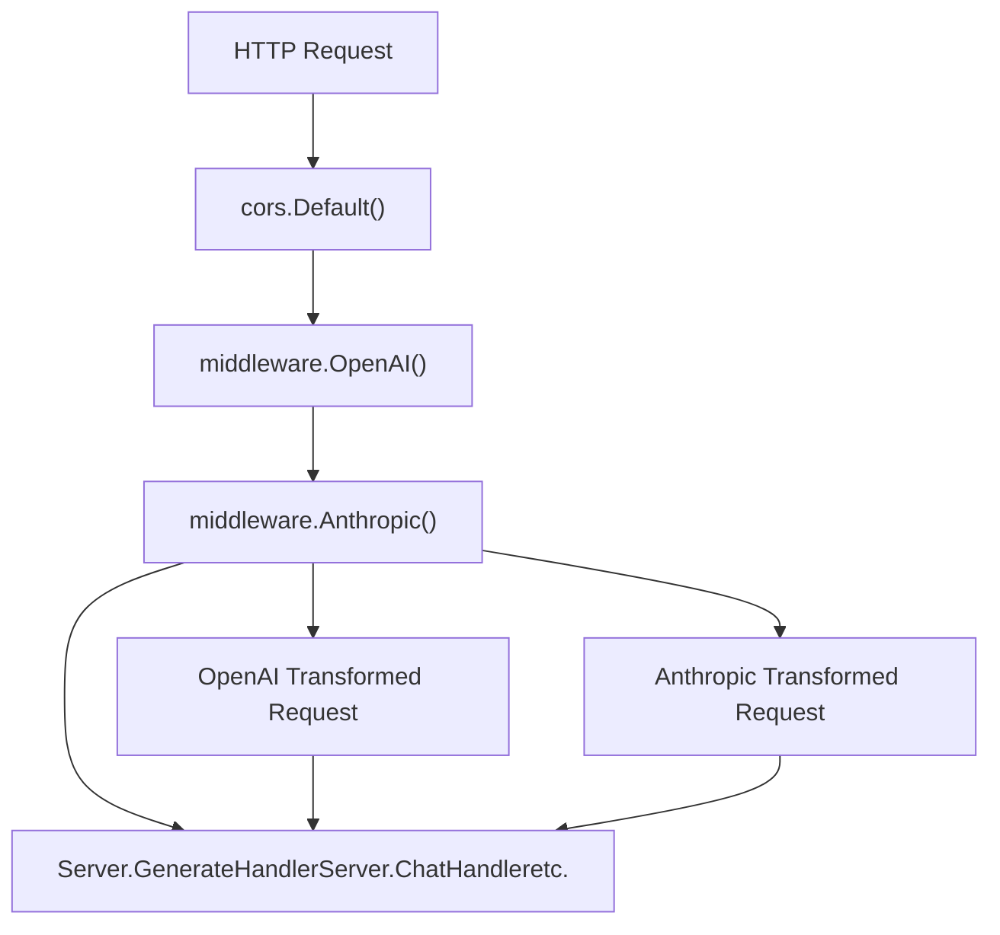
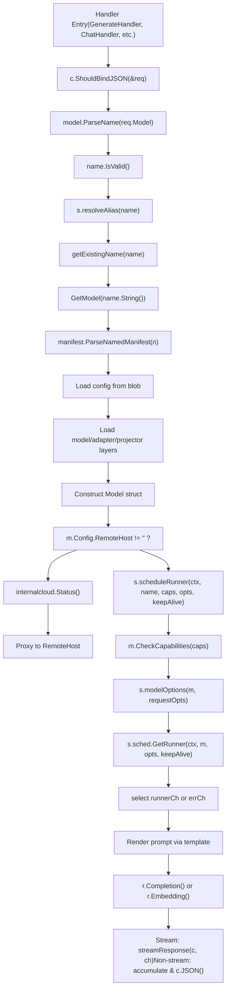

# HTTP Server and API Layer

Relevant source files

-   [README.md](https://github.com/ollama/ollama/blob/562c76d7/README.md?plain=1)
-   [api/client.go](https://github.com/ollama/ollama/blob/562c76d7/api/client.go)
-   [api/client\_test.go](https://github.com/ollama/ollama/blob/562c76d7/api/client_test.go)
-   [api/types.go](https://github.com/ollama/ollama/blob/562c76d7/api/types.go)
-   [cmd/cmd.go](https://github.com/ollama/ollama/blob/562c76d7/cmd/cmd.go)
-   [docs/README.md](https://github.com/ollama/ollama/blob/562c76d7/docs/README.md?plain=1)
-   [docs/api.md](https://github.com/ollama/ollama/blob/562c76d7/docs/api.md?plain=1)
-   [docs/development.md](https://github.com/ollama/ollama/blob/562c76d7/docs/development.md?plain=1)
-   [docs/images/ollama-keys.png](https://github.com/ollama/ollama/blob/562c76d7/docs/images/ollama-keys.png)
-   [docs/images/signup.png](https://github.com/ollama/ollama/blob/562c76d7/docs/images/signup.png)
-   [server/images.go](https://github.com/ollama/ollama/blob/562c76d7/server/images.go)
-   [server/routes.go](https://github.com/ollama/ollama/blob/562c76d7/server/routes.go)

This document describes Ollama's HTTP server architecture and API layer, including request routing, middleware processing, endpoint handlers, and streaming response mechanisms. The server is built using the Gin web framework and provides both native Ollama endpoints and OpenAI-compatible endpoints.

For information about the OpenAI compatibility transformation logic, see [OpenAI Compatibility Layer](/ollama/ollama/3.4-openai-compatibility-layer). For details about request scheduling and runner management after requests reach handlers, see [Request Scheduling and Runner Management](/ollama/ollama/2.2-request-scheduling-and-runner-management).

## Overview

The HTTP server is the primary interface for all client interactions with Ollama. It exposes REST API endpoints for model management (pull, push, create, delete), inference (generate, chat, embed), and introspection (show, list). The server handles both streaming and non-streaming responses, manages authentication, and provides OpenAI API compatibility through middleware.

**Sources:** [server/routes.go1-150](https://github.com/ollama/ollama/blob/562c76d7/server/routes.go#L1-L150)

## Server Initialization and Core Components

### Server Structure

The `Server` struct is the core component that encapsulates the HTTP server state:

```
type Server struct {    addr          net.Addr    sched         *Scheduler    defaultNumCtx int    aliasesOnce   sync.Once    aliases       *store    aliasesErr    error}
```
Key fields:

-   `addr`: Network address the server listens on
-   `sched`: Reference to the `Scheduler` that manages model runners (see [Request Scheduling and Runner Management](/ollama/ollama/2.2-request-scheduling-and-runner-management))
-   `defaultNumCtx`: Default context window size
-   `aliases`: Model alias store for request routing
-   `aliasesOnce`: Ensures alias store is initialized once

**Sources:** [server/routes.go87-94](https://github.com/ollama/ollama/blob/562c76d7/server/routes.go#L87-L94)

### Initialization

The server initializes Gin mode and configures global settings:

```
func init() {    switch mode {    case gin.DebugMode:    case gin.ReleaseMode:    case gin.TestMode:    default:        mode = gin.DebugMode    }    gin.SetMode(mode)        // Tell renderers to use [img] tags    renderers.RenderImgTags = true}
```
**Sources:** [server/routes.go96-109](https://github.com/ollama/ollama/blob/562c76d7/server/routes.go#L96-L109)

### Helper Functions

The server provides utility functions for request processing:

**modelOptions**: Merges model-specific and request-specific options

```
func (s *Server) modelOptions(model *Model, requestOpts map[string]any) (api.Options, error)
```
This function:

1.  Starts with `api.DefaultOptions()`
2.  Applies default context size from `s.defaultNumCtx`
3.  Merges model options from the manifest
4.  Overlays request-specific options

**Sources:** [server/routes.go116-131](https://github.com/ollama/ollama/blob/562c76d7/server/routes.go#L116-L131)

## Request Routing Architecture

**HTTP Request Flow Through Gin Router**

```mermaid
flowchart TD
    Client["HTTP Client"]
    CORSMw["cors.Default()"]
    OpenAIMw["middleware.OpenAI()middleware.Anthropic()"]
    Generate["POST /api/generateServer.GenerateHandler"]
    Chat["POST /api/chatServer.ChatHandler"]
    Embed["POST /api/embedServer.EmbedHandler"]
    Embeddings["POST /api/embeddingsServer.EmbeddingsHandler"]
    Show["POST /api/showServer.ShowHandler"]
    Create["POST /api/createServer.CreateHandler"]
    Pull["POST /api/pullServer.PullHandler"]
    Push["POST /api/pushServer.PushHandler"]
    Delete["DELETE /api/deleteServer.DeleteHandler"]
    List["GET /api/tagsServer.ListHandler"]
    ListPS["GET /api/psServer.ListRunningHandler"]
    Copy["POST /api/copyServer.CopyHandler"]
    Version["GET /api/version"]
    Blob["POST /api/blobs/:digestServer.CreateBlobHandler"]
    OAIChat["/v1/chat/completions"]
    OAICompletions["/v1/completions"]
    OAIEmbeddings["/v1/embeddings"]
    OAIModels["/v1/models"]
    AnthropicMsg["/v1/messages"]

    CORSMw --> OpenAIMw
    OpenAIMw --> Generate
    OpenAIMw --> Chat
    OpenAIMw --> Embed
    OpenAIMw --> Embeddings
    OpenAIMw --> Show
    OpenAIMw --> Create
    OpenAIMw --> Pull
    OpenAIMw --> Push
    OpenAIMw --> Delete
    OpenAIMw --> List
    OpenAIMw --> ListPS
    OpenAIMw --> Copy
    OpenAIMw --> Version
    OpenAIMw --> Blob
    OpenAIMw --> OAIChat
    OpenAIMw --> OAICompletions
    OpenAIMw --> OAIEmbeddings
    OpenAIMw --> OAIModels
    OpenAIMw --> AnthropicMsg
    OAIChat --> Chat
    OAICompletions --> Generate
    OAIEmbeddings --> Embed
    OAIModels --> List
    AnthropicMsg --> Chat
    Client --> GinRouter
    GinRouter --> CORSMw
```


**Native Ollama API Endpoints:**

| Endpoint | Method | Handler Function | Purpose |
| --- | --- | --- | --- |
| `/api/generate` | POST | `Server.GenerateHandler` | Text completion from prompt |
| `/api/chat` | POST | `Server.ChatHandler` | Chat with message history |
| `/api/embed` | POST | `Server.EmbedHandler` | Generate embeddings (batch) |
| `/api/embeddings` | POST | `Server.EmbeddingsHandler` | Generate single embedding |
| `/api/show` | POST | `Server.ShowHandler` | Model information and metadata |
| `/api/create` | POST | `Server.CreateHandler` | Create model from Modelfile |
| `/api/pull` | POST | `Server.PullHandler` | Download model from registry |
| `/api/push` | POST | `Server.PushHandler` | Upload model to registry |
| `/api/delete` | DELETE | `Server.DeleteHandler` | Remove local model |
| `/api/copy` | POST | `Server.CopyHandler` | Copy model to new name |
| `/api/tags` | GET | `Server.ListHandler` | List local models |
| `/api/ps` | GET | `Server.ListRunningHandler` | List loaded models |
| `/api/version` | GET | \- | Server version info |
| `/api/blobs/:digest` | POST | `Server.CreateBlobHandler` | Upload blob by digest |

**OpenAI Compatible Endpoints:**

| Endpoint | Transforms To | Handler |
| --- | --- | --- |
| `/v1/chat/completions` | `/api/chat` | `middleware.OpenAI()` → `ChatHandler` |
| `/v1/completions` | `/api/generate` | `middleware.OpenAI()` → `GenerateHandler` |
| `/v1/embeddings` | `/api/embed` | `middleware.OpenAI()` → `EmbedHandler` |
| `/v1/models` | `/api/tags` | `middleware.OpenAI()` → `ListHandler` |

**Anthropic Compatible Endpoints:**

| Endpoint | Transforms To | Handler |
| --- | --- | --- |
| `/v1/messages` | `/api/chat` | `middleware.Anthropic()` → `ChatHandler` |

**Sources:** [server/routes.go183-1291](https://github.com/ollama/ollama/blob/562c76d7/server/routes.go#L183-L1291)

## Request and Response Types

### Core Request Types

The API layer defines structured request types for all operations:

```
type GenerateRequest struct {    Model       string          // Model name    Prompt      string          // Text prompt    Suffix      string          // Text after insertion    System      string          // System message override    Template    string          // Template override    Context     []int           // Deprecated: conversation context    Stream      *bool           // Enable/disable streaming    Raw         bool            // Skip template formatting    Format      json.RawMessage // JSON/structured output format    KeepAlive   *Duration       // Model persistence duration    Images      []ImageData     // Multimodal image inputs    Options     map[string]any  // Model parameters    Think       *ThinkValue     // Thinking/reasoning mode    Truncate    *bool           // Truncate on context overflow    Shift       *bool           // Shift context on overflow    Logprobs    bool            // Return log probabilities    TopLogprobs int             // Number of top logprobs} type ChatRequest struct {    Model     string          // Model name    Messages  []Message       // Chat message history    Stream    *bool           // Enable/disable streaming    Format    json.RawMessage // JSON/structured output format    KeepAlive *Duration       // Model persistence duration    Tools     Tools           // Available tools    Options   map[string]any  // Model parameters    Think     *ThinkValue     // Thinking/reasoning mode    Truncate  *bool           // Truncate on context overflow    Shift     *bool           // Shift context on overflow    Logprobs  bool            // Return log probabilities}
```
**Sources:** [api/types.go59-194](https://github.com/ollama/ollama/blob/562c76d7/api/types.go#L59-L194)

### Message and Tool Types

Messages support multimodal content and tool interactions:

```
type Message struct {    Role       string      // "system", "user", "assistant", "tool"    Content    string      // Message text    Thinking   string      // Thinking content (when Think enabled)    Images     []ImageData // Image attachments    ToolCalls  []ToolCall  // Tool invocations    ToolName   string      // For tool responses    ToolCallID string      // For tool responses} type ToolCall struct {    ID       string    Function ToolCallFunction} type ToolCallFunction struct {    Index     int    Name      string    Arguments ToolCallFunctionArguments // Preserves insertion order}
```
**Sources:** [api/types.go208-244](https://github.com/ollama/ollama/blob/562c76d7/api/types.go#L208-L244)

### Response Types

Responses include metrics and support both streaming and complete formats:

```
type GenerateResponse struct {    Model      string    CreatedAt  time.Time    Response   string        // Generated text    Thinking   string        // Thinking output    Done       bool          // Completion flag    DoneReason string        // Why generation stopped    Context    []int         // Updated context    ToolCalls  []ToolCall    // Tool invocations    Logprobs   []Logprob     // Log probability info    Metrics                  // Performance metrics} type Metrics struct {    TotalDuration      time.Duration // End-to-end latency    LoadDuration       time.Duration // Model load time    PromptEvalCount    int           // Prompt tokens    PromptEvalDuration time.Duration // Prompt processing time    EvalCount          int           // Generated tokens    EvalDuration       time.Duration // Generation time}
```
**Sources:** [api/types.go570-577](https://github.com/ollama/ollama/blob/562c76d7/api/types.go#L570-L577) [server/routes.go533-581](https://github.com/ollama/ollama/blob/562c76d7/server/routes.go#L533-L581)

## Middleware Stack

**Middleware Processing Chain**


### CORS Middleware

Cross-Origin Resource Sharing (CORS) is configured using `gin-contrib/cors`:

```
router.Use(cors.New(cors.Config{    AllowOrigins:     []string{"*"},    AllowMethods:     []string{"GET", "POST", "PUT", "DELETE", "OPTIONS"},    AllowHeaders:     []string{"Authorization", "Content-Type"},    AllowCredentials: true,}))
```
This allows web applications to make cross-origin requests to the Ollama API.

**Sources:** [server/routes.go30](https://github.com/ollama/ollama/blob/562c76d7/server/routes.go#L30-L30)

### API Compatibility Middleware

Two middleware components provide API compatibility:

**middleware.OpenAI()**: Transforms OpenAI API requests to Ollama format

-   Intercepts requests to `/v1/chat/completions`, `/v1/completions`, `/v1/embeddings`, `/v1/models`
-   Converts request/response formats bidirectionally
-   Maps model names and parameters
-   See [OpenAI Compatibility Layer](/ollama/ollama/3.4-openai-compatibility-layer) for details

**middleware.Anthropic()**: Transforms Anthropic API requests to Ollama format

-   Intercepts requests to `/v1/messages`
-   Handles multi-turn conversations and tool calls
-   See [Anthropic Compatibility Layer](/ollama/ollama/3.5-anthropic-compatibility-layer) for details

**Sources:** [server/routes.go45](https://github.com/ollama/ollama/blob/562c76d7/server/routes.go#L45-L45)

### Authentication

Authentication is handled at the client level (not middleware). The `api.Client` signs requests when:

-   `envconfig.UseAuth()` returns true, OR
-   The target hostname is `ollama.com`

```
// In api.Client.do() and api.Client.stream()if envconfig.UseAuth() || c.base.Hostname() == "ollama.com" {    now := strconv.FormatInt(time.Now().Unix(), 10)    chal := fmt.Sprintf("%s,%s?ts=%s", method, path, now)    token, err = getAuthorizationToken(ctx, chal)    request.Header.Set("Authorization", token)}
```
Authentication uses ed25519 signature-based tokens generated by the `auth` package.

**Sources:** [api/client.go118-143](https://github.com/ollama/ollama/blob/562c76d7/api/client.go#L118-L143) [server/auth.go53-100](https://github.com/ollama/ollama/blob/562c76d7/server/auth.go#L53-L100)

## Request Handler Processing Flow

**Detailed Handler Execution Flow**


### scheduleRunner Function

The `scheduleRunner` function orchestrates runner acquisition with validation:

```
func (s *Server) scheduleRunner(ctx context.Context, name string,     caps []model.Capability, requestOpts map[string]any,     keepAlive *api.Duration) (llm.LlamaServer, *Model, *api.Options, error)
```
**Processing steps:**

1.  **Validate model name**: Returns error if `name == ""`
2.  **Retrieve model**: Calls `GetModel(name)` to load manifest and config
3.  **Check compatibility**: Special handling for `mllama` models with projectors (deprecated versions)
4.  **Validate capabilities**: Calls `model.CheckCapabilities(caps...)` to ensure model supports required operations
5.  **Parse options**:
    -   Calls `s.modelOptions(model, requestOpts)` to merge model and request options
    -   Handles `use_imagegen_runner` flag for image generation models
6.  **Request runner**:
    -   Calls `s.sched.GetRunner(ctx, model, opts, keepAlive, useImagegen)`
    -   Returns channels `runnerCh` and `errCh`
7.  **Wait for runner**: Selects from channels to get `*runnerRef` or error
8.  **Return**: Returns `runner.llama` (the `llm.LlamaServer` interface), model, options, and error

**Sources:** [server/routes.go135-170](https://github.com/ollama/ollama/blob/562c76d7/server/routes.go#L135-L170)

### Model Alias Resolution

Before retrieving a model, handlers resolve aliases:

```
func (s *Server) resolveAlias(name model.Name) (model.Name, *Model, error)
```
This function:

1.  Initializes the alias store once using `s.aliasesOnce`
2.  Looks up the name in the alias store
3.  Returns the resolved name and optionally a remote model reference

Aliases allow routing requests to different models or remote hosts based on patterns.

**Sources:** [server/routes.go207-212](https://github.com/ollama/ollama/blob/562c76d7/server/routes.go#L207-L212)

## Streaming vs Non-Streaming Responses

### Streaming Response Mechanism

Streaming uses Server-Sent Events (SSE) format to deliver token-by-token responses.

**streamResponse helper function:**

```
func streamResponse(c *gin.Context, ch chan any) {    c.Header("Content-Type", "application/x-ndjson")    c.Stream(func(w io.Writer) bool {        val, ok := <-ch        if !ok {            return false        }                bts, _ := json.Marshal(val)        w.Write(append(bts, '\n'))        return true    })}
```
**Handler pattern:**

```
ch := make(chan any)go func() {    defer close(ch)        r.Completion(ctx, llm.CompletionRequest{...},         func(cr llm.CompletionResponse) {            res := api.GenerateResponse{                Model:     req.Model,                CreatedAt: time.Now().UTC(),                Response:  cr.Content,                Done:      cr.Done,                Metrics: api.Metrics{                    PromptEvalCount:    cr.PromptEvalCount,                    PromptEvalDuration: cr.PromptEvalDuration,                    EvalCount:          cr.EvalCount,                    EvalDuration:       cr.EvalDuration,                },            }                        // Extract thinking content if parser available            if builtinParser != nil {                content, thinking, toolCalls, _ := builtinParser.Add(cr.Content, cr.Done)                res.Response = content                res.Thinking = thinking                if cr.Done && len(toolCalls) > 0 {                    res.ToolCalls = toolCalls                }            }                        ch <- res        })}() streamResponse(c, ch)
```
Each chunk is sent as a complete JSON object followed by a newline character (NDJSON format).

**Sources:** [server/routes.go535-663](https://github.com/ollama/ollama/blob/562c76d7/server/routes.go#L535-L663)

### Non-Streaming Response

When `req.Stream != nil && !*req.Stream`, the handler accumulates all chunks:

```
if req.Stream != nil && !*req.Stream {    var r api.GenerateResponse    var allLogprobs []api.Logprob    var sbThinking strings.Builder    var sbContent strings.Builder        for rr := range ch {        switch t := rr.(type) {        case api.GenerateResponse:            sbThinking.WriteString(t.Thinking)            sbContent.WriteString(t.Response)            r = t  // Keep last response for metrics            if len(t.Logprobs) > 0 {                allLogprobs = append(allLogprobs, t.Logprobs...)            }        case gin.H:            // Error occurred            status := http.StatusInternalServerError            if s, ok := t["status"].(int); ok {                status = s            }            c.JSON(status, gin.H{"error": t["error"]})            return        }    }        r.Thinking = sbThinking.String()    r.Response = sbContent.String()    r.Logprobs = allLogprobs        c.JSON(http.StatusOK, r)    return} streamResponse(c, ch)
```
This accumulation pattern:

1.  Collects all `Response` and `Thinking` fragments
2.  Aggregates `Logprobs` if requested
3.  Returns single JSON response with final metrics
4.  Preserves error handling with proper status codes

**Sources:** [server/routes.go620-663](https://github.com/ollama/ollama/blob/562c76d7/server/routes.go#L620-L663)

## Core Endpoint Handlers

### GenerateHandler

`GenerateHandler` handles `POST /api/generate` for text completion.

**Function signature:**

```
func (s *Server) GenerateHandler(c *gin.Context)
```
**Request processing flow:**

1.  **Parse request**: Bind `api.GenerateRequest` from JSON body
2.  **Validate model name**: Parse and validate using `model.ParseName(req.Model)`
3.  **Resolve aliases**: Call `s.resolveAlias(name)` to handle model routing
4.  **Get existing name**: Canonicalize model name parts with `getExistingName(name)`
5.  **Retrieve model**: Load model manifest and config via `GetModel(name.String())`

**Remote model handling:**

If `m.Config.RemoteHost != ""`:

```
// Check cloud statusif disabled, _ := internalcloud.Status(); disabled {    return error} // Proxy request to remote hostremoteURL, _ := url.Parse(m.Config.RemoteHost)client := api.NewClient(remoteURL, http.DefaultClient)client.Generate(c, &req, responseFn)
```
**Special request handling:**

-   **Unload request**: If `req.Prompt == ""` and `req.KeepAlive.Duration == 0`, calls `s.sched.expireRunner(m)` to unload the model
-   **Image generation**: If model has `model.CapabilityImage`, delegates to `s.handleImageGenerate()`
-   **Raw mode**: If `req.Raw == true`, skips template rendering and validation of `Template`, `System`, `Context` fields

**Runner scheduling:**

```
caps := []model.Capability{model.CapabilityCompletion}if req.Suffix != "" {    caps = append(caps, model.CapabilityInsert)}if slices.Contains(modelCaps, model.CapabilityThinking) {    caps = append(caps, model.CapabilityThinking)} r, m, opts, err := s.scheduleRunner(ctx, name.String(), caps, req.Options, req.KeepAlive)
```
**Prompt rendering:**

Unless `req.Raw == true`:

-   If message-like flow (messages with no suffix): calls `chatPrompt(ctx, m, r.Tokenize, opts, messages, []api.Tool{}, req.Think, truncate)`
-   Otherwise: executes template via `tmpl.Execute(&b, values)` with prompt/suffix

**Model invocation:**

```
ch := make(chan any)go func() {    defer close(ch)    r.Completion(ctx, llm.CompletionRequest{        Prompt:      prompt,        Images:      images,        Format:      req.Format,        Options:     opts,        Shift:       req.Shift == nil || *req.Shift,        Truncate:    req.Truncate == nil || *req.Truncate,        Logprobs:    req.Logprobs,        TopLogprobs: req.TopLogprobs,    }, responseFn)}()
```
**Response handling:**

-   **Streaming**: Calls `streamResponse(c, ch)` which writes newline-delimited JSON
-   **Non-streaming**: Accumulates responses in memory, then returns single JSON object

**Sources:** [server/routes.go183-663](https://github.com/ollama/ollama/blob/562c76d7/server/routes.go#L183-L663)

### ChatHandler

`ChatHandler` handles `POST /api/chat` for multi-turn conversations.

**Function signature:**

```
func (s *Server) ChatHandler(c *gin.Context)
```
**Request processing flow:**

1.  **Parse request**: Bind `api.ChatRequest` from JSON body
2.  **Validate and resolve model name**: Same as `GenerateHandler`
3.  **Retrieve model**: Load via `GetModel(name.String())`
4.  **Check remote model**: If `m.Config.RemoteHost != ""`, proxy to remote Ollama host
5.  **Determine capabilities**:

    ```
    caps := []model.Capability{model.CapabilityCompletion}if len(req.Tools) > 0 {    caps = append(caps, model.CapabilityTools)}// Add vision, thinking capabilities based on model and request
    ```

6.  **Schedule runner**: `s.scheduleRunner(ctx, name, caps, req.Options, req.KeepAlive)`

**Prompt rendering via chatPrompt:**

```
prompt, images, err := chatPrompt(ctx, m, r.Tokenize, opts,                                   req.Messages, req.Tools,                                   req.Think, truncate)
```
The `chatPrompt` function:

1.  Determines if a renderer should be used (models like `gemma3`, `llama`, `qwen`, etc.)
2.  If renderer available:
    -   Calls `renderer.Render(opts, messages, tools, req.Think)` to generate structured prompt
    -   Processes images referenced in messages
3.  If no renderer:
    -   Constructs `template.Values` from messages
    -   Executes template via `m.Template.Execute(&b, values)`
4.  Handles context truncation:
    -   Tokenizes rendered prompt
    -   If exceeds `opts.NumCtx`, removes oldest messages until it fits
    -   Throws error if system message or last user message must be truncated

**Model invocation:**

Same pattern as `GenerateHandler` - spawns goroutine calling `r.Completion()` with streaming callback, then either streams responses or accumulates them.

**Tool call handling:**

If model returns tool calls:

1.  Parser extracts tool calls from response
2.  Returns `ChatResponse` with `Message.ToolCalls` populated
3.  Client can execute tools and send results back in subsequent messages

**Sources:** [server/routes.go1700-2098](https://github.com/ollama/ollama/blob/562c76d7/server/routes.go#L1700-L2098) [server/routes.go2188-2500](https://github.com/ollama/ollama/blob/562c76d7/server/routes.go#L2188-L2500)

### EmbedHandler

`EmbedHandler` handles `POST /api/embed` for generating embeddings:

**Key Features:**

-   Accepts single string or array of strings as input
-   Supports parallel embedding generation using `errgroup`
-   Automatically normalizes embeddings
-   Supports dimension reduction
-   Handles automatic truncation on overflow

```
func (s *Server) EmbedHandler(c *gin.Context) {    // Parse input (string or []string)        // Schedule runner (no specific capability required)    r, m, opts, err := s.scheduleRunner(ctx, name,                                         []model.Capability{},                                         req.Options, req.KeepAlive)        // Generate embeddings in parallel    var g errgroup.Group    embeddings := make([][]float32, len(input))    for i, text := range input {        g.Go(func() error {            emb, tokCount, err := r.Embedding(ctx, text)            embeddings[i] = normalize(emb)            return nil        })    }    g.Wait()}
```
**Sources:** [server/routes.go648-802](https://github.com/ollama/ollama/blob/562c76d7/server/routes.go#L648-L802)

### Model Management Handlers

#### ShowHandler

Returns detailed information about a model:

```
func (s *Server) ShowHandler(c *gin.Context) {    // Parse request    var req api.ShowRequest        // Get model info    resp, err := GetModelInfo(req)        // Returns:    // - License, System, Template    // - Model details (architecture, parameters, quantization)    // - Capabilities    // - ModelInfo (GGUF KV metadata)    // - Tensors (if verbose)}
```
**Sources:** [server/routes.go1043-1262](https://github.com/ollama/ollama/blob/562c76d7/server/routes.go#L1043-L1262)

#### PullHandler

Downloads a model from the registry:

```
func (s *Server) PullHandler(c *gin.Context) {    // Parse model name    name := model.ParseName(req.Model)        // Create progress channel    ch := make(chan any)    go func() {        PullModel(ctx, name, regOpts, progressFn)    }()        // Stream progress updates    streamResponse(c, ch)}
```
The `PullModel` function handles manifest download, blob downloading (with parallel parts), verification, and layer pruning.

**Sources:** [server/routes.go865-914](https://github.com/ollama/ollama/blob/562c76d7/server/routes.go#L865-L914) [server/images.go613-728](https://github.com/ollama/ollama/blob/562c76d7/server/images.go#L613-L728)

#### PushHandler

Uploads a model to the registry:

```
func (s *Server) PushHandler(c *gin.Context) {    // Verify authentication if pushing to ollama.com    if strings.HasSuffix(n.Host, ".ollama.com") {        _, err := client.Whoami(ctx)        // Handle auth error    }        // Push model with progress tracking    PushModel(ctx, name, regOpts, progressFn)}
```
**Sources:** [server/routes.go916-969](https://github.com/ollama/ollama/blob/562c76d7/server/routes.go#L916-L969) [server/images.go546-611](https://github.com/ollama/ollama/blob/562c76d7/server/images.go#L546-L611)

#### CreateHandler

Creates a new model from a Modelfile:

**Sources:** [cmd/cmd.go93-293](https://github.com/ollama/ollama/blob/562c76d7/cmd/cmd.go#L93-L293)

#### DeleteHandler

Removes a model from local storage:

```
func (s *Server) DeleteHandler(c *gin.Context) {    // Parse and validate name    n := model.ParseName(req.Model)        // Get manifest    m, err := ParseNamedManifest(n)        // Remove manifest file    m.Remove()        // Remove associated layer blobs    m.RemoveLayers()}
```
**Sources:** [server/routes.go999-1041](https://github.com/ollama/ollama/blob/562c76d7/server/routes.go#L999-L1041)

#### ListHandler

Lists all local models:

```
func (s *Server) ListHandler(c *gin.Context) {    // Get all manifests    ms, err := Manifests(true)        // Build response with model details    models := []api.ListModelResponse{}    for n, m := range ms {        // Extract config, size, modified time    }        c.JSON(http.StatusOK, models)}
```
**Sources:** [server/routes.go1287-1350](https://github.com/ollama/ollama/blob/562c76d7/server/routes.go#L1287-L1350)

## Error Handling

### Error Types

The API defines structured error types:

```
type StatusError struct {    StatusCode   int    Status       string    ErrorMessage string `json:"error"`} type AuthorizationError struct {    StatusCode int    Status     string    SigninURL  string `json:"signin_url"`}
```
**Sources:** [api/types.go22-54](https://github.com/ollama/ollama/blob/562c76d7/api/types.go#L22-L54)

### Error Response Pattern

Handlers consistently return errors using Gin's JSON methods:

```
// Bad requestc.AbortWithStatusJSON(http.StatusBadRequest,     gin.H{"error": "missing request body"}) // Not foundc.JSON(http.StatusNotFound,     gin.H{"error": fmt.Sprintf("model '%s' not found", name)}) // Internal errorc.JSON(http.StatusInternalServerError,     gin.H{"error": err.Error()}) // Authorization errorc.JSON(http.StatusUnauthorized,     gin.H{"error": "unauthorized", "signin_url": sURL})
```
**Sources:** [server/routes.go182-220](https://github.com/ollama/ollama/blob/562c76d7/server/routes.go#L182-L220)

### handleScheduleError Function

A helper function provides consistent error handling for scheduling failures:

```
func handleScheduleError(c *gin.Context, model string, err error) {    switch {    case errors.Is(err, fs.ErrNotExist):        c.JSON(http.StatusNotFound,             gin.H{"error": fmt.Sprintf("model '%s' not found", model)})    case errors.Is(err, errCapabilities):        c.JSON(http.StatusBadRequest,             gin.H{"error": err.Error()})    default:        c.JSON(http.StatusInternalServerError,             gin.H{"error": err.Error()})    }}
```
**Sources:** [server/routes.go2200-2250](https://github.com/ollama/ollama/blob/562c76d7/server/routes.go#L2200-L2250)

## Client-Side API

The `api` package provides a Go client for programmatic server access.

**Client structure:**

```
type Client struct {    base *url.URL     // Base URL (e.g. http://localhost:11434)    http *http.Client // HTTP client for requests}
```
**Client creation:**

```
// From environment variable OLLAMA_HOSTclient, err := api.ClientFromEnvironment() // Explicit URLclient := api.NewClient(    &url.URL{Scheme: "http", Host: "localhost:11434"},    http.DefaultClient,)
```
**Core methods:**

| Method | Endpoint | Purpose |
| --- | --- | --- |
| `Generate(ctx, req, fn)` | `POST /api/generate` | Text completion with streaming callback |
| `Chat(ctx, req, fn)` | `POST /api/chat` | Chat completion with streaming callback |
| `Embed(ctx, req)` | `POST /api/embed` | Generate embeddings (batch) |
| `Embeddings(ctx, req)` | `POST /api/embeddings` | Generate single embedding |
| `Show(ctx, req)` | `POST /api/show` | Get model information |
| `Create(ctx, req, fn)` | `POST /api/create` | Create model with progress |
| `Pull(ctx, req, fn)` | `POST /api/pull` | Download model with progress |
| `Push(ctx, req, fn)` | `POST /api/push` | Upload model with progress |
| `Delete(ctx, req)` | `DELETE /api/delete` | Delete model |
| `Copy(ctx, req)` | `POST /api/copy` | Copy model |
| `List(ctx)` | `GET /api/tags` | List local models |
| `ListRunning(ctx)` | `GET /api/ps` | List running models |
| `Heartbeat(ctx)` | `HEAD /` | Check server health |
| `Version(ctx)` | `GET /api/version` | Get server version |

**Request methods:**

The client has two internal methods for making requests:

**do()**: For non-streaming requests

```
func (c *Client) do(ctx context.Context, method, path string,                     reqData, respData any) error
```
-   Marshals request to JSON
-   Adds authentication headers if configured
-   Parses response into `respData`
-   Returns structured errors

**stream()**: For streaming requests

```
func (c *Client) stream(ctx context.Context, method, path string,                         data any, fn func([]byte) error) error
```
-   Sends request with `Accept: application/x-ndjson`
-   Scans response line-by-line
-   Calls `fn()` for each JSON object
-   Handles errors in stream

**Authentication:**

Client automatically signs requests when:

-   `envconfig.UseAuth()` returns true, OR
-   Target host is `ollama.com`

```
if envconfig.UseAuth() || c.base.Hostname() == "ollama.com" {    now := strconv.FormatInt(time.Now().Unix(), 10)    chal := fmt.Sprintf("%s,%s?ts=%s", method, path, now)    token, _ := getAuthorizationToken(ctx, chal)    request.Header.Set("Authorization", token)        // Add timestamp to query string    q := requestURL.Query()    q.Set("ts", now)    requestURL.RawQuery = q.Encode()}
```
The `getAuthorizationToken` function uses the `auth` package to sign challenges with ed25519 keys.

**Error handling:**

The client returns typed errors:

```
type StatusError struct {    StatusCode   int    Status       string    ErrorMessage string `json:"error"`} type AuthorizationError struct {    StatusCode int    Status     string    SigninURL  string `json:"signin_url"`}
```
**Sources:** [api/client.go36-263](https://github.com/ollama/ollama/blob/562c76d7/api/client.go#L36-L263) [api/client.go88-166](https://github.com/ollama/ollama/blob/562c76d7/api/client.go#L88-L166)

## Blob Transfer System

For model pull/push operations, the server implements sophisticated blob transfer:

### Download System

Multi-part concurrent downloading with retry logic:

```
type blobDownload struct {    Name      string    Digest    string    Total     int64    Completed atomic.Int64    Parts     []*blobDownloadPart    CancelFunc    done       chan struct{}    err        error    references atomic.Int32} type blobDownloadPart struct {    N         int    Offset    int64    Size      int64    Completed atomic.Int64    lastUpdated time.Time}
```
**Features:**

-   Splits large blobs into 16 parts (configurable)
-   Downloads parts in parallel using `errgroup`
-   Implements stall detection (30s timeout per part)
-   Automatic retry with exponential backoff
-   Progress tracking per part and overall

**Sources:** [server/download.go39-457](https://github.com/ollama/ollama/blob/562c76d7/server/download.go#L39-L457)

### Upload System

Similar multi-part upload with mount optimization:

```
type blobUpload struct {    Layer    Total     int64    Completed atomic.Int64    Parts     []blobUploadPart    nextURL   chan *url.URL    CancelFunc    file      *os.File    done      bool    err       error}
```
**Features:**

-   Cross-repository blob mounting (if blob already exists)
-   Parallel part upload with redirect handling
-   MD5 checksum validation
-   Automatic retry with exponential backoff

**Sources:** [server/upload.go28-327](https://github.com/ollama/ollama/blob/562c76d7/server/upload.go#L28-L327)

## Summary

The HTTP Server and API Layer provides:

1.  **Robust Request Handling**: Gin-based routing with comprehensive error handling
2.  **Flexible Response Modes**: Streaming and non-streaming responses
3.  **API Compatibility**: Native Ollama API plus OpenAI-compatible endpoints
4.  **Authentication**: Optional signature-based authentication
5.  **Model Management**: Complete lifecycle operations (pull, push, create, delete, list)
6.  **Inference Operations**: Generate, chat, and embedding endpoints with tool support
7.  **Efficient Transfers**: Multi-part concurrent blob download/upload
8.  **Client Libraries**: Go client with automatic authentication and streaming

The server architecture cleanly separates concerns: routing and request validation happen in handlers, scheduling and resource management in the scheduler (see [Request Scheduling and Runner Management](/ollama/ollama/2.2-request-scheduling-and-runner-management)), and model execution in runners (see [Model Execution Pipeline](/ollama/ollama/2.3-model-execution-pipeline)).

**Sources:** [server/routes.go1-2500](https://github.com/ollama/ollama/blob/562c76d7/server/routes.go#L1-L2500) [api/client.go1-500](https://github.com/ollama/ollama/blob/562c76d7/api/client.go#L1-L500) [api/types.go1-1000](https://github.com/ollama/ollama/blob/562c76d7/api/types.go#L1-L1000)
