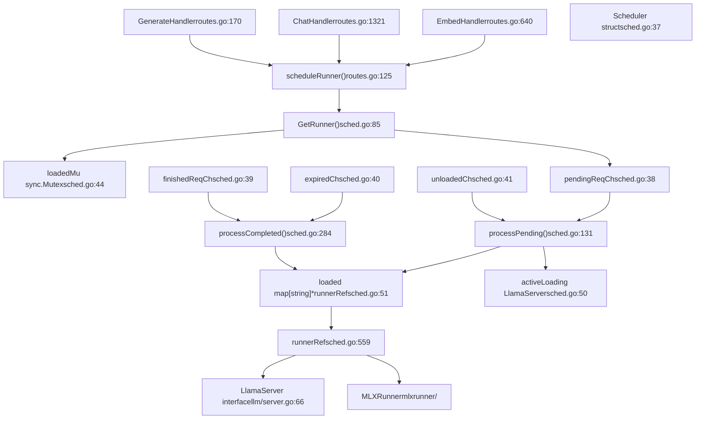
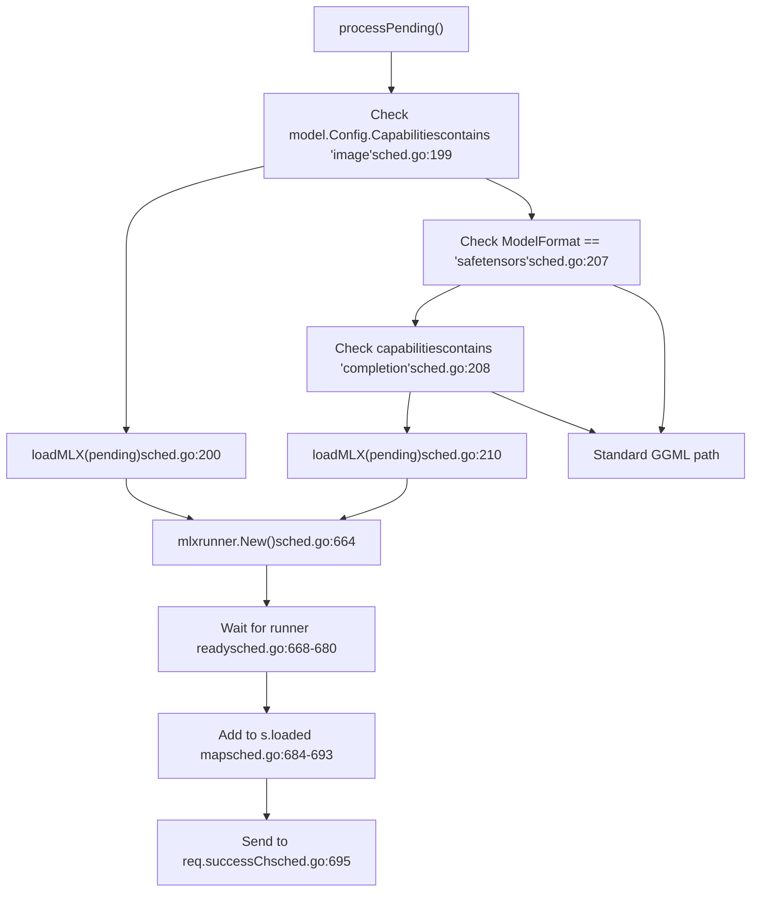
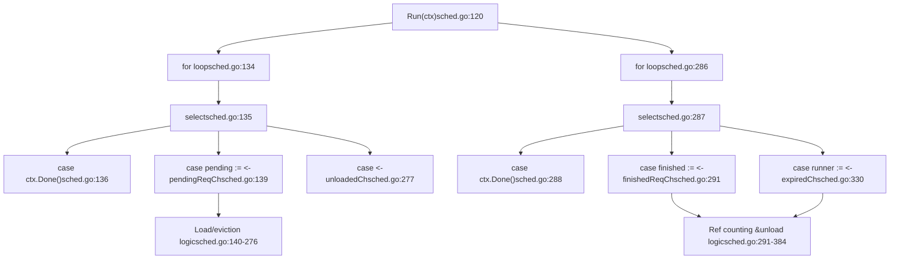
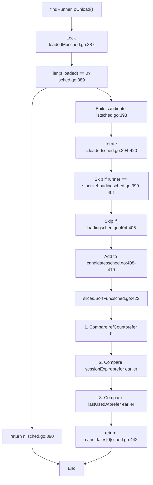
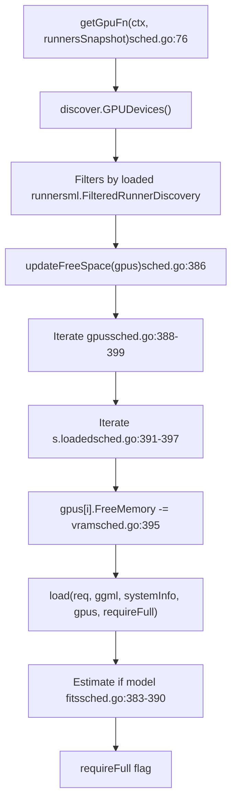
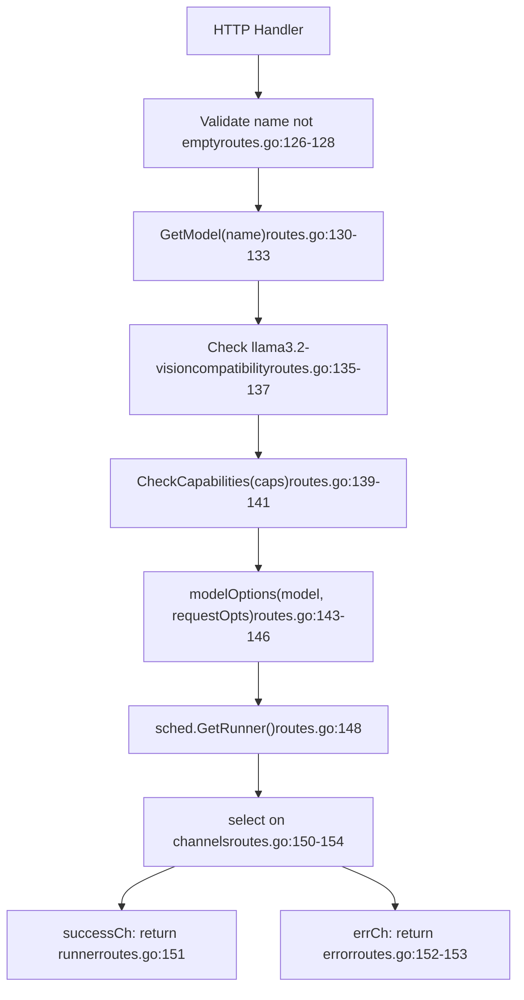

# Request Scheduling and Runner Management

Relevant source files

-   [api/client.go](https://github.com/ollama/ollama/blob/562c76d7/api/client.go)
-   [api/client\_test.go](https://github.com/ollama/ollama/blob/562c76d7/api/client_test.go)
-   [api/types.go](https://github.com/ollama/ollama/blob/562c76d7/api/types.go)
-   [cmd/cmd.go](https://github.com/ollama/ollama/blob/562c76d7/cmd/cmd.go)
-   [envconfig/config.go](https://github.com/ollama/ollama/blob/562c76d7/envconfig/config.go)
-   [envconfig/config\_test.go](https://github.com/ollama/ollama/blob/562c76d7/envconfig/config_test.go)
-   [llm/server.go](https://github.com/ollama/ollama/blob/562c76d7/llm/server.go)
-   [server/images.go](https://github.com/ollama/ollama/blob/562c76d7/server/images.go)
-   [server/routes.go](https://github.com/ollama/ollama/blob/562c76d7/server/routes.go)
-   [server/sched.go](https://github.com/ollama/ollama/blob/562c76d7/server/sched.go)
-   [server/sched\_test.go](https://github.com/ollama/ollama/blob/562c76d7/server/sched_test.go)

## Purpose and Scope

This page describes Ollama's request scheduling system and how it manages model runners. The scheduler is responsible for allocating model inference runners to incoming requests, managing the lifecycle of these runners, and optimizing resource utilization through intelligent loading and unloading decisions.

For information about the HTTP API endpoints that submit requests to the scheduler, see [HTTP Server and API Layer](/ollama/ollama/2.1-http-server-and-api-layer). For details on how runners execute model inference, see [Model Execution Pipeline](/ollama/ollama/2.3-model-execution-pipeline).

**Sources:** [server/sched.go1-57](https://github.com/ollama/ollama/blob/562c76d7/server/sched.go#L1-L57) [server/routes.go120-163](https://github.com/ollama/ollama/blob/562c76d7/server/routes.go#L120-L163)

## Architecture Overview

The scheduling system consists of three layers: HTTP handlers that receive requests, the `Scheduler` that orchestrates runner allocation, and the runner implementations (`LlamaServer` or `MLXRunner`) that execute model inference.

### Core Components and Their Relationships


**Sources:** [server/sched.go37-58](https://github.com/ollama/ollama/blob/562c76d7/server/sched.go#L37-L58) [server/routes.go125-157](https://github.com/ollama/ollama/blob/562c76d7/server/routes.go#L125-L157) [llm/server.go66-84](https://github.com/ollama/ollama/blob/562c76d7/llm/server.go#L66-L84) [x/mlxrunner/](https://github.com/ollama/ollama/blob/562c76d7/x/mlxrunner/)

### Key Data Structures

| Component | Type | Purpose | Location |
| --- | --- | --- | --- |
| `Scheduler` | struct | Orchestrates runner allocation and lifecycle | [server/sched.go37-58](https://github.com/ollama/ollama/blob/562c76d7/server/sched.go#L37-L58) |
| `LlmRequest` | struct | Represents a single request for a runner | [server/sched.go27-35](https://github.com/ollama/ollama/blob/562c76d7/server/sched.go#L27-L35) |
| `runnerRef` | struct | Wraps a runner with reference counting and expiration | [server/sched.go559-583](https://github.com/ollama/ollama/blob/562c76d7/server/sched.go#L559-L583) |
| `LlamaServer` | interface | Defines the API for model inference execution | [llm/server.go66-84](https://github.com/ollama/ollama/blob/562c76d7/llm/server.go#L66-L84) |
| `loaded` | map\[string\]\*runnerRef | Maps model paths to active runners | [server/sched.go51](https://github.com/ollama/ollama/blob/562c76d7/server/sched.go#L51-L51) |
| `activeLoading` | llm.LlamaServer | Tracks model currently being loaded | [server/sched.go50](https://github.com/ollama/ollama/blob/562c76d7/server/sched.go#L50-L50) |

The `Scheduler` maintains several function pointers for dependency injection: `loadFn`, `newServerFn`, `getGpuFn`, and `getSystemInfoFn` [server/sched.go53-56](https://github.com/ollama/ollama/blob/562c76d7/server/sched.go#L53-L56)

**Sources:** [server/sched.go27-58](https://github.com/ollama/ollama/blob/562c76d7/server/sched.go#L27-L58) [server/sched.go559-583](https://github.com/ollama/ollama/blob/562c76d7/server/sched.go#L559-L583) [llm/server.go66-84](https://github.com/ollama/ollama/blob/562c76d7/llm/server.go#L66-L84)

## Request Scheduling Flow

### High-Level Request Path

> **[Mermaid sequence]**
> *(图表结构无法解析)*

**Sources:** [server/routes.go125-157](https://github.com/ollama/ollama/blob/562c76d7/server/routes.go#L125-L157) [server/sched.go85-117](https://github.com/ollama/ollama/blob/562c76d7/server/sched.go#L85-L117) [server/sched.go131-282](https://github.com/ollama/ollama/blob/562c76d7/server/sched.go#L131-L282) [server/sched.go284-330](https://github.com/ollama/ollama/blob/562c76d7/server/sched.go#L284-L330)

### GetRunner Method

The `GetRunner` method is the main entry point for obtaining a runner. It implements a fast path for already-loaded runners and a queuing mechanism for new loads:

1.  **Validation**: Ensures minimum context size (4 tokens) [server/sched.go86-88](https://github.com/ollama/ollama/blob/562c76d7/server/sched.go#L86-L88) For multimodal models, adjusts to minimum 2048 tokens [server/sched.go90-93](https://github.com/ollama/ollama/blob/562c76d7/server/sched.go#L90-L93)
2.  **Request Creation**: Creates an `LlmRequest` with context, model, options, session duration, and result channels [server/sched.go95-102](https://github.com/ollama/ollama/blob/562c76d7/server/sched.go#L95-L102)
3.  **Fast Path Check**: Acquires `loadedMu` lock and checks if runner exists in `loaded` map [server/sched.go104-106](https://github.com/ollama/ollama/blob/562c76d7/server/sched.go#L104-L106)
4.  **Reload Decision**: Calls `needsReload()` to determine if existing runner is compatible [server/sched.go107](https://github.com/ollama/ollama/blob/562c76d7/server/sched.go#L107-L107)
5.  **Queue or Return**: If runner is usable, calls `useLoadedRunner()` to increment reference count and return immediately [server/sched.go108](https://github.com/ollama/ollama/blob/562c76d7/server/sched.go#L108-L108) Otherwise queues to `pendingReqCh` [server/sched.go110-115](https://github.com/ollama/ollama/blob/562c76d7/server/sched.go#L110-L115)

If the queue is full, returns `ErrMaxQueue` immediately [server/sched.go113](https://github.com/ollama/ollama/blob/562c76d7/server/sched.go#L113-L113)

**Sources:** [server/sched.go85-117](https://github.com/ollama/ollama/blob/562c76d7/server/sched.go#L85-L117)

## Runner Lifecycle Management

### Runner States and Transitions

> **[Mermaid stateDiagram]**
> *(图表结构无法解析)*

**Sources:** [server/sched.go366-502](https://github.com/ollama/ollama/blob/562c76d7/server/sched.go#L366-L502) [server/sched.go503-557](https://github.com/ollama/ollama/blob/562c76d7/server/sched.go#L503-L557) [server/sched.go559-644](https://github.com/ollama/ollama/blob/562c76d7/server/sched.go#L559-L644) [server/sched.go284-330](https://github.com/ollama/ollama/blob/562c76d7/server/sched.go#L284-L330)

### Reference Counting

Each `runnerRef` maintains a `refCount` that tracks active requests:

-   **Increment**: When `useLoadedRunner()` is called with a compatible runner [server/sched.go608-644](https://github.com/ollama/ollama/blob/562c76d7/server/sched.go#L608-L644) The method locks `refMu`, increments `refCount`, updates `sessionDuration` if needed, and records `lastUsedAt` [server/sched.go612-631](https://github.com/ollama/ollama/blob/562c76d7/server/sched.go#L612-L631)
-   **Decrement**: When a request completes and signals on `finishedReqCh` [server/sched.go291-302](https://github.com/ollama/ollama/blob/562c76d7/server/sched.go#L291-L302) The `processCompleted` goroutine handles this
-   **Protection**: The `refMu` sync.Mutex guards all access to `refCount`, `expireTimer`, and related fields [server/sched.go560](https://github.com/ollama/ollama/blob/562c76d7/server/sched.go#L560-L560)

When `refCount` reaches zero:

-   If `sessionDuration <= 0`, the runner is immediately expired [server/sched.go302-308](https://github.com/ollama/ollama/blob/562c76d7/server/sched.go#L302-L308)
-   If `sessionDuration > 0`, an `expireTimer` is started [server/sched.go309-326](https://github.com/ollama/ollama/blob/562c76d7/server/sched.go#L309-L326) The timer sends the runner to `expiredCh` when it fires

**Sources:** [server/sched.go559-583](https://github.com/ollama/ollama/blob/562c76d7/server/sched.go#L559-L583) [server/sched.go608-644](https://github.com/ollama/ollama/blob/562c76d7/server/sched.go#L608-L644) [server/sched.go291-330](https://github.com/ollama/ollama/blob/562c76d7/server/sched.go#L291-L330)

### Keep-Alive and Expiration

The expiration system controls how long idle runners remain in memory:

| Configuration | Behavior | Code Location |
| --- | --- | --- |
| `sessionDuration > 0` | Start timer when refCount reaches 0 | [server/sched.go309-326](https://github.com/ollama/ollama/blob/562c76d7/server/sched.go#L309-L326) |
| `sessionDuration = 0` | Expire immediately when idle | [server/sched.go302-308](https://github.com/ollama/ollama/blob/562c76d7/server/sched.go#L302-L308) |
| `sessionDuration < 0` | Keep loaded indefinitely | [server/sched.go595-599](https://github.com/ollama/ollama/blob/562c76d7/server/sched.go#L595-L599) |

The timer is managed in the `processCompleted` goroutine [server/sched.go284-330](https://github.com/ollama/ollama/blob/562c76d7/server/sched.go#L284-L330):

-   When a request finishes and `refCount` becomes 0, the goroutine either creates a new timer or resets an existing one
-   When the timer fires, it sends the `runnerRef` to `expiredCh` [server/sched.go319](https://github.com/ollama/ollama/blob/562c76d7/server/sched.go#L319-L319)
-   The `processCompleted` goroutine receives from `expiredCh` and calls `unload()` [server/sched.go330-384](https://github.com/ollama/ollama/blob/562c76d7/server/sched.go#L330-L384)

**Sources:** [server/sched.go284-384](https://github.com/ollama/ollama/blob/562c76d7/server/sched.go#L284-L384) [server/sched.go503-557](https://github.com/ollama/ollama/blob/562c76d7/server/sched.go#L503-L557)

## MLX Runner Support

The scheduler has special handling for MLX-based runners, which are used for image generation models and experimental safetensors LLM models.

### MLX Loading Path


MLX runners bypass the standard GGML loading path and use a simpler initialization [server/sched.go663-698](https://github.com/ollama/ollama/blob/562c76d7/server/sched.go#L663-L698)

**Sources:** [server/sched.go198-215](https://github.com/ollama/ollama/blob/562c76d7/server/sched.go#L198-L215) [server/sched.go663-698](https://github.com/ollama/ollama/blob/562c76d7/server/sched.go#L663-L698) [x/mlxrunner/](https://github.com/ollama/ollama/blob/562c76d7/x/mlxrunner/)

## Concurrent Request Processing

### Processing Goroutines

The `Scheduler` runs two main goroutines started by `Run()`:


Both goroutines exit when the context is canceled [server/sched.go136-138](https://github.com/ollama/ollama/blob/562c76d7/server/sched.go#L136-L138) [server/sched.go288-290](https://github.com/ollama/ollama/blob/562c76d7/server/sched.go#L288-L290)

**Sources:** [server/sched.go120-129](https://github.com/ollama/ollama/blob/562c76d7/server/sched.go#L120-L129) [server/sched.go131-282](https://github.com/ollama/ollama/blob/562c76d7/server/sched.go#L131-L282) [server/sched.go284-384](https://github.com/ollama/ollama/blob/562c76d7/server/sched.go#L284-L384)

### Max Runners and Capacity Management

The scheduler enforces a maximum number of concurrently loaded models through `OLLAMA_MAX_LOADED_MODELS`:

1.  **Dynamic Default**: If unset, defaults to `3 * number_of_gpus` where 3 is `defaultModelsPerGPU` [server/sched.go63](https://github.com/ollama/ollama/blob/562c76d7/server/sched.go#L63-L63) [server/sched.go185-196](https://github.com/ollama/ollama/blob/562c76d7/server/sched.go#L185-L196)
2.  **Capacity Check**: In `processPending`, compares `loadedCount` against `maxRunners` [server/sched.go170-172](https://github.com/ollama/ollama/blob/562c76d7/server/sched.go#L170-L172)
3.  **Eviction**: When at capacity, calls `findRunnerToUnload()` to select a victim [server/sched.go172](https://github.com/ollama/ollama/blob/562c76d7/server/sched.go#L172-L172)
4.  **Forced Expiration**: Sets victim's `sessionDuration` to 0, stops existing timer, and sends to `expiredCh` if idle [server/sched.go255-265](https://github.com/ollama/ollama/blob/562c76d7/server/sched.go#L255-L265)

The capacity check happens after checking if a runner already exists for the requested model [server/sched.go160-169](https://github.com/ollama/ollama/blob/562c76d7/server/sched.go#L160-L169)

**Sources:** [server/sched.go132](https://github.com/ollama/ollama/blob/562c76d7/server/sched.go#L132-L132) [server/sched.go170-246](https://github.com/ollama/ollama/blob/562c76d7/server/sched.go#L170-L246) [envconfig/config.go245-246](https://github.com/ollama/ollama/blob/562c76d7/envconfig/config.go#L245-L246)

### Finding Runners to Unload

The `findRunnerToUnload()` method implements a priority-based selection algorithm:


The sorting prioritizes:

1.  Idle runners (`refCount == 0`) over active ones [server/sched.go424-428](https://github.com/ollama/ollama/blob/562c76d7/server/sched.go#L424-L428)
2.  Earlier `sessionExpire` times [server/sched.go430-434](https://github.com/ollama/ollama/blob/562c76d7/server/sched.go#L430-L434)
3.  Earlier `lastUsedAt` times [server/sched.go436-440](https://github.com/ollama/ollama/blob/562c76d7/server/sched.go#L436-L440)

**Sources:** [server/sched.go386-444](https://github.com/ollama/ollama/blob/562c76d7/server/sched.go#L386-L444)

## Model Loading Process

### Load Function Flow

The `load()` function coordinates the process of allocating resources and starting a model runner:

> **[Mermaid sequence]**
> *(图表结构无法解析)*

**Sources:** [server/sched.go366-502](https://github.com/ollama/ollama/blob/562c76d7/server/sched.go#L366-L502) [llm/server.go142-318](https://github.com/ollama/ollama/blob/562c76d7/llm/server.go#L142-L318)

### Parallel Requests Configuration

The `numParallel` parameter controls how many concurrent inference sequences a single runner can handle:

-   **Calculation**: `numParallel = 1 + (NumCtx-1) / 2048` [server/sched.go376-381](https://github.com/ollama/ollama/blob/562c76d7/server/sched.go#L376-L381) For example, with `NumCtx = 4096`, `numParallel = 2`
-   **Effect**: KV cache size becomes `NumCtx * numParallel` [llm/server.go174](https://github.com/ollama/ollama/blob/562c76d7/llm/server.go#L174-L174) This is passed in the `LoadRequest` [server/sched.go381](https://github.com/ollama/ollama/blob/562c76d7/server/sched.go#L381-L381)
-   **Semaphore**: Runner uses `semaphore.NewWeighted(numParallel)` to limit concurrency [llm/server.go280](https://github.com/ollama/ollama/blob/562c76d7/llm/server.go#L280-L280)

This allows a single loaded model to serve multiple requests simultaneously, improving throughput. The value is calculated in `load()` and passed to `newServerFn` [server/sched.go392-396](https://github.com/ollama/ollama/blob/562c76d7/server/sched.go#L392-L396)

**Sources:** [server/sched.go376-381](https://github.com/ollama/ollama/blob/562c76d7/server/sched.go#L376-L381) [server/sched.go392-396](https://github.com/ollama/ollama/blob/562c76d7/server/sched.go#L392-L396) [llm/server.go174](https://github.com/ollama/ollama/blob/562c76d7/llm/server.go#L174-L174) [llm/server.go280](https://github.com/ollama/ollama/blob/562c76d7/llm/server.go#L280-L280)

## Resource Management

### GPU Allocation Strategy

The scheduler integrates with the GPU discovery system to optimize model placement:


The `getGpuFn` is called with a snapshot of loaded runners [server/sched.go154-157](https://github.com/ollama/ollama/blob/562c76d7/server/sched.go#L154-L157) to allow GPU discovery to filter appropriately. For CPU-only requests (`opts.NumGPU == 0`), GPU discovery is skipped [server/sched.go177-179](https://github.com/ollama/ollama/blob/562c76d7/server/sched.go#L177-L179)

**Sources:** [server/sched.go176-182](https://github.com/ollama/ollama/blob/562c76d7/server/sched.go#L176-L182) [server/sched.go386-401](https://github.com/ollama/ollama/blob/562c76d7/server/sched.go#L386-L401) [server/sched.go154-157](https://github.com/ollama/ollama/blob/562c76d7/server/sched.go#L154-L157)

### Free Space Tracking

The `updateFreeSpace()` method adjusts GPU memory availability based on loaded runners:

1.  **Iteration**: Loops through all GPUs in the provided slice [server/sched.go388-399](https://github.com/ollama/ollama/blob/562c76d7/server/sched.go#L388-L399)
2.  **Runner Check**: For each GPU, iterates through all loaded runners [server/sched.go391-397](https://github.com/ollama/ollama/blob/562c76d7/server/sched.go#L391-L397)
3.  **Subtraction**: Gets VRAM used by each runner on that GPU via `runner.VRAMByGPU(gpu.DeviceID)` and subtracts from `gpu.FreeMemory` [server/sched.go394-395](https://github.com/ollama/ollama/blob/562c76d7/server/sched.go#L394-L395)
4.  **Multi-GPU**: Handles runners split across multiple GPUs by checking each device ID

This ensures the scheduler has an accurate view of available memory when deciding whether to load a new model. The method is called after getting the GPU list and before loading [server/sched.go227](https://github.com/ollama/ollama/blob/562c76d7/server/sched.go#L227-L227)

**Sources:** [server/sched.go386-401](https://github.com/ollama/ollama/blob/562c76d7/server/sched.go#L386-L401) [server/sched.go227](https://github.com/ollama/ollama/blob/562c76d7/server/sched.go#L227-L227)

## Model Reloading Logic

### Reload Decision Criteria

The `needsReload()` method determines if an existing runner is compatible with a new request:

| Condition | Check | Result |
| --- | --- | --- |
| Context canceled | `ctx.Err() != nil` | Reload [server/sched.go587-589](https://github.com/ollama/ollama/blob/562c76d7/server/sched.go#L587-L589) |
| Options changed | `!reflect.DeepEqual(req.opts, runner.llama.Options())` | Reload [server/sched.go590-592](https://github.com/ollama/ollama/blob/562c76d7/server/sched.go#L590-L592) |
| Session duration longer | `req.sessionDuration != nil && *req.sessionDuration > runner.sessionDuration` | Update, no reload [server/sched.go595-599](https://github.com/ollama/ollama/blob/562c76d7/server/sched.go#L595-L599) |
| Adapters changed | `!slices.Equal(req.model.AdapterPaths, runner.llama.Adapters())` | Reload [server/sched.go600-602](https://github.com/ollama/ollama/blob/562c76d7/server/sched.go#L600-L602) |
| Projectors changed | `!slices.Equal(req.model.ProjectorPaths, runner.llama.Projectors())` | Reload [server/sched.go603-605](https://github.com/ollama/ollama/blob/562c76d7/server/sched.go#L603-L605) |

The comparison uses `reflect.DeepEqual()` for options [server/sched.go590](https://github.com/ollama/ollama/blob/562c76d7/server/sched.go#L590-L590) and `slices.Equal()` for adapter and projector paths [server/sched.go600](https://github.com/ollama/ollama/blob/562c76d7/server/sched.go#L600-L600) [server/sched.go603](https://github.com/ollama/ollama/blob/562c76d7/server/sched.go#L603-L603)

**Sources:** [server/sched.go585-607](https://github.com/ollama/ollama/blob/562c76d7/server/sched.go#L585-L607)

### In-Place Session Duration Update

When only the session duration differs, the scheduler updates it without reloading:

```
if runner.sessionDuration < *req.sessionDuration {    runner.sessionDuration = *req.sessionDuration}
```
This optimization avoids unnecessary model unloading/reloading when a client simply requests a longer keep-alive.

**Sources:** [server/sched.go595-599](https://github.com/ollama/ollama/blob/562c76d7/server/sched.go#L595-L599)

## Error Handling and Recovery

### Load Timeout Detection

The scheduler implements stall detection during model loading:

1.  **Timer**: Creates a timer with `envconfig.LoadTimeout()` (default 5 minutes) [server/sched.go408-409](https://github.com/ollama/ollama/blob/562c76d7/server/sched.go#L408-L409)
2.  **Progress Loop**: Monitors `runner.loadProgress` for changes in a loop [server/sched.go415-433](https://github.com/ollama/ollama/blob/562c76d7/server/sched.go#L415-L433)
3.  **Stall Detection**: If progress doesn't change within timeout period, considers load stalled [server/sched.go425-433](https://github.com/ollama/ollama/blob/562c76d7/server/sched.go#L425-L433)
4.  **Cleanup**: Calls `runner.llama.Close()` and removes from `loaded` map [server/sched.go442-452](https://github.com/ollama/ollama/blob/562c76d7/server/sched.go#L442-L452)
5.  **Error Return**: Sends timeout error to `req.errCh` [server/sched.go453-456](https://github.com/ollama/ollama/blob/562c76d7/server/sched.go#L453-L456)

The timeout is configurable via `OLLAMA_LOAD_TIMEOUT` environment variable, with negative/zero values treated as infinite [envconfig/config.go123-137](https://github.com/ollama/ollama/blob/562c76d7/envconfig/config.go#L123-L137)

**Sources:** [server/sched.go402-456](https://github.com/ollama/ollama/blob/562c76d7/server/sched.go#L402-L456) [envconfig/config.go120-138](https://github.com/ollama/ollama/blob/562c76d7/envconfig/config.go#L120-L138)

### Recovery After Failed Load

When a load fails, the scheduler performs cleanup and allows retry:

1.  **Error Propagation**: Sends error to `req.errCh` [server/sched.go467-470](https://github.com/ollama/ollama/blob/562c76d7/server/sched.go#L467-L470)
2.  **Unload Cleanup**: If runner exists in `loaded` map, calls `unload()` [server/sched.go460-465](https://github.com/ollama/ollama/blob/562c76d7/server/sched.go#L460-L465)
3.  **Retry Delay**: Waits `waitForRecovery` duration (default 5 seconds) before processing next request [server/sched.go471-481](https://github.com/ollama/ollama/blob/562c76d7/server/sched.go#L471-L481)
4.  **State Reset**: Clears `activeLoading` to allow new loads [server/sched.go500-501](https://github.com/ollama/ollama/blob/562c76d7/server/sched.go#L500-L501)

The retry delay is configurable via the `Scheduler.waitForRecovery` field [server/sched.go57](https://github.com/ollama/ollama/blob/562c76d7/server/sched.go#L57-L57) and prevents rapid retry loops. During the delay, if the context is canceled, the function returns early [server/sched.go476-478](https://github.com/ollama/ollama/blob/562c76d7/server/sched.go#L476-L478)

**Sources:** [server/sched.go457-502](https://github.com/ollama/ollama/blob/562c76d7/server/sched.go#L457-L502) [server/sched.go57](https://github.com/ollama/ollama/blob/562c76d7/server/sched.go#L57-L57)

## Integration with HTTP Layer

### scheduleRunner Method

The `scheduleRunner()` method in routes.go bridges HTTP requests to the scheduler:


Key validations performed:

-   Model name not empty [server/routes.go126-128](https://github.com/ollama/ollama/blob/562c76d7/server/routes.go#L126-L128)
-   Model exists via `GetModel(name)` [server/routes.go130-133](https://github.com/ollama/ollama/blob/562c76d7/server/routes.go#L130-L133)
-   Special check for llama3.2-vision compatibility [server/routes.go135-137](https://github.com/ollama/ollama/blob/562c76d7/server/routes.go#L135-L137)
-   Model supports requested capabilities [server/routes.go139-141](https://github.com/ollama/ollama/blob/562c76d7/server/routes.go#L139-L141)
-   Options are valid [server/routes.go143-146](https://github.com/ollama/ollama/blob/562c76d7/server/routes.go#L143-L146)

**Sources:** [server/routes.go125-157](https://github.com/ollama/ollama/blob/562c76d7/server/routes.go#L125-L157)

### Capability Checking

Before scheduling, the system verifies the model supports the requested operation via `model.CheckCapabilities(caps)`:

| Capability | Required For | Error in Handler |
| --- | --- | --- |
| `CapabilityCompletion` | `/api/generate` | "does not support generate" [server/routes.go373-376](https://github.com/ollama/ollama/blob/562c76d7/server/routes.go#L373-L376) |
| `CapabilityInsert` | Suffix parameter in generate | "does not support insert" (via CheckCapabilities) |
| `CapabilityVision` | Image inputs | "does not support vision" (via CheckCapabilities) |
| `CapabilityEmbedding` | `/api/embed` | N/A (no check) [server/sched.go681](https://github.com/ollama/ollama/blob/562c76d7/server/sched.go#L681-L681) |
| `CapabilityThinking` | Think parameter | "does not support thinking" [server/routes.go366-369](https://github.com/ollama/ollama/blob/562c76d7/server/routes.go#L366-L369) |

The capabilities are determined from the model's GGUF file or config [server/images.go75-141](https://github.com/ollama/ollama/blob/562c76d7/server/images.go#L75-L141)

**Sources:** [server/routes.go354-378](https://github.com/ollama/ollama/blob/562c76d7/server/routes.go#L354-L378) [server/images.go75-141](https://github.com/ollama/ollama/blob/562c76d7/server/images.go#L75-L141) [server/sched.go681](https://github.com/ollama/ollama/blob/562c76d7/server/sched.go#L681-L681)

## Expiration Management

### Manual Expiration via API

Clients can explicitly unload a model by sending a request with empty prompt and `KeepAlive.Duration = 0`:

```
if req.Prompt == "" && req.KeepAlive != nil && req.KeepAlive.Duration == 0 {    s.sched.expireRunner(m)    // Return success response with DoneReason: "unload"}
```
The `expireRunner()` method locks the runner, stops any existing timer, sets `sessionDuration` to 0, and immediately sends the runner to `expiredCh` if it's idle (`refCount <= 0`) [server/sched.go646-659](https://github.com/ollama/ollama/blob/562c76d7/server/sched.go#L646-L659) This allows clients to explicitly free resources.

**Sources:** [server/routes.go311-322](https://github.com/ollama/ollama/blob/562c76d7/server/routes.go#L311-L322) [server/sched.go644-661](https://github.com/ollama/ollama/blob/562c76d7/server/sched.go#L644-L661)

### Automatic Cleanup on Shutdown

When the server context is canceled, all goroutines exit and runners are implicitly closed. The scheduler does not perform explicit cleanup as the process termination handles resource deallocation.

**Sources:** [server/sched.go135-137](https://github.com/ollama/ollama/blob/562c76d7/server/sched.go#L135-L137) [server/sched.go268-270](https://github.com/ollama/ollama/blob/562c76d7/server/sched.go#L268-L270)

## Performance Considerations

### Channel Buffer Sizing

The scheduler uses buffered channels sized by `envconfig.MaxQueue()`:

```
pendingReqCh:    make(chan *LlmRequest, maxQueue),finishedReqCh:   make(chan *LlmRequest, maxQueue),expiredCh:       make(chan *runnerRef, maxQueue),unloadedCh:      make(chan any, maxQueue),
```
Default `MaxQueue` is 512 [envconfig/config.go248](https://github.com/ollama/ollama/blob/562c76d7/envconfig/config.go#L248-L248) allowing significant request buffering before blocking. When the `pendingReqCh` is full, `GetRunner` returns `ErrMaxQueue` immediately [server/sched.go113-114](https://github.com/ollama/ollama/blob/562c76d7/server/sched.go#L113-L114)

**Sources:** [server/sched.go69-73](https://github.com/ollama/ollama/blob/562c76d7/server/sched.go#L69-L73) [envconfig/config.go248](https://github.com/ollama/ollama/blob/562c76d7/envconfig/config.go#L248-L248) [server/sched.go113-114](https://github.com/ollama/ollama/blob/562c76d7/server/sched.go#L113-L114)

### Lock Contention Management

The `loadedMu` mutex protects the `loaded` map and `activeLoading` field [server/sched.go44](https://github.com/ollama/ollama/blob/562c76d7/server/sched.go#L44-L44) Critical sections are minimized:

-   **Short locks**: Most operations acquire, check/update, and release quickly
-   **Snapshot pattern**: `processPending` creates a snapshot of runners before releasing lock [server/sched.go151-158](https://github.com/ollama/ollama/blob/562c76d7/server/sched.go#L151-L158): `runnersSnapshot := make([]ml.FilteredRunnerDiscovery, 0, len(s.loaded))`
-   **No locks during I/O**: Loading and unloading happen outside critical sections. The lock is released before calling `load()` or `unload()`

Each `runnerRef` has its own `refMu` mutex [server/sched.go560](https://github.com/ollama/ollama/blob/562c76d7/server/sched.go#L560-L560) to protect its reference count and timer fields, allowing fine-grained locking.

**Sources:** [server/sched.go44](https://github.com/ollama/ollama/blob/562c76d7/server/sched.go#L44-L44) [server/sched.go151-158](https://github.com/ollama/ollama/blob/562c76d7/server/sched.go#L151-L158) [server/sched.go560](https://github.com/ollama/ollama/blob/562c76d7/server/sched.go#L560-L560)

### Fast Path Optimization

The `GetRunner()` fast path returns immediately for compatible loaded runners without queuing:

```
runner := s.loaded[req.model.ModelPath]if runner != nil && !runner.needsReload(c, req) {    req.useLoadedRunner(runner, s.finishedReqCh)    return req.successCh, req.errCh}
```
This minimizes latency for the common case of repeated requests to the same model.

**Sources:** [server/sched.go103-108](https://github.com/ollama/ollama/blob/562c76d7/server/sched.go#L103-L108)
