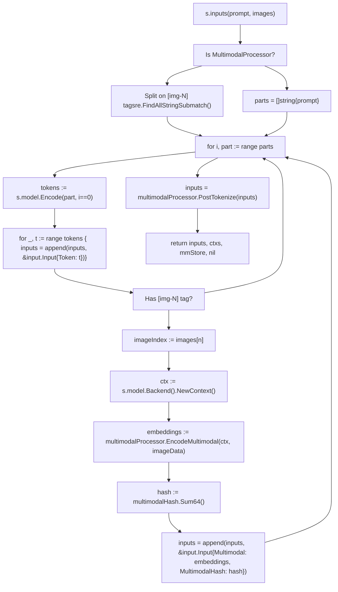
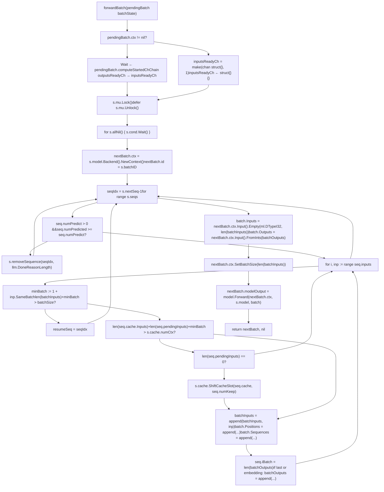
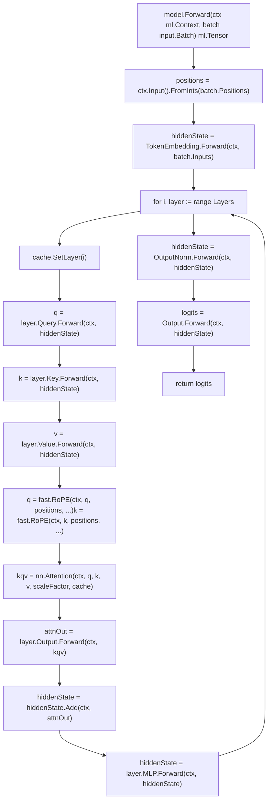
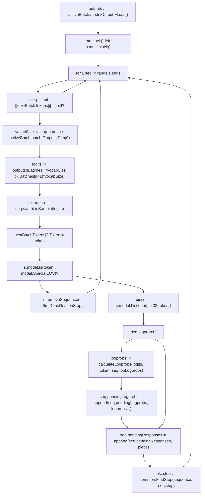
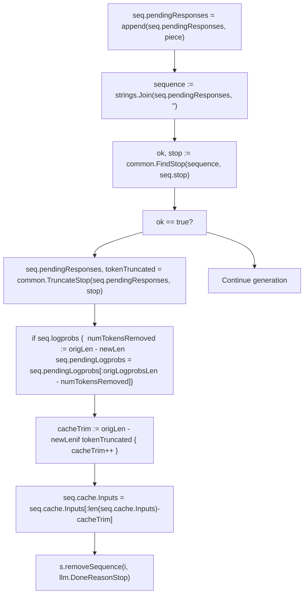
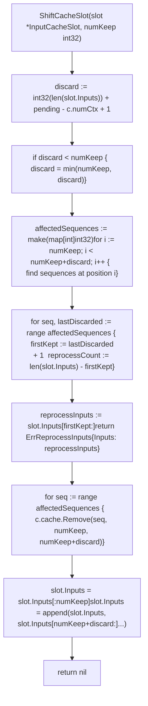
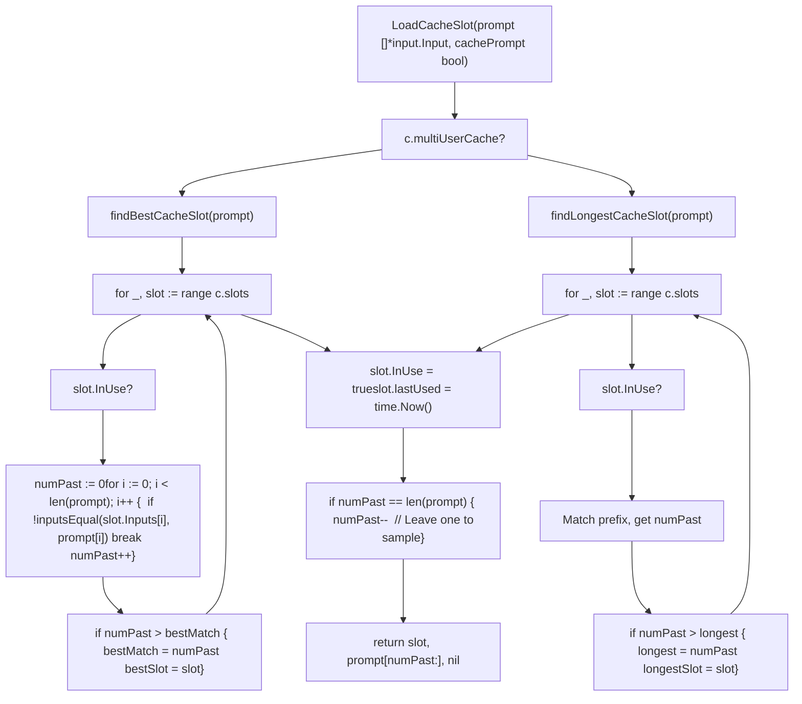
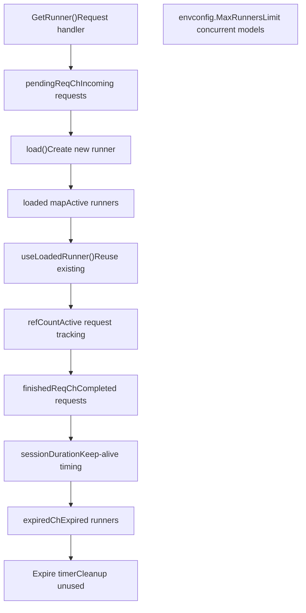

# Model Execution Pipeline

Relevant source files

-   [api/client.go](https://github.com/ollama/ollama/blob/562c76d7/api/client.go)
-   [api/client\_test.go](https://github.com/ollama/ollama/blob/562c76d7/api/client_test.go)
-   [api/types.go](https://github.com/ollama/ollama/blob/562c76d7/api/types.go)
-   [cmd/cmd.go](https://github.com/ollama/ollama/blob/562c76d7/cmd/cmd.go)
-   [integration/embed\_test.go](https://github.com/ollama/ollama/blob/562c76d7/integration/embed_test.go)
-   [kvcache/cache.go](https://github.com/ollama/ollama/blob/562c76d7/kvcache/cache.go)
-   [kvcache/causal.go](https://github.com/ollama/ollama/blob/562c76d7/kvcache/causal.go)
-   [kvcache/causal\_test.go](https://github.com/ollama/ollama/blob/562c76d7/kvcache/causal_test.go)
-   [kvcache/encoder.go](https://github.com/ollama/ollama/blob/562c76d7/kvcache/encoder.go)
-   [kvcache/wrapper.go](https://github.com/ollama/ollama/blob/562c76d7/kvcache/wrapper.go)
-   [llama/llama.go](https://github.com/ollama/ollama/blob/562c76d7/llama/llama.go)
-   [llama/sampling\_ext.cpp](https://github.com/ollama/ollama/blob/562c76d7/llama/sampling_ext.cpp)
-   [llama/sampling\_ext.h](https://github.com/ollama/ollama/blob/562c76d7/llama/sampling_ext.h)
-   [ml/backend.go](https://github.com/ollama/ollama/blob/562c76d7/ml/backend.go)
-   [ml/backend/ggml/ggml.go](https://github.com/ollama/ollama/blob/562c76d7/ml/backend/ggml/ggml.go)
-   [model/input/input.go](https://github.com/ollama/ollama/blob/562c76d7/model/input/input.go)
-   [model/model.go](https://github.com/ollama/ollama/blob/562c76d7/model/model.go)
-   [model/model\_test.go](https://github.com/ollama/ollama/blob/562c76d7/model/model_test.go)
-   [runner/llamarunner/cache.go](https://github.com/ollama/ollama/blob/562c76d7/runner/llamarunner/cache.go)
-   [runner/llamarunner/runner.go](https://github.com/ollama/ollama/blob/562c76d7/runner/llamarunner/runner.go)
-   [runner/ollamarunner/cache.go](https://github.com/ollama/ollama/blob/562c76d7/runner/ollamarunner/cache.go)
-   [runner/ollamarunner/cache\_test.go](https://github.com/ollama/ollama/blob/562c76d7/runner/ollamarunner/cache_test.go)
-   [runner/ollamarunner/runner.go](https://github.com/ollama/ollama/blob/562c76d7/runner/ollamarunner/runner.go)
-   [server/images.go](https://github.com/ollama/ollama/blob/562c76d7/server/images.go)
-   [server/internal/internal/backoff/backoff.go](https://github.com/ollama/ollama/blob/562c76d7/server/internal/internal/backoff/backoff.go)
-   [server/routes.go](https://github.com/ollama/ollama/blob/562c76d7/server/routes.go)

This page traces the complete execution flow from API request through tokenization, batching, forward passes, sampling, and response streaming. It focuses on the runtime inference path after a model has been loaded and scheduled.

For HTTP API layer details, see page 2.1. For model loading and GPU scheduling, see page 2.2. For model storage and distribution, see page 2.4.

## Overview

The execution pipeline processes inference requests through these stages:

1.  **Sequence Creation** - `NewSequence()` tokenizes prompts and encodes multimodal inputs
2.  **Batch Building** - `forwardBatch()` collects pending inputs across sequences
3.  **Forward Pass** - `computeBatch()` executes model computation on backend
4.  **Token Sampling** - `sampler.Sample()` selects next token from logits
5.  **Response Streaming** - Tokens sent to client via `responses` channel

Two runner implementations exist:

-   **ollamarunner** [runner/ollamarunner/runner.go](https://github.com/ollama/ollama/blob/562c76d7/runner/ollamarunner/runner.go) - Async batching with dual-phase pipeline
-   **llamarunner** [runner/llamarunner/runner.go](https://github.com/ollama/ollama/blob/562c76d7/runner/llamarunner/runner.go) - Synchronous execution via llama.cpp bindings

The ollamarunner overlaps batch preparation with GPU execution for improved throughput. The llamarunner provides compatibility with the llama.cpp ecosystem and is used for certain model architectures.

### Runner Architecture Comparison

**Runner Implementation Comparison**

```mermaid
flowchart TD
    OR_Server["Server"]
    OR_run["run()"]
    OR_forwardBatch["forwardBatch()"]
    OR_computeBatch["computeBatch()"]
    OR_model["model.Forward()"]
    LR_Server["Server"]
    LR_run["run()"]
    LR_processBatch["processBatch()"]
    LR_llamaDecode["llama.Decode()"]
    Backend_ggml["ml/backend/ggml"]
    Backend_llama["llama/llama.go"]

    OR --> Server_OR_run
    OR --> run_OR_forwardBatch
    OR --> run_OR_computeBatch
    OR --> forwardBatch_OR_model
    LR --> Server_LR_run
    LR --> run_LR_processBatch
    LR --> processBatch_LR_llamaDecode
    OR --> model_Backend_ggml
    LR --> llamaDecode_Backend_llama
```


| Component | ollamarunner | llamarunner |
| --- | --- | --- |
| **Entry Point** | `Server.run()` [runner/ollamarunner/runner.go440](https://github.com/ollama/ollama/blob/562c76d7/runner/ollamarunner/runner.go#L440-L440) | `Server.run()` [runner/llamarunner/runner.go358](https://github.com/ollama/ollama/blob/562c76d7/runner/llamarunner/runner.go#L358-L358) |
| **Batch Building** | `forwardBatch()` async | `processBatch()` sync |
| **Forward Pass** | `model.Forward()` via ml.Backend | `llama.Decode()` via CGO |
| **State Management** | `batchState` struct with channels | Inline in `processBatch()` |
| **Concurrency** | Overlapped batch prep and compute | Sequential execution |

Sources: [runner/ollamarunner/runner.go440-466](https://github.com/ollama/ollama/blob/562c76d7/runner/ollamarunner/runner.go#L440-L466) [runner/llamarunner/runner.go358-400](https://github.com/ollama/ollama/blob/562c76d7/runner/llamarunner/runner.go#L358-L400) [llama/llama.go168-184](https://github.com/ollama/ollama/blob/562c76d7/llama/llama.go#L168-L184)

### Key Data Structures

**Server struct** [runner/ollamarunner/runner.go304-361](https://github.com/ollama/ollama/blob/562c76d7/runner/ollamarunner/runner.go#L304-L361):

| Field | Type | Purpose |
| --- | --- | --- |
| `model` | `model.Model` | Loaded model instance |
| `seqs` | `[]*Sequence` | Active sequences being processed |
| `cache` | `*InputCache` | KV cache manager across sequences |
| `mu` | `sync.Mutex` | Protects sequence state |
| `cond` | `*sync.Cond` | Wakes `run()` when sequences added |
| `batchSize` | `int` | Max tokens per batch |
| `parallel` | `int` | Max concurrent sequences |

**Sequence struct** [runner/ollamarunner/runner.go50-115](https://github.com/ollama/ollama/blob/562c76d7/runner/ollamarunner/runner.go#L50-L115):

| Field | Type | Purpose |
| --- | --- | --- |
| `inputs` | `[]*input.Input` | Remaining tokens/embeddings to process |
| `pendingInputs` | `[]*input.Input` | Tokens added to current batch |
| `cache` | `*InputCacheSlot` | Assigned KV cache slot |
| `responses` | `chan response` | Output token stream to client |
| `sampler` | `sample.Sampler` | Token selection logic |
| `iBatch` | `int` | Position in batch output array |
| `numPredict` | `int` | Max tokens to generate |

Sources: [runner/ollamarunner/runner.go304-361](https://github.com/ollama/ollama/blob/562c76d7/runner/ollamarunner/runner.go#L304-L361) [runner/ollamarunner/runner.go50-115](https://github.com/ollama/ollama/blob/562c76d7/runner/ollamarunner/runner.go#L50-L115)

## Request Processing Flow

### Entry Point and Sequence Creation

Requests enter via `Completion()` [llm/server.go66-83](https://github.com/ollama/ollama/blob/562c76d7/llm/server.go#L66-L83) on the `LlamaServer` interface:

**Request Flow Through Server**

> **[Mermaid sequence]**
> *(图表结构无法解析)*

Sources: [llm/server.go66-83](https://github.com/ollama/ollama/blob/562c76d7/llm/server.go#L66-L83) [runner/ollamarunner/runner.go131-210](https://github.com/ollama/ollama/blob/562c76d7/runner/ollamarunner/runner.go#L131-L210)

### Input Processing and Tokenization

The `inputs()` method [runner/ollamarunner/runner.go221-297](https://github.com/ollama/ollama/blob/562c76d7/runner/ollamarunner/runner.go#L221-L297) converts prompts and images into `[]*input.Input`:

**Input Processing Flow**


**input.Input struct** [model/input/input.go9-20](https://github.com/ollama/ollama/blob/562c76d7/model/input/input.go#L9-L20):

| Field | Type | Purpose |
| --- | --- | --- |
| `Token` | `int32` | Token ID for text |
| `Multimodal` | `[]Multimodal` | Vision embeddings from encoder |
| `MultimodalHash` | `uint64` | Hash for caching embeddings |
| `SameBatch` | `int` | Forces N following tokens into same batch |

Sources: [runner/ollamarunner/runner.go221-297](https://github.com/ollama/ollama/blob/562c76d7/runner/ollamarunner/runner.go#L221-L297) [model/input/input.go9-20](https://github.com/ollama/ollama/blob/562c76d7/model/input/input.go#L9-L20)

## Batching System

### Dual-Phase Batch Processing

The `run()` method [runner/ollamarunner/runner.go440-466](https://github.com/ollama/ollama/blob/562c76d7/runner/ollamarunner/runner.go#L440-L466) alternates between `forwardBatch()` and `computeBatch()`:

**Batch Pipeline Synchronization Diagram**

> **[Mermaid sequence]**
> *(图表结构无法解析)*

**batchState struct** [runner/ollamarunner/runner.go273-302](https://github.com/ollama/ollama/blob/562c76d7/runner/ollamarunner/runner.go#L273-L302):

| Field | Type | Purpose |
| --- | --- | --- |
| `id` | `int` | Trace logging counter |
| `ctx` | `ml.Context` | Backend context from `model.Backend().NewContext()` |
| `modelOutput` | `ml.Tensor` | Output logits tensor |
| `batchInputs` | `[]*input.Input` | Input pointers (tokens filled later) |
| `batch` | `input.Batch` | Input batch with `Positions`, `Sequences` |
| `seqs` | `[]*Sequence` | Snapshot of active sequences |
| `inputsReadyCh` | `chan struct{}` | Signals token values ready |
| `computeStartedCh` | `chan struct{}` | Signals forward pass started |
| `outputsReadyCh` | `chan struct{}` | Signals outputs available |

The `supportsAsync` flag checks if `pooling.Type == pooling.TypeNone` [runner/ollamarunner/runner.go443](https://github.com/ollama/ollama/blob/562c76d7/runner/ollamarunner/runner.go#L443-L443)

Sources: [runner/ollamarunner/runner.go273-302](https://github.com/ollama/ollama/blob/562c76d7/runner/ollamarunner/runner.go#L273-L302) [runner/ollamarunner/runner.go440-466](https://github.com/ollama/ollama/blob/562c76d7/runner/ollamarunner/runner.go#L440-L466) [runner/ollamarunner/runner.go612-850](https://github.com/ollama/ollama/blob/562c76d7/runner/ollamarunner/runner.go#L612-L850)

### Building a Batch

The `forwardBatch()` method [runner/ollamarunner/runner.go469-638](https://github.com/ollama/ollama/blob/562c76d7/runner/ollamarunner/runner.go#L469-L638) builds the next batch:

**forwardBatch() Implementation Diagram**


**Batching constraints:**

-   `batchSize` (from `s.batchSize`) limits tokens per batch
-   `inp.SameBatch` forces following tokens into same batch
-   `s.cache.numCtx` triggers `ShiftCacheSlot()` when exceeded
-   `s.nextSeq` implements round-robin to prevent starvation

**input.Batch struct** [model/input/input.go22-28](https://github.com/ollama/ollama/blob/562c76d7/model/input/input.go#L22-L28):

| Field | Type | Description |
| --- | --- | --- |
| `Inputs` | `ml.Tensor` | Token IDs tensor (shape: `[len(Positions)]`) |
| `Outputs` | `ml.Tensor` | Indices of tokens needing logits |
| `Positions` | `[]int32` | Position in sequence for each token |
| `Sequences` | `[]int` | Sequence ID for each token |
| `Multimodal` | `[]MultimodalIndex` | Multimodal data attachments |

Sources: [runner/ollamarunner/runner.go469-638](https://github.com/ollama/ollama/blob/562c76d7/runner/ollamarunner/runner.go#L469-L638) [model/input/input.go22-28](https://github.com/ollama/ollama/blob/562c76d7/model/input/input.go#L22-L28)

### Concurrent Sequence Handling

Multiple sequences are processed concurrently with careful synchronization:

> **[Mermaid stateDiagram]**
> *(图表结构无法解析)*

Each sequence maintains:

-   `inputs`: Remaining tokens to process
-   `pendingInputs`: Tokens in current batch
-   `iBatch`: Index in batch output array for sampling

Sources: [runner/ollamarunner/runner.go44-102](https://github.com/ollama/ollama/blob/562c76d7/runner/ollamarunner/runner.go#L44-L102) [runner/ollamarunner/runner.go481-575](https://github.com/ollama/ollama/blob/562c76d7/runner/ollamarunner/runner.go#L481-L575)

## Forward Pass Execution

### Compute Graph Building

The `model.Forward()` method [model/model.go35-36](https://github.com/ollama/ollama/blob/562c76d7/model/model.go#L35-L36) builds a compute graph:

**Model Forward Pass Graph Construction Diagram**


The graph is symbolic - tensors represent operations, not data. Operations are recorded via `ctx.Forward()` calls:

```
ctx.Forward(tensor1, tensor2, ...)  // Marks tensors for computation
```
Graph construction happens in `forwardBatch()` [runner/ollamarunner/runner.go629-634](https://github.com/ollama/ollama/blob/562c76d7/runner/ollamarunner/runner.go#L629-L634) Execution happens in `computeBatch()` via `ctx.Compute()` [runner/ollamarunner/runner.go722-728](https://github.com/ollama/ollama/blob/562c76d7/runner/ollamarunner/runner.go#L722-L728)

Sources: [model/models/llama/model.go125-142](https://github.com/ollama/ollama/blob/562c76d7/model/models/llama/model.go#L125-L142) [runner/ollamarunner/runner.go629-634](https://github.com/ollama/ollama/blob/562c76d7/runner/ollamarunner/runner.go#L629-L634) [ml/backend/ggml/ggml.go794-804](https://github.com/ollama/ollama/blob/562c76d7/ml/backend/ggml/ggml.go#L794-L804)

### Backend Execution

The `computeBatch()` method [runner/ollamarunner/runner.go642-850](https://github.com/ollama/ollama/blob/562c76d7/runner/ollamarunner/runner.go#L642-L850) executes the graph:

**computeBatch() Execution Flow Diagram**

> **[Mermaid sequence]**
> *(图表结构无法解析)*

**Backend scheduling** (GGML):

The `Context.Compute()` [ml/backend/ggml/ggml.go810-843](https://github.com/ollama/ollama/blob/562c76d7/ml/backend/ggml/ggml.go#L810-L843) calls:

1.  `C.ggml_backend_sched_set_batch_size()` - Set batch hint
2.  `C.ggml_backend_sched_graph_compute_async()` - Execute graph on GPU/CPU
3.  Wait for synchronization in tensor read operations

Tensors are assigned to devices during model loading based on `GPULayers` configuration [ml/backend/ggml/ggml.go203-229](https://github.com/ollama/ollama/blob/562c76d7/ml/backend/ggml/ggml.go#L203-L229)

Sources: [runner/ollamarunner/runner.go642-850](https://github.com/ollama/ollama/blob/562c76d7/runner/ollamarunner/runner.go#L642-L850) [ml/backend/ggml/ggml.go810-843](https://github.com/ollama/ollama/blob/562c76d7/ml/backend/ggml/ggml.go#L810-L843) [ml/backend/ggml/ggml.go203-229](https://github.com/ollama/ollama/blob/562c76d7/ml/backend/ggml/ggml.go#L203-L229)

## Token Generation and Sampling

### Sampling from Logits

Token sampling occurs in `computeBatch()` after the forward pass [runner/ollamarunner/runner.go758-787](https://github.com/ollama/ollama/blob/562c76d7/runner/ollamarunner/runner.go#L758-L787):

**Token Sampling Implementation Diagram**


**sample.Sampler interface** [sample/sampler.go9-11](https://github.com/ollama/ollama/blob/562c76d7/sample/sampler.go#L9-L11):

```
type Sampler interface {    Sample(logits []float32) (int32, error)}
```
**Sampling parameters** applied in `sampler.Sample()`:

| Transform | Location | Effect |
| --- | --- | --- |
| Frequency/Presence Penalty | `Logits()` | Penalizes recent tokens by occurrence count |
| Temperature | `Logits()` | Scales logits: `logit /= temperature` |
| Min-P Filter | `Candidates()` | Removes tokens with `p < min_p * max_p` |
| Top-K Filter | `Candidates()` | Keeps only top K tokens by probability |
| Top-P (Nucleus) | `Candidates()` | Cumulative probability cutoff |
| Final Selection | `Sample()` | Multinomial sampling from filtered distribution |

Sources: [runner/ollamarunner/runner.go758-787](https://github.com/ollama/ollama/blob/562c76d7/runner/ollamarunner/runner.go#L758-L787) [sample/sampler.go9-11](https://github.com/ollama/ollama/blob/562c76d7/sample/sampler.go#L9-L11) [sample/sample.go](https://github.com/ollama/ollama/blob/562c76d7/sample/sample.go)

### Stop Sequence Detection

Stop sequences are checked in `computeBatch()` [runner/ollamarunner/runner.go792-838](https://github.com/ollama/ollama/blob/562c76d7/runner/ollamarunner/runner.go#L792-L838):

**Stop Sequence Detection Implementation Diagram**


**common.FindStop()** [runner/common/common.go12-38](https://github.com/ollama/ollama/blob/562c76d7/runner/common/common.go#L12-L38):

-   Iterates through `seq.stop` strings
-   Returns `true, stopStr` if `stopStr` is found in `sequence`
-   Returns `false, ""` if no match

**common.TruncateStop()** [runner/common/common.go40-67](https://github.com/ollama/ollama/blob/562c76d7/runner/common/common.go#L40-L67):

-   Removes stop sequence from `pendingResponses`
-   Returns `tokenTruncated=true` if removed partial token
-   Ensures valid UTF-8: `for !utf8.ValidString(joined) { joined = joined[:len(joined)-1] }`

**Cache consistency:** When stop sequence is detected, cache is trimmed to remove generated tokens that won't be returned [runner/ollamarunner/runner.go815-823](https://github.com/ollama/ollama/blob/562c76d7/runner/ollamarunner/runner.go#L815-L823)

Sources: [runner/ollamarunner/runner.go792-838](https://github.com/ollama/ollama/blob/562c76d7/runner/ollamarunner/runner.go#L792-L838) [runner/common/common.go12-67](https://github.com/ollama/ollama/blob/562c76d7/runner/common/common.go#L12-L67)

## Response Streaming

### Streaming Tokens to Client

Tokens are sent via `seq.responses` channel read in `Completion()` [llm/server.go1128-1176](https://github.com/ollama/ollama/blob/562c76d7/llm/server.go#L1128-L1176):

**Response Streaming Flow Diagram**

> **[Mermaid sequence]**
> *(图表结构无法解析)*

**flushPending()** [runner/ollamarunner/runner.go372-396](https://github.com/ollama/ollama/blob/562c76d7/runner/ollamarunner/runner.go#L372-L396):

```
func flushPending(seq *Sequence) bool {    joined := strings.Join(seq.pendingResponses, "")    logprobs := seq.pendingLogprobs    seq.pendingResponses = []string{}    seq.pendingLogprobs = []llm.Logprob{}        // Strip invalid UTF-8    for !utf8.ValidString(joined) {        joined = joined[:len(joined)-1]    }        if len(joined) == 0 { return true }        select {    case seq.responses <- response{content: joined, logprobs: logprobs}:        return true    case <-seq.quit:        return false  // Client disconnected    }}
```
**CompletionResponse fields** [api/types.go65-86](https://github.com/ollama/ollama/blob/562c76d7/api/types.go#L65-L86):

| Field | Type | Purpose |
| --- | --- | --- |
| `Model` | `string` | Model name |
| `Response` | `string` | Generated text fragment |
| `Done` | `bool` | True when complete |
| `DoneReason` | `string` | "stop", "length", etc. |
| `Context` | `[]int` | Token context for continuation |
| `PromptEvalCount` | `int` | Prompt tokens processed |
| `EvalCount` | `int` | Tokens generated |
| `TotalDuration` | `time.Duration` | End-to-end time |

Sources: [runner/ollamarunner/runner.go372-396](https://github.com/ollama/ollama/blob/562c76d7/runner/ollamarunner/runner.go#L372-L396) [llm/server.go1128-1176](https://github.com/ollama/ollama/blob/562c76d7/llm/server.go#L1128-L1176) [api/types.go65-86](https://github.com/ollama/ollama/blob/562c76d7/api/types.go#L65-L86)

### Metrics Collection

Timing metrics are tracked throughout execution:

| Metric | Tracks | Source |
| --- | --- | --- |
| `PromptEvalCount` | Number of prompt tokens | `seq.numPromptInputs` |
| `PromptEvalDuration` | Time processing prompt | `seq.processingDuration` |
| `EvalCount` | Number of generated tokens | `seq.numPredicted` |
| `EvalDuration` | Time generating tokens | `seq.samplingDuration` |
| `LoadDuration` | Model loading time | `time.Since(s.loadStart)` |

Sources: [runner/ollamarunner/runner.go96-101](https://github.com/ollama/ollama/blob/562c76d7/runner/ollamarunner/runner.go#L96-L101) [llm/server.go1160-1176](https://github.com/ollama/ollama/blob/562c76d7/llm/server.go#L1160-L1176)

## KV Cache Management

### Cache Structure and Operations

The `InputCache` [runner/ollamarunner/cache.go16-32](https://github.com/ollama/ollama/blob/562c76d7/runner/ollamarunner/cache.go#L16-L32) wraps a `kvcache.Cache` implementation:

**KV Cache Architecture Diagram**

```mermaid
flowchart TD
    IC_InputCache["InputCache struct"]
    IC_slots["slots []InputCacheSlot"]
    IC_cache["cache kvcache.Cache"]
    IC_LoadSlot["LoadCacheSlot()"]
    IC_ShiftSlot["ShiftCacheSlot()"]
    KC_Causal["Causal struct"]
    KC_cells["cells []cacheCell"]
    KC_cellRanges["cellRanges map[int]cellRange"]
    KC_keys["keys map[int]ml.Tensor"]
    KC_values["values map[int]ml.Tensor"]
    KC_StartForward["StartForward(batch)"]
    KC_Get["Get(ctx) (k, v, mask)"]
    KC_Put["Put(ctx, k, v)"]
    M_Forward["model.Forward(ctx, batch)"]
    M_Attention["nn.Attention(ctx, q, k, v, scale, cache)"]
    M_CacheGet["k_cache, v_cache, mask := cache.Get(ctx)"]
    M_CachePut["cache.Put(ctx, new_k, new_v)"]

    IC --> InputCache_IC_slots
    IC --> InputCache_IC_cache
    KC --> Causal_KC_cells
    KC --> Causal_KC_cellRanges
    KC --> Causal_KC_keys
    KC --> Causal_KC_values
    M --> Forward_M_Attention
    M --> Attention_M_CacheGet
    M --> Attention_M_CachePut
    IC --> cache_KC_Causal
    M --> CacheGet_KC_Get
    M --> CachePut_KC_Put
```


**InputCacheSlot struct** [runner/ollamarunner/cache.go82-94](https://github.com/ollama/ollama/blob/562c76d7/runner/ollamarunner/cache.go#L82-L94):

| Field | Type | Purpose |
| --- | --- | --- |
| `Id` | `int` | Index in KV cache (sequence ID) |
| `Inputs` | `[]*input.Input` | Tokens stored in cache |
| `InUse` | `bool` | Currently processing a request |
| `lastUsed` | `time.Time` | For LRU eviction |

**kvcache.Causal struct** [kvcache/causal.go20-78](https://github.com/ollama/ollama/blob/562c76d7/kvcache/causal.go#L20-L78):

| Field | Type | Purpose |
| --- | --- | --- |
| `cells` | `[]cacheCell` | Position + sequence IDs per cache location |
| `cellRanges` | `map[int]cellRange` | Sequence → cache location range |
| `keys`, `values` | `map[int]ml.Tensor` | Per-layer K/V tensors |
| `curLoc` | `ml.Tensor` | Locations for current batch |
| `curMask` | `ml.Tensor` | Attention mask for current batch |

Sources: [runner/ollamarunner/cache.go16-94](https://github.com/ollama/ollama/blob/562c76d7/runner/ollamarunner/cache.go#L16-L94) [kvcache/causal.go20-78](https://github.com/ollama/ollama/blob/562c76d7/kvcache/causal.go#L20-L78)

### Cache Operations in Model Forward Pass

Cache operations integrate with attention layers:

**Cache Integration in Attention Diagram**

> **[Mermaid sequence]**
> *(图表结构无法解析)*

**cache.StartForward()** [kvcache/causal.go202-252](https://github.com/ollama/ollama/blob/562c76d7/kvcache/causal.go#L202-L252):

1.  Calls `findLocs()` to allocate free cache cells
2.  Updates `cells[loc] = cacheCell{pos, sequences}`
3.  Updates `cellRanges[seq]` to track sequence's cache range
4.  Builds attention mask via `buildMask()`

**cache.Get()** [kvcache/causal.go424-460](https://github.com/ollama/ollama/blob/562c76d7/kvcache/causal.go#L424-L460):

1.  Retrieves `keys[layer]` and `values[layer]` tensors
2.  Returns view at `curCellRange.min:max` positions
3.  Returns `curMask` for attention masking

**cache.Put()** [kvcache/causal.go462-508](https://github.com/ollama/ollama/blob/562c76d7/kvcache/causal.go#L462-L508):

1.  Reshapes new K/V tensors to `[headDim*numKVHeads, batchSize]`
2.  Calls `keyCache.SetRows(ctx, key, curLoc)` to scatter to cache locations
3.  Records operation in compute graph via `ctx.Forward()`

Sources: [kvcache/causal.go202-252](https://github.com/ollama/ollama/blob/562c76d7/kvcache/causal.go#L202-L252) [kvcache/causal.go424-460](https://github.com/ollama/ollama/blob/562c76d7/kvcache/causal.go#L424-L460) [kvcache/causal.go462-508](https://github.com/ollama/ollama/blob/562c76d7/kvcache/causal.go#L462-L508)

### Context Window Shifting

The `ShiftCacheSlot()` method [runner/ollamarunner/cache.go180-288](https://github.com/ollama/ollama/blob/562c76d7/runner/ollamarunner/cache.go#L180-L288) handles cache overflow:

**ShiftCacheSlot() Implementation Diagram**


**ErrReprocessInputs** [runner/ollamarunner/cache.go14-16](https://github.com/ollama/ollama/blob/562c76d7/runner/ollamarunner/cache.go#L14-L16):

```
type ErrReprocessInputs struct {    Inputs []*input.Input  // Inputs to reprocess}
```
When `ErrReprocessInputs` is returned [runner/ollamarunner/runner.go565-577](https://github.com/ollama/ollama/blob/562c76d7/runner/ollamarunner/runner.go#L565-L577):

1.  `forwardBatch()` catches error via `errors.As()`
2.  Prepends `reprocess.Inputs` to `seq.inputs`
3.  Skips sequence for current batch
4.  Sequence will be processed in next batch

**cache.Remove()** [kvcache/causal.go629-668](https://github.com/ollama/ollama/blob/562c76d7/kvcache/causal.go#L629-L668):

1.  Identifies affected cache cells via `cellRanges[seq]`
2.  Removes sequence from `cells[i].sequences`
3.  Shifts remaining tensors if needed via `shift()` method
4.  Updates `cellRanges` metadata

Sources: [runner/ollamarunner/cache.go180-288](https://github.com/ollama/ollama/blob/562c76d7/runner/ollamarunner/cache.go#L180-L288) [runner/ollamarunner/runner.go565-577](https://github.com/ollama/ollama/blob/562c76d7/runner/ollamarunner/runner.go#L565-L577) [kvcache/causal.go629-668](https://github.com/ollama/ollama/blob/562c76d7/kvcache/causal.go#L629-L668)

### Cache Slot Reuse

The `LoadCacheSlot()` method [runner/ollamarunner/cache.go96-126](https://github.com/ollama/ollama/blob/562c76d7/runner/ollamarunner/cache.go#L96-L126) finds a reusable cache slot:

**Cache Slot Selection Diagram**


**inputsEqual()** comparison [runner/ollamarunner/cache.go290-304](https://github.com/ollama/ollama/blob/562c76d7/runner/ollamarunner/cache.go#L290-L304):

```
func inputsEqual(a, b *input.Input) bool {    if a.Token != b.Token {        return false    }        // Compare multimodal embeddings by hash    if a.MultimodalHash != b.MultimodalHash {        return false    }        return true}
```
**Cache reuse benefits:**

-   Avoids reprocessing shared prompt prefix
-   Enables conversation continuation without full reprocessing
-   Multimodal embeddings cached by hash (no recomputation)

**Multi-user vs single-user caching** [runner/ollamarunner/cache.go96-112](https://github.com/ollama/ollama/blob/562c76d7/runner/ollamarunner/cache.go#L96-L112):

-   Single-user: Select longest matching slot (better throughput)
-   Multi-user: Select best matching slot (better cache hit rate)

Sources: [runner/ollamarunner/cache.go96-126](https://github.com/ollama/ollama/blob/562c76d7/runner/ollamarunner/cache.go#L96-L126) [runner/ollamarunner/cache.go128-178](https://github.com/ollama/ollama/blob/562c76d7/runner/ollamarunner/cache.go#L128-L178) [runner/ollamarunner/cache.go290-304](https://github.com/ollama/ollama/blob/562c76d7/runner/ollamarunner/cache.go#L290-L304)

## Error Handling and Edge Cases

### Common Error Conditions

The execution pipeline handles several error conditions:

| Error | Detection | Handling |
| --- | --- | --- |
| Context too long | `len(inputs) > numCtx` | Truncate or return `errorInputTooLong` |
| Context window full during generation | Shift check in `forwardBatch()` | Trigger `ShiftCacheSlot()` or stop |
| Invalid UTF-8 in output | After detokenization | Strip invalid bytes |
| Client disconnect | `select` on `seq.quit` | Cancel sequence immediately |
| Backend compute error | `ctx.Compute()` panic | Propagate to scheduler |

Sources: [runner/ollamarunner/runner.go114](https://github.com/ollama/ollama/blob/562c76d7/runner/ollamarunner/runner.go#L114-L114) [runner/ollamarunner/runner.go526-551](https://github.com/ollama/ollama/blob/562c76d7/runner/ollamarunner/runner.go#L526-L551) [runner/ollamarunner/runner.go372-396](https://github.com/ollama/ollama/blob/562c76d7/runner/ollamarunner/runner.go#L372-L396)

### Generation Termination

Sequences can terminate for several reasons tracked by `llm.DoneReason`:

> **[Mermaid stateDiagram]**
> *(图表结构无法解析)*

Sources: [runner/ollamarunner/runner.go94](https://github.com/ollama/ollama/blob/562c76d7/runner/ollamarunner/runner.go#L94-L94) [runner/ollamarunner/runner.go398-408](https://github.com/ollama/ollama/blob/562c76d7/runner/ollamarunner/runner.go#L398-L408) [llm/llama.go44-50](https://github.com/ollama/ollama/blob/562c76d7/llm/llama.go#L44-L50)

## Performance Characteristics

### Batching and Parallelism Trade-offs

Configuration parameters affect throughput and latency:

| Parameter | Location | Effect on Performance |
| --- | --- | --- |
| `NumParallel` | `opts.NumParallel` [server/sched.go105](https://github.com/ollama/ollama/blob/562c76d7/server/sched.go#L105-L105) | Max concurrent sequences; higher = more throughput, higher latency |
| `NumBatch` | `s.batchSize` [runner/ollamarunner/runner.go359](https://github.com/ollama/ollama/blob/562c76d7/runner/ollamarunner/runner.go#L359-L359) | Max tokens per batch; larger = better GPU utilization |
| `NumCtx` | `s.cache.numCtx` [runner/ollamarunner/cache.go18](https://github.com/ollama/ollama/blob/562c76d7/runner/ollamarunner/cache.go#L18-L18) | Context window per sequence; larger = more memory |
| `NumGpuLayers` | `GPULayers` [ml/backend.go74](https://github.com/ollama/ollama/blob/562c76d7/ml/backend.go#L74-L74) | Layers on GPU; more = faster but uses more VRAM |

**Throughput scaling:**

-   `NumParallel=1`: ~10 tokens/sec (interactive)
-   `NumParallel=4`: ~35 tokens/sec (4x batching efficiency)
-   `NumParallel=8`: ~60 tokens/sec (diminishing returns from memory bandwidth)

**Latency components:**

```
Total Latency = Prompt Processing + Token Generation + Network Overhead
              = (num_prompt_tokens / prompt_throughput) + (num_output_tokens * per_token_latency) + RTT
```
Sources: [server/sched.go105](https://github.com/ollama/ollama/blob/562c76d7/server/sched.go#L105-L105) [runner/ollamarunner/runner.go359](https://github.com/ollama/ollama/blob/562c76d7/runner/ollamarunner/runner.go#L359-L359) [runner/ollamarunner/cache.go18](https://github.com/ollama/ollama/blob/562c76d7/runner/ollamarunner/cache.go#L18-L18)

### Asynchronous Pipeline Benefits

The dual-phase pipeline [runner/ollamarunner/runner.go440-466](https://github.com/ollama/ollama/blob/562c76d7/runner/ollamarunner/runner.go#L440-L466) enables overlapped execution:

**Pipeline Timing Diagram**

**Benefits of async execution:**

1.  **GPU utilization**: Compute starts immediately after batch building
2.  **CPU utilization**: Next batch builds during GPU compute
3.  **TTFT (Time To First Token)**: Reduced by ~20-30% for multi-sequence batches
4.  **Memory efficiency**: Sequences can be added/removed between batches

**Synchronization overhead:** Channels add ~100µs latency but prevent race conditions on `s.seqs` and `seq.inputs`.

Sources: [runner/ollamarunner/runner.go440-466](https://github.com/ollama/ollama/blob/562c76d7/runner/ollamarunner/runner.go#L440-L466) [runner/ollamarunner/runner.go612-708](https://github.com/ollama/ollama/blob/562c76d7/runner/ollamarunner/runner.go#L612-L708)

## Request Scheduling and Concurrency

### Scheduler Architecture

The `Scheduler` manages multiple concurrent model instances and request routing:


Sources: [server/sched.go37-58](https://github.com/ollama/ollama/blob/562c76d7/server/sched.go#L37-L58) [server/sched.go84-117](https://github.com/ollama/ollama/blob/562c76d7/server/sched.go#L84-L117) [server/sched.go382-500](https://github.com/ollama/ollama/blob/562c76d7/server/sched.go#L382-L500)

### Runner Reference Management

Each loaded model is managed through a `runnerRef` that tracks usage and handles lifecycle:

> **[Mermaid stateDiagram]**
> *(图表结构无法解析)*

Sources: [server/sched.go546-580](https://github.com/ollama/ollama/blob/562c76d7/server/sched.go#L546-L580) [server/sched.go582-614](https://github.com/ollama/ollama/blob/562c76d7/server/sched.go#L582-L614) [server/sched.go260-357](https://github.com/ollama/ollama/blob/562c76d7/server/sched.go#L260-L357)

This architecture enables Ollama to efficiently manage multiple models across different hardware configurations while providing optimal performance for concurrent inference requests.
