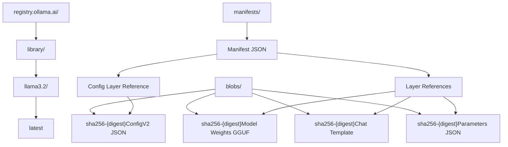

# Storage and Blob Transfer

Relevant source files

-   [auth/auth.go](https://github.com/ollama/ollama/blob/562c76d7/auth/auth.go)
-   [cmd/cmd\_test.go](https://github.com/ollama/ollama/blob/562c76d7/cmd/cmd_test.go)
-   [server/auth.go](https://github.com/ollama/ollama/blob/562c76d7/server/auth.go)
-   [server/auth\_test.go](https://github.com/ollama/ollama/blob/562c76d7/server/auth_test.go)
-   [server/create.go](https://github.com/ollama/ollama/blob/562c76d7/server/create.go)
-   [server/download.go](https://github.com/ollama/ollama/blob/562c76d7/server/download.go)
-   [server/model.go](https://github.com/ollama/ollama/blob/562c76d7/server/model.go)
-   [server/routes\_create\_test.go](https://github.com/ollama/ollama/blob/562c76d7/server/routes_create_test.go)
-   [server/routes\_delete\_test.go](https://github.com/ollama/ollama/blob/562c76d7/server/routes_delete_test.go)
-   [server/routes\_list\_test.go](https://github.com/ollama/ollama/blob/562c76d7/server/routes_list_test.go)
-   [server/routes\_test.go](https://github.com/ollama/ollama/blob/562c76d7/server/routes_test.go)
-   [server/sparse\_common.go](https://github.com/ollama/ollama/blob/562c76d7/server/sparse_common.go)
-   [server/sparse\_windows.go](https://github.com/ollama/ollama/blob/562c76d7/server/sparse_windows.go)
-   [server/upload.go](https://github.com/ollama/ollama/blob/562c76d7/server/upload.go)
-   [types/errtypes/errtypes.go](https://github.com/ollama/ollama/blob/562c76d7/types/errtypes/errtypes.go)

This document describes Ollama's storage system and blob transfer mechanisms. It covers the content-addressed blob storage architecture, concurrent download/upload protocols, registry authentication, and the manifest-based model organization.

For information about model execution and loading, see [Model Execution Pipeline](/ollama/ollama/2.3-model-execution-pipeline). For details on model file formats and structure, see [Model File Formats](/ollama/ollama/4.4-model-file-formats).

## Storage Architecture

Ollama uses a content-addressed storage system where model components are stored as immutable blobs identified by SHA256 digests. The storage is organized into two primary directories:

| Directory | Purpose | Content |
| --- | --- | --- |
| `manifests/` | Model metadata | JSON manifests describing model composition |
| `blobs/` | Binary content | Model weights, templates, parameters, and configuration |

Each model is defined by a **manifest** stored at `manifests/{registry}/{namespace}/{model}/{tag}` (e.g., `manifests/registry.ollama.ai/library/llama3.2/latest`). The manifest references one or more **blobs** stored in `blobs/sha256-{digest}`.

**Manifest Structure**

A manifest contains:

-   **Config layer**: JSON describing model architecture, format, and capabilities
-   **Layer list**: References to blobs (model weights, projectors, adapters, templates, system messages, parameters, licenses)

Each layer specifies:

-   `Digest`: SHA256 hash identifying the blob
-   `MediaType`: Content type (e.g., `application/vnd.ollama.image.model`, `application/vnd.ollama.image.template`)
-   `Size`: Blob size in bytes

Sources: [server/model.go23-77](https://github.com/ollama/ollama/blob/562c76d7/server/model.go#L23-L77) [server/create.go798-814](https://github.com/ollama/ollama/blob/562c76d7/server/create.go#L798-L814)

### Storage Organization Diagram


Sources: [server/model.go28-77](https://github.com/ollama/ollama/blob/562c76d7/server/model.go#L28-L77) [server/create.go548-565](https://github.com/ollama/ollama/blob/562c76d7/server/create.go#L548-L565)

## Blob Download System

The blob download system implements concurrent, resumable downloads with automatic retry logic. Downloads are split into multiple parts that transfer in parallel.

### Download Configuration

```
const (    numDownloadParts          = 16    minDownloadPartSize int64 = 100 * format.MegaByte  // 100 MB    maxDownloadPartSize int64 = 1000 * format.MegaByte // 1000 MB)
```
**Part Size Calculation**: For a blob of size `Total`, the part size is `Total / numDownloadParts`, clamped between `minDownloadPartSize` and `maxDownloadPartSize`.

Sources: [server/download.go99-103](https://github.com/ollama/ollama/blob/562c76d7/server/download.go#L99-L103)

### Download Data Structures

The `blobDownload` struct manages the download lifecycle:

```
type blobDownload struct {    Name      string                    // Destination file path    Digest    string                    // SHA256 blob identifier    Total     int64                     // Total blob size    Completed atomic.Int64              // Bytes downloaded    Parts     []*blobDownloadPart       // Download parts    CancelFunc                          // Context cancellation    done      chan struct{}             // Completion signal    err       error                     // Download error    references atomic.Int32             // Reference count}
```
Each `blobDownloadPart` represents a byte range:

```
type blobDownloadPart struct {    N            int              // Part number    Offset       int64            // Start byte offset    Size         int64            // Part size in bytes    Completed    atomic.Int64     // Bytes completed for this part    lastUpdated  time.Time        // Stall detection timestamp    *blobDownload                 // Parent reference}
```
Sources: [server/download.go41-67](https://github.com/ollama/ollama/blob/562c76d7/server/download.go#L41-L67)

### Concurrent Download Flow

> **[Mermaid sequence]**
> *(图表结构无法解析)*

Sources: [server/download.go468-509](https://github.com/ollama/ollama/blob/562c76d7/server/download.go#L468-L509) [server/download.go185-329](https://github.com/ollama/ollama/blob/562c76d7/server/download.go#L185-L329)

### Download Process Details

**Step 1: Preparation** ([server/download.go128-183](https://github.com/ollama/ollama/blob/562c76d7/server/download.go#L128-L183))

The `Prepare` method:

1.  Scans for existing partial files matching `{name}-partial-*`
2.  Reads part metadata from JSON files to resume interrupted downloads
3.  If no partial files exist, makes a HEAD request to determine total size
4.  Calculates part offsets and sizes based on total size
5.  Creates metadata files for each part

**Step 2: Concurrent Download** ([server/download.go216-329](https://github.com/ollama/ollama/blob/562c76d7/server/download.go#L216-L329))

The `run` method:

1.  Opens a sparse file `{name}-partial` and truncates to total size
2.  Obtains a direct download URL (following one redirect if needed)
3.  Spawns up to 16 goroutines using `errgroup.WithContext`
4.  Each goroutine downloads its part using `downloadChunk`
5.  Uses `io.NewOffsetWriter` to write at correct file offset
6.  Implements exponential backoff retry (up to 6 attempts per part)
7.  Renames partial file to final name when complete

**Step 3: Stall Detection** ([server/download.go361-387](https://github.com/ollama/ollama/blob/562c76d7/server/download.go#L361-L387))

Each part runs a watchdog goroutine:

-   Checks every second if progress has been made
-   If no progress for 30 seconds, returns `errPartStalled`
-   Stalled parts are retried without counting against the retry limit

**HTTP Range Requests** ([server/download.go331-390](https://github.com/ollama/ollama/blob/562c76d7/server/download.go#L331-L390))

Parts request specific byte ranges:

```
Range: bytes={StartsAt}-{StopsAt-1}
```
Where:

-   `StartsAt = Offset + Completed` (resume point)
-   `StopsAt = Offset + Size` (end of part)

Sources: [server/download.go128-390](https://github.com/ollama/ollama/blob/562c76d7/server/download.go#L128-L390)

### Download Deduplication

The `blobDownloadManager` is a `sync.Map` keyed by digest. Multiple concurrent requests for the same blob share a single download instance. Reference counting ensures the download continues until all requesters complete.

```
var blobDownloadManager sync.Map // In downloadBlob:data, ok := blobDownloadManager.LoadOrStore(opts.digest, &blobDownload{...})download := data.(*blobDownload)if !ok {    // First requester: start download in background    go download.Run(context.Background(), requestURL, opts.regOpts)}return download.Wait(ctx, opts.fn)
```
Sources: [server/download.go39](https://github.com/ollama/ollama/blob/562c76d7/server/download.go#L39-L39) [server/download.go494-508](https://github.com/ollama/ollama/blob/562c76d7/server/download.go#L494-L508)

## Blob Upload System

The upload system mirrors the download architecture, supporting concurrent multi-part uploads with cross-repository blob mounting.

### Upload Configuration

```
const (    numUploadParts          = 16    minUploadPartSize int64 = 100 * format.MegaByte    maxUploadPartSize int64 = 1000 * format.MegaByte)
```
Sources: [server/upload.go49-53](https://github.com/ollama/ollama/blob/562c76d7/server/upload.go#L49-L53)

### Upload Data Structures

```
type blobUpload struct {    manifest.Layer                  // Embedded layer (Digest, MediaType, Size, From)    Total          int64            // Total blob size    Completed      atomic.Int64     // Bytes uploaded    Parts          []blobUploadPart // Upload parts    nextURL        chan *url.URL    // Serial upload coordination    CancelFunc                      // Context cancellation    file           *os.File         // Source file    done           bool             // Upload complete    err            error            // Upload error    references     atomic.Int32     // Reference count} type blobUploadPart struct {    N      int        // Part number    Offset int64      // Start byte offset    Size   int64      // Part size    Hash   hash.Hash  // MD5 checksum}
```
Sources: [server/upload.go30-50](https://github.com/ollama/ollama/blob/562c76d7/server/upload.go#L30-L50) [server/upload.go344-350](https://github.com/ollama/ollama/blob/562c76d7/server/upload.go#L344-L350)

### Upload Flow with Registry Protocol

> **[Mermaid sequence]**
> *(图表结构无法解析)*

Sources: [server/upload.go369-405](https://github.com/ollama/ollama/blob/562c76d7/server/upload.go#L369-L405) [server/upload.go55-216](https://github.com/ollama/ollama/blob/562c76d7/server/upload.go#L55-L216)

### Upload Process Details

**Step 1: Check Existence** ([server/upload.go373-388](https://github.com/ollama/ollama/blob/562c76d7/server/upload.go#L373-L388))

Before uploading, `uploadBlob` issues a HEAD request to `/v2/{namespace}/{model}/blobs/{digest}`. If the blob exists (200 OK), the upload is skipped.

**Step 2: Initiate Upload** ([server/upload.go55-125](https://github.com/ollama/ollama/blob/562c76d7/server/upload.go#L55-L125))

The `Prepare` method:

1.  Constructs POST request to `/v2/{namespace}/{model}/blobs/uploads/`
2.  If `layer.From` is set, adds query parameters `?mount={digest}&from={source}` to attempt cross-repository blob mounting
3.  If mount succeeds (HTTP 201), marks upload as done
4.  Otherwise, receives upload Location URL and calculates part sizes
5.  Initializes `nextURL` channel with initial upload location

**Step 3: Parallel/Serial Upload** ([server/upload.go129-216](https://github.com/ollama/ollama/blob/562c76d7/server/upload.go#L129-L216))

The `Run` method uploads parts:

1.  Opens source blob file from local storage
2.  Uses `errgroup` with limit of `numUploadParts` for concurrency
3.  Each part goroutine waits for `nextURL` from channel
4.  Uploads part via `uploadPart` with retry logic (up to 6 attempts)
5.  Sends next Location URL to `nextURL` channel for next part
6.  After all parts complete, calculates composite MD5 as `{md5(part1+part2+...+partN)}-{partCount}`
7.  Commits upload with PUT request including `digest` and `etag` query parameters

**Step 4: Part Upload with Redirect Handling** ([server/upload.go218-307](https://github.com/ollama/ollama/blob/562c76d7/server/upload.go#L218-L307))

The `uploadPart` method:

1.  Sets `X-Redirect-Uploads: 1` header to enable redirect optimization
2.  Sets `Content-Range: {offset}-{offset+size-1}` header
3.  Reads part data using `io.NewSectionReader` at correct offset
4.  Computes MD5 checksum while uploading via `io.MultiWriter`
5.  If registry returns 307 redirect:
    -   Rolls back progress tracking
    -   Retries upload to redirect URL (cloud storage direct upload)
    -   Sends next Location to `nextURL` channel
6.  If registry returns 202 Accepted:
    -   Processes upload serially
    -   Sends next Location to `nextURL` channel

Sources: [server/upload.go55-307](https://github.com/ollama/ollama/blob/562c76d7/server/upload.go#L55-L307)

### Upload Deduplication

Similar to downloads, the `blobUploadManager` (`sync.Map`) deduplicates concurrent uploads:

```
var blobUploadManager sync.Map data, ok := blobUploadManager.LoadOrStore(layer.Digest, &blobUpload{Layer: layer})upload := data.(*blobUpload)if !ok {    // First requester: start upload    go upload.Run(context.Background(), opts)}return upload.Wait(ctx, fn)
```
Sources: [server/upload.go28](https://github.com/ollama/ollama/blob/562c76d7/server/upload.go#L28-L28) [server/upload.go390-404](https://github.com/ollama/ollama/blob/562c76d7/server/upload.go#L390-L404)

## Registry Authentication

Ollama uses token-based authentication with cryptographic signatures for registry operations.

### Authentication Flow

> **[Mermaid sequence]**
> *(图表结构无法解析)*

Sources: [server/auth.go53-100](https://github.com/ollama/ollama/blob/562c76d7/server/auth.go#L53-L100) [auth/auth.go53-85](https://github.com/ollama/ollama/blob/562c76d7/auth/auth.go#L53-L85)

### Authentication Components

**`registryChallenge` Structure** ([server/auth.go22-51](https://github.com/ollama/ollama/blob/562c76d7/server/auth.go#L22-L51))

```
type registryChallenge struct {    Realm   string  // Auth server URL    Service string  // Service identifier    Scope   string  // Access scope (e.g., "repository:library/model:pull")}
```
The `URL()` method constructs the authentication endpoint:

-   Adds `service` and `scope` as query parameters
-   Includes timestamp `ts` for replay protection
-   Generates random `nonce` for uniqueness

**Token Acquisition** ([server/auth.go53-100](https://github.com/ollama/ollama/blob/562c76d7/server/auth.go#L53-L100))

The `getAuthorizationToken` function:

1.  **Validates origin**: Ensures `challenge.Realm` host matches `originalHost` to prevent cross-domain token leakage
2.  **Builds request**: Constructs auth URL with service, scope, timestamp, and nonce
3.  **Signs request**: Uses SSH private key to sign request data
    -   Data format: `{method},{url},{base64(hex(sha256(empty)))}`
    -   Signature format: `{publicKey}:{base64(signatureBlob)}`
4.  **Requests token**: Makes GET request to auth server with `Authorization: {signature}` header
5.  **Returns token**: Parses JSON response containing `token` field

**Private Key Management** ([auth/auth.go53-85](https://github.com/ollama/ollama/blob/562c76d7/auth/auth.go#L53-L85))

The `Sign` function:

-   Reads private key from `~/.ollama/id_ed25519`
-   Parses as SSH private key (Ed25519)
-   Signs provided data with private key
-   Returns signature in format `{publicKey}:{signature}`

Sources: [server/auth.go22-100](https://github.com/ollama/ollama/blob/562c76d7/server/auth.go#L22-L100) [auth/auth.go44-85](https://github.com/ollama/ollama/blob/562c76d7/auth/auth.go#L44-L85)

### Challenge Parsing

The `parseRegistryChallenge` function (referenced in [server/upload.go283](https://github.com/ollama/ollama/blob/562c76d7/server/upload.go#L283-L283) but implementation not shown in provided files) extracts authentication parameters from the `WWW-Authenticate` header:

Expected format:

```
Bearer realm="https://auth.example.com/token",service="registry",scope="repo:foo:pull"
```
## Error Handling and Retry Logic

### Retry Strategy

Both download and upload implement exponential backoff with a maximum of 6 retries per part:

```
const maxRetries = 6 for try := 0; try < maxRetries; try++ {    err = operation()    if err == nil {        return nil    }        sleep := time.Second * time.Duration(math.Pow(2, float64(try)))    time.Sleep(sleep)}return fmt.Errorf("%w: %w", errMaxRetriesExceeded, err)
```
**Retry delays**: 1s, 2s, 4s, 8s, 16s, 32s

Sources: [server/download.go31-37](https://github.com/ollama/ollama/blob/562c76d7/server/download.go#L31-L37) [server/download.go283-306](https://github.com/ollama/ollama/blob/562c76d7/server/download.go#L283-L306) [server/upload.go155-172](https://github.com/ollama/ollama/blob/562c76d7/server/upload.go#L155-L172)

### Download Error Handling

Special error cases ([server/download.go288-302](https://github.com/ollama/ollama/blob/562c76d7/server/download.go#L288-L302)):

| Error Type | Handling |
| --- | --- |
| `context.Canceled` | Return immediately (user cancellation) |
| `syscall.ENOSPC` | Return immediately (disk full) |
| `errPartStalled` | Don't increment retry counter, retry immediately |
| Other errors | Log, sleep with exponential backoff, retry |

### Upload Error Handling

Upload-specific handling ([server/upload.go156-172](https://github.com/ollama/ollama/blob/562c76d7/server/upload.go#L156-L172)):

| Error Type | Handling |
| --- | --- |
| `context.Canceled` | Return immediately |
| `errMaxRetriesExceeded` | Return immediately |
| Other errors | Exponential backoff retry |

**Progress Rollback**: When a part upload fails or redirects, the `progressWriter.Rollback()` method subtracts written bytes from the `Completed` counter to maintain accurate progress reporting.

Sources: [server/upload.go352-367](https://github.com/ollama/ollama/blob/562c76d7/server/upload.go#L352-L367)

### Stall Detection (Download Only)

Each download part monitors progress using a watchdog goroutine ([server/download.go361-387](https://github.com/ollama/ollama/blob/562c76d7/server/download.go#L361-L387)):

1.  Checks every 1 second
2.  If no bytes written for 30 seconds, returns `errPartStalled`
3.  Logs warning with suggestion to use Ctrl+C and retry
4.  Resets `lastUpdated` timestamp and retries
5.  Does not count against retry limit (allows unlimited stall retries)

This prevents downloads from hanging indefinitely on slow or unreliable connections.

Sources: [server/download.go361-387](https://github.com/ollama/ollama/blob/562c76d7/server/download.go#L361-L387)

## Sparse File Optimization

To efficiently handle large model files during download, Ollama uses sparse file allocation on supported filesystems.

**Windows Implementation** ([server/sparse\_windows.go9-17](https://github.com/ollama/ollama/blob/562c76d7/server/sparse_windows.go#L9-L17)):

Uses `DeviceIoControl` with `FSCTL_SET_SPARSE` flag. Errors are ignored since not all filesystems (e.g., exFAT) support sparse files.

**Unix Implementation** ([server/sparse\_common.go7-8](https://github.com/ollama/ollama/blob/562c76d7/server/sparse_common.go#L7-L8)):

No-op on Unix systems; sparse files are created automatically when seeking beyond the file size.

**Usage** ([server/download.go220-227](https://github.com/ollama/ollama/blob/562c76d7/server/download.go#L220-L227)):

```
file, err := os.OpenFile(b.Name+"-partial", os.O_CREATE|os.O_RDWR, 0o644)setSparse(file)file.Truncate(b.Total)
```
This allows the download system to create a file of the full target size without allocating disk space for unwritten regions.

Sources: [server/sparse\_windows.go9-17](https://github.com/ollama/ollama/blob/562c76d7/server/sparse_windows.go#L9-L17) [server/sparse\_common.go7-8](https://github.com/ollama/ollama/blob/562c76d7/server/sparse_common.go#L7-L8) [server/download.go220-227](https://github.com/ollama/ollama/blob/562c76d7/server/download.go#L220-L227)

## Progress Tracking

Both download and upload use atomic operations for thread-safe progress tracking:

```
type blobDownload struct {    Total     int64    Completed atomic.Int64  // Updated by multiple part goroutines    // ...} // In part writer:func (p *blobDownloadPart) Write(b []byte) (n int, err error) {    n = len(b)    p.blobDownload.Completed.Add(int64(n))    return n, nil}
```
**Progress Reporting** ([server/download.go438-458](https://github.com/ollama/ollama/blob/562c76d7/server/download.go#L438-L458) [server/upload.go319-342](https://github.com/ollama/ollama/blob/562c76d7/server/upload.go#L319-L342)):

The `Wait` method provides real-time progress updates:

1.  Acquires reference to prevent premature cancellation
2.  Sends `api.ProgressResponse` every 60 milliseconds
3.  Reports status, digest, total bytes, and completed bytes
4.  Blocks until `done` channel closes or context cancels
5.  Returns final error or nil on success

Sources: [server/download.go119-126](https://github.com/ollama/ollama/blob/562c76d7/server/download.go#L119-L126) [server/download.go438-458](https://github.com/ollama/ollama/blob/562c76d7/server/download.go#L438-L458) [server/upload.go357-362](https://github.com/ollama/ollama/blob/562c76d7/server/upload.go#L357-L362) [server/upload.go319-342](https://github.com/ollama/ollama/blob/562c76d7/server/upload.go#L319-L342)

## File Management

### Blob Path Resolution

The `manifest.BlobsPath` function (referenced throughout but implementation not shown) converts a digest to a file path:

```
digest: "sha256:abc123..."
path:   "{OLLAMA_MODELS}/blobs/sha256-abc123..."
```
### Partial File Management

**Download Partials** ([server/download.go129-145](https://github.com/ollama/ollama/blob/562c76d7/server/download.go#L129-L145)):

-   Main partial: `{name}-partial` (sparse file)
-   Part metadata: `{name}-partial-{N}` (JSON files)

Each metadata file contains:

```
{  "N": 0,  "Offset": 0,  "Size": 104857600,  "Completed": 52428800}
```
This enables resume on crash or network interruption.

**Cleanup** ([server/download.go318-326](https://github.com/ollama/ollama/blob/562c76d7/server/download.go#L318-L326)):

After successful download:

1.  Removes all part metadata files (`{name}-partial-{N}`)
2.  Renames `{name}-partial` to final `{name}`

Sources: [server/download.go129-145](https://github.com/ollama/ollama/blob/562c76d7/server/download.go#L129-L145) [server/download.go318-326](https://github.com/ollama/ollama/blob/562c76d7/server/download.go#L318-L326) [server/download.go402-426](https://github.com/ollama/ollama/blob/562c76d7/server/download.go#L402-L426)

### Symbolic Links and Copying

The `createLink` function ([server/create.go816-829](https://github.com/ollama/ollama/blob/562c76d7/server/create.go#L816-L829)) attempts to create symbolic links to avoid duplicating large files:

1.  Creates parent directories
2.  Attempts `os.Symlink(src, dst)`
3.  If symlink fails, falls back to `copyFile` (full copy)

This is used when importing GGUF files or creating models from local files.

Sources: [server/create.go816-846](https://github.com/ollama/ollama/blob/562c76d7/server/create.go#L816-L846)
