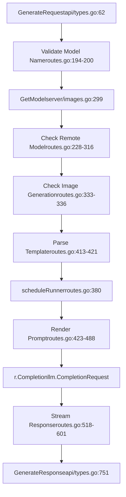
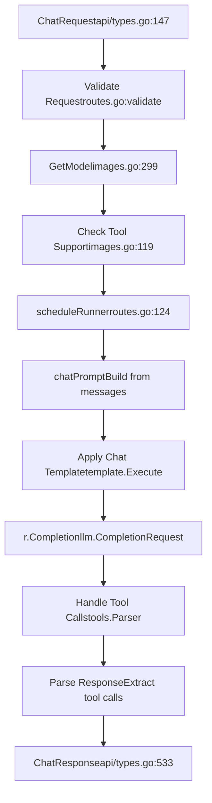
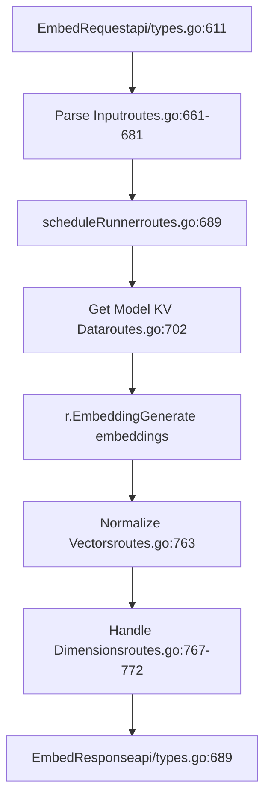
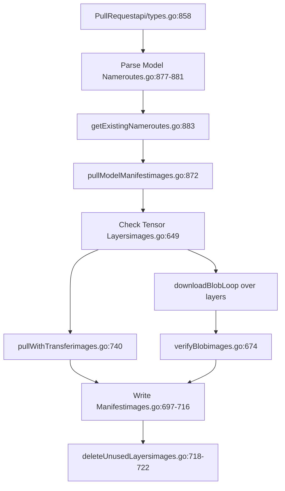
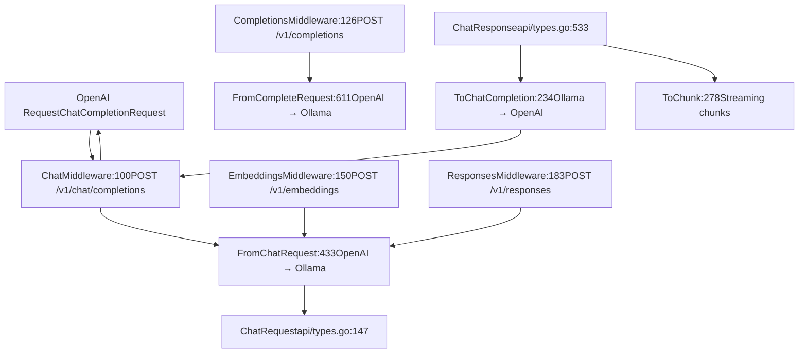

# API Reference

Relevant source files

-   [README.md](https://github.com/ollama/ollama/blob/562c76d7/README.md?plain=1)
-   [api/client.go](https://github.com/ollama/ollama/blob/562c76d7/api/client.go)
-   [api/client\_test.go](https://github.com/ollama/ollama/blob/562c76d7/api/client_test.go)
-   [api/types.go](https://github.com/ollama/ollama/blob/562c76d7/api/types.go)
-   [cmd/cmd.go](https://github.com/ollama/ollama/blob/562c76d7/cmd/cmd.go)
-   [docs/README.md](https://github.com/ollama/ollama/blob/562c76d7/docs/README.md?plain=1)
-   [docs/api.md](https://github.com/ollama/ollama/blob/562c76d7/docs/api.md?plain=1)
-   [docs/development.md](https://github.com/ollama/ollama/blob/562c76d7/docs/development.md?plain=1)
-   [docs/images/ollama-keys.png](https://github.com/ollama/ollama/blob/562c76d7/docs/images/ollama-keys.png)
-   [docs/images/signup.png](https://github.com/ollama/ollama/blob/562c76d7/docs/images/signup.png)
-   [server/images.go](https://github.com/ollama/ollama/blob/562c76d7/server/images.go)
-   [server/routes.go](https://github.com/ollama/ollama/blob/562c76d7/server/routes.go)

This document provides a comprehensive reference for Ollama's HTTP REST API. It covers all endpoints for model inference (generation, chat, embeddings), model management (pull, push, create, delete), and system information. For details about OpenAI-compatible endpoints that wrap these core APIs, see [OpenAI Compatibility Layer](/ollama/ollama/3.4-openai-compatibility-layer). For information about model execution internals, see [Model Execution Pipeline](/ollama/ollama/2.3-model-execution-pipeline).

## API Overview

Ollama exposes a REST API built on the Gin framework ([server/routes.go83-87](https://github.com/ollama/ollama/blob/562c76d7/server/routes.go#L83-L87)). The server accepts JSON requests and returns either single JSON responses or newline-delimited JSON (NDJSON) streams depending on the endpoint and `stream` parameter.

**Core API Architecture**

```mermaid
flowchart TD
    CLI["CLI Clientcmd/cmd.go"]
    SDK["Client SDKsapi.Client"]
    OpenAI["OpenAI SDKs"]
    Router["Gin Routerroutes.go:83"]
    CORS["CORS Middlewarecors"]
    Auth["Authenticationauth.go"]
    Generate["POST /api/generateGenerateHandler:178"]
    Chat["POST /api/chatChatHandler"]
    Embed["POST /api/embedEmbedHandler:648"]
    Pull["POST /api/pullPullHandler:865"]
    Push["POST /api/pushPushHandler:916"]
    Create["POST /api/createCreateHandler"]
    List["GET /api/tagsListHandler:1287"]
    Show["POST /api/showShowHandler:1043"]
    Delete["DELETE /api/deleteDeleteHandler:999"]
    Copy["POST /api/copyCopyHandler"]
    PS["GET /api/psListRunningHandler"]
    Version["GET /api/versionVersionHandler"]
    ChatComp["POST /v1/chat/completionsChatMiddleware:100"]
    Complete["POST /v1/completionsCompletionsMiddleware:126"]
    EmbedComp["POST /v1/embeddingsEmbeddingsMiddleware:150"]
    Models["GET /v1/modelsListMiddleware:218"]
    Responses["POST /v1/responsesResponsesMiddleware:183"]

    CLI --> Router
    SDK --> Router
    OpenAI --> Router
    Router --> CORS
    CORS --> Auth
    Auth --> Generate
    Auth --> Chat
    Auth --> Embed
    Auth --> Pull
    Auth --> Push
    Auth --> Create
    Auth --> List
    Auth --> Show
    Auth --> Delete
    Auth --> Copy
    Auth --> PS
    Auth --> Version
    Router --> ChatComp
    Router --> Complete
    Router --> EmbedComp
    Router --> Models
    Router --> Responses
    ChatComp --> Chat
    Complete --> Generate
    EmbedComp --> Embed
```


Sources: [server/routes.go83-87](https://github.com/ollama/ollama/blob/562c76d7/server/routes.go#L83-L87) [middleware/openai.go1-300](https://github.com/ollama/ollama/blob/562c76d7/middleware/openai.go#L1-L300) [api/client.go36-86](https://github.com/ollama/ollama/blob/562c76d7/api/client.go#L36-L86)

## Request/Response Conventions

### Base URL

The default base URL is `http://localhost:11434`. This can be configured via the `OLLAMA_HOST` environment variable ([api/client.go74-78](https://github.com/ollama/ollama/blob/562c76d7/api/client.go#L74-L78)).

### Content Types

-   **Request**: `application/json`
-   **Response**: `application/json` (single response) or `application/x-ndjson` (streaming)

### Streaming

Most inference endpoints support streaming via the `stream` parameter ([api/types.go84](https://github.com/ollama/ollama/blob/562c76d7/api/types.go#L84-L84) [api/types.go155](https://github.com/ollama/ollama/blob/562c76d7/api/types.go#L155-L155)):

```
{  "stream": true}
```
When `stream` is `true` (default), responses are sent as newline-delimited JSON objects. The final object has `"done": true`. When `false`, a single JSON response is returned after completion.

### Authentication

Authentication is handled when `OLLAMA_HOST` points to `ollama.com` or when auth is explicitly enabled ([api/client.go119-130](https://github.com/ollama/ollama/blob/562c76d7/api/client.go#L119-L130)). The client signs challenges using ED25519 keys ([auth/auth.go](https://github.com/ollama/ollama/blob/562c76d7/auth/auth.go)).

### Duration Format

The `keep_alive` parameter accepts duration strings like `"5m"`, `"1h"`, or numeric values in nanoseconds ([api/types.go869-900](https://github.com/ollama/ollama/blob/562c76d7/api/types.go#L869-L900)).

Sources: [api/client.go36-166](https://github.com/ollama/ollama/blob/562c76d7/api/client.go#L36-L166) [api/types.go1-900](https://github.com/ollama/ollama/blob/562c76d7/api/types.go#L1-L900)

## Generation API

### POST /api/generate

Generates a completion for a given prompt using a specified model ([server/routes.go178-646](https://github.com/ollama/ollama/blob/562c76d7/server/routes.go#L178-L646)).

**Request Structure** ([api/types.go62-144](https://github.com/ollama/ollama/blob/562c76d7/api/types.go#L62-L144)):

| Field | Type | Required | Description |
| --- | --- | --- | --- |
| `model` | string | Yes | Model name (e.g., `"llama3.2"`) |
| `prompt` | string | Yes | Text prompt to generate from |
| `suffix` | string | No | Text after the insertion point (for fill-in-the-middle) |
| `system` | string | No | System message override |
| `template` | string | No | Prompt template override |
| `context` | \[\]int | No | Deprecated conversational context |
| `stream` | \*bool | No | Enable streaming (default: `true`) |
| `raw` | bool | No | Skip template formatting |
| `format` | json.RawMessage | No | Response format (`"json"` or JSON schema) |
| `images` | \[\]ImageData | No | Base64-encoded images for multimodal models |
| `options` | map\[string\]any | No | Model parameters (temperature, top\_k, etc.) |
| `keep_alive` | \*Duration | No | How long to keep model loaded |
| `think` | \*ThinkValue | No | Enable thinking/reasoning mode |
| `truncate` | \*bool | No | Truncate prompt if too long |
| `shift` | \*bool | No | Shift context window when full |
| `logprobs` | bool | No | Return log probabilities |
| `top_logprobs` | int | No | Number of top logprobs to return (0-20) |

**Response Structure** ([api/types.go751-783](https://github.com/ollama/ollama/blob/562c76d7/api/types.go#L751-L783)):

| Field | Type | Description |
| --- | --- | --- |
| `model` | string | Model name used |
| `created_at` | time.Time | Response timestamp |
| `response` | string | Generated text (or empty if streaming) |
| `done` | bool | Whether generation is complete |
| `done_reason` | string | Reason for completion (`"stop"`, `"length"`, etc.) |
| `context` | \[\]int | Updated context for next request |
| `total_duration` | time.Duration | Total request duration |
| `load_duration` | time.Duration | Model loading time |
| `prompt_eval_count` | int | Number of prompt tokens |
| `prompt_eval_duration` | time.Duration | Prompt evaluation time |
| `eval_count` | int | Number of generated tokens |
| `eval_duration` | time.Duration | Generation time |
| `logprobs` | \[\]Logprob | Token log probabilities |

**Request Flow**


Sources: [server/routes.go178-646](https://github.com/ollama/ollama/blob/562c76d7/server/routes.go#L178-L646) [api/types.go62-144](https://github.com/ollama/ollama/blob/562c76d7/api/types.go#L62-L144) [api/types.go751-783](https://github.com/ollama/ollama/blob/562c76d7/api/types.go#L751-L783)

**Example Request**

```
{  "model": "llama3.2",  "prompt": "Why is the sky blue?",  "stream": false,  "options": {    "temperature": 0.7,    "num_predict": 100  }}
```
**Example Response**

```
{  "model": "llama3.2",  "created_at": "2024-01-01T12:00:00Z",  "response": "The sky appears blue due to Rayleigh scattering...",  "done": true,  "done_reason": "stop",  "context": [1, 2, 3],  "total_duration": 1500000000,  "load_duration": 100000000,  "prompt_eval_count": 15,  "prompt_eval_duration": 200000000,  "eval_count": 45,  "eval_duration": 1200000000}
```
### Structured Output

The `format` field supports JSON mode and structured output via JSON schemas ([server/routes.go526](https://github.com/ollama/ollama/blob/562c76d7/server/routes.go#L526-L526) [api/types.go90](https://github.com/ollama/ollama/blob/562c76d7/api/types.go#L90-L90)):

**JSON Mode**:

```
{  "format": "json"}
```
**JSON Schema**:

```
{  "format": {    "type": "object",    "properties": {      "name": {"type": "string"},      "age": {"type": "integer"}    },    "required": ["name", "age"]  }}
```
### Thinking Models

For reasoning models, the `think` parameter controls thinking behavior ([api/types.go109](https://github.com/ollama/ollama/blob/562c76d7/api/types.go#L109-L109) [server/routes.go344-378](https://github.com/ollama/ollama/blob/562c76d7/server/routes.go#L344-L378)):

```
{  "think": true,           // Boolean: enable/disable  "think": "high"          // String: "high", "medium", "low" (model-specific)}
```
Thinking content is returned in the `thinking` field of the response ([api/types.go554](https://github.com/ollama/ollama/blob/562c76d7/api/types.go#L554-L554)).

Sources: [server/routes.go178-646](https://github.com/ollama/ollama/blob/562c76d7/server/routes.go#L178-L646) [api/types.go62-144](https://github.com/ollama/ollama/blob/562c76d7/api/types.go#L62-L144) [api/types.go751-783](https://github.com/ollama/ollama/blob/562c76d7/api/types.go#L751-L783)

## Chat API

### POST /api/chat

Generates the next message in a conversation ([server/routes\_generate.go1-900](https://github.com/ollama/ollama/blob/562c76d7/server/routes_generate.go#L1-L900)).

**Request Structure** ([api/types.go147-194](https://github.com/ollama/ollama/blob/562c76d7/api/types.go#L147-L194)):

| Field | Type | Required | Description |
| --- | --- | --- | --- |
| `model` | string | Yes | Model name |
| `messages` | \[\]Message | Yes | Conversation history |
| `stream` | \*bool | No | Enable streaming (default: `true`) |
| `format` | json.RawMessage | No | Response format |
| `keep_alive` | \*Duration | No | Model keep-alive duration |
| `tools` | \[\]Tool | No | Available tools for function calling |
| `options` | map\[string\]any | No | Model parameters |
| `think` | \*ThinkValue | No | Enable thinking mode |
| `truncate` | \*bool | No | Truncate messages if too long |
| `shift` | \*bool | No | Shift messages when context full |
| `logprobs` | bool | No | Return log probabilities |
| `top_logprobs` | int | No | Number of top logprobs (0-20) |

**Message Structure** ([api/types.go211-221](https://github.com/ollama/ollama/blob/562c76d7/api/types.go#L211-L221)):

| Field | Type | Description |
| --- | --- | --- |
| `role` | string | `"system"`, `"user"`, `"assistant"`, or `"tool"` |
| `content` | string | Message content |
| `thinking` | string | Thinking content (for reasoning models) |
| `images` | \[\]ImageData | Images for multimodal models |
| `tool_calls` | \[\]ToolCall | Tool calls made by assistant |
| `tool_name` | string | Tool name (for tool role) |
| `tool_call_id` | string | ID of tool call being responded to |

**Response Structure** ([api/types.go533-562](https://github.com/ollama/ollama/blob/562c76d7/api/types.go#L533-L562)):

| Field | Type | Description |
| --- | --- | --- |
| `model` | string | Model name |
| `created_at` | time.Time | Timestamp |
| `message` | Message | Generated message |
| `done` | bool | Completion status |
| `done_reason` | string | Completion reason |
| `total_duration` | time.Duration | Total time |
| `load_duration` | time.Duration | Load time |
| `prompt_eval_count` | int | Prompt tokens |
| `prompt_eval_duration` | time.Duration | Prompt eval time |
| `eval_count` | int | Generated tokens |
| `eval_duration` | time.Duration | Generation time |
| `logprobs` | \[\]Logprob | Log probabilities |

**Chat Processing Flow**


Sources: [server/routes\_generate.go](https://github.com/ollama/ollama/blob/562c76d7/server/routes_generate.go) [api/types.go147-221](https://github.com/ollama/ollama/blob/562c76d7/api/types.go#L147-L221) [api/types.go533-562](https://github.com/ollama/ollama/blob/562c76d7/api/types.go#L533-L562)

**Example Request**

```
{  "model": "llama3.2",  "messages": [    {      "role": "system",      "content": "You are a helpful assistant."    },    {      "role": "user",      "content": "What is the capital of France?"    }  ],  "stream": false}
```
**Example Response**

```
{  "model": "llama3.2",  "created_at": "2024-01-01T12:00:00Z",  "message": {    "role": "assistant",    "content": "The capital of France is Paris."  },  "done": true,  "done_reason": "stop",  "total_duration": 1200000000,  "prompt_eval_count": 25,  "eval_count": 10}
```
### Tool Calling

The chat endpoint supports function calling via the `tools` parameter ([api/types.go165](https://github.com/ollama/ollama/blob/562c76d7/api/types.go#L165-L165) [api/types.go319-503](https://github.com/ollama/ollama/blob/562c76d7/api/types.go#L319-L503)):

**Tool Definition**:

```
{  "tools": [    {      "type": "function",      "function": {        "name": "get_weather",        "description": "Get current weather",        "parameters": {          "type": "object",          "properties": {            "location": {              "type": "string",              "description": "City name"            }          },          "required": ["location"]        }      }    }  ]}
```
**Tool Call Response**:

```
{  "message": {    "role": "assistant",    "content": "",    "tool_calls": [      {        "id": "call_123",        "function": {          "name": "get_weather",          "arguments": "{\"location\": \"Paris\"}"        }      }    ]  }}
```
Tools are processed by the template system ([template/template.go](https://github.com/ollama/ollama/blob/562c76d7/template/template.go)) and parsed from model output ([tools/tools.go20-200](https://github.com/ollama/ollama/blob/562c76d7/tools/tools.go#L20-L200)).

Sources: [api/types.go196-503](https://github.com/ollama/ollama/blob/562c76d7/api/types.go#L196-L503) [tools/tools.go1-200](https://github.com/ollama/ollama/blob/562c76d7/tools/tools.go#L1-L200) [server/routes\_generate.go](https://github.com/ollama/ollama/blob/562c76d7/server/routes_generate.go)

## Embedding API

### POST /api/embed

Generates embeddings for text input ([server/routes.go648-802](https://github.com/ollama/ollama/blob/562c76d7/server/routes.go#L648-L802)).

**Request Structure** ([api/types.go611-643](https://github.com/ollama/ollama/blob/562c76d7/api/types.go#L611-L643)):

| Field | Type | Required | Description |
| --- | --- | --- | --- |
| `model` | string | Yes | Model name |
| `input` | string or \[\]string | Yes | Text(s) to embed |
| `truncate` | \*bool | No | Truncate if input exceeds context |
| `dimensions` | int | No | Output dimensionality (for supported models) |
| `keep_alive` | \*Duration | No | Model keep-alive duration |
| `options` | map\[string\]any | No | Model parameters |

**Response Structure** ([api/types.go689-699](https://github.com/ollama/ollama/blob/562c76d7/api/types.go#L689-L699)):

| Field | Type | Description |
| --- | --- | --- |
| `model` | string | Model name |
| `embeddings` | \[\]\[\]float32 | Generated embeddings |
| `total_duration` | time.Duration | Total time |
| `load_duration` | time.Duration | Load time |
| `prompt_eval_count` | int | Total tokens processed |

**Embedding Processing**


Sources: [server/routes.go648-802](https://github.com/ollama/ollama/blob/562c76d7/server/routes.go#L648-L802) [api/types.go611-699](https://github.com/ollama/ollama/blob/562c76d7/api/types.go#L611-L699)

**Example Request**

```
{  "model": "nomic-embed-text",  "input": "The quick brown fox",  "dimensions": 768}
```
**Example Response**

```
{  "model": "nomic-embed-text",  "embeddings": [    [0.123, -0.456, 0.789, ...]  ],  "total_duration": 500000000,  "prompt_eval_count": 5}
```
The normalization function ensures unit vectors ([server/routes.go804-818](https://github.com/ollama/ollama/blob/562c76d7/server/routes.go#L804-L818)) and handles dimension reduction ([server/routes.go767-772](https://github.com/ollama/ollama/blob/562c76d7/server/routes.go#L767-L772)).

Sources: [server/routes.go648-818](https://github.com/ollama/ollama/blob/562c76d7/server/routes.go#L648-L818) [api/types.go611-699](https://github.com/ollama/ollama/blob/562c76d7/api/types.go#L611-L699)

## Model Management API

### POST /api/pull

Downloads a model from the registry ([server/routes.go865-914](https://github.com/ollama/ollama/blob/562c76d7/server/routes.go#L865-L914) [server/images.go613-728](https://github.com/ollama/ollama/blob/562c76d7/server/images.go#L613-L728)).

**Request Structure** ([api/types.go858-862](https://github.com/ollama/ollama/blob/562c76d7/api/types.go#L858-L862)):

| Field | Type | Required | Description |
| --- | --- | --- | --- |
| `model` | string | Yes | Model name to pull |
| `name` | string | No | Deprecated alias for `model` |
| `insecure` | bool | No | Allow insecure connections |
| `stream` | \*bool | No | Stream progress (default: `true`) |

**Response Structure** ([api/types.go704-709](https://github.com/ollama/ollama/blob/562c76d7/api/types.go#L704-L709)):

| Field | Type | Description |
| --- | --- | --- |
| `status` | string | Progress status message |
| `digest` | string | Layer digest being processed |
| `total` | int64 | Total bytes |
| `completed` | int64 | Bytes completed |

**Pull Flow**


Sources: [server/routes.go865-914](https://github.com/ollama/ollama/blob/562c76d7/server/routes.go#L865-L914) [server/images.go613-728](https://github.com/ollama/ollama/blob/562c76d7/server/images.go#L613-L728)

### POST /api/push

Uploads a model to the registry ([server/routes.go916-969](https://github.com/ollama/ollama/blob/562c76d7/server/routes.go#L916-L969) [server/images.go546-611](https://github.com/ollama/ollama/blob/562c76d7/server/images.go#L546-L611)).

**Request Structure** ([api/types.go845-852](https://github.com/ollama/ollama/blob/562c76d7/api/types.go#L845-L852)):

| Field | Type | Required | Description |
| --- | --- | --- | --- |
| `model` | string | Yes | Model name to push |
| `name` | string | No | Deprecated alias for `model` |
| `insecure` | bool | No | Allow insecure connections |
| `stream` | \*bool | No | Stream progress |

**Response**: Same as pull (ProgressResponse).

Sources: [server/routes.go916-969](https://github.com/ollama/ollama/blob/562c76d7/server/routes.go#L916-L969) [server/images.go546-611](https://github.com/ollama/ollama/blob/562c76d7/server/images.go#L546-L611)

### POST /api/create

Creates a model from a Modelfile ([server/routes.go](https://github.com/ollama/ollama/blob/562c76d7/server/routes.go) [parser/parser.go56-155](https://github.com/ollama/ollama/blob/562c76d7/parser/parser.go#L56-L155)).

**Request Structure** ([api/types.go711-728](https://github.com/ollama/ollama/blob/562c76d7/api/types.go#L711-L728)):

| Field | Type | Required | Description |
| --- | --- | --- | --- |
| `model` | string | Yes | Name for new model |
| `modelfile` | string | No | Modelfile content |
| `path` | string | No | Path to Modelfile |
| `stream` | \*bool | No | Stream progress |
| `quantize` | string | No | Quantization format |

The Modelfile supports commands like `FROM`, `PARAMETER`, `TEMPLATE`, `SYSTEM`, etc. ([parser/parser.go64-142](https://github.com/ollama/ollama/blob/562c76d7/parser/parser.go#L64-L142)).

Sources: [api/types.go711-728](https://github.com/ollama/ollama/blob/562c76d7/api/types.go#L711-L728) [parser/parser.go56-155](https://github.com/ollama/ollama/blob/562c76d7/parser/parser.go#L56-L155)

### GET /api/tags

Lists locally available models ([server/routes.go1287-1361](https://github.com/ollama/ollama/blob/562c76d7/server/routes.go#L1287-L1361)).

**Response Structure** ([api/types.go805-808](https://github.com/ollama/ollama/blob/562c76d7/api/types.go#L805-L808)):

```
{  "models": [    {      "name": "llama3.2:latest",      "modified_at": "2024-01-01T12:00:00Z",      "size": 4661211648,      "digest": "sha256:abc123...",      "details": {        "format": "gguf",        "family": "llama",        "families": ["llama"],        "parameter_size": "3B",        "quantization_level": "Q4_0"      }    }  ]}
```
Sources: [server/routes.go1287-1361](https://github.com/ollama/ollama/blob/562c76d7/server/routes.go#L1287-L1361) [api/types.go805-843](https://github.com/ollama/ollama/blob/562c76d7/api/types.go#L805-L843)

### POST /api/show

Shows detailed model information ([server/routes.go1043-1078](https://github.com/ollama/ollama/blob/562c76d7/server/routes.go#L1043-L1078) [server/routes.go1080-1262](https://github.com/ollama/ollama/blob/562c76d7/server/routes.go#L1080-L1262)).

**Request Structure** ([api/types.go730-734](https://github.com/ollama/ollama/blob/562c76d7/api/types.go#L730-L734)):

| Field | Type | Required | Description |
| --- | --- | --- | --- |
| `model` | string | Yes | Model name |
| `name` | string | No | Deprecated alias |
| `verbose` | bool | No | Include tensor information |

**Response Structure** includes model details, template, system prompt, parameters, license, and optionally tensor information ([api/types.go736-749](https://github.com/ollama/ollama/blob/562c76d7/api/types.go#L736-L749)).

Sources: [server/routes.go1043-1262](https://github.com/ollama/ollama/blob/562c76d7/server/routes.go#L1043-L1262) [api/types.go730-749](https://github.com/ollama/ollama/blob/562c76d7/api/types.go#L730-L749)

### DELETE /api/delete

Deletes a model ([server/routes.go999-1041](https://github.com/ollama/ollama/blob/562c76d7/server/routes.go#L999-L1041)).

**Request Structure** ([api/types.go854-856](https://github.com/ollama/ollama/blob/562c76d7/api/types.go#L854-L856)):

```
{  "model": "llama3.2"}
```
Sources: [server/routes.go999-1041](https://github.com/ollama/ollama/blob/562c76d7/server/routes.go#L999-L1041) [api/types.go854-856](https://github.com/ollama/ollama/blob/562c76d7/api/types.go#L854-L856)

### POST /api/copy

Copies a model ([server/routes.go](https://github.com/ollama/ollama/blob/562c76d7/server/routes.go) [server/images.go399-436](https://github.com/ollama/ollama/blob/562c76d7/server/images.go#L399-L436)).

**Request Structure** ([api/types.go864-867](https://github.com/ollama/ollama/blob/562c76d7/api/types.go#L864-L867)):

```
{  "source": "llama3.2",  "destination": "my-llama"}
```
Sources: [server/images.go399-436](https://github.com/ollama/ollama/blob/562c76d7/server/images.go#L399-L436) [api/types.go864-867](https://github.com/ollama/ollama/blob/562c76d7/api/types.go#L864-L867)

### GET /api/ps

Lists currently loaded models ([server/routes.go](https://github.com/ollama/ollama/blob/562c76d7/server/routes.go)).

**Response** includes model name, size, VRAM usage, processor split, and expiration time.

Sources: [server/routes.go](https://github.com/ollama/ollama/blob/562c76d7/server/routes.go) [api/types.go](https://github.com/ollama/ollama/blob/562c76d7/api/types.go)

## OpenAI Compatibility Layer

Ollama provides OpenAI-compatible endpoints that transform requests to/from OpenAI format ([middleware/openai.go1-300](https://github.com/ollama/ollama/blob/562c76d7/middleware/openai.go#L1-L300) [openai/openai.go1-600](https://github.com/ollama/ollama/blob/562c76d7/openai/openai.go#L1-L600)).

### Transformation Architecture


Sources: [middleware/openai.go1-300](https://github.com/ollama/ollama/blob/562c76d7/middleware/openai.go#L1-L300) [openai/openai.go1-600](https://github.com/ollama/ollama/blob/562c76d7/openai/openai.go#L1-L600)

### POST /v1/chat/completions

OpenAI-compatible chat endpoint ([middleware/openai.go100-125](https://github.com/ollama/ollama/blob/562c76d7/middleware/openai.go#L100-L125)).

**Request Transformation** ([openai/openai.go433-609](https://github.com/ollama/ollama/blob/562c76d7/openai/openai.go#L433-L609)):

| OpenAI Field | Ollama Field | Notes |
| --- | --- | --- |
| `model` | `model` | Direct mapping |
| `messages` | `messages` | Content transformed |
| `max_tokens` | `options.num_predict` | Token limit |
| `temperature` | `options.temperature` | Sampling parameter |
| `top_p` | `options.top_p` | Nucleus sampling |
| `frequency_penalty` | `options.frequency_penalty` | Repetition penalty |
| `presence_penalty` | `options.presence_penalty` | Presence penalty |
| `tools` | `tools` | Function calling |
| `response_format` | `format` | JSON schema support |
| `reasoning_effort` | `think` | Reasoning models |
| `logprobs` | `logprobs` | Log probabilities |
| `top_logprobs` | `top_logprobs` | Top K logprobs |

**Response Transformation** ([openai/openai.go234-276](https://github.com/ollama/ollama/blob/562c76d7/openai/openai.go#L234-L276)):

| Ollama Field | OpenAI Field | Notes |
| --- | --- | --- |
| `message.content` | `choices[0].message.content` | Response text |
| `message.tool_calls` | `choices[0].message.tool_calls` | Function calls |
| `done_reason` | `choices[0].finish_reason` | Completion reason |
| `prompt_eval_count` | `usage.prompt_tokens` | Input tokens |
| `eval_count` | `usage.completion_tokens` | Output tokens |

Sources: [middleware/openai.go100-125](https://github.com/ollama/ollama/blob/562c76d7/middleware/openai.go#L100-L125) [openai/openai.go234-609](https://github.com/ollama/ollama/blob/562c76d7/openai/openai.go#L234-L609)

### POST /v1/completions

OpenAI-compatible completions endpoint ([middleware/openai.go126-149](https://github.com/ollama/ollama/blob/562c76d7/middleware/openai.go#L126-L149)).

Transforms to `/api/generate` with similar field mappings ([openai/openai.go611-682](https://github.com/ollama/ollama/blob/562c76d7/openai/openai.go#L611-L682)).

Sources: [middleware/openai.go126-149](https://github.com/ollama/ollama/blob/562c76d7/middleware/openai.go#L126-L149) [openai/openai.go611-682](https://github.com/ollama/ollama/blob/562c76d7/openai/openai.go#L611-L682)

### POST /v1/embeddings

OpenAI-compatible embeddings endpoint ([middleware/openai.go150-182](https://github.com/ollama/ollama/blob/562c76d7/middleware/openai.go#L150-L182)).

**Request Transformation** ([openai/openai.go684-746](https://github.com/ollama/ollama/blob/562c76d7/openai/openai.go#L684-L746)):

| OpenAI Field | Ollama Field |
| --- | --- |
| `input` | `input` |
| `model` | `model` |
| `dimensions` | `dimensions` |
| `encoding_format` | N/A (handled in response) |

Supports both `"float"` and `"base64"` encoding formats ([openai/openai.go740-743](https://github.com/ollama/ollama/blob/562c76d7/openai/openai.go#L740-L743)).

Sources: [middleware/openai.go150-182](https://github.com/ollama/ollama/blob/562c76d7/middleware/openai.go#L150-L182) [openai/openai.go684-746](https://github.com/ollama/ollama/blob/562c76d7/openai/openai.go#L684-L746)

### GET /v1/models

Lists available models in OpenAI format ([middleware/openai.go218-240](https://github.com/ollama/ollama/blob/562c76d7/middleware/openai.go#L218-L240)).

Returns model list with OpenAI-compatible structure:

```
{  "object": "list",  "data": [    {      "id": "llama3.2",      "object": "model",      "created": 1234567890,      "owned_by": "library"    }  ]}
```
Sources: [middleware/openai.go218-240](https://github.com/ollama/ollama/blob/562c76d7/middleware/openai.go#L218-L240) [openai/openai.go188-205](https://github.com/ollama/ollama/blob/562c76d7/openai/openai.go#L188-L205)

## Common Patterns

### Error Handling

All endpoints return error objects in this format ([api/types.go23-41](https://github.com/ollama/ollama/blob/562c76d7/api/types.go#L23-L41)):

```
{  "error": "model not found"}
```
HTTP status codes follow REST conventions:

-   `400`: Bad request (invalid parameters)
-   `401`: Unauthorized (authentication required)
-   `404`: Not found (model doesn't exist)
-   `500`: Internal server error

Sources: [api/types.go23-54](https://github.com/ollama/ollama/blob/562c76d7/api/types.go#L23-L54) [server/routes.go182-220](https://github.com/ollama/ollama/blob/562c76d7/server/routes.go#L182-L220)

### Streaming Response Format

Streaming endpoints return newline-delimited JSON ([api/client.go170-263](https://github.com/ollama/ollama/blob/562c76d7/api/client.go#L170-L263)):

```
{"model":"llama3.2","created_at":"...","response":"The","done":false}
{"model":"llama3.2","created_at":"...","response":" sky","done":false}
{"model":"llama3.2","created_at":"...","response":" is","done":false}
{"model":"llama3.2","created_at":"...","response":"","done":true,"total_duration":1500000000,...}
```
The final message has `"done": true` and includes timing metrics.

Sources: [api/client.go170-263](https://github.com/ollama/ollama/blob/562c76d7/api/client.go#L170-L263) [server/routes.go645](https://github.com/ollama/ollama/blob/562c76d7/server/routes.go#L645-L645)

### Model Options

The `options` field accepts parameters from the Modelfile specification ([api/types.go581-608](https://github.com/ollama/ollama/blob/562c76d7/api/types.go#L581-L608)):

| Parameter | Type | Description |
| --- | --- | --- |
| `num_ctx` | int | Context window size |
| `num_batch` | int | Batch size for processing |
| `num_gpu` | int | GPU layers |
| `num_thread` | int | CPU threads |
| `num_predict` | int | Maximum tokens to generate |
| `temperature` | float | Randomness (0.0-2.0) |
| `top_k` | int | Top-k sampling |
| `top_p` | float | Nucleus sampling |
| `min_p` | float | Minimum probability |
| `repeat_penalty` | float | Repetition penalty |
| `presence_penalty` | float | Presence penalty |
| `frequency_penalty` | float | Frequency penalty |
| `stop` | \[\]string | Stop sequences |
| `seed` | int | Random seed |

These can be set at request time or in the model's Modelfile ([parser/parser.go122-141](https://github.com/ollama/ollama/blob/562c76d7/parser/parser.go#L122-L141)).

Sources: [api/types.go581-608](https://github.com/ollama/ollama/blob/562c76d7/api/types.go#L581-L608) [parser/parser.go56-155](https://github.com/ollama/ollama/blob/562c76d7/parser/parser.go#L56-L155)

### Keep-Alive Behavior

The `keep_alive` parameter controls model memory management ([server/routes.go156](https://github.com/ollama/ollama/blob/562c76d7/server/routes.go#L156-L156) [server/sched.go](https://github.com/ollama/ollama/blob/562c76d7/server/sched.go)):

-   `"5m"`: Keep loaded for 5 minutes after last use (default)
-   `"0"`: Unload immediately after request
-   `"-1"`: Keep loaded indefinitely

When a model is accessed, the scheduler extends its expiration time ([server/sched.go](https://github.com/ollama/ollama/blob/562c76d7/server/sched.go)).

Sources: [api/types.go869-900](https://github.com/ollama/ollama/blob/562c76d7/api/types.go#L869-L900) [server/sched.go](https://github.com/ollama/ollama/blob/562c76d7/server/sched.go)
