# Model Management API

Relevant source files

-   [api/client.go](https://github.com/ollama/ollama/blob/562c76d7/api/client.go)
-   [api/client\_test.go](https://github.com/ollama/ollama/blob/562c76d7/api/client_test.go)
-   [api/types.go](https://github.com/ollama/ollama/blob/562c76d7/api/types.go)
-   [cmd/cmd.go](https://github.com/ollama/ollama/blob/562c76d7/cmd/cmd.go)
-   [cmd/cmd\_test.go](https://github.com/ollama/ollama/blob/562c76d7/cmd/cmd_test.go)
-   [server/create.go](https://github.com/ollama/ollama/blob/562c76d7/server/create.go)
-   [server/images.go](https://github.com/ollama/ollama/blob/562c76d7/server/images.go)
-   [server/model.go](https://github.com/ollama/ollama/blob/562c76d7/server/model.go)
-   [server/routes.go](https://github.com/ollama/ollama/blob/562c76d7/server/routes.go)
-   [server/routes\_create\_test.go](https://github.com/ollama/ollama/blob/562c76d7/server/routes_create_test.go)
-   [server/routes\_delete\_test.go](https://github.com/ollama/ollama/blob/562c76d7/server/routes_delete_test.go)
-   [server/routes\_list\_test.go](https://github.com/ollama/ollama/blob/562c76d7/server/routes_list_test.go)
-   [server/routes\_test.go](https://github.com/ollama/ollama/blob/562c76d7/server/routes_test.go)

This page documents the REST API endpoints for managing models in Ollama, including pulling models from registries, pushing models to registries, listing local models, creating custom models, and performing other model lifecycle operations.

For information about text generation and chat APIs, see [Generation and Chat API](/ollama/ollama/3.2-generation-and-chat-api). For embedding generation, see [Embedding API](/ollama/ollama/3.3-embedding-api). For OpenAI-compatible endpoints, see [OpenAI Compatibility Layer](/ollama/ollama/3.4-openai-compatibility-layer).

## Overview

The Model Management API provides HTTP endpoints for all model lifecycle operations. These endpoints are implemented as HTTP handlers in the server and support both streaming and non-streaming responses depending on the operation. The API uses standard HTTP methods and JSON for request/response bodies.

### Endpoint Categories

The model management endpoints fall into several categories:

| Category | Endpoints | Purpose |
| --- | --- | --- |
| **Registry Operations** | `/api/pull`, `/api/push` | Download/upload models from/to registries |
| **Local Management** | `/api/tags`, `/api/show`, `/api/delete`, `/api/copy` | Manage locally stored models |
| **Model Creation** | `/api/create`, `/api/blobs/:digest` | Create custom models and upload files |

## API Endpoint Mapping

```mermaid
flowchart TD
    POST_pull["/api/pull POST"]
    POST_push["/api/push POST"]
    GET_tags["/api/tags GET"]
    POST_show["/api/show POST"]
    DELETE_delete["/api/delete DELETE"]
    POST_create["/api/create POST"]
    POST_copy["/api/copy POST"]
    HEAD_blob["/api/blobs/:digest HEAD"]
    POST_blob["/api/blobs/:digest POST"]
    PullHandler["PullHandler()"]
    PushHandler["PushHandler()"]
    ListHandler["ListHandler()"]
    ShowHandler["ShowHandler()"]
    DeleteHandler["DeleteHandler()"]
    CreateHandler["CreateHandler()"]
    CopyHandler["CopyHandler()"]
    HeadBlobHandler["HeadBlobHandler()"]
    CreateBlobHandler["CreateBlobHandler()"]
    PullModel["PullModel()"]
    PushModel["PushModel()"]
    Manifests["Manifests()"]
    GetModel["GetModel()"]
    ParseNamedManifest["ParseNamedManifest()"]
    CopyModel["CopyModel()"]
    GetBlobsPath["GetBlobsPath()"]

    POST --> pull_PullHandler
    POST --> push_PushHandler
    GET --> tags_ListHandler
    POST --> show_ShowHandler
    DELETE --> delete_DeleteHandler
    POST --> create_CreateHandler
    POST --> copy_CopyHandler
    HEAD --> blob_HeadBlobHandler
    POST --> blob_CreateBlobHandler
    PullHandler --> PullModel
    PushHandler --> PushModel
    ListHandler --> Manifests
    ShowHandler --> GetModel
    DeleteHandler --> ParseNamedManifest
    CopyHandler --> CopyModel
    HeadBlobHandler --> GetBlobsPath
    CreateBlobHandler --> GetBlobsPath
```


Sources: [server/routes.go865-914](https://github.com/ollama/ollama/blob/562c76d7/server/routes.go#L865-L914) [server/routes.go916-969](https://github.com/ollama/ollama/blob/562c76d7/server/routes.go#L916-L969) [server/routes.go1287-1358](https://github.com/ollama/ollama/blob/562c76d7/server/routes.go#L1287-L1358) [server/routes.go1043-1078](https://github.com/ollama/ollama/blob/562c76d7/server/routes.go#L1043-L1078) [server/routes.go999-1041](https://github.com/ollama/ollama/blob/562c76d7/server/routes.go#L999-L1041)

## Registry Operations

### Pull Model

Downloads a model from a registry with progress tracking.

**Endpoint:** `POST /api/pull`

**Request Type:** [\`api.PullRequest\`](https://github.com/ollama/ollama/blob/562c76d7/`api.PullRequest`)

```
{  "model": "llama3.2:latest",  "name": "llama3.2:latest",  "insecure": false,  "stream": true}
```
**Response Type:** [\`api.ProgressResponse\`](https://github.com/ollama/ollama/blob/562c76d7/`api.ProgressResponse`) (streaming)

```
{  "status": "pulling manifest",   "digest": "sha256:...",  "total": 1234567,  "completed": 567890}
```
The `PullHandler` function processes pull requests by:

1.  Parsing and validating the model name using `model.ParseName()` with `cmp.Or(req.Model, req.Name)`
2.  Canonicalizing the name with `getExistingName()` to match existing local name casing
3.  Spawning a goroutine that calls `PullModel()` with registry options and progress callback
4.  Streaming progress responses to the client via a channel

If `stream` is set to `false`, the handler waits for completion using `waitForStream()` before returning a single response.

Sources: [server/routes.go865-914](https://github.com/ollama/ollama/blob/562c76d7/server/routes.go#L865-L914) [server/images.go613-728](https://github.com/ollama/ollama/blob/562c76d7/server/images.go#L613-L728)

### Push Model

Uploads a local model to a registry with progress tracking.

**Endpoint:** `POST /api/push`

**Request Type:** [\`api.PushRequest\`](https://github.com/ollama/ollama/blob/562c76d7/`api.PushRequest`)

```
{  "model": "mymodel:latest",  "name": "mymodel:latest",  "insecure": false,  "stream": true}
```
**Response Type:** [\`api.ProgressResponse\`](https://github.com/ollama/ollama/blob/562c76d7/`api.ProgressResponse`) (streaming)

The `PushHandler` validates the model exists locally before initiating upload:

1.  Determines model name from either `req.Model` or `req.Name` (deprecated)
2.  Canonicalizes the name with `getExistingName()`
3.  Checks authentication for ollama.com/ollama.ai domains via `client.Whoami()`
4.  Calls `PushModel()` to upload manifest and blob layers to the registry
5.  Streams progress responses to the client

For ollama.com models, authentication is required and users are prompted to sign in if unauthorized.

Sources: [server/routes.go916-969](https://github.com/ollama/ollama/blob/562c76d7/server/routes.go#L916-L969) [server/images.go546-611](https://github.com/ollama/ollama/blob/562c76d7/server/images.go#L546-L611)

## Local Model Management

### List Models

Retrieves all locally available models.

**Endpoint:** `GET /api/tags`

**Response Type:** [\`api.ListResponse\`](https://github.com/ollama/ollama/blob/562c76d7/`api.ListResponse`)

```
{  "models": [    {      "name": "llama3.2:latest",      "model": "llama3.2:latest",       "modified_at": "2024-01-01T00:00:00Z",      "size": 1234567890,      "digest": "sha256:...",      "remote_model": "",      "remote_host": "",      "details": {        "parent_model": "",        "format": "gguf",        "family": "llama",        "families": ["llama"],        "parameter_size": "3B",        "quantization_level": "Q4_0"      }    }  ]}
```
The `ListHandler` implementation:

1.  Calls `Manifests(true)` to discover all model manifests, tolerating corrupt ones
2.  For each manifest, reads the config blob (if present) to extract `ConfigV2` metadata
3.  Builds `api.ListModelResponse` entries with name, size, digest, and details
4.  Sorts models by modification time (most recent first)
5.  Returns the list as `api.ListResponse`

Remote models (cloud models) are distinguished by having `remote_model` and `remote_host` fields populated, and display "-" for size.

Sources: [server/routes.go1287-1358](https://github.com/ollama/ollama/blob/562c76d7/server/routes.go#L1287-L1358)

### Show Model Information

Retrieves detailed information about a specific model.

**Endpoint:** `POST /api/show`

**Request Type:** [\`api.ShowRequest\`](https://github.com/ollama/ollama/blob/562c76d7/`api.ShowRequest`)

```
{  "model": "llama3.2:latest",  "name": "llama3.2:latest",  "system": "",  "template": "",  "options": {},  "verbose": false}
```
**Response Type:** [\`api.ShowResponse\`](https://github.com/ollama/ollama/blob/562c76d7/`api.ShowResponse`)

```
{  "license": "...",  "modelfile": "...",   "parameters": "...",  "system": "...",  "template": "...",  "details": {    "parent_model": "",    "format": "gguf",    "family": "llama",    "families": ["llama"],    "parameter_size": "3B",    "quantization_level": "Q4_0"  },  "model_info": {},  "projector_info": {},  "messages": [],  "capabilities": ["completion", "vision"],  "modified_at": "2024-01-01T00:00:00Z"}
```
The `ShowHandler` calls `GetModelInfo()` which:

1.  Parses and validates the model name
2.  Loads the model using `GetModel()` to retrieve manifest and config
3.  Builds a `Modelfile` string representation of the model
4.  Extracts model metadata from GGUF file using `getModelData()`:
    -   KV metadata (stored in `model_info`)
    -   Tensor information (if verbose mode enabled)
    -   Projector metadata (for vision models)
5.  Computes model capabilities via `m.Capabilities()`
6.  Returns detailed model information

For remote models (cloud models), only config-level information is returned without loading tensor data.

Sources: [server/routes.go1043-1078](https://github.com/ollama/ollama/blob/562c76d7/server/routes.go#L1043-L1078) [server/routes.go1080-1262](https://github.com/ollama/ollama/blob/562c76d7/server/routes.go#L1080-L1262) [server/routes.go1264-1285](https://github.com/ollama/ollama/blob/562c76d7/server/routes.go#L1264-L1285)

### Delete Model

Removes a model and its associated data.

**Endpoint:** `DELETE /api/delete`

**Request Type:** [\`api.DeleteRequest\`](https://github.com/ollama/ollama/blob/562c76d7/`api.DeleteRequest`)

```
{  "model": "mymodel:latest",  "name": "mymodel:latest"}
```
The `DeleteHandler` implementation:

1.  Parses the model name using `model.ParseName()` with `cmp.Or(r.Model, r.Name)`
2.  Validates the model name is properly formed
3.  Canonicalizes the name with `getExistingName()`
4.  Loads the manifest via `ParseNamedManifest()`
5.  Calls `m.Remove()` to delete the manifest file
6.  Calls `m.RemoveLayers()` to delete associated blob layers

Note: Layer deletion only removes blobs not referenced by other models (garbage collection).

Sources: [server/routes.go999-1041](https://github.com/ollama/ollama/blob/562c76d7/server/routes.go#L999-L1041)

### Copy Model

Creates a copy of an existing model with a new name.

**Endpoint:** `POST /api/copy`

**Request Type:** [\`api.CopyRequest\`](https://github.com/ollama/ollama/blob/562c76d7/`api.CopyRequest`)

```
{  "source": "llama3.2:latest",  "destination": "my-llama:latest"}
```
The `CopyHandler` implementation:

1.  Parses both source and destination model names
2.  Validates both names are properly formed
3.  Canonicalizes both names with `getExistingName()`
4.  Calls `CopyModel()` which copies the manifest file from source to destination
5.  Returns success or appropriate error (404 if source not found)

The copy operation creates a new manifest reference to the same underlying blobs, so no model data is duplicated.

Sources: [server/routes.go1360-1386](https://github.com/ollama/ollama/blob/562c76d7/server/routes.go#L1360-L1386) [server/images.go399-436](https://github.com/ollama/ollama/blob/562c76d7/server/images.go#L399-L436)

## Model Creation

### Create Model

Creates a new model from a Modelfile specification or converts an existing model format.

**Endpoint:** `POST /api/create`

**Request Type:** [\`api.CreateRequest\`](https://github.com/ollama/ollama/blob/562c76d7/`api.CreateRequest`)

```
{  "model": "mymodel:latest",  "name": "mymodel:latest",  "from": "llama3.2:latest",  "files": {    "model.gguf": "sha256:..."  },  "adapters": {    "adapter.bin": "sha256:..."  },  "template": "{{ .Prompt }}",  "system": "You are a helpful assistant",  "parameters": {    "temperature": 0.8  },  "messages": [],  "quantize": "",  "stream": true}
```
**Response Type:** [\`api.ProgressResponse\`](https://github.com/ollama/ollama/blob/562c76d7/`api.ProgressResponse`) (streaming)

The model creation flow is handled by the `CreateHandler` in the server, which:

1.  Validates the request contains either `from`, `path`, or a Modelfile
2.  Parses Modelfile directives if provided
3.  Verifies all referenced blobs (files/adapters) exist locally
4.  Builds manifest layers for each component (model, template, system, parameters, etc.)
5.  Optionally performs quantization if `quantize` parameter is set
6.  Writes the complete manifest to storage
7.  Streams progress responses back to the client

The CLI `CreateHandler` in `cmd/cmd.go` provides client-side logic for:

-   Reading Modelfile from disk
-   Uploading file blobs via `createBlob()` and `/api/blobs/:digest`
-   Calling the create API with progress tracking

Sources: [cmd/cmd.go93-293](https://github.com/ollama/ollama/blob/562c76d7/cmd/cmd.go#L93-L293) [cmd/cmd.go295-341](https://github.com/ollama/ollama/blob/562c76d7/cmd/cmd.go#L295-L341) [server/create.go](https://github.com/ollama/ollama/blob/562c76d7/server/create.go)

### Blob Management

#### Check Blob Exists

**Endpoint:** `HEAD /api/blobs/:digest`

Checks if a blob with the specified digest exists in local storage.

The `HeadBlobHandler`:

1.  Calls `GetBlobsPath(c.Param("digest"))` to resolve blob file path
2.  Checks if file exists with `os.Stat()`
3.  Returns 200 OK if found, 404 if not found

#### Upload Blob

**Endpoint:** `POST /api/blobs/:digest`

**Request Body:** Raw binary data (the blob content)

Uploads binary data for a specific digest. The `CreateBlobHandler`:

1.  Checks if digest matches an intermediate blob from an ongoing create operation
2.  If not, treats the request as a new blob upload
3.  Writes the data to a temporary file in the blobs directory
4.  Optionally verifies the uploaded content matches the expected digest
5.  Renames temp file to final blob name once complete

The digest parameter should be in format `sha256:hexdigest`.

Sources: [server/routes.go1388-1415](https://github.com/ollama/ollama/blob/562c76d7/server/routes.go#L1388-L1415) [server/routes.go1417-1477](https://github.com/ollama/ollama/blob/562c76d7/server/routes.go#L1417-L1477)

## Model Management Flow

### Pull Model Sequence

> **[Mermaid sequence]**
> *(图表结构无法解析)*

### List Models Sequence

> **[Mermaid sequence]**
> *(图表结构无法解析)*

### Create Model Sequence

> **[Mermaid sequence]**
> *(图表结构无法解析)*

Sources: [server/routes.go865-914](https://github.com/ollama/ollama/blob/562c76d7/server/routes.go#L865-L914) [server/images.go613-728](https://github.com/ollama/ollama/blob/562c76d7/server/images.go#L613-L728) [server/routes.go1287-1358](https://github.com/ollama/ollama/blob/562c76d7/server/routes.go#L1287-L1358) [cmd/cmd.go93-293](https://github.com/ollama/ollama/blob/562c76d7/cmd/cmd.go#L93-L293)

## Error Handling

The API uses standard HTTP status codes and returns JSON error responses:

| Status Code | Description | Example Scenario |
| --- | --- | --- |
| `400` | Bad Request | Invalid model name, malformed JSON, missing required fields |
| `401` | Unauthorized | Push/pull to ollama.com without authentication |
| `404` | Not Found | Model does not exist locally or in registry |
| `500` | Internal Server Error | File system errors, network issues, manifest corruption |

### Error Response Format

```
{  "error": "model 'invalid-name' not found"}
```
For authentication errors (401), an additional field is included:

```
{  "error": "unauthorized",  "signin_url": "https://ollama.com/connect?name=hostname&key=..."}
```
### Common Error Cases

| Operation | Error | HTTP Status | Error Message |
| --- | --- | --- | --- |
| Pull | Model not found in registry | 404 | `model 'name' not found` |
| Pull | Insecure HTTP blocked | 400 | `insecure protocol http` |
| Push | Not signed in | 401 | `unauthorized` with `signin_url` |
| Push | Wrong namespace | 403 | `access denied` or `unauthorized` |
| Show/Delete | Model not local | 404 | `model 'name' not found` |
| Create | Invalid model name | 400 | `name "invalid" is invalid` |
| Copy | Source doesn't exist | 404 | `model 'source' not found` |

### Name Canonicalization

The `getExistingName()` function ensures case-insensitive matching with existing models. It searches through local manifests and returns the canonicalized name parts (host, namespace, model, tag) matching the input. This prevents duplicate models with different casing.

Sources: [server/routes.go971-997](https://github.com/ollama/ollama/blob/562c76d7/server/routes.go#L971-L997) [server/routes.go999-1041](https://github.com/ollama/ollama/blob/562c76d7/server/routes.go#L999-L1041) [server/routes.go916-969](https://github.com/ollama/ollama/blob/562c76d7/server/routes.go#L916-L969) [server/images.go36-46](https://github.com/ollama/ollama/blob/562c76d7/server/images.go#L36-L46)

## Client Integration

The API endpoints are consumed by:

-   **CLI Commands**: Pull, push, list, show, delete, create, and copy commands in [\`cmd/cmd.go\`](https://github.com/ollama/ollama/blob/562c76d7/`cmd/cmd.go`)
-   **API Client**: The [\`api.Client\`](https://github.com/ollama/ollama/blob/562c76d7/`api.Client`) type provides methods corresponding to each endpoint
-   **OpenAI Compatibility**: Some endpoints are also exposed via OpenAI-compatible routes

The client handles streaming responses, progress reporting, and error handling for seamless integration with various interfaces.

Sources: [cmd/cmd.go903-976](https://github.com/ollama/ollama/blob/562c76d7/cmd/cmd.go#L903-L976) [api/client.go342-430](https://github.com/ollama/ollama/blob/562c76d7/api/client.go#L342-L430) [server/routes.go1281-1287](https://github.com/ollama/ollama/blob/562c76d7/server/routes.go#L1281-L1287)
